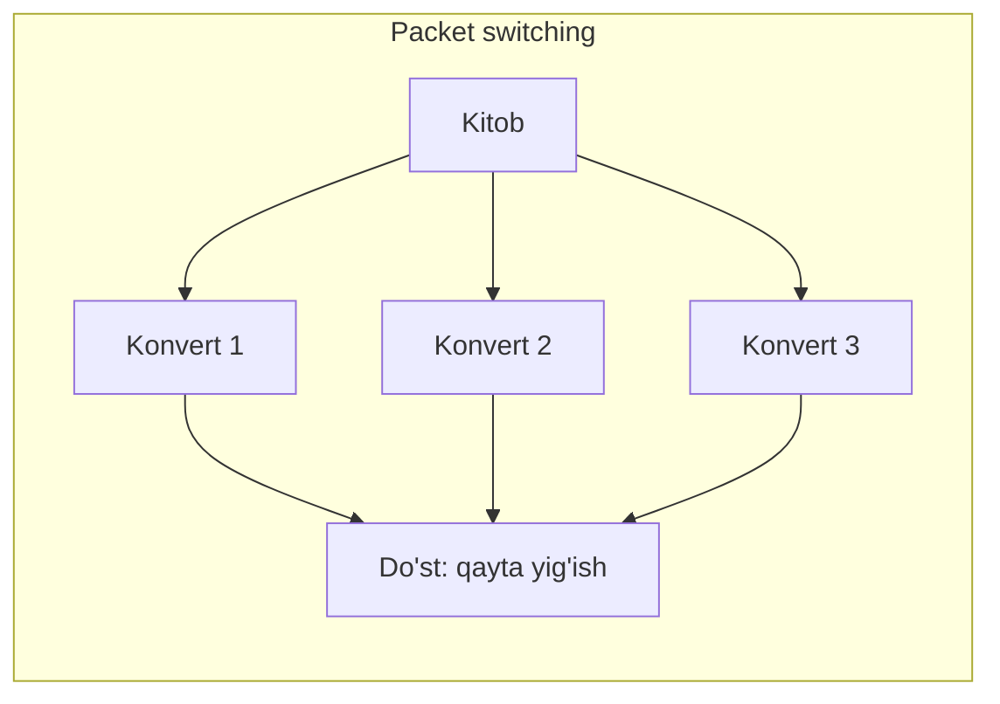
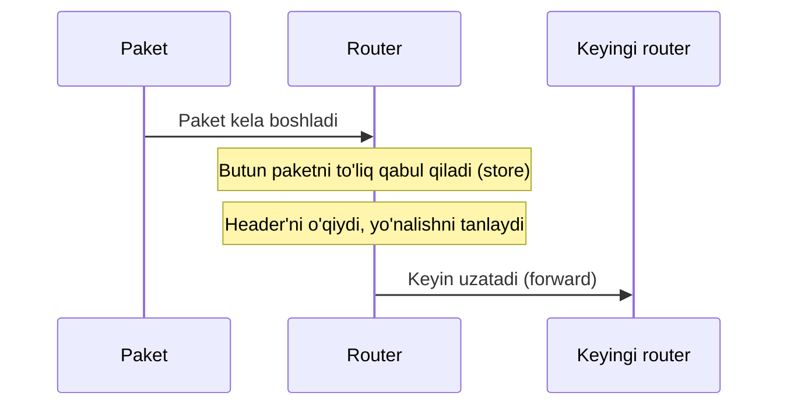
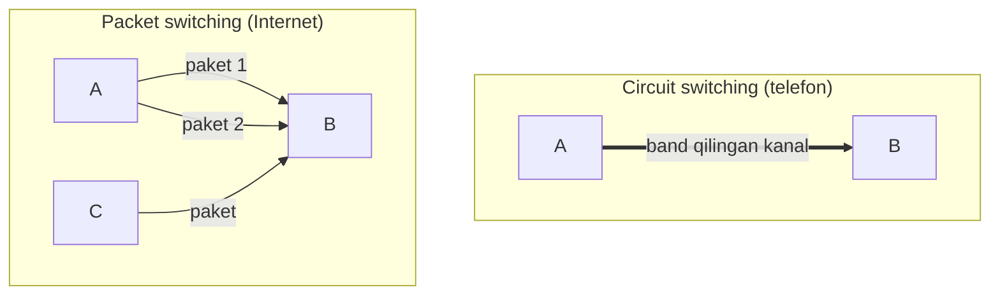
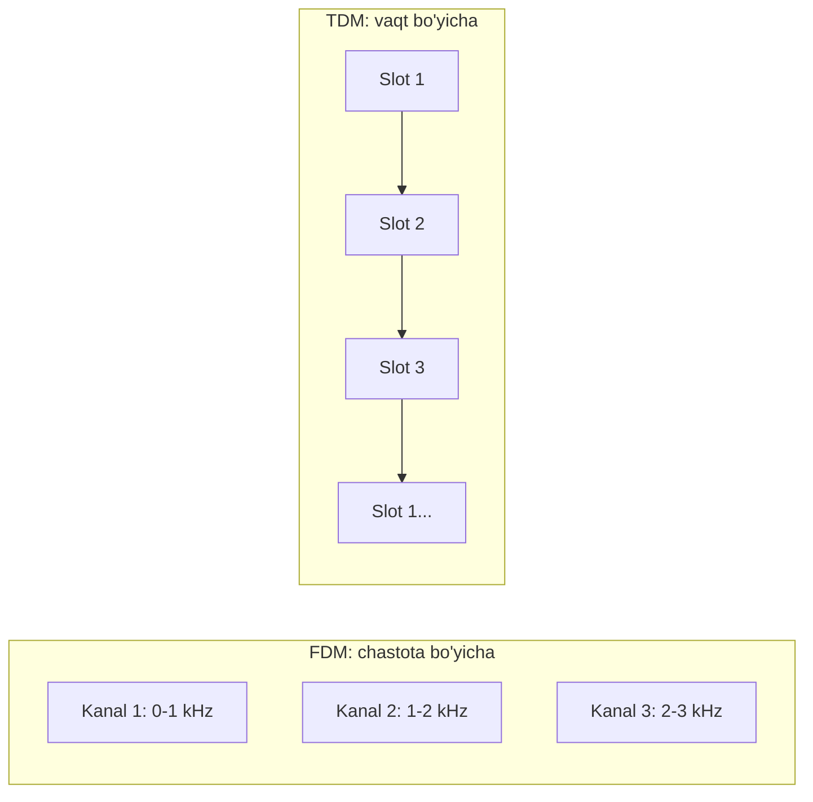

# 04. Network Core va Packet Switching

## Muammo: ma'lumot backbone ichida qanday harakatlanadi?

Oldingi darsda ([03-access-networks](03-access-networks.md)) qurilmangni
ISP'gacha olib bordik. Endi savol: **ma'lumot Internetning "ichi"da, ya'ni
routerlar to'rida qanday harakat qiladi?**

Bu "ichki" qism — **network core** (tarmoq yadrosi). U bir-biriga bog'langan
routerlar to'ridan iborat. Sening xabaring Toshkentdan Frankfurtga borishi
uchun o'nlab routerdan o'tadi. Ular xabarni **qanday** yo'naltiradi? Butun
xabarni birdan yuboradimi, yoki bo'lakma-bo'lak?

Bu darsda ikki asosiy g'oyani o'rganamiz: **packet switching** (paketli
kommutatsiya) va uning raqibi **circuit switching** (kanalli kommutatsiya).

---

## Analogiya: katta kitobni pochta orqali yuborish

Tasavvur qil, do'stingga 500 sahifalik kitobni yubormoqchisan. Ikki yo'l bor:

**1-yo'l (packet switching):** Kitobni sahifalarga bo'lasan, har birini alohida
konvertga solasan, ustiga manzil yozasan va pochtaga tashlaysan. Har bir konvert
mustaqil yo'l bilan boradi. Do'sting ularni sahifa raqami bo'yicha qayta yig'adi.

**2-yo'l (circuit switching):** Kitob uchun butun bir yuk mashinasi va yo'lni
oldindan band qilasan. Yo'l faqat sening kitobing uchun — hech kim ishlatolmaydi.



Internet **1-yo'l**ni tanladi. Nega? Buni tushunish uchun har ikkalasini
solishtiraylik.

Analogiya chegarasi: konvertlar alohida ketsa ham, oxirida bitta pochta
qutisiga tushadi. Internetda esa paketlar turli **routerlar** orqali turli
yo'llar bilan borishi mumkin va kelib qayta yig'iladi.

---

## Sodda ta'rif

> **Packet switching** — katta xabarni kichik **paket**larga bo'lib, har birini
> mustaqil ravishda tarmoq orqali yo'naltirish usuli. Internet aynan shunday ishlaydi.
>
> **Circuit switching** — ikki taraf o'rtasida gaplashishdan **oldin** butun
> yo'lni band qilib, faqat ular uchun saqlash usuli. Eski telefon tarmoqlari shunday ishlagan.

**Paket** (packet) — bu ma'lumotning kichik bo'lagi + ustiga qo'shilgan
**header** (manzil, tartib raqami kabi xizmat ma'lumoti).

---

## Diagramma: paketning safari


Har bir router paketni oladi, header'idagi manzilni o'qiydi va keyingi
router'ga uzatadi. Agar bitta yo'l band bo'lsa, paket boshqa yo'ldan ketishi
mumkin — bu packet switching'ning kuchi.

---

## Store-and-Forward: routerning ish uslubi

Har bir router **store-and-forward** (saqla va uzat) tamoyili bilan ishlaydi:



Ya'ni router paketni **to'liq** qabul qilib bo'lmaguncha uzata boshlamaydi.
Bu xuddi pochta xodimi xatni butunlay o'qib, keyin qayerga jo'natishni hal
qilgani kabi.

---

## Worked example: paketni yuborish vaqti

Bitta paketni bir liniyadan uzatish qancha vaqt oladi? Formula juda oddiy:

```text
// --- Transmission delay formulasi ---
T = L / R

L = paket uzunligi (bit)
R = liniya tezligi (bit/sekund)
T = paketni liniyaga "itarish" vaqti
```

**Misol 1:** Paket 8000 bit, liniya 1 Mbit/s (1,000,000 bit/s):

```text
T = 8000 / 1,000,000 = 0.008 s = 8 ms
```

**Misol 2:** Store-and-forward'da 3 router orqali (har bir hop uchun T):

```text
// --- N ta hop orqali umumiy uzatish vaqti ---
Butun_vaqt ≈ N × T
3 router × 8 ms = 24 ms (faqat uzatish, boshqa delaylarsiz)
```

Har bir router butun paketni saqlab, keyin uzatgani uchun vaqt hop soniga
ko'payadi. Delay turlari haqida to'liq — [06-latency-loss-throughput](06-latency-loss-throughput.md) darsida.

---

## 🤔 O'ylab ko'r

Agar Internet packet switching o'rniga circuit switching ishlatganda, YouTube
video ko'rayotgan 1000 foydalanuvchi bilan nima bo'lardi?

<details>
<summary>💡 Javobni ko'rish</summary>

Har bir foydalanuvchi uchun butun yo'l **oldindan band** qilinardi va ular
video ko'rmayotgan paytda ham (masalan, pauza qilganda) kanal bo'sh
turaverardi — bu ulkan resurs isrofi. Circuit switching bilan bir liniya
faqat cheklangan sonli foydalanuvchini qo'llab-quvvatlar edi.

Packet switching esa har kimning paketlarini **navbatga qo'yib** aralashtiradi,
shuning uchun bir liniya orqali ancha ko'p foydalanuvchiga xizmat qiladi
(statistik multiplexing). Aynan shu tejamkorlik tufayli Internet packet
switching'ni tanladi.
</details>

---

## Packet switching vs Circuit switching



| Xususiyat | Circuit switching | Packet switching |
|-----------|-------------------|------------------|
| Yo'lni oldindan band qilish | Ha | Yo'q |
| Barqaror tezlik | Ha (kafolatlangan) | Yo'q (o'zgaruvchan) |
| Resurs samaradorligi | Past (isrof) | Yuqori |
| Navbat/kechikish | Yo'q | Bor (queuing) |
| Paket yo'qolishi | Yo'q | Mumkin |
| Misol | Eski telefon tarmog'i | Internet |

---

## Circuit switching qanday bo'lardi: FDM va TDM

Circuit switching kanalni ikki usulda bo'ladi (tarixiy kontekst uchun):

- **FDM (Frequency-Division Multiplexing):** har bir suhbatga alohida
  **chastota** ajratiladi (radiostansiyalar kabi — har biri o'z to'lqinida).
- **TDM (Time-Division Multiplexing):** har bir suhbatga navbat bilan qisqa
  **vaqt oralig'i** ajratiladi (aylanma navbat kabi).



Internet bularning ikkalasidan ham voz kechib, statistik multiplexing (paketlarni
umumiy liniyada aralashtirish) ni tanladi — chunki u ancha tejamkor.

---

## Marshrutlash (routing) — qisqacha

Har bir router paketni qayerga yuborishni **routing table** (yo'llar jadvali)
orqali biladi:

| Manzil (IP) | Qaysi port orqali |
|-------------|-------------------|
| 192.168.1.0 | Port 1 |
| 10.0.0.0 | Port 2 |

**Analogiya (Jyo va buvisi):** Jyo Floridadagi buvisiga bormoqda. U yo'lda
odamlardan so'raydi: birinchisi "Floridaga bor", ikkinchisi "Orlandoga buril",
uchinchisi "shu ko'chaga kir", to'rtinchisi "mana bu uy". Har bir odam faqat
**keyingi qadamni** biladi — xuddi routerlar kabi. Routing bo'yicha to'liq
mavzu keyingi modulda (routing) chuqurroq ochiladi.

---

## Ko'p uchraydigan xatolar

⚠️ **Xato 1:** "Bitta xabar bitta yo'l bilan boradi."
Noto'g'ri. Packet switching'da bir xabarning turli paketlari **turli
yo'llar**dan borishi mumkin va manzilga turli tartibda yetib kelishi mumkin.
Ular keyin tartib raqami bo'yicha qayta yig'iladi (bu — TCP vazifasi).

⚠️ **Xato 2:** "Router paketni oladi va darhol uzatadi."
Noto'g'ri. Store-and-forward tufayli router paketni **to'liq** qabul qilib
bo'lmaguncha uzata boshlamaydi. Shuning uchun har hop qo'shimcha vaqt qo'shadi.

⚠️ **Xato 3:** "Circuit switching packet switching'dan yomonroq."
Noto'g'ri. Circuit switching **barqaror tezlik** kafolatlaydi — bu ba'zi
holatlarda (masalan, eski telefon ovozi) muhim edi. Lekin Internetning
ko'p foydalanuvchili, o'zgaruvchan trafigi uchun packet switching tejamkorroq.

---

## Xulosa

- **Network core** — Internetning "ichi", o'zaro bog'langan routerlar to'ri.
- **Packet switching** — xabarni paketlarga bo'lib, mustaqil yo'naltirish. Internet shunday.
- **Circuit switching** — yo'lni oldindan band qilish. Eski telefon shunday.
- Router **store-and-forward**: paketni to'liq oladi, keyin uzatadi.
- Uzatish vaqti: `T = L / R` (paket hajmi / liniya tezligi).
- Packet switching tejamkor, lekin navbat va yo'qolish mumkin.
- Circuit switching barqaror, lekin resurs isrof qiladi.

---

## 🧠 Eslab qol

- Internet = packet switching (paketlar mustaqil yo'lda).
- Router = store-and-forward (to'liq ol, keyin uzat).
- T = L / R — bitta paketni uzatish vaqti.
- Circuit = barqaror lekin isrof; Packet = tejamkor lekin navbatli.

---

## ✅ O'z-o'zini tekshir

<details>
<summary>1. Nima uchun Internet circuit switching emas, packet switching'ni tanladi?</summary>

Chunki packet switching **ancha tejamkor**. Circuit switching har ulanish
uchun butun yo'lni band qiladi va foydalanilmayotganda ham bo'sh turadi.
Packet switching esa paketlarni umumiy liniyada aralashtiradi (statistik
multiplexing), shu tufayli bir liniya orqali ko'p foydalanuvchiga xizmat qiladi.
</details>

<details>
<summary>2. Store-and-forward nima va u nega vaqtga ta'sir qiladi?</summary>

Store-and-forward — routerning paketni **to'liq** qabul qilib bo'lgunicha
uzatmasligi. Har router butun paketni saqlashi kerak bo'lgani uchun, N ta
router orqali umumiy uzatish vaqti taxminan N × T ga oshadi.
</details>

<details>
<summary>3. Paket 16000 bit, liniya 2 Mbit/s. Bitta hop uzatish vaqti qancha?</summary>

`T = L / R = 16000 / 2,000,000 = 0.008 s = 8 ms`. Ya'ni bitta liniyadan
paketni "itarish" 8 millisekund oladi.
</details>

<details>
<summary>4. Nega bir xabarning paketlari manzilga tartibsiz kelishi mumkin?</summary>

Chunki packet switching'da har bir paket **mustaqil** yo'naltiriladi va
turli routerlar/yo'llar orqali borishi mumkin. Ba'zi yo'l tezroq, ba'zisi
sekinroq bo'lgani uchun paketlar tartibsiz yetib kelishi mumkin. Ularni
qayta tartiblash — transport layer (TCP) ning vazifasi.
</details>

---

## 🛠 Amaliyot

1. **Oson (kuzatish):** `ping google.com` ni ishga tushir. Har bir javob —
   bu bir paketning borib-qaytishi (RTT). Vaqtlar bir xilmi yoki o'zgaruvchanmi?
   Nega o'zgaruvchan ekanini packet switching bilan bog'la.

   <details><summary>Hint</summary>O'zgaruvchanlik — turli paketlar turli
   navbatlarga tushgani uchun. Bu circuit switching'da bo'lmasdi.</details>

2. **O'rta (hisoblash):** 1 MB (8,000,000 bit) faylni 10 Mbit/s liniyadan
   uzatish uchun necha sekund kerak? Formulani qo'lla.

   <details><summary>Hint</summary>T = L / R = 8,000,000 / 10,000,000 = 0.8 s.
   (Bu faqat transmission delay, boshqa delaylarsiz.)</details>

3. **Qiyin (tahlil):** `traceroute` ni ikki marta, 5 daqiqa oralab ishga
   tushir. Yo'l (routerlar ketma-ketligi) o'zgardimi? Nega packet switching'da
   yo'l o'zgarishi mumkinligini tushuntir.

   <details><summary>Hint</summary>Routing table'lar yangilanishi yoki yuk
   balansi tufayli yo'l o'zgarishi mumkin — bu packet switching'ning moslashuvchanligi.</details>

---

## 🔁 Takrorlash

- **Bog'liq darslar:** [01-tarmoq-va-internet-nima](01-tarmoq-va-internet-nima.md),
  [05-internet-tuzilishi-isp](05-internet-tuzilishi-isp.md),
  [06-latency-loss-throughput](06-latency-loss-throughput.md).
- **Takrorlash jadvali:** ertaga → 3 kundan keyin → 1 haftadan keyin savollarga qayt.
- **Feynman testi:** "Nega Internet paketli?" degan savolga "kitobni sahifalarga
  bo'lib yuborish" analogiyasi orqali 3 jumlada tushuntir.

---

## 📚 Manbalar

- Kurose & Ross, *Computer Networking: A Top-Down Approach*, 1-bob (network core, packet switching)
- [Packet switching — Wikipedia](https://en.wikipedia.org/wiki/Packet_switching)
- [Internet protocol suite — Wikipedia](https://en.wikipedia.org/wiki/Internet_protocol_suite)
- [CDN Internet Backbone Explained — BlazingCDN](https://blog.blazingcdn.com/en-us/cdn-internet-backbone-explained-anycast-ixps-tier-1-networks)
