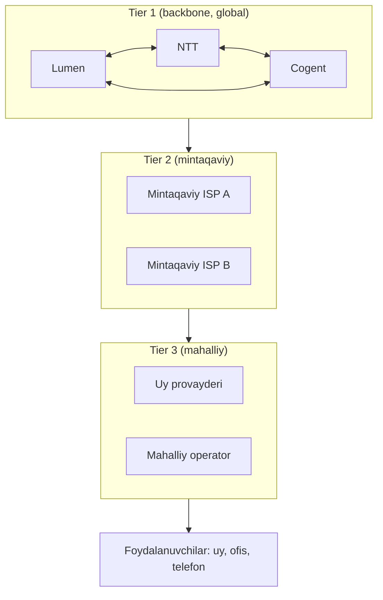
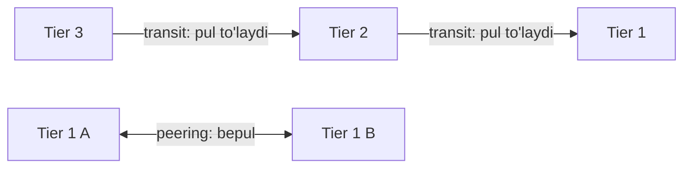
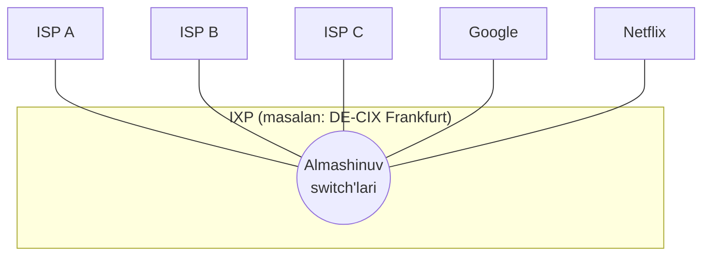
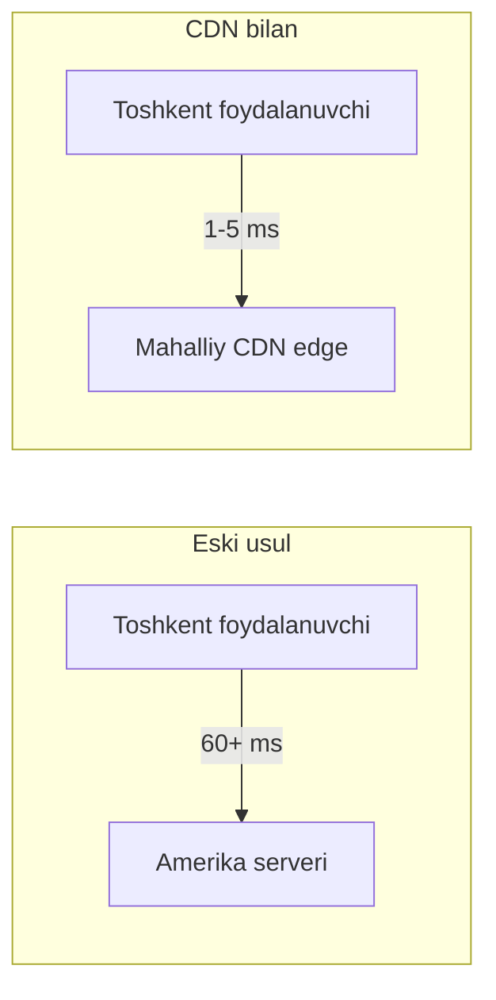

# 05. Internet tuzilishi — ISP ierarxiyasi, IXP va CDN

## Muammo: dunyodagi hamma tarmoqni qanday ulash mumkin?

Oldingi darslarda ([04-network-core-va-packet-switching](04-network-core-va-packet-switching.md))
paketlar routerlar orqali ketishini ko'rdik. Lekin **bir muammo qoladi:**
dunyoda millionlab alohida tarmoq bor — har birining o'z egasi, texnologiyasi,
narxi. Ularni **qanday** qilib bir-biriga ulab, "yagona Internet" hosil qilamiz?

Buni faqat texnologiya bilan hal qilib bo'lmaydi — bu ko'proq **iqtisodiyot**
va **kelishuvlar** masalasi. Kim kimga pul to'laydi? Kim bepul ma'lumot
almashadi? Mana shu savollar Internetning haqiqiy tuzilishini belgilaydi.

---

## Analogiya: pochta va yo'l tizimi

Tasavvur qil, mamlakatda pochtani qanday tashkil qilardik:

- **Mahalliy pochta bo'limi** — sening tumaningdagi (mahalliy ISP).
- **Viloyat markazi** — bir necha tumanni ulaydi (mintaqaviy ISP).
- **Poytaxt bosh markazi** — barcha viloyatni va xalqaro yo'nalishlarni ulaydi (Tier 1).
- **Xalqaro almashinuv markazi** — turli davlatlar pochtasi uchrashadigan joy (IXP).

Har bir daraja o'zidan yuqoridagiga tayanadi. Aynan shunday **ierarxiya**
Internetda ham bor. Keling, uni bosqichma-bosqich quraylik.

---

## Sodda ta'rif

> **ISP (Internet Service Provider)** — Internet xizmatini ko'rsatuvchi kompaniya.
> ISP'lar o'zaro **ierarxik** ulangan: kichigi kattasiga tayanadi.
>
> Bu ierarxiya **Tier 1 → Tier 2 → Tier 3** darajalariga bo'linadi.

---

## Diagramma: ISP ierarxiyasi



- **Tier 1** — hech kimga pul **to'lamaydi**, butun Internetga to'g'ridan-to'g'ri
  ulangan (bir-biri bilan **peering** orqali).
- **Tier 2** — Tier 1'dan trafik **sotib oladi** (transit), lekin ba'zi peering ham bor.
- **Tier 3** — faqat yuqoridagilardan trafik sotib oladi (oxirgi mil ISP).
- **Foydalanuvchilar** — sen, men, uy va ofislar.

---

## Notional machine: kim kimga pul to'laydi?

Bu tuzilmaning "yuragi" — pul oqimi. Ikki xil kelishuv turi bor:

| Kelishuv | Kim bilan | Pul | Analogiya |
|----------|-----------|-----|-----------|
| **Transit** | Kichik ISP → katta ISP | Kichigi **to'laydi** | Kimdandir yo'l ijaraga olish |
| **Peering** | Teng ISP'lar orasida | Odatda **bepul** | Ikki qo'shni bepul xizmat kelishuvi |



Ya'ni pastdagi ISP yuqoridagiga **transit** uchun to'laydi, teng darajadagilar
esa **peering** orqali bepul ma'lumot almashadi. Bu — Internet iqtisodiyotining
asosi.

---

## IXP: Internet almashinuv nuqtalari

Har bir ISP boshqasiga alohida sim tortishi juda qimmat. Buning o'rniga
ular bitta joyda uchrashadi — bu **IXP** (Internet Exchange Point).

> **IXP** — bu maxsus bino/data-markaz, u yerda ko'plab ISP va kontent
> provayder o'zaro ulanib, to'g'ridan-to'g'ri (peering orqali) ma'lumot almashadi.

**Analogiya:** yirik ulgurji bozor — barcha sotuvchilar bir joyga yig'iladi,
har biri boshqasiga alohida borishga hojat qolmaydi.



**2025-2026 statistikasi:**

- **DE-CIX Frankfurt** (Yevropadagi eng katta IXP) muntazam **16-17 Tbit/s**
  dan oshadi.
- Dunyo bo'yicha eng yirik 30 IXP'da peering ulanishlari 2024-2026 orasida **18%**
  o'sdi.
- O'zbekistonda **TAS-IX** (Toshkent) — mahalliy trafik shu yerda almashadi,
  shuning uchun mahalliy saytlar juda tez ochiladi.

---

## CDN: kontentni foydalanuvchiga yaqinlashtirish

Google, Netflix, Facebook kabi gigantlar bir muammoga duch keldi: agar
video har safar Amerikadan kelsa, dunyoning boshqa chetidagi foydalanuvchi
uchun sekin bo'ladi. Yechim — **CDN** (Content Delivery Network).

> **CDN** — kontentning nusxalarini dunyo bo'ylab ko'plab serverlarga
> (foydalanuvchilarga yaqin) tarqatadigan tarmoq.



Aynan shu tufayli YouTube video ba'zan juda tez, ba'zan sekin ochiladi:
tez bo'lsa — kontent yaqin CDN edge'dan kelmoqda; sekin bo'lsa — uzoq
serverdan. Zamonaviy CDN operatorlari **uchta usulni** birga ishlatadi:
uzoq manzillar uchun transit, mintaqaviy hajm uchun IXP peering, va eng katta
tarmoqlar uchun to'g'ridan-to'g'ri ulanish (PNI).

---

## Worked example: YouTube videosi qanday yetib keladi?

```text
// --- 1-qadam: DNS foydalanuvchiga eng yaqin serverni tanlaydi ---
"youtube.com" so'rovi Toshkentga eng yaqin Google edge'ga yo'naltiriladi.

// --- 2-qadam: kontent allaqachon yaqin edge'da (cache) ---
Mashhur video mahalliy CDN serverida saqlangan bo'ladi (cache hit).

// --- 3-qadam: mahalliy IXP orqali yetkaziladi ---
Google IXP (masalan TAS-IX) orqali ISP'ga to'g'ridan-to'g'ri ulangan.

// --- Natija: past latency ---
Video Amerikadan emas, shahar ichidan keladi -> 1-5 ms, tez ochiladi.
```

---

## 🤔 O'ylab ko'r

Nima uchun ikki Tier 1 ISP bir-biriga trafik uchun pul **to'lamaydi** (peering),
lekin Tier 3 ISP Tier 1'ga to'laydi (transit)?

<details>
<summary>💡 Javobni ko'rish</summary>

Chunki ikki Tier 1 **teng** — ikkalasi ham global qamrovga ega va bir-biriga
bir xil qiymatli ma'lumot beradi. Peering ikkalasiga ham foyda, shuning uchun
bepul kelishadi.

Tier 3 esa Tier 1'dan **ko'proq narsa oladi** (butun Internetga chiqish
imkoni), lekin Tier 1'ga deyarli hech narsa bermaydi. Bu nomutanosib
munosabat bo'lgani uchun Tier 3 transit uchun to'laydi. Ya'ni pul oqimi
"kim kimga qancha qiymat beradi" degan iqtisodiy mantiqqa asoslangan.
</details>

---

## Qo'shimcha tushunchalar

| Atama | Ma'nosi | Nega kerak |
|-------|---------|------------|
| **PoP (Point of Presence)** | ISP'ning har shahardagi "ofisi" (router/server) | Foydalanuvchiga yaqin ulanish nuqtasi |
| **Multihoming** | Bir tarmoq bir necha ISP'ga ulangan | Biri o'lsa, ikkinchisi ishlaydi (zaxira) |
| **AS (Autonomous System)** | Mustaqil boshqariladigan tarmoq birligi | Har ISP o'z AS raqamiga ega |
| **BGP** | AS'lar orasidagi routing protokoli | "Google'ga qanday borishni" bilish |

Bu atamalarning ba'zilari keyingi modullarda (routing, IP services) chuqurroq ochiladi.

---

## Ko'p uchraydigan xatolar

⚠️ **Xato 1:** "Internet — bu bitta katta kompaniyaga tegishli."
Noto'g'ri. Internetning **egasi yo'q**. U minglab mustaqil ISP va tarmoqlarning
o'zaro kelishuvlaridan tashkil topgan. Hech kim uni to'liq boshqarmaydi.

⚠️ **Xato 2:** "Tier 1 — bu eng tez internet."
Noto'g'ri. "Tier" tezlik emas, **iqtisodiy joylashuv**ni bildiradi. Tier 1 —
hech kimga to'lamaydigan backbone provayder. Uy foydalanuvchisi uchun tezlik
ko'proq access network turiga (fiber/cable) bog'liq.

⚠️ **Xato 3:** "CDN — bu shunchaki ko'p server."
Qisman. CDN nafaqat ko'p server, balki **aqlli tarqatish** tizimi: DNS,
anycast va cache orqali har foydalanuvchini **eng yaqin** serverga
yo'naltiradi. Asosiy maqsad — latencyni kamaytirish.

---

## Xulosa

- Internetning **egasi yo'q** — u ISP'lar kelishuvlaridan tashkil topgan.
- ISP'lar ierarxik: **Tier 1** (backbone) → **Tier 2** (mintaqaviy) → **Tier 3** (mahalliy).
- Ikki kelishuv turi: **transit** (kichigi to'laydi), **peering** (tenglar bepul).
- **IXP** — ISP'lar uchrashib bepul ma'lumot almashadigan bino (DE-CIX, TAS-IX).
- **CDN** — kontentni foydalanuvchiga yaqinlashtiradi, latencyni kamaytiradi.
- Internet tuzilishi — texnologiya emas, ko'proq **iqtisodiyot** masalasi.

---

## 🧠 Eslab qol

- Internetning egasi yo'q — ISP'lar to'ri.
- Tier = iqtisodiy joylashuv, tezlik emas.
- Transit = pul to'lash, Peering = bepul almashish.
- IXP = ISP'lar bozori; CDN = kontent yaqinlashtiruvchi.

---

## ✅ O'z-o'zini tekshir

<details>
<summary>1. "Internetni kim boshqaradi?" degan savolga qanday javob berasan?</summary>

Hech kim yagona egasi emas. Internet — minglab mustaqil ISP va tarmoqning
o'zaro **kelishuvlari** (transit va peering) natijasi. IETF standartlarni
belgilaydi, ICANN domen va IP raqamlarni boshqaradi, lekin "boshliq" yo'q.
Bu — markazlashmagan tizim.
</details>

<details>
<summary>2. Transit va peering farqi nima?</summary>

**Transit** — kichik ISP katta ISP'ga butun Internetga chiqish uchun **pul
to'laydi**. **Peering** — teng darajadagi ikki ISP o'zaro **bepul** ma'lumot
almashadi, chunki ikkalasiga ham foydali. Farq — iqtisodiy munosabatda.
</details>

<details>
<summary>3. Nega mahalliy saytlar (TAS-IX ichidagilar) xorijiy saytlardan tez ochiladi?</summary>

Chunki mahalliy trafik **IXP** (TAS-IX) ichida almashadi — ma'lumot davlatdan
chiqib xalqaro yo'nalishga bormaydi. Masofa kichik, hop soni kam, shuning uchun
latency past. Xorijiy sayt esa dengiz osti kabellari orqali uzoq yo'l bosadi.
</details>

<details>
<summary>4. CDN latencyni qanday kamaytiradi?</summary>

CDN kontentning nusxalarini foydalanuvchilarga **yaqin** serverlarda saqlaydi
(cache). DNS va anycast orqali har so'rov **eng yaqin** edge serverga
yo'naltiriladi. Shu tufayli ma'lumot uzoq (masalan Amerika) serveridan emas,
shahar ichidan keladi — masofa qisqaradi, latency tushadi.
</details>

---

## 🛠 Amaliyot

1. **Oson (kuzatish):** `traceroute youtube.com` va `traceroute` bilan mahalliy
   sayt (masalan mahalliy .uz sayt) ni solishtir. Qaysi biri kamroq hop va
   past latency bilan yetadi? Nega?

   <details><summary>Hint</summary>Mahalliy sayt IXP ichida qoladi — kam hop,
   past ms. Xorijiy sayt xalqaro yo'nalishga chiqadi — ko'p hop.</details>

2. **O'rta (tahlil):** `whois` yoki onlayn "IP lookup" orqali biror saytning
   IP'sini top va u qaysi AS (Autonomous System)ga tegishli ekanini aniqla.
   Bu ISP qaysi darajada (taxminan) ekanini o'yla.

   <details><summary>Hint</summary>bgp.he.net saytida AS raqamini qidir —
   uning peering va transit aloqalarini ko'rasan.</details>

3. **Qiyin (loyihalash):** Kichik davlat uchun Internet infratuzilmasini
   chizib chiq: nechta Tier 3 ISP, ular qaysi IXP'da uchrashadi, xalqaro
   ulanish qanday, CDN qayerda joylashadi.

   <details><summary>Hint</summary>Bitta milliy IXP + 2-3 xalqaro Tier 1
   transit + yirik CDN'lar (Google, Cloudflare) uchun mahalliy cache.</details>

---

## 🔁 Takrorlash

- **Bog'liq darslar:** [04-network-core-va-packet-switching](04-network-core-va-packet-switching.md),
  [01-tarmoq-va-internet-nima](01-tarmoq-va-internet-nima.md),
  [06-latency-loss-throughput](06-latency-loss-throughput.md).
- **Takrorlash jadvali:** ertaga → 3 kundan keyin → 1 haftadan keyin savollarga qayt.
- **Feynman testi:** "Internet qanday tuzilgan?" degan savolga "pochta ierarxiyasi"
  analogiyasi orqali do'stingga 3 jumlada tushuntir.

---

## 📚 Manbalar

- Kurose & Ross, *Computer Networking: A Top-Down Approach*, 1-bob (network of networks)
- [CDN Internet Backbone Explained: Anycast, IXPs, Tier 1 — BlazingCDN](https://blog.blazingcdn.com/en-us/cdn-internet-backbone-explained-anycast-ixps-tier-1-networks)
- [What is an Internet Exchange Point? — Cloudflare](https://www.cloudflare.com/learning/cdn/glossary/internet-exchange-point-ixp/)
- [Tier 1 ISPs: A Comprehensive Guide — Macronet Services](https://macronetservices.com/tier-1-isps-a-comprehensive-guide-to-global-internet-connectivity/)
- [Internet Exchange Points Guide — Netrality](https://netrality.com/blog/internet-exchange-points-ixp-network-peering/)
