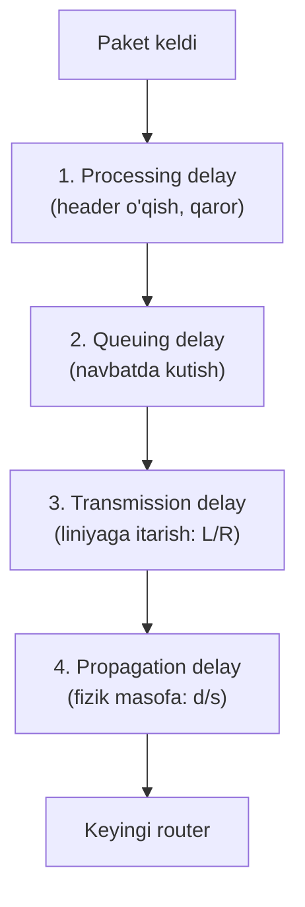
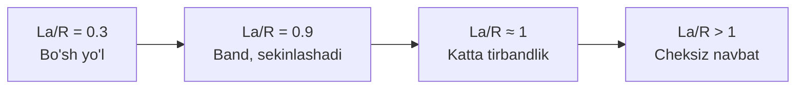

# 06. Latency, Packet Loss va Throughput

## Muammo: nega Internet ba'zan sekin ishlaydi?

Ideal dunyoda Internet doim tez va ishonchli bo'lardi. Reallik esa boshqacha:
video buferlanadi, o'yinda "lag" bo'ladi, fayl sekin yuklanadi, ba'zan paket
umuman yo'qoladi. **Nega?**

Oldingi darsda ([05-internet-tuzilishi-isp](05-internet-tuzilishi-isp.md)) paket
o'nlab router orqali o'tishini ko'rdik. Har bir router va liniya paketga
**kechikish** (delay) qo'shadi. Bu darsda biz uch asosiy o'lchovni o'rganamiz:
**latency** (kechikish), **packet loss** (yo'qolish) va **throughput** (o'tkazish
qobiliyati). Bularsiz "internetim nega sekin" degan savolga javob bera olmaysan.

---

## Analogiya: McDonald's navbatida

Buyurtma berish uchun McDonald's ga kelding. Vaqt qayerlarda ketadi?


- **Navbatda kutish** — oldingdagi odamlar tugashini kutasan (queuing delay).
- **Kassir o'qishi** — qaror qabul qilish (processing delay).
- **Tayyorlash** — buyurtmani "chiqarish" (transmission delay).
- **Sen ovqatgacha yurish** — fizik masofa (propagation delay).

Aynan shu to'rt turdagi kechikish har paketda ham bor. Endi ularni birma-bir
ko'ramiz.

Analogiya chegarasi: McDonald's da faqat bitta kassa, paket esa **o'nlab
router** orqali o'tadi — har birida bu to'rt kechikish takrorlanadi.

---

## Sodda ta'rif

> **Latency** — paketning A nuqtadan B nuqtaga yetib borish vaqti (kechikish).
>
> **Packet loss** — router buferi to'lib, paket tashlab yuborilishi (yo'qolishi).
>
> **Throughput** — vaqt birligida haqiqatda o'tkazilgan ma'lumot miqdori (real tezlik).

---

## To'rt turdagi delay

Har bir routerdagi umumiy kechikish 4 qismdan iborat:



```text
// --- Umumiy nodal delay ---
d_total = d_proc + d_queue + d_trans + d_prop
```

| # | Delay turi | Nima | Vaqt | Nimaga bog'liq |
|---|-----------|------|------|----------------|
| 1 | **Processing** | Header o'qish, yo'nalish tanlash | Mikrosekundlar | Router sifati |
| 2 | **Queuing** | Navbatda kutish | 0 - millisekundlar | Tarmoq bandligi |
| 3 | **Transmission** | Paketni liniyaga itarish | Mikro-millisekund | Paket hajmi, liniya tezligi |
| 4 | **Propagation** | Fizik masofani bosib o'tish | Millisekundlar | Masofa |

### Ikki muhim formula

```text
// Transmission delay: paketni "itarish"
d_trans = L / R    (L = paket hajmi bit, R = liniya tezligi bit/s)

// Propagation delay: fizik masofa
d_prop = d / s     (d = masofa metr, s = signal tezligi ~2x10^8 m/s)
```

**Diqqat qil:** transmission va propagation ni chalkashtirma. Transmission —
paketni **kabelga chiqarish** vaqti; propagation — u kabel bo'ylab **uchib
o'tish** vaqti. Kichik paket ham uzoq masofaga borishi uchun uzoq propagation kerak.

---

## Worked example: Instagramga rasm yuklash

Toshkentdan Frankfurtdagi serverga rasm yuklayapsan (subgoal label'lar bilan):

```text
// --- 1. Processing delay ---
15 router × 2 mikrosekund = 30 mikrosekund ≈ 0.03 ms (juda kichik)

// --- 2. Transmission delay ---
Fiber internet (100 Mbit/s), rasm paketlari -> ~1 ms

// --- 3. Propagation delay ---
Masofa ~5000 km, signal ~200,000 km/s -> 5000/200000 = 0.025 s = 25 ms

// --- 4. Queuing delay ---
Tarmoq bandligiga qarab 5-50 ms (eng o'zgaruvchan!)

// --- JAMI ---
d_total ≈ 30-80 ms (asosan propagation + queuing)
```

**Xulosa:** uzoq masofada **propagation** hukmron, band tarmoqda **queuing**
hukmron. Boshqa ikkisi odatda kichik.

---

## Queuing delay: eng qiyin va muhim

Boshqa uch delay doimiy va hisoblab bo'ladigan. Queuing esa **har doim
o'zgaradi**. Uni tushunish uchun **trafik intensivligi** formulasi bor:

```text
// Trafik intensivligi
Intensivlik = (L × a) / R

L = paket hajmi (bit)
a = sekundiga necha paket keladi
R = liniya tezligi (bit/s)
```

> **Oltin qoida:** agar `La/R > 1` bo'lsa — FALOKAT! Navbat cheksiz uzayadi.



| Intensivlik | Holat | Navbat kechikishi | Misol |
|-------------|-------|-------------------|-------|
| 0 - 0.3 | Juda yaxshi | Deyarli 0 | Tong vaqti |
| 0.3 - 0.7 | Yaxshi | Kam | Oddiy kun |
| 0.7 - 0.9 | O'rta | O'sib boradi | Kechqurun |
| 0.9 - 0.99 | Yomon | Juda katta | Peak vaqt |
| 1.0+ | Falokat | Cheksiz | Server crash |

**Yo'l analogiyasi:** `La/R = 0.5` — yo'l bo'sh, tez ketasan. `La/R = 0.99` —
kichik avariya butun yo'lni to'xtatadi. `La/R > 1` — to'liq tirbandlik.

---

## 🤔 O'ylab ko'r

McDonald's da har daqiqada 10 mijoz keladi, lekin xodimlar daqiqada faqat 8
mijozga xizmat qila oladi. Nima bo'ladi?

<details>
<summary>💡 Javobni ko'rish</summary>

Intensivlik = 10/8 = **1.25 > 1** — bu falokat holati. Navbat **to'xtovsiz
uzayib** boradi, chunki kelish tezligi xizmat tezligidan yuqori. Vaqt o'tgani
sari kutish vaqti cheksiz oshadi va odamlar chiqib keta boshlaydi.

Tarmoqda ham xuddi shunday: agar liniyaga kelayotgan ma'lumot uning tezligidan
oshsa (`La/R > 1`), router buferi to'lib, paketlar **yo'qola** boshlaydi.
</details>

---

## Packet loss: paket nega yo'qoladi?

Router buferi (navbat) **cheklangan hajmga** ega. Agar paketlar bufer to'lgandan
keyin ham kelaversa, yangi paketlar **tashlab yuboriladi** (drop).


**Restoran analogiyasi:** 20 o'rindiqli restoranga 25 kishi keldi — 5 kishi
kira olmaydi va ketadi. Bu — packet loss. TCP yo'qolgan paketni **qayta
so'raydi**, UDP esa uni tashlab ketadi (bu haqda transport layer darsida).

---

## Throughput: bottleneck qonuni

**Throughput** — bu haqiqiy uzatilayotgan tezlik. Uni bitta oddiy qoida boshqaradi:

> **Oltin qoida:** throughput yo'lning **eng sekin bo'g'ini** (bottleneck) bilan
> cheklanadi.

```text
// Throughput formulasi
Throughput = min{R1, R2, R3, ..., Rn}
```


**Quvur analogiyasi:** katta idish → **kichik quvur** → katta idish. Kichik
quvur butun oqimni sekinlashtiradi. Zanjir eng zaif bo'g'inicha kuchli.

**Misol:** 32 MB fayl, server 2 Mbit/s, sening internet 1 Mbit/s beradi:

```text
Throughput = min{2, 1} = 1 Mbit/s
Vaqt = 32 MB (256 Mbit) / 1 Mbit/s = 256 sekund ≈ 4.3 daqiqa
```

---

## Bandwidth vs Throughput — chalkashtirma!

| Atama | Ma'nosi | Analogiya |
|-------|---------|-----------|
| **Bandwidth** | Maksimal nazariy tezlik | Quvurning diametri |
| **Throughput** | Haqiqiy erishilgan tezlik | Quvurdan real oqayotgan suv |

Bandwidth 100 Mbit/s bo'lishi mumkin, lekin throughput 80 Mbit/s (overhead,
qayta uzatish, bottleneck tufayli). **Throughput har doim bandwidth'dan kichik yoki teng.**

---

## Boshqa muhim atamalar

| Atama | Ma'nosi |
|-------|---------|
| **RTT (Round Trip Time)** | Paket borib-qaytish vaqti (`ping` shuni ko'rsatadi) |
| **Jitter** | Kechikishning o'zgaruvchanligi (video/ovoz uchun muhim) |
| **End-to-End Delay** | Manbadan manzilgacha to'liq kechikish |

---

## Zamonaviy yechimlar

- **CDN** — kontentni yaqinlashtirib **propagation** delayni kamaytiradi.
- **QoS (Quality of Service)** — muhim trafikka (video call) ustuvorlik berib **queuing**ni kamaytiradi.
- **HTTP/3 + QUIC** — paket yo'qolishiga bardoshli, head-of-line blocking'ni yo'qotadi.
- **5G / Fiber** — throughput va latencyni yaxshilaydi (5G latency 1-10 ms).

---

## Ko'p uchraydigan xatolar

⚠️ **Xato 1:** "Bandwidth va tezlik bir narsa."
Noto'g'ri. Bandwidth — **nazariy maksimum**, throughput — **real tezlik**.
"Menga 100 Mbit va'da qilishdi, lekin 60 tushyapti" — bu normal, chunki
throughput overhead va bottleneck tufayli har doim kichikroq.

⚠️ **Xato 2:** "Yuqori bandwidth = past latency."
Noto'g'ri. Bular **mustaqil**. Sun'iy yo'ldosh interneti yuqori bandwidth
bera oladi, lekin katta masofa tufayli latency baland. O'yin va video call
uchun **latency** muhimroq, fayl yuklash uchun **bandwidth**.

⚠️ **Xato 3:** "Transmission va propagation delay bir xil."
Noto'g'ri. Transmission — paketni **kabelga chiqarish** (L/R). Propagation —
u kabel bo'ylab **uchib o'tish** (d/s). Kichik paket ham uzoq masofaga uchishi
uchun ko'p propagation delay talab qiladi.

---

## Xulosa

- **Latency** = kechikish, 4 qismdan: processing + queuing + transmission + propagation.
- `d_trans = L/R` (itarish), `d_prop = d/s` (masofa) — chalkashtirma.
- **Queuing delay** eng o'zgaruvchan; `La/R > 1` bo'lsa navbat cheksiz.
- **Packet loss** — bufer to'lganda paket tashlab yuboriladi.
- **Throughput** = eng sekin bo'g'in (`min{R1...Rn}`), bottleneck qonuni.
- **Bandwidth ≠ throughput**: nazariy maksimum vs real tezlik.
- Latency va bandwidth **mustaqil** — biri past bo'lsa, ikkinchisi baland bo'lishi mumkin.

---

## 🧠 Eslab qol

- 4 delay: processing, queuing, transmission, propagation.
- La/R > 1 = falokat (cheksiz navbat).
- Throughput = min{barcha liniyalar} (bottleneck).
- Bandwidth = quvur diametri; throughput = real oqim.

---

## ✅ O'z-o'zini tekshir

<details>
<summary>1. Video call uchun latency muhimmi yoki bandwidth? Nega?</summary>

**Latency** muhimroq. Video call'da ma'lumot **real vaqtda** kelishi kerak —
100 ms dan yuqori kechikish suhbatni noqulay qiladi. Bandwidth esa faqat
kichik sifatga ta'sir qiladi. Fayl yuklashda esa aksincha — bandwidth muhimroq,
kechikish sezilmaydi.
</details>

<details>
<summary>2. Server 50 Mbit/s beradi, sening internet 20 Mbit/s, oradagi liniya 10 Mbit/s. Throughput qancha?</summary>

`Throughput = min{50, 20, 10} = 10 Mbit/s`. Eng sekin bo'g'in (bottleneck)
butun tezlikni belgilaydi. Boshqa liniyalar tez bo'lsa ham, 10 Mbit/s'lik
bo'g'in butun zanjirni cheklaydi.
</details>

<details>
<summary>3. Nima uchun kechqurun internet ko'pincha sekinlashadi?</summary>

Kechqurun ko'p odam bir vaqtda foydalanadi — liniyaga kelayotgan trafik
oshadi, ya'ni `La/R` 1 ga yaqinlashadi. Bu **queuing delay**ni keskin
oshiradi va bufer to'lsa **packet loss** ham boshlanadi. Shuning uchun video
buferlanadi, sahifalar sekin ochiladi.
</details>

<details>
<summary>4. Paket 8000 bit, liniya 4 Mbit/s. Transmission delay qancha?</summary>

`d_trans = L / R = 8000 / 4,000,000 = 0.002 s = 2 ms`. Bu faqat paketni
liniyaga itarish vaqti — propagation (masofa) alohida qo'shiladi.
</details>

---

## 🛠 Amaliyot

1. **Oson (o'lchash):** `ping google.com` va `ping <mahalliy sayt>` ni
   solishtir. RTT (ms) qaysida past? Nega? Propagation delay bilan bog'la.

   <details><summary>Hint</summary>Mahalliy = kam masofa = past propagation =
   past RTT. Xorijiy = uzoq = yuqori RTT.</details>

2. **O'rta (hisoblash):** 100 MB fayl, sening internet 25 Mbit/s. Faqat
   transmission delay bo'yicha necha sekund kerak? (1 byte = 8 bit)

   <details><summary>Hint</summary>100 MB = 800 Mbit. T = 800 / 25 = 32 s.</details>

3. **Qiyin (tahlil):** `ping` ni 30 marta ishga tushir va natijalarni yoz.
   Eng past, eng baland va o'rtacha RTT'ni hisobla. Farq (jitter)ni tahlil qil:
   nega ba'zi paketlar boshqalaridan sekinroq keldi?

   <details><summary>Hint</summary>`ping -c 30 google.com` (Linux/Mac).
   Farq — queuing delayning o'zgaruvchanligi tufayli.</details>

---

## 🔁 Takrorlash

- **Bog'liq darslar:** [04-network-core-va-packet-switching](04-network-core-va-packet-switching.md),
  [03-access-networks](03-access-networks.md),
  [05-internet-tuzilishi-isp](05-internet-tuzilishi-isp.md).
- **Takrorlash jadvali:** ertaga → 3 kundan keyin → 1 haftadan keyin savollarga qayt.
- **Feynman testi:** "Nega internetim sekin?" degan savolga latency, packet loss
  va throughput atamalarini ishlatib, McDonald's navbati analogiyasi bilan 3 jumlada tushuntir.

---

## 📚 Manbalar

- Kurose & Ross, *Computer Networking: A Top-Down Approach*, 1-bob (delay, loss, throughput)
- [Bandwidth vs Throughput vs Latency — Cloudflare Learning](https://www.cloudflare.com/learning/performance/glossary/what-is-latency/)
- [Starlink Bandwidth, Latency, Packet Loss Analyzed 2026 — Packetstorm](https://packetstorm.com/starlink-satellite-internet-in-2026-bandwidth-latency-and-packet-loss-analyzed/)
- [DOCSIS 4.0 vs Fiber latency — AT&T Business](https://www.business.att.com/learn/articles/docsis-vs-fiber-why-knowing-the-difference-matters.html)
