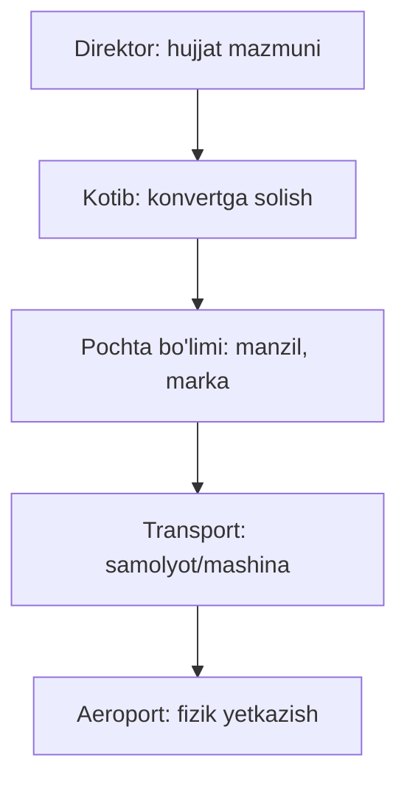
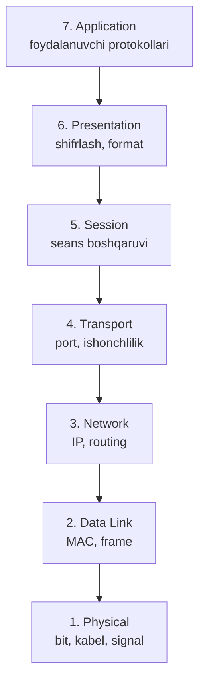
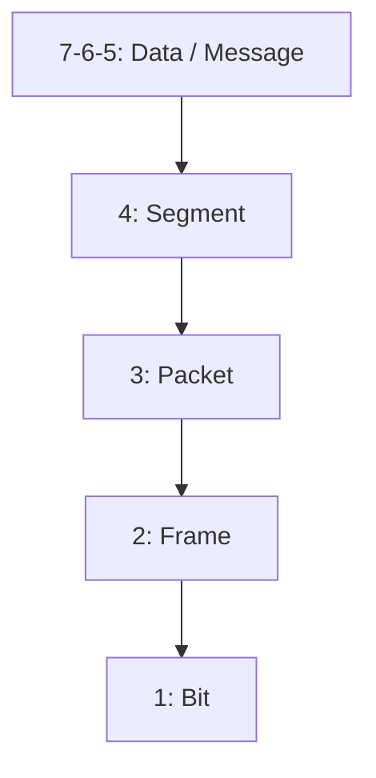

# 07. OSI modeli — 7 qatlam

## Muammo: murakkab tizimni qanday tushuntirish mumkin?

Oldingi darsda ([06-latency-loss-throughput](06-latency-loss-throughput.md))
paket router orqali o'tishini ko'rdik. Lekin bitta paket serverdan browseringgacha
yetguncha o'nlab murakkab bosqichdan o'tadi: shifrlash, port tanlash, IP manzil
qo'yish, kabelga elektr signal qilish... Buni **hammasini birdan** tushunish qiyin.

Muhandislar bu muammoni klassik usul bilan hal qilishdi: ulkan masalani
**qatlamlarga** (layers) bo'lish. Har bir qatlam bitta ishni bajaradi va
qo'shnisi qanday ishlashini bilmaydi. Mana shu g'oyaning eng mashhur ko'rinishi —
**OSI modeli**.

---

## Analogiya: xalqaro pochta jo'natmasi

Tasavvur qil, kompaniyang xorijiy hamkorga hujjat jo'natmoqda. Bu bir necha
"qatlam" orqali o'tadi:



Direktor faqat **mazmun** haqida o'ylaydi — samolyot qanday uchishini bilmaydi.
Aeroport faqat **yukni tashish** haqida o'ylaydi — hujjat nima haqidaligini
bilmaydi. Har bir qatlam **o'z ishini** qiladi va faqat qo'shnisiga topshiradi.

Aynan shu — OSI modeli. 7 qatlam, har biri bir ishning ustasi.

---

## Sodda ta'rif

> **OSI (Open Systems Interconnection)** modeli — ISO tashkiloti tomonidan
> 1984-yilda ishlab chiqilgan **7 qatlamli konseptual model**. U tarmoqda
> ma'lumot uzatishni 7 mustaqil vazifaga bo'ladi.

Muhim: OSI **Internetda to'g'ridan-to'g'ri ishlatilmaydi** (Internet TCP/IP'da
ishlaydi). Lekin u **o'rganish va muloqot uchun standart til**: har bir kitob,
kurs, sertifikat (CCNA, Network+) OSI'dan boshlaydi. G'oya 1969-yilda paydo
bo'lgan, amalda 1984-yilda joriy etilgan.

---

## Diagramma: 7 qatlam



Yuqoridagi 3 qatlam (**7-6-5**) — tarmoqqa bog'liq emas, operatsion sistema
yoki dastur ichida ishlaydi. Pastdagi 4 qatlam (**4-3-2-1**) — tarmoq
qurilmalari (router, switch) shular bilan ishlaydi.

---

## Har bir qatlam nima qiladi?

Yuqoridan pastga (foydalanuvchiga yaqindan boshlab):

### 7. Application (ilova)
Foydalanuvchi to'g'ridan-to'g'ri ko'radigan protokollar. Browser HTTP so'raydi,
email SMTP'dan foydalanadi.
- **Protokollar:** HTTP, FTP, SMTP, DNS, SSH

### 6. Presentation (taqdimot)
Ma'lumot **formatini** hal qiladi: shifrlash (encryption), siqish (compression),
kodlash (ASCII, UTF-8). "PC da .docx faylni Word'ga yo'naltirish" ham shu qatlam.
- **Misol:** TLS/SSL, JPEG, UTF-8

### 5. Session (seans)
Ikki taraf o'rtasidagi **seans**ni (dialog) boshqaradi: ochish, saqlash,
uzilsa tiklash.
- **Misol:** NetBIOS, RPC, socket seanslari

### 4. Transport (transport)
End-to-end yetkazish, **port** raqamlari, ishonchlilik. Uzun xabarni segmentlarga bo'ladi.
- **Protokollar:** TCP (ishonchli), UDP (tez)
- **Eslatma:** MTU odatda 1500 byte

### 3. Network (tarmoq)
**IP addressing** va **routing** — paketni bir tarmoqdan boshqasiga yo'naltirish.
- **Protokollar:** IP, ICMP, OSPF, BGP
- **Qurilma:** router

### 2. Data Link (kanal)
**MAC address** orqali qo'shni qurilmalar (bir hop) o'rtasida frame uzatish.
- **Protokollar:** Ethernet, Wi-Fi, ARP
- **Qurilma:** switch

### 1. Physical (fizik)
Bit'larni fizik **signalga** aylantirish. Ma'lumot 0 va 1 ga o'giriladi va 3 yo'l
bilan jo'natiladi: kabel bo'lsa **elektr**, optika bo'lsa **yorug'lik**, Wi-Fi
bo'lsa **radio to'lqin**.
- **Misol:** kabel, optik tola, RJ-45, 10BASE-T

---

## PDU: har qatlamda ma'lumot boshqacha ataladi

Ma'lumotning har qatlamdagi nomi (**PDU** — Protocol Data Unit) muhim.
Buni yodlash **shart**:



| Qatlam | PDU nomi |
|--------|----------|
| 7, 6, 5 (Application-Presentation-Session) | **Data** (message) |
| 4 (Transport) | **Segment** |
| 3 (Network) | **Packet** |
| 2 (Data Link) | **Frame** |
| 1 (Physical) | **Bits** |

Yodlash mnemonikasi: **D**ata → **S**egment → **P**acket → **F**rame → **B**its
(yuqoridan pastga).

---

## Worked example: "google.com" so'rovi qatlamlardan tushishi

Sen `google.com` yozib Enter bosganingda, so'rov 7-qatlamdan 1-qatlamgacha
tushadi (subgoal label'lar bilan):

```text
// --- 7. Application ---
Browser HTTP GET so'rovini yaratadi (URL + header'lar).

// --- 6. Presentation ---
HTTPS bo'lsa, ma'lumot shu yerda TLS bilan shifrlanadi.

// --- 5. Session ---
Seans identifikatori qo'shiladi (qaysi ulanish ekanini bilish uchun).

// --- 4. Transport ---
Ma'lumot segmentlarga bo'linadi, source/destination PORT qo'shiladi,
sequence number (tartib raqami) qo'yiladi. -> Segment

// --- 3. Network ---
Har segmentga source/destination IP ADDRESS qo'shiladi. -> Packet

// --- 2. Data Link ---
Har paketga source/destination MAC ADDRESS qo'shiladi. -> Frame

// --- 1. Physical ---
Frame 0 va 1 larga aylanib, kabelda elektr signal bo'lib uchadi. -> Bits
```

Qabul qiluvchi tarafda bu jarayon **teskari** boradi: bits → frame → packet →
segment → data. Har qatlam o'zining "yorlig'ini" olib tashlab, yuqoriga uzatadi.

**Muhim tushuncha:** portlar transport (4) va application (7) qatlamlarni
bog'lab beradi — kelgan segment qaysi dasturga tegishli ekanini port aniqlaydi.

---

## 🤔 O'ylab ko'r

Wi-Fi orqali router bilan gaplashishda paketing lokal tarmoqdagi **hamma
qurilmaga** yetadi. Nega boshqa qurilma sening ma'lumotingni o'qimaydi (agar
shifrlanmagan bo'lsa)?

<details>
<summary>💡 Javobni ko'rish</summary>

Data Link (2) qatlamda har frame'da **destination MAC address** bor. Lokal
tarmoqdagi qurilmalar kelgan frame'ni ko'rib, MAC address'ni tekshiradi:
agar frame o'ziga tegishli bo'lmasa, uni **e'tiborsiz qoldiradi**.

Lekin diqqat: agar ma'lumot shifrlanmagan bo'lsa (masalan HTTP, HTTPS emas),
niyati buzuq qurilma MAC filtrni "chetlab" o'tib ma'lumotni o'qishi mumkin.
Aynan shuning uchun jamoat Wi-Fi'larida faqat HTTPS (shifrlangan) saytlardan
foydalanish muhim.
</details>

---

## Qurilmalar qaysi qatlamda ishlaydi?

Bu — juda muhim va interviewda tez-tez so'raladi:

| Qurilma | Qatlam | Nima bilan ishlaydi |
|---------|--------|---------------------|
| **Hub** (eski) | 1 (Physical) | Faqat bit'larni nusxalaydi |
| **Switch** | 2 (Data Link) | MAC address'lar |
| **Router** | 3 (Network) | IP address'lar |
| **L3 switch** | 2 + 3 | MAC va IP birga |
| **L7 firewall / LB** | 7 (Application) | HTTP mazmuni |

Router va switch **barcha 7 qatlamni ishlatmaydi** — router 1-3 qatlamgacha,
switch 1-2 qatlamgacha ishlaydi. Shuning uchun switch IP address'ni "tanimaydi",
faqat MAC bilan ishlaydi.

---

## Qatlamlarni yodlash

**Pastdan tepaga (1 → 7):**
> **P**lease **D**o **N**ot **T**hrow **S**ausage **P**izza **A**way
> (Physical, Data Link, Network, Transport, Session, Presentation, Application)

**Tepadan pastga (7 → 1):**
> **A**ll **P**eople **S**eem **T**o **N**eed **D**ata **P**rocessing
> (Application, Presentation, Session, Transport, Network, Data Link, Physical)

---

## Nega OSI 2025-2026 da hamon muhim?

OSI Internetda ishlatilmasa ham, u **hamon zarur**:

1. **Umumiy til:** muhandislar "Layer 3 da muammo bor" yoki "L7 load balancer"
   deb gaplashadi — bu OSI tili.
2. **Troubleshooting metodologiyasi:** muammoni topish uchun qatlamlarni
   pastdan tepaga (yoki teskari) birma-bir tekshirish.
3. **Vendor-neytral:** Cisco, Juniper, MikroTik — hammasi OSI'ga ishora qiladi.
4. **Sertifikatlar:** CCNA, CCNP, CCIE imtihonlari qatlamga xos protokollar va
   encapsulation mexanikasini aynan shu model orqali so'raydi.

---

## Ko'p uchraydigan xatolar

⚠️ **Xato 1:** "OSI — bu Internet ishlatadigan model."
Noto'g'ri. Internet **TCP/IP** modelida ishlaydi. OSI — **konseptual** o'quv
modeli. Ular haqida to'liq — [08-tcpip-modeli-va-encapsulation](08-tcpip-modeli-va-encapsulation.md).

⚠️ **Xato 2:** "Switch IP address bilan ishlaydi."
Noto'g'ri. Switch — **Layer 2** qurilma, u faqat **MAC address**ni biladi.
IP address bilan **router** (Layer 3) ishlaydi.

⚠️ **Xato 3:** PDU nomlarini chalkashtirish.
Ko'pchilik "packet" so'zini hamma narsaga ishlatadi. Aslida: transport =
**segment**, network = **packet**, data link = **frame**. Har qatlam o'z nomiga ega.

---

## Xulosa

- **OSI** — 7 qatlamli konseptual model (ISO, 1984): murakkab tizimni bo'lib tushuntirish.
- Yuqori 3 qatlam (7-6-5) — dastur/OS ichida; pastki 4 (4-3-2-1) — tarmoq bilan.
- Qatlamlar: Application, Presentation, Session, Transport, Network, Data Link, Physical.
- **PDU**: Data → Segment → Packet → Frame → Bits.
- Qurilmalar: hub (L1), switch (L2, MAC), router (L3, IP).
- OSI Internetda ishlatilmaydi, lekin **umumiy til va troubleshooting** uchun zarur.
- Yodlash: "Please Do Not Throw Sausage Pizza Away".

---

## 🧠 Eslab qol

- 7 qatlam: pastdan — Physical, Data Link, Network, Transport, Session, Presentation, Application.
- PDU: Segment (4) → Packet (3) → Frame (2) → Bits (1).
- Switch = L2 (MAC), Router = L3 (IP).
- OSI = o'quv tili, TCP/IP = amaliyot.

---

## ✅ O'z-o'zini tekshir

<details>
<summary>1. Nima uchun switch IP address'ni "tanimaydi", lekin router taniydi?</summary>

Switch — **Layer 2** qurilma: u faqat **MAC address** bilan ishlaydi va
frame'larni lokal tarmoq ichida yo'naltiradi. Router — **Layer 3** qurilma:
u **IP address**ni o'qib, paketni turli tarmoqlar orasida yo'naltiradi.
Har qurilma o'z qatlamigacha bo'lgan ma'lumotni "ko'radi".
</details>

<details>
<summary>2. Transport qatlamdagi PDU nomi nima, network qatlamda-chi?</summary>

Transport (4) = **segment** (TCP) yoki datagram (UDP). Network (3) = **packet**.
To'liq ketma-ketlik: Data (7-6-5) → Segment (4) → Packet (3) → Frame (2) → Bits (1).
</details>

<details>
<summary>3. HTTPS'da shifrlash qaysi qatlamda amalga oshadi?</summary>

Konseptual jihatdan **Presentation (6)** qatlamda — bu qatlam ma'lumot
formati, shifrlash va kodlash bilan shug'ullanadi. TLS aynan shu vazifani
bajaradi (texnik jihatdan transport va application orasida joylashsa ham,
OSI mantiqida presentation'ga to'g'ri keladi).
</details>

<details>
<summary>4. "Layer 4 load balancer" va "Layer 7 load balancer" farqi nima?</summary>

**L4 LB** transport qatlamda ishlaydi — faqat IP va portga qarab trafikni
taqsimlaydi (mazmunni ko'rmaydi, tez). **L7 LB** application qatlamda ishlaydi —
HTTP mazmunini (URL, header) o'qib, aqlliroq qaror qabul qiladi (masalan
`/api` bir serverga, `/images` boshqasiga). OSI tili shu farqni ifodalaydi.
</details>

---

## 🛠 Amaliyot

1. **Oson (yodlash):** OSI 7 qatlamni pastdan tepaga va tepadan pastga
   mnemonika bilan yodla. Yopiq holda qog'ozga yozib ko'r.

   <details><summary>Hint</summary>Please Do Not Throw Sausage Pizza Away
   (1→7). Har harf — bitta qatlam.</details>

2. **O'rta (moslashtirish):** Quyidagilarni to'g'ri qatlamga joylashtir:
   `TCP`, `Ethernet`, `HTTP`, `IP`, `MAC address`, `port`, `optik kabel`.

   <details><summary>Hint</summary>HTTP→7, TCP/port→4, IP→3,
   Ethernet/MAC→2, kabel→1.</details>

3. **Qiyin (troubleshooting):** "Sayt ochilmayapti" muammosini OSI qatlamlari
   bo'yicha pastdan tepaga tekshirish rejasini yoz: har qatlamda qanday
   buyruq/tekshiruv qilasan?

   <details><summary>Hint</summary>L1: kabel ulanganmi? L2: switch/MAC?
   L3: `ping IP`, `ip route`? L4: `telnet host port`? L7: `curl -v`?</details>

---

## 🔁 Takrorlash

- **Bog'liq darslar:** [02-protokol-nima](02-protokol-nima.md),
  [08-tcpip-modeli-va-encapsulation](08-tcpip-modeli-va-encapsulation.md),
  [09-glossary](09-glossary.md).
- **Takrorlash jadvali:** ertaga → 3 kundan keyin → 1 haftadan keyin savollarga qayt.
- **Feynman testi:** OSI modelini "xalqaro pochta jo'natmasi" analogiyasi orqali
  do'stingga kod ishlatmasdan 3 jumlada tushuntir.

---

## 📚 Manbalar

- Kurose & Ross, *Computer Networking: A Top-Down Approach*, 1-bob (protocol layers)
- [The OSI Model: A Comprehensive Guide for 2025 — Shadecoder](https://www.shadecoder.com/topics/the-osi-model-a-comprehensive-guide-for-2025)
- [Top 20 OSI Model Interview Questions (2026) — PyNet Labs](https://www.pynetlabs.com/osi-model-interview-questions-and-answers/)
- [The OSI Model Explained — Splunk](https://www.splunk.com/en_us/blog/learn/osi-model.html)
- [OSI Model Explained — All 7 Layers — Networkers Home](https://www.networkershome.com/fundamentals/networking/osi-model-explained-all-7-layers/)
