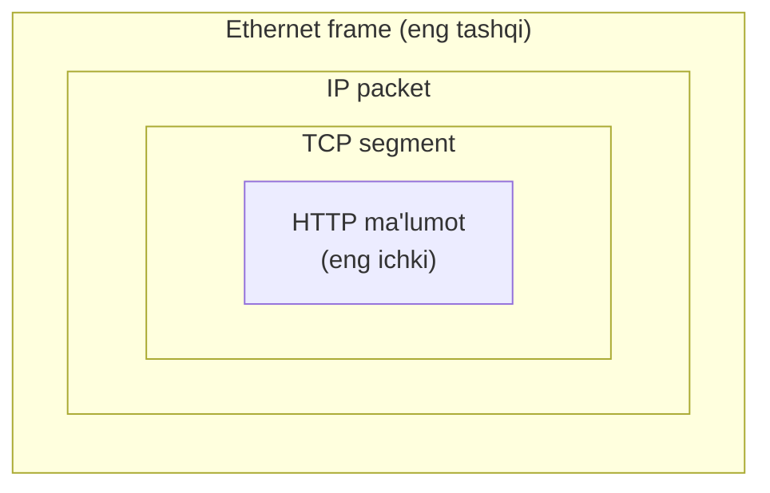
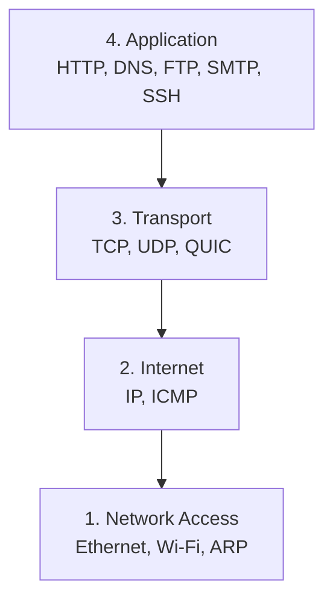
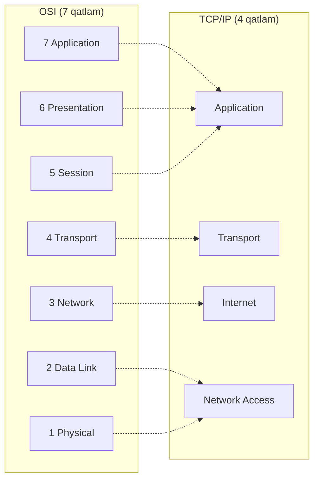
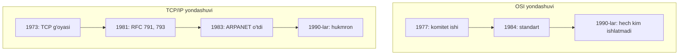
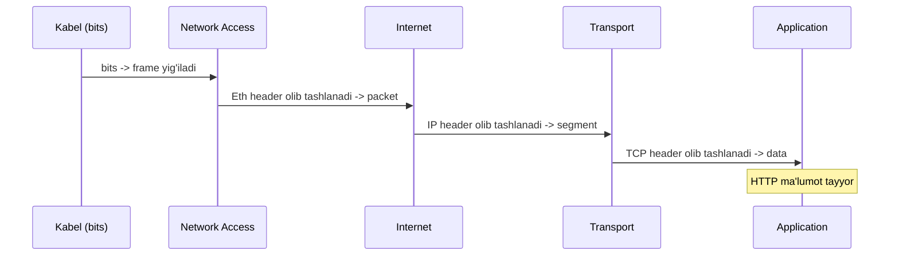

# 08. TCP/IP modeli va Encapsulation

## Muammo: OSI chiroyli, lekin Internet nima bilan ishlaydi?

Oldingi darsda ([07-osi-modeli](07-osi-modeli.md)) 7 qatlamli OSI modelini
o'rgandik. Lekin bitta muhim gapni aytdik: **Internet OSI'da ishlamaydi**.
Unda Internet aslida nima bilan ishlaydi?

Javob — **TCP/IP modeli**. Bu — Internetning **haqiqiy**, amaliy modeli. Har
bir web sahifa, har bir email, har bir video call — hammasi shu modelda ketadi.
Bu darsda TCP/IP modelini o'rganamiz va eng muhim tushunchani — **encapsulation**
(ma'lumotni qatlamma-qatlam o'rash) — chuqur ochamiz.

---

## Analogiya: matryoshka qo'g'irchoq

TCP/IP encapsulation'ni tushunishning eng yaxshi yo'li — **matryoshka**
(bir-birining ichiga joylashtirilgan qo'g'irchoqlar):



- **Eng ichki qo'g'irchoq** — sening asl ma'lumoting (HTTP so'rov).
- Har bir tashqi qatlam uni **o'raydi** va o'z "yorlig'ini" (header) qo'shadi.
- Qabul qiluvchi tomon qo'g'irchoqlarni **teskari** ochadi.

Aynan shunday, har bir tarmoq qatlami yuqoridan kelgan ma'lumotni o'z header'i
bilan o'raydi. Bu jarayon — **encapsulation**.

---

## Sodda ta'rif

> **TCP/IP modeli** — Internetning haqiqiy 4 qatlamli modeli. Original nomi
> **DoD model** (AQSh Mudofaa vazirligi). RFC 1122'da rasmiylashtirilgan.
>
> **Encapsulation** — har bir qatlam yuqoridan kelgan ma'lumotni o'z header'i
> bilan o'rab, yangi PDU hosil qilishi.

---

## Diagramma: TCP/IP 4 qatlami



| # | Qatlam | PDU | Protokollar |
|---|--------|-----|-------------|
| 4 | Application | Data | HTTP, DNS, FTP, SMTP, SSH |
| 3 | Transport | Segment (TCP) / Datagram (UDP) | TCP, UDP, QUIC |
| 2 | Internet | Packet | IP, ICMP |
| 1 | Network Access | Frame / Bit | Ethernet, Wi-Fi, PPP, ARP |

---

## OSI vs TCP/IP — yonma-yon



| OSI qatlam | TCP/IP qatlam |
|------------|---------------|
| 7, 6, 5 (Application, Presentation, Session) | **Application** (bittaga birlashgan) |
| 4 (Transport) | **Transport** |
| 3 (Network) | **Internet** |
| 2, 1 (Data Link, Physical) | **Network Access** (bittaga birlashgan) |

**Diqqat:** TCP/IP OSI'ning 5-6-7 ni bitta **Application**ga birlashtiradi.
Sabab: amalda bu uch vazifani (shifrlash, format, seans) alohida ajratish
noqulay — ular odatda bitta dastur kodida bo'ladi.

---

## Nega TCP/IP yutdi?

OSI akademik jihatdan chiroyli edi, lekin TCP/IP g'olib chiqdi:



**Sabablari:**

1. **Avval ishlaydigan kod** — TCP/IP allaqachon ishlab turgan tarmoqda bor edi.
2. **Bepul, ochiq RFC'lar** — har kim o'qib, amalga oshirishi mumkin edi.
3. **Unix integratsiyasi** — BSD Unix'da bepul TCP/IP stack.
4. **Soddaroq** — 4 qatlam 7 dan tushunarliroq.

IETF shiori buni ifodalaydi: "avval ishlaydigan kod, keyin standart".
OSI'dan faqat **terminologiya** (Layer 1-7 raqamlari) qoldi, stack sifatida
TCP/IP hukmron.

---

## Worked example: encapsulation `curl https://example.com` da

Sen `curl https://example.com` ishga tushirganingda ma'lumot pastga tushib,
har qatlamda o'raladi (subgoal label'lar bilan):

```text
// --- 1. Application: HTTP ma'lumot yaratiladi ---
"GET / HTTP/1.1\nHost: example.com"    -> Data

// --- 2. Transport: TCP header o'raladi ---
[TCP header: src port 54321, dst port 443, seq] + Data    -> Segment

// --- 3. Internet: IP header o'raladi ---
[IP header: src 192.168.1.10, dst 93.184.216.34, TTL] + Segment    -> Packet

// --- 4. Network Access: Ethernet header + trailer o'raladi ---
[Eth header: src/dst MAC] + Packet + [Eth FCS]    -> Frame

// --- 5. Fizik: frame bit'larga aylanadi ---
010101010101...    -> kabelda signal
```

### Vizual: har qatlam header qo'shadi

```text
APPLICATION:  [        HTTP data        ]
                          |
TRANSPORT:    [TCP][      HTTP data      ]        <- Segment
                          |
INTERNET:     [IP][TCP][   HTTP data     ]        <- Packet
                          |
NET ACCESS:   [Eth][IP][TCP][ HTTP data ][FCS]    <- Frame
                          |
PHYSICAL:     0101010101010101010101...           <- Bits
```

Har qatlam **faqat o'z header'ini** qo'shadi va ichkaridagini "qora quti"
sifatida ko'radi — nima borligini bilmaydi.

---

## Decapsulation: teskari jarayon

Qabul qiluvchi tarafda hammasi **teskari** boradi:



Har qatlam **o'z header'ini** o'qiydi, olib tashlaydi va qolganini yuqoriga
uzatadi. Encapsulation — o'rash, decapsulation — ochish. Xuddi matryoshka.

---

## 🤔 O'ylab ko'r

Paket router orqali o'tganda, router qaysi header'larni o'qiydi va qaysilarini
o'zgartiradi?

<details>
<summary>💡 Javobni ko'rish</summary>

Router — **Layer 3 (Internet)** qurilma. U:

1. Kelgan **frame**ni oladi va Ethernet header'ini **olib tashlaydi** (decapsulate
   L2).
2. **IP header**ni o'qiydi (destination IP) va routing table orqali keyingi
   hop'ni tanlaydi. TTL'ni 1 ga **kamaytiradi**.
3. Paketga **yangi** Ethernet header yasaydi (yangi src/dst MAC — keyingi hop
   uchun) va keyingi router'ga uzatadi.

Ya'ni router **L2 header'ni har hop'da qayta yozadi**, lekin **IP header'dagi
manzillar o'zgarmaydi** (TTL bundan mustasno). Bu — routing'ning asosiy mexanizmi.
</details>

---

## Header overhead: kichik xabar ham qimmatga tushadi

Aytaylik, sen atigi 6 byte'lik `"Hello!"` yubormoqchisan. Har qatlam header
qo'shadi:

| Qatlam | Header hajmi |
|--------|-------------|
| Ethernet | 14 + 4 (FCS) = 18 byte |
| IPv4 | 20 byte (minimum) |
| TCP | 20 byte (minimum) |
| HTTP | ~200 byte (tipik header'lar) |
| **Jami overhead** | **~258 byte** |

Ya'ni 6 byte foydali ma'lumot uchun **~258 byte qo'shimcha**! Shuning uchun
mobil tarmoqlarda header'ni siqadigan **HTTP/2** (HPACK) va **HTTP/3** (QPACK)
muhim ahamiyatga ega.

---

## Ko'p uchraydigan xatolar

⚠️ **Xato 1:** "TCP/IP va OSI raqib modellar, bittasini tanlash kerak."
Noto'g'ri. Ular bir-birini to'ldiradi: **OSI** — o'rganish va muloqot tili,
**TCP/IP** — amaliyot. Muhandis ikkalasini ham biladi.

⚠️ **Xato 2:** "Encapsulation ma'lumotni shifrlaydi."
Noto'g'ri. Encapsulation — bu shunchaki **o'rash** (header qo'shish), shifrlash
emas. Shifrlash — bu alohida vazifa (TLS). Header'lar odatda ochiq matnda.

⚠️ **Xato 3:** "Router IP header'dagi manzilni o'zgartiradi."
Odatda yo'q (NAT bundan mustasno). Router har hop'da **L2 (Ethernet) header'ni**
qayta yozadi, lekin **IP manzillar o'zgarmaydi** — faqat TTL 1 ga kamayadi.

---

## Xulosa

- **TCP/IP** — Internetning haqiqiy 4 qatlamli modeli (Application, Transport, Internet, Network Access).
- OSI'ning 7-6-5 → Application, 2-1 → Network Access ga birlashgan.
- **TCP/IP yutdi**: avval ishlaydigan kod, bepul RFC, soddaroq.
- **Encapsulation** — har qatlam yuqoridan kelganni o'z header'i bilan o'raydi (matryoshka).
- PDU: Data → Segment → Packet → Frame → Bits.
- **Decapsulation** — qabulda teskari: header'lar olib tashlanadi.
- Router L2 header'ni har hop'da qayta yozadi, IP manzil o'zgarmaydi (TTL kamayadi).
- Kichik xabar ham katta **header overhead** ga ega bo'ladi.

---

## 🧠 Eslab qol

- TCP/IP 4 qatlam: Application, Transport, Internet, Network Access.
- Encapsulation = o'rash (matryoshka), Decapsulation = ochish.
- Har qatlam faqat o'z header'ini qo'shadi.
- Router L2'ni qayta yozadi, IP o'zgarmaydi (TTL kamayadi).

---

## ✅ O'z-o'zini tekshir

<details>
<summary>1. TCP/IP OSI'ning qaysi qatlamlarini birlashtirgan va nega?</summary>

TCP/IP OSI'ning **5-6-7 (Session, Presentation, Application)** ni bitta
**Application**ga, va **1-2 (Physical, Data Link)** ni bitta **Network Access**ga
birlashtirgan. Sabab: amalda bu vazifalarni (shifrlash, format, seans) alohida
implementatsiya qilish noqulay — ular odatda bitta dastur kodida bo'ladi.
</details>

<details>
<summary>2. Encapsulation va decapsulation farqi nima?</summary>

**Encapsulation** — ma'lumot pastga tushganda har qatlam o'z header'ini
**qo'shadi** (o'raydi). **Decapsulation** — ma'lumot yuqoriga chiqqanda har
qatlam o'z header'ini **olib tashlaydi** (ochadi). Yuboruvchi encapsulate qiladi,
qabul qiluvchi decapsulate qiladi. Xuddi matryoshkani yopish va ochish kabi.
</details>

<details>
<summary>3. Router paketni uzatganda IP manzil o'zgaradimi?</summary>

Odatda **yo'q** (NAT holatidan tashqari). Router har hop'da **Ethernet (L2)
header'ni** qayta yozadi (yangi src/dst MAC — keyingi hop uchun), lekin **IP
header'dagi manba va manzil o'zgarmaydi**. Faqat **TTL** har hop'da 1 ga kamayadi.
</details>

<details>
<summary>4. Nega TCP/IP OSI'dan ustun keldi?</summary>

To'rt asosiy sabab: (1) **avval ishlaydigan kod** — TCP/IP allaqachon
ishlaydigan tarmoqda mavjud edi; (2) **bepul, ochiq RFC'lar**; (3) **Unix bilan
integratsiya** (BSD'da bepul stack); (4) **soddaroq** — 4 qatlam 7 dan
tushunarliroq. IETF falsafasi: "running code first".
</details>

---

## 🛠 Amaliyot

1. **Oson (moslashtirish):** OSI 7 qatlamni TCP/IP 4 qatlamga o'z qo'ling bilan
   moslashtirib chiz. Qaysi OSI qatlamlar birlashganini belgila.

   <details><summary>Hint</summary>7-6-5 → Application, 4 → Transport,
   3 → Internet, 2-1 → Network Access.</details>

2. **O'rta (to'ldirish):** Quyidagi encapsulation ketma-ketligini to'ldir:
   ```text
   Application: HTTP data
   Transport:   // TODO: qanday header qo'shiladi? PDU nomi?
   Internet:    // TODO: qanday header qo'shiladi? PDU nomi?
   Net Access:  // TODO: qanday header + trailer? PDU nomi?
   ```
   <details><summary>Hint</summary>Transport: +TCP header → Segment;
   Internet: +IP header → Packet; Net Access: +Ethernet header/FCS → Frame.</details>

3. **Qiyin (tahlil):** Wireshark yoki `tcpdump -X` bilan bitta paketni ushla.
   Undagi Ethernet, IP, TCP header'larni topib, har birida qaysi manzillar
   borligini yoz. Encapsulation'ni real ma'lumotda ko'r.

   <details><summary>Hint</summary>`sudo tcpdump -i any -n 'port 443' -X`.
   Frame ichida MAC → IP → port'lar ketma-ket joylashgan.</details>

---

## 🔁 Takrorlash

- **Bog'liq darslar:** [07-osi-modeli](07-osi-modeli.md),
  [02-protokol-nima](02-protokol-nima.md),
  [09-glossary](09-glossary.md).
- **Takrorlash jadvali:** ertaga → 3 kundan keyin → 1 haftadan keyin savollarga qayt.
- **Feynman testi:** encapsulation'ni "matryoshka qo'g'irchoq" analogiyasi orqali
  do'stingga kod ishlatmasdan 3 jumlada tushuntir.

---

## 📚 Manbalar

- Kurose & Ross, *Computer Networking: A Top-Down Approach*, 1-bob (encapsulation, TCP/IP)
- [Internet protocol suite — Wikipedia](https://en.wikipedia.org/wiki/Internet_protocol_suite)
- [RFC 1122 — Requirements for Internet Hosts](https://datatracker.ietf.org/doc/html/rfc1122)
- [OSI Model vs TCP/IP Model — Netalith](https://netalith.com/blogs/networking-fundamentals/osi-model-vs-tcp-ip-model-differences-similarities)
- [The OSI Model — Splunk](https://www.splunk.com/en_us/blog/learn/osi-model.html)
