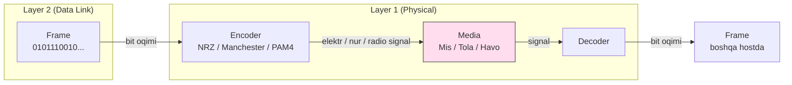
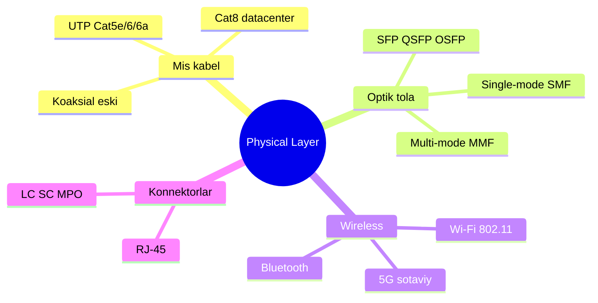

# 01. Physical Layer (L1) — kabel, signal, hub, bandwidth

## Muammo: bit qanday qilib sim ichida "yuguradi"?

Tasavvur qil: sen `google.com` deb yozding va Enter bosding. Kompyuter ichida bu
faqat `0` va `1` raqamlari — abstrakt son. Lekin mis sim, shisha tola yoki havo
raqamni "bilmaydi". Ular faqat **elektr kuchlanishi**, **nur** va **radio
to'lqin**ni tashiy oladi.

Agar raqamni fizik signalga aylantiradigan qatlam bo'lmasa, hech qanaqa ma'lumot
bir qurilmadan ikkinchisiga o'tmaydi. Mana shu ish **Physical layer** (fizik
qatlam, OSI modelining 1-layeri) zimmasida.

> **Oltin qoida:** Physical layer logikani bilmaydi — u faqat `0` va `1`ni signalga
> aylantiradi va qaytaradi. IP manzil, MAC, port — bularning hech biri bu yerda yo'q.

## Analogiya: pochta va yo'l

Xatni tasavvur qil. Xat matni — bu sening ma'lumoting. Lekin xat bir shahardan
ikkinchisiga yetib borishi uchun **yo'l** kerak: asfalt, temir yo'l yoki havo
yo'li. Physical layer aynan shu **yo'l**dir.

- Yo'l xat ichida nima yozilganini bilmaydi (u logikani ko'rmaydi).
- Yo'l faqat bitta narsani ta'minlaydi: yukni A nuqtadan B nuqtaga fizik yetkazish.
- Yo'l sifati (silliq asfalt yoki chuqur ko'cha) tezlik va yo'qotishga ta'sir qiladi.

Farqi shundaki: pochtada yuk — qog'oz, bu yerda yuk — **bit oqimi** (bit stream,
ketma-ket `0` va `1`lar).

## Sodda ta'rif

**Physical layer** — OSI modelining eng quyi qatlami bo'lib, uning yagona vazifasi
raqamli bitlarni fizik signalga (elektr, nur, radio) kodlab uzatish va qabul
tomonda qaytadan bitga ochishdir.

Bu qatlamning PDU (Protocol Data Unit — qatlamning ma'lumot birligi) nomi —
**bit**.

## Diagramma: L2 dan kabelgacha yo'l



Diqqat: Physical layer header qo'shmaydi. Encapsulation (ma'lumotni qatlamlar bilan
o'rash) L2 da tugaydi — bu yerda faqat signalga aylantirish bor.

## Uzatish muhitining xaritasi



## Worked example 1 — mis kabel (twisted pair)

Eng keng tarqalgani **UTP** (Unshielded Twisted Pair — ekransiz buralgan juftlik).
Ichida 4 juft mis sim. Nega buraladi? **Buralish** qo'shni juftlar orasidagi
elektromagnit shovqinni (EMI — electromagnetic interference) kamaytiradi.

| Kategoriya | Frequency | Max tezlik | Masofa | Qayerda |
|------------|-----------|------------|--------|---------|
| Cat5e | 100 MHz | 1 Gbps | 100 m | Eski ofis LAN |
| Cat6 | 250 MHz | 1 Gbps (10G — 55 m) | 100 m | Standart ofis |
| Cat6a | 500 MHz | 10 Gbps | 100 m | Server xona |
| Cat7 | 600 MHz | 10 Gbps | 100 m | Sanoat, shielded |
| Cat8 | 2000 MHz | 25/40 Gbps | 30 m | Data center, switch-to-switch |

**Notional machine (ichkarida nima bo'ladi):** NIC (Network Interface Card — tarmoq
kartasi) bitlarni 4 ta juftlik bo'yicha differensial elektr signalga aylantiradi.
`1000BASE-T` (Gigabit Ethernet) 4 ta juftni bir vaqtda ishlatadi va PAM5 modulation
qo'llaydi. Masofa uzaygan sari signal **attenuation** (zaiflashish) tufayli
kuchsizlanadi — shuning uchun mis kabelda 100 m qat'iy chegara.

## Worked example 2 — optik tola

Mis o'rniga shisha tola, signal — **lazer yoki LED nuri**. EMI ga befarq, uzun
masofa (10+ km), juda katta bandwidth.

| Tur | Yadro | Manba | Masofa | Bandwidth | Narx |
|-----|-------|-------|--------|-----------|------|
| Multi-mode (MMF) | 50 µm | LED/VCSEL | 300 m – 2 km | 10–100 Gbps | Arzon |
| Single-mode (SMF) | 8–10 µm | Lazer | 10 – 100+ km | 100 Gbps – 1 Tbps | Qimmat |

**Transceiver modullari** (nurga aylantiruvchi qism):
- **SFP** — 1 Gbps, **SFP+** — 10 Gbps
- **QSFP28** — 100 Gbps (4 lane)
- **QSFP-DD / OSFP** — 400/800 Gbps (zamonaviy AI data center)

**Konnektorlar:** LC (kichik, eng keng tarqalgan), SC (kvadrat), MPO/MTP (12+ tola,
parallel optika).

## Zamonaviy holat (2025–2026): 800G va 1.6T

WebSearch natijalari bo'yicha, 2025 yilda data center optikasi bozori 60% dan ortiq
o'sib, 16 mlrd dollardan oshdi. Asosiy sabab — **AI data center**lar uchun GPU
klasterlarni ulash.

- **800G** (OSFP va QSFP-DD) 2025 yilda yangi qurilmalar uchun **default** tanlov
  bo'ldi — endi bu "kelajak texnologiyasi" emas.
- **1.6T** standarti (IEEE 802.3dj, lane boshiga 200 Gb/s) 2026 o'rtalarida
  chiqarilishi kutilyapti; Broadcom 1.6T transceiverlarni 2024-sentyabrda taqdim
  etdi.
- **800G modul** 14–20 W quvvat yeydi — bu switch sovutish tizimi va rack quvvat
  byudjetini qiynaydi.
- Rack ichida (2 m gacha) passive **DAC** kabel, rack orasida (5–10 m) **Active
  Electrical Cable** (AEC) optimal — AEC AOC dan 25–50% kam quvvat yeydi.

Cat8 bu poygada faqat data center ichida, 30 m gacha, switch-to-switch uchun
qoladi.

## Worked example 3 — wireless (radio to'lqin)

Signal — havoda elektromagnit to'lqin. Tashqi EMI, devor, masofa kuchli ta'sir
qiladi.

| Nom | IEEE | Yili | Frequency | Max tezlik | Channel |
|-----|------|------|-----------|------------|---------|
| Wi-Fi 5 | 802.11ac | 2014 | 5 GHz | 6.9 Gbps | 80/160 MHz |
| Wi-Fi 6 | 802.11ax | 2019 | 2.4/5 GHz | 9.6 Gbps | 160 MHz |
| Wi-Fi 6E | 802.11ax | 2021 | + 6 GHz | 9.6 Gbps | 160 MHz |
| Wi-Fi 7 | 802.11be | 2024 | 2.4/5/6 GHz | 46 Gbps | 320 MHz |

**Wi-Fi 7 final standarti 2025-yil 22-iyulda chop etildi** (WebSearch). 320 MHz
channel + 4096-QAM modulation + **MLO** (Multi-Link Operation — 2.4/5/6 GHz ni bir
vaqtda ishlatish). Wi-Fi 7 haqida to'liq gap 9-darsda.

## Predict savoli (PRIMM)

> 🤔 **O'ylab ko'r:** Sen ofisda 10 Gbps tezlik va 90 metr masofa kerak bo'lgan
> ulanish qilmoqchisan. Cat6 yetadimi, Cat6a olishing kerakmi?

<details>
<summary>💡 Javobni ko'rish</summary>

Cat6a olishing kerak. Cat6 10 Gbps ni faqat ~55 metrgacha beradi, undan uzoqda
tezlik 1 Gbps ga tushadi. Cat6a esa 500 MHz frequency bilan to'liq 100 metrgacha
10 Gbps beradi. Cat8 esa faqat 30 m — bu masofa uchun mos emas.
</details>

## Encoding va modulation (qisqacha)

Bit oqimini signalga aylantirish sxemalari:

- **NRZ** — `1` = yuqori kuchlanish, `0` = past. Sodda, lekin clock recovery qiyin.
- **Manchester** — har bitda o'tish (transition) bor, o'z-o'zini sinxronlaydi.
  10BASE-T da ishlatilgan.
- **4B/5B** — Fast Ethernet (100BASE-TX).
- **8B/10B** — Gigabit Ethernet, USB 3.
- **PAM4** — 4 ta kuchlanish darajasi, har symbol 2 bit. 100/400/800G Ethernet da.

## Muhim atamalar: bandwidth vs throughput

| Atama | Ma'nosi | Misol |
|-------|---------|-------|
| **Bandwidth** | Channel nazariy maksimal sig'imi | 1 Gbps |
| **Throughput** | Amaliyotda erishilgan real tezlik | 850 Mbps |
| **Latency** | Packet borib-kelish vaqti (RTT) | 20 ms |
| **Jitter** | Latency o'zgaruvchanligi | ±5 ms |

Bandwidth — yo'lning necha qatorligi; throughput — haqiqatda o'tgan mashinalar soni.
Jitter — VoIP va gaming uchun eng katta dushman.

## Hub — nega o'tmishda qoldi?

**Hub** (L1 qurilmasi) bitta portdan kelgan signalni ko'r-ko'rona **hamma**
portlarga tarqatadi. Natijada:

- Barcha portlar bitta **collision domain**da (bir vaqtda ikki qurilma yuborsa,
  signal to'qnashadi — collision).
- Faqat half-duplex — bir vaqtda yo yuborish, yo qabul.
- Xavfsizlik yo'q — hamma hammani "eshitadi".

Shuning uchun hub o'rnini **switch** (L2 qurilmasi) egalladi — bu keyingi dars mavzusi.

## Troubleshooting — Linux buyruqlari

```bash
# 1. Link, speed, duplex holati
ethtool eth0
# Speed: 1000Mb/s | Duplex: Full | Link detected: yes

# 2. NIC xatolari (kabel muammosi belgisi)
ethtool -S eth0 | grep -i error
# rx_crc_errors o'sib borsa -> kabel buzuq yoki shovqinli

# 3. Wi-Fi signal kuchi
iw dev wlan0 link
# signal: -55 dBm  (yaxshi: -30..-67, yomon: < -80)
```

| Muammo | Belgi | Yechim |
|--------|-------|--------|
| Kabel buzuq | `rx_crc_errors` o'smoqda | Kabelni almashtir |
| Speed pastladi | 1G port 100M ko'rsatadi | Auto-neg, Cat5e+ kabel |
| Link flapping | dmesg Link Up/Down | Kabel/port/NIC nuqsoni |
| Wi-Fi zaif | -75 dBm dan past | Antenna, masofa, channel |

## Xulosa

- Physical layer yagona ish qiladi: **bit ⇄ fizik signal** aylantirish.
- Uch asosiy muhit: **mis** (Cat5e–Cat8), **optik tola** (MMF/SMF), **wireless**.
- Mis kabelda masofa 100 m bilan cheklangan (attenuation), tolada 100+ km.
- **Bandwidth** — nazariy sig'im, **throughput** — real erishilgan tezlik.
- 2025–2026: data centerda **800G** default, **1.6T** yaqinlashmoqda.
- **Hub** (L1) barcha portga tarqatadi va o'tmishda qoldi; o'rnini **switch** oldi.

## 🧠 Eslab qol

- Physical layer logikani emas, faqat signalni biladi.
- PDU nomi shu yerda — **bit**.
- Mis = 100 m chegara, tola = uzoq masofa + katta bandwidth.
- Bandwidth nazariy, throughput amaliy.
- Hub = bitta collision domain, o'tmish qurilmasi.

## ✅ O'z-o'zini tekshir (retrieval practice)

**1.** Nega mis kabelda 100 metrdan uzoqqa signal yuborib bo'lmaydi?

<details>
<summary>Javob</summary>

Signal masofa bo'yicha **attenuation** (zaiflashish) tufayli kuchsizlanadi. 100 m
dan keyin qabul tomonda `0` va `1`ni ishonchli ajratib bo'lmaydi. Uzoq masofa uchun
optik tola ishlatiladi.
</details>

**2.** Bandwidth 1 Gbps, lekin fayl 850 Mbps tezlikda ko'chirilyapti. Bu nima?

<details>
<summary>Javob</summary>

850 Mbps — bu **throughput** (amaliy tezlik). Bandwidth (1 Gbps) nazariy maksimum.
Farq protokol overhead, retransmission, kabel sifati va navbatlar tufayli. Bu normal
holat, xato emas.
</details>

**3.** Hub va switch orasidagi asosiy farq nimada?

<details>
<summary>Javob</summary>

Hub (L1) signalni **hamma** portga tarqatadi — bitta katta collision domain.
Switch (L2) MAC address bilan frame ni **faqat kerakli** portga yuboradi — har port
alohida collision domain, full-duplex. Hub deyarli ishlatilmaydi.
</details>

**4.** 2025 yilda AI data centerda GPU klasterlarni ulash uchun qaysi tezlik default
bo'lib qoldi?

<details>
<summary>Javob</summary>

**800G** (OSFP va QSFP-DD form-factor). Endi bu kelajak emas, standart tanlov.
Keyingi qadam — 1.6T (IEEE 802.3dj), 2026 o'rtalarida kutilmoqda.
</details>

## 🛠 Amaliyot

**1. Oson (Modify):** O'z laptopingda `ethtool <interface>` (Linux) yoki ` networksetup
-getMedia <interface>` (macOS) buyrug'ini ishlatib, port speed va duplex holatini
top. Full-duplex va nechchi Mbps ishlayaptimi?

<details>
<summary>Hint</summary>

Linux da interface nomini `ip link` bilan bilib ol (masalan `eth0`, `enp3s0`). Wi-Fi
uchun `iw dev wlan0 link` signal kuchini (dBm) ko'rsatadi.
</details>

**2. O'rta (Faded example):** Quyidagi taqqoslashni to'ldir:

```text
Vazifa: 40 metr masofada 10 Gbps kerak.
- Cat6 mos keladimi?  -> // TODO: ha/yo'q + sabab
- Cat6a mos keladimi? -> // TODO: ha/yo'q + sabab
- Cat8 mos keladimi?  -> // TODO: ha/yo'q + sabab
```

<details>
<summary>Hint</summary>

Cat6 10G ni ~55 m gacha beradi (40 m mos). Cat6a to'liq 100 m gacha 10G (mos). Cat8
faqat 30 m — 40 m uchun mos emas.
</details>

**3. Qiyin (Make):** Kichik ofis uchun kabellash rejasini yoz: 3 ta ish stantsiyasi
(har biri switchdan 30–70 m), switchdan server xonasiga 10G uplink (25 m). Har
segment uchun qaysi kabel/optika turini tanlaysan va nega?

<details>
<summary>Hint</summary>

Ish stantsiyalar 1 Gbps yetadi -> Cat6. 10G uplink 25 m -> Cat6a yoki Cat8 (yoki
qisqa masofada MMF tola + SFP+). Masofa va tezlik talabini har segment uchun alohida
solishtir.
</details>

## 🔁 Takrorlash

**Bog'liq mavzular (shu modul ichida):**
- [02-data-link-ethernet-mac.md](02-data-link-ethernet-mac.md) — bit yuqoriga
  frame ga aylanadi, MAC address paydo bo'ladi.
- [09-wireless-wlan.md](09-wireless-wlan.md) — wireless muhitni chuqurroq ko'ramiz.

**Takrorlash jadvali:**
- **Ertaga:** "O'z-o'zini tekshir" 1 va 3-savolga qayta javob ber (yozmasdan).
- **3 kundan keyin:** Cat5e/6/6a/8 jadvalini yoddan chiz.
- **1 haftadan keyin:** Bandwidth vs throughput farqini misol bilan tushuntir.

**Feynman testi:** Physical layerni kod va texnik atamalarsiz, do'stingga 3 jumlada
tushuntir: nima uchun sim raqamni emas, signalni tashiydi va bu qatlam nima qiladi?

## 📚 Manbalar

- Kurose & Ross, "Computer Networking", 7-nashr, 6-bob (Link Layer, Physical media)
- IEEE 802.3 (Ethernet), IEEE 802.11 (Wi-Fi)
- [Fluke Networks — 800G and Terabit data center readiness](https://www.flukenetworks.com/blog/cabling-chronicles/data-center-migration-800-gig-terabit-speeds)
- [Introl — Fiber optics for data centers, state of the art 2025](https://introl.com/blog/fiber-optics-data-center-state-of-art-optical-interconnect-2025)
- [AMPCOM — 800G and 1.6T data center cabling trends 2026](https://www.ampcom.com/blogs/industry-insights/800g-1-6t-data-center-cabling-trends-2026)
- [Wikipedia — Wi-Fi 7](https://en.wikipedia.org/wiki/Wi-Fi_7)
