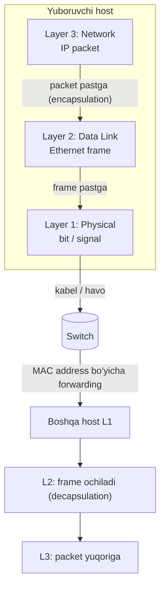
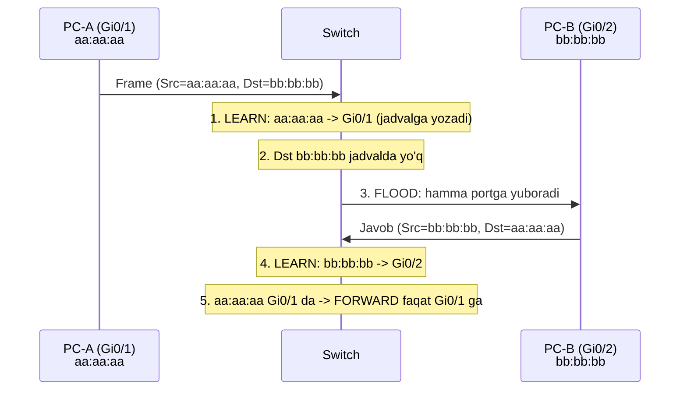
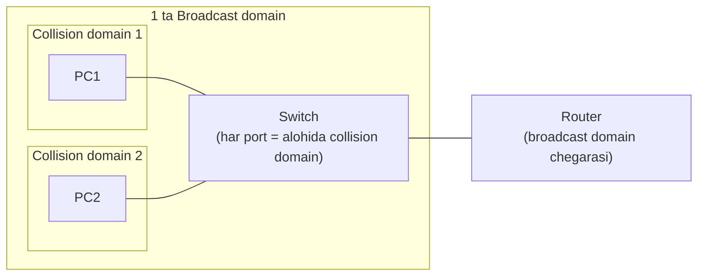
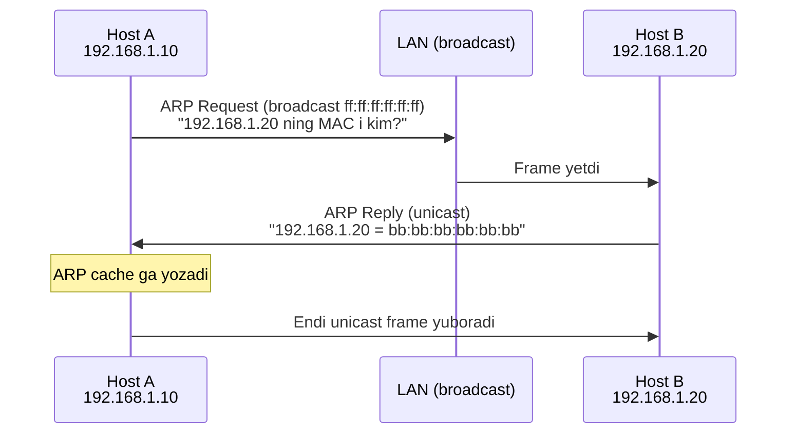

# 02. Data Link (L2) — Ethernet frame, MAC address, switch

## Muammo: bir necha qurilma bitta simda — kim kimga gapiryapti?

Oldingi darsda bitlar sim ichida signal bo'lib yugurishini ko'rdik. Lekin bir
muammo bor: bitta LAN da o'nlab qurilma bor. PC1 yuborgan signal PC2 ga ham, PC3
ga ham yetadi. Qanday qilib PC2 "bu menga" deb, PC3 "bu menga emas" deb biladi?

Yana: signalda `0` bir joyda buzilib `1` bo'lib qolsa-chi? Buni qanday sezamiz?

Mana shu ikki muammoni — **manzillash** va **xato topish** — **Data Link layer**
(kanal sathi, OSI L2) hal qiladi.

> **Oltin qoida:** Data Link layer bitta network segment ichida (bitta LAN) frame
> larni MAC address bo'yicha yetkazadi va xatoni topadi. IP manzil bu yerda ishlamaydi
> — u yuqori qatlam ishi.

## Analogiya: ko'p kvartirali uy

Physical layer — bino ichidagi yo'laklar (signal yo'li). Data Link layer esa
**kvartira raqamlari** tizimi:

- Har kvartirada unikal raqam bor — bu **MAC address** (Media Access Control
  address, NIC ning zavod raqami).
- Pochtachi xatni kvartira raqamiga qarab tashlaydi — switch frame ni MAC ga qarab
  yuboradi.
- Xat konverti — bu **frame** (kadr, L2 ma'lumot bo'lagi).

Farqi shundaki: MAC address faqat **shu bino ichida** ishlaydi. Boshqa shaharga
(boshqa network ga) xat yuborish uchun ko'cha manzili — **IP address** kerak.

## Sodda ta'rif

**Data Link layer** — OSI 2-qatlami; Network layerdan kelgan packetni **frame** ga
o'raydi, unga **MAC address** yozadi, **CRC** bilan xatoni topadi va bitta LAN
ichida yetkazadi. Asosiy protokol — **Ethernet** (IEEE 802.3).

PDU nomi shu yerda — **frame**.

## Diagramma: packet frame ga o'raladi



## Worked example 1 — Ethernet frame formati

Ethernet II frame 1970-yillardan beri deyarli o'zgarmagan. Byte-by-byte:

```text
+----------+-----+---------+---------+-----------+-------------+-----+
| Preamble | SFD | Dst MAC | Src MAC | EtherType | Payload     | FCS |
|  7 byte  | 1 B | 6 byte  | 6 byte  |  2 byte   | 46-1500 B   | 4 B |
+----------+-----+---------+---------+-----------+-------------+-----+
   <--- L1 sinxronizatsiya --->   <-- L2 header -->  <- data ->  <-CRC->
```

- **Preamble (7 byte):** `10101010...` — qabul tomon clock ni sinxronlaydi.
- **SFD (1 byte):** `10101011` — "frame boshlandi" signali.
- **Dst MAC / Src MAC (6+6 byte):** qabul va yuboruvchi NIC manzillari.
- **EtherType (2 byte):** payload qaysi protokol: `0x0800`=IPv4, `0x86DD`=IPv6,
  `0x0806`=ARP, `0x8100`=802.1Q VLAN.
- **Payload (46–1500 byte):** IP packet. MTU (Maximum Transmission Unit)=1500 byte.
  46 dan kichik bo'lsa **padding** qo'shiladi.
- **FCS (4 byte):** CRC-32 checksum — frame buzilganmi tekshirish uchun.

**Real misol (`tcpdump -e`):**
```text
14:23:01 aa:bb:cc:11:22:33 > dd:ee:ff:44:55:66, ethertype IPv4 (0x0800),
length 98: 192.168.1.10 > 192.168.1.20: ICMP echo request
```

## Worked example 2 — MAC address tuzilishi

MAC address — 48 bit (6 byte), hex formatda: `aa:bb:cc:dd:ee:ff`. NIC ga zavodda
yoziladi (BIA — Burned-In Address), lekin software bilan o'zgartirsa bo'ladi.

```text
+-----------+-----------+
|   OUI     |  NIC ID   |
|  24 bit   |  24 bit   |
| (vendor)  | (serial)  |
+-----------+-----------+
```

- **OUI** (Organizationally Unique Identifier) — birinchi 3 byte, vendorni bildiradi
  (Intel, Cisco, Apple).
- **Broadcast MAC:** `ff:ff:ff:ff:ff:ff` — segmentdagi barcha qurilmalarga.
- **Multicast MAC:** birinchi byte ning eng past biti = 1.

## Worked example 3 — switch MAC table (CAM table) qanday to'ladi

Switch aqlli bo'lishi uchun **MAC address table** (CAM table — Content Addressable
Memory) yuritadi: qaysi MAC qaysi portda turibdi. Bu jadval **o'z-o'zidan** to'ladi.



**Notional machine (ichkarida):** Switch har kelgan frame ning **source MAC** ini
va kelgan **port**ini jadvalga yozadi (learning). Destination MAC jadvalda bo'lsa —
faqat o'sha portga **forward**. Bo'lmasa — hamma portga **flood** qiladi. Yozuvlar
odatda **300 soniya** (aging time) yashaydi, keyin o'chadi.

**Cisco da ko'rish:**
```cisco
show mac address-table
```
```text
Vlan    Mac Address       Type     Ports
----    -----------       ----     -----
10      aaaa.aaaa.aaaa    DYNAMIC  Gi0/1
10      bbbb.bbbb.bbbb    DYNAMIC  Gi0/2
```

## Collision domain vs broadcast domain

Bu ikki tushuncha CCNA da eng ko'p chalkashtiriladigan juftlik.

| | Collision domain | Broadcast domain |
|--|------------------|------------------|
| Nima | Signal to'qnashadigan zona | Broadcast frame yetadigan zona |
| Hub | Bitta katta (hamma port) | Bitta |
| Switch | Har port alohida | Bitta (VLAN bir bo'lsa) |
| Router | Har interface alohida | Har interface alohida |
| Bo'ladi | Switch (har port) | **Router** yoki **VLAN** |



Muhim: switch broadcast ni **bloklamaydi** — u faqat collision domain ni ajratadi.
Broadcast domain ni ajratish uchun **router** yoki **VLAN** kerak (VLAN keyingi dars).

## Predict savoli (PRIMM)

> 🤔 **O'ylab ko'r:** Switch ga yangi frame keldi, destination MAC jadvalda YO'Q.
> Switch nima qiladi — tashlab yuboradimi, yoki nima?

<details>
<summary>💡 Javobni ko'rish</summary>

Switch frame ni **flood** qiladi — kelgan portdan tashqari **hamma** portga
yuboradi. Bu "unknown unicast flooding". Haqiqiy egasi javob berganda switch uning
MAC-port bog'lanishini o'rganadi va keyingi safar faqat o'sha portga forward qiladi.
Frame hech qachon "yo'qotilmaydi".
</details>

## ARP — IP dan MAC ga ko'prik

Host packet yuborishi uchun destination ning MAC ini bilishi kerak, lekin faqat IP
sini biladi. **ARP** (Address Resolution Protocol, RFC 826) IP ni MAC ga aylantiradi.



Nega request broadcast, reply unicast? Request da hech kim javob beruvchi MAC ni
bilmaydi — hammaga so'rash kerak. Reply da esa so'rovchi manzili ma'lum — unicast
yetadi.

```bash
ip neigh show      # zamonaviy: ARP/NDP cache
arp -a             # eski usul
```

## Xavfsizlik: L2 hujumlar va himoya (2025)

WebSearch bo'yicha, L2 — eng ko'p e'tibordan chetda qoladigan hujum yuzasi.

**1. MAC flooding (CAM table overflow):** hujumchi minglab soxta source MAC bilan
frame yuboradi, CAM table to'ladi. Ko'p switch **fail-open** rejimida ishlaydi —
jadval to'lganda hamma narsani flood qiladi (hub kabi), maxfiylik yo'qoladi.

Himoya — **port-security**:
```cisco
interface fastEthernet0/1
 switchport mode access
 switchport port-security
 switchport port-security maximum 2
 switchport port-security violation restrict
 switchport port-security mac-address sticky
```

**2. ARP spoofing:** zararli host soxta ARP reply yuborib, gateway MAC o'rniga o'z
MAC ini "joylab" MITM (man-in-the-middle) qiladi. Himoya — **Dynamic ARP Inspection
(DAI)** va **DHCP snooping**.

**3. DHCP snooping:** DHCP serverga ulangan portni "trusted", client portlarni
"untrusted" deb belgilaydi — soxta DHCP server va MAC flooding ni topadi.

> Amaliy qoida (2025): port-security + DHCP snooping + DAI kombinatsiyasi L2 ni
> asosiy hujumlardan himoya qiladi. Bittasi yetarli emas.

## Troubleshooting

```bash
# NIC holati va MAC
ip link show eth0
# Duplex mismatch belgisi: packet loss, sekin tezlik
ethtool eth0

# ARP jadvalini ko'rish
ip neigh show

# ARP trafikni kuzatish
sudo tcpdump -e -i eth0 arp
```

| Muammo | Belgi | Yechim |
|--------|-------|--------|
| Kabel uzilgan | `NO-CARRIER`, `state DOWN` | Kabel/port tekshir |
| Duplex mismatch | packet loss, sekin | `ethtool` bilan mos qil |
| MAC flooding | switch hub kabi ishlaydi | `port-security` |
| ARP spoofing | duplicate IP-MAC | DAI, `arpwatch` |
| Broadcast storm | tarmoq "qulaydi" | STP (6-dars) |

## Xulosa

- Data Link layer bitta LAN ichida frame larni **MAC address** bo'yicha yetkazadi.
- Ethernet frame: Preamble, MAC lar, EtherType, Payload, **FCS (CRC-32)**.
- MAC = 48 bit; OUI (vendor) + serial. Broadcast = `ff:ff:ff:ff:ff:ff`.
- **Switch** MAC table ni o'z-o'zidan to'ldiradi: learn → forward yoki flood.
- **Collision domain** — switch ajratadi; **broadcast domain** — router/VLAN ajratadi.
- **ARP** IP ni MAC ga aylantiradi (request broadcast, reply unicast).
- L2 himoyasi: port-security + DHCP snooping + DAI.

## 🧠 Eslab qol

- PDU nomi bu yerda — **frame**.
- Switch destination MAC ni bilmasa — **flood** qiladi.
- Switch collision domain ni ajratadi, broadcast domain ni EMAS.
- Broadcast domain ni faqat router yoki VLAN ajratadi.
- Har L2 hop da frame qayta yasaladi, IP packet o'zgarmaydi.

## ✅ O'z-o'zini tekshir (retrieval practice)

**1.** Nega har router hop da Ethernet frame qayta yasaladi, lekin IP packet
o'zgarmaydi?

<details>
<summary>Javob</summary>

MAC address faqat **local segment** ichida ma'noli. Har hop da yangi source/dst MAC
kerak (bu host → keyingi router). IP address esa **oxirgi manzil** — u butun yo'l
davomida bir xil (TTL kamayishidan tashqari). Shuning uchun L2 header har hop da
yangilanadi, L3 (IP) o'zgarmaydi.
</details>

**2.** Switch ga broadcast frame (`ff:ff:ff:ff:ff:ff`) kelsa nima qiladi?

<details>
<summary>Javob</summary>

Broadcast ni **hamma** portga forward qiladi (kelgan portdan tashqari) — chunki
switch broadcast ni bloklamaydi. Shuning uchun katta broadcast domain sekinlashadi.
Uni cheklash uchun VLAN yoki router kerak.
</details>

**3.** MAC flooding hujumida switch nega hub kabi ishlab qoladi?

<details>
<summary>Javob</summary>

Hujumchi CAM table ni soxta MAC lar bilan to'ldiradi. To'lgach switch yangi real MAC
ni o'rgana olmaydi va **fail-open** rejimida hamma unknown unicast ni flood qiladi
— ya'ni hub kabi. Bu hujumchiga boshqalar trafigini "eshitish" imkonini beradi.
Himoya: `port-security maximum`.
</details>

**4.** Collision domain va broadcast domain farqini bir jumlada ayt.

<details>
<summary>Javob</summary>

Collision domain — signal to'qnashuvi bo'ladigan zona (switch har portda ajratadi);
broadcast domain — broadcast frame yetadigan zona (faqat router yoki VLAN ajratadi).
</details>

## 🛠 Amaliyot

**1. Oson (Modify):** O'z kompyuteringda `ip neigh show` (Linux) yoki `arp -a`
(macOS/Windows) ishlatib, ARP cache ni ko'r. Gateway ning IP va MAC ini top.

<details>
<summary>Hint</summary>

Gateway odatda `.1` bilan tugaydi (masalan `192.168.1.1`). Uning MAC ini yozib ol —
bu routeringning NIC manzili.
</details>

**2. O'rta (Faded example):** Access portni MAC flooding dan himoyalash uchun
konfiguratsiyani to'ldir:

```cisco
interface fastEthernet0/5
 switchport mode access
 switchport access vlan 10
 // TODO: port-security ni yoq
 // TODO: maksimal 2 ta MAC
 // TODO: violation bo'lsa restrict qil
 // TODO: o'rganilgan MAC ni sticky saqla
```

<details>
<summary>Hint</summary>

`switchport port-security`, `switchport port-security maximum 2`, `switchport
port-security violation restrict`, `switchport port-security mac-address sticky`.
</details>

**3. Qiyin (Make):** 3 ta PC va 1 ta switch topologiyasi uchun tushuntir: PC1
birinchi marta PC3 ga frame yuborsa, switch qanday qadamlar qiladi va MAC table
qanday holatlarda o'zgaradi? Har qadamni yozib chiq.

<details>
<summary>Hint</summary>

Qadamlar: (1) source MAC ni learn qil, (2) dst MAC jadvalda yo'q -> flood, (3) PC3
javob berganda uning MAC ini learn qil, (4) keyingi frame lar to'g'ridan-to'g'ri
forward.
</details>

## 🔁 Takrorlash

**Bog'liq mavzular (shu modul ichida):**
- [01-physical-layer.md](01-physical-layer.md) — bit va signal, hub.
- [03-vlan.md](03-vlan.md) — bitta switchda broadcast domain ni ajratish.

**Takrorlash jadvali:**
- **Ertaga:** Ethernet frame formatini yoddan chiz (7 ta maydon).
- **3 kundan keyin:** Switch learning/forwarding/flooding jarayonini ayt.
- **1 haftadan keyin:** Collision vs broadcast domain savoliga qayta javob ber.

**Feynman testi:** Do'stingga tushuntir — nega har uyga kvartira raqami (MAC) kerak,
lekin boshqa shaharga xat yuborishda ko'cha manzili (IP) kerak? 3 jumlada.

## 📚 Manbalar

- Kurose & Ross, "Computer Networking", 7-nashr, 6-bob (Link Layer)
- RFC 826 — Address Resolution Protocol (ARP)
- IEEE 802.3 — Ethernet
- [NetSecCloud — Cisco MAC address table security best practices](https://netseccloud.com/cisco-mac-address-table-security-implications-and-best-practices)
- [NetsTuts — CAM Table / MAC Address Table Explained](https://www.netstuts.com/mac-address-table)
- [HowToNetwork — DHCP Snooping and Layer 2 threat mitigation](https://www.howtonetwork.com/free-ccna-study-guide-ccna-book/dhcp-snooping/)
