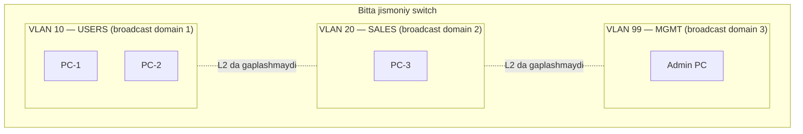

# 03. VLAN — bitta switchda mantiqiy tarmoqlar

## Muammo: hamma bitta broadcast domainda — bu yomon

Oldingi darsda ko'rdik: switch broadcast ni bloklamaydi. Endi tasavvur qil — 100
ta kompyuter bitta switchga ulangan. Buxgalteriya, savdo, mehmonlar, kameralar —
hammasi **bitta broadcast domain**da.

Muammolar:
- Har bir ARP, DHCP broadcast **100 ta** kompyuterni "bezovta" qiladi — sekinlik.
- Buxgalteriya kompyuteri mehmon laptopi bilan **bir xil L2** da — xavfsizlik yo'q.
- Bo'lim o'zgarsa, kabelni jismonan ko'chirish kerak — noqulaylik.

Bir yechim — har bo'limga alohida jismoniy switch olish. Lekin bu qimmat va
noqulay. Aynan shu muammoni **VLAN** hal qiladi.

> **Oltin qoida:** VLAN — bitta jismoniy switchni bir nechta mantiqiy switchga
> ajratadi. Har VLAN alohida broadcast domain. Lekin VLAN o'zi **routing qilmaydi**.

## Analogiya: bir binoda alohida ofislar

Bitta binoni tasavvur qil. Ichida bir nechta kompaniya ijaraga o'tirgan. Har
kompaniyaning:
- O'z eshigi va o'z xonalari bor (**VLAN**).
- Bir kompaniya xodimlari faqat o'zaro erkin yuradi (**bir VLAN ichida L2 aloqa**).
- Boshqa kompaniyaga kirish uchun umumiy koridor va qorovul (**router / L3**) orqali
  o'tish kerak.

Bino bitta (bitta switch), lekin ofislar mantiqan ajratilgan. Farqi: VLAN da
"eshik" — bu **VLAN ID** (1–4094 oralig'idagi raqam).

## Sodda ta'rif

**VLAN** (Virtual LAN) — bitta jismoniy switch ichida bir nechta alohida Layer 2
broadcast domain yaratish usuli. Har portga bitta VLAN ID beriladi; bir xil VLAN
dagi portlar o'zaro "ko'rishadi", turli VLAN dagilar ko'rishmaydi.

## Diagramma: bitta switch, uch VLAN



VLAN 10 dagi PC-1 va PC-2 bir-birini ko'radi. Lekin PC-1 (VLAN 10) va PC-3 (VLAN
20) o'zaro **to'g'ridan-to'g'ri gaplasha olmaydi** — bu uchun router kerak
(5-dars, inter-VLAN routing).

## VLAN nima beradi?

| Foyda | Tushuntirish |
|-------|--------------|
| Broadcast cheklash | Har VLAN alohida broadcast domain — kamroq shovqin |
| Segmentatsiya | Foydalanuvchilar bo'lim/vazifa bo'yicha ajraladi |
| Xavfsizlik | Turli VLAN L2 da to'g'ridan-to'g'ri gaplashmaydi |
| Tartib | Har VLAN ga alohida IP subnet mos keladi |
| Moslashuvchanlik | Xodim ko'chsa, kabelni emas, port VLAN ni o'zgartirasan |

## Worked example 1 — access port va VLAN yaratish

**Access port** — bitta endpoint (PC, printer, kamera, IP phone) uchun; faqat bitta
data VLAN ga tegishli.

```cisco
! --- 1-qadam: VLAN larni yaratamiz (nom bilan) ---
configure terminal
vlan 10
 name USERS
vlan 20
 name SALES
vlan 99
 name MGMT

! --- 2-qadam: portni access rejimga va VLAN ga qo'yamiz ---
interface fastEthernet0/1
 description PC-1
 switchport mode access
 switchport access vlan 10
 no shutdown

interface fastEthernet0/2
 description PC-2
 switchport mode access
 switchport access vlan 20
 no shutdown
end
```

**Tekshirish:**
```cisco
show vlan brief
```
```text
VLAN Name      Status    Ports
---- ----      ------    -----
10   USERS     active    Fa0/1
20   SALES     active    Fa0/2
99   MGMT      active
```

## Worked example 2 — voice VLAN

IP phone va PC bitta portga ulanganda **voice VLAN** ishlatiladi. Telefon voice
VLAN dan, telefon ortidagi PC access VLAN dan foydalanadi (bitta kabel, ikki VLAN).

```cisco
interface fastEthernet0/10
 description IP-PHONE-VA-PC
 switchport mode access
 switchport access vlan 10        ! PC uchun data VLAN
 switchport voice vlan 30         ! telefon uchun voice VLAN
 spanning-tree portfast
 no shutdown
```

**Notional machine:** Telefon o'z frame lariga VLAN 30 tag qo'yadi, PC frame lari
esa tagsiz (VLAN 10) ketadi. Telefon voice VLAN ID ni switchdan **CDP/LLDP-MED**
orqali oladi (8-dars mavzusi).

## Worked example 3 — ishlatilmagan portlarni himoyalash

WebSearch (2025 best practice): **har ochiq port — hujum yuzasi**. Ishlatilmayotgan
portlarni "parking" VLAN ga qo'y va shutdown qil.

```cisco
vlan 999
 name UNUSED-PARKING

interface range fastEthernet0/3 - 24
 description UNUSED-PORT
 switchport mode access
 switchport access vlan 999
 shutdown
```

Nega VLAN 1 emas? Chunki VLAN 1 default va hujumchilar birinchi shuni sinaydi.

## VLAN va IP subnet — 1:1 qoida

Odatda har VLAN ga alohida IP subnet beriladi:

```text
VLAN 10 USERS  -> 192.168.10.0/24  gateway 192.168.10.1
VLAN 20 SALES  -> 192.168.20.0/24  gateway 192.168.20.1
VLAN 99 MGMT   -> 192.168.99.0/24  gateway 192.168.99.1
```

Gateway odatda router subinterface yoki L3 switch SVI manzili (5-dars). PC
sozlamasi:
```text
PC (VLAN 10): IP 192.168.10.10 | Mask 255.255.255.0 | Gateway 192.168.10.1
```

## Xavfsizlik: VLAN hopping (2025)

WebSearch bo'yicha muhim ogohlantirish:

> VLAN segmentatsiya beradi, **xavfsizlik emas**. Qattiqlashtiruv (hardening)
> bo'lmasa, L2 tarmoq hujumga ochiq.

**VLAN hopping** — hujumchi o'z VLAN dan boshqa VLAN ga "sakraydi". Ikki usul:

1. **Switch spoofing:** hujumchi DTP paket yuborib, switch ni trunk qilishga aldaydi
   -> hamma VLAN ga kirish. Himoya: DTP ni o'chir (4-dars), access portni qat'iy
   `switchport mode access` qil.
2. **Double tagging:** ikki 802.1Q tag qo'yib, native VLAN orqali sakraydi. Himoya:
   native VLAN ni ishlatilmagan VLAN ga o'zgartir, VLAN 1 da user trafik qoldirma.

Qo'shimcha: `port-security` bilan port boshiga MAC sonini cheklab qo'y (2-dars).

## Predict savoli (PRIMM)

> 🤔 **O'ylab ko'r:** Portga `switchport access vlan 10` berding, lekin `switchport
> mode access` ni unutding. VLAN 10 esa hali yaratilmagan. Nima bo'ladi?

<details>
<summary>💡 Javobni ko'rish</summary>

Ikki muammo bir vaqtda:
1. `mode access` yo'q -> port default rejimda (ko'p Cisco switchda `dynamic auto`)
   qolib, DTP orqali kutilmagan trunk bo'lishi mumkin. Bu VLAN hopping xavfi.
2. VLAN 10 yaratilmagan -> ba'zi switchlarda port `inactive` bo'ladi, PC tarmoqni
   ko'rmaydi.

To'g'risi: avval `vlan 10` yarat, keyin `switchport mode access` VA `switchport
access vlan 10` — ikkalasini ham ber.
</details>

## Troubleshooting

Muammo: bir VLAN ichidagi PC boshqa PC ga ping qila olmayapti.

```cisco
show vlan brief                                  ! VLAN bormi, port to'g'ri VLAN da?
show interfaces fastEthernet0/1 switchport       ! port access mode va VLAN
show interfaces fastEthernet0/1 status           ! port up mi, connected mi?
show mac address-table interface fastEthernet0/1 ! MAC o'rganilganmi?
```

Endpoint tomonda tekshir: IP to'g'rimi, mask to'g'rimi, kabel to'g'ri portdami,
port shutdown emasmi.

## Ko'p uchraydigan xatolar

| Xato | Nega yomon | To'g'risi |
|------|-----------|-----------|
| VLAN 1 ni hamma narsa uchun | VLAN hopping xavfi | Alohida VLAN yarat |
| `access vlan 10` bor, `mode access` yo'q | DTP trunk xavfi | Ikkalasini ham ber |
| VLAN yaratmasdan portga qo'yish | Port inactive bo'ladi | Avval VLAN yarat |
| Gateway noto'g'ri VLAN da | Routing ishlamaydi | To'g'ri subnet gateway ber |
| Trunk portni access deb izlash | Chalkashlik | `show interfaces trunk` ishlat |

## Xulosa

- **VLAN** bitta jismoniy switchni bir nechta L2 broadcast domain ga ajratadi.
- Har portga bitta **VLAN ID** (1–4094) beriladi.
- Bir VLAN ichida L2 aloqa bor; VLAN lar orasida faqat router/L3 orqali.
- **Access port** — bitta data VLAN; **voice VLAN** telefon uchun qo'shimcha.
- Har VLAN ga 1 ta IP subnet mos keladi (1:1 qoida).
- VLAN segmentatsiya beradi, xavfsizlik emas — hardening (DTP off, native VLAN,
  port-security) shart.

## 🧠 Eslab qol

- VLAN = alohida broadcast domain, lekin routing YO'Q.
- Access port = bitta data VLAN (+ ixtiyoriy voice VLAN).
- VLAN 1 ni user trafik uchun ishlatma.
- Ishlatilmagan port -> parking VLAN + shutdown.
- 1 VLAN = 1 IP subnet.

## ✅ O'z-o'zini tekshir (retrieval practice)

**1.** Nega VLAN o'zi ikki bo'lim orasida aloqani ta'minlay olmaydi?

<details>
<summary>Javob</summary>

VLAN faqat **Layer 2** ajratish beradi — u broadcast domain ni bo'ladi. Turli VLAN
turli IP subnet da; ular orasida gaplashish uchun **Layer 3 routing** kerak (router
subinterface yoki L3 switch SVI). VLAN o'zi packet ni yo'naltirmaydi.
</details>

**2.** Ikkita PC bitta switchda, lekin biri VLAN 10, ikkinchisi VLAN 20 da. Ping
ishlaydimi?

<details>
<summary>Javob</summary>

Yo'q. Ular turli broadcast domain va turli subnetda. Inter-VLAN routing sozlanmagan
bo'lsa, L2 da ular bir-birini ko'rmaydi. Router yoki L3 switch qo'shilsa ishlaydi.
</details>

**3.** VLAN hopping hujumini ikki usulini va himoyasini ayt.

<details>
<summary>Javob</summary>

(1) Switch spoofing — hujumchi DTP bilan trunk yasaydi; himoya: DTP off,
`switchport mode access`. (2) Double tagging — ikki tag bilan native VLAN orqali;
himoya: native VLAN ni ishlatilmagan VLAN ga o'zgartir, VLAN 1 ni bo'shat.
</details>

**4.** Voice VLAN portda telefon va PC frame lari qanday farqlanadi?

<details>
<summary>Javob</summary>

Telefon o'z trafigiga voice VLAN (masalan 30) tag qo'yadi; PC trafigi tagsiz
(access/data VLAN, masalan 10) ketadi. Switch tag borligiga qarab ularni to'g'ri
VLAN ga ajratadi. Telefon voice VLAN ID ni CDP/LLDP-MED orqali oladi.
</details>

## 🛠 Amaliyot

**1. Oson (Modify):** Yuqoridagi worked example 1 dagi VLAN nomlarini o'zgartir:
`USERS` -> `OFFICE`, `SALES` -> `MARKETING`. VLAN ID lariga tegma. Nom trafikka
ta'sir qiladimi?

<details>
<summary>Hint</summary>

Nom faqat administrator uchun qulaylik — trafikka ta'sir qilmaydi. Faqat VLAN ID
muhim. `vlan 10` / `name OFFICE`.
</details>

**2. O'rta (Faded example):** Ip phone + PC porti konfiguratsiyasini to'ldir:

```cisco
interface fastEthernet0/12
 description IP-PHONE-PC
 switchport mode access
 // TODO: PC uchun data VLAN 10
 // TODO: telefon uchun voice VLAN 30
 // TODO: portfast yoq
 no shutdown
```

<details>
<summary>Hint</summary>

`switchport access vlan 10`, `switchport voice vlan 30`, `spanning-tree portfast`.
</details>

**3. Qiyin (Make):** Ofis uchun VLAN rejasini noldan yoz: 3 bo'lim (HR, IT, GUEST),
har biriga VLAN ID, nom, IP subnet va gateway tayinla. Ishlatilmagan portlar uchun
ham reja ber.

<details>
<summary>Hint</summary>

Masalan VLAN 10 HR / 192.168.10.0/24, VLAN 20 IT / 192.168.20.0/24, VLAN 40 GUEST /
192.168.40.0/24, VLAN 999 UNUSED (shutdown). Native/mgmt VLAN ni alohida ajrat.
</details>

## 🔁 Takrorlash

**Bog'liq mavzular (shu modul ichida):**
- [02-data-link-ethernet-mac.md](02-data-link-ethernet-mac.md) — broadcast domain
  tushunchasi.
- [04-trunk-8021q.md](04-trunk-8021q.md) — VLAN larni switchlar orasida tashish.
- [05-inter-vlan-routing.md](05-inter-vlan-routing.md) — VLAN lar orasida aloqa.

**Takrorlash jadvali:**
- **Ertaga:** VLAN nima beradi (5 ta foyda) ni yoddan ayt.
- **3 kundan keyin:** Access port konfiguratsiyasini yozib chiq.
- **1 haftadan keyin:** VLAN hopping himoyasini takrorla.

**Feynman testi:** "Bino ichida alohida ofis" analogiyasidan foydalanib, VLAN nima
ekanini do'stingga 3 jumlada tushuntir.

## 📚 Manbalar

- Cisco CCNA 200-301 — VLANs and Trunking
- [PingLabz — VLAN Security Hardening on Cisco Switches](https://www.pinglabz.com/vlan-security-best-practices/)
- [Cisco — VLAN Best Practices and Security Tips](https://www.cisco.com/c/en/us/support/docs/smb/routers/cisco-rv-series-small-business-routers/1778-tz-VLAN-Best-Practices-and-Security-Tips-for-Cisco-Business-Routers.html)
- [TechTarget — What is VLAN hopping and how does it work](https://www.techtarget.com/searchsecurity/definition/VLAN-hopping)
