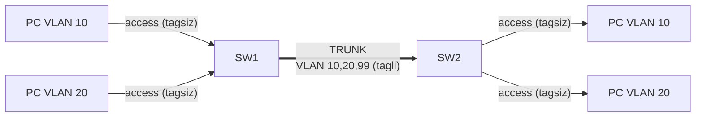
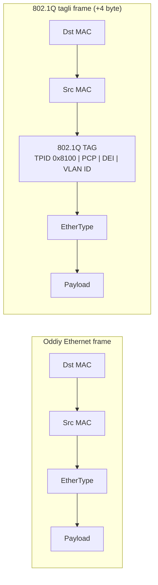

# 04. Trunk va 802.1Q — VLAN larni switchlar orasida tashish

## Muammo: VLAN 10 ikki switchda bor, lekin ular gaplashmayapti

Oldingi darsda VLAN yaratdik. Endi real vaziyat: SW1 da VLAN 10 dagi PC-A bor,
SW2 da ham VLAN 10 dagi PC-B bor. Ular bir xil VLAN, bir xil subnetda. Ping
ishlashi kerak-ku?

Lekin SW1 va SW2 ni oddiy (access) kabel bilan ulasang — muammo. Access link faqat
**bitta** VLAN ni tashiy oladi. VLAN 10, 20, 99 hammasini bitta kabeldan o'tkazish
uchun har VLAN ga alohida kabel kerakmi? 3 VLAN = 3 kabel, 50 VLAN = 50 kabel? Bu
aqlga sig'maydi.

Aynan shu muammoni **trunk** hal qiladi.

> **Oltin qoida:** Trunk — bitta jismoniy link orqali bir nechta VLAN trafigini
> o'tkazadigan switchport rejimi. Har frame ga **802.1Q tag** qo'yiladi, shunda qabul
> tomon frame qaysi VLAN ga tegishli ekanini biladi.

## Analogiya: rangli yorliqli pochta konteyneri

Access link — bitta bo'lim uchun bitta yuk mashinasi (bitta VLAN). Trunk esa —
**umumiy magistral yuk mashinasi**: ichida turli bo'limlarning qutilari bor, lekin
har qutida **rangli yorliq** (802.1Q tag) yopishtirilgan:

- Qizil yorliq = VLAN 10, ko'k = VLAN 20, yashil = VLAN 99.
- Yuk mashinasi bitta yo'ldan yuradi (bitta kabel).
- Manzilga yetgach, yorliqqa qarab qutilar to'g'ri bo'limlarga tarqatiladi.

Farqi: bitta maxsus quti **yorliqsiz** ketadi — bu **native VLAN**. Uni pastda
ko'ramiz.

## Sodda ta'rif

**Trunk** — bir nechta VLAN trafigini bitta link orqali o'tkazadigan switchport
rejimi. **802.1Q** (dot1Q) — Ethernet frame ichiga 4 baytlik VLAN tag qo'shish
standarti.

## Diagramma: access vs trunk



Access port frame ni **tagsiz** yuboradi (switch VLAN ni port orqali biladi). Trunk
port frame ga **tag** qo'yadi, shunda qarshi switch VLAN ni tag orqali biladi.

## 802.1Q tag ichida nima bor?



Tag maydonlari (4 byte):
- **TPID** (`0x8100`) — "bu tagli frame" belgisi.
- **PCP** (3 bit) — Priority (QoS uchun, 0–7).
- **DEI** (1 bit) — drop qilinsa bo'ladigan belgi.
- **VLAN ID** (12 bit) — 1–4094 (0 va 4095 zaxira).

12 bit = 4096 VLAN. Native VLAN frame lari **tagsiz** ketadi — bu farqni yaxshi
eslab qol.

## Native VLAN — yorliqsiz konteyner

**Native VLAN** — trunkda taglanmaydigan yagona VLAN. Cisco da default native VLAN
— VLAN 1. Xavfsizlik uchun uni ishlatilmagan VLAN ga o'zgartirish tavsiya etiladi.

Nega muhim? Agar trunkning ikki tomonida native VLAN **farq qilsa**, tagsiz
trafik noto'g'ri VLAN ga tushadi — bu ham nosozlik, ham xavfsizlik teshigi (double
tagging hujumi).

```cisco
vlan 999
 name NATIVE-BLACKHOLE

interface gigabitEthernet0/1
 description TRUNK-TO-SW2
 switchport mode trunk
 switchport trunk native vlan 999
 switchport trunk allowed vlan 10,20,99,999
 no shutdown
```

> Ikkala tomonda native VLAN **bir xil** bo'lishi shart.

## Worked example — switch-to-switch trunk (to'liq)

**SW1:**
```cisco
! --- 1-qadam: kerakli VLAN larni yaratamiz ---
configure terminal
vlan 10
 name USERS
vlan 20
 name SALES
vlan 99
 name MGMT
vlan 999
 name NATIVE-BLACKHOLE

! --- 2-qadam: uplink portni trunk qilamiz ---
interface gigabitEthernet0/1
 description TRUNK-TO-SW2
 switchport mode trunk
 switchport trunk native vlan 999
 switchport trunk allowed vlan 10,20,99,999
 switchport nonegotiate
 no shutdown
end
```

**SW2:** aynan shunday, faqat `description TRUNK-TO-SW1`. Native VLAN va allowed
list bir xil bo'lishi shart.

**Tekshirish:**
```cisco
show interfaces trunk
```
```text
Port    Mode  Encapsulation  Status    Native vlan
Gi0/1   on    802.1q         trunking  999

Port    Vlans allowed on trunk
Gi0/1   10,20,99,999
```

`show interfaces trunk` da tekshir: port trunk holatidami, encapsulation 802.1q mi,
native VLAN to'g'rimi, allowed listda kerakli VLAN bormi.

## DTP — nega o'chirish kerak (2025)

**DTP** (Dynamic Trunking Protocol) — Cisco proprietary, trunk ni avtomatik
kelishadi. Lab da qulay, lekin production da **xavf**.

WebSearch (2025) aniq aytadi:

> Hujumchi DTP paket yuborib, switch ni trunk qilishga aldaydi (switch spoofing) va
> hamma VLAN ga kirish oladi. Barcha trunk larni qo'lda `switchport mode trunk` qil
> va `switchport nonegotiate` bilan DTP ni o'chir.

Xavfsiz shablon:
- Infrastruktura linklari (switch-switch): `switchport mode trunk` + `switchport
  nonegotiate`.
- Host portlari: `switchport mode access` + `switchport nonegotiate` — hech qachon
  trunk bo'lolmaydi.

Eslatma: `switchport nonegotiate` ba'zi platformalarda yoki Packet Tracer da
ishlamasligi mumkin.

## Router-on-a-stick uchun trunk

Routerga bir nechta VLAN ni olib borish uchun switch-router link ham trunk bo'ladi:

```cisco
interface gigabitEthernet0/2
 description TRUNK-TO-R1
 switchport mode trunk
 switchport trunk allowed vlan 10,20
 switchport nonegotiate
 no shutdown
```

Router tomonida subinterface sozlanadi — bu 5-darsda (inter-VLAN routing).

## Allowed VLAN — ehtiyot bo'l

Best practice: trunkda faqat kerakli VLAN larga ruxsat ber (allowed list ni chekla).
Lekin buyruq bilan ehtiyot bo'l:

```cisco
switchport trunk allowed vlan 10,20,99      ! HAMMASINI qayta belgilaydi
switchport trunk allowed vlan add 30        ! qo'shadi (xavfsiz)
switchport trunk allowed vlan remove 20     ! olib tashlaydi
```

`allowed vlan 30` deb yozsang, avvalgi 10,20,99 **o'chib ketadi** — faqat 30 qoladi.
Bu klassik xato. Qo'shish uchun doim `add` ishlat.

## Predict savoli (PRIMM)

> 🤔 **O'ylab ko'r:** SW1 trunk da native VLAN 999, SW2 trunk da native VLAN 1
> (default). Ikkala switchda VLAN 10 bor. VLAN 10 dagi PC lar bir-birini ko'radimi?
> Log da nima chiqadi?

<details>
<summary>💡 Javobni ko'rish</summary>

VLAN 10 tagli ketadi, shuning uchun VLAN 10 trafigi ishlashi mumkin. LEKIN native
VLAN mismatch bor: tagsiz (native) trafik noto'g'ri VLAN ga tushadi. Cisco log da:

```text
%CDP-4-NATIVE_VLAN_MISMATCH: Native VLAN mismatch discovered on GigabitEthernet0/1
```

Bu ham nosozlik, ham xavfsizlik teshigi. Yechim: ikkala tomonda `switchport trunk
native vlan 999`.
</details>

## Troubleshooting

Muammo: SW1 dagi VLAN 10 PC, SW2 dagi VLAN 10 PC ga ping qila olmayapti.

```cisco
show vlan brief             ! ikkala switchda VLAN 10 bormi?
show interfaces trunk       ! uplink trunk mi, allowed listda 10 bormi?
show mac address-table vlan 10
show spanning-tree vlan 10  ! STP portni blocking qilmayaptimi?
```

Tekshiruv tartibi:
1. Ikkala switchda VLAN 10 yaratilganmi?
2. Uplink trunk mi (access emas)?
3. Allowed listda VLAN 10 bormi?
4. Native VLAN mismatch yo'qmi?
5. STP portni blocking qilmayaptimi (6-dars)?
6. PC IP/subnet to'g'rimi?

## Ko'p uchraydigan xatolar

| Xato | Nega yomon | To'g'risi |
|------|-----------|-----------|
| Bir tomon access, bir tomon trunk | Link ishlamaydi | Ikkalasi ham trunk |
| VLAN allowed listda yo'q | O'sha VLAN o'tmaydi | `allowed vlan add` |
| Native VLAN 1 da qolgan | Double tagging xavfi | Ishlatilmagan VLAN ga |
| Native VLAN ikki tomonda farq | Mismatch, log warning | Ikkala tomonda bir xil |
| `allowed vlan 30` (add siz) | Boshqa VLAN o'chadi | Doim `add`/`remove` |
| ROAS da switch port access | Router VLAN ko'rmaydi | Switch-router link trunk |

## Xulosa

- **Trunk** bitta linkdan bir nechta VLAN trafigini o'tkazadi.
- **802.1Q** frame ga 4 baytlik tag (VLAN ID 1–4094) qo'shadi.
- **Native VLAN** frame lari tagsiz ketadi; ikkala tomonda bir xil bo'lishi shart.
- **DTP** ni o'chir (`switchport nonegotiate`) — VLAN hopping himoyasi.
- Allowed VLAN listni chekla; qo'shishda doim `add` ishlat.
- Router-on-a-stick uchun switch-router link ham trunk.

## 🧠 Eslab qol

- Access = tagsiz (bitta VLAN); Trunk = tagli (ko'p VLAN).
- Native VLAN tagsiz ketadi — ikki tomonda bir xil qil.
- DTP ni o'chir: `switchport nonegotiate`.
- `allowed vlan 30` avvalgilarni o'chiradi — `add` ishlat.
- Native VLAN mismatch = log warning + xavfsizlik teshigi.

## ✅ O'z-o'zini tekshir (retrieval practice)

**1.** Nega access link ikki switch orasida ko'p VLAN uchun yaramaydi?

<details>
<summary>Javob</summary>

Access link frame ni **tagsiz** yuboradi va faqat **bitta** VLAN ni tashiydi. Qabul
switch frame qaysi VLAN ekanini bilolmaydi. Ko'p VLAN uchun tag kerak — bu trunk
(802.1Q) ning ishi.
</details>

**2.** Native VLAN frame lari nega tagsiz ketadi va bu qanday xavf tug'diradi?

<details>
<summary>Javob</summary>

Native VLAN 802.1Q standartida orqaga moslik uchun tagsiz ketadi (eski tagsiz
qurilmalar bilan ishlashi uchun). Xavf: ikki tomonda native farq qilsa tagsiz trafik
noto'g'ri VLAN ga tushadi; hujumchi ikki tag qo'yib (double tagging) native orqali
boshqa VLAN ga sakraydi.
</details>

**3.** `switchport trunk allowed vlan 30` yozsang, avval bor VLAN 10,20 ga nima
bo'ladi?

<details>
<summary>Javob</summary>

Ular **o'chib ketadi** — bu buyruq allowed listni to'liq qayta belgilaydi, faqat
VLAN 30 qoladi. VLAN 10,20 endi trunkdan o'tmaydi. To'g'risi: `switchport trunk
allowed vlan add 30`.
</details>

**4.** DTP ni nega production da o'chirish kerak?

<details>
<summary>Javob</summary>

DTP avtomatik trunk kelishadi, lekin hujumchi DTP paket yuborib switch ni trunk
qilishga aldashi (switch spoofing) va hamma VLAN ga kirishi mumkin. Himoya:
trunk ni qo'lda `switchport mode trunk` + `switchport nonegotiate`.
</details>

## 🛠 Amaliyot

**1. Oson (Modify):** Yuqoridagi SW1 trunk konfiguratsiyasiga VLAN 30 (VOICE)
qo'sh — lekin mavjud VLAN larni o'chirmasdan.

<details>
<summary>Hint</summary>

`switchport trunk allowed vlan add 30`. `add` bo'lmasa 10,20,99,999 o'chib ketadi.
</details>

**2. O'rta (Faded example):** Xavfsiz trunk konfiguratsiyasini to'ldir:

```cisco
interface gigabitEthernet0/1
 description TRUNK-TO-SW2
 // TODO: trunk rejimini qat'iy o'rnat
 // TODO: native VLAN ni 999 qil
 // TODO: faqat VLAN 10,20,99,999 ga ruxsat
 // TODO: DTP ni o'chir
 no shutdown
```

<details>
<summary>Hint</summary>

`switchport mode trunk`, `switchport trunk native vlan 999`, `switchport trunk
allowed vlan 10,20,99,999`, `switchport nonegotiate`.
</details>

**3. Qiyin (Make):** Native VLAN mismatch xatosini simulyatsiya qil: SW1 da native
999, SW2 da native 1 qo'y. `show interfaces trunk` da qanday farq ko'rinadi va log
da qanday xabar chiqadi? Keyin xatoni tuzat.

<details>
<summary>Hint</summary>

Log: `%CDP-4-NATIVE_VLAN_MISMATCH`. `show interfaces trunk` da ikki port Native vlan
ustuni farqli. Tuzatish: SW2 da `switchport trunk native vlan 999`.
</details>

## 🔁 Takrorlash

**Bog'liq mavzular (shu modul ichida):**
- [03-vlan.md](03-vlan.md) — VLAN va access port.
- [05-inter-vlan-routing.md](05-inter-vlan-routing.md) — trunk orqali routing.
- [08-cdp-lldp.md](08-cdp-lldp.md) — native VLAN mismatch ni CDP topadi.

**Takrorlash jadvali:**
- **Ertaga:** 802.1Q tag maydonlarini (TPID, PCP, DEI, VLAN ID) yoddan ayt.
- **3 kundan keyin:** Trunk konfiguratsiyasini yozib chiq.
- **1 haftadan keyin:** DTP va native VLAN xavfsizligini takrorla.

**Feynman testi:** "Rangli yorliqli yuk mashinasi" analogiyasidan foydalanib, trunk
va 802.1Q tag ni do'stingga 3 jumlada tushuntir.

## 📚 Manbalar

- Cisco CCNA 200-301 — VLAN Trunking, 802.1Q
- IEEE 802.1Q — VLAN Tagging
- [NetsTuts — 802.1Q VLAN Tagging, Native VLAN, Trunk Ports](https://www.netstuts.com/vlan-tagging)
- [NetworkAcademy.IO — Trunk Native VLAN](https://www.networkacademy.io/ccna/ethernet/trunk-native-vlan)
- [Medium — Preventing VLAN Hopping Attacks (CCNA-level)](https://medium.com/@enyel.salas84/preventing-vlan-hopping-attacks-in-cisco-networks-a-ccna-level-guide-4458a6fc518a)
