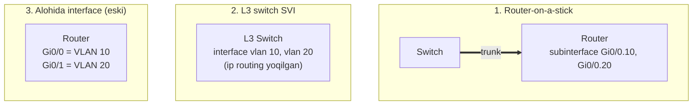

# 05. Inter-VLAN Routing — VLAN lar orasida aloqa

## Muammo: VLAN lar ajratildi, endi ular gaplashishi kerak

Oldingi darslarda VLAN yaratdik va broadcast domain larni ajratdik. Bu ajoyib —
lekin real hayotda bo'limlar **ba'zan** gaplashishi kerak. Savdo bo'limi (VLAN 20)
umumiy fayl serverga (VLAN 50) kirishi, HR (VLAN 10) internetga chiqishi kerak.

VLAN lar Layer 2 da ajratilgan, turli IP subnetda. Switch o'zi ularni bog'lay
olmaydi — chunki switch faqat L2 (MAC) bilan ishlaydi, IP bilan emas.

Bizga **Layer 3 qurilma** — router yoki L3 switch kerak. Bu jarayon **inter-VLAN
routing** deyiladi.

> **Oltin qoida:** VLAN lar orasida aloqa faqat Layer 3 (routing) orqali. Har VLAN
> ga bitta **gateway** IP kerak; PC lar shu gateway orqali boshqa VLAN ga chiqadi.

## Analogiya: bino koridori va qorovul

Har ofis (VLAN) o'z ichida erkin harakat qiladi. Boshqa ofisga o'tish uchun **umumiy
koridor**dan yurish kerak, koridorda **qorovul** (router) turadi:

- Qorovul har ofisning eshigini biladi (har VLAN ning gateway IP si).
- Bir ofisdan chiqqan xat qorovulga keladi, u to'g'ri ofis eshigiga olib boradi.
- Qorovulsiz ofislar bir-biriga o'tolmaydi.

Gateway — bu ofis eshigidagi qorovul manzili. PC "o'z subnetimda yo'q — gateway ga
beray" deydi.

## Sodda ta'rif

**Inter-VLAN routing** — turli VLAN lar (turli IP subnetlar) orasida Layer 3
routing orqali aloqa o'rnatish. Uch usul bor: alohida router interface (eski),
**router-on-a-stick** (ROAS), **L3 switch SVI**.

## Diagramma: uch usul



| Usul | Qayerda | Tezlik |
|------|---------|--------|
| Alohida interface | Eski, kam ishlatiladi | VLAN soni = port soni |
| Router-on-a-stick | Lab, kichik filial | Trunk bandwidth bilan cheklangan |
| L3 switch SVI | Zamonaviy campus | Wire-speed (hardware) |

## Worked example 1 — Router-on-a-stick (ROAS)

**Topologiya:** PC1 (VLAN 10) va PC2 (VLAN 20) SW1 ga ulangan, SW1 R1 ga bitta
trunk kabel bilan bog'langan.

**Switch tomonda:**
```cisco
! --- 1-qadam: VLAN va access portlar ---
configure terminal
vlan 10
 name USERS
vlan 20
 name SALES

interface fastEthernet0/1
 switchport mode access
 switchport access vlan 10

interface fastEthernet0/2
 switchport mode access
 switchport access vlan 20

! --- 2-qadam: routerga trunk ---
interface gigabitEthernet0/1
 description TRUNK-TO-R1
 switchport mode trunk
 switchport trunk allowed vlan 10,20
 no shutdown
end
```

**Router tomonda (subinterface):**
```cisco
! --- 1-qadam: fizik interface ni yoqamiz (IP siz) ---
configure terminal
interface gigabitEthernet0/0
 description TO-SW1
 no shutdown

! --- 2-qadam: har VLAN uchun subinterface + gateway IP ---
interface gigabitEthernet0/0.10
 description VLAN10-GATEWAY
 encapsulation dot1Q 10
 ip address 192.168.10.1 255.255.255.0

interface gigabitEthernet0/0.20
 description VLAN20-GATEWAY
 encapsulation dot1Q 20
 ip address 192.168.20.1 255.255.255.0
end
```

**Notional machine:** PC1 (VLAN 10) PC2 (VLAN 20) ga packet yubormoqchi. PC1 "boshqa
subnet" deb gateway 192.168.10.1 ga (router subinterface Gi0/0.10) yuboradi. Router
IP ni ko'radi, VLAN 20 ga routing qiladi, endi VLAN 20 tag bilan Gi0/0.20 orqali
qaytaradi. **Har packet trunkni ikki marta kesib o'tadi** (kirish + chiqish) — bu
"hairpin" va bandwidth cheklovi.

**PC sozlamalari:**
```text
PC1: IP 192.168.10.10 | Gateway 192.168.10.1
PC2: IP 192.168.20.10 | Gateway 192.168.20.1
```

## Worked example 2 — L3 switch SVI (zamonaviy)

**SVI** (Switched Virtual Interface) — VLAN uchun virtual Layer 3 interface. L3
switch VLAN va routing ni bir qutida, hardware da bajaradi.

```cisco
! --- 1-qadam: routing ni yoqamiz (ENG MUHIM) ---
configure terminal
ip routing

! --- 2-qadam: VLAN lar ---
vlan 10
 name USERS
vlan 20
 name SALES

! --- 3-qadam: har VLAN uchun SVI (gateway) ---
interface vlan 10
 description VLAN10-GATEWAY
 ip address 192.168.10.1 255.255.255.0
 no shutdown

interface vlan 20
 description VLAN20-GATEWAY
 ip address 192.168.20.1 255.255.255.0
 no shutdown
end
```

Access portlar oddiy:
```cisco
interface fastEthernet0/1
 switchport mode access
 switchport access vlan 10
```

> Muhim: `ip routing` yoqilmasa, SVI lar gateway kabi ishlamaydi. Bu eng ko'p
> uchraydigan xato.

## ROAS vs L3 switch — qaysi birini tanlash (2025)

WebSearch bo'yicha aniq yo'l-yo'riq:

- **L3 switch SVI** Catalyst 9300 da **wire-speed** (40 Gbps+ per port) routing
  qiladi — hardware da, hairpin yo'q.
- **Router-on-a-stick** software da routing qiladi va har inter-VLAN packet trunkni
  ikki marta kesadi — bandwidth cheklangan.
- Qoida: bir-ikki access switch dan ko'p bo'lsa yoki inter-VLAN trafik ko'p bo'lsa —
  **L3 switch**. Lab yoki kichik filial (faqat L2 switch bor) — **ROAS**.

| Mezon | Router-on-a-stick | L3 switch SVI |
|-------|-------------------|---------------|
| Routing joyi | Software | Hardware (ASIC) |
| Tezlik | Trunk bilan cheklangan | Wire-speed |
| Hairpin | Ha (trunkni 2x kesadi) | Yo'q |
| Ko'lam | Kichik/lab | Katta campus |
| Narx | Router + switch | Bitta L3 switch (ko'pincha arzonroq) |

> Xulosa (2025): production da **L3 switch SVI** default. ROAS faqat kichik/lab uchun.

## Routed port — L3 switch da alohida holat

L3 switch da portni switchport emas, to'g'ridan-to'g'ri routed interface qilsa
bo'ladi (odatda core/distribution ulanishi):

```cisco
interface gigabitEthernet0/1
 no switchport
 ip address 10.0.0.1 255.255.255.252
 no shutdown
```

## Native VLAN bilan subinterface

Agar ROAS da native VLAN kerak bo'lsa, `native` kalit so'zi bilan:
```cisco
interface gigabitEthernet0/0.999
 encapsulation dot1Q 999 native
 ip address 192.168.99.1 255.255.255.0
```

## Predict savoli (PRIMM)

> 🤔 **O'ylab ko'r:** ROAS da router subinterface `encapsulation dot1Q 10` deb
> sozlangan, lekin switch access port `switchport access vlan 100` (VLAN 100). PC1
> boshqa VLAN ga chiqa oladimi?

<details>
<summary>💡 Javobni ko'rish</summary>

Yo'q. PC1 VLAN 100 da (switch shunday sozlagan), lekin routerda VLAN 100 uchun
subinterface va gateway yo'q — faqat VLAN 10 bor. PC1 ning trafigi routerga yetganda
mos gateway topilmaydi. VLAN ID lar switch access VLAN va router `dot1Q` da **bir
xil** bo'lishi shart. Tuzatish: yo switch ni VLAN 10 ga, yo routerni `dot1Q 100` ga
moslashtir.
</details>

## Troubleshooting

Muammo: bir VLAN ichida ping ishlaydi, boshqa VLAN ga ishlamaydi.

```cisco
show ip interface brief        ! gateway interface up/up mi?
show ip route                  ! subnetlar routing jadvalida bormi?
show interfaces trunk          ! switch-router link trunk mi?
show running-config | include ip routing   ! L3 switchda yoqilganmi?
```

Tekshiruv ro'yxati:
- PC default gateway to'g'rimi?
- Gateway interface `up/up` holatidami?
- Switch-router link trunk mi, allowed listda VLAN bormi?
- Router subinterface `dot1Q` VLAN ID switch VLAN bilan mos mi?
- L3 switchda `ip routing` yoqilganmi?
- ACL trafikni bloklamayaptimi?

Klassik xato — ROAS da fizik interface shutdown:
```cisco
interface gigabitEthernet0/0
 shutdown          ! subinterface lar sozlangan bo'lsa ham HAMMASI o'lik
```

## Ko'p uchraydigan xatolar

| Xato | Nega yomon | To'g'risi |
|------|-----------|-----------|
| `ip routing` unutildi | SVI gateway ishlamaydi | `ip routing` yoq |
| PC gateway noto'g'ri VLAN da | Routing yo'q | To'g'ri subnet gateway |
| `dot1Q` VLAN ID mos emas | Trafik yetmaydi | Switch VLAN bilan moslash |
| Switch-router port access | Router VLAN ko'rmaydi | Trunk qil |
| SVI down/down | VLAN da active port yo'q | Shu VLAN da port ulanishi kerak |
| Fizik interface shutdown | Barcha subinterface o'lik | `no shutdown` |

## Xulosa

- **Inter-VLAN routing** — VLAN lar (subnetlar) orasida Layer 3 aloqa.
- Uch usul: alohida interface (eski), **ROAS**, **L3 switch SVI**.
- ROAS: bitta trunk + router subinterface; hairpin bor, bandwidth cheklangan.
- L3 switch SVI: hardware, wire-speed, hairpin yo'q — zamonaviy default.
- `ip routing` L3 switchda MAJBURIY.
- VLAN ID lar switch va router `dot1Q` da bir xil bo'lishi shart.

## 🧠 Eslab qol

- VLAN orasi aloqa = faqat L3 routing.
- ROAS = software + hairpin; L3 switch SVI = hardware + wire-speed.
- `ip routing` yoqilmasa SVI ishlamaydi.
- Har VLAN ga bitta gateway IP.
- Fizik interface shutdown = barcha subinterface o'lik.

## ✅ O'z-o'zini tekshir (retrieval practice)

**1.** Nega router-on-a-stick da inter-VLAN trafik trunkni ikki marta kesadi?

<details>
<summary>Javob</summary>

Packet VLAN 10 dan trunk orqali routerga **kiradi** (1-marta), router uni VLAN 20 ga
routing qiladi va trunk orqali qaytadan **chiqadi** (2-marta). Bir jismoniy link
kirish va chiqish uchun ishlaydi — bu "hairpin". Shuning uchun trunk bandwidth
cheklovga aylanadi.
</details>

**2.** L3 switch da `ip routing` yozishni unutsang nima bo'ladi?

<details>
<summary>Javob</summary>

SVI lar (interface vlan) IP olsa ham, switch VLAN lar orasida **routing qilmaydi** —
u faqat L2 switch bo'lib qoladi. PC lar o'z gateway ini "ko'radi", lekin boshqa VLAN
ga chiqolmaydi. Yechim: global rejimda `ip routing`.
</details>

**3.** ROAS va L3 switch dan qaysi birini zamonaviy campusda tanlaysan va nega?

<details>
<summary>Javob</summary>

L3 switch SVI. U routing ni hardware (ASIC) da wire-speed bajaradi, hairpin yo'q,
ko'lami katta. ROAS software da ishlaydi, trunk bandwidth bilan cheklangan — faqat
lab yoki kichik filial (faqat L2 switch bor) uchun.
</details>

**4.** SVI `down/down` holatida — sabab nima bo'lishi mumkin?

<details>
<summary>Javob</summary>

Shu VLAN da active Layer 2 port yo'q (yoki trunkda o'sha VLAN active emas). SVI up
bo'lishi uchun VLAN mavjud bo'lishi va o'sha VLAN da kamida bitta ishlaydigan port
yoki trunk bo'lishi kerak.
</details>

## 🛠 Amaliyot

**1. Oson (Modify):** Worked example 2 (L3 switch SVI) ga uchinchi VLAN 30
(192.168.30.0/24) uchun SVI qo'sh.

<details>
<summary>Hint</summary>

`vlan 30` yarat, keyin `interface vlan 30` / `ip address 192.168.30.1
255.255.255.0` / `no shutdown`. `ip routing` allaqachon yoqilgan bo'lishi kerak.
</details>

**2. O'rta (Faded example):** ROAS router konfiguratsiyasini to'ldir:

```cisco
interface gigabitEthernet0/0
 no shutdown
interface gigabitEthernet0/0.10
 // TODO: VLAN 10 ni encapsulate qil
 // TODO: gateway IP 192.168.10.1/24 ber
interface gigabitEthernet0/0.20
 // TODO: VLAN 20 ni encapsulate qil
 // TODO: gateway IP 192.168.20.1/24 ber
```

<details>
<summary>Hint</summary>

`encapsulation dot1Q 10` + `ip address 192.168.10.1 255.255.255.0`; ikkinchisi uchun
`dot1Q 20` + `192.168.20.1`.
</details>

**3. Qiyin (Make):** Kichik filial uchun ROAS ni noldan qur: 2 VLAN (STAFF 10,
GUEST 40), switch (2 access port + trunk) va router (2 subinterface). PC sozlamalarini
ham yoz. Keyin bu dizaynni L3 switch SVI ga qanday o'tkazishni tasvirla.

<details>
<summary>Hint</summary>

ROAS: switch trunk `allowed vlan 10,40` + router `dot1Q 10/40`. L3 switch ga
o'tkazish: routerni olib tashla, `ip routing` + `interface vlan 10/40` bilan gateway
larni switch ichiga ko'chir.
</details>

## 🔁 Takrorlash

**Bog'liq mavzular (shu modul ichida):**
- [03-vlan.md](03-vlan.md) — VLAN va subnet.
- [04-trunk-8021q.md](04-trunk-8021q.md) — ROAS uchun trunk.
- [06-stp.md](06-stp.md) — redundant L3 switchlar va STP.

**Takrorlash jadvali:**
- **Ertaga:** ROAS va L3 switch SVI farqini jadval bilan yoddan chiz.
- **3 kundan keyin:** L3 switch SVI konfiguratsiyasini yozib chiq.
- **1 haftadan keyin:** "SVI down/down sabablari" savoliga qayta javob ber.

**Feynman testi:** "Bino koridori va qorovul" analogiyasidan foydalanib, inter-VLAN
routing nima ekanini do'stingga 3 jumlada tushuntir.

## 📚 Manbalar

- Cisco CCNA 200-301 — Inter-VLAN Routing
- [NetworkLessons — InterVLAN Routing](https://networklessons.com/switching/intervlan-routing)
- [PingLabz — Inter-VLAN Routing: SVI vs Router-on-a-Stick](https://www.pinglabz.com/inter-vlan-routing/)
- [Cisco Press — Inter-VLAN Routing using Layer 3 Switches](https://www.ciscopress.com/articles/article.asp?p=3089357&seqNum=6)
