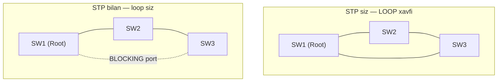
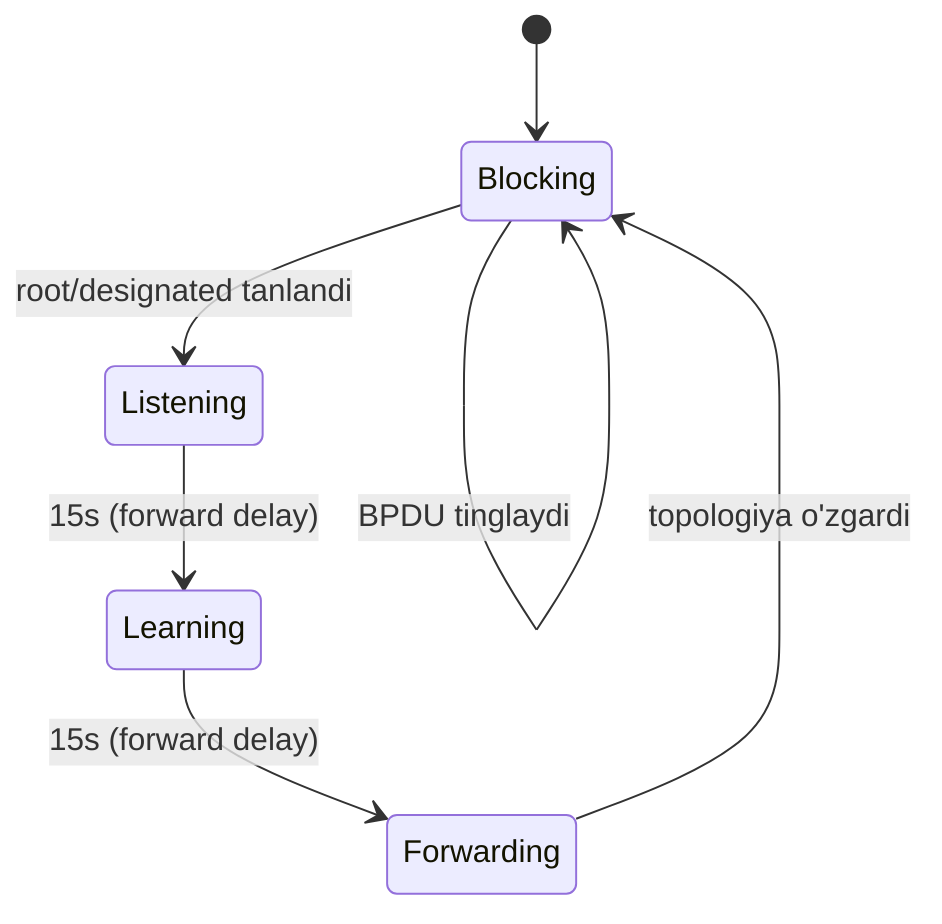

# 06. STP va Rapid PVST+ — Layer 2 looplarni oldini olish

## Muammo: redundant kabel — foyda emas, falokat

Tarmoqni ishonchli qilish uchun switchlarni ikki kabel bilan ulaymiz — biri uzilsa,
ikkinchisi ishlasin. Mantiqiy, to'g'rimi? Lekin Layer 2 da bu **halokat** keltiradi.

Sabab: Ethernet frame da **TTL** (Time To Live — packet umri, IP da bor) YO'Q. Agar
switchlar orasida **loop** (halqa) bo'lsa, broadcast frame abadiy aylanadi:

- **Broadcast storm** — frame soniyada millionlab marta ko'payadi.
- **MAC table flapping** — switch bir MAC ni goh u portda, goh bu portda ko'radi.
- Switch CPU 100% ga chiqadi, tarmoq **qulaydi**.

Bitta noto'g'ri kabel butun tarmoqni o'ldirishi mumkin. Aynan shu muammoni **STP**
hal qiladi.

> **Oltin qoida:** STP redundant linklarni saqlab qoladi, lekin bir vaqtda faqat
> bittasini ishlatadi — qolganini **BLOCKING** holatga qo'yib, loop siz topologiya
> yaratadi. Link uzilsa, blocked port avtomatik ochiladi.

## Analogiya: bir yo'nalishli aylanma yo'l

Shahar markazida ikki ko'cha bir maydonga olib boradi. Agar ikkalasi ham ikki
tomonlama bo'lsa, mashinalar cheksiz aylanib qolishi mumkin (tirbandlik). Yechim:
- Bitta ko'chani **ochiq** qoldirish (asosiy yo'l).
- Ikkinchisini vaqtincha **yopiq** qilish (backup).
- Asosiy yo'l yopilsa (avariya), backup ni darhol ochish.

STP aynan shu qorovul — u qaysi yo'l ochiq, qaysi biri backup ekanini boshqaradi.
Farqi: STP buni avtomatik va soniyalarda qiladi.

## Sodda ta'rif

**STP** (Spanning Tree Protocol, IEEE 802.1D) — switchlar o'zaro **BPDU** (Bridge
Protocol Data Unit — STP xabar frame'i) almashib, loop siz yagona logical topologiya
tuzadigan va ortiqcha portlarni bloklaydigan protokol.

## Diagramma: loop va STP yechimi



STP siz uchburchak loop — broadcast abadiy aylanadi. STP bitta portni BLOCKING ga
qo'yib, halqani "uzadi", lekin fizik kabelni saqlab qoladi (backup uchun).

## Asosiy atamalar

| Atama | Ma'nosi |
|-------|---------|
| **Root bridge** | STP topologiyasi markazi (eng kichik Bridge ID) |
| **Bridge ID** | Priority (default 32768) + MAC address |
| **Root port** | Har switchda root ga eng yaqin port (forwarding) |
| **Designated port** | Har segmentda forwarding qiluvchi port |
| **Alternate/Blocking port** | Backup, data o'tkazmaydi (BPDU tinglaydi) |
| **BPDU** | Switchlar STP ma'lumot almashadigan frame |

**Root bridge saylash:** eng kichik Bridge ID li switch g'olib. Bridge ID = priority
+ MAC. Priority teng bo'lsa, eng kichik MAC yutadi.

## STP port holatlari (klassik)



Klassik STP konvergensiyasi ~30–50 soniya — juda sekin. Shuning uchun zamonaviy
tarmoqlar **RSTP/Rapid PVST+** ishlatadi.

## Rapid PVST+ — Cisco zamonaviy varianti

**Rapid PVST+** — Cisco implementatsiyasi; **har VLAN** uchun alohida rapid
spanning-tree instance ishlatadi. WebSearch bo'yicha, u konvergensiyani ko'p
holatda **1 soniyadan kam**ga (klassik STP dagi 30–50 s o'rniga) tushiradi.

```cisco
! --- Rapid PVST+ ni yoqamiz (zamonaviy default) ---
configure terminal
spanning-tree mode rapid-pvst
end
```

RSTP port role: Root, Designated, **Alternate** (bloklangan backup), **Backup**.
Holatlar: Discarding, Learning, Forwarding.

## Worked example — root bridge ni qo'lda belgilash

WebSearch (2025 best practice): **root ni tasodifga tashlama** — qo'lda distribution
switchni root qil.

```cisco
! --- SW1 ni primary root qilamiz (kerakli VLAN lar uchun) ---
configure terminal
spanning-tree vlan 10,20,99 root primary
end
```
```cisco
! --- SW2 ni secondary root (backup) ---
configure terminal
spanning-tree vlan 10,20,99 root secondary
end
```

Yoki priority ni qo'lda (4096 qadam bilan: 0, 4096, 8192, ...):
```cisco
spanning-tree vlan 10 priority 4096
spanning-tree vlan 20 priority 4096
```

**Tekshirish:**
```cisco
show spanning-tree vlan 10
```
```text
Root ID    Priority    4106
           Address     aabb.cc00.0100
           This bridge is the root       <- SW1 root ekanini tasdiqlaydi
```

## Edge port himoyasi: PortFast + BPDU Guard

**PortFast** — endpoint (PC, server) portini darhol forwarding ga o'tkazadi
(30 soniya kutmaydi). Faqat access portga ber, switch-switch trunkga BERMA.

```cisco
interface fastEthernet0/1
 description PC-PORT
 switchport mode access
 switchport access vlan 10
 spanning-tree portfast
```

**BPDU Guard** — PortFast portga switch ulanib qolsa (ya'ni BPDU kelsa), portni
**err-disable** qiladi. Bu access layerda muhim himoya (kimdir devor rozetkasiga
switch ulasa, loop boshlanmaydi).

```cisco
interface fastEthernet0/1
 spanning-tree bpduguard enable
```

Global (barcha PortFast portlarga):
```cisco
spanning-tree portfast default
spanning-tree portfast bpduguard default
```

Err-disable portni tiklash:
```cisco
show interfaces status err-disabled
interface fastEthernet0/1
 shutdown
 no shutdown
```

## Qo'shimcha himoya: Root Guard va Loop Guard (2025)

WebSearch bo'yicha, enterprise best practice:

- **Root Guard** — port superior BPDU olsa (ya'ni tashqi switch root bo'lishga
  urinsa), portni **root-inconsistent** holatga qo'yadi. Downstream/tashqi portlarga
  qo'y — root o'zgarib ketmaydi.
- **Loop Guard** — trunk/uplink kutilgan BPDU to'satdan kelmay qolsa (unidirectional
  link nosozligi), portni forwarding ga o'tkazib loop yaratishning oldini oladi. Har
  trunk/uplink ga qo'y.

```cisco
interface gigabitEthernet0/1
 spanning-tree guard root       ! tashqi/downstream port
interface gigabitEthernet0/2
 spanning-tree guard loop       ! uplink/trunk
```

> Best practice shabloni (2025): access port -> PortFast + BPDU Guard + Storm
> Control; trunk/uplink -> Loop Guard; primary va secondary root ni qo'lda belgila.

## Predict savoli (PRIMM)

> 🤔 **O'ylab ko'r:** `show spanning-tree vlan 20` da bitta port **BLK** (blocking)
> holatida. Bu har doim muammo demakmi?

<details>
<summary>💡 Javobni ko'rish</summary>

Yo'q! Blocking port ko'pincha STP **to'g'ri ishlayotgani** belgisi — u redundant
linkni bloklab, loop ning oldini olyapti. Data o'tmaydi, lekin BPDU tinglaydi va
asosiy link uzilsa avtomatik ochiladi. Muammo faqat: kerakli VLAN yagona yo'lda
kutilmaganda blocking bo'lsa. Avval topologiyani va root ni tekshir.
</details>

## Troubleshooting

Muammo: trunk bor, lekin bitta VLAN trafik o'tmayapti.
```cisco
show interfaces trunk
show spanning-tree vlan 20
show spanning-tree blockedports
```
Ehtimol STP shu VLAN uchun portni blocking qilgan — bu loop himoyasi bo'lishi mumkin.

Muammo: root switch noto'g'ri joyda.
```cisco
show spanning-tree root
show spanning-tree vlan 10
! Tuzatish:
spanning-tree vlan 10 root primary
```

Muammo: access port err-disabled.
```cisco
show interfaces status err-disabled
show logging | include BPDU
```
BPDU Guard sabab bo'lsa — o'sha portga switch yoki noto'g'ri qurilma ulangan.

## Ko'p uchraydigan xatolar

| Xato | Nega yomon | To'g'risi |
|------|-----------|-----------|
| STP ni o'chirish | Loop xavfi | Doim yoqiq tut |
| Root ni switchlarga tashlash | Trafik yo'li nazoratsiz | Qo'lda root primary/secondary |
| Trunkga PortFast | Loop bo'lishi mumkin | Faqat access portga |
| BPDU Guard yo'q | Rogue switch loop | Access portga yoq |
| Blocking = muammo deb o'ylash | Noto'g'ri tashxis | Ko'pincha normal |
| Parallel link EtherChannelsiz | STP bloklaydi | EtherChannel (7-dars) |

## Xulosa

- Ethernet da TTL yo'q — L2 loop broadcast storm keltiradi, tarmoqni o'ldiradi.
- **STP** loop siz topologiya tuzadi, ortiqcha portni **BLOCKING** ga qo'yadi.
- **Root bridge** eng kichik Bridge ID li switch; uni qo'lda belgila.
- **Rapid PVST+** har VLAN uchun rapid STP — konvergensiya < 1 s.
- **PortFast + BPDU Guard** — access port himoyasi.
- **Root Guard + Loop Guard** — enterprise qo'shimcha himoya (2025).
- Blocking port ko'pincha muammo emas, balki STP to'g'ri ishlayotgani belgisi.

## 🧠 Eslab qol

- L2 da TTL yo'q -> loop = broadcast storm.
- STP bitta yo'lni ochiq, qolganini BLOCKING qoldiradi.
- Root ni qo'lda belgila (root primary/secondary).
- PortFast faqat access portga, trunkga hech qachon.
- BPDU Guard rogue switch loop ni to'xtatadi.

## ✅ O'z-o'zini tekshir (retrieval practice)

**1.** Nega Layer 2 loop Layer 3 loop dan xavfliroq?

<details>
<summary>Javob</summary>

IP packet da **TTL** bor — u har hop da 1 ga kamayadi va 0 da o'ladi, shuning uchun
L3 loop cheklangan. Ethernet frame da TTL YO'Q — broadcast frame abadiy aylanadi va
soniyada millionlab marta ko'payib broadcast storm keltiradi. STP shuning uchun kerak.
</details>

**2.** Root bridge qanday saylanadi?

<details>
<summary>Javob</summary>

Eng kichik **Bridge ID** li switch root bo'ladi. Bridge ID = priority (default
32768) + MAC address. Priority teng bo'lsa, eng kichik MAC yutadi. Best practice:
priority ni qo'lda pasaytirib (`root primary` yoki `priority 4096`) kerakli switchni
root qil.
</details>

**3.** PortFast ni switch-switch trunkga bersang nima bo'ladi?

<details>
<summary>Javob</summary>

Port darhol forwarding ga o'tadi va STP listening/learning bosqichini o'tkazib
yuboradi. Agar u yerda loop bo'lsa, STP uni topib ulgurmasdan broadcast storm
boshlanadi. Shuning uchun PortFast faqat endpoint (access) portlar uchun.
</details>

**4.** Rapid PVST+ klassik STP dan qanday ustunlik beradi?

<details>
<summary>Javob</summary>

Konvergensiya juda tez — ko'p holatda 1 soniyadan kam (klassik STP 30–50 s). Yana:
har VLAN uchun alohida STP instance ishlatadi, shuning uchun har VLAN uchun alohida
root va trafik yo'lini boshqarish mumkin.
</details>

## 🛠 Amaliyot

**1. Oson (Modify):** Worked example dagi root konfiguratsiyasini o'zgartir — SW1 ni
faqat VLAN 10 uchun root primary qil, VLAN 20 ni SW2 ga ber.

<details>
<summary>Hint</summary>

SW1: `spanning-tree vlan 10 root primary`. SW2: `spanning-tree vlan 20 root
primary`. Bu load balancing beradi — trafik ikki switch orasida taqsimlanadi.
</details>

**2. O'rta (Faded example):** Access port himoyasini to'ldir:

```cisco
interface fastEthernet0/3
 switchport mode access
 switchport access vlan 10
 // TODO: portni darhol forwarding ga o'tkaz
 // TODO: switch ulansa err-disable qil
```

<details>
<summary>Hint</summary>

`spanning-tree portfast` va `spanning-tree bpduguard enable`.
</details>

**3. Qiyin (Make):** 3 ta switch (uchburchak topologiya) uchun STP rejasini noldan
yoz: SW1 ni root primary, SW2 secondary qil, access portlarga PortFast+BPDU Guard,
uplinklarga Loop Guard. Qaysi port BLOCKING bo'lishini bashorat qil.

<details>
<summary>Hint</summary>

Root eng past priority da (SW1). Root dan eng uzoq segmentdagi eng yuqori cost/Bridge
ID li port BLOCKING bo'ladi. `show spanning-tree blockedports` bilan tekshir.
</details>

## 🔁 Takrorlash

**Bog'liq mavzular (shu modul ichida):**
- [02-data-link-ethernet-mac.md](02-data-link-ethernet-mac.md) — broadcast storm.
- [04-trunk-8021q.md](04-trunk-8021q.md) — trunk va per-VLAN STP.
- [07-etherchannel-lacp.md](07-etherchannel-lacp.md) — parallel linklarni STP siz
  ishlatish.

**Takrorlash jadvali:**
- **Ertaga:** STP port holatlarini (blocking-listening-learning-forwarding) ayt.
- **3 kundan keyin:** Root bridge saylash qoidasini yoddan ayt.
- **1 haftadan keyin:** PortFast/BPDU Guard/Root Guard/Loop Guard farqini takrorla.

**Feynman testi:** "Bir yo'nalishli aylanma yo'l" analogiyasidan foydalanib, STP
nega kerak va nima qilishini do'stingga 3 jumlada tushuntir.

## 📚 Manbalar

- Cisco CCNA 200-301 — STP, Rapid PVST+
- IEEE 802.1D / 802.1w — Spanning Tree / Rapid STP
- [itman.ae — Cisco Network Loop Prevention: STP, BPDU Guard, PortFast, Storm Control](https://itman.ae/2025/11/26/cisco-network-loop-prevention-techniques/)
- [Cisco Community — Switching best practices: loop guard, root guard](https://community.cisco.com/t5/switching/switching-best-practices-loop-guard-root-guard-etc/td-p/958647)
- [My Computer Notes — Basic operations of Rapid PVST+](https://mycomputernotes.com/basic-operations-of-rapid-pvst-spanning-tree-protocol/)
