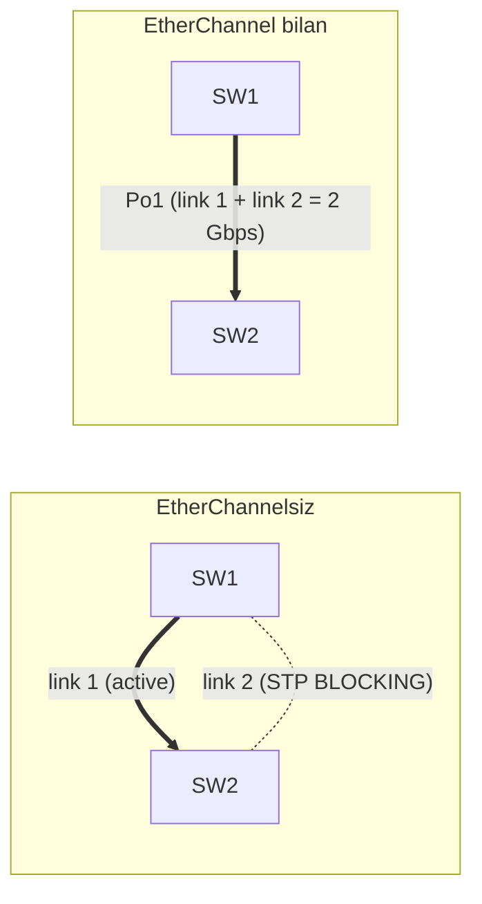

# 07. EtherChannel va LACP — bir nechta linkni bitta qilish

## Muammo: STP backup linkni "isrof" qiladi

Oldingi darsda STP loop ni to'xtatib, bitta linkni ochiq, ikkinchisini BLOCKING
qoldirdi. Bu xavfsiz, lekin **isrofgarchilik**: sen ikki 1 Gbps kabel tortding, sarf
qilding, lekin STP faqat bittasini ishlatyapti. Ikkinchisi backup bo'lib "yotibdi".

Ikkala kabeldan bir vaqtda foydalanib, **2 Gbps** olsak-chi? Lekin STP buni loop
deb bloklaydi-ku!

Yechim — ikki fizik linkni STP ga **bitta** logical link qilib ko'rsatish. Shunda
STP bitta linkni ko'radi (bloklamaydi), lekin trafik ikkala kabeldan yuradi. Bu
**EtherChannel**.

> **Oltin qoida:** EtherChannel bir nechta fizik linkni bitta logical Port-channel
> ga birlashtiradi. STP uni bitta link deb ko'radi — bloklamaydi. Bandwidth va
> redundancy bir vaqtda.

## Analogiya: ko'p qatorli ko'prik

Bitta ko'prik (link) tor bo'lsa, tirbandlik bo'ladi. Yechim — bir necha qatorli
ko'prik qurish (EtherChannel):

- Tashqi qorovul (STP) buni **bitta** ko'prik deb ko'radi — hisob-kitobda soddalik.
- Mashinalar barcha qatorlarga taqsimlanadi (load balancing).
- Bitta qator yopilsa (kabel uzilsa), qolganlar ishlab turadi.

Muhim farq: **bitta mashina** (bitta flow) faqat **bitta qatordan** yuradi — bir
qatorda ikki bo'linmaydi. Ya'ni bitta katta fayl uzatish 2 Gbps olmaydi, 1 Gbps da
qoladi.

## Sodda ta'rif

**EtherChannel** — 2–8 ta fizik linkni bitta logical **Port-channel** interfeysga
birlashtirish texnologiyasi. **LACP** (Link Aggregation Control Protocol, IEEE
802.3ad) — bu kanalni avtomatik va xavfsiz kelishuvchi ochiq standart protokol.

## Diagramma: EtherChannel siz vs bilan



EtherChannelsiz: STP ikkinchi linkni bloklaydi (isrof). EtherChannel bilan: ikkala
link birlashib Po1 bo'ladi, STP uni bitta link deb ko'radi.

## LACP rejimlari

| Rejim | Ma'nosi |
|-------|---------|
| `active` | LACP ni faol boshlaydi |
| `passive` | LACP ga faqat javob beradi |
| `on` | Protokolsiz, majburiy EtherChannel (LACP yo'q) |

Qaysi kombinatsiyalar ishlaydi:
```text
active  + active   -> ishlaydi
active  + passive  -> ishlaydi
passive + passive  -> ISHLAMAYDI (hech kim boshlamaydi)
on      + on       -> ishlaydi, lekin LACP himoyasi yo'q
active  + on       -> ISHLAMAYDI (protokol mos emas)
```

WebSearch (2025): **`active` + `active`** eng xavfsiz. LACP paket ichida switch MAC
(Actor/Partner) bor — miskabel yoki mismatch bo'lsa Port-channel **umuman
tuzilmaydi**. Bu himoya `on` rejimda yo'q — shuning uchun `on` xavfli.

## Worked example — trunk EtherChannel (LACP)

**SW1 (SW2 aynan bir xil, faqat description farqli):**
```cisco
! --- 1-qadam: a'zo portlarni kanalga qo'shamiz ---
configure terminal
interface range gigabitEthernet0/1 - 2
 description TO-SW2-EC1
 switchport mode trunk
 switchport trunk allowed vlan 10,20,99
 channel-group 1 mode active
 no shutdown

! --- 2-qadam: logical Port-channel interfeysini sozlaymiz ---
interface port-channel1
 description LACP-TO-SW2
 switchport mode trunk
 switchport trunk allowed vlan 10,20,99
 no shutdown
end
```

**Notional machine:** `channel-group 1 mode active` bergach, switch avtomatik
`interface port-channel1` yaratadi. A'zo portlar LACP paket almashib, ikkala tomon
mos ekaniga ishonch hosil qiladi. Mos bo'lsa — portlar `P` (bundled) holatga o'tadi.
Layer 2 sozlamalarni **Port-channel** interfeysida ber — a'zo portlar unga ergashadi.

**Tekshirish:**
```cisco
show etherchannel summary
```
```text
Group  Port-channel  Protocol  Ports
1      Po1(SU)       LACP      Gi0/1(P) Gi0/2(P)
```

Belgilar: `P` = bundled (kanalda), `I` = stand-alone (kanaldan tashqarida), `S` =
Layer2, `U` = in use, `D` = down. `Gi0/1(P) Gi0/2(P)` = ikkala port kanalda —
yaxshi holat.

## Load balancing — nega 2 Gbps bitta faylga yetmaydi

WebSearch bo'yicha muhim nuqta:

> EtherChannel bandwidth ni bitta flow uchun **qo'shmaydi**. Load balancing flowlarni
> (source/dst MAC, IP yoki port bo'yicha) linklarga taqsimlaydi.

Default algoritm ko'pincha `src-mac` — bitta MAC dan kelgan trafik doim bitta
jismoniy portdan yuradi. Yaxshiroq taqsimot uchun source+destination IP:

```cisco
port-channel load-balance src-dst-ip
```

Yana: **mukammal balans** faqat 2, 4 yoki 8 port bo'lganda bo'ladi (2 ning
darajasi). LACP kanalda 16 port bo'lsa — 8 tasi active, 8 tasi standby.

## Access EtherChannel — serverga bond

Serverga ikki link access VLAN da ulanadi (server tomonda ham LACP bond kerak):

```cisco
interface range gigabitEthernet0/3 - 4
 description SERVER-LACP
 switchport mode access
 switchport access vlan 50
 channel-group 2 mode active

interface port-channel2
 description SERVER-BOND
 switchport mode access
 switchport access vlan 50
```

## Moslik talablari

EtherChannel a'zolarida quyidagilar **bir xil** bo'lishi shart, aks holda port `I`
(stand-alone) bo'lib qoladi:

- Speed va duplex
- Access yoki trunk mode
- Access VLAN (access uchun)
- Native VLAN va allowed VLAN list (trunk uchun)
- STP parametrlari

> Amaliy qoida: L2 sozlamalarni Port-channel interfeysida ber; a'zo portlarni
> kanalga qo'shishdan oldin asosiy moslikni tekshir.

## Predict savoli (PRIMM)

> 🤔 **O'ylab ko'r:** SW1 da ikkala port `channel-group 1 mode active`, SW2 da esa
> `mode passive`. Port-channel tuziladimi? Endi SW2 ni `mode on` qilsak-chi?

<details>
<summary>💡 Javobni ko'rish</summary>

Birinchi holat: `active + passive` **ishlaydi** — active tomon boshlaydi, passive
javob beradi.

Ikkinchi holat: `active + on` **ISHLAMAYDI**. `on` LACP paket yubormaydi (protokolsiz
majburiy kanal), `active` esa LACP kutadi. Protokollar mos kelmaydi — portlar `I`
(stand-alone) bo'lib qoladi va STP alohida linklarni ko'rib, bittasini bloklaydi.
Yechim: ikkala tomon `active`.
</details>

## LACP vs PAgP

| | LACP | PAgP |
|--|------|------|
| Standart | IEEE 802.3ad (ochiq) | Cisco proprietary |
| Rejimlar | active, passive | desirable, auto |
| Ko'p vendor | Ha | Yo'q (faqat Cisco) |
| CCNA tavsiya | Ha | Kamroq |

## Troubleshooting

Muammo: Port-channel ishlamayapti.
```cisco
show etherchannel summary
show etherchannel detail
show running-config interface gigabitEthernet0/1
show running-config interface port-channel1
```

Tekshir:
- Ikkala tomonda mode mos mi? (active+active yoki active+passive)
- A'zo portlar speed/duplex bo'yicha mos mi?
- Biri access, biri trunk emasmi?
- Allowed VLAN listlar bir xil mi?
- Portlar shutdown emasmi?

Muammo: bitta port `I` holatda (kanalga qo'shilmagan) — sabab ko'pincha config
mismatch. Solishtir, keyin qayta qo'sh:
```cisco
interface gigabitEthernet0/2
 no channel-group 1
 channel-group 1 mode active
```

## Ko'p uchraydigan xatolar

| Xato | Nega yomon | To'g'risi |
|------|-----------|-----------|
| `active` + `on` | Mos emas, kanal yo'q | Ikki tomon `active` |
| `passive` + `passive` | Hech kim boshlamaydi | Kamida biri `active` |
| Po da VLAN, portda boshqa | Mismatch, `I` port | Po interfeysida ber |
| A'zolarda native VLAN farq | Kanal buziladi | Bir xil qil |
| Parallel kabel EtherChannelsiz | STP bloklaydi | Kanal tuz |
| Faqat fizik portni tekshirish | Muammo topilmaydi | Po interfeysini ham ko'r |

## Xulosa

- **EtherChannel** 2–8 fizik linkni bitta logical **Port-channel** qiladi.
- STP kanalni bitta link deb ko'radi — bloklamaydi, backup isrof bo'lmaydi.
- **LACP** (802.3ad) ochiq standart; **`active`+`active`** eng xavfsiz.
- Load balancing flowlarni taqsimlaydi — bitta flow bitta linkdan yuradi.
- A'zo portlar speed/duplex/mode/VLAN bo'yicha mos bo'lishi shart.
- L2 sozlamalarni Port-channel interfeysida ber.

## 🧠 Eslab qol

- EtherChannel: ko'p link -> bitta Po; STP bloklamaydi.
- `passive`+`passive` va `active`+`on` ISHLAMAYDI.
- Bitta flow bitta linkdan -> 2x1G != 2G bitta faylga.
- A'zo portlar hamma parametrda mos bo'lishi shart.
- LACP = ochiq standart; PAgP = Cisco only.

## ✅ O'z-o'zini tekshir (retrieval practice)

**1.** Nega EtherChannel bir vaqtda bandwidth VA STP muammosini hal qiladi?

<details>
<summary>Javob</summary>

STP redundant linkni bloklab isrof qiladi. EtherChannel bir nechta linkni bitta
logical Port-channel qiladi — STP uni **bitta** link deb ko'radi (bloklamaydi),
lekin trafik barcha fizik linklardan yuradi. Shunday qilib redundancy ham,
bandwidth ham saqlanadi.
</details>

**2.** 2 ta 1 Gbps link EtherChannel da. Bitta katta faylni ko'chirsang, 2 Gbps
olasanmi?

<details>
<summary>Javob</summary>

Yo'q. Bitta fayl uzatish — bu bitta flow, u load balancing algoritmi bo'yicha bitta
jismoniy linkka tushadi va 1 Gbps da qoladi. 2 Gbps ni faqat ko'p flow (ko'p mijoz)
bir vaqtda ishlatganda ko'rasan.
</details>

**3.** `passive` + `passive` nega ishlamaydi?

<details>
<summary>Javob</summary>

`passive` faqat LACP ga **javob** beradi, o'zi boshlamaydi. Ikkala tomon passive
bo'lsa, hech kim LACP kelishuvini boshlamaydi — Port-channel tuzilmaydi. Kamida biri
`active` bo'lishi kerak.
</details>

**4.** Nega `on` rejim `active` dan xavfliroq?

<details>
<summary>Javob</summary>

`on` protokolsiz majburiy kanal — LACP paket almashmaydi, mismatch/miskabel ni
tekshirmaydi. Xato konfiguratsiya loop yoki blackhole keltirishi mumkin. `active`
esa LACP orqali mos ekanni tekshiradi va mos bo'lmasa kanalni **umuman tuzmaydi**.
</details>

## 🛠 Amaliyot

**1. Oson (Modify):** Worked example dagi trunk EtherChannel ga uchinchi port
(Gi0/3) qo'sh — Po1 endi 3 link bo'lsin.

<details>
<summary>Hint</summary>

`interface gigabitEthernet0/3` ga bir xil trunk sozlama + `channel-group 1 mode
active`. Diqqat: mukammal balans 2/4/8 portda — 3 portda taqsimot notekis bo'lishi
mumkin.
</details>

**2. O'rta (Faded example):** Server uchun access EtherChannel ni to'ldir:

```cisco
interface range gigabitEthernet0/5 - 6
 description SERVER-BOND
 switchport mode access
 switchport access vlan 50
 // TODO: kanal 3 ga active rejimda qo'sh
interface port-channel3
 // TODO: access mode
 // TODO: access vlan 50
```

<details>
<summary>Hint</summary>

A'zo portlarga `channel-group 3 mode active`; `interface port-channel3` ga
`switchport mode access` + `switchport access vlan 50`.
</details>

**3. Qiyin (Make):** Ikki distribution switch orasida 4 linkli LACP EtherChannel ni
noldan qur (trunk, VLAN 10,20,99,999 native). Load balance ni `src-dst-ip` qil.
`show etherchannel summary` da qanday chiqishini bashorat qil.

<details>
<summary>Hint</summary>

`interface range gi0/1-4` + trunk sozlama + `channel-group 1 mode active`;
`port-channel load-balance src-dst-ip`. Kutilgan chiqish: `Po1(SU) LACP Gi0/1(P)
Gi0/2(P) Gi0/3(P) Gi0/4(P)`.
</details>

## 🔁 Takrorlash

**Bog'liq mavzular (shu modul ichida):**
- [06-stp.md](06-stp.md) — STP nega redundant linkni bloklaydi.
- [04-trunk-8021q.md](04-trunk-8021q.md) — trunk EtherChannel uchun.

**Takrorlash jadvali:**
- **Ertaga:** LACP rejim kombinatsiyalari jadvalini yoddan chiz.
- **3 kundan keyin:** EtherChannel konfiguratsiyasini yozib chiq.
- **1 haftadan keyin:** "Nega 2x1G != 2G bitta faylga" savoliga qayta javob ber.

**Feynman testi:** "Ko'p qatorli ko'prik" analogiyasidan foydalanib, EtherChannel
nima qilishini va nega bitta mashina bitta qatordan yurishini 3 jumlada tushuntir.

## 📚 Manbalar

- Cisco CCNA 200-301 — EtherChannel, LACP
- IEEE 802.3ad — Link Aggregation
- [Study CCNP — EtherChannel Load Balancing Explanation & Configuration](https://study-ccnp.com/etherchannel-load-balancing-explanation-configuration/)
- [NetSecCloud — Best Practices for EtherChannel Load Balancing](https://netseccloud.com/best-practices-for-etherchannel-load-balancing)
- [std.rocks — Cisco EtherChannel Setup, Complete LACP Guide](https://std.rocks/cisco_switching_etherchannel.html)
