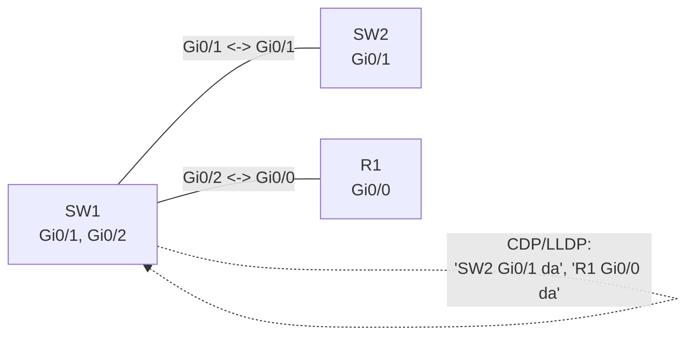

# 08. CDP va LLDP — qo'shni qurilmalarni aniqlash

## Muammo: bu kabel qayerga ketyapti?

Tasavvur qil — sen server xonasida turibsan. Switch da 48 ta port, har biriga kabel
ulangan, lekin yorliq yo'q (yoki eski). Gi0/1 qaysi switchga, Gi0/24 qaysi routerga
ketyapti? Diagramma eskirgan, kim tortganini hech kim bilmaydi.

Har kabelni qo'lda kuzatib borish — soatlab ish. Muammo qanaqa qurilma ulanganini,
qaysi porti bilan ulanganini, uning IP sini bilmaslikda.

Aynan shu muammoni **discovery protokollar** — **CDP** va **LLDP** hal qiladi:
switchning o'zi qo'shnilarini "so'rab" biladi.

> **Oltin qoida:** CDP/LLDP Layer 2 da ishlaydi va qo'shni qurilma nomi, porti,
> platformasi, IP sini beradi — hatto IP sozlanmagan bo'lsa ham. Lekin bu routing
> jadvali EMAS, faqat "kim qayerga ulangan" xaritasi.

## Analogiya: eshikdagi tanishuv taxtachasi

Har xonaning eshigida taxtacha bor: "Men Ahmad, IT bo'limi, 3-xona". Yonidagi xona
ham o'z taxtachasini ko'rsatadi. Sen koridorda yurib, har eshikni o'qib, kim
qayerdaligini bilasan — hech kimni bezovta qilmasdan.

CDP/LLDP aynan shunday: har switch/router periodik ravishda "men falonchiman, falon
portdaman" degan xabar (advertisement) yuboradi, qo'shni uni yozib qo'yadi.

Farqi: bu taxtacha faqat **bevosita qo'shniga** ko'rinadi (bir hop) — router uni
boshqa segmentga o'tkazmaydi.

## Sodda ta'rif

**CDP** (Cisco Discovery Protocol) — Cisco proprietary L2 discovery protokoli.
**LLDP** (Link Layer Discovery Protocol, IEEE 802.1AB) — ochiq, vendor-neutral
standart. Ikkalasi ham qo'shni qurilma haqida ma'lumot to'playdi.

## Diagramma: CDP/LLDP topologiya xaritasi



`show cdp neighbors` natijasi:
```text
Device ID   Local Intrfce   Capability   Platform   Port ID
SW2         Gig 0/1         S            C2960      Gig 0/1
R1          Gig 0/2         R            ISR4321    Gig 0/0
```

Bundan bilamiz: SW1 Gi0/1 -> SW2 Gi0/1; SW1 Gi0/2 -> R1 Gi0/0. Capability: `S` =
switch, `R` = router.

## CDP vs LLDP — taqqoslash

| | CDP | LLDP |
|--|-----|------|
| Standart | Cisco proprietary | IEEE 802.1AB (ochiq) |
| Vendor | Faqat Cisco | Har vendor (Juniper, HP, Aruba, Linux) |
| Default | Cisco da odatda yoqiq | Ko'p IOS da o'chiq (`lldp run` kerak) |
| Layer | L2 | L2 |
| Voice kengaytma | CDP | LLDP-MED |

CDP ko'rsatadi: qurilma nomi, local/qo'shni interface, platforma, capability
(router/switch/phone), management IP, IOS versiya.

## Worked example — CDP va LLDP buyruqlari

**CDP:**
```cisco
show cdp                              ! CDP global holati
show cdp neighbors                    ! qisqa ro'yxat
show cdp neighbors detail             ! to'liq (IP, IOS versiya)
show cdp neighbors gigabitEthernet0/1 detail
```

**LLDP (avval global yoqish):**
```cisco
! --- LLDP ni global yoqamiz (ko'p IOS da o'chiq) ---
configure terminal
lldp run
end

show lldp neighbors
show lldp neighbors detail
```

Portda LLDP ni sozlash:
```cisco
interface gigabitEthernet0/1
 lldp transmit
 lldp receive
```

## Xavfsizlik: ishonchsiz portlarda o'chir (2025)

WebSearch bo'yicha muhim ogohlantirish:

> CDP/LLDP ma'lumotni **ochiq matnda** va autentifikatsiyasiz uzatadi. Hujumchi
> qurilma nomi, platforma, IOS versiya, management IP ni ko'rishi mumkin — bu
> keyingi hujum uchun razvedka.

Best practice — faqat kerakli portda yoq, qolganida o'chir:

```cisco
! Global CDP ni butunlay o'chirish (ehtiyot bo'l)
no cdp run

! Faqat bitta portda CDP ni o'chirish
interface gigabitEthernet0/24
 description ISP-HANDOFF
 no cdp enable
 no lldp transmit
 no lldp receive
```

Qoida:
- Ichki trunk/uplink: yoqiq bo'lishi mumkin (troubleshooting uchun foydali).
- User-facing ishonchsiz portlar: o'chir.
- ISP, guest, third-party, internet portlari: **doim o'chir**.

## LLDP-MED va voice VLAN

WebSearch: VoIP tarmoqlarda **LLDP-MED** (Media Endpoint Discovery) LLDP ni
kengaytiradi — IP phone ga voice VLAN, QoS policy, power management ma'lumotini
avtomatik beradi.

```cisco
interface fastEthernet0/10
 description IP-PHONE
 switchport mode access
 switchport access vlan 10        ! PC data VLAN
 switchport voice vlan 30         ! telefon voice VLAN
 spanning-tree portfast
```

Cisco IP phone odatda **CDP** orqali, boshqa vendor telefonlar **LLDP-MED** orqali
voice VLAN 30 ni biladi — qo'lda sozlashsiz.

## Predict savoli (PRIMM)

> 🤔 **O'ylab ko'r:** `show cdp neighbors` da R1 ko'rinadi va uning management IP si
> ham chiqadi. Demak R1 ga ping ishlashi kerak, to'g'rimi?

<details>
<summary>💡 Javobni ko'rish</summary>

Yo'q, bu noto'g'ri xulosa. CDP **Layer 2** da ishlaydi — u IP routing dan mustaqil.
CDP R1 ni ko'rsatishi mumkin, lekin:
- Sizda R1 subnetiga route bo'lmasligi mumkin.
- ACL/firewall ping ni bloklashi mumkin.
- IP noto'g'ri sozlangan bo'lishi mumkin.

CDP faqat "kim jismonan ulangan" ni aytadi, "unga L3 da yetib boraman" ni EMAS. Bu
eng ko'p uchraydigan chalkashlik.
</details>

## Troubleshooting

Muammo: qo'shni qurilma ko'rinmayapti.
```cisco
show cdp                                  ! global yoqiqmi?
show cdp interface gigabitEthernet0/1     ! portda yoqiqmi?
show lldp                                 ! LLDP global (lldp run) yoqiqmi?
show interfaces gigabitEthernet0/1 status ! port up/up mi?
```

Tekshir:
- Interface up/up mi?
- CDP/LLDP global yoqilganmi (LLDP uchun `lldp run`)?
- Portda protokol o'chirilmaganmi (`no cdp enable`)?
- Qo'shni qurilma bu protokolni qo'llaydimi?

Muammo: native VLAN mismatch xabari. CDP buni log da ko'rsatadi:
```text
%CDP-4-NATIVE_VLAN_MISMATCH
```
Bu 4-darsdagi trunk native VLAN muammosi — CDP uni topib beradi.

## Ko'p uchraydigan xatolar

| Xato | Nega yomon | To'g'risi |
|------|-----------|-----------|
| CDP natijasini route deb o'ylash | L2 discovery, route emas | Faqat topologiya sifatida ko'r |
| "IP ko'rindi = ping ishlaydi" | L2 != L3 reachability | Alohida tekshir |
| Ishonchsiz portda yoqib qo'yish | Ma'lumot oshkorligi | O'chir |
| LLDP `lldp run` unutish | LLDP ishlamaydi | Global yoq |
| Packet Tracer = real IOS deb o'ylash | Ba'zi funksiya yo'q | Real qurilmada tekshir |

## Xulosa

- **CDP/LLDP** qo'shni qurilmalarni L2 da aniqlaydi (nomi, port, platforma, IP).
- **CDP** = Cisco proprietary; **LLDP** = ochiq IEEE 802.1AB standart.
- Ular topologiya xaritasi beradi, **routing jadvali emas**.
- "IP ko'rindi" ping ishlashini kafolatlamaydi (L2 != L3).
- Ishonchsiz/tashqi portlarda **o'chir** (2025 xavfsizlik).
- **LLDP-MED/CDP** IP phone ga voice VLAN ni avtomatik beradi.

## 🧠 Eslab qol

- CDP = Cisco only; LLDP = universal (lekin `lldp run` kerak).
- Discovery = topologiya, route EMAS.
- CDP IP ko'rsatadi, lekin ping ishlashini kafolatlamaydi.
- Ishonchsiz port -> `no cdp enable` + LLDP o'chir.
- Telefon voice VLAN ni CDP/LLDP-MED orqali oladi.

## ✅ O'z-o'zini tekshir (retrieval practice)

**1.** Nega CDP ma'lumotini routing jadvali sifatida ishlatib bo'lmaydi?

<details>
<summary>Javob</summary>

CDP faqat **bevosita ulangan** (bir hop) qo'shnini ko'rsatadi va u L2 da ishlaydi —
IP routing bilan aloqasi yo'q. Routing jadvali esa butun tarmoq bo'ylab qaysi subnet
qaysi yo'ldan borishini aytadi. CDP "kim jismonan ulangan" xaritasi, xolos.
</details>

**2.** CDP va LLDP orasidagi asosiy farq nima va qaysi holatda LLDP shart?

<details>
<summary>Javob</summary>

CDP Cisco proprietary — faqat Cisco qurilmalar orasida. LLDP ochiq IEEE 802.1AB
standart — turli vendor (Juniper, HP/Aruba, Linux server, IP phone) orasida. Aralash
vendor tarmoqda LLDP shart. Cisco da LLDP ko'pincha `lldp run` bilan yoqiladi.
</details>

**3.** Nega ISP ga ulangan portda CDP/LLDP ni o'chirish kerak?

<details>
<summary>Javob</summary>

CDP/LLDP ma'lumotni ochiq matnda, autentifikatsiyasiz yuboradi — qurilma nomi,
platforma, IOS versiya, management IP oshkor bo'ladi. Tashqi/ishonchsiz tomon buni
razvedka uchun ishlatishi mumkin. Shuning uchun `no cdp enable` + LLDP o'chir.
</details>

**4.** IP phone voice VLAN ni qanday biladi?

<details>
<summary>Javob</summary>

Switch access portda `switchport voice vlan 30` sozlangan. Cisco telefon buni **CDP**
orqali, boshqa vendor telefon **LLDP-MED** orqali avtomatik oladi — telefonni qo'lda
sozlash shart emas.
</details>

## 🛠 Amaliyot

**1. Oson (Modify):** Switchda LLDP ni yoq va bitta uplink portda `lldp transmit` /
`lldp receive` sozla. Keyin `show lldp neighbors` bilan tekshir.

<details>
<summary>Hint</summary>

Global: `lldp run`. Port: `interface gi0/1` / `lldp transmit` / `lldp receive`.
</details>

**2. O'rta (Faded example):** ISP portini xavfsizlash uchun to'ldir:

```cisco
interface gigabitEthernet0/24
 description ISP-HANDOFF
 // TODO: CDP ni bu portda o'chir
 // TODO: LLDP transmit ni o'chir
 // TODO: LLDP receive ni o'chir
```

<details>
<summary>Hint</summary>

`no cdp enable`, `no lldp transmit`, `no lldp receive`.
</details>

**3. Qiyin (Make):** 3 qurilmali topologiya (SW1-SW2-R1) uchun tasavvur qil:
`show cdp neighbors` da har qurilma nima ko'radi? Har switch/router uchun kutilgan
chiqishni yozib chiq (Device ID, Local Intrfce, Capability).

<details>
<summary>Hint</summary>

Har qurilma faqat **bevosita** qo'shnisini ko'radi. SW1 -> SW2 va R1; SW2 -> SW1;
R1 -> SW1. Capability: switch=S, router=R.
</details>

## 🔁 Takrorlash

**Bog'liq mavzular (shu modul ichida):**
- [03-vlan.md](03-vlan.md) — voice VLAN.
- [04-trunk-8021q.md](04-trunk-8021q.md) — CDP native VLAN mismatch ni topadi.
- [09-wireless-wlan.md](09-wireless-wlan.md) — AP ni CDP/LLDP bilan topish.

**Takrorlash jadvali:**
- **Ertaga:** CDP vs LLDP taqqoslash jadvalini yoddan chiz.
- **3 kundan keyin:** `show cdp neighbors` chiqishini o'qishni mashq qil.
- **1 haftadan keyin:** "IP ko'rindi = ping ishlaydi" chalkashligiga qayta javob ber.

**Feynman testi:** "Eshikdagi tanishuv taxtachasi" analogiyasidan foydalanib,
CDP/LLDP nima qilishini va nega faqat qo'shni ko'rishini 3 jumlada tushuntir.

## 📚 Manbalar

- Cisco CCNA 200-301 — CDP and LLDP
- IEEE 802.1AB — LLDP
- [NetSecCloud — LLDP Configuration Best Practices](https://netseccloud.com/lldp-configuration)
- [LinkedIn — Secure the L2 Discovery protocols (CDP, LLDP)](https://www.linkedin.com/pulse/secure-l2-discovery-protocols-cdp-lldp-ali-almhdi)
- [ITExamAnswers — Best practice concerning discovery protocols CDP and LLDP](https://itexamanswers.net/question/what-represents-a-best-practice-concerning-discovery-protocols-such-as-cdp-and-lldp-on-network-devices)
