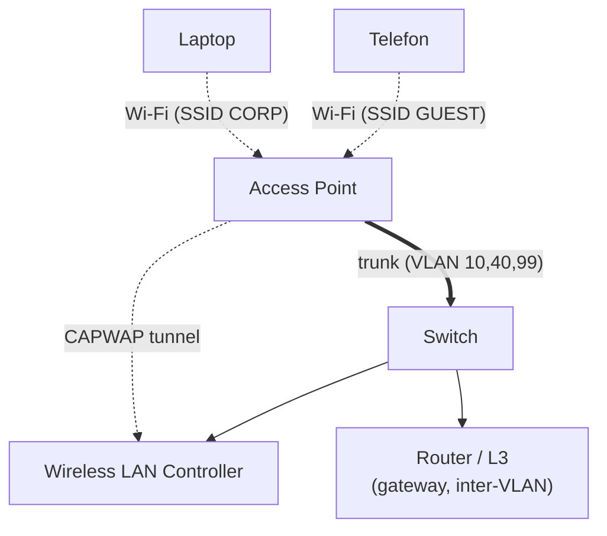
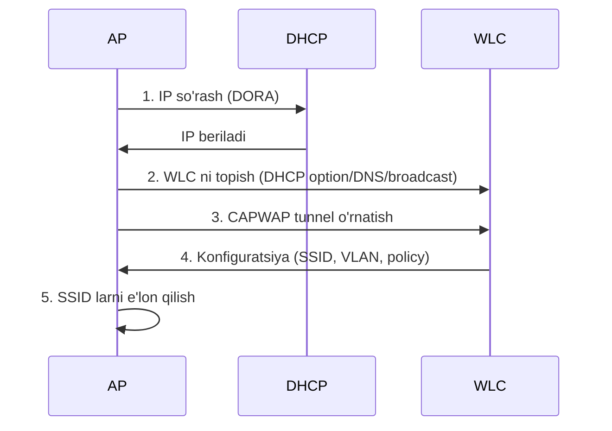

# 09. Wireless LAN (WLAN) — simsiz tarmoq asoslari

## Muammo: hamma joyda kabel tortib bo'lmaydi

Ofisda 200 xodim, har biriga stol, har stolga kabel. Endi ular noutbuk bilan
majlis xonasiga, oshxonaga, boshqa qavatga ko'chadi. Har joyga kabel tortib
bo'lmaydi. Telefon, planshet, kamera — bularning ko'pida kabel porti umuman yo'q.

Bizga **simsiz** ulanish kerak. Lekin havo — umumiy muhit: hamma bir vaqtda
gaplashsa, signal to'qnashadi; kimdir "eshitib" olishi mumkin; qaysi tarmoqqa
ulanishni qanday tanlash kerak?

Aynan shu muammolarni **WLAN** (Wireless LAN) hal qiladi: qurilmalarni radio
to'lqin orqali xavfsiz va tartibli ulash.

> **Oltin qoida:** WLAN — Access Point (AP) orqali simsiz qurilmalarni simli
> tarmoqqa ulaydi. SSID — foydalanuvchi ko'radigan tarmoq nomi; u odatda bitta
> VLAN ga bog'lanadi.

## Analogiya: radio stansiya

AP — bu radio stansiya:
- **SSID** — stansiya nomi ("Radio FM 101.5"), qurilma shuni ko'radi.
- **Channel** (kanal) — frequency, ikki stansiya bir kanalda bo'lsa shovqin.
- **BSSID** — stansiyaning aniq uzatkichi (AP radio MAC manzili).
- Har kim eshitishi mumkin — shuning uchun **shifrlash** (WPA3) kerak, aks holda
  parol ochiq eshitiladi.

Farqi: radio bir yo'nalishli (faqat eshitasan), WLAN esa ikki yo'nalishli — sen ham
"gapirasan". Shu sabab **CSMA/CA** (kanal bo'shashini kutish) kerak.

## Sodda ta'rif

**WLAN** — IEEE 802.11 (Wi-Fi) asosidagi simsiz LAN. **AP** (Access Point) radio
signalni simli Ethernet ga aylantiradi. Katta tarmoqda AP larni **WLC** (Wireless
LAN Controller) markaziy boshqaradi.

## Diagramma: WLAN komponentlari



AP switchga **trunk** orqali ulanadi — chunki bir nechta SSID/VLAN AP ga yetib
borishi kerak. **CAPWAP** tunnel AP va WLC orasidagi boshqaruv kanali.

## Asosiy atamalar

| Atama | Ma'nosi |
|-------|---------|
| **AP** | Access Point — simsiz mijozni simli tarmoqqa ulaydi |
| **SSID** | Foydalanuvchi ko'radigan WLAN nomi |
| **BSSID** | AP radio interfeysining MAC manzili |
| **WLC** | Wireless LAN Controller — AP larni markaziy boshqaradi |
| **Lightweight AP** | WLC orqali boshqariladigan AP |
| **Autonomous AP** | Mustaqil sozlanadigan AP |
| **CAPWAP** | Lightweight AP va WLC orasidagi tunnel/control protokol (RFC 5415) |

## Frequency bandlari

| Band | Xususiyat |
|------|-----------|
| **2.4 GHz** | Keng qamrov, ko'p interference; faqat 1, 6, 11 non-overlapping kanal |
| **5 GHz** | Ko'p kanal, kam interference, yuqori throughput, qisqaroq qamrov |
| **6 GHz** | Wi-Fi 6E/7; juda keng, toza spektr; qamrov eng qisqa |

2.4 GHz da faqat **1, 6, 11** kanal bir-birini bosmaydi (non-overlapping) — boshqa
kanallar overlap qilib shovqin keltiradi. Bu klassik xato.

## Zamonaviy holat (2025–2026): Wi-Fi 6E, 7 va WPA3

WebSearch bo'yicha eng so'nggi holat:

- **Wi-Fi 7** (802.11be) final standarti **2025-yil 22-iyulda** chop etildi. 2026
  ga kelib u consumer, enterprise va industrial bozorda hukmron standart bo'ladi.
- **MLO** (Multi-Link Operation) — Wi-Fi 7 ning asosiy yangiligi: 2.4/5/6 GHz ni
  **bir vaqtda** ishlatish (Wi-Fi 7 sertifikati uchun majburiy).
- **Wi-Fi 8** (802.11bn) — 2025-avgustda Draft 1.0 ga yetdi, 2028 da yakunlanadi.
  Fokus tezlik emas, **ishonchlilik**: Multi-AP Coordination (MAPC), barqarorlik.
- **WPA3** endi Wi-Fi 6E/7 uchun **majburiy** — WPA2 ga orqaga moslik yo'q. 6 GHz da
  **PMF** (Protected Management Frames) ham majburiy.

Cisco tomondan (WLC 9800, IOS XE):
- 6 GHz enterprise da **WPA3-Enterprise + 802.1X/RADIUS + PMF**.
- SAE (WPA3) bilan **Fast Transition (FT)** yoqish tavsiya etiladi — roaming tez
  bo'ladi (Apple qurilmalar buni kutadi).
- WPA2 va WPA3 orasida roaming **seamless emas** — to'liq qayta autentifikatsiya.

## SSID va VLAN mapping

Har SSID odatda bitta VLAN ga bog'lanadi (segmentatsiya va xavfsizlik uchun):
```text
SSID CORP  -> VLAN 10 -> 192.168.10.0/24
SSID VOICE -> VLAN 30 -> 192.168.30.0/24
SSID GUEST -> VLAN 40 -> 192.168.40.0/24
```

## Worked example — AP uchun switch portini sozlash

AP bir nechta SSID/VLAN tashishi uchun switch port **trunk** bo'ladi:

```cisco
interface gigabitEthernet0/10
 description AP-LOBBY
 switchport mode trunk
 switchport trunk native vlan 99         ! AP management VLAN
 switchport trunk allowed vlan 10,30,40,99
 spanning-tree portfast trunk
 no shutdown
```

**Notional machine:** AP o'z management trafigini native VLAN 99 da (ko'pincha
tagsiz), mijoz trafigini esa mos SSID ning VLAN tagi bilan yuboradi. Switch tagga
qarab trafikni to'g'ri VLAN ga ajratadi. `portfast trunk` — AP tez ulanishi uchun.

## Xavfsizlik variantlari

| Variant | Baho | Qayerda |
|---------|------|---------|
| **WPA3-Enterprise** | Eng kuchli | Korporativ (802.1X/RADIUS) |
| **WPA3-Personal (SAE)** | Kuchli | Kichik tarmoq, yangi qurilma |
| **WPA2-Enterprise** | Yaxshi | Korporativ (eski qurilma) |
| **WPA2-Personal (PSK)** | O'rtacha | Uy, kichik ofis |
| Open / WEP / WPA-TKIP | Yomon | Ishlatma (WEP hech qachon) |

Enterprise autentifikatsiya oqimi:
```text
Client -> AP/WLC -> RADIUS server (login tekshiradi, VLAN/policy qaytaradi)
```

## Lightweight AP oqimi (CAPWAP)



## Roaming — bir AP dan boshqasiga o'tish

Yaxshi roaming uchun: bir xil SSID, mos security policy, yetarli overlap qamrov,
to'g'ri kanal rejasi, juda baland transmit power dan qochish.

Yomon dizayn belgilari: client uzoq AP ga "yopishib" oladi; ping uzilishlari;
voice/video chaqiriqda uzilish; 2.4 GHz da shovqin.

## Predict savoli (PRIMM)

> 🤔 **O'ylab ko'r:** AP portini `switchport mode access vlan 10` qilding, lekin AP
> da 3 ta SSID (CORP=10, VOICE=30, GUEST=40) sozlangan. Client ulanadi, lekin
> GUEST SSID mijozi IP olmaydi. Nega?

<details>
<summary>💡 Javobni ko'rish</summary>

AP porti **access** — u faqat bitta VLAN (10) tashiydi. VOICE (30) va GUEST (40)
VLAN trafigi switchga yeta olmaydi, chunki access port ularni tashlab yuboradi.
GUEST mijozining DHCP so'rovi VLAN 40 gateway ga yetmaydi -> IP yo'q. Tuzatish:
portni **trunk** qil va `allowed vlan 10,30,40,99`.
</details>

## Troubleshooting

**AP yoqilmayapti:**
```cisco
show power inline gigabitEthernet0/10   ! PoE quvvat berilyaptimi?
show interfaces gigabitEthernet0/10 status
```
PoE bormi, port shutdown emasmi, kabel ishlaydimi.

**SSID ko'rinmayapti:** WLAN enabledmi, AP WLC ga join bo'lganmi, radio admin up mi,
SSID broadcast o'chirilmaganmi, country/regulatory domain mos mi.

**Client ulanadi, lekin IP olmaydi:** SSID-VLAN mapping to'g'rimi, AP port trunk
allowed listda client VLAN bormi, DHCP scope bormi, DHCP relay kerakmi.

**Ulanadi, lekin internet yo'q:** client IP/mask/gateway to'g'rimi, VLAN routing
ishlayaptimi, ACL/firewall bloklamayaptimi, guest VLAN ga internet ruxsati bormi.

WLC tomonda (platformaga qarab):
```cisco
show ap summary
show wlan summary
show wireless client summary
```

## Ko'p uchraydigan xatolar

| Xato | Nega yomon | To'g'risi |
|------|-----------|-----------|
| AP portini access qilish | Ko'p SSID/VLAN o'tmaydi | Trunk qil |
| AP mgmt native VLAN mos emas | Management ishlamaydi | Switch native bilan moslash |
| Guest va corp bitta VLAN da | Xavfsizlik yo'q | Alohida VLAN |
| 2.4 GHz da overlapping kanal | Shovqin, sekinlik | 1, 6, 11 ishlat |
| Transmit power maksimal | Roaming buziladi, interference | Optimal power |
| DHCP muammosini Wi-Fi deb bilish | Noto'g'ri tashxis | VLAN/DHCP ni tekshir |
| WPA2 6 GHz da kutish | 6E/7 WPA3 majburiy | WPA3 sozla |

## Xulosa

- **WLAN** (IEEE 802.11) qurilmalarni radio orqali simli tarmoqqa ulaydi.
- **AP** simsizni simliga aylantiradi; katta tarmoqda **WLC** boshqaradi.
- **SSID** — tarmoq nomi, odatda bitta VLAN ga bog'lanadi.
- AP switchga **trunk** orqali ulanadi (ko'p SSID/VLAN uchun).
- 2.4 GHz da faqat **1, 6, 11** non-overlapping kanal.
- 2025–2026: Wi-Fi 7 hukmron, **WPA3** 6 GHz/6E/7 uchun majburiy, MLO yangilik.

## 🧠 Eslab qol

- SSID != VLAN; SSID odatda bitta VLAN ga mapping qilinadi.
- Ko'p SSID/VLAN -> AP porti TRUNK.
- 2.4 GHz da faqat 1, 6, 11 kanal.
- 6 GHz/Wi-Fi 6E/7 -> WPA3 + PMF majburiy.
- Client IP olmasa -> avval VLAN mapping va DHCP ni tekshir.

## ✅ O'z-o'zini tekshir (retrieval practice)

**1.** Nega AP switchga access emas, trunk port bilan ulanadi?

<details>
<summary>Javob</summary>

AP odatda bir nechta SSID e'lon qiladi (CORP, VOICE, GUEST) va har SSID alohida
VLAN da. Bu VLAN larning hammasi switchga yetib borishi kerak — buni faqat trunk
(802.1Q tag bilan) qila oladi. Access port faqat bitta VLAN tashiydi.
</details>

**2.** 2.4 GHz da nega faqat 1, 6, 11 kanal ishlatiladi?

<details>
<summary>Javob</summary>

2.4 GHz spektri tor. Faqat 1, 6, 11 kanallar bir-birini **bosmaydi**
(non-overlapping). Boshqa kanallar overlap qilib bir-biriga shovqin (interference)
beradi, natijada throughput tushadi. 3 ta toza kanal ishlatilsa qo'shni AP lar
xalaqit bermaydi.
</details>

**3.** 2025 yilda 6 GHz Wi-Fi 6E/7 da qaysi xavfsizlik majburiy va nega?

<details>
<summary>Javob</summary>

**WPA3** (va **PMF** — Protected Management Frames). Wi-Fi Alliance 6E/7 uchun WPA3
ni majburiy qildi, WPA2 ga orqaga moslik yo'q. Sabab: 6 GHz yangi va toza spektr,
uni eng zaif shifrlashsiz emas, kuchli WPA3 bilan ochish — xavfsizlik standartini
oshirish.
</details>

**4.** Client Wi-Fi ga ulandi, lekin IP olmadi. Birinchi nimani tekshirasan?

<details>
<summary>Javob</summary>

SSID-VLAN mapping va AP port trunk allowed listida o'sha client VLAN borligini, keyin
DHCP scope/relay ni. Ko'pincha bu Wi-Fi muammosi emas, VLAN/DHCP muammosi — client
ulangan, lekin trafik to'g'ri VLAN gateway/DHCP ga yetmayapti.
</details>

## 🛠 Amaliyot

**1. Oson (Modify):** Worked example dagi AP trunk portiga yangi SSID uchun VLAN 50
(IOT) qo'sh — mavjud VLAN larni o'chirmasdan.

<details>
<summary>Hint</summary>

`switchport trunk allowed vlan add 50`. `add` bo'lmasa avvalgi 10,30,40,99 o'chib
ketadi.
</details>

**2. O'rta (Faded example):** AP uchun switch trunk portini to'ldir (mgmt VLAN 99,
CORP 10, GUEST 40):

```cisco
interface gigabitEthernet0/11
 description AP-2
 // TODO: trunk rejim
 // TODO: native VLAN 99 (AP management)
 // TODO: allowed VLAN 10,40,99
 // TODO: portfast trunk
 no shutdown
```

<details>
<summary>Hint</summary>

`switchport mode trunk`, `switchport trunk native vlan 99`, `switchport trunk
allowed vlan 10,40,99`, `spanning-tree portfast trunk`.
</details>

**3. Qiyin (Make):** Kichik ofis WLAN dizaynini noldan yoz: 3 SSID (CORP, GUEST,
VOICE), har biriga VLAN/subnet/xavfsizlik variant tanlab ber. AP port va inter-VLAN
gateway ni ham rejalashtir. Wi-Fi 6E ishlatsang qaysi xavfsizlik shart?

<details>
<summary>Hint</summary>

CORP -> VLAN 10, WPA3-Enterprise (802.1X). VOICE -> VLAN 30, WPA2/3 + LLDP-MED.
GUEST -> VLAN 40, captive portal/Open + izolyatsiya. AP port trunk `allowed vlan
10,30,40,99`. 6E -> WPA3 + PMF majburiy.
</details>

## 🔁 Takrorlash

**Bog'liq mavzular (shu modul ichida):**
- [01-physical-layer.md](01-physical-layer.md) — radio to'lqin, Wi-Fi standartlari.
- [04-trunk-8021q.md](04-trunk-8021q.md) — AP uchun trunk.
- [08-cdp-lldp.md](08-cdp-lldp.md) — AP ni CDP/LLDP bilan topish.

**Takrorlash jadvali:**
- **Ertaga:** WLAN atamalarini (AP, SSID, BSSID, WLC, CAPWAP) yoddan ayt.
- **3 kundan keyin:** AP trunk port konfiguratsiyasini yozib chiq.
- **1 haftadan keyin:** "Client IP olmasa nima tekshirasan" savoliga qayta javob ber.

**Feynman testi:** "Radio stansiya" analogiyasidan foydalanib, SSID, channel va
nega shifrlash (WPA3) kerakligini do'stingga 3 jumlada tushuntir.

## 📚 Manbalar

- Cisco CCNA 200-301 — Wireless Fundamentals
- IEEE 802.11 (Wi-Fi), 802.11be (Wi-Fi 7)
- [Wikipedia — Wi-Fi 7](https://en.wikipedia.org/wiki/Wi-Fi_7)
- [Cisco — Migrate to 6 GHz and Wi-Fi 7 with Cisco Wireless](https://www.cisco.com/c/en/us/support/docs/wireless/catalyst-9800-series-wireless-controllers/223061-migrate-to-wi-fi-7-and-6ghz.html)
- [Cisco — WPA3 Deployment Guide (Catalyst 9800)](https://www.cisco.com/c/en/us/td/docs/wireless/controller/9800/technical-reference/wpa3-dg.html)
- [ModemGuides — Wi-Fi 8 vs Wi-Fi 7: upgrade in 2026 or wait](https://www.modemguides.com/blogs/modemguides-blog/wifi-8-vs-wifi-7-should-you-upgrade-2026)
