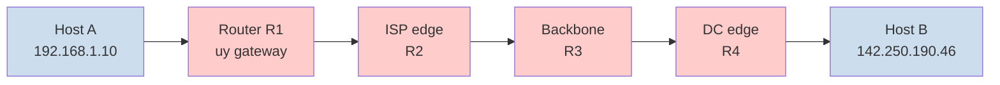
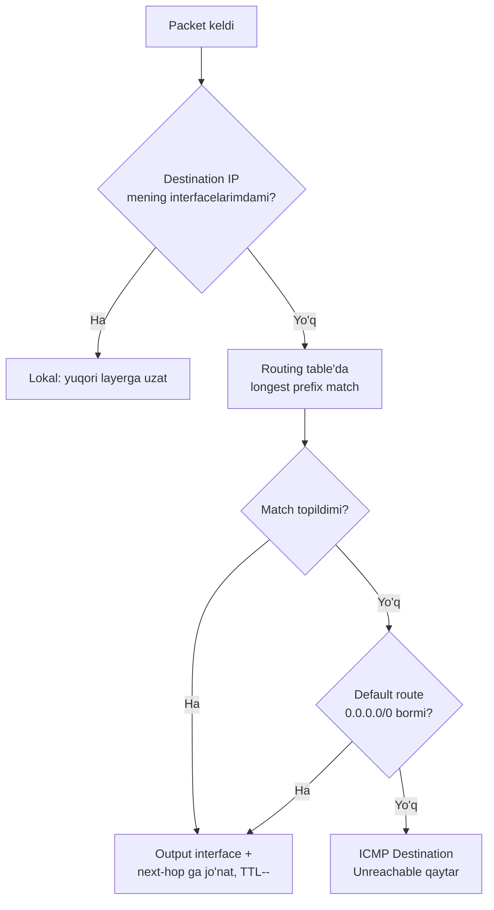
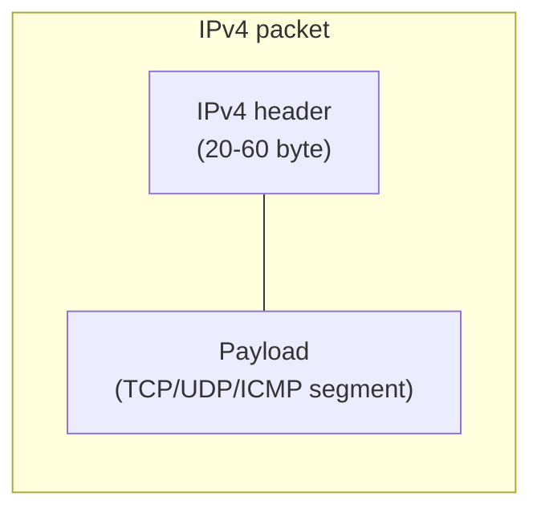
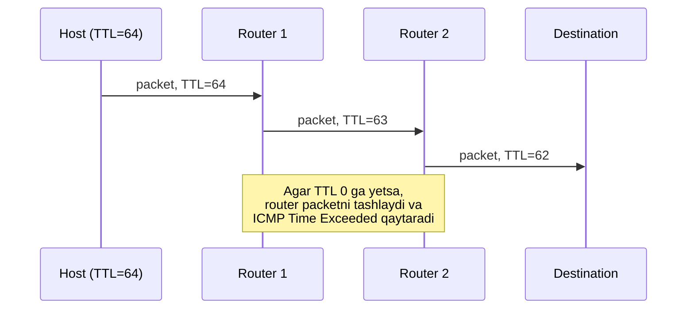
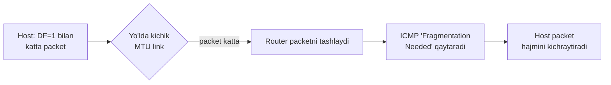

# Network Layer va IPv4 header

## Muammo: pochta bo'lmasa nima bo'ladi?

Tasavvur qil: sen Toshkentda, do'sting Tokioda. Unga xat yozmoqchisan.
Lekin sen Tokiogacha yo'lni bilmaysan, qaysi ko'chalar borligini ham bilmaysan.

Sen faqat **manzil**ni yozasan va xatni pochta qutisiga tashlaysan.
Qolgan ishni pochta tizimi qiladi: shahardan shaharga, mamlakatdan mamlakatga.

Kompyuter tarmog'ida aynan shu ishni **Network layer** bajaradi.
U bo'lmasa, internet shunchaki bir-biriga to'g'ridan-to'g'ri ulangan
kompyuterlar to'plami bo'lib qolardi -- Toshkentdan Tokioga xech narsa yubora olmaysan.

## Analogiya: pochta tizimi

| Pochta tizimi | Network layer |
|---|---|
| Xatdagi manzil | **IP address** |
| Xat + konvert | **packet** (datagram) |
| Pochta bo'limi ichida saralash | **forwarding** (router ichida) |
| Butun mamlakat bo'ylab marshrut tanlash | **routing** (tarmoq bo'ylab) |
| Pochtachi | **router** |

Farqi shundaki: pochta bir xatni bir marta yuboradi, network layer esa
katta faylni ko'p **packet**larga bo'lib, har birini alohida yuboradi.
Va pochtadan farqli, IP **kafolat bermaydi** -- xat yo'qolishi ham mumkin.

## Sodda ta'rif

> **Network layer** (OSI 3-qatlam) -- bu bir hostdan (kompyuter) ikkinchi
> hostgacha, ko'p **router** (tarmoqlararo qurilma) orqali, **packet**larni
> yetkazadigan qatlam. Asosiy protokoli -- **IP** (Internet Protocol).

Ikkita asosiy vazifasini eslab qol:

- **Forwarding** -- bitta router ichidagi harakat: packet kirish portidan
  chiqish portiga. Tez (mikrosekund/nanosekund), hardware bajaradi.
- **Routing** -- butun tarmoq bo'ylab eng yaxshi yo'lni hisoblash. Sekinroq,
  software bajaradi (bu haqda 03-routing modulida chuqur o'rganamiz).



## Network layer nima qiladi? (asosiy vazifalar)

- **Logical addressing** -- har bir hostga unique **IP address** beradi
  (IPv4 -- 32 bit, IPv6 -- 128 bit). Bu address hostning tarmoqdagi "manzili".
- **Routing** -- source dan destination gacha eng yaxshi yo'l topish.
- **Forwarding** -- routerda packetni to'g'ri interface'ga uzatish.
- **Fragmentation** -- MTU dan katta packetni bo'laklarga bo'lish.
- **Best-effort delivery** -- IP **kafolatsiz** xizmat: packet yo'qolishi,
  takrorlanishi, tartibsiz kelishi mumkin. Ishonchlilik -- yuqori layer (TCP) vazifasi.
- **Error reporting** -- **ICMP** orqali muammo haqida xabar berish.
- **Address translation** -- **NAT** orqali private IP'ni public IP'ga o'tkazish.

### Nega IP "unreliable" (ishonchsiz)?

Bu kamchilik emas, **dizayn tanlovi**. Internet asoschilari "tarmoq oddiy,
end system'lar aqlli" prinsipini tanladi:

> **Oltin qoida:** IP sodda va tez ishlaydi, ishonchlilikni esa yuqori
> layer'dagi TCP ta'minlaydi (end-to-end principle).

Shu soddalik tufayli IP har xil texnologiyalar ustida ishlaydi:
fiber, Wi-Fi, sputnik, radio -- hammasi bir xil IP packet'ni tashiydi.
Aynan shu soddalik internetni global miqyosda o'stirdi.

## Notional machine: packet router ichida aynan nima qiladi?

Router har packet uchun bitta savol beradi:

> "Bu packet'ning destination IP'si mening routing table'imda qaysi
> yozuv bilan **eng uzun mos keladi**?" (longest prefix match)



Muhim: har router'da packet'ning **L2 (MAC) address'lari almashadi**
(har link uchun yangi), lekin **L3 (IP) address'lari o'zgarmaydi** (NAT
bo'lmasa). Va **TTL** har hop'da 1 ga kamayadi.

## IPv4 header -- packet'ning "konverti"

Har bir IPv4 packet ikki qismdan iborat: **header** (konvertdagi ma'lumot)
va **payload** (ichidagi data). Header **minimum 20 byte**, maksimum 60 byte.



### Header maydonlari

```
 0                   1                   2                   3
 0 1 2 3 4 5 6 7 8 9 0 1 2 3 4 5 6 7 8 9 0 1 2 3 4 5 6 7 8 9 0 1
+-+-+-+-+-+-+-+-+-+-+-+-+-+-+-+-+-+-+-+-+-+-+-+-+-+-+-+-+-+-+-+-+
|Version|  IHL  |Type of Service|          Total Length         |
+-+-+-+-+-+-+-+-+-+-+-+-+-+-+-+-+-+-+-+-+-+-+-+-+-+-+-+-+-+-+-+-+
|         Identification        |Flags|      Fragment Offset    |
+-+-+-+-+-+-+-+-+-+-+-+-+-+-+-+-+-+-+-+-+-+-+-+-+-+-+-+-+-+-+-+-+
|  Time to Live |    Protocol   |         Header Checksum       |
+-+-+-+-+-+-+-+-+-+-+-+-+-+-+-+-+-+-+-+-+-+-+-+-+-+-+-+-+-+-+-+-+
|                       Source Address (32 bit)                 |
+-+-+-+-+-+-+-+-+-+-+-+-+-+-+-+-+-+-+-+-+-+-+-+-+-+-+-+-+-+-+-+-+
|                    Destination Address (32 bit)               |
+-+-+-+-+-+-+-+-+-+-+-+-+-+-+-+-+-+-+-+-+-+-+-+-+-+-+-+-+-+-+-+-+
|                    Options (agar mavjud bo'lsa)               |
+-+-+-+-+-+-+-+-+-+-+-+-+-+-+-+-+-+-+-+-+-+-+-+-+-+-+-+-+-+-+-+-+
```

| Maydon | Uzunligi | Vazifasi |
|---|---|---|
| **Version** | 4 bit | IPv4 uchun `4` |
| **IHL** | 4 bit | Header uzunligi (5 = 20 byte) |
| **Type of Service (DSCP/ECN)** | 8 bit | QoS va congestion signal |
| **Total Length** | 16 bit | Butun packet uzunligi, max 65,535 byte |
| **Identification** | 16 bit | Fragmentlarni qayta yig'ish ID'si |
| **Flags** | 3 bit | DF (Don't Fragment), MF (More Fragments) |
| **Fragment Offset** | 13 bit | Fragmentning original packetdagi o'rni |
| **TTL** | 8 bit | Time To Live -- har router 1 ga kamaytiradi |
| **Protocol** | 8 bit | Payload turi: 1=ICMP, 6=TCP, 17=UDP |
| **Header Checksum** | 16 bit | Faqat header xatosini tekshiradi |
| **Source Address** | 32 bit | Yuboruvchi IP |
| **Destination Address** | 32 bit | Qabul qiluvchi IP |

Uchta muhim nozik nuqta:

- **Subnet mask header ichida YO'Q.** Router qarorni o'zining routing
  table'idagi prefix orqali qiladi. Buni ko'p yangi o'rganuvchi adashtiradi.
- **Header checksum faqat header'ni tekshiradi, payload'ni emas.**
- **IPv4 o'zi encryption bermaydi.** Xavfsizlik TLS, IPsec yoki yuqori layerlarda.

## TTL -- packet abadiy aylanmasin

**TTL (Time To Live)** -- packet "yashash muddati". Har router uni 1 ga kamaytiradi.



Nega kerak? Agar routing'da xato bo'lsa (R1 -> R2 -> R1 -> ...), packet
abadiy aylanib qolardi va tarmoqni to'ldirardi. TTL bunga chek qo'yadi.

### Worked example: traceroute TTL bilan qanday ishlaydi

`traceroute` aynan TTL mexanizmidan **hiyla** bilan foydalanadi:

```bash
# --- 1-qadam: TTL=1 bilan packet yuboriladi ---
# 1-router TTL=0 qiladi va ICMP Time Exceeded qaytaradi -> 1-hop IP topildi

# --- 2-qadam: TTL=2 bilan packet yuboriladi ---
# 2-router javob qaytaradi -> 2-hop IP topildi

# --- shu tariqa destination gacha ---
traceroute -n google.com
```

Output:

```
traceroute to google.com (142.250.184.142), 30 hops max
 1  192.168.1.1        1.234 ms   uy gateway
 2  10.50.0.1          5.678 ms   ISP edge
 3  77.72.144.17       8.123 ms   ISP backbone
 4  213.197.241.45    12.456 ms   peering
 5  142.250.184.142   16.456 ms   destination
```

## Fragmentation va MTU

Har bir Data Link texnologiyasining o'z **MTU** (Maximum Transmission Unit)
si bor -- bir frame'da tashilishi mumkin bo'lgan maksimal byte. Ethernet uchun
odatda **1500 byte**.

Agar IPv4 packet keyingi link MTU'sidan katta bo'lsa, uni **fragment**lash kerak.

### Worked example: 4000 byte packetni fragmentlash

```
Original: 4000 byte (20 header + 3980 data), MTU=1500

Fragment 1: 1500 byte (20 header + 1480 data)  ID=777, Offset=0,   MF=1
Fragment 2: 1500 byte (20 header + 1480 data)  ID=777, Offset=185, MF=1
Fragment 3: 1040 byte (20 header + 1020 data)  ID=777, Offset=370, MF=0
```

- **Identification** -- barcha fragmentlarda bir xil, qaysi original
  packetga tegishli ekanini bildiradi.
- **MF (More Fragments)** -- oxirgi fragmentda 0, qolganida 1.
- **Reassembly** faqat **destination host**'da bo'ladi, router'da emas
  (tarmoq yadrosi sodda qolishi uchun).

Agar bitta fragment yo'qolsa, butun packet tashlanadi va TCP uni qayta so'raydi.

### Path MTU Discovery (PMTUD)

Fragmentation sekin va xavfli. Shu sabab zamonaviy host'lar **PMTUD** ishlatadi:



> **Ogohlantirish (2025 amaliyoti):** Agar firewall ICMP'ni **butunlay**
> bloklasa, PMTUD ishlamaydi -- bu **PMTUD black hole** deyiladi. Host packet
> katta ekanini bilmaydi, qayta-qayta yuboradi, ulanish "osilib qoladi".

### Zamonaviy kontekst: jumbo frames

2025-yilgi data center'larda, ayniqsa **AI** va **storage** tarmoqlarida,
**jumbo frames** (MTU 9000) keng ishlatiladi. Sababi: MTU 1500 da 20 GB
uzatish ~14.3 million packet talab qiladi; MTU 9000 da bu ~2.4 millionga
tushadi -- **83% kamroq packet**, demak CPU yuki ham kamroq.

Lekin bitta shart: yo'ldagi **hamma** qurilma (NIC, switch, firewall,
virtualizatsiya) bir xil MTU'ni qo'llab-quvvatlashi kerak. Aks holda katta
packetlar fragment yoki drop bo'ladi.

## Protocol maydoni: payload ichida nima bor?

IPv4 header'dagi `Protocol` maydoni payload ichida qaysi protocol borligini bildiradi:

| Protocol raqami | Protocol |
|---:|---|
| 1 | ICMP |
| 6 | TCP |
| 17 | UDP |
| 47 | GRE |
| 50 | ESP (IPsec) |
| 89 | OSPF |

Masalan: Web HTTPS -> IPv4 payload ichida TCP, TCP ichida TLS/HTTP.

## Predict savoli

Router'ga packet keldi, uning TTL qiymati `1`. Router bu packetni
o'zining destination'i emasligini ko'rdi va uni forward qilishi kerak.

> Nima bo'ladi?

<details>
<summary>Javobni ko'rish</summary>

Router TTL'ni 1 ga kamaytiradi -> TTL `0` bo'ladi. Router packetni
**forward qilmaydi**, uni **tashlaydi** va source'ga **ICMP Time Exceeded**
xabarini qaytaradi. Aynan shu mexanizm `traceroute` ishlashiga asos bo'ladi.

</details>

## Ko'p uchraydigan xatolar

⚠️ **"Subnet mask packet ichida yuradi"** -- Yo'q. Mask hech qachon packet'da
bo'lmaydi. Router qarorni o'zining routing table'idagi prefix orqali qiladi.

⚠️ **"IP ishonchli yetkazadi"** -- Yo'q. IP best-effort. Yo'qolish, tartibsizlik
mumkin. Ishonchlilik TCP'da.

⚠️ **"Header checksum butun packetni himoya qiladi"** -- Yo'q. Faqat header'ni.
Payload'ni yuqori layer checksum'i tekshiradi.

⚠️ **"MTU va Total Length bir narsa"** -- Yo'q. MTU -- link'ning fizik chegarasi;
Total Length -- konkret packet'ning uzunligi. Total Length MTU'dan katta bo'lsa,
fragment kerak.

## Xulosa

- Network layer packetlarni host'dan host'gacha, ko'p router orqali yetkazadi.
- Ikkita asosiy vazifa: **forwarding** (router ichida) va **routing** (tarmoq bo'ylab).
- **IP -- best-effort, connectionless** protocol; ishonchlilik TCP'da.
- IPv4 header 20-60 byte; muhim maydonlar: Version, TTL, Protocol, Source/Dest IP.
- **TTL** routing loop'dan himoya qiladi; `traceroute` shunga tayanadi.
- **Fragmentation** MTU'dan katta packetlarni bo'ladi; reassembly faqat destination'da.
- **PMTUD** fragmentation'ni oldini oladi, lekin ICMP block bo'lsa buziladi.

## 🧠 Eslab qol

- Network layer = pochta tizimi; IP address = manzil; router = pochtachi.
- IP ishonchsiz -- bu dizayn, ishonchlilik TCP'da.
- TTL 0 ga yetsa -> packet o'ladi + ICMP Time Exceeded.
- Subnet mask packet ichida emas, routing table'da.
- Reassembly faqat destination host'da bo'ladi.

## ✅ O'z-o'zini tekshir (retrieval practice)

**1. Nega router'da packet'ning MAC address'i almashadi, lekin IP address'i o'zgarmaydi (NAT bo'lmasa)?**

<details>
<summary>Javob</summary>

MAC address faqat bitta link (L2 segment) ichida ma'noli. Har hop -- yangi
link, demak yangi src/dst MAC (ARP orqali topiladi). IP address esa
end-to-end manzil -- u source'dan destination'gacha o'zgarmaydi, chunki
routing aynan destination IP bo'yicha ishlaydi.

</details>

**2. Firewall ICMP'ni butunlay block qilsa, nega ba'zi saytlar "osilib" qolishi mumkin?**

<details>
<summary>Javob</summary>

PMTUD ICMP "Fragmentation Needed" xabariga tayanadi. ICMP block bo'lsa, host
packet katta ekanini bila olmaydi (PMTUD black hole). U katta packetni
qayta-qayta yuboradi, javob kelmaydi, ulanish osilib qoladi.

</details>

**3. Total Length 5000 byte, link MTU 1500. Nima bo'ladi?**

<details>
<summary>Javob</summary>

IPv4'da router (yoki source) packetni fragmentlarga bo'ladi -- har biri
MTU'ga sig'adi. Har fragmentda bir xil Identification, MF flag va turli
Fragment Offset bo'ladi. Reassembly destination host'da. Agar DF=1 o'rnatilgan
bo'lsa, router packetni tashlaydi va ICMP qaytaradi.

</details>

**4. Nega Identification maydoni kerak?**

<details>
<summary>Javob</summary>

Bir vaqtda ko'p packet fragmentlanishi mumkin. Destination host qaysi
fragment qaysi original packetga tegishli ekanini Identification bo'yicha
ajratadi va to'g'ri qayta yig'adi.

</details>

## 🛠 Amaliyot

**1. Oson (Modify).** Terminalda ishga tushir:

```bash
ping -c 4 8.8.8.8
```

Chiquvchi `ttl=` qiymatiga qara. Boshlang'ich TTL (64 yoki 128) dan hozirgi
qiymatni ayir -- necha hop o'tganini hisobla.

**2. O'rta (faded example).** Quyidagi fragmentation hisobini to'ldir:

```
Original packet: 3000 byte (20 header + 2980 data), MTU = 1500

Fragment 1: 1500 byte, MF = ___, Offset = ___
Fragment 2: ___ byte,  MF = ___, Offset = ___   // TODO: hisobla
```

<details>
<summary>Hint</summary>

Data har fragmentda 8 ga bo'linadigan bo'lishi kerak. 1480 data / 8 = 185
(bu Offset birligi). Fragment 1: MF=1, Offset=0. Fragment 2: 20+1500=1520
byte, MF=0, Offset=185.

</details>

**3. Qiyin (Make).** `traceroute 1.1.1.1` (yoki `tracert 1.1.1.1` Windows'da)
ishga tushir. Har hop uchun: bu qaysi tarmoq (uy, ISP, backbone)? Qaysi hop'da
kechikish sezilarli oshdi? Nega deb o'yla.

## 🔁 Takrorlash

- **Bog'liq oldingi mavzular:** 00-tarmoq-asoslari (OSI/TCP-IP modellar),
  01-network-access (Data Link, MAC, MTU asoslari).
- **Keyingi qadam:** [02-ip-addressing.md](02-ip-addressing.md) -- IP address
  tuzilishini binary darajada o'rganamiz.
- **Takrorlash jadvali:** ertaga -> 3 kundan keyin -> 1 haftadan keyin
  "O'z-o'zini tekshir" savollariga qaytib javob ber (yozib chiqmasdan, xotiradan).
- **Feynman testi:** Network layer nima qilishini, kod va texnik atamalarsiz,
  bir do'stingga 3 jumlada tushuntirib ber. Pochta analogiyasidan foydalan.

## 📚 Manbalar

- Kurose & Ross, "Computer Networking", Bob 4 (Network Layer)
- [RFC 791 -- Internet Protocol (IPv4)](https://www.rfc-editor.org/rfc/rfc791)
- [RFC 1191 -- Path MTU Discovery](https://www.rfc-editor.org/rfc/rfc1191)
- [Google IPv6 Statistics](https://www.google.com/intl/en/ipv6/statistics.html)
- [Jumbo Frames va MTU 9000 in data centers (StarWind)](https://www.starwindsoftware.com/blog/mtu-size/)
- [What Are Jumbo Frames in AI Data Centers (Cloudswitch)](https://cloudswit.ch/blogs/what-are-jumbo-frames-why-use-them-in-aidc/)
- [MTU size issues, fragmentation, and jumbo frames (Network World)](https://www.networkworld.com/article/745164/mtu-size-issues.html)
