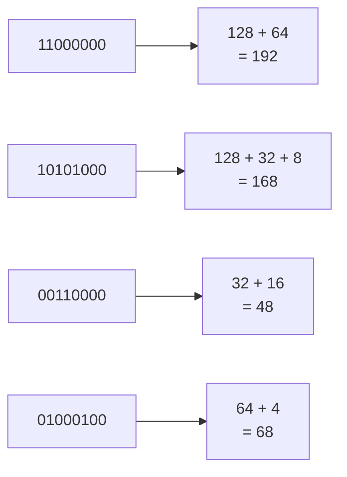
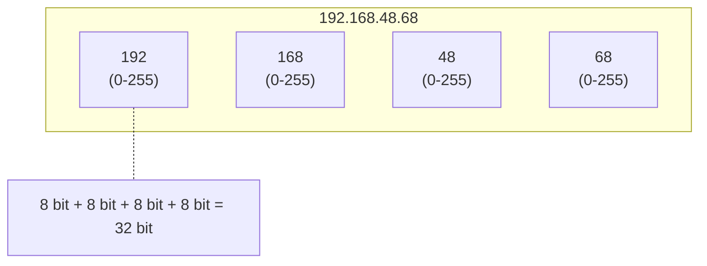
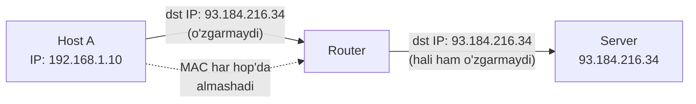

# IP addressing asoslari (binary, oktet, address tuzilishi)

## Muammo: 4 milliard uy uchun manzil kerak

Bir shaharda 100 ta uy bo'lsa, ularni 1 dan 100 gacha raqamlash oson.
Lekin internet -- millardlab qurilma. Har biriga **unique manzil** kerak,
va bu manzil "qaysi tarmoqda" degan ma'lumotni ham o'zida saqlashi kerak.

IPv4 shu muammoni **32 bitli** address bilan yechadi. Lekin bu bitlar
qanday guruhlanadi, nega `192.168.1.300` noto'g'ri, `168` qayerdan chiqadi --
bularni **binary** tushunmasdan hech qachon anglab bo'lmaydi.

Bu darsda address'ni "sehr" bo'lishdan to'xtatib, oddiy raqamlarga aylantiramiz.

## Analogiya: telefon raqami

IPv4 address'ni telefon raqamiga o'xshatish mumkin:

- Telefon raqami: `+998 90 123 45 67` -- qismlarga bo'lingan.
- IP address: `192.168.48.68` -- 4 ta qismga (**octet**) bo'lingan.

Telefon raqamining boshi (`+998`) mamlakatni bildiradi (network qismi),
oxiri esa aniq abonentni (host qismi). IP ham xuddi shunday: bir qismi
**tarmoqni**, boshqasi **hostni** bildiradi.

Farqi: telefonda chegara doim bir joyda; IP'da chegara **subnet mask**ka
bog'liq (buni 03-subnetting darsida ochamiz). Bu darsda address'ning o'zini o'rganamiz.

## Sodda ta'rif

> **IPv4 address** -- interface'ga beriladigan **32 bitli** mantiqiy manzil.
> U 4 ta **octet**ga (8-bitli qism) bo'linadi va odatda **dotted decimal**
> ko'rinishda yoziladi: `192.168.48.68`.

Diqqat: IP address **kompyuterga emas, interface'ga** beriladi. Bir routerda
3 ta interface bo'lsa, 3 ta alohida IP bo'ladi.

## Necha ta address bor?

```
2^32 = 4,294,967,296 ta nazariy address
```

Bu ~4.3 milliard. Lekin "nazariy" -- chunki ko'p range private, loopback,
multicast yoki reserved. Amalda public IP'lar allaqachon tugagan.

> **Zamonaviy kontekst (2026):** IPv4 address'lar shu qadar taqchil bo'ldiki,
> ular endi **bozorda sotiladi**. 2026-yilda bitta IPv4 address'ning narxi
> ~$25-52 (blok o'lchamiga qarab). Butun ikkilamchi IPv4 bozori yiliga
> $2.5 milliarddan oshadi. Aynan shu taqchillik NAT va IPv6'ni tug'dirdi.

## Binary: har narsaning asosi

Kompyuter faqat `0` va `1`ni biladi. IP address aslida 32 ta bit:

```
192.168.48.68 = 11000000.10101000.00110000.01000100
```

Har octet 8 bit. 8 bit qanday raqamga aylanadi? Har pozitsiyaning "vazni" bor:

```
Pozitsiya vazni:  128  64  32  16   8   4   2   1
```

Bir octetni decimal'ga aylantirish -- `1` turgan pozitsiyalarning vaznini qo'shish.



### Worked example: `168` ni binary'ga aylantirish

Maqsad: `168` decimal -> binary.

```
// --- 1-qadam: eng katta vazndan boshlaymiz ---
128 <= 168 ?  Ha  -> 1, qoldiq: 168 - 128 = 40

// --- 2-qadam: keyingi vaznlar ---
64  <= 40  ?  Yo'q -> 0
32  <= 40  ?  Ha  -> 1, qoldiq: 40 - 32 = 8
16  <= 8   ?  Yo'q -> 0
8   <= 8   ?  Ha  -> 1, qoldiq: 8 - 8 = 0
4   <= 0   ?  Yo'q -> 0
2   <= 0   ?  Yo'q -> 0
1   <= 0   ?  Yo'q -> 0

// --- Natija ---
168 = 10101000
```

Tekshiruv: `128 + 32 + 8 = 168`. To'g'ri.

## Octet chegaralari: nega 0-255?

**Octet** -- 8 bit. 8 bit bilan yoziladigan qiymatlar:

```
Eng kichik: 00000000 = 0
Eng katta:  11111111 = 128+64+32+16+8+4+2+1 = 255
```

Shuning uchun har octet **0 dan 255 gacha**.



### To'g'ri va noto'g'ri address'lar

| To'g'ri | Noto'g'ri | Nega noto'g'ri |
|---|---|---|
| `10.0.0.1` | `192.168.1.300` | 300 > 255 |
| `192.168.1.254` | `10.0.0.-1` | manfiy son yo'q |
| `8.8.8.8` | `1.2.3.4.5` | 5 ta octet (faqat 4 bo'ladi) |

## Address tuzilishi: network + host

IPv4 address mantiqan ikki qismga bo'linadi:

```
11000000.10101000.00110000 . 01000100
<-------- network -------->   <- host ->
```

- **Network qismi** -- qaysi tarmoq (subnet).
- **Host qismi** -- shu tarmoq ichidagi aniq qurilma.

Lekin chegara qayerda? Buni **IP address o'zi aytmaydi.** Kerak bo'ladi:
**subnet mask** yoki **CIDR prefix** (masalan `/24`).

```
192.168.1.10        <- yolg'iz o'zi yetarli EMAS
192.168.1.10/24     <- endi network chegarasi ma'lum
```

Bir xil IP, turli prefix -> turli subnet:

```
192.168.1.10/24  -> network: 192.168.1.0
192.168.1.10/25  -> network: 192.168.1.0  (lekin subnet kichikroq)
192.168.1.10/26  -> network: 192.168.1.0
```

Bularni to'liq hisoblashni keyingi darslarda o'rganamiz. Hozir asosiy fikr:
**IP hech qachon yolg'iz kelmaydi -- doim mask bilan qaraladi.**

## IP vs MAC: qaysi qayerda ishlaydi?

Bu farqni chalkashtirmaslik juda muhim:

| Layer | Address | Qayerda ishlaydi | Vazifasi |
|---|---|---|---|
| Layer 2 | **MAC** | Lokal link ichida | Frame'ni lokal segmentda yetkazish |
| Layer 3 | **IP** | Tarmoqlar orasida | Packetni source'dan destination'ga yo'naltirish |



Packet ichida source va destination IP butun yo'l davomida saqlanadi;
Ethernet frame ichidagi MAC har hop'da o'zgaradi.

## Hex ko'rinishi (bonus)

Ba'zan IP hex'da ham yoziladi (masalan log'larda):

```
192.168.1.5 = C0.A8.01.05 = 0xC0A80105
```

Har octet 2 ta hex raqam: `192 = 0xC0`, `168 = 0xA8`. Bu shunchaki bir xil
32 bit, boshqa yozuv.

## Predict savoli

Senga `172.16.10.0` va `172.16.10.255` berildi, prefix esa noma'lum.

> Bu ikkalasi host'ga berilishi mumkinmi?

<details>
<summary>Javobni ko'rish</summary>

**Aniq javob berib bo'lmaydi**, chunki prefix (mask) yo'q. Agar `/24` bo'lsa,
`172.16.10.0` -- network address, `172.16.10.255` -- broadcast, ikkalasi ham
host'ga berilmaydi. Lekin `/23` bo'lsa, `172.16.10.255` oddiy host bo'lishi
mumkin. Bu -- darsning asosiy dars: **IP yolg'iz o'zi hech narsa aytmaydi.**

</details>

## Ko'p uchraydigan xatolar

⚠️ **"192.168.1.10 -- bu Class C, demak /24"** -- Bu **classful fikrlash**,
zamonaviy tarmoqlarda xato. Prefix ko'rsatilmasa, hech narsa deb bo'lmaydi.
(Buni 05-darsda batafsil ko'ramiz.)

⚠️ **"IP kompyuterga beriladi"** -- Aniqrog'i, **interface'ga**. Ko'p interfaceli
qurilmada ko'p IP bo'ladi.

⚠️ **"256.1.1.1 bor"** -- Yo'q. Har octet max 255 (8 bit). 256 imkonsiz.

⚠️ **"IP va MAC bir xil vazifa"** -- Yo'q. MAC lokal (L2), IP global (L3).
Frame lokal yetkaziladi, packet tarmoqlararo yo'naltiriladi.

## Xulosa

- IPv4 address -- 32 bit, 4 ta octet (har biri 8 bit, 0-255).
- Dotted decimal `192.168.48.68` -- aslida `11000000.10101000.00110000.01000100`.
- Binary'ni o'qish = `1` turgan pozitsiyalarning vaznini qo'shish (128..1).
- Address mantiqan network + host qismga bo'linadi.
- Chegara IP'da emas -- **subnet mask / CIDR prefix**da.
- IP interface'ga beriladi; IP (L3) va MAC (L2) turli vazifada.
- 2026'da IPv4 taqchilligi tufayli address bozorda sotiladi ($25-52/dona).

## 🧠 Eslab qol

- Octet = 8 bit = 0-255. Vaznlar: 128 64 32 16 8 4 2 1.
- IP = network qismi + host qismi.
- IP yolg'iz kelmaydi -- doim mask/prefix bilan.
- IP interface'ga beriladi, kompyuterga emas.
- IP -- L3 (tarmoqlararo), MAC -- L2 (lokal).

## ✅ O'z-o'zini tekshir (retrieval practice)

**1. `11000000` octeti qaysi decimal songa teng va nega?**

<details>
<summary>Javob</summary>

`192`. Chunki `1` turgan pozitsiyalar vazni: 128 + 64 = 192. Qolgan
bitlar 0, hissa qo'shmaydi.

</details>

**2. Nega `10.0.0.256` noto'g'ri address?**

<details>
<summary>Javob</summary>

Oxirgi octet 8 bit -- max qiymati 255 (`11111111`). 256 8 bitga sig'maydi
(9 bit kerak bo'lardi). Shuning uchun imkonsiz.

</details>

**3. `192.168.1.10/24` va `192.168.1.10/26` -- IP bir xil. Farqi bormi?**

<details>
<summary>Javob</summary>

Ha. IP address bir xil bo'lsa ham, prefix turli -> subnet o'lchami turli.
`/24` da 256 address, `/26` da 64 address. Ular turli host range va turli
broadcast'ga ega bo'lishi mumkin. Shuning uchun IP'ni doim prefix bilan qarash kerak.

</details>

**4. Bitta routerda nechta IP bo'lishi mumkin va nega?**

<details>
<summary>Javob</summary>

Interfacelar soniga qarab bir nechta. IP interface'ga beriladi. 3 interfaceli
router 3 ta IP'ga ega bo'ladi (har network tomoni uchun alohida).

</details>

## 🛠 Amaliyot

**1. Oson (Modify).** Terminalda IP'ingni ko'r:

```bash
ip a        # Linux/macOS
ipconfig    # Windows
```

`inet` yonidagi IP va prefix (`/24`) ni top. Bu qaysi octet network,
qaysisi host?

**2. O'rta (faded example).** Quyidagi binary -> decimal aylantirishni to'ldir:

```
11111111 = ___          // TODO
10000001 = ___          // TODO (128 + 1)
00001010 = ___          // TODO
```

<details>
<summary>Hint</summary>

`1` turgan pozitsiyalar vaznini qo'sh. 11111111 = 255. 10000001 = 128+1 = 129.
00001010 = 8+2 = 10.

</details>

**3. Qiyin (Make).** `192.168.5.130` ni to'liq binary'ga aylantir (qo'lda,
kalkulyatorsiz). Keyin `ipcalc 192.168.5.130` (bo'lsa) yoki onlayn kalkulyator
bilan tekshir.

## 🔁 Takrorlash

- **Bog'liq oldingi mavzular:** [01-network-layer-va-ipv4.md](01-network-layer-va-ipv4.md)
  (IP header, Source/Destination Address maydonlari).
- **Keyingi qadam:** [03-subnetting-cidr-vlsm.md](03-subnetting-cidr-vlsm.md) --
  bu yerda o'rgangan binary bilan subnet chegarasini hisoblaymiz.
- **Takrorlash jadvali:** ertaga -> 3 kundan keyin -> 1 haftadan keyin binary
  aylantirishni yozib chiqmasdan takrorla.
- **Feynman testi:** "IP address nima va nega u yolg'iz o'zi yetarli emas?" --
  do'stingga telefon raqami analogiyasi bilan tushuntir.

## 📚 Manbalar

- Kurose & Ross, "Computer Networking", Bob 4.3 (IP addressing)
- [RFC 791 -- Internet Protocol](https://www.rfc-editor.org/rfc/rfc791)
- [IPv4 Address Price in 2026 (RapidSeedbox)](https://www.rapidseedbox.com/blog/ipv4-address-cost)
- [IPv4 Market Report 2026 (IPv4Center)](https://ipv4center.com/ipv4-market-report)
- [IP Address Prices in 2026 (xTom)](https://xtom.com/blog/ip-address-prices-2026/)
