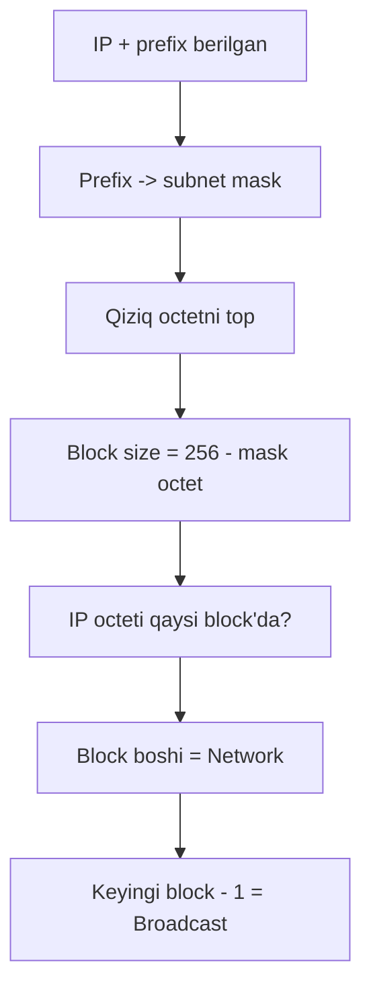
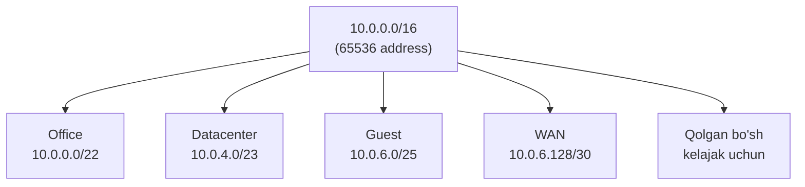

# Subnetting, CIDR va VLSM

## Muammo: bitta katta tarmoq -- ko'p muammo

Tasavvur qil: kompaniyada 1000 ta kompyuter, hammasi bitta katta tarmoqda
(`10.0.0.0/8` -- 16 million address). Nima bo'ladi?

- Bitta kompyuter **broadcast** yuborsa, 16 million manzil eshitadi (mumkin bo'lsa) -- tarmoq bo'g'iladi.
- Buxgalteriya va mehmon Wi-Fi bir tarmoqda -- **xavfsizlik** yo'q.
- Router jadvalida million yozuv -- sekin va noqulay.

Yechim: katta tarmoqni kichik bo'laklarga -- **subnet**larga ajratish.
Bu darsda subnet mask, CIDR va VLSM'ni qadam-baqadam hisoblab o'rganamiz.

## Analogiya: katta bino va xonalar

Katta ofis binosini tasavvur qil:

- **Butun bino** = katta IP block (masalan `192.168.1.0/24`).
- **Har qavat / bo'lim** = subnet.
- **Subnet mask** = binoni qavatlarga bo'ladigan "devor". Devorni qayerga
  qo'ysang, xonalar (host) soni shunga qarab o'zgaradi.

Devorni surganingda qavatlar soni va har qavatdagi xonalar soni o'zaro
teskari o'zgaradi: ko'proq subnet -> har subnetda kamroq host. Aynan subnet
mask shu balansni belgilaydi.

## Sodda ta'rif

> **Subnet mask** -- IP address'ni **network** va **host** qismiga ajratadigan
> 32 bitli niqob. `1` bitlar -- network, `0` bitlar -- host.
> **CIDR** (`/24`) -- shu maskning qisqa yozuvi.

```
IP:    192.168.48.68
Mask:  255.255.255.0     = 11111111.11111111.11111111.00000000
CIDR:  /24                              <---- network ----><-host->
```

`/24` -- birinchi 24 bit network, qolgan `32 - 24 = 8` bit host.

## Prefix va host bit bog'liqligi

IPv4 doim 32 bit. Prefix qancha katta bo'lsa, network qismi katta,
host qismi kichik:

```
Host bit = 32 - prefix
Jami address = 2^(host bit)
Usable host  = 2^(host bit) - 2
```

Nega `-2`? Har subnetda 2 ta address band:
- 1 ta **network address** (host bit hammasi 0) -- subnetning "nomi".
- 1 ta **broadcast address** (host bit hammasi 1) -- hammaga yuborish.

### Asosiy mask jadvali (yod ol)

| CIDR | Subnet mask | Host bit | Jami | Usable host |
|---|---|---:|---:|---:|
| /24 | 255.255.255.0 | 8 | 256 | 254 |
| /25 | 255.255.255.128 | 7 | 128 | 126 |
| /26 | 255.255.255.192 | 6 | 64 | 62 |
| /27 | 255.255.255.224 | 5 | 32 | 30 |
| /28 | 255.255.255.240 | 4 | 16 | 14 |
| /29 | 255.255.255.248 | 3 | 8 | 6 |
| /30 | 255.255.255.252 | 2 | 4 | 2 |
| /31 | 255.255.255.254 | 1 | 2 | 2 (point-to-point) |
| /32 | 255.255.255.255 | 0 | 1 | 1 (bitta host) |

Mask octet qiymatlari qayerdan? Ketma-ket `1`lar:

```
10000000 = 128    11111000 = 248
11000000 = 192    11111100 = 252
11100000 = 224    11111110 = 254
11110000 = 240    11111111 = 255
```

Shuning uchun mask octet'ida faqat shu qiymatlar uchraydi:
`0, 128, 192, 224, 240, 248, 252, 254, 255`.

## Block size usuli -- tez hisoblash siri

CCNA va real ishda binary yozib o'tirish sekin. Tezkor usul -- **block size**:

> **Block size = 256 - (qiziq octetdagi mask qiymati)**

**Qiziq octet** -- maskda `255` ham emas, `0` ham emas bo'lgan octet.
Subnetlar shu octetda block size qadam bilan yuradi.



## Worked example 1: `192.168.10.77/27`

Maqsad: network, broadcast va host range topish.

```
// --- 1-qadam: prefix -> mask ---
/27 = 255.255.255.224

// --- 2-qadam: qiziq octet ---
Oxirgi octet (224) qiziq octet

// --- 3-qadam: block size ---
256 - 224 = 32

// --- 4-qadam: subnetlar (32 qadam bilan) ---
0, 32, 64, 96, 128, 160, 192, 224

// --- 5-qadam: 77 qaysi block'da? ---
64 <= 77 < 96  ->  block boshi 64

// --- Natija ---
Network:   192.168.10.64
Broadcast: 192.168.10.95   (keyingi block 96, undan 1 kam)
Hosts:     192.168.10.65 - 192.168.10.94
Usable:    30 ta
```

## Worked example 2: `192.168.1.0/24` ni 4 ta subnet'ga bo'lish

Bu -- klassik interview savoli.

```
// --- 1-qadam: nechta bit qarz olamiz? ---
4 subnet uchun 2 bit kerak (2^2 = 4)
Yangi prefix: /24 + 2 = /26

// --- 2-qadam: mask va block size ---
/26 = 255.255.255.192
Block size = 256 - 192 = 64

// --- 3-qadam: 4 ta subnet ---
```

| Subnet | Network | First host | Last host | Broadcast |
|---|---|---|---|---|
| 1 | 192.168.1.0/26 | .1 | .62 | .63 |
| 2 | 192.168.1.64/26 | .65 | .126 | .127 |
| 3 | 192.168.1.128/26 | .129 | .190 | .191 |
| 4 | 192.168.1.192/26 | .193 | .254 | .255 |

## Worked example 3: qiziq octet 3-octetda (`195.158.49.164/23`)

Prefix `/24` dan kichik bo'lsa, qiziq octet 3-octetga ko'chadi -- yangi
o'rganuvchini eng ko'p adashtiradigan holat.

```
// --- 1-qadam: mask ---
/23 = 255.255.254.0

// --- 2-qadam: qiziq octet ---
3-octet (254) qiziq octet

// --- 3-qadam: block size ---
256 - 254 = 2

// --- 4-qadam: subnetlar 3-octetda 2 qadam bilan ---
..., 46, 48, 50, ...

// --- 5-qadam: 3-octet = 49, qaysi block'da? ---
48 <= 49 < 50  ->  block boshi 48

// --- Natija ---
Network:   195.158.48.0
Broadcast: 195.158.49.255   (keyingi block 50.0, undan 1 kam)
Hosts:     195.158.48.1 - 195.158.49.254
Usable:    2^9 - 2 = 510 ta
```

Diqqat: qiziq octet 3-octet bo'lsa, 4-octet **butunlay host qismi** --
network'da `0`, broadcast'da `255`.

## CIDR: nega classful'dan yaxshi?

**CIDR (Classless Inter-Domain Routing)** -- prefix'ni istalgan uzunlikda
(`/8` dan `/30` gacha) ishlatishga ruxsat beradi. 1993-yilda joriy etilib,
IPv4'ning umrini 30+ yilga uzaytirdi.

CIDR foydalari:
- **Address tejash** -- real ehtiyojga mos subnet.
- **Route summarization** -- ko'p mayda route'ni bitta prefix'ga yig'ish.
- **VLSM** -- turli subnetga turli mask.

### Route summarization (supernetting)

```
192.168.0.0/24
192.168.1.0/24
192.168.2.0/24
...
192.168.255.0/24
```

Bularning hammasini bitta yozuv qamrab oladi:

```
192.168.0.0/16   <- bitta summary route, 256 ta /24 o'rniga
```

Router jadvali uchun bu katta yutuq: 256 yozuv o'rniga 1 ta.

## VLSM: har segmentga o'z o'lchami

**VLSM (Variable Length Subnet Mask)** -- bitta block ichida turli subnetga
turli mask berish. Real loyihalarda majburiy, chunki segmentlar turli o'lchamda.

### Worked example: `10.0.0.0/16` ni VLSM bilan bo'lish

Talab:

| Segment | Kerakli host | Kerakli mask |
|---|---:|---|
| Office | 1000 | /22 (1022 host) |
| Datacenter | 500 | /23 (510 host) |
| Guest WiFi | 100 | /25 (126 host) |
| WAN link | 2 | /30 (2 host) |

Katta segmentdan boshlab joylashtiramiz (eng muhim qoida):

```
Office:     10.0.0.0/22    -> .0.0   - .3.255   (1022 host)
Datacenter: 10.0.4.0/23    -> .4.0   - .5.255   (510 host)
Guest:      10.0.6.0/25    -> .6.0   - .6.127   (126 host)
WAN:        10.0.6.128/30  -> .6.128 - .6.131   (2 host)
```



> **Oltin qoida:** VLSM'da doim **eng katta segmentdan** boshla va o'sishga
> joy qoldir. AWS/cloud amaliyotida bu "2x growth" qoidasi deyiladi.

## Power of 2 jadvali (hisoblash uchun)

| Bit | 2^n | Usable (2^n - 2) |
|---:|---:|---:|
| 2 | 4 | 2 |
| 3 | 8 | 6 |
| 4 | 16 | 14 |
| 5 | 32 | 30 |
| 6 | 64 | 62 |
| 7 | 128 | 126 |
| 8 | 256 | 254 |
| 9 | 512 | 510 |
| 10 | 1024 | 1022 |

## Wildcard mask (Cisco ACL / OSPF)

Cisco ACL va OSPF config'larida subnet mask emas, **wildcard mask** ishlatiladi.
U -- subnet maskning teskarisi:

> **Wildcard octet = 255 - subnet mask octet**

| CIDR | Subnet mask | Wildcard mask |
|---|---|---|
| /24 | 255.255.255.0 | 0.0.0.255 |
| /26 | 255.255.255.192 | 0.0.0.63 |
| /30 | 255.255.255.252 | 0.0.0.3 |
| /32 | 255.255.255.255 | 0.0.0.0 |

Misol:

```cisco
access-list 10 permit 192.168.1.0 0.0.0.255
# ma'nosi: 192.168.1.0/24 ga ruxsat ber
```

Wildcard'da `0` -- "aynan mos kelsin", `1` -- "farq qilishi mumkin".

## Zamonaviy kontekst: cloud VPC subnetting (2025)

Subnetting endi faqat CCNA emas -- **cloud** infratuzilmasining asosi.
AWS VPC amaliyotidan (2025) muhim qoidalar:

- VPC CIDR o'lchami `/16` dan `/28` gacha bo'lishi mumkin.
- Har subnet'da **birinchi 4 va oxirgi 1 address AWS tomonidan band** --
  ya'ni `256 - 5 = 251` usable (oddiy `-2` emas, `-5`).
- Yangi VPC'lar **dual-stack** (IPv4 + IPv6) bo'lishi tavsiya etiladi.
- EKS, PrivateLink kabi servislar IP'ni EC2 davridan tezroq "yeydi" --
  o'sishga ko'p joy qoldir.
- Subnetlar **overlap** qilmasligi shart -- aks holda VPC peering va VPN buziladi.

## Predict savoli

Sen `192.168.1.0/24` ni **8 ta** subnet'ga bo'lmoqchisan.

> Yangi prefix qanday bo'ladi va har subnet'da nechta usable host qoladi?

<details>
<summary>Javobni ko'rish</summary>

8 subnet uchun 3 bit kerak (2^3 = 8). Yangi prefix: `/24 + 3 = /27`.
Host bit = 32 - 27 = 5. Usable host = 2^5 - 2 = **30 ta**.
Block size = 256 - 224 = 32. Subnetlar: 0, 32, 64, 96, 128, 160, 192, 224.

</details>

## Ko'p uchraydigan xatolar

⚠️ **"Broadcast doim .255"** -- Yo'q. `/26` da broadcast .63/.127/.191/.255
bo'lishi mumkin. Broadcast mask'ga bog'liq.

⚠️ **"Network doim .0"** -- Yo'q. `/28` da network .0/.16/.32... bo'ladi.

⚠️ **"Usable = jami address"** -- Yo'q. Network va broadcast ni ayir (`-2`).
Cloud'da esa `-5` (AWS).

⚠️ **"Qiziq octetdan keyingi octetni unutish"** -- `/23` da 4-octet butunlay
host: network'da 0, broadcast'da 255.

⚠️ **"VLSM'da kichik segmentdan boshlash"** -- Katta segmentdan boshla,
aks holda joy yetmay qolishi mumkin.

## Xulosa

- Subnet mask IP'ni network + host qismga ajratadi; CIDR -- uning qisqa yozuvi.
- Host bit = 32 - prefix; usable = 2^(host bit) - 2.
- **Block size = 256 - mask octet** -- tez hisoblash siri.
- Qiziq octet `/24` dan kichik prefix'da 3-octetga ko'chadi.
- CIDR route summarization va VLSM'ga imkon beradi.
- VLSM'da doim eng katta segmentdan boshla, o'sishga joy qoldir.
- Cloud VPC'da subnet planning -- zamonaviy muhim ko'nikma.

## 🧠 Eslab qol

- Block size = 256 - mask octet.
- Usable host = 2^(host bit) - 2 (cloud'da -5).
- Broadcast va network mask'ga bog'liq, doim .255/.0 emas.
- VLSM: eng kattadan boshla.
- Wildcard = 255 - subnet mask octet.

## ✅ O'z-o'zini tekshir (retrieval practice)

**1. `172.16.35.90/20` ning network va broadcast address'i qanday?**

<details>
<summary>Javob</summary>

/20 = 255.255.240.0. Qiziq octet 3-octet. Block size = 256-240 = 16.
Subnetlar: ...16, 32, 48. 35 -> block 32 (32-47). Network: 172.16.32.0,
Broadcast: 172.16.47.255, Hosts: 172.16.32.1 - 172.16.47.254.

</details>

**2. Nega `/30` point-to-point link'lar uchun ideal?**

<details>
<summary>Javob</summary>

/30 = 4 address, 2 usable host. Router-router link'da aynan 2 ta interface
bor. Ko'proq address IP isrofi bo'lardi. (Yoki `/31` -- 2 address, ikkalasi
ham host, RFC 3021.)

</details>

**3. AWS'da subnet usable host `-2` emas `-5` -- nega?**

<details>
<summary>Javob</summary>

AWS har subnet'da 5 ta address band qiladi: network, VPC router, DNS,
kelajak reserved, va broadcast. Shuning uchun `/24` da 254 emas, 251 usable.

</details>

**4. `255.255.255.192` maskning wildcard mask'i qanday?**

<details>
<summary>Javob</summary>

Har octet: 255-255=0, 255-255=0, 255-255=0, 255-192=63. Wildcard = 0.0.0.63.

</details>

## 🛠 Amaliyot

**1. Oson (Modify).** Worked example 1'ni (`192.168.10.77/27`) `/28` ga o'zgartir.
Block size, network, broadcast va host range'ni qayta hisobla.

<details>
<summary>Hint</summary>

/28 = 255.255.255.240. Block size = 16. 77 -> block 64 (64-79). Network 64,
broadcast 79, hosts 65-78.

</details>

**2. O'rta (faded example).** VLSM rejasini to'ldir. `172.16.0.0/24` ni bo'l:

```
Sales:  60 host  -> mask /___, subnet 172.16.0.___/___    // TODO
IT:     28 host  -> mask /___, subnet 172.16.0.___/___    // TODO
WAN:    2 host   -> mask /___, subnet 172.16.0.___/___    // TODO
```

<details>
<summary>Hint</summary>

Sales 60 host -> /26 (62 host): 172.16.0.0/26. IT 28 -> /27 (30 host):
172.16.0.64/27. WAN 2 -> /30: 172.16.0.96/30. Katta segmentdan boshla.

</details>

**3. Qiyin (Make).** `ipcalc` yoki Python `ipaddress` bilan tekshir:

```python
import ipaddress
net = ipaddress.ip_network('192.168.1.0/24')
for sub in net.subnets(prefixlen_diff=3):   # 8 ta /27
    print(sub, sub.broadcast_address, sub.num_addresses - 2)
```

Chiqishni qo'lda hisoblagan block size usuli bilan solishtir.

## 🔁 Takrorlash

- **Bog'liq oldingi mavzular:** [02-ip-addressing.md](02-ip-addressing.md)
  (binary, octet). Binary tushunmasa, subnetting qiyin bo'ladi.
- **Keyingi qadam:** [04-network-broadcast-host-range.md](04-network-broadcast-host-range.md)
  -- turli mask'larda network/broadcast topishni chuqurlashtiramiz.
- **Takrorlash jadvali:** ertaga -> 3 kundan keyin -> 1 haftadan keyin
  har kuni 3 ta yangi subnetting misolini qo'lda yech.
- **Feynman testi:** "Subnet mask nima qiladi va nega VLSM kerak?" -- bino va
  xonalar analogiyasi bilan tushuntir.

## 📚 Manbalar

- Kurose & Ross, "Computer Networking", Bob 4.3 (IP addressing, CIDR)
- [RFC 4632 -- CIDR](https://www.rfc-editor.org/rfc/rfc4632)
- [RFC 1918 -- Private Address Space](https://www.rfc-editor.org/rfc/rfc1918)
- [RFC 3021 -- /31 prefix](https://www.rfc-editor.org/rfc/rfc3021)
- [AWS Subnet CIDR blocks (docs)](https://docs.aws.amazon.com/vpc/latest/userguide/subnet-sizing.html)
- [AWS VPC & IP Address Secrets 2025 (Medium)](https://medium.com/@ismailkovvuru/aws-vpc-ip-address-secrets-what-every-engineer-must-know-in-2025-8166818d3589)
- [Cloudflare -- What is CIDR](https://www.cloudflare.com/learning/network-layer/what-is-cidr/)
