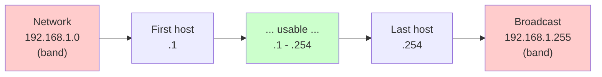
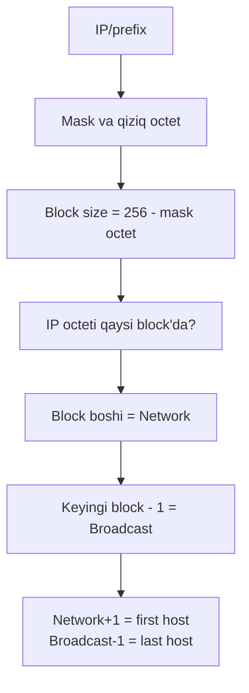
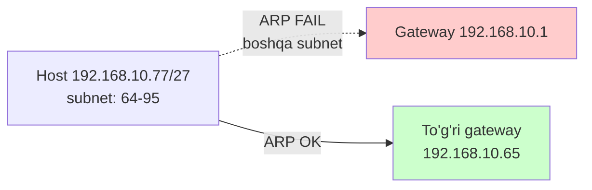

# Network, broadcast va host range topish

## Muammo: gateway to'g'rimi yoki noto'g'ri?

Senga topshiriq berildi:

```
Host:    192.168.10.77/27
Gateway: 192.168.10.1
```

Savol: bu host internetga chiqa oladimi?

Javob berish uchun host **qaysi subnet** ichida ekanini bilishing kerak.
Agar gateway shu subnet'da bo'lmasa, host unga **ARP** qila olmaydi va
internetga chiqa olmaydi. Bu -- eng ko'p uchraydigan real muammo.

Bu darsda IP + prefix'dan **network**, **broadcast** va **host range**'ni
ikki usulda -- binary (aniq) va block size (tez) -- topishni mustahkamlaymiz.

## Analogiya: ko'cha va uy raqamlari

Bir ko'chani tasavvur qil:

- **Network address** = ko'chaning **boshi** (raqamlash nol uydan boshlanadi) --
  ko'chaning "nomi". Hech kim bu manzilda yashamaydi.
- **Broadcast address** = ko'chaning **oxiri** -- "hamma uylarga" e'lon
  tarqatish manzili. Bu ham hech kimga tegishli emas.
- **Host range** = oradagi **real uylar** -- odamlar shu yerda yashaydi.

Ko'chaning boshi va oxiri band, oradagilar bo'sh. IP subnet ham xuddi shunday.

## Sodda ta'rif

> Har subnetda 3 asosiy tushuncha: **network address** (host bit hammasi `0`),
> **broadcast address** (host bit hammasi `1`), va oradagi **usable host range**.

```
192.168.1.0/24
Network:    192.168.1.0     (host bit: 00000000)
First host: 192.168.1.1
Last host:  192.168.1.254
Broadcast:  192.168.1.255   (host bit: 11111111)
Usable:     254 ta
```



## Usul 1: Binary (AND operatsiyasi) -- aniq

Kompyuter network address'ni **AND** operatsiyasi bilan topadi:

> **Network address = IP AND subnet mask**

AND qoidasi (ikkalasi ham `1` bo'lsagina `1`):

| Bit A | Bit B | A AND B |
|---|---|---|
| 0 | 0 | 0 |
| 0 | 1 | 0 |
| 1 | 0 | 0 |
| 1 | 1 | 1 |

### Worked example: `195.158.49.164/23` (binary usul)

```
// --- 1-qadam: IP'ni binary'ga ---
195      158      49       164
11000011.10011110.00110001.10100100

// --- 2-qadam: mask'ni binary'ga ---
/23 = 255.255.254.0
11111111.11111111.11111110.00000000

// --- 3-qadam: AND -> network ---
IP:      11000011.10011110.00110001.10100100
Mask:    11111111.11111111.11111110.00000000
AND:     11000011.10011110.00110000.00000000
         = 195.158.48.0

// --- 4-qadam: host bit hammasi 1 -> broadcast ---
Network qismi:  11000011.10011110.0011000
Host bit -> 1:  ...1.11111111
Broadcast:      11000011.10011110.00110001.11111111
                = 195.158.49.255
```

Natija:

```
IP:        195.158.49.164/23
Network:   195.158.48.0
Broadcast: 195.158.49.255
Hosts:     195.158.48.1 - 195.158.49.254
Usable:    2^9 - 2 = 510
```

Diqqatli bo'l: `164 = 10100100`, `132 = 10000100` -- bitta bit farqi
butun natijani o'zgartiradi. Binary'da xato qilma.

### Broadcast'ni OR bilan ham topsa bo'ladi

> **Broadcast = network OR wildcard mask**

```
Network:   195.158.48.0
Wildcard:  0.0.1.255       (255.255.254.0 ning teskarisi)
OR:        195.158.49.255
```

## Usul 2: Block size -- tez

Binary sekin. Imtihon va real ishda **block size** tezroq (03-darsdan eslaysan):

> **Block size = 256 - qiziq octetdagi mask qiymati**



## Ko'p misolli mashq (turli mask'lar)

Har birini o'zing yopib, keyin ochib tekshir. Bu -- CCNA'ning eng ko'p
so'raladigan mavzusi.

### /25 -- `192.168.1.130/25`

```
Mask: 255.255.255.128,  Block size = 256-128 = 128
Subnetlar: 0, 128
130 -> block 128 (128-255)
Network:   192.168.1.128
Broadcast: 192.168.1.255
Hosts:     192.168.1.129 - 192.168.1.254
```

### /26 -- `192.168.1.70/26`

```
Mask: 255.255.255.192,  Block size = 64
Subnetlar: 0, 64, 128, 192
70 -> block 64 (64-127)
Network:   192.168.1.64
Broadcast: 192.168.1.127     <- .255 EMAS
Hosts:     192.168.1.65 - 192.168.1.126
```

### /28 -- `192.168.5.146/28`

```
Mask: 255.255.255.240,  Block size = 16
Subnetlar: 0,16,32,48,64,80,96,112,128,144,160,...
146 -> block 144 (144-159)
Network:   192.168.5.144    <- .0 EMAS
Broadcast: 192.168.5.159
Hosts:     192.168.5.145 - 192.168.5.158
```

### /30 -- `192.168.5.18/30`

```
Mask: 255.255.255.252,  Block size = 4
Subnetlar: 0,4,8,12,16,20,...
18 -> block 16 (16-19)
Network:   192.168.5.16
Broadcast: 192.168.5.19
Hosts:     192.168.5.17 - 192.168.5.18     <- faqat 2 ta host
```

### /22 -- `172.16.100.200/22` (qiziq octet 3-octet)

```
Mask: 255.255.252.0,  Qiziq octet 3-octet,  Block size = 256-252 = 4
3-octet subnetlar: ...92, 96, 100, 104...
100 -> block 100 (100-103)
Network:   172.16.100.0
Broadcast: 172.16.103.255    <- 4-octet butunlay host
Hosts:     172.16.100.1 - 172.16.103.254
```

### /21 -- `10.14.5.200/21`

```
Mask: 255.255.248.0,  Block size = 256-248 = 8
3-octet subnetlar: 0, 8, 16, 24...
3-octet = 5 -> block 0 (0-7)
Network:   10.14.0.0
Broadcast: 10.14.7.255
Hosts:     10.14.0.1 - 10.14.7.254
```

## Prefix -> mask -> block size (tezkor jadval)

| CIDR | Subnet mask | Qiziq octet | Block size |
|---|---|---:|---:|
| /20 | 255.255.240.0 | 3 | 16 |
| /21 | 255.255.248.0 | 3 | 8 |
| /22 | 255.255.252.0 | 3 | 4 |
| /23 | 255.255.254.0 | 3 | 2 |
| /25 | 255.255.255.128 | 4 | 128 |
| /26 | 255.255.255.192 | 4 | 64 |
| /27 | 255.255.255.224 | 4 | 32 |
| /28 | 255.255.255.240 | 4 | 16 |
| /29 | 255.255.255.248 | 4 | 8 |
| /30 | 255.255.255.252 | 4 | 4 |

## Amaliy foyda: gateway to'g'rimi?

Darsning boshidagi savolga qaytamiz:

```
Host:    192.168.10.77/27
Gateway: 192.168.10.1
```

```
// --- Host subnetini top ---
/27 = 255.255.255.224,  Block size = 32
77 -> block 64 (64-95)
Network:   192.168.10.64
Broadcast: 192.168.10.95
Hosts:     192.168.10.65 - 192.168.10.94

// --- Gateway shu range'dami? ---
192.168.10.1  ->  64-95 oralig'ida EMAS
```

**Xulosa: gateway noto'g'ri.** Host `192.168.10.1` ni boshqa subnet deb
biladi, unga ARP qila olmaydi. To'g'ri gateway `192.168.10.65 - .94`
oralig'ida bo'lishi kerak.



## /31 va /32 istisnolari

Oddiy formula `usable = 2^host_bit - 2`. Lekin ikkita istisno:

- **/31** -- point-to-point link'da 2 address, **ikkalasi ham host**
  (network/broadcast ajratilmaydi, RFC 3021). Router-router uchun.
- **/32** -- bitta aniq IP. Host route, loopback yoki firewall qoidasida.

## Predict savoli

`192.168.1.64/26` host'ga berilishi mumkinmi?

<details>
<summary>Javobni ko'rish</summary>

Yo'q. /26 mask, block size 64, subnetlar 0/64/128/192. `192.168.1.64` --
bu subnet'ning **boshi**, ya'ni **network address**. Host'ga berilmaydi.
Xuddi shunday `192.168.1.127` -- bu subnetning broadcast'i, u ham berilmaydi.
Host range: 192.168.1.65 - 192.168.1.126.

</details>

## Ko'p uchraydigan xatolar

⚠️ **"Broadcast har doim .255"** -- Yo'q. `/26` da .63/.127/.191/.255.
Mask'ga bog'liq.

⚠️ **"Network har doim .0"** -- Yo'q. `/28` da .144 network bo'lishi mumkin.

⚠️ **"Qiziq octetdan keyingi octetni unutish"** -- `/23`, `/22` da 4-octet
butunlay host: network'da 0, broadcast'da 255.

⚠️ **"IP'ga qarab /24 deb o'ylash"** -- Prefix ko'rsatilmasa, subnet
chegarasini aytib bo'lmaydi.

⚠️ **"Binary'da bitta bit xatosi"** -- `164` va `132` ni chalkashtirsang,
butun natija noto'g'ri. Vaznlarni diqqat bilan qo'sh.

## Xulosa

- Network = host bit hammasi 0; broadcast = host bit hammasi 1.
- Binary usul: Network = IP AND mask; Broadcast = network OR wildcard.
- Block size usul: 256 - mask octet -> subnetlar -> IP qaysi block'da.
- Qiziq octet `/24` dan kichik prefix'da 3-octetga ko'chadi; keyingi octet host.
- Gateway host bilan bir subnetda bo'lishi shart (aks holda ARP fail).
- /31 va /32 -- maxsus holatlar (2 host / 1 host).

## 🧠 Eslab qol

- Network = subnet boshi (band), Broadcast = subnet oxiri (band).
- Block size = 256 - mask octet.
- Broadcast = keyingi block - 1.
- Gateway host subnet'ida bo'lmasa -> internet yo'q.
- Qiziq octetdan keyin -> hammasi host.

## ✅ O'z-o'zini tekshir (retrieval practice)

**1. `10.10.14.99/21` -- network va broadcast?**

<details>
<summary>Javob</summary>

/21 = 255.255.248.0. Block size = 8. 3-octet=14 -> block 8 (8-15).
Network: 10.10.8.0, Broadcast: 10.10.15.255, Hosts: 10.10.8.1 - 10.10.15.254.

</details>

**2. Nega `192.168.1.191/26` host'ga berilmaydi?**

<details>
<summary>Javob</summary>

/26 block size 64, subnetlar 128-191. `.191` -- 128-191 subnetining
oxirgi address'i = broadcast. Broadcast host'ga berilmaydi.

</details>

**3. Binary'da `IP AND mask` nima beradi va nega?**

<details>
<summary>Javob</summary>

Network address'ni beradi. AND faqat mask'da `1` bo'lgan (network) bitlarni
saqlaydi, host bitlarni (mask'da 0) nolga tushiradi -- bu aynan host bit
hammasi 0 bo'lgan network address'ning ta'rifi.

</details>

**4. `172.20.44.10/22` ning 4-octeti network va broadcast'da qanday bo'ladi?**

<details>
<summary>Javob</summary>

Qiziq octet 3-octet, 4-octet butunlay host. Network'da 4-octet = 0
(172.20.44.0), broadcast'da 4-octet = 255 (172.20.47.255).

</details>

## 🛠 Amaliyot

**1. Oson (Modify).** `192.168.1.70/26` misolini `/27` ga o'zgartir va
network/broadcast/host range'ni qayta hisobla.

<details>
<summary>Hint</summary>

/27 block size 32. 70 -> block 64 (64-95). Network 64, broadcast 95, hosts 65-94.

</details>

**2. O'rta (faded example).** Quyidagilarni yech:

```
1. 192.168.1.200/26   Network: ___  Broadcast: ___  Hosts: ___   // TODO
2. 172.20.44.10/22    Network: ___  Broadcast: ___  Hosts: ___   // TODO
3. 192.168.50.33/27   Network: ___  Broadcast: ___  Hosts: ___   // TODO
```

<details>
<summary>Hint (javoblar)</summary>

1. Net 192.168.1.192, Bcast 192.168.1.255, Hosts .193-.254.
2. Net 172.20.44.0, Bcast 172.20.47.255, Hosts .44.1-.47.254.
3. Net 192.168.50.32, Bcast 192.168.50.63, Hosts .33-.62.

</details>

**3. Qiyin (Make).** `195.158.49.164/23` ni **faqat binary AND/OR** usuli
bilan (block size'siz) yech. Keyin `ipcalc 195.158.49.164/23` bilan solishtir.

## 🔁 Takrorlash

- **Bog'liq oldingi mavzular:** [02-ip-addressing.md](02-ip-addressing.md) (binary),
  [03-subnetting-cidr-vlsm.md](03-subnetting-cidr-vlsm.md) (block size, mask jadvali).
- **Keyingi qadam:** [05-address-types-classful-classless.md](05-address-types-classful-classless.md)
  -- endi address turlarini (public/private/special) o'rganamiz.
- **Takrorlash jadvali:** ertaga -> 3 kundan keyin -> 1 haftadan keyin
  har kuni 5 ta yangi IP/prefix uchun network+broadcast top (qo'lda).
- **Feynman testi:** "Network va broadcast address nima va nega ular host'ga
  berilmaydi?" -- ko'cha analogiyasi bilan tushuntir.

## 📚 Manbalar

- Kurose & Ross, "Computer Networking", Bob 4.3
- [RFC 4632 -- CIDR](https://www.rfc-editor.org/rfc/rfc4632)
- [RFC 3021 -- /31 for point-to-point](https://www.rfc-editor.org/rfc/rfc3021)
- [Subnet Calculator](https://www.subnet-calculator.com/)
- [Cloudflare -- What is CIDR](https://www.cloudflare.com/learning/network-layer/what-is-cidr/)
