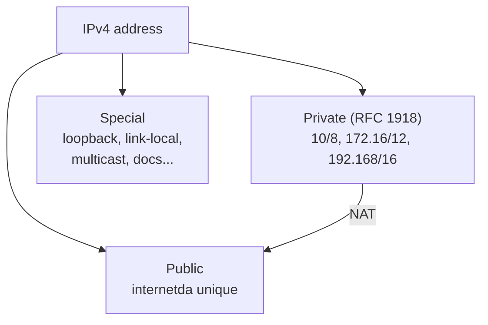
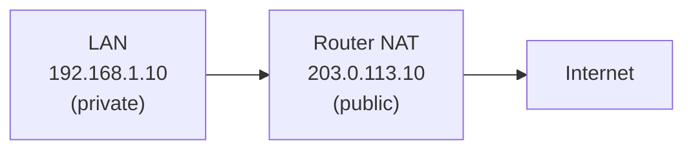
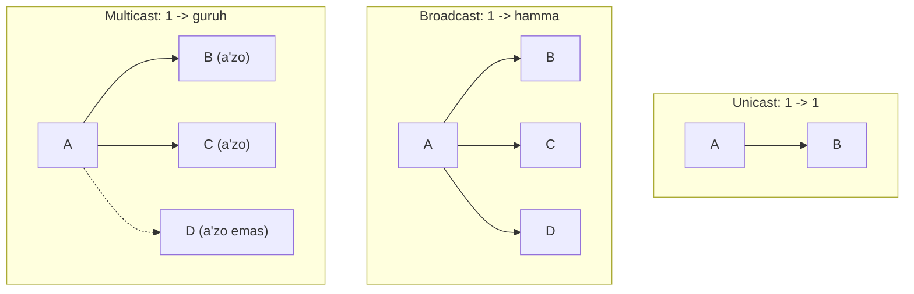
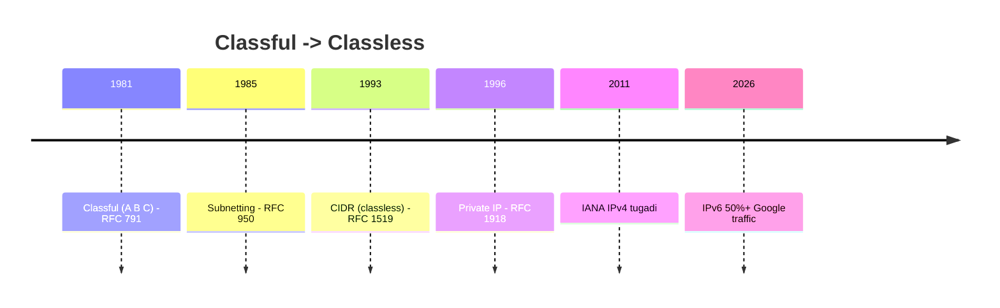

# Address turlari: public, private, special va classful tarix

## Muammo: 4 milliard address hammaga yetmaydi

Dunyoda 8 milliarddan ortiq odam, o'nlab milliard qurilma. IPv4 esa
faqat ~4.3 milliard address beradi. Matematik jihatdan hammaga public
address yetmaydi.

Yechim ikki qismdan iborat:
1. **Private address'lar** -- uy va ofis ichida qayta-qayta ishlatiladi
   (Toshkentdagi `192.168.1.1` va Tokiodagi `192.168.1.1` -- ikkalasi mavjud).
2. **NAT** -- ko'p private host bitta public IP orqali internetga chiqadi.

Bu darsda address'ning **qiymatiga qarab** turini aniqlashni o'rganamiz --
bu troubleshooting uchun juda muhim ko'nikma.

## Analogiya: ichki telefon va shahar raqami

Katta ofisni tasavvur qil:

- **Ichki telefon raqami** (masalan `101`, `102`) -- faqat ofis ichida ishlaydi.
  Har ofisda `101` bor -- ular bir-biriga xalaqit bermaydi. Bu **private IP**.
- **Shahar raqami** (`+998 71 ...`) -- butun dunyoda unique, tashqaridan
  qo'ng'iroq qilsa bo'ladi. Bu **public IP**.
- **Kotib** ichki raqamni tashqi qo'ng'iroqqa ulaydi. Bu **NAT**.

Farqi: telefonda ichki raqamni tashqaridan tera olmaysan; NAT'da esa
port forwarding orqali ba'zan mumkin (07-NAT darsida ko'ramiz).

## Sodda ta'rif

> **Public IP** -- internetda global unique va routable.
> **Private IP** -- faqat lokal tarmoqda, internetda route qilinmaydi (RFC 1918).
> **Special IP** -- maxsus maqsad uchun band (loopback, link-local, multicast...).



## Private address'lar (RFC 1918)

Uch bloklardan iborat -- yod olsa arziydi:

| Range | CIDR | Odatda qayerda |
|---|---|---|
| 10.0.0.0 - 10.255.255.255 | 10.0.0.0/8 | enterprise, datacenter, VPN |
| 172.16.0.0 - 172.31.255.255 | 172.16.0.0/12 | enterprise, Docker |
| 192.168.0.0 - 192.168.255.255 | 192.168.0.0/16 | uy routerlari, kichik LAN |

Bu IP'lar internetda **route qilinmaydi**. Internetga chiqish uchun NAT kerak.



> **Nega minglab uy `192.168.1.1` ishlata oladi?** Chunki private IP lokal.
> Har uy o'z "orolida" -- bir-birini ko'rmaydi. NAT ularni bitta public
> IP ortiga yashiradi.

## Special (maxsus) address'lar

Bu address'lar oddiy host'ga **berilmaydi**:

| Address / range | Nomi | Ma'nosi |
|---|---|---|
| 0.0.0.0 | Unspecified | "Hali address yo'q" / "hamma interface" |
| 0.0.0.0/0 | Default route | "Hamma destination" |
| 127.0.0.0/8 | Loopback | Localhost, o'ziga murojaat (`127.0.0.1`) |
| 169.254.0.0/16 | Link-local / APIPA | DHCP ishlamasa avtomatik |
| 100.64.0.0/10 | CGNAT | ISP ichki shared range (RFC 6598) |
| 224.0.0.0/4 | Multicast | Guruhga yuborish |
| 240.0.0.0/4 | Reserved | Class E, kelajak/eksperiment |
| 192.0.2.0/24 | Documentation | Misol/hujjat uchun (TEST-NET-1) |
| 198.51.100.0/24 | Documentation | TEST-NET-2 |
| 203.0.113.0/24 | Documentation | TEST-NET-3 |
| 255.255.255.255 | Limited broadcast | Lokal segmentdagi hammaga |

### Loopback: `127.0.0.1`

```bash
ping 127.0.0.1
```

Bu packet network kartaga **chiqmaydi** -- OS ichida loopback orqali qaytadi.
Nima uchun kerak? Lokal servisni test qilish, TCP/IP stack ishlayotganini
tekshirish, serverni tashqi tarmoqsiz ishga tushirish.

### Link-local / APIPA: `169.254.x.x`

Kompyuterda `169.254.32.10` ko'rsang -- bu odatda **DHCP serverdan address
olinmaganini** bildiradi. Diagnostika signali: DHCP tirikmi, kabel ulanganmi?

### Documentation range'lar

`192.0.2.0/24`, `198.51.100.0/24`, `203.0.113.0/24` -- real config uchun
emas, **misol va hujjatlar** uchun. Shu sabab bu darslarda public IP misoli
kerak bo'lsa, aynan shu range ishlatiladi.

### CGNAT: `100.64.0.0/10` (zamonaviy)

ISP darajasidagi NAT uchun maxsus range (RFC 6598). Uy router NAT qiladi,
keyin ISP yana NAT qiladi -- **double NAT**.

> **Zamonaviy kontekst (2025):** IPv4 taqchilligi tufayli **CGNAT** juda
> keng tarqaldi. 2025-yilda dunyodagi Tier-1 ISP'larning **68%**dan ko'prog'i
> qandaydir katta ko'lamli NAT ishlatgan. CGNAT bozori 2025'da $3.8 milliard.
> Comcast, BT kabi yirik ISP'lar buni ishlatadi. Bu port forwarding va P2P'ni
> qiyinlashtiradi (07-NAT darsida ko'ramiz).

## Traffic turlari: unicast, broadcast, multicast, anycast

Address turi trafik yo'nalishini ham belgilaydi:



- **Unicast** -- bitta source, bitta destination. Web, SSH, DNS, ping.
- **Broadcast** -- subnetdagi hammaga. Limited (`255.255.255.255`) yoki
  directed (`192.168.1.255`). Router'dan o'tmaydi. DHCP Discover buni ishlatadi.
- **Multicast** -- guruhga a'zo host'larga (`224.0.0.0/4`). IPTV, OSPF
  (`224.0.0.5`), RIPv2 (`224.0.0.9`). IGMP boshqaradi.
- **Anycast** -- bir xil IP ko'p joyda e'lon qilinadi, client eng yaqiniga
  boradi. Public DNS (8.8.8.8), CDN, global load balancing.

## Classful tarix: nega hozir ishlatilmaydi

Boshida (1981) IPv4 **classful** model bilan ishlagan -- address'ning birinchi
octeti class'ni va mask'ni belgilagan:

| Class | Range | Default mask | Maqsad |
|---|---|---|---|
| A | 1.0.0.0 - 126.255.255.255 | /8 | Juda katta network |
| B | 128.0.0.0 - 191.255.255.255 | /16 | O'rta network |
| C | 192.0.0.0 - 223.255.255.255 | /24 | Kichik network |
| D | 224.0.0.0 - 239.255.255.255 | mask yo'q | Multicast |
| E | 240.0.0.0 - 255.255.255.255 | mask yo'q | Reserved |

(`127.x.x.x` Class A jadvalidan chiqarilgan -- loopback uchun band.)

### Classful'ning muammosi

Class'lar real ehtiyojga mos kelmadi:

```
Tashkilotga 2000 host kerak.
Class C (/24) = 254 host   -> yetmaydi
Class B (/16) = 65534 host -> juda ortiqcha (63000+ isrof!)
```

Natijada millionlab address isrof bo'ldi, router jadvallari shishdi.
Shu sabab 1993'da **CIDR** (classless) paydo bo'ldi -- endi mask istalgan prefix.



> **Oltin qoida:** Zamonaviy tarmoqda class'ga qarab mask taxmin qilma.
> `10.10.10.0/24`, `192.168.0.0/16` -- bular default class mask'iga mos
> kelmaydi, lekin normal classless subnetlar.

## Public IP taqchilligi va IPv6

IPv4 public address'lar 2011'da IANA'da tugadi. Bu bugun ham katta muammo:
2026'da bitta IPv4 ~$25-52. Aynan shu narx bosimi va CGNAT muammolari
**IPv6**'ni oldinga suryapti (08-darsda batafsil). IPv6'da address shu qadar
ko'pki, NAT umuman kerak emas.

## Predict savoli

Kompyuteringda `169.254.15.20` address'ini ko'rding.

> Internetga chiqa olasanmi? Muammo qayerda?

<details>
<summary>Javobni ko'rish</summary>

Yo'q, internetga chiqa olmaysan. `169.254.x.x` -- **link-local (APIPA)**.
Bu odatda **DHCP serverdan address olinmaganini** bildiradi -- kompyuter
o'ziga avtomatik link-local address qo'yib olgan. Bu address faqat lokal
link ichida ishlaydi, route qilinmaydi. Tekshir: DHCP server tirikmi,
kabel/Wi-Fi ulanganmi, MAC filter yo'qmi?

</details>

## Ko'p uchraydigan xatolar

⚠️ **"192.168.1.10 internetda unique"** -- Yo'q. Bu private, minglab tarmoqda
bor. Internetga NAT orqali chiqadi.

⚠️ **"10.x.x.x doim /8"** -- Yo'q, bu classful fikrlash. `10.10.10.0/24` ham normal.

⚠️ **"127.0.0.1 tarmoqqa chiqadi"** -- Yo'q. Loopback OS ichida qaytadi,
network kartaga bormaydi.

⚠️ **"NAT xavfsizlik beradi"** -- NAT firewall emas, u faqat address
translation. Xavfsizlik alohida (08-security modulida).

⚠️ **"Public IP misolida real IP ishlatish"** -- Hujjatda `192.0.2.0/24`,
`203.0.113.0/24` documentation range'ini ishlat.

## Xulosa

- Public IP -- global unique; Private IP -- lokal (RFC 1918: 10/8, 172.16/12, 192.168/16).
- Special IP'lar band: loopback (127/8), link-local (169.254/16), multicast (224/4)...
- `169.254.x.x` -> DHCP ishlamagan signali.
- Traffic turlari: unicast, broadcast, multicast, anycast.
- Classful (A/B/C) -- tarixiy; hozir classless (CIDR) ishlatiladi.
- CGNAT 2025'da keng tarqaldi (Tier-1 ISP 68%+) -- IPv4 taqchilligi tufayli.

## 🧠 Eslab qol

- Private: 10/8, 172.16/12, 192.168/16. Internetga NAT bilan.
- 127.0.0.1 = loopback (OS ichida).
- 169.254.x.x = DHCP fail.
- Class'ga qarab mask taxmin qilma (classless).
- NAT != firewall.

## ✅ O'z-o'zini tekshir (retrieval practice)

**1. `172.20.5.10` public'mi yoki private?**

<details>
<summary>Javob</summary>

Private. `172.16.0.0/12` = 172.16.0.0 - 172.31.255.255. `172.20.5.10` shu
oralig'ida. Internetga NAT orqali chiqadi.

</details>

**2. Nega DHCP Discover broadcast ishlatadi, unicast emas?**

<details>
<summary>Javob</summary>

Client hali o'z IP'sini va DHCP server IP'sini bilmaydi. Kimga so'rov
yuborishni bilmagani uchun `255.255.255.255` (limited broadcast) bilan
"kim menga address bera oladi?" deb hammaga so'raydi.

</details>

**3. Class B tarmog'i (65534 host) kichik ofisga nega isrof edi?**

<details>
<summary>Javob</summary>

Kichik ofisga masalan 200 host kerak, lekin Class B 65534 beradi.
~65000 address ishlatilmay qoladi. Classful bunday moslashuvchan
taqsimlashni imkonsiz qildi -- CIDR/VLSM shuni yechdi.

</details>

**4. `8.8.8.8` bir vaqtda ko'p serverda bo'lishi mumkinmi? Qanday?**

<details>
<summary>Javob</summary>

Ha -- **anycast** orqali. Bir xil IP dunyoning ko'p joyida e'lon qilinadi,
routing har client'ni eng yaqin serverga yo'naltiradi. Google DNS aynan shunday ishlaydi.

</details>

## 🛠 Amaliyot

**1. Oson (Modify).** O'z IP'ingni ko'r (`ip a` / `ipconfig`). Bu public'mi
yoki private? RFC 1918 range'lariga solishtir. Keyin `curl ifconfig.me` bilan
public IP'ingni topib, ikkisini solishtir -- farqli bo'lsa, sen NAT ortidasan.

**2. O'rta (faded example).** Har address'ni turini belgila:

```
203.0.113.5   -> ___   // TODO (documentation? public?)
192.168.0.1   -> ___   // TODO
127.0.0.1     -> ___   // TODO
224.0.0.5     -> ___   // TODO
100.64.1.1    -> ___   // TODO
```

<details>
<summary>Hint (javoblar)</summary>

203.0.113.5 = documentation (TEST-NET-3). 192.168.0.1 = private.
127.0.0.1 = loopback. 224.0.0.5 = multicast (OSPF). 100.64.1.1 = CGNAT.

</details>

**3. Qiyin (Make).** ISP'ing CGNAT ishlatyaptimi tekshir: router WAN IP'ini
(router admin panelida) `curl ifconfig.me` natijasi bilan solishtir. Router
WAN IP `100.64.x.x` bo'lsa yoki ikkisi farq qilsa -- sen CGNAT ortidasan.

## 🔁 Takrorlash

- **Bog'liq oldingi mavzular:** [02-ip-addressing.md](02-ip-addressing.md),
  [03-subnetting-cidr-vlsm.md](03-subnetting-cidr-vlsm.md) (CIDR classless).
- **Keyingi qadam:** [06-arp-va-default-gateway.md](06-arp-va-default-gateway.md)
  -- private host qanday qilib gateway orqali internetga chiqadi.
- **Takrorlash jadvali:** ertaga -> 3 kundan keyin -> 1 haftadan keyin
  RFC 1918 va special range'larni xotiradan yozib chiq.
- **Feynman testi:** "Public va private IP farqi nima va nega NAT kerak?" --
  ichki telefon analogiyasi bilan tushuntir.

## 📚 Manbalar

- [RFC 1918 -- Private Address Space](https://www.rfc-editor.org/rfc/rfc1918)
- [RFC 6598 -- CGNAT Shared Address Space](https://www.rfc-editor.org/rfc/rfc6598)
- [RFC 5737 -- Documentation Address Ranges](https://www.rfc-editor.org/rfc/rfc5737)
- [IANA IPv4 Special-Purpose Registry](https://www.iana.org/assignments/iana-ipv4-special-registry/)
- [Carrier-grade NAT (Wikipedia)](https://en.wikipedia.org/wiki/Carrier-grade_NAT)
- [Top ISPs Using CGNAT (PureVPN)](https://www.purevpn.com/blog/top-isps-using-cgnat/)
- [Understanding CGNAT 2026 (SystemTek)](https://www.systemtek.co.uk/2026/01/understanding-carrier-grade-nat-cgnat/)
