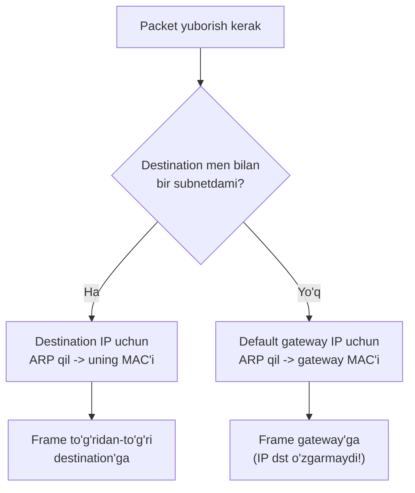
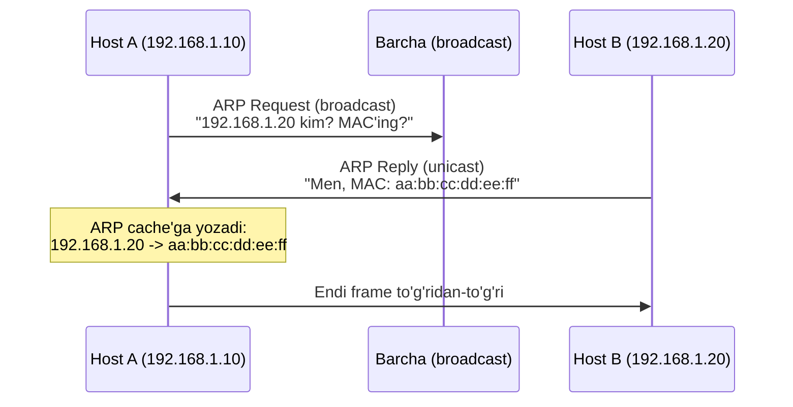
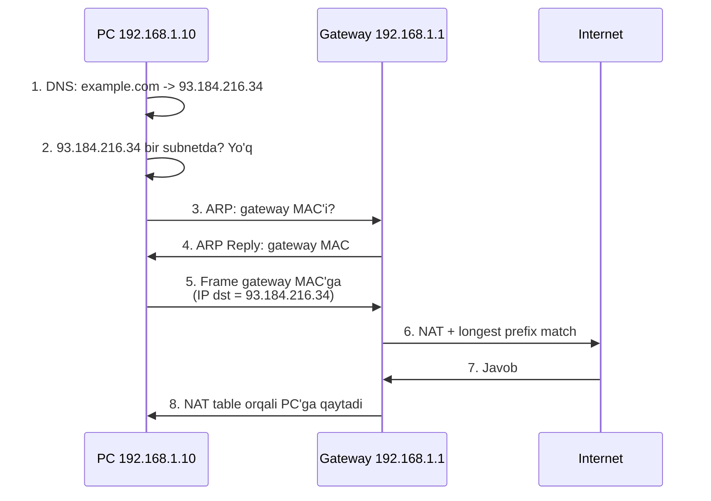
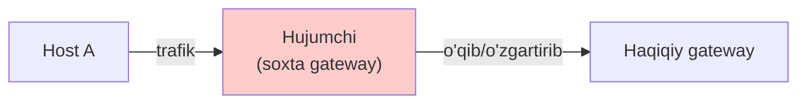

# ARP va default gateway

## Muammo: IP bor, lekin frame kimga ketadi?

Sen `192.168.1.20` ga packet yubormoqchisan. IP address'ni bilasan.
Lekin packet fizik simda **Ethernet frame** ichida ketadi, frame esa
**MAC address** talab qiladi -- IP emas.

Savol: `192.168.1.20` ning MAC address'i qaysi?

Kompyuter buni oldindan bilmaydi. Kimdir IP'ni MAC'ga "tarjima" qilishi kerak.
Bu ishni **ARP** qiladi. Va agar destination boshqa tarmoqda bo'lsa,
packet **default gateway**ga ketishi kerak. Bu darsda ikkalasini bog'laymiz.

## Analogiya: ism va uy raqami

Bir binoni tasavvur qil:

- **IP address** = odamning **ismi** ("Ali").
- **MAC address** = uning **xonasi raqami** ("305-xona").

Ali'ga xat berish uchun xona raqamini bilishing kerak. Sen dahlizda
baqirasan: "Ali kim? Xonang qaysi?" (bu -- **ARP so'rov**). Ali javob beradi:
"Men 305-xonadaman" (bu -- **ARP javob**). Endi xatni to'g'ri xonaga tashlaysan.

Farqi: bu "baqirish" faqat shu bino (lokal segment) ichida eshitiladi.
Boshqa binodagi odamga xat berish uchun **qorovul** (default gateway) orqali
yuborasan -- unga ismini emas, "tashqi pochta" belgisini berasan.

## Sodda ta'rif

> **ARP (Address Resolution Protocol)** -- lokal tarmoqda IP address'ni
> MAC address'ga aylantiradigan protokol.
> **Default gateway** -- host boshqa tarmoqqa chiqishi uchun ishlatadigan
> router interface'i.

## Birinchi savol: same subnet yoki different subnet?

Har packet yuborishdan oldin host bitta savol beradi:

> "Destination men bilan **bir subnetdami**?"



- **Bir subnetda** -> destination IP'ning MAC'i uchun ARP, frame to'g'ridan-to'g'ri.
- **Boshqa subnetda** -> **gateway MAC'i** uchun ARP, frame gateway'ga ketadi.
  Muhim: IP destination baribir asl destination bo'lib qoladi, faqat MAC
  gateway'niki bo'ladi.

Host qanday hal qiladi? IP AND mask bilan (04-darsdan): agar destination
network address host'niki bilan bir xil bo'lsa -- bir subnet.

## ARP jarayoni: so'rov va javob



Muhim nuqtalar:

- ARP Request **broadcast** (hammaga), ARP Reply **unicast** (faqat so'raganga).
- ARP faqat **lokal broadcast domain** ichida ishlaydi.
- Router ARP broadcast'ni boshqa subnetga **o'tkazmaydi**.
- Natija **ARP cache**'ga yoziladi, keyingi safar so'rash kerak emas.

### ARP cache'ni ko'rish

```bash
ip neigh          # Linux (zamonaviy)
arp -n            # Linux/macOS (eski)
arp -a            # Windows
```

Namuna:

```
192.168.1.1  dev eth0 lladdr 9c:c9:eb:1a:2b:3c REACHABLE
192.168.1.20 dev eth0 lladdr a4:5e:60:11:22:33 STALE
```

## Default gateway: tashqi dunyoga eshik

**Default gateway** -- "lokal subnet'da bo'lmagan hamma packet shu yerga"
degan router. Routing table'da `default` yoki `0.0.0.0/0` ko'rinadi.

```bash
ip route
```

```
default via 192.168.1.1 dev wlan0
192.168.1.0/24 dev wlan0 proto kernel scope link src 192.168.1.10
```

Ma'nosi:
- `192.168.1.0/24` ichidagilarga to'g'ridan-to'g'ri.
- Boshqa hamma address gateway `192.168.1.1` orqali.

### Nega gateway host bilan bir subnetda bo'lishi SHART?

Host gateway'ga frame yuborish uchun avval **gateway MAC**'ini topishi kerak.
MAC'ni ARP topadi, ARP esa faqat **lokal segment** ichida ishlaydi.

```
Noto'g'ri:
  Host: 192.168.1.10/24
  Gateway: 192.168.2.1    <- boshqa subnet!

Host 192.168.2.1 ni "tashqarida" deb biladi, unga ARP QILA OLMAYDI.
```

```
To'g'ri:
  Host: 192.168.1.10/24
  Gateway: 192.168.1.1    <- bir subnet
```

Bu -- 04-darsdagi "gateway to'g'rimi?" savolining sababi.

## Notional machine: to'liq packet yo'li

`PC (192.168.1.10)` dan `example.com` ga so'rov. Aynan nima sodir bo'ladi:



Diqqat: 5-qadamda **IP destination = 93.184.216.34** (asl server), lekin
**MAC destination = gateway** MAC'i. IP end-to-end, MAC lokal -- 02-darsdagi farq.

## ARP turlari (qisqacha)

- **Standard ARP** -- yuqorida ko'rilgan so'rov/javob.
- **Gratuitous ARP** -- host o'z IP'sini hech kim so'ramasdan e'lon qiladi.
  Maqsad: IP conflict'ni aniqlash, ARP cache'larni yangilash (masalan failover'da).
- **Proxy ARP** -- router boshqa host o'rniga javob beradi (eski texnika).

## Xavfsizlik: ARP spoofing (2025 tahdidi)

ARP'ning katta zaifligi bor: u **autentifikatsiyasiz**. Har kim "men
192.168.1.1man" deb yolg'on ARP Reply yuborishi mumkin. Bu **ARP spoofing
(cache poisoning)** deyiladi.



Hujumchi o'zini gateway deb ko'rsatib, barcha trafikni o'zi orqali o'tkazadi
(**man-in-the-middle**).

> **Zamonaviy himoya (2025):** **Dynamic ARP Inspection (DAI)** -- switch
> darajasida ARP packetlarni tekshiradi, DHCP snooping bazasidagi IP-MAC
> bog'lanishga mos kelmaganini tashlaydi. Qo'shimcha: **IP Source Guard**,
> monitoring, va zero-trust yondashuv. 2025 amaliyoti qatlamli himoyani
> tavsiya qiladi: avval passiv monitoring, keyin avtomatik ogohlantirish,
> so'ng switch'da DAI.

## Predict savoli

```
Host A: 192.168.1.10/24
Host B: 192.168.1.20/24
```

Host A, Host B ga packet yuboradi.

> Bu jarayonda router (gateway) ishtirok etadimi? ARP kimning MAC'ini so'raydi?

<details>
<summary>Javobni ko'rish</summary>

Router ishtirok **etmaydi**. Host A va Host B bir subnetda (`192.168.1.0/24`).
Host A to'g'ridan-to'g'ri **Host B ning IP'si (192.168.1.20)** uchun ARP
qiladi va frame'ni to'g'ridan-to'g'ri Host B ga yuboradi. Gateway faqat
**boshqa** subnetga chiqishda kerak bo'ladi.

</details>

## Ko'p uchraydigan xatolar

⚠️ **"ARP router orqali o'tadi"** -- Yo'q. ARP faqat lokal broadcast domain
ichida. Router ARP'ni boshqa subnetga o'tkazmaydi.

⚠️ **"Boshqa subnetdagi host'ning MAC'i uchun ARP qilaman"** -- Yo'q. Boshqa
subnet uchun **gateway** MAC'i uchun ARP qilinadi.

⚠️ **"Gateway istalgan IP bo'lishi mumkin"** -- Yo'q. Gateway host bilan
bir subnetda bo'lishi SHART (ARP ishlashi uchun).

⚠️ **"Boshqa subnetga ketganda IP destination gateway bo'ladi"** -- Yo'q.
IP destination asl server bo'lib qoladi, faqat MAC gateway'niki.

⚠️ **"ARP xavfsiz"** -- Yo'q. ARP autentifikatsiyasiz, spoofing'ga zaif.
DAI kabi himoya kerak.

## Xulosa

- ARP IP address'ni MAC address'ga aylantiradi (lokal segmentda).
- Host avval "destination bir subnetdami?" deb so'raydi.
- Bir subnetda -> destination IP MAC'i; boshqa subnetda -> gateway MAC'i.
- ARP Request broadcast, ARP Reply unicast; natija ARP cache'ga yoziladi.
- Default gateway host bilan bir subnetda bo'lishi SHART (ARP uchun).
- Boshqa subnetga ketganda IP dst o'zgarmaydi, faqat MAC gateway'niki.
- ARP spoofing tahdidi bor; himoya -- DAI, IP Source Guard (2025).

## 🧠 Eslab qol

- ARP: IP -> MAC (faqat lokal).
- Boshqa subnet -> gateway MAC'i uchun ARP.
- Gateway host subnet'ida bo'lishi shart.
- IP end-to-end, MAC har hop'da almashadi.
- ARP autentifikatsiyasiz -> spoofing xavfi -> DAI.

## ✅ O'z-o'zini tekshir (retrieval practice)

**1. Nega ARP Request broadcast, lekin ARP Reply unicast?**

<details>
<summary>Javob</summary>

Request'da so'rovchi destination MAC'ni bilmaydi -- shuning uchun hammaga
(broadcast) so'raydi. Reply'da esa javob beruvchi so'rovchining MAC'ini
allaqachon biladi (Request ichida bor), shuning uchun to'g'ridan-to'g'ri
unicast javob beradi.

</details>

**2. Host `192.168.1.10/24`, gateway `192.168.2.1`. Nima ishlamaydi va nega?**

<details>
<summary>Javob</summary>

Gateway boshqa subnetda (`192.168.2.0/24`). Host uni "tashqarida" deb biladi
va ARP qila olmaydi -> gateway MAC'ini topa olmaydi -> internetga chiqa olmaydi.
Gateway host bilan bir subnetda (`192.168.1.x`) bo'lishi kerak.

</details>

**3. Boshqa subnetdagi serverga packet ketganda IP va MAC destination nima?**

<details>
<summary>Javob</summary>

IP destination = asl server IP'si (o'zgarmaydi, end-to-end). MAC destination
= default gateway MAC'i (lokal, har hop'da almashadi). Host serverning
MAC'ini bilmaydi va bilishi ham kerak emas.

</details>

**4. ARP spoofing qanday ishlaydi va DAI uni qanday to'xtatadi?**

<details>
<summary>Javob</summary>

Hujumchi soxta ARP Reply yuborib "men gateway'man" deydi, trafikni o'zi
orqali o'tkazadi (MITM). DAI switch'da ARP packetlarni DHCP snooping
bazasidagi IP-MAC bog'lanishga solishtiradi; mos kelmasa -- tashlaydi.

</details>

## 🛠 Amaliyot

**1. Oson (Modify).** ARP cache'ingni ko'r:

```bash
ip neigh    # yoki: arp -a
```

Gateway (`ip route | grep default`) MAC'ini top. Keyin biror lokal host'ga
ping qil va ARP cache'ga yangi yozuv qo'shilganini kuzat.

**2. O'rta (faded example).** Packet yo'li mantiqini to'ldir:

```
Host 10.0.0.5/24, dst 8.8.8.8
1. 8.8.8.8 bir subnetdami? ___          // TODO
2. ARP kimning MAC'ini so'raydi? ___    // TODO
3. Frame MAC destination = ___          // TODO
4. IP destination = ___                 // TODO
```

<details>
<summary>Hint</summary>

1. Yo'q (8.8.8.8 tashqarida). 2. Default gateway (10.0.0.1) MAC'ini.
3. Gateway MAC'i. 4. 8.8.8.8 (o'zgarmaydi).

</details>

**3. Qiyin (Make).** `tcpdump -i any arp` ishga tushir, boshqa terminalda
yangi host'ga ping qil. ARP Request va Reply'ni capture'da top va
kim-kimga (broadcast/unicast) yuborganini tahlil qil.

## 🔁 Takrorlash

- **Bog'liq oldingi mavzular:** [02-ip-addressing.md](02-ip-addressing.md)
  (IP vs MAC), [04-network-broadcast-host-range.md](04-network-broadcast-host-range.md)
  (subnet aniqlash), [05-address-types-classful-classless.md](05-address-types-classful-classless.md).
- **Keyingi qadam:** [07-nat.md](07-nat.md) -- gateway internetga chiqishda
  NAT nima qiladi.
- **Takrorlash jadvali:** ertaga -> 3 kundan keyin -> 1 haftadan keyin
  "same subnet vs different subnet" qarorini xotiradan tushuntir.
- **Feynman testi:** "ARP nima qiladi va nega gateway host bilan bir subnetda
  bo'lishi kerak?" -- ism va xona raqami analogiyasi bilan tushuntir.

## 📚 Manbalar

- [RFC 826 -- Address Resolution Protocol](https://www.rfc-editor.org/rfc/rfc826)
- Kurose & Ross, "Computer Networking", Bob 6 (Link Layer, ARP)
- [What is ARP Spoofing (Security Boulevard, 2025)](https://securityboulevard.com/2025/12/what-is-arp-spoofing-detect-and-prevent-arp-cache-poisoning-attacks/)
- [Dynamic ARP Inspection (Teamwin)](https://teamwin.in/dynamic-arp-inspection-mitigating-arp-spoofing/)
- [How to Prevent ARP Poisoning with DAI (OneUptime)](https://oneuptime.com/blog/post/2026-03-20-prevent-arp-poisoning-dai/view)
