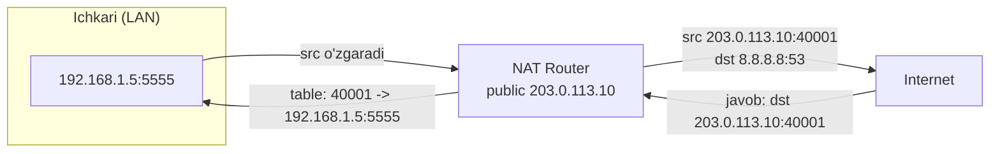
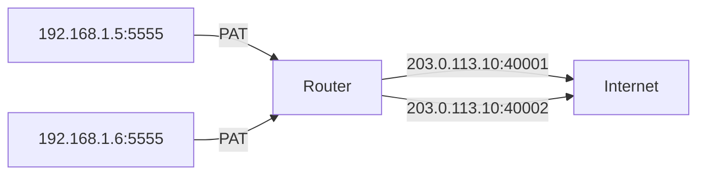
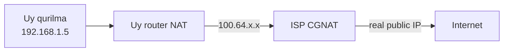

# NAT (Network Address Translation)

## Muammo: bitta public IP, o'nlab qurilma

Uyingda 15 ta qurilma bor: telefonlar, noutbuklar, TV, smart soat.
Lekin ISP senga faqat **bitta public IP** beradi (yoki hatto CGNAT ortida
umuman public IP bermaydi).

Savol: 15 ta qurilma bitta public IP bilan qanday internetga chiqadi?

Har biriga alohida public IP olsang -- IPv4 tugab qolgan (2026'da bittasi
$25-52). Yechim: **NAT** -- 15 ta private IP'ni bitta public IP ortiga
"yashirish". Bu darsda NAT ichkarida aynan nima qilishini ochamiz.

## Analogiya: mehmonxona kotibi

Katta mehmonxonani tasavvur qil:

- **Xonalar** = private IP'lar (`192.168.1.10`, `192.168.1.11`...). Ular
  faqat mehmonxona ichida ma'lum.
- **Mehmonxonaning bitta shahar telefon raqami** = public IP (`203.0.113.10`).
- **Kotib (registratura)** = NAT router. Chiquvchi qo'ng'iroqlarni shahar
  raqami orqali chiqaradi, kiruvchi javoblarni to'g'ri xonaga ulaydi.

Kotib **jadval** yuritadi: "5-xona hozir A raqamga qo'ng'iroq qildi".
Javob kelganda kotib jadvalga qarab 5-xonaga ulaydi. Bu jadval -- NAT'ning
**translation table**'i.

Farqi: tashqaridan to'g'ridan-to'g'ri xonaga qo'ng'iroq qila olmaysan
(kotib bilmaydi qaysi xona) -- shu sabab kiruvchi ulanishlar NAT'da muammo.

## Sodda ta'rif

> **NAT (Network Address Translation)** -- packet header'idagi IP address'ni
> (va ko'pincha port'ni) boshqasiga o'zgartiradigan mexanizm. Eng ko'p:
> private IP -> public IP (internetga chiqish uchun).

## NAT ichkarida nima qiladi (notional machine)



Chiqishda: `src 192.168.1.5:5555` -> `src 203.0.113.10:40001`.
Kirishda (javob): `dst 203.0.113.10:40001` -> `dst 192.168.1.5:5555`.

**Translation table** -- NAT'ning yuragi:

| Private tomon | Public tomon |
|---|---|
| 192.168.1.5:5555 | 203.0.113.10:40001 |
| 192.168.1.6:5555 | 203.0.113.10:40002 |

Diqqat: ikki host bir xil port (5555) ishlatsa ham, NAT ularni turli public
port (40001, 40002) bilan ajratadi. Aynan shu **PAT**.

## NAT turlari

### 1. Static NAT -- doimiy 1:1

Bitta private IP <-> bitta public IP, doimiy bog'lanish. Serverni tashqaridan
ko'rsatish uchun.

```cisco
ip nat inside source static 192.168.1.50 203.0.113.50
```

### 2. Dynamic NAT -- pooldan vaqtincha

Private host'lar public IP **pool**'idan vaqtincha address oladi. Bitta
public IP bir vaqtda bitta host'ga.

```cisco
access-list 20 permit 192.168.10.0 0.0.0.255
ip nat pool PUBLIC_POOL 203.0.113.10 203.0.113.20 netmask 255.255.255.0
ip nat inside source list 20 pool PUBLIC_POOL
```

### 3. PAT / NAT Overload -- ko'p host, bitta IP (eng keng tarqalgan)

Ko'p private host bitta public IP orqali chiqadi, **port raqami** bilan
ajratiladi. Uy router'lar aynan shuni ishlatadi.

```cisco
access-list 10 permit 192.168.1.0 0.0.0.255
ip nat inside source list 10 interface gigabitEthernet0/1 overload
```



### Taqqoslash jadvali

| Tur | Bog'lanish | Public IP soni | Foydalanish |
|---|---|---|---|
| Static | 1:1 doimiy | ko'p | Serverni tashqariga ochish |
| Dynamic | pooldan vaqtincha | pool | Enterprise, cheklangan pool |
| PAT | ko'p:1 port bilan | 1 | Uy, kichik ofis (eng keng) |

## SNAT va DNAT yo'nalishlari

- **SNAT (Source NAT)** -- chiquvchi trafik. Uy internetga chiqganda
  `192.168.1.5` -> `203.0.113.10`. (PAT -- SNAT'ning turi.)
- **DNAT (Destination NAT) / Port forwarding** -- kiruvchi trafik.
  Tashqaridan `203.0.113.10:80` -> ichki `192.168.1.100:8080`.

```cisco
# Port forwarding: public 8080 -> ichki web server 80
ip nat inside source static tcp 192.168.1.50 80 203.0.113.2 8080
```

Tashqaridan ulanish:

```bash
ssh -p 2222 admin@203.0.113.2
```

## Cisco NAT interface rollari

NAT ishlashi uchun interface'larga **rol** beriladi:

```cisco
interface gigabitEthernet0/0
 description LAN
 ip address 192.168.1.1 255.255.255.0
 ip nat inside

interface gigabitEthernet0/1
 description ISP
 ip address 203.0.113.2 255.255.255.252
 ip nat outside
```

Va default route kerak:

```cisco
ip route 0.0.0.0 0.0.0.0 203.0.113.1
```

Tekshiruv:

```cisco
show ip nat translations
show ip nat statistics
```

Namuna:

```
Pro  Inside global      Inside local        Outside global
tcp  203.0.113.2:49152  192.168.1.10:49152  198.51.100.5:443
```

## CGNAT: NAT ustiga NAT (zamonaviy)

IPv4 shu qadar tugab qoldiki, ISP'lar endi senga public IP ham bermaydi --
ular **CGNAT (Carrier-Grade NAT)** ishlatadi. Uy router NAT qiladi (private ->
`100.64.x.x`), keyin ISP yana NAT qiladi (`100.64.x.x` -> real public).



> **Zamonaviy kontekst (2025-2026):** 2025'da Tier-1 ISP'larning **68%**dan
> ko'prog'i katta ko'lamli NAT ishlatgan. CGNAT bozori 2025'da $3.8 milliard,
> 2034'ga $9.1 milliardga o'sishi kutilmoqda. Comcast, BT kabi yiriklar buni
> ishlatadi. **Double NAT** muammolari: port forwarding ishlamaydi, P2P/o'yin
> qiyin, ba'zi ilovalar buziladi.

## NAT muammolari va NAT traversal

NAT chiquvchi trafik uchun ajoyib, lekin **kiruvchi** ulanishlar (P2P, VoIP,
WebRTC, o'yin serveri) uchun muammo -- tashqi host ichki host'ga to'g'ridan
ulana olmaydi.

Yechimlar:
- **STUN** -- server orqali o'z public IP/port'ini topish.
- **TURN** -- STUN ishlamasa, relay server orqali (sekin, qimmat).
- **ICE** -- STUN + TURN + host candidate'larni birlashtirib eng yaxshisini tanlash.
- **UDP hole punching** -- ikkala tomon bir vaqtda outbound yuborib, NAT
  mapping'ni ochib qo'yish.
- **Port forwarding / UPnP** -- routerda qo'lda yoki avtomatik mapping.

## Muhim: NAT firewall EMAS

Ko'p odam "NAT meni himoya qiladi" deb o'ylaydi -- bu xato.

> **Oltin qoida:** NAT faqat address translation. Xavfsizlik stateful
> connection tracking (default-deny inbound)dan keladi, NAT'ning o'zidan emas.

NAT kiruvchi ulanishni bloklaydi -- lekin bu himoya emas, "yon ta'sir".
Haqiqiy himoya -- firewall (08-security modulida). IPv6'da NAT umuman yo'q,
shuning uchun firewall yanada muhim.

## Predict savoli

Uyingda ikkita kompyuter bir vaqtda `google.com:443` ga ulanmoqchi.
Ikkalasi ham source port sifatida `54321` ishlatdi.

> NAT ularni qanday farqlaydi? Trafik chalkashib ketmaydimi?

<details>
<summary>Javobni ko'rish</summary>

Chalkashmaydi -- bu aynan **PAT** ishlaydigan joy. NAT har host uchun turli
**public source port** beradi:
- `192.168.1.5:54321` -> `203.0.113.10:40001`
- `192.168.1.6:54321` -> `203.0.113.10:40002`

Google javob berganda `40001` -> 1-host, `40002` -> 2-host. Translation
table (public port -> private IP:port) orqali NAT to'g'ri host'ga qaytaradi.

</details>

## Ko'p uchraydigan xatolar

⚠️ **"NAT = firewall"** -- Yo'q. NAT address translation, firewall xavfsizlik
policy. Alohida narsalar.

⚠️ **"NAT routingni almashtiradi"** -- Yo'q. NAT address'ni o'zgartiradi,
packet qayerga borishini routing hal qiladi.

⚠️ **"inside va outside rollarini almashtirib qo'yish"** -- Cisco'da eng ko'p
xato. LAN = inside, ISP = outside.

⚠️ **"Port forwarding hamma vaqt ishlaydi"** -- CGNAT ortida ishlamaydi
(sening router'ing public IP'da emas).

⚠️ **"PAT va NAT boshqa-boshqa narsa"** -- PAT -- NAT'ning turi (port bilan overload).

## Xulosa

- NAT packet header'idagi IP (va port)'ni o'zgartiradi: private -> public.
- Translation table chiquvchi va kiruvchi trafikni bog'laydi.
- Turlari: Static (1:1), Dynamic (pool), PAT (ko'p:1 port bilan -- eng keng).
- SNAT -- chiquvchi, DNAT/port forwarding -- kiruvchi.
- CGNAT -- ISP darajasidagi NAT (2025'da 68%+ Tier-1); double NAT muammolar.
- Kiruvchi ulanishlar uchun NAT traversal (STUN/TURN/ICE) kerak.
- NAT firewall EMAS -- xavfsizlik alohida.

## 🧠 Eslab qol

- NAT: private IP -> public IP (+ port).
- PAT: ko'p host, bitta IP, port bilan ajratiladi.
- SNAT chiquvchi, DNAT kiruvchi.
- CGNAT = NAT ustiga NAT (ISP).
- NAT != firewall.

## ✅ O'z-o'zini tekshir (retrieval practice)

**1. Nega PAT bitta public IP bilan minglab host'ni chiqara oladi?**

<details>
<summary>Javob</summary>

Har ulanishni **port raqami** bilan ajratadi. Bitta public IP'da ~64000
port bor. NAT har chiquvchi ulanishga unique public source port beradi va
translation table'da (public port -> private IP:port) saqlaydi.

</details>

**2. Nega CGNAT ortida port forwarding ishlamaydi?**

<details>
<summary>Javob</summary>

CGNAT'da sening router'ing **public IP'da emas** -- u ISP'ning shared
`100.64.x.x` range'ida. Real public IP ISP'ning CGNAT qurilmasida, uni sen
boshqara olmaysan. Shuning uchun tashqaridan sening router'ingga to'g'ridan
ulanib bo'lmaydi.

</details>

**3. Static NAT va PAT qachon ishlatiladi?**

<details>
<summary>Javob</summary>

Static NAT -- serverni tashqaridan doimiy ko'rsatish uchun (1:1 doimiy
bog'lanish, masalan web server). PAT -- ko'p ichki host'ni bitta public IP
orqali chiqarish uchun (uy/ofis, chiquvchi trafik).

</details>

**4. Nega "NAT meni himoya qiladi" degan fikr xato?**

<details>
<summary>Javob</summary>

NAT faqat address o'zgartiradi. Kiruvchi ulanishni bloklashi -- yon ta'sir,
maqsad emas. Haqiqiy himoya stateful firewall (default-deny inbound)dan
keladi. IPv6'da NAT yo'q, lekin firewall bo'lsa xavfsizlik bor.

</details>

## 🛠 Amaliyot

**1. Oson (Modify).** O'z NAT'ingni "ko'r":

```bash
ip a                 # private IP (192.168.x.x)
curl ifconfig.me     # public IP (NAT'dan keyingi)
```

Ikkisi farq qilsa -- sen NAT ortidasan. Ikkovini yozib qo'y.

**2. O'rta (faded example).** Cisco PAT config'ini to'ldir:

```cisco
access-list 10 permit 192.168.1.0 0.0.0.255
interface g0/0
 ip nat ____                              // TODO (inside/outside?)
interface g0/1
 ip nat ____                              // TODO
ip nat inside source list 10 interface g0/1 ____   // TODO (overload?)
```

<details>
<summary>Hint</summary>

g0/0 (LAN) = `ip nat inside`. g0/1 (ISP) = `ip nat outside`. Oxirida `overload`
(PAT uchun).

</details>

**3. Qiyin (Make).** Uyda ikkita qurilmadan bir vaqtda bir saytga ulan.
Router admin panelida (yoki `conntrack -L` Linux router'da) NAT translation
jadvalini top -- ikki host turli public port olganini ko'r.

## 🔁 Takrorlash

- **Bog'liq oldingi mavzular:** [05-address-types-classful-classless.md](05-address-types-classful-classless.md)
  (private IP, CGNAT range), [06-arp-va-default-gateway.md](06-arp-va-default-gateway.md)
  (gateway internetga eshik).
- **Keyingi qadam:** [08-ipv6-addressing-ndp.md](08-ipv6-addressing-ndp.md) --
  IPv6 NAT'ni umuman keraksiz qiladi.
- **Takrorlash jadvali:** ertaga -> 3 kundan keyin -> 1 haftadan keyin
  NAT translation table mantiqini xotiradan chizib chiq.
- **Feynman testi:** "NAT nima qiladi va nega bitta public IP yetadi?" --
  mehmonxona kotibi analogiyasi bilan tushuntir.

## 📚 Manbalar

- [RFC 3022 -- Traditional NAT](https://www.rfc-editor.org/rfc/rfc3022)
- [RFC 6598 -- CGNAT Shared Address Space](https://www.rfc-editor.org/rfc/rfc6598)
- [RFC 5389 -- STUN](https://www.rfc-editor.org/rfc/rfc5389)
- [Carrier-grade NAT (Wikipedia)](https://en.wikipedia.org/wiki/Carrier-grade_NAT)
- [What is CGNAT (A10 Networks)](https://www.a10networks.com/glossary/what-is-carrier-grade-nat-cgn-cgnat/)
- [How to Detect If You Are Behind CGNAT (OneUptime, 2026)](https://oneuptime.com/blog/post/2026-03-20-detect-cgnat/view)
- [Carrier-Grade NAT Market Report (Dataintelo)](https://dataintelo.com/report/carrier-grade-nat-market)
