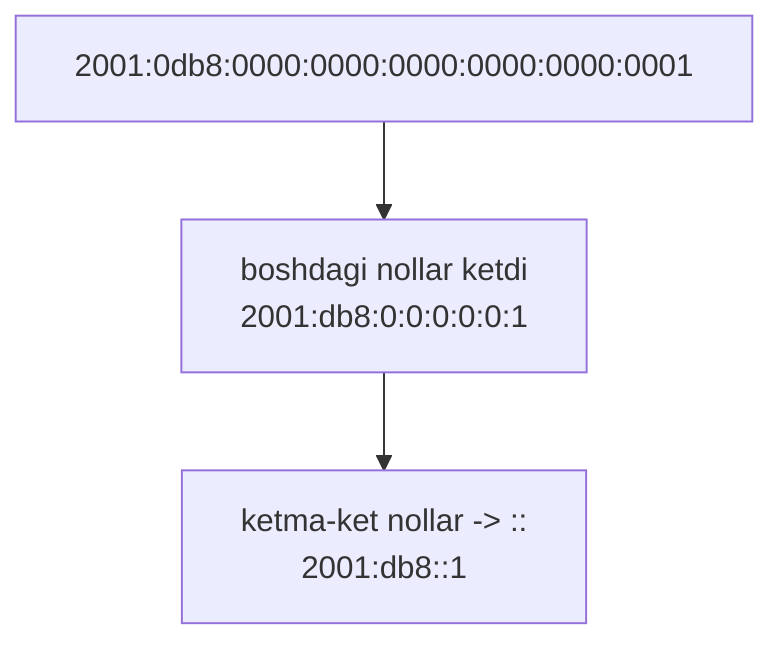
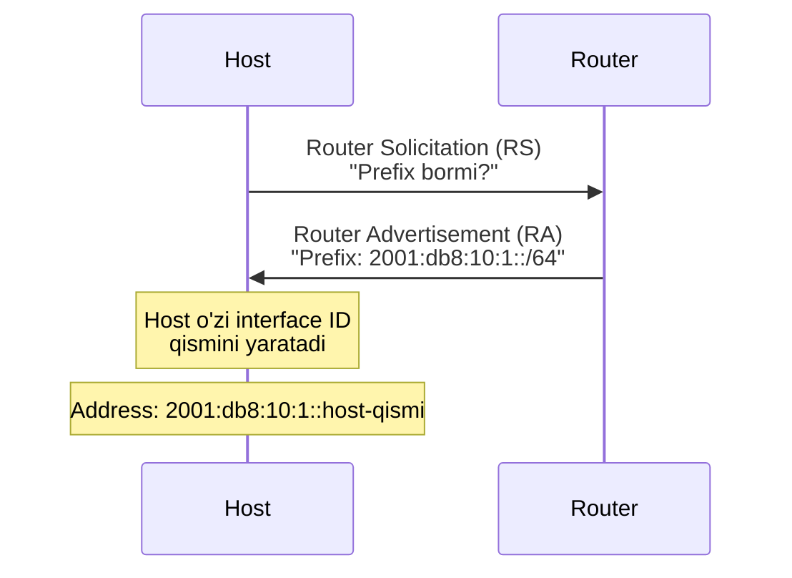
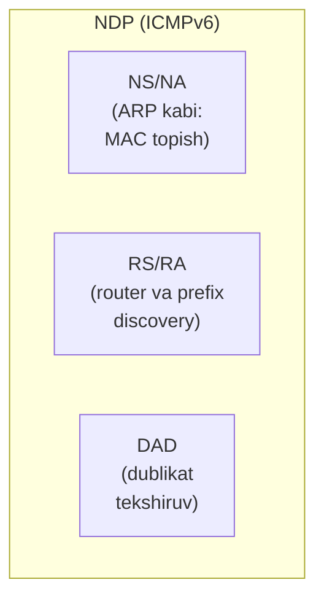
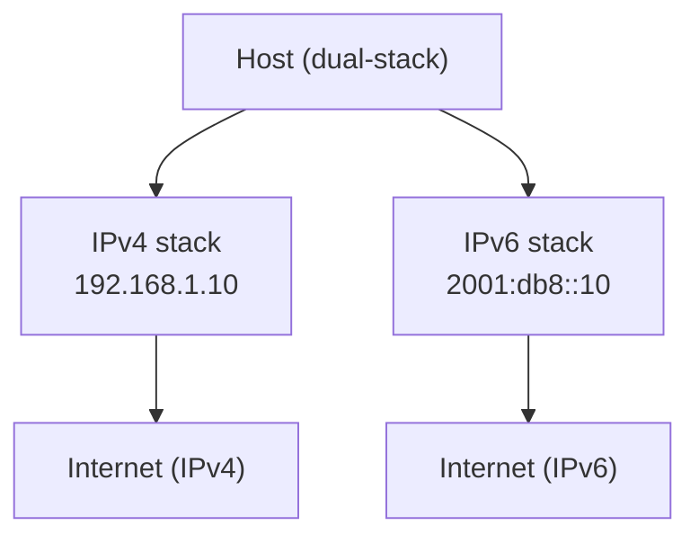

# IPv6 addressing, SLAAC va NDP

## Muammo: IPv4 tugadi, endi nima?

Oldingi darslardan bilamiz: IPv4 -- 32 bit, ~4.3 milliard address, ular
2011'da tugagan. NAT va CGNAT bu muammoni **yashiradi**, lekin yechmaydi:
port forwarding buziladi, P2P qiyin, har qurilma o'z manziliga ega emas.

Yechim -- **IPv6**: 128 bit address. Bu shu qadar ko'pki, Yer yuzidagi
har bir qum donasiga ham address yetadi. NAT umuman kerak emas.

> **Zamonaviy holat (2026):** 2026-yil mart oyida Google trafigining IPv6
> ulushi birinchi marta **50%**dan oshdi (50.1%). APNIC o'lchovi ~42-43%.
> Yetakchilar: Fransiya (73%), Hindiston (72%), Saudiya Arabistoni (65%).
> Orqada qolganlar: Italiya (17%), Ispaniya (10%). Mobil operatorlar IPv6'ni
> tez joriy qilmoqda -- telefonlar ko'pincha uy internetidan oldin IPv6'da.

## Analogiya: telefon raqamlaridan email'ga

IPv4'dan IPv6'ga o'tish -- qisqa telefon raqamlaridan cheksiz email
manzillariga o'tishga o'xshaydi:

- **IPv4** = 6 xonali telefon raqami. Cheklangan, tugab qoladi, hamma
  ulashishga majbur (NAT).
- **IPv6** = email manzillari. Deyarli cheksiz, har kimga o'ziniki yetadi,
  ulashish kerak emas.

Farqi: email harflardan iborat, IPv6 esa hex raqamlar va `:` -- lekin g'oya
bir xil: "shunchalik ko'pki, tejashga hojat yo'q".

## Sodda ta'rif

> **IPv6 address** -- **128 bitli** manzil. Sakkizta guruh, har biri 16-bit
> hex, `:` bilan ajratiladi. Misol: `2001:0db8:85a3:0000:0000:8a2e:0370:7334`.

Address soni: `2^128` = ~3.4 x 10^38 -- amalda cheksiz.

## Address ko'rinishi va qisqartirish

Uzun ko'rinishni qisqartirish 2 qoida bilan bo'ladi:

```
To'liq:      2001:0db8:0000:0000:0000:0000:0000:0001
1-qoida: guruh boshidagi nollarni tashla:
             2001:db8:0:0:0:0:0:1
2-qoida: ketma-ket nol guruhlarni :: bilan (BIR marta):
             2001:db8::1
```



> **Muhim qoida:** `::` bir address'da **faqat bir marta** ishlatiladi.
> Ikki marta ishlatilsa, address'ni qayta tiklab bo'lmaydi (qaysi tomonda
> nechta nol borligi noaniq bo'ladi).

## IPv6 address turlari

| Tur | Prefix | Ma'nosi |
|---|---|---|
| **Global unicast** | `2000::/3` | Internet, routable (public'ga o'xshash) |
| **Link-local** | `fe80::/10` | Faqat bitta link ichida |
| **Unique local** | `fc00::/7` (amalda `fd00::/8`) | Private'ga o'xshash |
| **Multicast** | `ff00::/8` | Guruhga yuborish |
| **Loopback** | `::1/128` | Localhost (IPv4 `127.0.0.1`) |
| **Unspecified** | `::/128` | "Hali address yo'q" |

> **IPv6'da broadcast YO'Q.** Uning o'rniga **multicast** ishlatiladi
> (masalan `ff02::1` -- all-nodes). Bu tarmoqni samaraliroq qiladi.

## Prefix uzunligi: /64 standart

IPv4'dan katta farq: IPv6'da LAN segment uchun deyarli doim **/64** ishlatiladi.

```
2001:db8:10:1::/64
<---- network (64 bit) ----><-- interface ID (64 bit) -->
```

- Birinchi 64 bit -- network (prefix).
- Oxirgi 64 bit -- interface ID (hostning o'zi).

**SLAAC** normal ishlashi uchun /64 kerak. Site allocation odatda /48 yoki
/56. Point-to-point uchun ba'zan /127.

Qiziq: har /64 subnetda `2^64` address -- IPv4'ning butun internetidan
milliard marta ko'p. Shuning uchun IPv6'da subnetting hisobi deyarli yo'q.

## SLAAC: DHCP'siz avtomatik address

**SLAAC (Stateless Address Autoconfiguration)** -- host DHCP serversiz o'ziga
IPv6 address yaratadi. Bu IPv4'da yo'q edi (u yerda DHCP kerak).



Router **RA (Router Advertisement)** yuboradi, host prefix'ni oladi va
o'z interface ID qismini (EUI-64 yoki privacy extension bilan) yaratadi.

RA flaglari:
- **A flag** -- SLAAC bilan address yarat.
- **M flag** -- managed: DHCPv6'dan address ol.
- **O flag** -- other config: DNS'ni DHCPv6'dan ol.

## NDP: IPv6'ning ARP'i (va undan ko'prog'i)

**NDP (Neighbor Discovery Protocol)** -- ICMPv6 asosida ishlaydi va IPv4'dagi
ARP vazifasini bajaradi, lekin undan **kengroq**:

| NDP xabari | Vazifasi |
|---|---|
| Neighbor Solicitation (NS) | "Bu IPv6 kimda? MAC'ing?" (ARP Request'ga o'xshash) |
| Neighbor Advertisement (NA) | "Menda, MAC mana" (ARP Reply'ga o'xshash) |
| Router Solicitation (RS) | Host router'dan RA so'raydi |
| Router Advertisement (RA) | Router prefix, gateway, flaglarni e'lon qiladi |
| DAD (Duplicate Address Detection) | Address takror emasligini tekshiradi |



### Solicited-node multicast (ARP broadcast o'rniga)

IPv4 ARP **broadcast** yuboradi (hamma eshitadi). IPv6 NDP esa **solicited-node
multicast**'ga yuboradi -- faqat tegishli host'lar eshitadi. Bu samaraliroq.

```
IPv6 target:                2001:db8::1234
Solicited-node multicast:   ff02::1:ff00:1234
```

Faqat oxirgi 24 bit mos keladigan host'lar bu multicast guruhini tinglaydi.

## IPv4 vs IPv6: to'liq taqqoslash

| Xususiyat | IPv4 | IPv6 |
|---|---|---|
| Address uzunligi | 32 bit | 128 bit |
| Address soni | ~4.3 mlrd | ~3.4 x 10^38 |
| Yozuv | 192.168.1.1 | 2001:db8::1 |
| Header o'lchami | 20-60 byte | 40 byte (fixed) |
| Header checksum | Bor | **Yo'q** |
| Broadcast | Bor | **Yo'q** (multicast) |
| Fragmentation | Router yoki host | Faqat **host** (PMTUD majburiy) |
| Auto-config | DHCP | **SLAAC** yoki DHCPv6 |
| Address -> MAC | ARP | NDP (NS/NA) |
| NAT | Keng ishlatiladi | Odatda **kerak emas** |
| IPsec | Optional | Standart qism |

## Migration: dual-stack

IPv6 IPv4'ni **birdaniga almashtirmaydi**. Odatiy yondashuv -- **dual-stack**:
host'da ikkalasi parallel ishlaydi.



Nega migration sekin? IPv4 va IPv6 to'g'ridan-to'g'ri gaplasha olmaydi
(backward incompatible), NAT esa muammoni "yashirib" qo'ygan. Lekin 2026'da
50% milestone -- endi IPv6 majburiy bo'lib bormoqda. IPv6-only client IPv4
server bilan gaplashishi uchun **NAT64/DNS64** ishlatiladi.

## Cisco: IPv6 asosiy config

```cisco
ipv6 unicast-routing
interface GigabitEthernet0/0
 ipv6 address 2001:db8:10:1::1/64
 no shutdown
```

EUI-64 bilan (MAC'dan interface ID):

```cisco
 ipv6 address 2001:db8:10:1::/64 eui-64
```

Tekshiruv:

```cisco
show ipv6 interface brief
show ipv6 neighbors
show ipv6 route connected
```

## Predict savoli

Senga IPv6 address berildi: `2001:db8::1:0:0:1`.

> Buni `::` bilan yana qisqartira olasanmi? Nega?

<details>
<summary>Javobni ko'rish</summary>

**Yo'q, boshqa qisqartira olmaysan.** `::` faqat **bir marta** ishlatiladi.
Bu address'da `1` dan keyin ikkita nol guruh bor, lekin `::` allaqachon
`db8` dan keyin ishlatilgan. Agar ikkinchi joyda ham `::` qo'ysang
(`2001:db8::1::1`), address noaniq bo'lib qoladi -- qaysi tomonda nechta
nol borligini hech kim aniqlay olmaydi.

</details>

## Ko'p uchraydigan xatolar

⚠️ **"`::` ni ikki marta ishlatish"** -- Yo'q. Faqat bir marta, aks holda
address noaniq.

⚠️ **"IPv6'da broadcast bor"** -- Yo'q. Broadcast yo'q, multicast bor
(`ff02::1` -- all-nodes).

⚠️ **"SLAAC uchun istalgan prefix"** -- Yo'q. SLAAC odatda **/64** talab qiladi.

⚠️ **"NDP -- aynan ARP"** -- Yo'q. NDP ARP vazifasini bajaradi, lekin router
discovery, SLAAC, DAD ham qiladi -- kengroq.

⚠️ **"ICMPv6'ni to'liq bloklash"** -- Yo'q! NDP, PMTUD, RA ICMPv6 ustida
ishlaydi. Bloklasang -- IPv6 umuman ishlamaydi.

⚠️ **"Link-local address route qilinadi"** -- Yo'q. `fe80::/10` faqat lokal
link ichida, boshqa subnetga o'tmaydi.

## Xulosa

- IPv6 -- 128 bit, ~3.4 x 10^38 address; NAT kerak emas.
- Qisqartirish: boshdagi nollar ketadi, ketma-ket nol guruhlar `::` (bir marta).
- Turlari: global unicast (`2000::/3`), link-local (`fe80::/10`), multicast (`ff00::/8`).
- IPv6'da broadcast yo'q -- multicast bor.
- LAN uchun standart prefix **/64**; SLAAC shuni talab qiladi.
- **SLAAC** -- DHCP'siz avtomatik address (RA orqali).
- **NDP** -- ARP + router discovery + DAD (ICMPv6 ustida).
- Migration -- dual-stack; 2026'da IPv6 50%+.

## 🧠 Eslab qol

- IPv6 = 128 bit, hex, `:` bilan. `::` bir marta.
- Broadcast yo'q -> multicast.
- LAN prefix = /64.
- SLAAC = DHCP'siz auto-address (RA).
- NDP = ARP + ko'proq (RS/RA/DAD).

## ✅ O'z-o'zini tekshir (retrieval practice)

**1. `2001:0db8:0000:0000:0000:ff00:0042:8329` ni qisqartir.**

<details>
<summary>Javob</summary>

`2001:db8::ff00:42:8329`. Boshdagi nollar ketdi (0db8->db8, 0042->42),
ketma-ket 3 ta nol guruh `::` bilan almashtirildi.

</details>

**2. Nega IPv6'da subnet hisoblash (block size) deyarli kerak emas?**

<details>
<summary>Javob</summary>

Har /64 subnetda `2^64` address bor -- amalda tugamaydi. IPv4'da address'ni
tejash uchun mask'ni surib turish kerak edi (block size hisobi). IPv6'da
address mo'l-ko'l, shuning uchun deyarli hamma joyda /64 ishlatiladi va
murakkab hisob kerak emas.

</details>

**3. IPv6'da ARP o'rnini nima bosadi va farqi nima?**

<details>
<summary>Javob</summary>

NDP (Neighbor Discovery Protocol). NS/NA xabarlari ARP Request/Reply o'rnini
bosadi. Farqi: NDP ICMPv6 ustida ishlaydi, broadcast o'rniga solicited-node
multicast'ni ishlatadi, va qo'shimcha router discovery (RS/RA), SLAAC,
DAD vazifalarini ham bajaradi.

</details>

**4. Nega ICMPv6'ni butunlay bloklash IPv6'ni buzadi (IPv4'dan farqli)?**

<details>
<summary>Javob</summary>

IPv6'da NDP (neighbor va router discovery), SLAAC, DAD -- hammasi ICMPv6
ustida ishlaydi. IPv4'da ARP alohida protokol edi. ICMPv6 bloklansa, host
gateway'ni topa olmaydi, address ola olmaydi -- IPv6 umuman ishlamay qoladi.

</details>

## 🛠 Amaliyot

**1. Oson (Modify).** O'z IPv6 address'ingni ko'r:

```bash
ip -6 a           # Linux
ifconfig | grep inet6   # macOS
```

`fe80::` bilan boshlanadigan (link-local) va global address'ni top.
Qaysi biri /64 prefix'da?

**2. O'rta (faded example).** Har IPv6'ni to'g'ri qisqartir:

```
fe80:0000:0000:0000:0204:61ff:fe9d:f156  -> ___    // TODO
2001:0db8:0000:0000:0000:0000:0000:0000  -> ___    // TODO
0000:0000:0000:0000:0000:0000:0000:0001  -> ___    // TODO
```

<details>
<summary>Hint</summary>

fe80::204:61ff:fe9d:f156. 2001:db8:: (yoki 2001:db8::/32). ::1 (loopback).

</details>

**3. Qiyin (Make).** IPv6 orqali ping qil (agar tarmog'ing qo'llasa):

```bash
ping6 2001:4860:4860::8888   # Google DNS IPv6
```

Ishlamasa, nega? Tarmog'ing IPv6'ni qo'llaydimi (`ip -6 r` da default
route bormi)? Bu 2026'da IPv6 hali 50% ekanini eslatadi.

## 🔁 Takrorlash

- **Bog'liq oldingi mavzular:** [05-address-types-classful-classless.md](05-address-types-classful-classless.md)
  (IPv4 taqchilligi), [06-arp-va-default-gateway.md](06-arp-va-default-gateway.md)
  (ARP -> NDP), [07-nat.md](07-nat.md) (NAT'siz internet).
- **Modul yakuni:** bu -- modulning oxirgi darsi. [README.md](README.md) da
  butun modulni takrorla.
- **Takrorlash jadvali:** ertaga -> 3 kundan keyin -> 1 haftadan keyin
  IPv6 qisqartirish va IPv4/IPv6 farqlar jadvalini xotiradan yoz.
- **Feynman testi:** "IPv6 nega kerak va u IPv4'dan qanday farq qiladi?" --
  telefon raqami vs email analogiyasi bilan tushuntir.

## 📚 Manbalar

- [RFC 8200 -- Internet Protocol Version 6 (IPv6)](https://www.rfc-editor.org/rfc/rfc8200)
- [RFC 4861 -- Neighbor Discovery for IPv6](https://www.rfc-editor.org/rfc/rfc4861)
- [RFC 4862 -- IPv6 Stateless Address Autoconfiguration (SLAAC)](https://www.rfc-editor.org/rfc/rfc4862)
- [Google hits 50% IPv6 (APNIC Blog, 2026)](https://blog.apnic.net/2026/04/28/google-hits-50-ipv6/)
- [Google IPv6 Statistics](https://www.google.com/intl/en/ipv6/statistics.html)
- [18 Years Later, IPv6 Reaches Majority (ISOC Pulse, 2026)](https://pulse.internetsociety.org/en/blog/2026/04/18-years-later-ipv6-reaches-majority/)
- [IPv6 deployment (Wikipedia)](https://en.wikipedia.org/wiki/IPv6_deployment)
