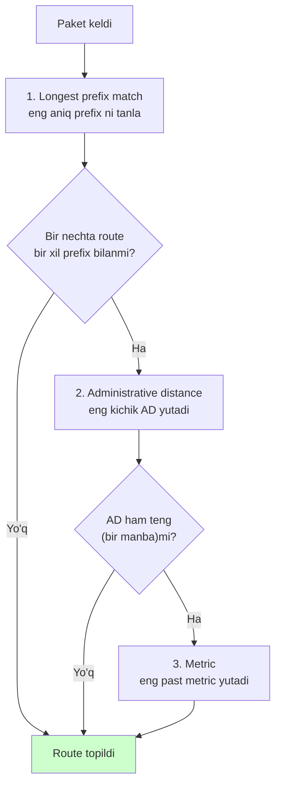
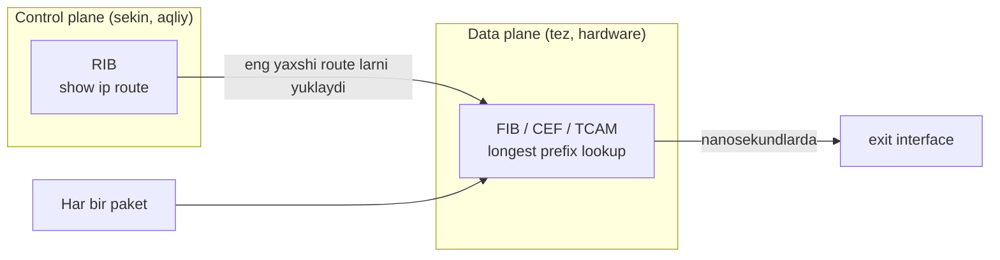

# Routing table va longest prefix match

## Muammo: paket keldi, endi qayerga?

Tasavvur qil: routerning interfeysiga bitta paket keldi. Ustida yozilgan yagona
ma'lumot -- **destination IP** (masalan `10.10.10.50`). Routerning 6 ta
interfeysi bor. Paketni qaysi biridan chiqarish kerak?

Router bu qarorni har paket uchun, soniyada millionlab marta qabul qiladi. Va u
buni **routing table** degan ichki xaritaga qarab hal qiladi. Agar router routing
table ni qanday o'qishni bilmasa yoki noto'g'ri route tanlasa -- paket noto'g'ri
tomonga ketadi yoki umuman tashlanadi ("Internet ishlamayapti").

Bu darsda routing table ni o'qishni, va eng muhim savolga javob berishni
o'rganamiz: **bir nechta route mos kelsa, router qaysi birini tanlaydi?**

## Analogiya: pochta saralash markazi

Routing table ni **pochta saralash markazi**dagi jadval deb tasavvur qil.

Xat keladi, ustida manzil bor: "Toshkent, Chilonzor, 12-kvartal, 45-uy". Saralovchi
jadvalga qaraydi:

- "Toshkentga ketadigan hamma xat" -> 3-yashik (umumiy)
- "Toshkent, Chilonzor" -> 7-yashik (aniqroq)
- "Toshkent, Chilonzor, 12-kvartal" -> 9-yashik (eng aniq)

Saralovchi **eng aniq mos kelgan** yozuvni tanlaydi -- 9-yashik. Chunki u
manzilga eng yaqin. Bu aynan **longest prefix match** g'oyasi: umumiy emas, eng
batafsil route yutadi.

> Farqi shundaki: pochtada odam qaraydi, routerda esa maxsus jadval (FIB) va
> ba'zan hardware (TCAM chip) buni nanosekundlarda bajaradi.

## Sodda ta'rif

> **Routing table** -- routerning ichki jadvali. Har bir yozuv (route) qaysi
> **destination network** qaysi **next-hop** yoki **exit interface** orqali
> yetib borishini saqlaydi.

Har bir route odatda 5 ta narsani biladi: destination prefix, mask, next-hop,
administrative distance va metric. Endi ularni birma-bir ko'ramiz.

## Routing table ni o'qish

Cisco routerda `show ip route` buyrug'i routing table ni ko'rsatadi:

```cisco
R1# show ip route

Gateway of last resort is 192.168.12.2 to network 0.0.0.0

C    192.168.12.0/24 is directly connected, GigabitEthernet0/0
L    192.168.12.1/32 is directly connected, GigabitEthernet0/0
S*   0.0.0.0/0 [1/0] via 192.168.12.2
O    10.10.10.0/24 [110/20] via 192.168.12.2, 00:01:22, GigabitEthernet0/0
```

Bitta qatorni bo'lakma-bo'lak yechamiz:

```text
O      10.10.10.0/24   [110/20]   via 192.168.12.2,   GigabitEthernet0/0
|      |               |          |                   |
manba  destination     [AD/metric] next-hop           exit interface
kodi   prefix
```

- `O` -- route qayerdan kelgan (bu yerda OSPF).
- `10.10.10.0/24` -- destination prefix (qaysi tarmoq).
- `[110/20]` -- birinchi son **administrative distance**, ikkinchisi **metric**.
- `via 192.168.12.2` -- **next-hop**, ya'ni keyingi router IP si.
- `GigabitEthernet0/0` -- paket chiqadigan interfeys.

## Route manba kodlari

Har route ning boshidagi harf uning qayerdan kelganini bildiradi:

| Kod | Ma'nosi |
| --- | --- |
| `C` | Connected -- interfeysga ulangan tarmoq |
| `L` | Local -- routerning o'z interfeys IP si (host route) |
| `S` | Static -- admin qo'lda yozgan |
| `S*` | Static default route |
| `O` | OSPF organgan |
| `D` | EIGRP organgan |
| `R` | RIP organgan |
| `B` | BGP organgan |

`C` va `L` route lar avtomatik paydo bo'ladi: interfeysga IP berib `no shutdown`
qilsang, router darhol ikkalasini yaratadi. `L` route har doim `/32` (IPv4) --
bu routerning aynan o'z IP si.

## Longest prefix match -- eng muhim qoida

Endi darsning yuragiga keldik. Aytaylik, routing table da uch route bor:

```text
192.168.1.0/24     via R2      (umumiy: 256 ta manzil)
192.168.1.128/25   via R3      (aniqroq: 128 ta manzil)
0.0.0.0/0          via ISP     (default: hamma narsa)
```

Paket `192.168.1.150` ga ketmoqda. Qaysi route?

```mermaid
flowchart TD
    P["Paket: dst = 192.168.1.150"] --> C1{"/25 ga mos?<br/>192.168.1.128 - .255"}
    C1 -- "Ha, .150 shu oraliqda" --> W1["/25 route -- via R3<br/>YUTADI (eng uzun)"]
    C1 -. "solishtirish uchun" .-> C2{"/24 ga mos?"}
    C2 -- Ha --> L2["/24 -- lekin qisqaroq prefix"]
    C1 -. .-> C3{"/0 ga mos?"}
    C3 -- Ha --> L3["default -- eng qisqa"]
    style W1 fill:#cfc
```

`192.168.1.150` uchalasiga ham mos keladi. Lekin router **eng uzun prefix**ni
(`/25`) tanlaydi, chunki u eng aniq. Boshqa misollar:

- `192.168.1.50` -> `/24` (chunki `/25` faqat `.128`-`.255` ni qamraydi).
- `8.8.8.8` -> default route (birortasiga aniq mos kelmaydi).

> **Oltin qoida:** Router avval AD yoki metric ga emas, **eng uzun mos prefix**ga
> qaraydi. Longest prefix match hamma narsadan ustun turadi.

Prefix qancha uzun bo'lsa (`/32` > `/25` > `/24` > `/0`), route shuncha aniq va
kuchli. Default route (`/0`) -- eng zaif, faqat boshqa hech narsa mos kelmasa
ishlaydi.

## Administrative distance -- kimga ishonamiz?

Endi boshqa savol: agar **bir xil prefix** ikki xil manbadan kelsa-chi? Masalan
`10.1.1.0/24` uchun ham static, ham OSPF route bor. Ikkalasi bir xil prefix --
longest prefix match ular orasida hal qila olmaydi.

Bu yerda **administrative distance (AD)** ishlaydi -- manbaga ishonch darajasi.
**Son qancha kichik, ishonch shuncha yuqori.**

| Route manbasi | Default AD |
| --- | ---: |
| Connected | 0 |
| Static | 1 |
| External BGP | 20 |
| EIGRP internal | 90 |
| OSPF | 110 |
| RIP | 120 |
| Floating static | admin bergan qiymat (masalan 200) |

`10.1.1.0/24` misolida static (AD 1) OSPF (AD 110) dan yutadi. Router routing
table ga faqat static route ni qo'yadi.

## AD va metric -- adashtirma

Bu ikkisi tez-tez chalkashtiriladi. Farqni yaxshi yod ol:

| | Administrative distance | Metric |
| --- | --- | --- |
| Nima solishtiradi | **turli manbalar** orasida | **bir manba ichida** |
| Misol | static vs OSPF | ikkita OSPF yo'li |
| Kim belgilaydi | Cisco default (o'zgartsa bo'ladi) | protokol algoritmi |
| Savol | "kimga ishonaman?" | "qaysi yo'l qisqaroq?" |

Metric bir protokol ichida eng yaxshi yo'lni tanlaydi: OSPF cost (bandwidth
asosida), RIP hop count, EIGRP bandwidth+delay. Agar ikki OSPF route bir xil
metric bilan kelsa, router ikkalasini ham qo'yadi va **load balancing** qiladi
(ECMP -- Equal Cost Multi-Path).

## Tanlash tartibi -- uch bosqichli filtr

Uch tushunchani (LPM, AD, metric) bitta yaxlit qarorga bog'laymiz. Router route
tanlashda ularni **shu tartibda** qo'llaydi:



Ya'ni: avval **prefix** (eng aniq), keyin **AD** (eng ishonchli manba), keyin
**metric** (eng qisqa yo'l). Har bosqich faqat avvalgisi "durang" bo'lsa ishlaydi.

## Notional machine: FIB va CEF -- aslida nima bo'ladi

`show ip route` senga **RIB** (Routing Information Base) ni ko'rsatadi -- bu
"aqliy" jadval, control plane. Lekin router har paketni bu jadvalni qatorma-qator
o'qib forward qilmaydi -- bu juda sekin bo'lardi.

Aslida router RIB dan **FIB** (Forwarding Information Base) yasaydi -- bu tezkor
qidiruv uchun optimallashtirilgan daraxt tuzilma. Cisco da bu **CEF** (Cisco
Express Forwarding) deyiladi. Yuqori tezlikli routerlarda esa FIB **TCAM** degan
maxsus chipda saqlanadi va longest prefix match ni bir necha nanosekundda,
parallel ravishda bajaradi.



Ya'ni: RIB "qaror qiladi", FIB "bajaradi". Aynan bir IP uchun FIB nima
qilishini `show ip cef 10.10.10.5` bilan ko'rish mumkin.

## Worked example: aniq IP uchun route topish

Troubleshootingda eng foydali buyruq -- aniq bir IP uchun router qaysi route ni
ishlatishini so'rash:

```cisco
R1# show ip route 10.10.10.5

Routing entry for 10.10.10.0/24
  Known via "ospf 1", distance 110, metric 20
  Last update from 192.168.12.2 on GigabitEthernet0/0
  Routing Descriptor Blocks:
  * 192.168.12.2, from 2.2.2.2, via GigabitEthernet0/0
```

Router aytadi: `10.10.10.5` uchun `10.10.10.0/24` route ishlatiladi, u OSPF dan
kelgan, next-hop `192.168.12.2`, chiqish `GigabitEthernet0/0`. Muammoni
tashxislashda bu -- birinchi qadam.

Boshqa foydali filtrlar:

```cisco
show ip route connected     # faqat C route lar
show ip route static        # faqat S route lar
show ip route ospf          # faqat OSPF route lar
show ip cef 10.10.10.5      # FIB (data plane) nima qiladi
show ip interface brief     # interfeyslar up/up mi
```

## Predict savoli

Routing table da quyidagi ikki route bor:

```text
S    172.16.0.0/16   [1/0] via 10.0.0.1     (static)
O    172.16.5.0/24   [110/30] via 10.0.0.2  (OSPF)
```

Paket `172.16.5.10` ga ketmoqda.

> Qaysi route tanlanadi? Static AD 1, OSPF AD 110 -- static kuchliroq emasmi?

<details>
<summary>Javobni ko'rish</summary>

**OSPF route** (`/24`) tanlanadi. Sababi: AD dan **oldin** longest prefix match
ishlaydi. `172.16.5.10` uchun `/24` prefix `/16` dan aniqroq mos keladi. AD
faqat **bir xil prefix** ikki manbadan kelganda solishtiriladi -- bu yerda
prefix lar har xil (`/16` vs `/24`), shuning uchun AD umuman ishlamaydi.

Agar paket `172.16.200.10` ga ketsa (u faqat `/16` ga mos), o'shanda static
route ishlaydi.

</details>

## Ko'p uchraydigan xatolar

⚠️ **"Default route bor, demak hamma paket shundan ketadi"** -- Yo'q. Avval
aniqroq route qidiriladi. Default (`/0`) -- eng zaif, faqat oxirgi chora.

⚠️ **"AD har doim eng muhim"** -- Yo'q. Avval longest prefix match, keyin AD,
keyin metric. AD faqat bir xil prefix uchun ishlaydi.

⚠️ **"AD va metric bir xil narsa"** -- Yo'q. AD turli manbalar orasida, metric
bitta manba ichida.

⚠️ **"Interface down bo'lsa ham C route qoladi"** -- Yo'q. Interfeys
administratively down bo'lsa, uning C va L route lari routing table dan yo'qoladi.

⚠️ **"Ping ketdi, demak hammasi joyida"** -- Yo'q. Ping ketishi uchun **teskari
route** ham kerak. Destination ga route bor, lekin javob qaytishi uchun destination
da senga route bo'lmasa -- ping ishlamaydi.

## Xulosa

- Routing table -- router paketni qayerga yuborishni hal qiladigan jadval.
- Har route: destination prefix, mask, next-hop, AD va metric ni saqlaydi.
- Manba kodlari: `C`, `L`, `S`, `O`, `D`, `R`, `B`.
- **Longest prefix match** birinchi va eng muhim qoida: eng aniq route yutadi.
- **Administrative distance** faqat bir xil prefix ni turli manbalar orasida hal qiladi.
- **Metric** bir protokol ichida eng yaxshi yo'lni tanlaydi.
- RIB qaror qiladi, FIB (CEF/TCAM) tezkor forward qiladi.

## 🧠 Eslab qol

- Tanlash tartibi: **longest prefix match -> AD -> metric**.
- AD = "kimga ishonaman", metric = "qaysi yo'l qisqaroq".
- `L` route har doim `/32`, bu routerning o'z IP si.
- Default route `0.0.0.0/0` -- eng zaif, oxirgi chora.
- `show ip route <ip>` -- aniq IP uchun qaysi route ishlashini aytadi.

## ✅ O'z-o'zini tekshir (retrieval practice)

**1. Nega `172.16.5.10` uchun `/24` route `/16` static route dan yutadi, garchi static AD past bo'lsa ham?**

<details>
<summary>Javob</summary>

Chunki longest prefix match AD dan oldin ishlaydi. `/24` prefix `/16` dan
aniqroq mos keladi. AD faqat bir xil prefix ikki manbadan kelganda
solishtiriladi -- bu yerda prefix lar har xil.

</details>

**2. Bir xil prefix `10.1.1.0/24` ham OSPF (AD 110), ham static (AD 1) dan kelsa, routing table ga qaysi biri tushadi?**

<details>
<summary>Javob</summary>

Static route (AD 1). Prefix bir xil bo'lgani uchun endi AD solishtiriladi;
kichik AD (1) yutadi. OSPF route RIB da "backup" bo'lib qoladi va static
yo'qolsagina ishga tushadi.

</details>

**3. `L 192.168.10.1/32` route nima uchun kerak va nega `/32`?**

<details>
<summary>Javob</summary>

Bu -- routerning o'z interfeys IP si uchun local route. `/32` chunki aynan bitta
manzil (routerning o'zi). Router shu IP ga kelgan paketni "meniki" deb biladi va
uni forward qilmaydi, o'zi qayta ishlaydi.

</details>

**4. Ikki OSPF route bir xil prefix va bir xil metric bilan kelsa nima bo'ladi?**

<details>
<summary>Javob</summary>

Router ikkalasini ham routing table ga qo'yadi va equal-cost load balancing
(ECMP) qiladi -- trafikni ikki yo'l orasida taqsimlaydi.

</details>

## 🛠 Amaliyot

**1. Oson (Modify).** O'z kompyuteringda routing table ni ko'r:

```bash
ip route            # Linux
netstat -rn         # macOS
route print         # Windows
```

`default` route (0.0.0.0/0 yoki `default`) qaysi gateway orqali ketishini top.

**2. O'rta (faded example).** Berilgan routing table uchun har paket qaysi route ga tushishini ayt:

```text
S    10.0.0.0/8      via 1.1.1.1
O    10.5.0.0/16     via 2.2.2.2
S*   0.0.0.0/0       via 3.3.3.3

Paket 10.5.1.9   -> ___    // TODO
Paket 10.9.9.9   -> ___    // TODO
Paket 8.8.8.8    -> ___    // TODO
```

<details>
<summary>Hint</summary>

`10.5.1.9` -> `/16` (eng aniq mos). `10.9.9.9` -> `/8` (faqat unga mos).
`8.8.8.8` -> default `/0` (birortasiga mos kelmaydi).

</details>

**3. Qiyin (Make).** GNS3 yoki Packet Tracer da 2 ta router qo'ying, ikkovida
bir xil `10.1.1.0/24` uchun ham static, ham OSPF route yarating. `show ip route`
bilan qaysi biri tanlanganini ko'ring, sabab AD ekanini isbotlang.

## 🔁 Takrorlash

- **Keyingi qadam:** [02-static-routing.md](02-static-routing.md) -- route larni
  qo'lda qanday yozish.
- **Takrorlash jadvali:** ertaga -> 3 kundan keyin -> 1 haftadan keyin "tanlash
  tartibi (LPM -> AD -> metric)" ni xotiradan qayta tushuntir.
- **Feynman testi:** "Router qanday qilib bir nechta mos route dan bittasini
  tanlaydi?" -- pochta saralash analogiyasi bilan, kod so'zisiz, 3 jumlada
  tushuntir.

## 📚 Manbalar

- [What is a Forwarding Information Base (FIB)? -- JumpCloud](https://jumpcloud.com/it-index/what-is-a-forwarding-information-base-fib)
- [What is Longest Prefix Match (LPM)? -- JumpCloud](https://jumpcloud.com/it-index/what-is-longest-prefix-match-lpm)
- [Understand Cisco Express Forwarding -- Cisco](https://www.cisco.com/c/en/us/support/docs/routers/12000-series-routers/47321-ciscoef.html)
- [Longest Prefix Match Routing -- NetworkLessons](https://networklessons.com/ip-routing/longest-prefix-match-routing)
