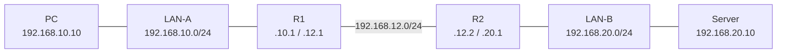
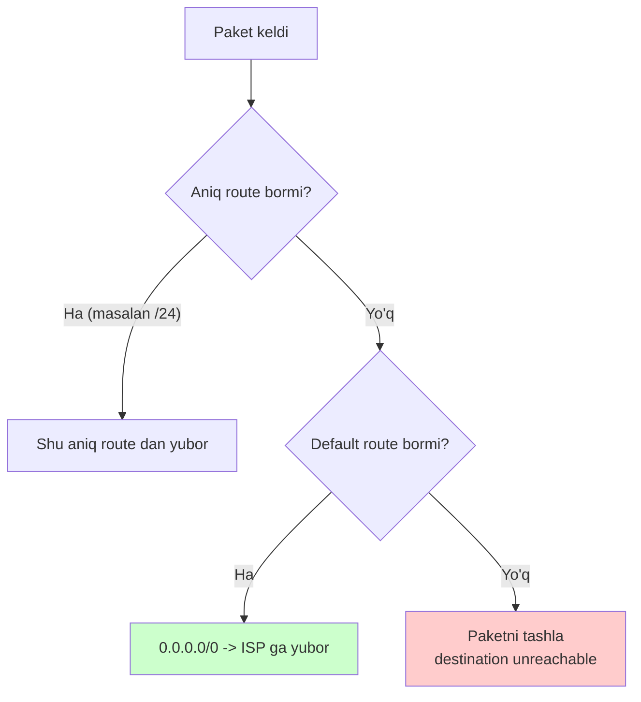
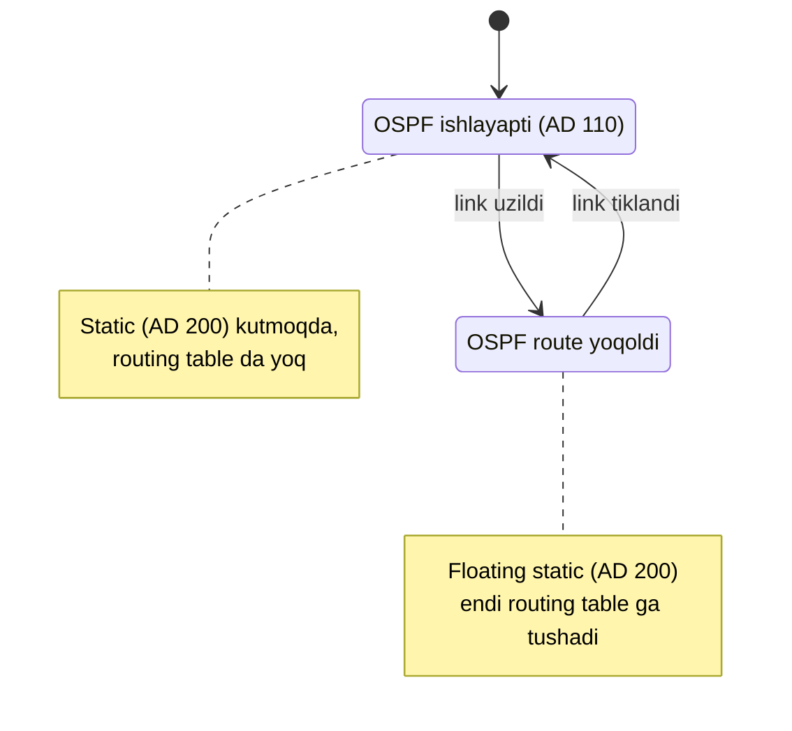

# Static routing

## Muammo: router faqat ulangan tarmoqlarni biladi

Interfeysga IP berding, `no shutdown` qilding -- router shu tarmoqni (`C` route)
biladi. Lekin uzoqdagi, boshqa router ortidagi tarmoqni **umuman bilmaydi**.

Ikki router `192.168.12.0/24` link orqali ulangan. R1 orqasida `192.168.10.0/24`
LAN, R2 orqasida `192.168.20.0/24` LAN. R1 dagi PC R2 dagi serverga paket
yubormoqchi. R1 `192.168.20.0/24` ni bilmaydi -- routing table da bu tarmoq yo'q.
Paket tashlanadi: **destination unreachable**.

Yechim ikki xil: yoki dinamik protokol (OSPF, keyingi darslarda), yoki eng oddiy
usul -- **static route**: admin qo'lda "bu tarmoqqa mana bu yo'ldan bor" deb yozib
qo'yadi.

## Analogiya: qo'lda yozilgan yo'l ko'rsatkichi

Static route -- eshik oldiga yopishtirilgan qo'lda yozilgan qog'oz:
**"20-tarmoqqa borish uchun -> 12.2 eshigidan chiqing"**.

- U hech qachon o'zgarmaydi, admin o'zi almashtirmasa.
- Elektr, hisob-kitob, ortiqcha trafik talab qilmaydi -- shunchaki qog'oz.
- Lekin yo'l buzilsa (link uzilsa), qog'oz baribir turaveradi -- u
  "aqlli" emas, avtomatik boshqa yo'lni topmaydi.

> Farqi: dinamik protokol (OSPF) -- bu yo'llarni doim kuzatib turadigan, yo'l
> buzilsa avtomatik boshqasini topadigan "jonli navigator". Static route -- oddiy
> qog'oz. Kichik va barqaror tarmoqlar uchun qog'oz yetarli va ishonchli.

## Sodda ta'rif

> **Static route** -- administrator routerga qo'lda yozadigan marshrut: "shu
> destination tarmoqqa shu next-hop orqali bor". Routing table da `S` kodi bilan
> ko'rinadi.

## Diagramma: topologiya



R1 `192.168.20.0/24` ni bilmaydi, R2 esa `192.168.10.0/24` ni bilmaydi. Ikkalasiga
ham qo'lda route yozib beramiz.

## Worked example: oddiy static route

Cisco sintaksisi: `ip route <destination> <mask> <next-hop>`.

```cisco
R1(config)# ip route 192.168.20.0 255.255.255.0 192.168.12.2
```

O'qilishi: "`192.168.20.0/24` ga borish uchun paketni `192.168.12.2` ga
(R2 ning link IP siga) uzat". Endi teskari tomon -- R2 da LAN-A ga route:

```cisco
R2(config)# ip route 192.168.10.0 255.255.255.0 192.168.12.1
```

Ikki tomon yozilgach, `show ip route` da paydo bo'ladi:

```cisco
R1# show ip route static
S    192.168.20.0/24 [1/0] via 192.168.12.2
```

`[1/0]` -- AD 1 (static), metric 0. Static route ning AD si har doim 1
(o'zgartirilmasa).

> **Eng ko'p uchraydigan xato:** faqat bitta tomonda route yozish. Paket
> **borishi** uchun R1 da route kerak, **qaytishi** uchun R2 da route kerak.
> Ikkovi ham bo'lmasa -- ping ketadi, lekin javob qaytmaydi.

## Uch xil yozish usuli

Static route ni next-hop ni ko'rsatishning uch usuli bor:

| Usul | Sintaksis | Qachon |
| --- | --- | --- |
| Next-hop IP | `ip route 192.168.20.0 255.255.255.0 192.168.12.2` | Ethernet, tavsiya |
| Exit interface | `ip route 192.168.20.0 255.255.255.0 Serial0/0/0` | Point-to-point link |
| Ikkalasi | `ip route 192.168.20.0 255.255.255.0 Gi0/0 192.168.12.2` | Eng aniq, Ethernet |

Ethernet (multi-access) tarmoqda **faqat exit interface** yozish tavsiya
etilmaydi. Nega? Chunki router "bu interfeysdan chiqadigan har qanday destination
uchun ARP qilaman" deb o'ylab, keraksiz ARP muammolariga tushishi mumkin.
Ethernet da next-hop IP yoki ikkalasini birga yozgan yaxshi.

## Default route -- "boshqa hamma narsa"

Default route -- destination `0.0.0.0/0`. Router boshqa aniq route topmasa, shu
yo'lni ishlatadi. Bu -- "qolgan hamma narsani shu yerga yubor" degani.

```cisco
R1(config)# ip route 0.0.0.0 0.0.0.0 203.0.113.1
```

Bu ayniqsa **edge router**larda (Internetga chiqish nuqtasi) juda ko'p
ishlatiladi: "ichki tarmoqlarimni bilaman, qolgan butun Internet -> ISP ga".
`show ip route` da `S*` bilan ko'rinadi -- yulduzcha "candidate default" ni
bildiradi.



## Host route -- bitta manzil uchun

Host route bitta aniq IP uchun yoziladi, maska `/32` (`255.255.255.255`):

```cisco
R1(config)# ip route 10.10.10.50 255.255.255.255 192.168.12.2
```

Bu route faqat `10.10.10.50` uchun ishlaydi. Longest prefix match sababli `/32`
juda kuchli -- boshqa hamma route ni "ortda qoldiradi". Foydali: bitta serverni
maxsus yo'lga yo'naltirish, monitoring, yoki xavfsizlik uchun.

## Floating static route -- backup yo'l

Endi qiziq holat. Asosiy yo'l OSPF orqali kelsin (AD 110). Biz static backup
xohlaymiz -- lekin u faqat OSPF **yiqilganda** ishlasin, oddiy paytda esa
ishlamasin.

Muammo: oddiy static AD 1, OSPF AD 110. Agar oddiy static yozsak, u har doim
OSPF dan yutadi -- backup emas, u asosiy bo'lib qoladi. Yechim: static ning AD
sini **qo'lda ko'tarish**.

```cisco
R1(config)# ip route 10.20.30.0 255.255.255.0 192.168.99.2 200
```

Oxiridagi `200` -- administrative distance. Endi:

- OSPF (AD 110) bor paytda: OSPF yutadi (110 < 200), static routing table da yo'q.
- OSPF yiqilsa: static (AD 200) yagona qoladi va **routing table ga tushadi**.



> **Diqqat:** floating static AD si asosiy route AD sidan **yuqori** bo'lishi
> SHART. OSPF backupi uchun 111 dan 255 gacha (masalan 200). Agar past qo'ysang,
> backup asosiy o'rniga ishlab ketadi.

## Notional machine: recursive lookup

Next-hop IP li static route da router ikki bosqichli qidiruv qiladi -- buni
**recursive lookup** deyiladi.

```cisco
S 10.10.10.0/24 [1/0] via 192.168.12.2      <- 1-qadam
C 192.168.12.0/24 is directly connected, GigabitEthernet0/0   <- 2-qadam
```

1. Paket `10.10.10.5` ga -> route deydi: next-hop `192.168.12.2`.
2. Lekin `192.168.12.2` ga qanday yetish kerak? Router yana qidiradi -> u
   `192.168.12.0/24` (connected) ichida -> `GigabitEthernet0/0` dan chiqadi.

Ya'ni router avval next-hop ni topadi, keyin **shu next-hop ga qanday yetishni**
alohida qidiradi. Agar next-hop ga hech qanday route bo'lmasa (unreachable),
static route routing table ga umuman **tushmaydi**.

## Verification -- tekshirish buyruqlari

```cisco
show ip route static                 # faqat static route lar
show ip route 192.168.20.10          # aniq IP uchun route
show running-config | include ip route   # config dagi barcha static route
ping 192.168.20.10                   # uchidan uchiga tekshirish
traceroute 192.168.20.10             # yo'lni ko'rish
```

Muammo bo'lsa, tartib bilan tekshir:

```cisco
show ip interface brief              # interfeyslar up/up mi
ping 192.168.12.2                    # next-hop reachable mi?
show arp                             # ARP hal bo'lganmi
```

> **Troubleshooting oltin qoidasi:** avval **next-hop ga ping** qil. Agar next-hop
> ga ping bormasa, uzoq destination ga ham hech qachon bormaydi.

Static route ni o'chirish -- qanday yozgan bo'lsang, `no` bilan aynan shunday:

```cisco
R1(config)# no ip route 192.168.20.0 255.255.255.0 192.168.12.2
```

## Predict savoli

R1 da OSPF orqali `10.20.30.0/24` route bor. Konfiguratsiyada esa
`ip route 10.20.30.0 255.255.255.0 192.168.99.2 200` (floating static) yozilgan.
Ammo `show ip route` da faqat OSPF route ko'rinadi, static ko'rinmaydi.

> Nega floating static route `show ip route` da ko'rinmayapti? Xatomi?

<details>
<summary>Javobni ko'rish</summary>

Xato emas -- **aynan shunday bo'lishi kerak**. OSPF (AD 110) hozir ishlayapti va
u floating static (AD 200) dan yutadi. Shuning uchun static route routing table
ga tushmaydi va `show ip route` da ko'rinmaydi.

U config da bor (`show running-config` da ko'rasan), lekin routing table da yo'q.
OSPF route yo'qolgan zahoti floating static darhol paydo bo'ladi. Backup xuddi
shunday ishlashi kerak.

</details>

## Ko'p uchraydigan xatolar

⚠️ **"Bitta tomonda route yetarli"** -- Yo'q. Trafik borishi (R1) va qaytishi (R2)
uchun ikki tomonda ham route kerak.

⚠️ **"Next-hop istalgan IP bo'lishi mumkin"** -- Yo'q. Next-hop odatda qo'shni
routerning **shu linkdagi** IP si bo'lishi kerak (reachable bo'lishi shart).

⚠️ **"Floating static AD ni past qo'yaman"** -- Yo'q. Past AD backup ni asosiy
route o'rniga ishlatib yuboradi. Backup uchun AD **asosiydan yuqori** bo'lsin.

⚠️ **"Default route hamma muammoni yechadi"** -- Yo'q. Ichki tarmoqlar uchun aniq
route kerak bo'lishi mumkin; default faqat "qolgan hamma narsa" uchun.

⚠️ **"Ethernet da faqat exit interface yozsam bo'ladi"** -- Ehtiyot bo'l. Bu
keraksiz ARP muammolariga olib kelishi mumkin; next-hop IP yoki ikkalasini yoz.

## Xulosa

- Static route -- admin qo'lda yozadigan marshrut, `S` kodi, AD 1.
- Sintaksis: `ip route <dst> <mask> <next-hop | interface>`.
- Trafik ikki tomonlama: **borish va qaytish** uchun route kerak.
- Default route `0.0.0.0/0` -- "qolgan hamma narsa", edge router larda ko'p.
- Host route `/32` -- bitta aniq IP uchun, juda kuchli.
- Floating static -- yuqori AD li backup route, asosiy yiqilganda ishlaydi.
- Recursive lookup -- router next-hop ga qanday yetishni alohida qidiradi.

## 🧠 Eslab qol

- Static route AD = 1 (default), routing table da `S`.
- Har doim **ikki tomonlama** route yoz -- borish va qaytish.
- Default route = `0.0.0.0/0`, `S*` bilan ko'rinadi.
- Floating static AD > asosiy route AD (masalan 200).
- Troubleshootingda avval **next-hop ga ping** qil.

## ✅ O'z-o'zini tekshir (retrieval practice)

**1. Ping ketadi, lekin javob qaytmaydi. Static routing da eng ehtimolli sabab nima?**

<details>
<summary>Javob</summary>

Teskari route yo'q. Trafik borgan (senda destination ga route bor), lekin
destination router da senga (source tarmog'iga) qaytish route i yo'q, shuning
uchun javob qaytmaydi. Ikki tomonda ham route yozish kerak.

</details>

**2. Nega floating static route AD si asosiy route dan yuqori bo'lishi kerak?**

<details>
<summary>Javob</summary>

Backup route asosiy route bor paytda **ishlamasligi** kerak. AD past bo'lsa,
backup asosiy dan yutib, uni o'rnini bosib qo'yadi. Yuqori AD (masalan 200)
static route ni faqat asosiy (masalan OSPF AD 110) yo'qolganda ishga tushiradi.

</details>

**3. `ip route 10.10.10.50 255.255.255.255 192.168.12.2` qanaqa route va u qancha manzilni qamraydi?**

<details>
<summary>Javob</summary>

Bu -- host route (maska `/32`). U aniq bitta manzilni qamraydi: `10.10.10.50`.
`/32` juda uzun prefix bo'lgani uchun longest prefix match bo'yicha boshqa hamma
route dan (masalan `/24`) ustun turadi.

</details>

**4. Ethernet linkda faqat exit interface bilan static route yozsang qanday muammo chiqishi mumkin?**

<details>
<summary>Javob</summary>

Router "bu interfeysdan chiqadigan har qanday destination uchun ARP qilaman" deb
o'ylashi mumkin, natijada keraksiz ARP so'rovlari va ARP table shishishi. Ethernet
da next-hop IP yoki next-hop + interface birga yozilgan yaxshi.

</details>

## 🛠 Amaliyot

**1. Oson (Modify).** Yuqoridagi oddiy static route ni default route ga aylantir:

```cisco
R1(config)# ip route 192.168.20.0 255.255.255.0 192.168.12.2
```

Buni "hamma noma'lum tarmoq R2 ga ketsin" ga o'zgartir (`0.0.0.0 0.0.0.0`) va
`show ip route` da `S*` paydo bo'lganini ko'r.

**2. O'rta (faded example).** Backup yo'l qo'sh -- floating static ni to'ldir:

```cisco
! Asosiy yo'l OSPF orqali keladi (AD 110)
! Backup: 10.50.0.0/24 uchun 192.168.88.2 orqali, faqat OSPF yiqilsa

R1(config)# ip route 10.50.0.0 255.255.255.0 192.168.88.2 ___    // TODO: AD qiymati
```

<details>
<summary>Hint</summary>

AD OSPF (110) dan yuqori bo'lishi kerak. Masalan `200` (yoki 111-255 oralig'ida
har qanday son). To'g'ri javob: `... 192.168.88.2 200`.

</details>

**3. Qiyin (Make).** Packet Tracer da 3 router zanjir qil (R1-R2-R3), har uchida
LAN qo'y. Faqat static route bilan chekka LAN lar bir-birini ko'radigan qil.
Diqqat: har router **har bir uzoq tarmoq** uchun route bilishi kerak (borish va
qaytish). `ping` va `traceroute` bilan tekshir.

## 🔁 Takrorlash

- **Bog'liq oldingi mavzu:** [01-routing-table-va-longest-prefix.md](01-routing-table-va-longest-prefix.md)
  (AD, metric, longest prefix match).
- **Keyingi qadam:** [03-routing-protocols-overview.md](03-routing-protocols-overview.md)
  -- static o'rniga dinamik protokollar.
- **Takrorlash jadvali:** ertaga -> 3 kundan keyin -> 1 haftadan keyin "floating
  static nima uchun yuqori AD talab qiladi?" ni xotiradan tushuntir.
- **Feynman testi:** "Static va dinamik route farqi nima?" -- qog'oz vs jonli
  navigator analogiyasi bilan, 3 jumlada tushuntir.

## 📚 Manbalar

- [Static Routing Configuration -- Cisco](https://www.cisco.com/c/en/us/support/docs/ip/ip-routing/49158-3.html)
- [Floating Static Routes -- NetworkLessons](https://networklessons.com/cisco/ccnp-encor-350-401/floating-static-route)
- [Understand Longest Prefix Match Routing -- NetworkLessons](https://networklessons.com/ip-routing/longest-prefix-match-routing)
