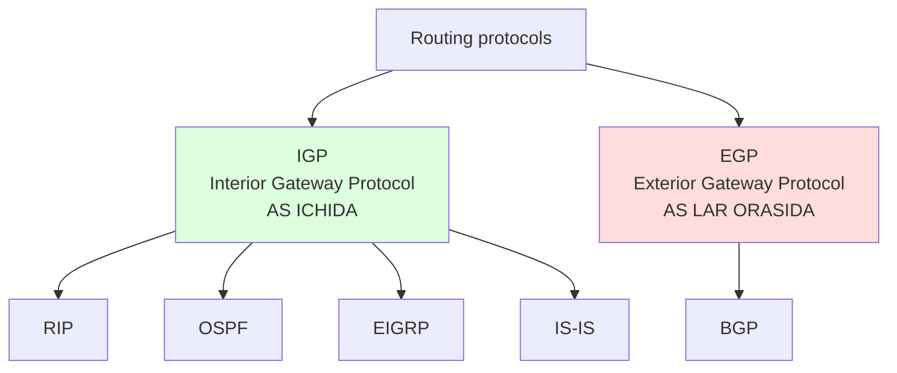
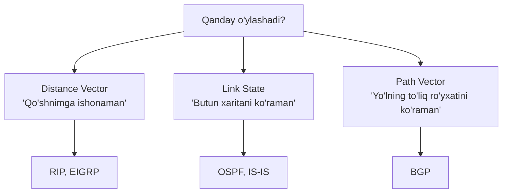
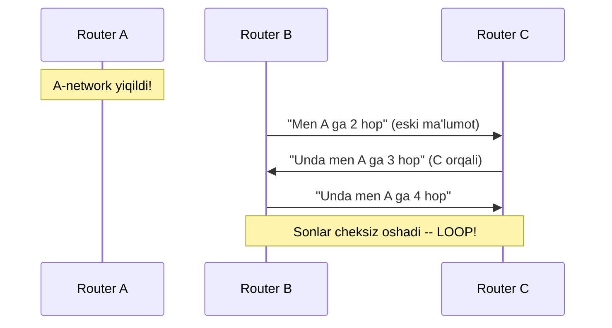
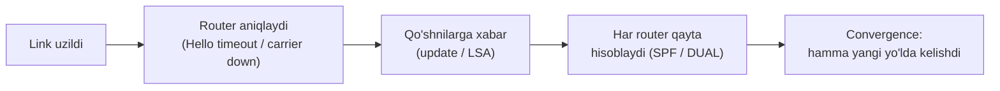

# Routing protocols: umumiy ko'rinish

## Muammo: static route katta tarmoqda tugaydi

Oldingi darsda static route yozdik. 3 ta router uchun yaxshi ishladi. Endi
tasavvur qil: 50 ta router, har birida 10 ta LAN. Har router har bir uzoq
tarmoq uchun **qo'lda** route yozishing kerak. Bu -- yuzlab qatorlar.

Va eng yomoni: bitta link uzilsa, static route baribir "eski yo'l"ni ko'rsatib
turaveradi. Sen qo'lda kirib, har bir routerda route larni almashtirishing kerak.
Katta tarmoqda bu -- imkonsiz.

Kerak: routerlar **bir-biri bilan gaplashsin**, o'zlari bilgan tarmoqlarni
almashsin, va link uzilsa -- **avtomatik** boshqa yo'l topsin. Bu -- **dynamic
routing protocol**.

> Internet -- bu ~75,000 dan ortiq Autonomous System (AS) ning bir-biri bilan
> dynamic gaplashadigan tarmog'i. Har router boshqasiga "Men bu tarmoqni bilaman,
> men orqali yuborsang yetib boradi" deydi. Bu xabar almashish -- routing protocol.

## Analogiya: shahar transport tarmog'i

Static routing -- qo'lda chizilgan xarita. Yo'l yopilsa, xaritada ko'rinmaydi,
sen yopiq yo'lga borib qolasan.

Dynamic routing -- Yandex/Google Navigator. Boshqa haydovchilar (routerlar)
real-vaqtda "bu yo'lda tirbandlik", "bu ko'prik yopiq" deb ma'lumot yuboradi.
Navigator avtomatik yangi eng qisqa yo'lni hisoblaydi. Sen faqat "manzilni" berasan.

Har protokol bu "ma'lumot almashish" ni har xil qiladi -- kimdir faqat qo'shnisiga
ishonadi, kimdir butun xaritani ko'radi, kimdir har yo'lning to'liq ro'yxatini
oladi. Shu farqni tushunish -- bu darsning maqsadi.

## Sodda ta'rif

> **Routing protocol** -- routerlar avtomatik ravishda tarmoq ma'lumotlarini
> almashadigan, eng yaxshi yo'lni hisoblaydigan va topologiya o'zgarsa
> moslashadigan til/qoidalar to'plami.

## Birinchi bo'linish: IGP vs EGP

Routing protokollari avvalo **qayerda ishlashi** bo'yicha ikkiga bo'linadi:



- **IGP (Interior Gateway Protocol)** -- bitta tashkilot ichida (AS -- Autonomous
  System). Maqsad: eng tez, eng qisqa yo'lni topish. Misol: RIP, OSPF, EIGRP, IS-IS.
- **EGP (Exterior Gateway Protocol)** -- turli tashkilotlar (AS lar) orasida.
  Maqsad: siyosat (policy), ishonch, boshqaruv. Bitta protokol hukmron: **BGP**.

Analogiya: IGP -- bir shahar ichidagi navigatsiya (eng qisqa yo'l muhim). EGP --
davlatlar orasidagi savdo (kim bilan ish qilish siyosat, tezlik emas).

## Ikkinchi bo'linish: qanday "o'ylashadi"?

Endi IGP lar bir-biridan qanday farq qiladi? Uch xil "fikrlash uslubi" bor:



**Distance Vector** -- "qo'shnimga ishonaman". Router faqat qo'shnilariga "men
shu tarmoqqa shu masofada (hop count)" deydi. Butun xaritani ko'rmaydi -- faqat
"qancha uzoq". Sodda, lekin **count-to-infinity** muammosi bor.

**Link State** -- "butun xaritani ko'raman". Har router butun topologiyani
biladi (LSDB -- Link State Database). Keyin Dijkstra algoritmi bilan eng qisqa
yo'lni **o'zi hisoblaydi**. Aniqroq, tezroq moslashadi, lekin ko'proq resurs.

**Path Vector** -- "yo'lning to'liq ro'yxatini ko'raman". BGP har route uchun
butun AS_PATH (qaysi AS lar orqali o'tganini) ko'radi. Bu loop ni oldini oladi
va policy qarorlariga imkon beradi.

## Count-to-infinity -- distance vector ning og'rig'i

Nega distance vector "sodda lekin muammoli"? Bir misol:



Router faqat qo'shnisiga ishongani uchun, yiqilgan tarmoq haqidagi "eski"
ma'lumot ular orasida aylanib, hop count cheksiz o'sadi. RIP da maksimum 15 hop
(16 = unreachable) shuning uchun qo'yilgan. Yechimlar: **split horizon**
(o'rgangan yo'lingni o'sha qo'shningga qaytarma), **poison reverse**, **hold-down
timer**.

## Protokollarni tanishtirish

### RIP (Routing Information Protocol)

Eng eski va sodda. Distance vector, metric = **hop count** (max 15). Har 30
soniyada butun jadvalni yuboradi. Bugungi kunda production da deyarli
ishlatilmaydi -- faqat lab va legacy tizimlarda.

### EIGRP (Cisco)

Ilg'or distance vector (hybrid). DUAL algoritmi bilan loop-free. Kompozit metric:
bandwidth + delay. Juda tez convergence (< 1 soniya), lekin asosan Cisco. RFC 7868
bilan ochildi, ammo amalda Cisco tarmoqlarda.

### OSPF (Open Shortest Path First)

Link state, Dijkstra (SPF). Vendor-neutral -- hamma qurilmada ishlaydi. Area lar
bilan masshtablanadi (Area 0 backbone). Enterprise da eng ko'p ishlatiladigan
IGP. Keyingi darsda batafsil.

### IS-IS

Link state, OSPF ga o'xshash. ISP backbone larida hukmron. TLV kengayuvchanligi
va IPv6 native qo'llab-quvvatlashi kuchli.

### BGP (Border Gateway Protocol)

Path vector, Internet ning yagona EGP si. TCP port 179. eBGP (AS lar orasida) va
iBGP (AS ichida). Alohida darsda batafsil.

## Solishtirish jadvali

| Protokol | Turi | Metric | Convergence | Qayerda | Standard |
| --- | --- | --- | --- | --- | --- |
| RIP | Distance vector | hop count | 2-3 daqiqa | lab, legacy | ochiq |
| EIGRP | Advanced DV | bw+delay | < 1 soniya | Cisco tarmoq | Cisco (RFC 7868) |
| OSPF | Link state | cost (bw) | 1-10 soniya | enterprise | ochiq |
| IS-IS | Link state | cost | 1-10 soniya | ISP backbone | ochiq |
| BGP | Path vector | policy | daqiqalar | Internet, AS lar | ochiq |

**AD lari** (oldingi darsdan): Connected 0, Static 1, eBGP 20, EIGRP 90, OSPF 110,
RIP 120. Kichik AD -- ko'proq ishonch.

## Zamonaviy holat (2025-2026)

WebSearch dan olingan hozirgi amaliyot:

- **OSPF -- xavfsiz standart tanlov (2026).** Vendor-neutral, hamma sertifikat
  yo'lida bor, area lar bilan masshtablanadi. Ko'p-vendorli campus, katta filial
  tarmoqlarida birinchi tanlov.
- **EIGRP** -- toza Cisco muhitida tez failover va past operatsion yuk. Zaifligi:
  ekotizim tor (asosan Cisco).
- **BGP** -- tezlik emas, **policy** muhim bo'lganda: Internet chekkasi, AS lar
  orasi. Internetni ishlatadigan protokol.
- **IS-IS** -- juda katta provider tarmoqlarida, moslashuvchanlik muhim joyda.
- Amalda EIGRP va OSPF ikkalasi ham sub-soniyada convergence qiladi (sozlansa).
  Farq marketing ko'rsatgandan kichikroq -- to'g'ri javob ko'pincha "tarmog'ingda
  allaqachon nima ishlayapti" ga bog'liq.

## Notional machine: RIB va convergence

Har router dynamic protokoldan o'rgangan route larni **RIB** ga qo'yadi. Topologiya
o'zgarsa (link uzildi), quyidagi jarayon kechadi:



**Convergence time** -- tarmoq o'zgarishdan keyin **hamma router yangi, barqaror
yo'lda kelishuvi** uchun ketgan vaqt. Bu -- protokolni baholashning eng muhim
mezoni. RIP: daqiqalar. OSPF/EIGRP: soniyalar. **BFD** (Bidirectional Forwarding
Detection) qo'shilsa -- millisekundlarda link uzilishini aniqlaydi.

## Predict savoli

Bir tashkilotning ichki tarmog'ida 40 ta router bor, hammasi turli vendordan
(Cisco, Juniper, Arista). Ular bir-birini avtomatik ko'rishi kerak.

> RIP, EIGRP, OSPF, BGP -- qaysi biri eng mos, va nega EIGRP mos emas?

<details>
<summary>Javobni ko'rish</summary>

**OSPF**. Sabablar: (1) IGP kerak -- bu AS **ichida** (BGP AS lar orasida). (2)
Ko'p-vendorli -- OSPF vendor-neutral, hamma qurilmada ishlaydi. (3) 40 router --
RIP juda sekin va 15 hop limiti bor. **EIGRP mos emas** chunki u asosan Cisco --
Juniper va Arista bilan ishlamaydi (RFC ochilsa-da, amalda deploy qilinmagan).

</details>

## Ko'p uchraydigan xatolar

⚠️ **"BGP ni ichki tarmoqda IGP o'rniga ishlataman"** -- Odatda yo'q. BGP -- EGP,
policy uchun. Ichki tarmoq uchun OSPF/EIGRP tezroq va soddaroq.

⚠️ **"Distance vector va link state metric bir xil"** -- Yo'q. RIP hop count
sanaydi, OSPF cost (bandwidth) sanaydi. 15 hop lik sekin yo'l RIP da yaxshi
ko'rinishi mumkin.

⚠️ **"Convergence darhol bo'ladi"** -- Yo'q. Link uzilishini aniqlash + xabar
tarqatish + qayta hisoblash vaqt oladi. RIP da daqiqalar.

⚠️ **"EIGRP ochiq standart, hamma qurilmada ishlaydi"** -- RFC 7868 bilan
hujjatlashtirilgan, lekin amalda faqat Cisco muhitida deploy qilinadi.

⚠️ **"RIP hali ham yaxshi tanlov"** -- Yo'q. Production da deyarli o'lgan. OSPF
yoki EIGRP hamma holatda yaxshiroq.

## Xulosa

- Static routing katta/o'zgaruvchan tarmoqda tugaydi -- dynamic protokol kerak.
- **IGP** AS ichida (RIP, OSPF, EIGRP, IS-IS), **EGP** AS lar orasida (BGP).
- Uch fikrlash uslubi: distance vector, link state, path vector.
- Distance vector qo'shniga ishonadi -- count-to-infinity muammosi bor.
- Link state butun xaritani ko'radi -- aniqroq, tezroq moslashadi.
- OSPF -- enterprise standart tanlov; EIGRP -- Cisco; BGP -- Internet.
- Convergence time -- protokolni baholashning asosiy mezoni.

## 🧠 Eslab qol

- IGP = AS ichida, EGP (BGP) = AS lar orasida.
- Distance vector = "qo'shnimga ishonaman" (RIP, EIGRP).
- Link state = "butun xaritani ko'raman" (OSPF, IS-IS).
- Path vector = "to'liq yo'l ro'yxati" (BGP).
- OSPF -- ko'p-vendorli enterprise standarti.

## ✅ O'z-o'zini tekshir (retrieval practice)

**1. Nega distance vector protokolda count-to-infinity muammosi bor, link state da esa yo'q?**

<details>
<summary>Javob</summary>

Distance vector router faqat qo'shnisiga ishonadi va butun xaritani ko'rmaydi --
shuning uchun yiqilgan tarmoq haqidagi eski ma'lumot ular orasida aylanib, hop
count cheksiz o'sadi. Link state da har router butun topologiyani biladi va SPF
bilan o'zi hisoblaydi, shuning uchun bunday loop yuzaga kelmaydi.

</details>

**2. Ko'p-vendorli enterprise tarmoq uchun OSPF va EIGRP dan qaysi biri va nega?**

<details>
<summary>Javob</summary>

OSPF -- chunki u vendor-neutral (hamma qurilmada ishlaydi). EIGRP RFC bilan
ochilgan bo'lsa-da, amalda faqat Cisco muhitida deploy qilinadi.

</details>

**3. IGP va EGP orasidagi asosiy farq nima?**

<details>
<summary>Javob</summary>

IGP (RIP/OSPF/EIGRP/IS-IS) bitta AS **ichida** ishlaydi, maqsadi eng qisqa/tez
yo'l. EGP (BGP) turli AS lar **orasida** ishlaydi, maqsadi policy va boshqaruv,
tezlik emas.

</details>

**4. RIP metric = hop count. Nega bu ba'zan noto'g'ri yo'lni tanlaydi?**

<details>
<summary>Javob</summary>

Hop count faqat **routerlar sonini** sanaydi, bandwidth ni emas. Masalan 2 hop
lik 10 Mbps yo'l RIP uchun 3 hop lik 10 Gbps yo'ldan "yaxshiroq" ko'rinadi --
garchi tezlik jihatidan aksincha bo'lsa ham. OSPF cost (bandwidth) buni to'g'ri
hal qiladi.

</details>

## 🛠 Amaliyot

**1. Oson (Modify).** Quyidagi tarmoqlar uchun to'g'ri protokolni tanla va sabab yoz:

```text
a) 5 routerli Cisco-only tarmoq, eng tez failover kerak -> ___
b) Internetga ulanish, ikki ISP, policy muhim         -> ___
c) 100 routerli ko'p-vendorli campus                  -> ___
```

<details>
<summary>Hint</summary>

a) EIGRP (Cisco, tez convergence). b) BGP (AS lar orasi, policy). c) OSPF
(vendor-neutral, area lar bilan masshtablanadi).

</details>

**2. O'rta (faded example).** Har protokolni to'g'ri turga moslashtir:

```text
RIP    -> ___ (turi)
OSPF   -> ___
BGP    -> ___
EIGRP  -> ___
```

<details>
<summary>Hint</summary>

RIP -> distance vector. OSPF -> link state. BGP -> path vector. EIGRP ->
advanced distance vector.

</details>

**3. Qiyin (Make).** FRRouting (open source) o'rnatilgan ikkita Linux VM da OSPF
sozlang (`vtysh` orqali). `show ip ospf neighbor` bilan ular bir-birini
ko'rganini isbotlang. Keyin bir linkni "o'chirib", convergence necha soniyada
sodir bo'lishini o'lchang.

## 🔁 Takrorlash

- **Bog'liq oldingi mavzu:** [01-routing-table-va-longest-prefix.md](01-routing-table-va-longest-prefix.md)
  (AD -- bu yerda protokollarning ishonch darajasi), [02-static-routing.md](02-static-routing.md).
- **Keyingi qadam:** [04-ospf.md](04-ospf.md) -- link state ni chuqur o'rganamiz.
- **Takrorlash jadvali:** ertaga -> 3 kundan keyin -> 1 haftadan keyin uch
  fikrlash uslubini (DV/LS/PV) xotiradan ayt.
- **Feynman testi:** "Distance vector va link state farqi nima?" -- "qo'shniga
  ishonish" vs "butun xaritani ko'rish" bilan 3 jumlada tushuntir.

## 📚 Manbalar

- [Cisco routing protocols comparison: OSPF, BGP, EIGRP -- Vision Training](https://www.visiontrainingsystems.com/blogs/comparing-cisco-routing-protocols-ospf-bgp-and-eigrp/)
- [EIGRP vs OSPF: convergence, design -- PingLabz](https://www.pinglabz.com/eigrp-vs-ospf/)
- [Interior Routing Protocols: RIP vs EIGRP vs OSPF vs IS-IS -- Pivit Global](https://info.pivitglobal.com/resources/interior-routing-protocols-comparison-rip-vs-eigrp-vs-ospf-vs-is-is)
- RFC 2453 (RIPv2), RFC 2328 (OSPFv2), RFC 4271 (BGP-4), RFC 7868 (EIGRP)
