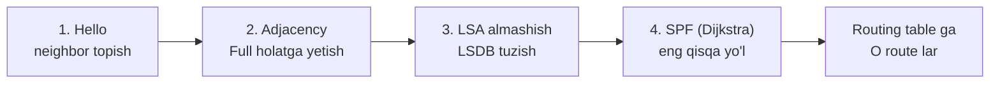
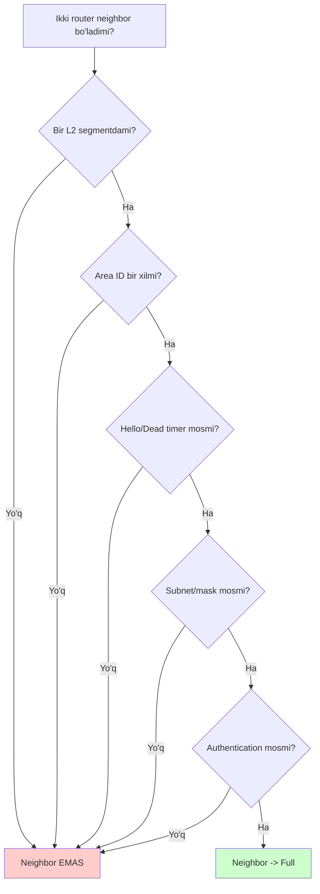
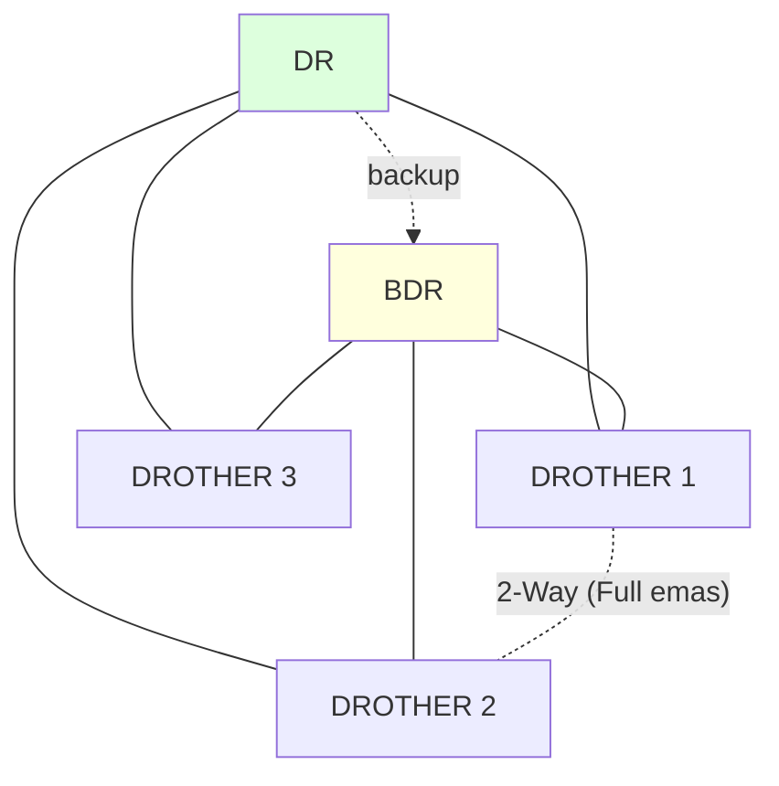

# OSPF: link-state routing

## Muammo: qo'shniga ishonish yetarli emas

Oldingi darsda distance vector (RIP) ning og'rig'ini ko'rdik: router faqat
qo'shnisiga ishonadi, butun xaritani ko'rmaydi, count-to-infinity loop kelib
chiqadi, convergence sekin.

Enterprise tarmoqda bu qabul qilib bo'lmas. 50 ta router, kritik ilovalar, link
uzilsa 1-2 soniyada tiklanish kerak. Kerak: har router **butun topologiyani
ko'rsin**, eng qisqa yo'lni **o'zi ishonchli hisoblasin**, va vendor-neutral
bo'lsin (Cisco, Juniper, Arista birga).

Bu -- **OSPF** (Open Shortest Path First): link-state protokol, Dijkstra
algoritmi, enterprise da eng ko'p ishlatiladigan IGP.

## Analogiya: har kim to'liq xarita chizadi

Distance vector -- yo'lni faqat "qo'shningdan eshitasan": "u aytdiki, u yoqda
shahar 3 hop uzoqlikda". Sen unga ishonasan, xaritani o'zing ko'rmaysan.

OSPF boshqacha. Tasavvur qil: har bir haydovchi (router) atrofidagi barcha
yo'llarni tekshiradi -- "menda shu tomonda 100 Mbps yo'l, bu tomonda 1 Gbps yo'l"
-- va bu ma'lumotni **hammaga** e'lon qiladi (LSA). Har haydovchi bu e'lonlarni
yig'ib, **butun shaharning bir xil xaritasini** chizadi (LSDB). Keyin har biri
o'zi manzilgacha eng qisqa yo'lni Dijkstra bilan hisoblaydi.

> Natija: hamma bir xil xaritaga ega. Bir yo'l yopilsa, e'lon tez tarqaladi va
> hamma o'z xaritasini yangilab, yangi eng qisqa yo'lni qayta hisoblaydi -- loop
> siz, tez.

## Sodda ta'rif

> **OSPF** -- link-state routing protokoli. Routerlar Hello paketlar bilan
> neighbor bo'ladi, link-state ma'lumot (LSA) larni almashadi, bir xil LSDB
> (Link State Database) tuzadi va SPF (Dijkstra) algoritmi bilan eng qisqa
> yo'llarni hisoblaydi.

Routing table da `O` kodi bilan ko'rinadi, AD 110, metric = cost.

```cisco
O 10.10.20.0/24 [110/2] via 192.168.12.2, 00:00:32, GigabitEthernet0/0
```

## OSPF qanday ishlaydi: 4 bosqich



1. **Hello** -- router har interfeysdan Hello paket yuboradi (multicast
   `224.0.0.5`), qo'shnilarni topadi.
2. **Adjacency** -- bir qancha shartlar mos kelsa, ikki router neighbor bo'ladi
   va `Full` holatga yetadi.
3. **LSA exchange** -- neighbor lar link-state ma'lumot (LSA) larni almashadi,
   har biri bir xil LSDB tuzadi.
4. **SPF** -- har router Dijkstra bilan o'zidan har tarmoqqa eng qisqa yo'lni
   hisoblaydi va routing table ga yozadi.

## Router ID -- OSPF ichida ism

Har router OSPF ichida 32-bit **Router ID** bilan tanilishi kerak. IP manzilga
o'xshaydi, lekin interface IP bo'lishi shart emas.

Tanlash tartibi (avtomatik):

1. Qo'lda berilgan `router-id` (tavsiya etiladi).
2. Eng katta up/up **loopback** IP.
3. Eng katta up/up **physical** interface IP.

```cisco
R1(config)# router ospf 1
R1(config-router)# router-id 1.1.1.1
```

> **Best practice (2025):** Router ID ni **har doim qo'lda ber**. Agar u physical
> interface ga bog'liq bo'lsa, interface o'zgarganda Router ID ham o'zgarib,
> DR/BDR saylovi va adjacency lar buzilishi mumkin. Barqaror, statik ID kerak.

Router ID o'zgargach OSPF ni qayta ishga tushirish kerak:

```cisco
R1# clear ip ospf process
```

## OSPF ni yoqish -- ikki usul

### Usul 1: network komandasi (wildcard mask bilan)

```cisco
R1(config)# router ospf 1
R1(config-router)# network 192.168.12.0 0.0.0.255 area 0
R1(config-router)# network 10.1.1.0 0.0.0.255 area 0
```

`0.0.0.255` -- **wildcard mask** (subnet maskaning teskarisi). Bu OSPF ga "shu
oraliqdagi IP li interfeyslarni area 0 ga qo'sh" deydi.

| Subnet mask | Wildcard mask |
| --- | --- |
| 255.255.255.0 | 0.0.0.255 |
| 255.255.255.252 | 0.0.0.3 |
| 255.255.0.0 | 0.0.255.255 |
| 255.255.255.255 | 0.0.0.0 (aynan bitta IP) |

### Usul 2: interface ostida (zamonaviy, tavsiya)

```cisco
R1(config)# interface GigabitEthernet0/0
R1(config-if)# ip ospf 1 area 0
```

Bu usul aniqroq -- wildcard mask xatosini kamaytiradi. Zamonaviy amaliyotda ko'proq
ishlatiladi.

## Neighbor adjacency -- shartlar

Ikki router neighbor bo'lishi uchun bir qancha parametr **mos** kelishi kerak.
Bu -- OSPF troubleshooting ning yuragi:



Mos kelishi shart: **area ID, Hello/Dead timer, subnet/mask, authentication,
stub flaglari**. Router ID esa **takrorlanmasligi** kerak.

Neighbor holatlari (state machine):

| Holat | Ma'nosi |
| --- | --- |
| Down | Hello ko'rinmayapti |
| Init | Hello keldi, lekin o'zimiz uning listida yo'qmiz |
| 2-Way | Ikki tomon bir-birini ko'rdi |
| ExStart/Exchange | DB almashishga tayyorgarlik |
| Loading | LSA lar olinmoqda |
| Full | Adjacency to'liq -- tayyor |

> **Muhim:** Broadcast tarmoqda **hamma bilan Full bo'lish shart emas**.
> DROTHER router lar bir-biri bilan `2-Way` holatda qoladi -- bu **normal**, xato
> emas. Buni keyingi bo'limda tushunamiz.

## DR va BDR -- LSA suvini kamaytirish

Ethernet (broadcast) segmentda 5 router bor deylik. Agar har biri har biri bilan
Full adjacency qursa -- 10 ta adjacency, va har o'zgarishda LSA hammaga
takror-takror yuboriladi. Bu -- suv toshqini (flooding storm).

Yechim: segment bitta **DR** (Designated Router) va bitta **BDR** (Backup DR)
saylaydi. Qolganlar (**DROTHER**) faqat DR/BDR bilan Full bo'ladi, LSA larni DR
orqali almashadi.



DROTHER lar o'zaro faqat `2-Way` -- ular bir-biri bilan to'liq gaplashmaydi,
hamma narsa DR orqali o'tadi. LSA hajmi keskin kamayadi.

**Saylov tartibi:**

1. Eng yuqori OSPF **priority** (default 1, oraliq 0-255).
2. Priority teng bo'lsa -- eng yuqori **Router ID**.
3. Priority **0** -- router hech qachon DR/BDR bo'lmaydi.

```cisco
R1(config)# interface GigabitEthernet0/0
R1(config-if)# ip ospf priority 100
```

> **Best practice (2025):** DR ni ishonchli, kuchli routerga bering (priority
> 100), zaif router larga priority 0. DR qo'shimcha ish bajaradi. **Saylov
> preemptive emas** -- keyinroq kuchliroq router qo'shilsa, mavjud DR avtomatik
> almashmaydi (faqat DR OSPF process qayta ishga tushsa).

## Passive interface -- LAN ni himoya qilish

LAN (user) segmentida OSPF **route e'lon qilish** kerak, lekin u yerda neighbor
kutish shart emas (u yerda faqat PC lar, router yo'q). Passive interface Hello
yubormaydi, lekin tarmoqni e'lon qilishda davom etadi.

```cisco
R1(config)# router ospf 1
R1(config-router)# passive-interface GigabitEthernet0/1
```

Hamma interfeysni passive qilib, faqat router-router linkni ochish (xavfsizroq):

```cisco
R1(config-router)# passive-interface default
R1(config-router)# no passive-interface GigabitEthernet0/0
```

## Default route ni OSPF orqali tarqatish

Edge routerda default route (Internetga) bor. Uni butun OSPF domenga tarqatish:

```cisco
R1(config)# ip route 0.0.0.0 0.0.0.0 203.0.113.1
R1(config)# router ospf 1
R1(config-router)# default-information originate
```

Endi boshqa OSPF router lar `O*E2 0.0.0.0/0` route ni ko'radi -- "Internetga
chiqish R1 orqali".

## Worked example: to'liq konfiguratsiya

Ikki router, ular orasida `192.168.12.0/24` link, har birida LAN.

```cisco
! --- R1 ---
R1(config)# router ospf 1
R1(config-router)# router-id 1.1.1.1
R1(config-router)# passive-interface GigabitEthernet0/1
R1(config)# interface GigabitEthernet0/0
R1(config-if)# ip ospf 1 area 0
R1(config)# interface GigabitEthernet0/1
R1(config-if)# ip ospf 1 area 0

! --- R2 ---
R2(config)# router ospf 1
R2(config-router)# router-id 2.2.2.2
R2(config)# interface GigabitEthernet0/0
R2(config-if)# ip ospf 1 area 0
```

Tekshirish:

```cisco
R1# show ip ospf neighbor
Neighbor ID  Pri  State    Dead Time  Address       Interface
2.2.2.2       1   FULL/DR  00:00:35   192.168.12.2  GigabitEthernet0/0
```

`FULL/DR` -- neighbor to'liq, va u DR rolida. Endi R1 R2 ning LAN ini `O` route
sifatida ko'radi.

## LSA turlari (qisqacha)

OSPF turli xabar (LSA) turlaridan foydalanadi. CCNA darajasida asosiylari:

| LSA turi | Nomi | Nima |
| --- | --- | --- |
| Type 1 | Router LSA | Router o'z linklarini e'lon qiladi |
| Type 2 | Network LSA | DR broadcast segmentni e'lon qiladi |
| Type 3 | Summary LSA | ABR boshqa area route larini uzatadi |
| Type 5 | External LSA | tashqi (redistributed) route lar |

Single-area OSPF da asosan Type 1 va Type 2 ishlaydi. Multi-area da Type 3
(area lar orasida) va Type 5 (tashqi) qo'shiladi. **Area 0** -- backbone, barcha
inter-area trafik u orqali o'tadi (loop-free kafolat).

## Notional machine: SPF va cost

Har router LSDB dan (barcha LSA lar) o'zini "ildiz" qilib **SPF daraxti**
(shortest path tree) quradi. Har link ning "og'irligi" -- **cost**:

```text
cost = reference-bandwidth / interface-bandwidth
```

Cisco default reference = 100 Mbps. Ya'ni 100 Mbps link cost = 1, 10 Mbps link
cost = 10. Muammo: 1 Gbps va 100 Gbps ikkalasi ham cost 1 chiqadi (default da).
Shuning uchun zamonaviy tarmoqda reference-bandwidth ni oshirish kerak:

```cisco
R1(config-router)# auto-cost reference-bandwidth 100000
```

Yoki interfeys ostida cost ni qo'lda ber:

```cisco
R1(config-if)# ip ospf cost 10
```

## Troubleshooting

```cisco
show ip ospf neighbor            # neighbor lar holati
show ip ospf interface brief     # qaysi interfeys OSPF da
show ip route ospf               # O route lar
show ip protocols                # OSPF process ma'lumoti
show running-config | section router ospf
ping 224.0.0.5                   # OSPF multicast ishlaydimi
```

Neighbor `Full` bo'lmayaptimi? Tartib bilan tekshir:

- **Down/Init da qolgan** -> Hello/Dead timer, subnet/mask, area ID mosmi?
- **ExStart da qolgan** -> MTU mos emas (klassik sabab!).
- **Umuman ko'rinmaydi** -> passive-interface tasodifan yoqilganmi?

WebSearch dan (2025 best practice): Router ID ni statik ber, DR ni kuchli
routerga qo'y, Hello/Dead timer larni ehtiyotkorlik bilan sozla, va tarmoqni
davriy audit qil -- xatolarni katta muammoga aylanmasdan tut.

## Predict savoli

Broadcast segmentda 4 router: R1 (DR), R2 (BDR), R3, R4 (DROTHER). Sen
`show ip ospf neighbor` ni R3 da ko'rasan.

> R3 R4 bilan qaysi holatda bo'ladi -- Full yoki 2-Way? Bu xatomi?

<details>
<summary>Javobni ko'rish</summary>

R3 va R4 **2-Way** holatda bo'ladi -- bu **mutlaqo normal**, xato emas. Ikkalasi
ham DROTHER. DROTHER router lar bir-biri bilan Full adjacency qurmaydi -- ular
faqat DR va BDR bilan Full bo'ladi. Barcha LSA almashuvi DR orqali o'tadi.

R3 ning neighbor jadvalida: R1 (Full/DR), R2 (Full/BDR), R4 (2-Way/DROTHER). Agar
R4 ni ham Full deb kutsang -- bu noto'g'ri tasavvur.

</details>

## Ko'p uchraydigan xatolar

⚠️ **"Wildcard mask = subnet mask"** -- Yo'q. Wildcard subnet maskaning teskarisi.
`255.255.255.0` -> `0.0.0.255`.

⚠️ **"DROTHER lar 2-Way da qolsa xato"** -- Yo'q. Bu broadcast segmentda normal.
Ular faqat DR/BDR bilan Full bo'ladi.

⚠️ **"Area bir tomonda 0, boshqada 1 bo'lsa ham neighbor bo'ladi"** -- Yo'q. Area
ID mos kelmasa neighbor bo'lmaydi.

⚠️ **"ExStart da qolsa area muammosi"** -- Ko'pincha **MTU mos emas**. MTU ni ikki
tomonda tekshir.

⚠️ **"Kuchliroq router qo'shilsa DR avtomatik almashadi"** -- Yo'q. Saylov
preemptive emas. Mavjud DR OSPF process qayta ishga tushmaguncha qoladi.

⚠️ **"Router ID interface IP bo'lishi shart"** -- Yo'q. Router ID mustaqil 32-bit
qiymat, qo'lda berilishi tavsiya etiladi.

## Xulosa

- OSPF -- link-state, Dijkstra, AD 110, metric = cost. Vendor-neutral.
- 4 bosqich: Hello -> Adjacency -> LSA exchange -> SPF.
- Router ID -- 32-bit ism, **qo'lda ber** (best practice).
- Yoqish: `network ... wildcard ... area` yoki `ip ospf 1 area 0` (interface ostida).
- Neighbor bo'lish uchun area, timer, subnet, auth mos bo'lishi kerak.
- Broadcast segmentda DR/BDR saylanadi, DROTHER lar o'zaro 2-Way (normal).
- Passive interface LAN da Hello ni to'xtatadi, lekin route ni e'lon qiladi.

## 🧠 Eslab qol

- OSPF AD = 110, kod `O`, metric = cost (bandwidth).
- Router ID ni doim qo'lda ber -- barqarorlik uchun.
- DROTHER-DROTHER = 2-Way (normal, xato emas).
- ExStart da qotib qolsa -> MTU tekshir.
- Area 0 -- backbone, hamma inter-area trafik u orqali.

## ✅ O'z-o'zini tekshir (retrieval practice)

**1. Ikki router bir L2 segmentda, area bir xil, lekin neighbor bo'lmayapti. Timer va MTU joyida. Yana nima mos kelmasligi mumkin?**

<details>
<summary>Javob</summary>

Subnet/mask mos emas (masalan bittasi /24, boshqasi /25 -- interfeyslar bir
subnetda emas), yoki authentication mos emas, yoki bir tomonda passive-interface
yoqilgan (Hello chiqmayapti). Bularni ketma-ket tekshirish kerak.

</details>

**2. Neighbor holati ExStart da qotib qoldi. Eng ehtimolli sabab?**

<details>
<summary>Javob</summary>

MTU mos emas. ExStart/Exchange bosqichida router lar DBD paketlar almashadi;
MTU har xil bo'lsa jarayon shu yerda qotib qoladi. Ikki interfeys MTU sini
tenglashtirish kerak.

</details>

**3. Nega broadcast segmentda DR/BDR kerak?**

<details>
<summary>Javob</summary>

Har router har biri bilan Full adjacency qursa, LSA lar N*(N-1)/2 marta
takror-takror flood bo'ladi (flooding storm). DR/BDR markaziy nuqta bo'lib,
DROTHER lar faqat ular bilan Full bo'ladi va LSA larni DR orqali almashadi --
trafik keskin kamayadi.

</details>

**4. OSPF cost default reference 100 Mbps. Nega bu zamonaviy tarmoqda muammo?**

<details>
<summary>Javob</summary>

1 Gbps va 100 Gbps link ikkalasi ham cost 1 chiqadi (100/1000 va 100/100000 --
ikkovi ham 1 ga yaxlitlanadi). OSPF ular orasida farq ko'rmaydi.
`auto-cost reference-bandwidth` ni oshirish (masalan 100000) buni hal qiladi.

</details>

## 🛠 Amaliyot

**1. Oson (Modify).** Yuqoridagi R1 konfiguratsiyasida Router ID ni `1.1.1.1` dan
`11.11.11.11` ga o'zgartir, keyin `clear ip ospf process` qil va
`show ip ospf neighbor` da o'zgarishni kuzat.

**2. O'rta (faded example).** R2 ni DR qilishga majbur qil (R1 emas):

```cisco
R2(config)# interface GigabitEthernet0/0
R2(config-if)# ip ospf priority ___     // TODO: R2 DR bo'lsin
R1(config)# interface GigabitEthernet0/0
R1(config-if)# ip ospf priority ___     // TODO: R1 hech qachon DR bo'lmasin
```

<details>
<summary>Hint</summary>

R2 ga yuqori priority (masalan `100`), R1 ga `0` (hech qachon DR bo'lmaydi).
Keyin `clear ip ospf process` -- saylov preemptive emas, qayta saylov kerak.

</details>

**3. Qiyin (Make).** GNS3/Packet Tracer da 3 router uchburchak topologiya qur,
hammasini `area 0` da OSPF ga qo'sh. Bir routerda default route yarat va
`default-information originate` bilan tarqat. Boshqa router larda `O*E2 0.0.0.0/0`
paydo bo'lganini tekshir. Keyin bitta linkni o'chirib, convergence ni kuzat.

## 🔁 Takrorlash

- **Bog'liq oldingi mavzular:** [03-routing-protocols-overview.md](03-routing-protocols-overview.md)
  (link state g'oyasi), [01-routing-table-va-longest-prefix.md](01-routing-table-va-longest-prefix.md)
  (AD 110, metric).
- **Keyingi qadam:** [05-bgp.md](05-bgp.md) -- AS lar orasidagi routing.
- **Takrorlash jadvali:** ertaga -> 3 kundan keyin -> 1 haftadan keyin "neighbor
  bo'lish shartlari" va "DR/BDR nega kerak" ni xotiradan ayt.
- **Feynman testi:** "OSPF qanday qilib eng qisqa yo'lni topadi?" -- "har kim
  butun xarita chizadi, keyin o'zi hisoblaydi" bilan 3 jumlada tushuntir.

## 📚 Manbalar

- [OSPF Essentials: Areas, LSAs, DR/BDR, Healthy Design -- Medium](https://medium.com/@hmbali96/ospf-essentials-areas-lsas-dr-bdr-and-healthy-design-e888f0e598c9)
- [OSPF DR/BDR Election Explained -- NetworkLessons](https://networklessons.com/ospf/ospf-drbdr-election-explained)
- [Best Practices for OSPF DR and BDR Election -- NetSecCloud](https://netseccloud.com/best-practices-for-ospf-dr-and-bdr-election-settings)
- RFC 2328 -- OSPFv2
