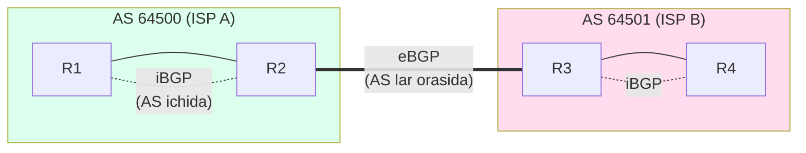
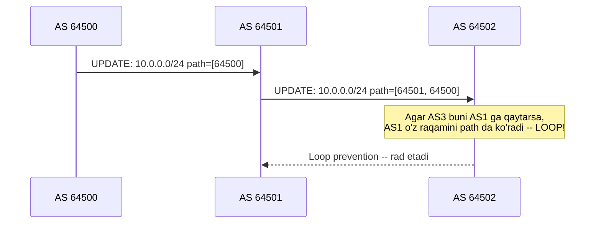
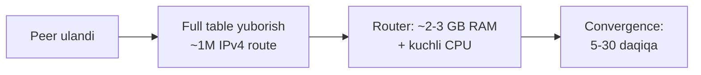
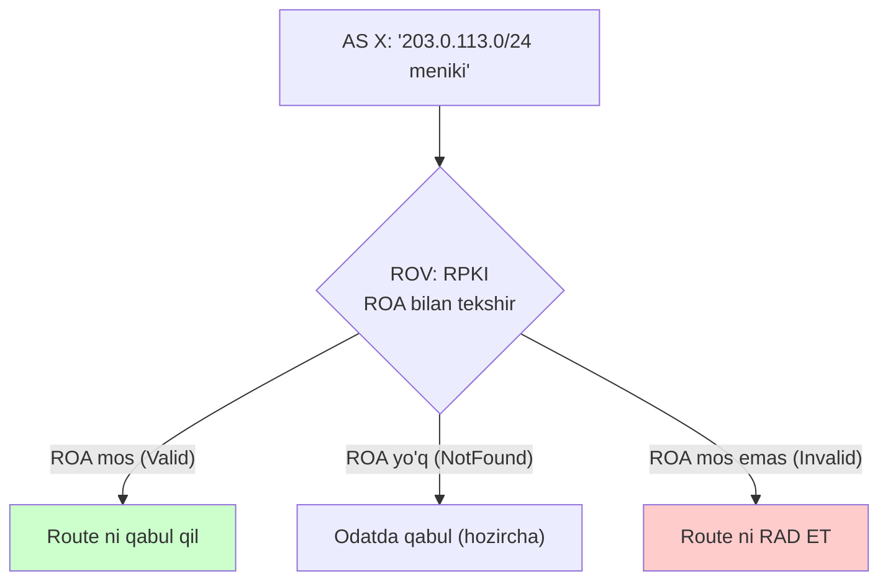

# BGP: Internetning routing tili

## Muammo: OSPF Internet uchun ishlamaydi

OSPF ajoyib -- lekin faqat **bir tashkilot ichida**. Har router butun
topologiyani biladi, SPF hisoblaydi. Endi savol: Internetning **75,000 dan ortiq
tashkilot (AS)** ini bitta OSPF ga qo'yib bo'ladimi?

Yo'q. Har router butun Internet topologiyasini xotirasida saqlashi kerak bo'lardi
-- millionlab tarmoq, doim o'zgarib turadi. CPU, xotira, xavfsizlik jihatidan
imkonsiz. Va yana: Google Cloudflare ning **ichki** topologiyasini ko'rishni
xohlamaydi -- bu maxfiy, biznes masalasi.

Kerak boshqacha protokol: tashkilotlar bir-biriga faqat "men bu tarmoqlarga
yetkaza olaman" deb aytsin, **ichki** tafsilotni yashirsin, va har tashkilot
**o'z siyosati** (kim bilan ish qilish) bilan qaror qilsin. Bu -- **BGP** (Border
Gateway Protocol), Internetning yagona routing tili.

## Analogiya: xalqaro pochta va davlatlar

OSPF -- bir shahar ichidagi navigatsiya: eng qisqa yo'l muhim, hamma xaritani
ko'radi.

BGP -- **davlatlar orasidagi xalqaro pochta**. O'zbekiston pochtasi Yaponiyaga
xat yuborishda Yaponiyaning ichki yo'llarini bilmaydi -- faqat "qaysi
davlatlar orqali o'tadi" ni biladi (masalan O'zbekiston -> Rossiya -> Yaponiya).
Bu -- **AS_PATH**. Va har davlat o'z siyosati bilan qaror qiladi: "men falon
davlat orqali yubormayman" (policy).

> Muhim: bu yerda "eng qisqa" emas, "kimga ishonaman, kim bilan shartnomam bor"
> hal qiladi. BGP tezlik protokoli emas -- **policy** protokoli.

## Sodda ta'rif

> **BGP** -- path-vector routing protokoli, Autonomous System (AS) lar orasida
> ishlaydi. Har route uchun to'liq **AS_PATH** (qaysi AS lar orqali o'tgani) ni
> ko'radi. TCP port 179 ustida ishlaydi. Internetni ishlatadigan protokol.

**AS (Autonomous System)** -- yagona boshqaruv ostidagi tarmoq (masalan bitta
ISP, Google, universitet). Har biri raqamli **AS number** ga ega (masalan Google
= AS15169).

## eBGP va iBGP

BGP ikki xil vaziyatda ishlaydi:



- **eBGP (external BGP)** -- turli AS lar orasida. Default TTL=1 (qo'shni bo'lishi
  kerak). Bu -- Internetni bog'laydigan bo'g'in.
- **iBGP (internal BGP)** -- bitta AS ichida, tashqi route larni AS bo'ylab
  tarqatish uchun. iBGP dan o'rgangan route ni boshqa iBGP peer ga uzatmaydi
  (loop prevention). Shuning uchun iBGP **full mesh** yoki **Route Reflector**
  kerak.

## Path attributes -- BGP qanday tanlaydi

BGP eng qisqa yo'lni emas, **eng yaxshi policy** yo'lini tanlaydi. U bir necha
atributni ketma-ket solishtiradi (birinchi farq g'olib):

| Tartib | Atribut | Qoida |
| ---: | --- | --- |
| 1 | **LOCAL_PREF** | Yuqori afzal (faqat AS ichida) |
| 2 | **AS_PATH** | Qisqaroq afzal |
| 3 | **ORIGIN** | IGP > EGP > Incomplete |
| 4 | **MED** | Past afzal (qo'shniga "kirish" hidi) |
| 5 | **eBGP > iBGP** | Tashqidan o'rganilgani afzal |
| 6 | **IGP metric** | NEXT_HOP gacha eng past |
| 7 | **Router ID** | Eng past (oxirgi chora) |

Eng ko'p ishlatiladigani -- **AS_PATH**: yo'l qancha kam AS orqali o'tsa, shuncha
yaxshi. Bu ham loop ni oldini oladi (o'z AS raqamini ko'rsa, route ni rad etadi).



## Notional machine: Internet routing table hajmi

Har full-BGP router **butun Internet routing table** ni saqlaydi. Bu qanchalik
katta? WebSearch dan (2025-2026):

- **IPv4 table ~1 million route** ga yetdi (2024 da 950K-1M, yiliga ~5.6% o'sadi).
- **IPv6 table** chiziqli o'sib, yiliga ~27,000 prefix qo'shilmoqda (2024 boshida
  ~200K).
- Full table ni saqlash uchun router ~2-3 GB xotira va kuchli CPU talab qiladi.
- Yangi peer ga to'liq table yuborish 5-30 daqiqa oladi (convergence sekin).



Shuning uchun kichik tarmoqlar full table olmaydi -- faqat **default route** olib,
ISP ga ishonadi.

## Worked example: BGP holatini ko'rish

Open-source FRRouting (`vtysh`) da BGP holatini ko'rish:

```bash
router# show ip bgp summary
BGP router identifier 192.168.1.1, local AS number 64500
Neighbor        V   AS   MsgRcvd  MsgSent   State/PfxRcd
10.0.0.2        4 64501    1234     5678   1234

router# show ip bgp 10.0.0.0/24
BGP routing table entry for 10.0.0.0/24
Paths: (2 available, best #1)
  AS path: 64501 64502
  Origin IGP, localpref 100, valid, external, best
```

O'qilishi: `10.0.0.0/24` uchun 2 yo'l bor; eng yaxshisi (`best`) AS_PATH =
`64501 64502` orqali. `State/PfxRcd` = 1234 -- peer dan 1234 ta prefix olindi
(yoki bu holat, masalan `Idle`, `Active`, `Established`).

Cisco da:

```cisco
show ip bgp summary
show ip bgp
show ip bgp 10.0.0.0/24
show bgp neighbors 10.0.0.2
```

BGP neighbor `Established` bo'lsa -- ishlayapti. `Idle`/`Active` -- muammo (TCP
179 yoki AS number mos emas).

## Xavfsizlik: BGP ning eng katta muammosi

BGP butunlay **ishonchga** qurilgan -- default da hech qanday autentifikatsiya
yo'q. Router "men bu prefix ga egaman" desa, qo'shni **ishonadi**. Bu -- BGP
hijacking va route leak ning ildizi.

### Real hodisalar (tarixdan bugungacha)

**2008 -- Pakistan-YouTube.** Pakistan Telecom YouTube ni ichkarida bloklash
uchun more-specific prefix (`/24` vs `/22`) e'lon qildi. Upstream (PCCW) buni
tashqariga chiqardi -- **butun dunyo YouTube trafigini Pakistanga yo'naltirdi**,
2 soat off-line.

**2018 -- Amazon Route 53 hijack.** Hacker lar BGP hijack qilib DNS ni buzdi,
MyEtherWallet credential larini o'g'irladi -- ~$150K Ethereum ketdi.

**2024-iyun -- Cloudflare 1.1.1.1.** Brazil ISP `1.1.1.1/32` ni e'lon qildi,
boshqa AS `/24` leak qildi -- global DNS qisqa muddat ishlamadi.

**2026-yanvar -- Cloudflare route leak.** Miami data-markazidagi policy
xatosi tufayli Cloudflare qo'shnilaridan olgan route larni noto'g'ri qayta
tarqatdi (RFC 7908 bo'yicha Type 3/4 route leak). Faqat **IPv6** trafik ta'sirlandi,
25 daqiqa davom etdi, backbone da tiqilinch va yuqori latency. Sabab: overly
permissive export policy -- juda ko'p ichki IPv6 route tashqariga chiqib ketdi.

> **Dars:** BGP hijack lar ko'pincha **hujum emas**, balki **xato konfiguratsiya**.
> Cloudflare 2026 hodisasi -- klassik misol: bitta noto'g'ri policy o'zgarishi
> global ta'sir qiladi.

### RPKI -- himoya

**RPKI (Resource Public Key Infrastructure)** -- BGP origin ni tekshirish
mexanizmi. Egasi **ROA** (Route Origin Authorization) sertifikat yaratadi: "Bu
prefix faqat AS X tomonidan e'lon qilinishi mumkin".



Holat (2025-2026, WebSearch):

- Global routing table ning **~45-50%** i ROA bilan qoplangan.
- **ROV** (Route Origin Validation -- invalid route larni rad etish) hamma joyda
  emas. Comcast 2024 da qo'shildi.
- Qiziq: **qisman ROV** yangi zaiflik yaratadi -- ROV yoqilmagan AS lar orqali
  trafik "yashirin" divert bo'lishi mumkin (stealth hijack).
- 2025-2026 da hujumchilar RPKI ni **buzmaydi**, balki uni **aylanib** o'tadi --
  masalan upstream provider ning zaif identity tekshiruvini (social engineering)
  ishlatib.

**Himoya to'plami:** (1) o'z prefix laring uchun ROA yarat, (2) ROV yoq (peer
lardan invalid ni rad et), (3) IRR prefix list, (4) monitoring (Cloudflare Radar,
BGPmon). **MANRS** -- ISP lar uchun best-practice qoidalar to'plami.

## Nega BGP OSPF emas -- yakuniy javob

| | OSPF (IGP) | BGP (EGP) |
| --- | --- | --- |
| Ko'rish | butun topologiya | faqat AS_PATH |
| Qaror | eng qisqa (cost) | policy (LOCAL_PREF, AS_PATH...) |
| Masshtab | bitta AS | butun Internet (75K AS) |
| Ichki tafsilot | ochiq | yashirin |
| Convergence | soniyalar | daqiqalar |

BGP ichki tafsilotni yashiradi, policy beradi, va masshtablanadi -- Internet uchun
aynan shu kerak. OSPF tez, lekin butun Internet uchun yaramaydi.

## Predict savoli

iBGP da qiziq qoida bor: iBGP dan o'rgangan route ni boshqa iBGP peer ga
uzatmaysan. AS da 10 router bor.

> Nega iBGP full mesh (har router har birini ko'rishi) talab qiladi, va bu necha
> ulanish? Muammoni qanday yechishadi?

<details>
<summary>Javobni ko'rish</summary>

iBGP loop prevention sodda: iBGP dan o'rgangan route ni **boshqa iBGP peer ga
uzatmaydi**. Demak, agar R1 tashqi route ni oldi, u faqat **to'g'ridan-to'g'ri**
ulangan iBGP peer larga aytadi. Har router hamma boshqasini bevosita ko'rishi
kerak -- **full mesh**.

10 router uchun: N*(N-1)/2 = 10*9/2 = **45 ta iBGP ulanish**. Bu tez o'sadi
(100 router -> 4950). Yechim: **Route Reflector (RR)** -- markaziy router route
larni qayta aks ettiradi, yoki **Confederation**.

</details>

## Ko'p uchraydigan xatolar

⚠️ **"BGP eng qisqa yo'lni tanlaydi"** -- Yo'q. BGP policy protokoli. LOCAL_PREF
AS_PATH dan oldin keladi -- uzunroq yo'l afzal bo'lishi mumkin.

⚠️ **"BGP hijack -- doim hujum"** -- Yo'q. Ko'pchiligi **xato konfiguratsiya**
(route leak). Cloudflare 2026 -- misol.

⚠️ **"RPKI BGP ni to'liq himoya qiladi"** -- Yo'q. RPKI faqat **origin** ni
tekshiradi (kim e'lon qilgan), **path** ni emas. BGPsec hali deploy qilinmagan.

⚠️ **"BGP ni ichki tarmoqda OSPF o'rniga ishlataman"** -- Odatda yo'q. BGP EGP,
sekin convergence. Ichki tarmoq uchun OSPF/EIGRP.

⚠️ **"iBGP dan o'rgangan route ni boshqa iBGP ga uzataman"** -- Yo'q. Bu iBGP
qoidasini buzadi (loop). Full mesh yoki RR kerak.

## Xulosa

- BGP -- path-vector EGP, AS lar orasida, TCP 179, Internetni ishlatadi.
- eBGP (AS lar orasida), iBGP (AS ichida, full mesh yoki RR).
- Eng qisqa emas, **policy** tanlaydi: LOCAL_PREF -> AS_PATH -> ... -> Router ID.
- Full Internet table ~1M IPv4 route, ~2-3 GB RAM, sekin convergence.
- BGP ishonchga qurilgan -- hijack va route leak ga zaif.
- RPKI/ROA origin ni tekshiradi (~50% qoplangan), ROV invalid ni rad etadi.
- Ko'p hodisalar xato konfiguratsiya (route leak), hujum emas.

## 🧠 Eslab qol

- BGP = path vector, AS_PATH ko'radi, TCP 179.
- eBGP = AS lar orasida, iBGP = AS ichida.
- BGP policy tanlaydi, eng qisqa yo'lni emas.
- RPKI origin ni himoya qiladi, path ni emas.
- Ko'p BGP incident = misconfiguration (route leak).

## ✅ O'z-o'zini tekshir (retrieval practice)

**1. Nega Internet OSPF emas, BGP ishlatadi?**

<details>
<summary>Javob</summary>

OSPF link-state -- har router butun topologiyani biladi. 75K AS uchun bu
imkonsiz (xotira, CPU, xavfsizlik). Va tashkilotlar ichki topologiyasini oshkor
qilishni xohlamaydi. BGP path-vector -- har AS faqat AS_PATH va o'z policy sini
biladi, ichki tafsilot yashirin, masshtablanadi.

</details>

**2. `10.0.0.0/24` uchun ikki yo'l bor: A (AS_PATH 3 ta AS, LOCAL_PREF 100), B (AS_PATH 5 ta AS, LOCAL_PREF 200). Qaysi biri tanlanadi?**

<details>
<summary>Javob</summary>

**B** yo'li. LOCAL_PREF (200) AS_PATH dan **oldin** solishtiriladi, va yuqori
LOCAL_PREF afzal. B ning AS_PATH uzunroq bo'lsa ham, LOCAL_PREF 200 > 100 bo'lgani
uchun B yutadi. Bu -- BGP "policy protokoli" ekanligining isboti.

</details>

**3. BGP hijack va route leak orasidagi farq nima?**

<details>
<summary>Javob</summary>

Hijack -- kimdir **o'ziga tegishli bo'lmagan** prefix ni e'lon qiladi (odatda
qasddan yoki xato). Route leak -- route lar **noto'g'ri yo'nalishda** tarqatiladi
(masalan bir peer dan olgan route ni boshqa peer/provider ga uzatib yuborish,
policy buzilishi). Cloudflare 2026 -- route leak misoli.

</details>

**4. RPKI ROA nima tekshiradi va nimani tekshirmaydi?**

<details>
<summary>Javob</summary>

ROA **origin** ni tekshiradi: "bu prefix ni faqat shu AS e'lon qila oladimi?"
Ya'ni kim e'lon qilganini. U **path** ni (AS_PATH ning oraliq qismini) tekshirmaydi
-- shuning uchun path manipulyatsiyasidan himoya qilmaydi. Path himoyasi (BGPsec)
hali keng deploy qilinmagan.

</details>

## 🛠 Amaliyot

**1. Oson (Modify).** Real Internet BGP ni ko'r. Browserda **looking glass**
(masalan `lg.ring.nlnog.net`) yoki Cloudflare Radar oching, `8.8.8.8` uchun
AS_PATH ni toping (u AS15169 -- Google ga yetadi).

**2. O'rta (faded example).** BGP path selection ni to'ldir -- qaysi yutadi:

```text
Route A: LOCAL_PREF 150, AS_PATH [64501, 64502]
Route B: LOCAL_PREF 150, AS_PATH [64503]

G'olib: ___    // TODO: qaysi atribut hal qiladi?
```

<details>
<summary>Hint</summary>

LOCAL_PREF teng (150 = 150), keyingi atribut -- AS_PATH. B qisqaroq (1 AS vs
2 AS), shuning uchun **B yutadi**. Atribut: AS_PATH uzunligi.

</details>

**3. Qiyin (Make).** FRRouting/GoBGP bilan ikkita "AS" (VM) sozlang, eBGP peer
qiling, bittasidan prefix e'lon qiling. Boshqasida `show ip bgp` bilan AS_PATH ni
ko'ring. Keyin RPKI ROA ni simulyatsiya qilib, invalid route ni rad etishni
sinab ko'ring.

## 🔁 Takrorlash

- **Bog'liq oldingi mavzular:** [03-routing-protocols-overview.md](03-routing-protocols-overview.md)
  (IGP vs EGP, path vector), [04-ospf.md](04-ospf.md) (nega OSPF Internetga yaramaydi).
- **Keyingi qadam:** [06-icmp-ping-traceroute.md](06-icmp-ping-traceroute.md) --
  routing muammolarini tashxislash vositalari.
- **Takrorlash jadvali:** ertaga -> 3 kundan keyin -> 1 haftadan keyin "nega BGP,
  OSPF emas" va "RPKI nimani himoya qiladi" ni xotiradan ayt.
- **Feynman testi:** "BGP nima qiladi va nega u policy protokoli?" -- xalqaro
  pochta va davlatlar analogiyasi bilan 3 jumlada tushuntir.

## 📚 Manbalar

- [Route leak incident on January 22, 2026 -- Cloudflare](https://blog.cloudflare.com/route-leak-incident-january-22-2026/)
- [Understanding stealthy BGP hijacking risk in the ROV era -- APNIC](https://blog.apnic.net/2025/10/16/understanding-stealthy-bgp-hijacking-risk-in-the-rov-era/)
- [Why BGP hijacking still threatens global networks -- Qrator](https://qrator.net/blog/details/why-bgp-hijacking-still-threatens-global-networks)
- [BGP in 2025 -- APNIC](https://blog.apnic.net/2026/01/08/bgp-in-2025/)
- [Comcast now blocks BGP hijacking with RPKI -- BleepingComputer](https://www.bleepingcomputer.com/news/security/comcast-now-blocks-bgp-hijacking-attacks-and-route-leaks-with-rpki/)
- RFC 4271 (BGP-4), RFC 6480 (RPKI), RFC 6811 (ROV), RFC 7908 (route leaks)
