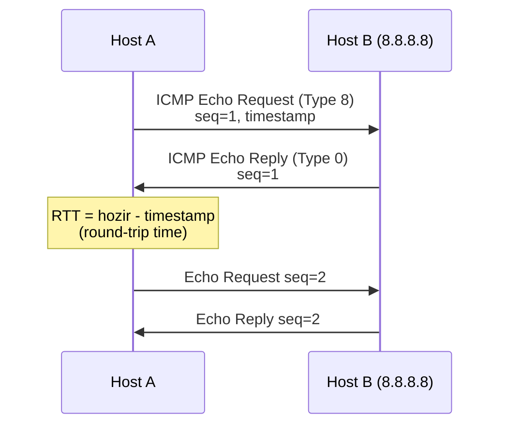
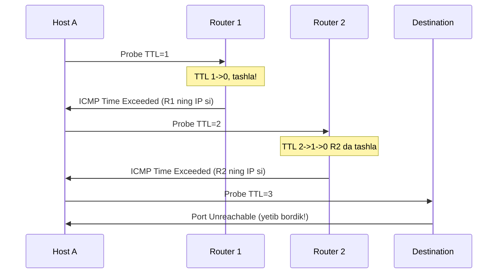
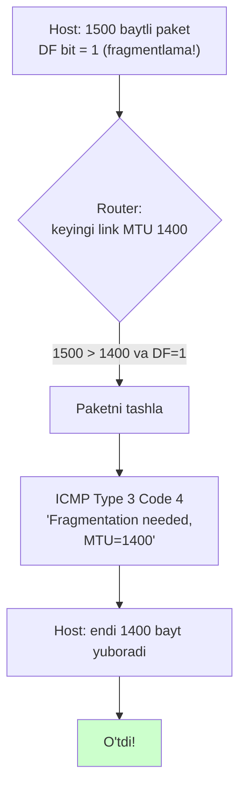

# ICMP, ping va traceroute

## Muammo: paket ketdi, lekin nima bo'ldi?

IP paketni yubording. U yetib bordimi? Yo'lda tashlandimi? Qaysi routerda
to'xtadi? IP protokolining o'zida bu haqda **hech qanday xabar yo'q** -- IP
"yubor va unut" (best effort) prinsipida ishlaydi. Paket yo'qolsa, hech kim senga
"eshit, paketing yo'qoldi" demaydi.

Bu -- katta muammo. Tarmoqni tuzatish (troubleshooting) uchun senga **xabar
qaytaruvchi** mexanizm kerak: "bu manzil yetib bo'lmaydi", "TTL tugadi", "paket
juda katta". Va senga oddiy vosita kerak: "shu manzil tirikmi?" (ping), "paket
qaysi yo'ldan ketadi?" (traceroute).

Bu ishlarni **ICMP** (Internet Control Message Protocol) bajaradi -- IP ning
"xabar va diagnostika" hamrohi.

## Analogiya: pochta qaytarish belgilari

IP -- oddiy pochta: xatni yuborasan, u ketadi. ICMP -- pochtaning **qaytarish
xizmati**:

- Xat manzilga yetmasa, ustiga "**bunday manzil yo'q**" muhri bosilib qaytadi
  (Destination Unreachable).
- Xat juda uzoq aylanib "**muddati tugadi**" bo'lsa, xabar keladi (Time Exceeded).
- Sen "shu odam uydami?" deb tekshirish uchun bo'sh konvert yuborasan, javob
  kelsa -- uyda (ping = Echo Request/Reply).

> ICMP xat tashimaydi (u foydali ma'lumot -- data -- yubormaydi). U faqat
> **tarmoq holati haqida xabar** beradi. U IP ning yordamchisi, mustaqil emas.

## Sodda ta'rif

> **ICMP** -- IP ustidagi xabar va diagnostika protokoli (RFC 792). U xatolar
> haqida xabar beradi (unreachable, TTL tugadi) va diagnostika vositalarini
> (ping, traceroute) ishlatadi. ICMP to'g'ridan-to'g'ri IP ichida yuriladi
> (protocol number 1), TCP/UDP emas.

## ICMP message turlari

Har ICMP xabar **Type** (asosiy tur) va **Code** (aniqroq sabab) ga ega. CCNA
darajasida asosiylari:

| Type | Nomi | Nima uchun |
| ---: | --- | --- |
| 0 | Echo Reply | "Ha, men tirikman" (ping javobi) |
| 3 | Destination Unreachable | "Bu manzil yetib bo'lmaydi" |
| 5 | Redirect | "Yaxshiroq gateway ishlat" |
| 8 | Echo Request | "Tiriksanmi?" (ping so'rovi) |
| 11 | Time Exceeded | "TTL tugadi / paket o'ldi" |

**Type 3 (Unreachable)** ning Code lari juda foydali troubleshooting da:

| Code | Ma'nosi |
| ---: | --- |
| 0 | Net unreachable -- tarmoqqa route yo'q |
| 1 | Host unreachable -- host javob bermayapti |
| 3 | Port unreachable -- port yopiq (traceroute buni ishlatadi) |
| 4 | Fragmentation needed but DF set -- paket katta, PMTUD signali |

## Ping: eng oddiy tekshiruv

Ping shunchaki savol-javob: **Echo Request (Type 8)** yuboradi, **Echo Reply
(Type 0)** kutadi.



Har so'rovga **sequence number** va **timestamp** qo'yiladi. Javob kelganda,
Host A **RTT** (round-trip time) ni hisoblaydi -- paket borib-kelishga ketgan
vaqt. Namuna:

```bash
$ ping 8.8.8.8
64 bytes from 8.8.8.8: icmp_seq=1 ttl=118 time=12.3 ms
64 bytes from 8.8.8.8: icmp_seq=2 ttl=118 time=11.8 ms
```

`time=12.3 ms` -- RTT. `ttl=118` -- javob paketining qolgan TTL si (undan
routerlar sonini taxmin qilish mumkin). Cisco da:

```cisco
R1# ping 8.8.8.8
!!!!!
Success rate is 100 percent (5/5), round-trip min/avg/max = 10/12/15 ms
```

`!` -- muvaffaqiyatli javob, `.` -- timeout, `U` -- destination unreachable.

## Traceroute: TTL tryuki

Traceroute -- eng chiroyli tarmoq tryuki. Savol: "paket qaysi routerlar orqali
o'tadi?" IP paketning o'zi bu ma'lumotni bermaydi. Yechim -- **TTL** (Time To
Live) ni ayyorona ishlatish.

Eslatma: har router paketni forward qilishda **TTL ni 1 ga kamaytiradi**. TTL 0
ga yetsa -- router paketni tashlaydi va manbaga **ICMP Time Exceeded (Type 11)**
yuboradi.

Traceroute buni ishlatadi: **TTL ni ataylab kichik qo'yadi**.



- TTL=1 -> birinchi router tashlaydi, o'z IP sini oshkor qiladi.
- TTL=2 -> ikkinchi router.
- TTL=3, 4... -> har qadamda keyingi router oshkor bo'ladi.
- Oxirida destination ga yetganda -- u **Port Unreachable** (yoki Echo Reply)
  qaytaradi, traceroute tugaydi.

Har hop ni oshkor qilish orqali traceroute butun yo'lni chizadi:

```bash
$ traceroute 8.8.8.8
 1  192.168.1.1     1.1 ms
 2  10.0.0.1        5.6 ms   (ISP birinchi hop)
 3  185.0.0.1       8.9 ms
 4  8.8.8.8         12.3 ms  (yetib bordik)
```

> **Notional machine:** traceroute destination ni "pinglamaydi". U ketma-ket
> ortib boruvchi TTL li probe lar yuboradi va **yo'ldagi har router qaytargan
> Time Exceeded** xabarlaridan xaritani chizadi. Linux/macOS UDP probe ishlatadi,
> Windows (`tracert`) ICMP Echo ishlatadi.

## ICMP va MTU: PMTUD

Endi eng nozik mavzu. **MTU** (Maximum Transmission Unit) -- link o'tkaza
oladigan eng katta paket (Ethernet da odatda 1500 bayt). Yo'lda har xil MTU li
linklar bo'lishi mumkin. Katta paket kichik MTU li linkka kelsa nima bo'ladi?

Ikki yo'l: fragment qilish, yoki **PMTUD** (Path MTU Discovery). Zamonaviy
tarmoqda ikkinchisi ishlatiladi:



1. Host paketni **DF bit** (Don't Fragment) bilan yuboradi.
2. Router keyingi link MTU dan katta paketni ko'radi, DF bor -- fragment qila
   olmaydi.
3. Router paketni tashlaydi va **ICMP Type 3 Code 4** ("Fragmentation Needed,
   DF Set") yuboradi, ichida **yangi MTU** ni aytadi.
4. Host paket hajmini kamaytiradi va qayta yuboradi.

> **Muhim xavfsizlik nuqtasi:** agar firewall **hamma ICMP ni bloklasa**, Type 3
> Code 4 xabari kelmaydi. Host katta paket yuborishda davom etadi, ular jimgina
> tashlanadi -- ulanish "osilib qoladi" (masalan HTTPS sahifa ochilmaydi). Bu --
> **PMTUD blackhole**, juda ko'p uchraydigan real muammo. Xulosa: **ICMP ni
> to'liq bloklamang** -- kamida Type 3 va Type 11 ni o'tkazing.

## Worked example: to'liq troubleshooting

"Internet ishlamayapti" -- klassik muammo. Tartib bilan:

```bash
# 1. Default gateway bormi?
ip route | grep default
# default via 192.168.1.1 dev wlan0

# 2. Gateway tirikmi?
ping 192.168.1.1

# 3. Internet IP ga yetadimi (DNS emas, sof IP)?
ping 8.8.8.8

# 4. DNS ishlayaptimi?
ping google.com

# 5. Qayerda to'xtaydi?
traceroute 8.8.8.8

# 6. MTU muammosimi (katta paket)?
ping -M do -s 1472 8.8.8.8    # DF bit bilan 1500 bayt
```

Diagnostika mantiqiy:

- (2) ishlamadi -> lokal muammo (kabel, gateway, ARP).
- (2) ishladi, (3) yo'q -> routing yoki ISP muammosi -> traceroute ko'r.
- (3) ishladi, (4) yo'q -> **DNS muammosi** (IP ishlaydi, ism yo'q).
- (6) DF bilan katta paket ketmasa -> **MTU/PMTUD** muammosi.

## Predict savoli

Sen `ping 8.8.8.8` qilding -- ishladi. Keyin `ping google.com` -- "Name or
service not known" xatosi.

> Muammo qayerda -- routing, gateway, yoki boshqa joyda?

<details>
<summary>Javobni ko'rish</summary>

Muammo **DNS** da, routing yoki gateway da emas. `ping 8.8.8.8` ishlagani IP
darajasida hamma narsa joyida ekanini isbotlaydi -- gateway, routing, Internet
ulanishi bor. `ping google.com` ismni IP ga aylantira olmadi -- demak DNS
resolver ishlamayapti (noto'g'ri DNS server, `/etc/resolv.conf` xatosi, yoki DNS
port bloklangan). Routing bilan aloqasi yo'q.

</details>

## Ko'p uchraydigan xatolar

⚠️ **"Ping ishlamasa -- host o'lgan"** -- Yo'q. Ko'p host/firewall ICMP Echo ni
**bloklaydi** (xavfsizlik uchun). Host tirik bo'lishi, lekin ping ga javob
bermasligi mumkin.

⚠️ **"Traceroute destination ni pinglaydi"** -- Yo'q. U ortib boruvchi TTL li
probe lar yuboradi va yo'ldagi routerlar qaytargan Time Exceeded dan xarita
chizadi.

⚠️ **"Traceroute da bir hop `* * *` -- yo'l uzilgan"** -- Shart emas. Ba'zi
router lar Time Exceeded qaytarmaydi (rate-limit yoki policy), lekin paketni
forward qiladi. Keyingi hop lar ko'rinsa -- yo'l ishlaydi.

⚠️ **"Firewall da hamma ICMP ni bloklayman -- xavfsizroq"** -- Xato. Type 3 Code 4
bloklansa PMTUD buziladi (blackhole). Kamida unreachable va time-exceeded ni
o'tkaz.

⚠️ **"ICMP -- TCP yoki UDP ustida ishlaydi"** -- Yo'q. ICMP to'g'ridan-to'g'ri IP
ichida (protocol number 1), transport qatlamisiz.

## Xulosa

- ICMP -- IP ning xabar va diagnostika hamrohi (RFC 792, protocol 1).
- Asosiy turlar: Echo Request/Reply (8/0), Unreachable (3), Time Exceeded (11).
- Ping = Echo Request/Reply, RTT va reachability ni o'lchaydi.
- Traceroute = ortib boruvchi TTL, Time Exceeded xabarlaridan yo'lni chizadi.
- PMTUD = DF bit + ICMP Type 3 Code 4 orqali eng katta paket hajmini topadi.
- ICMP ni to'liq bloklash PMTUD blackhole va boshqa muammolarga olib keladi.

## 🧠 Eslab qol

- Ping = Echo Request (8) / Echo Reply (0).
- Traceroute = TTL tryuki + Time Exceeded (11).
- Destination Unreachable = Type 3 (Code 4 = MTU signali).
- ICMP IP ichida ishlaydi, TCP/UDP emas.
- ICMP ni to'liq bloklama -- PMTUD sinadi.

## ✅ O'z-o'zini tekshir (retrieval practice)

**1. Traceroute qanday qilib har bir routerni oshkor qiladi, garchi router lar odatda "men shu yo'ldaman" demasada?**

<details>
<summary>Javob</summary>

Traceroute TTL ni ataylab kichik qo'yadi (1, 2, 3...). Har router forward
qilishda TTL ni 1 kamaytiradi; TTL 0 ga yetsa paketni tashlab, manbaga ICMP Time
Exceeded (o'z IP si bilan) yuboradi. TTL=1 birinchi routerni, TTL=2 ikkinchisini
oshkor qiladi -- shu tarzda butun yo'l chiziladi.

</details>

**2. `ping 8.8.8.8` ishlaydi, `ping google.com` ishlamaydi. Muammo qayerda?**

<details>
<summary>Javob</summary>

DNS da. IP darajasida (routing, gateway, Internet) hamma narsa joyida -- shuning
uchun IP ga ping ketadi. Ismni IP ga aylantirish (DNS) ishlamayapti.

</details>

**3. Firewall hamma ICMP ni bloklagan. HTTPS sahifalar ba'zan osilib qoladi. Nega?**

<details>
<summary>Javob</summary>

PMTUD blackhole. Katta paket kichik MTU li linkka kelganda router ICMP Type 3
Code 4 ("Fragmentation Needed") yuboradi. Firewall uni bloklagani uchun xabar
kelmaydi -- host katta paket yuborishda davom etadi, ular jimgina tashlanadi,
ulanish qotib qoladi.

</details>

**4. Traceroute da 5-hop `* * *` ko'rsatadi, lekin 6-7-hop lar normal. Yo'l uzilganmi?**

<details>
<summary>Javob</summary>

Yo'q. 5-routerdan keyingi hop lar ko'rinayotgani yo'l ishlayotganini bildiradi.
5-router shunchaki Time Exceeded qaytarmagan (rate-limit yoki policy sababli),
lekin paketni forward qilgan. `* * *` har doim uzilishni anglatmaydi.

</details>

## 🛠 Amaliyot

**1. Oson (Modify).** `ping 8.8.8.8` qil, chiqishdagi `ttl=` qiymatini top.
Boshlang'ich TTL odatda 64 yoki 128; `128 - ttl` sizga taxminan nechta router
o'tganini beradi. Traceroute bilan solishtir.

**2. O'rta (faded example).** Troubleshooting mantiqini to'ldir:

```text
ping gateway  -> ishladi
ping 8.8.8.8  -> ISHLAMADI
ping google.com -> ishlamadi (kutilgan)

Muammo qayerda? ___                    // TODO
Keyingi qadam qanday buyruq? ___       // TODO
```

<details>
<summary>Hint</summary>

Muammo: gateway dan tashqarida (routing yoki ISP). Gateway ishlaydi, lekin
Internet IP ga yetmaydi. Keyingi qadam: `traceroute 8.8.8.8` -- qayerda
to'xtashini ko'rish.

</details>

**3. Qiyin (Make).** `tcpdump -i any icmp` (yoki Wireshark, `icmp` filter) ishga
tushir. Boshqa terminalda `traceroute` qil. Capture da ortib boruvchi TTL li
probe larni va qaytgan Time Exceeded (Type 11) xabarlarni top -- traceroute
mexanizmini o'z ko'zing bilan ko'r.

## 🔁 Takrorlash

- **Bog'liq oldingi mavzular:** [01-routing-table-va-longest-prefix.md](01-routing-table-va-longest-prefix.md)
  (routing tekshiruvi), [05-bgp.md](05-bgp.md) (traceroute --as-resolve bilan AS yo'li).
- **Keyingi qadam:** [07-fhrp.md](07-fhrp.md) -- gateway redundancy.
- **Takrorlash jadvali:** ertaga -> 3 kundan keyin -> 1 haftadan keyin
  "traceroute TTL tryuki" va "PMTUD blackhole" ni xotiradan tushuntir.
- **Feynman testi:** "Traceroute qanday ishlaydi?" -- TTL ni kichik qo'yish va
  Time Exceeded xabarlarini yig'ish bilan 3 jumlada tushuntir.

## 📚 Manbalar

- [What is ICMP? The Protocol Behind Ping and Traceroute -- SpeedtestHQ](https://www.speedtesthq.com/guides/fundamentals/what-is-icmp)
- [Path MTU Discovery -- Wikipedia](https://en.wikipedia.org/wiki/Path_MTU_Discovery)
- [How to Understand Path MTU Discovery Using ICMP -- OneUptime](https://oneuptime.com/blog/post/2026-03-20-path-mtu-discovery-icmp/view)
- [Internet Control Message Protocol -- Wikipedia](https://en.wikipedia.org/wiki/Internet_Control_Message_Protocol)
- RFC 792 (ICMP), RFC 1191 (PMTUD)
