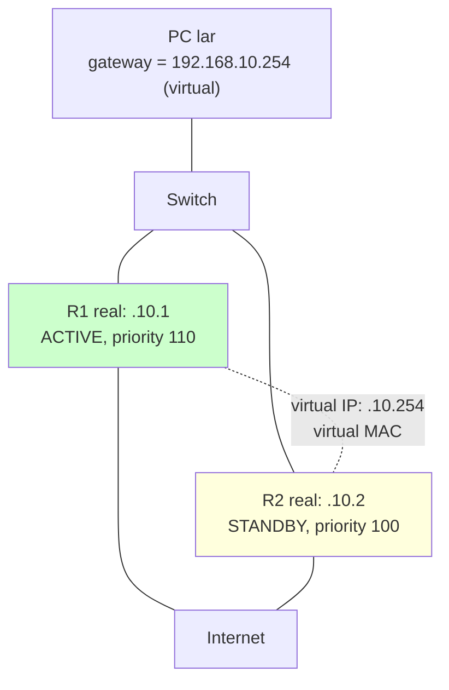
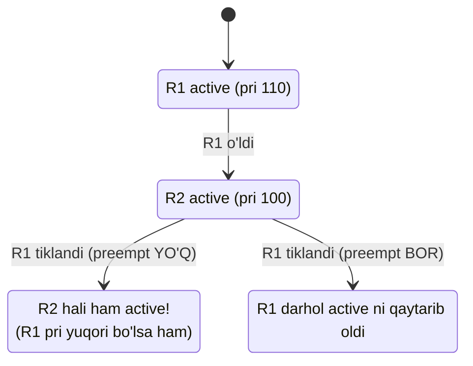
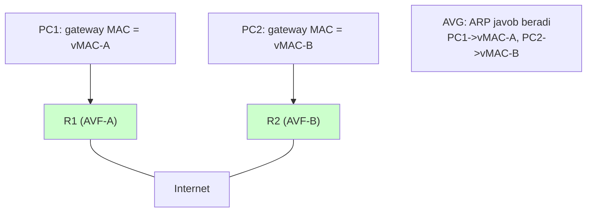
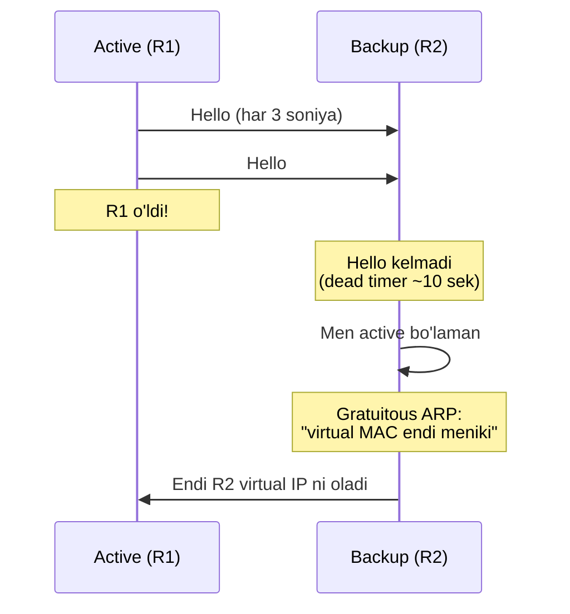

# FHRP: HSRP, VRRP, GLBP

## Muammo: gateway o'lsa, butun LAN o'ladi

PC ning tarmoq sozlamalarida bitta **default gateway** bor -- masalan
`192.168.10.1`. Boshqa subnetga chiqadigan har paket shu gateway ga ketadi
(oldingi modullardan eslaysan: ARP va default gateway).

Endi savol: agar shu gateway (router) o'lsa nima bo'ladi? PC boshqa routerni
**avtomatik tanlamaydi**. Uning sozlamasida faqat bitta IP yozilgan. Natija:
butun LAN Internetdan uziladi -- garchi yonida ishlab turgan ikkinchi router
bo'lsa ham.

Ikkita router qo'yish yetarli emas -- PC ikkovi haqida bilmaydi. Kerak: ikki
router **bitta virtual gateway** bo'lib ko'rinsin, biri o'lsa ikkinchisi
**bilinmasdan** o'rnini bossin. Bu -- **FHRP** (First Hop Redundancy Protocol).

## Analogiya: ish stoli va navbatchi xodim

Tasavvur qil: mijozlar xizmati stoli, ustida yozuv "**Murojaat: 101-xona**"
(bu -- virtual IP). Mijozlar doim 101-xonaga boradi -- kim o'tirganini bilmaydi.

- Bugun Ali navbatchi (**Active/Master**), u 101-xonada o'tiradi.
- Vali zaxira (**Standby/Backup**), yonida kutadi.
- Ali kasal bo'lib ketsa, Vali darhol 101-xonaga o'tiradi. Mijozlar hech narsani
  sezmaydi -- ular baribir "101-xona" ga keladi.

> Virtual IP -- "101-xona" yozuvi. Virtual MAC -- xonaning eshigi. Mijozlar
> (PC lar) doim virtual manzilga murojaat qiladi, ichkarida kim o'tirgani
> (qaysi router active) ular uchun ahamiyatsiz.

## Sodda ta'rif

> **FHRP** -- bir necha routerni bitta **virtual IP** va **virtual MAC** ostida
> birlashtiruvchi protokol. Host lar default gateway sifatida virtual IP ni
> ishlatadi. Active router o'lsa, backup bilinmasdan virtual gateway rolini
> oladi.

## Diagramma: virtual gateway



PC lar `192.168.10.254` (virtual) ni gateway deb biladi. R1 (yuqori priority)
active -- shu IP ga kelgan trafikni u qabul qiladi. R1 o'lsa, R2 virtual IP va
MAC ni oladi.

## HSRP -- Cisco standarti

**HSRP** (Hot Standby Router Protocol) -- Cisco proprietary, eng ko'p tarqalgan.
**Active** va **Standby** tushunchalari.

```cisco
! --- R1 (active bo'lsin) ---
R1(config)# interface GigabitEthernet0/1
R1(config-if)# ip address 192.168.10.1 255.255.255.0
R1(config-if)# standby 10 ip 192.168.10.254
R1(config-if)# standby 10 priority 110
R1(config-if)# standby 10 preempt

! --- R2 (standby) ---
R2(config)# interface GigabitEthernet0/1
R2(config-if)# ip address 192.168.10.2 255.255.255.0
R2(config-if)# standby 10 ip 192.168.10.254
R2(config-if)# standby 10 priority 100
R2(config-if)# standby 10 preempt
```

Muhim joylar:

- `10` -- HSRP **group number** (ikki router bir xil bo'lishi kerak).
- `192.168.10.254` -- virtual IP (PC gateway i).
- Yuqori **priority** (110) li router active bo'ladi. Default priority 100.
- `preempt` -- **eng muhim**: busiz, yuqori priority li router qaytib kelganda
  active rolini avtomatik **qaytarib olmaydi**.

Tekshirish:

```cisco
R1# show standby brief
Interface   Grp  Pri P State    Active          Standby         Virtual IP
Gi0/1       10   110 P Active   local           192.168.10.2    192.168.10.254
```

`P` -- preempt yoqilgan, `State Active` -- R1 hozir active.

## Preempt -- nega muhim?

`preempt` bo'lmaganda qanday muammo? Ssenariy:



`preempt` siz: R1 (kuchli router) qaytsa ham, R2 active bo'lib qolaveradi. Agar
sen "kuchli router doim active bo'lsin" desang -- `preempt` shart.

## Interface tracking -- yashirin muammo

Nozik holat: R1 LAN tomonda active, lekin uning **WAN uplinki** (Internetga
chiqish) uzilgan. R1 hali active -- trafikni oladi, lekin uni Internetga
uzatolmaydi. Trafik **qora tuynukka** ketadi.

Yechim: uplink ni **track** qilish. Uplink o'lsa, R1 o'z priority sini
kamaytiradi, R2 active bo'ladi:

```cisco
R1(config)# interface GigabitEthernet0/1
R1(config-if)# standby 10 track GigabitEthernet0/0 30
```

`GigabitEthernet0/0` (uplink) o'lsa, R1 priority si 30 ga **kamayadi**
(110 -> 80). Endi R2 (100) yuqoriroq -- u active bo'ladi va trafikni o'z ishlab
turgan uplinki orqali chiqaradi.

> **Dars:** LAN tomonda tirik bo'lish yetarli emas. Router butun **yo'l**ni (LAN
> va WAN) ishlab turganda active bo'lishi kerak. Tracking shuni ta'minlaydi.

## VRRP -- ochiq standart

**VRRP** (Virtual Router Redundancy Protocol) -- ochiq standart (RFC 5798,
VRRPv3). Cisco bo'lmagan qurilmalar bilan ishlashda muhim. **Master** va
**Backup** tushunchalari (HSRP ning Active/Standby ekvivalenti).

```cisco
R1(config)# interface GigabitEthernet0/1
R1(config-if)# ip address 192.168.10.1 255.255.255.0
R1(config-if)# vrrp 10 ip 192.168.10.254
R1(config-if)# vrrp 10 priority 110
```

VRRP da preempt **default yoqilgan** (HSRP dan farqi). Tekshirish:

```cisco
show vrrp brief
```

> **2025 nozik nuqta:** eski VRRP (VRRPv2) IPv6 ni qo'llab-quvvatlamaydi -- IPv6
> uchun **VRRPv3** kerak. HSRP va GLBP ham IPv6 ni qo'llaydi. Zamonaviy dual-stack
> tarmoqda VRRPv3 IPv6 uchun HSRPv2 dan toza ishlaydi.

## GLBP -- redundancy + load balancing

**GLBP** (Gateway Load Balancing Protocol) -- Cisco proprietary. HSRP/VRRP dan
farqi: u faqat redundancy emas, balki **load balancing** ham beradi.

Muammo: HSRP/VRRP da faqat **bitta** router active -- ikkinchisi bekor turadi
(yarim resurs isrof). GLBP ikkalasidan ham foydalanadi.

Sirri: bitta virtual IP, lekin **bir necha virtual MAC**. GLBP rollari:

- **AVG** (Active Virtual Gateway) -- ARP so'rovlarga javob beradi, har PC ga
  navbatma-navbat **turli virtual MAC** beradi.
- **AVF** (Active Virtual Forwarder) -- har router o'z MAC iga kelgan trafikni
  forward qiladi.



Natija: PC1 R1 orqali, PC2 R2 orqali chiqadi -- **ikki router ham ishlaydi**,
trafik taqsimlanadi.

```cisco
R1(config)# interface GigabitEthernet0/1
R1(config-if)# glbp 10 ip 192.168.10.254
R1(config-if)# glbp 10 priority 110
```

## Uch protokolni solishtirish

| Protokol | Turi | Rollar | Load balancing | IPv6 |
| --- | --- | --- | --- | --- |
| HSRP | Cisco | Active/Standby | Yo'q (bitta active) | Ha (v2) |
| VRRP | Standard | Master/Backup | Yo'q (bitta master) | Ha (VRRPv3) |
| GLBP | Cisco | AVG/AVF | **Ha** | Ha |

Qachon nima (2025 amaliyoti):

- **HSRP** -- Cisco muhitida oddiy redundancy, eng ko'p tarqalgan (default).
- **VRRP** -- ochiq standart kerak bo'lsa (ko'p-vendorli), yoki dual-stack IPv6.
- **GLBP** -- ikkala router ham ishlashi kerak bo'lsa (bandwidth muhim).

## Notional machine: failover aslida qanday

Active router muntazam **Hello** yuboradi ("men tirikman"). Backup uni tinglaydi.
Hello uzilsa (default ~3 x Hello interval), backup "active o'ldi" deb qaror
qiladi va rolni oladi:



Muhim: backup active bo'lganda **gratuitous ARP** yuboradi -- switch larga
"virtual MAC endi bu portda" deb bildiradi, shunda trafik yangi active ga oqadi.
Virtual IP va MAC **o'zgarmaydi** -- PC lar hech narsani sezmaydi.

## Predict savoli

R1 va R2 HSRP group 10 da. R1 priority 110 (active), R2 priority 100. Ikkovida
`preempt` **yo'q**. R1 o'ldi, R2 active bo'ldi. Keyin R1 tiklandi.

> R1 yana active bo'ladimi? Nega?

<details>
<summary>Javobni ko'rish</summary>

**Yo'q**, R1 active bo'lmaydi -- R2 active bo'lib qolaveradi, garchi R1 priority
si yuqori (110 > 100) bo'lsa ham. Sababi: `preempt` yo'q. Preempt siz, tiklangan
yuqori priority li router active rolini **avtomatik qaytarib olmaydi**. R1 faqat
`standby` bo'lib kutadi.

Agar "kuchli router doim active bo'lsin" xohlansa -- ikkovida ham `standby 10
preempt` yozilishi kerak edi.

</details>

## Ko'p uchraydigan xatolar

⚠️ **"PC gateway iga router real IP ni yozaman"** -- Yo'q. FHRP ishlashi uchun PC
gateway i **virtual IP** bo'lishi kerak (masalan .254), real router IP (.1/.2) emas.

⚠️ **"Preempt kerak emas"** -- Ehtiyot bo'l. Preempt siz kuchli router qaytganda
active rolini olmaydi. Agar aynan shu router active bo'lsin desang -- preempt yoq.

⚠️ **"LAN tomonda active bo'lsa yetarli"** -- Yo'q. Uplink o'lgan bo'lsa, trafik
qora tuynukka ketadi. **Tracking** bilan uplink ni kuzat.

⚠️ **"HSRP va VRRP group number/virtual IP har xil bo'lishi mumkin"** -- Yo'q.
Ikki routerda group number va virtual IP **bir xil** bo'lishi shart.

⚠️ **"VRRPv2 IPv6 ni qo'llaydi"** -- Yo'q. IPv6 uchun VRRPv3 kerak.

⚠️ **"FHRP routing protokol o'rnini bosadi"** -- Yo'q. FHRP faqat host ning
birinchi gateway muammosini yechadi. Routerlar orasidagi routing uchun static
route yoki OSPF baribir kerak.

## Xulosa

- FHRP host ning default gateway redundancy muammosini yechadi.
- Ikki+ router bitta **virtual IP + virtual MAC** ostida birlashadi.
- PC gateway sifatida **virtual IP** ni ishlatadi (real router IP emas).
- HSRP (Cisco, Active/Standby), VRRP (standard, Master/Backup), GLBP (Cisco + LB).
- `preempt` -- kuchli router qaytganda active rolini qaytarib oladimi.
- Interface tracking -- uplink o'lsa priority ni kamaytiradi (qora tuynuk oldini oladi).
- Faqat GLBP load balancing beradi (bir necha virtual MAC).

## 🧠 Eslab qol

- PC gateway = virtual IP (.254), real IP emas.
- Yuqori priority = active/master.
- Preempt siz kuchli router qaytsa ham active bo'lmaydi.
- Tracking uplink ni kuzatadi (qora tuynuk oldini oladi).
- GLBP = redundancy + load balancing.

## ✅ O'z-o'zini tekshir (retrieval practice)

**1. PC ning gateway iga router real IP si (192.168.10.1) yozilgan. FHRP sozlangan, virtual IP 192.168.10.254. Muammo bormi?**

<details>
<summary>Javob</summary>

Ha, muammo bor. R1 (real .1) o'lsa, PC failover dan foyda ko'rmaydi -- uning
gateway i aynan o'lgan router ga bog'langan. PC gateway i **virtual IP (.254)**
bo'lishi kerak -- shunda R1 o'lsa, R2 virtual IP ni olib, PC uzluksiz ishlaydi.

</details>

**2. R1 uplinki o'ldi, lekin u hali HSRP active. Trafikga nima bo'ladi va yechim nima?**

<details>
<summary>Javob</summary>

Trafik R1 ga keladi, lekin uplink o'lgani uchun Internetga chiqolmaydi -- qora
tuynukka ketadi. Yechim: **interface tracking**. Uplink o'lsa, R1 priority sini
kamaytiradi, R2 active bo'lib, o'z ishlaydigan uplinki orqali trafikni chiqaradi.

</details>

**3. HSRP/VRRP da faqat bitta router active. GLBP qanday qilib ikkalasidan ham foydalanadi?**

<details>
<summary>Javob</summary>

GLBP bitta virtual IP, lekin **bir necha virtual MAC** ishlatadi. AVG rolidagi
router ARP so'rovlariga javob berib, har PC ga navbatma-navbat turli virtual MAC
beradi. Shunday qilib PC1 R1 orqali, PC2 R2 orqali chiqadi -- trafik ikki router
orasida taqsimlanadi.

</details>

**4. Nima uchun failover paytida backup router gratuitous ARP yuboradi?**

<details>
<summary>Javob</summary>

Virtual MAC endi yangi (backup) router portida ekanini switch larga bildirish
uchun. Gratuitous ARP switch MAC address table ni yangilaydi, shunda virtual IP
ga kelgan trafik yangi active router ga oqadi. Virtual IP/MAC o'zgarmaydi, faqat
qaysi port orqali chiqishi o'zgaradi.

</details>

## 🛠 Amaliyot

**1. Oson (Modify).** Yuqoridagi HSRP konfiguratsiyasida R2 ni active qil: R2
priority sini R1 dan yuqori (masalan 120) qo'y va ikkovida preempt borligiga
ishonch hosil qil. `show standby brief` bilan tekshir.

**2. O'rta (faded example).** Uplink tracking qo'sh -- to'ldir:

```cisco
R1(config)# interface GigabitEthernet0/1
R1(config-if)# standby 10 priority 110
R1(config-if)# standby 10 preempt
R1(config-if)# standby 10 track ___ ___    // TODO: uplink interface va kamayish qiymati
```

<details>
<summary>Hint</summary>

Uplink interface (masalan `GigabitEthernet0/0`) va priority ni R2 dan pastga
tushiradigan kamayish (masalan `20`, chunki 110-20=90 < 100). To'g'ri javob:
`standby 10 track GigabitEthernet0/0 20`.

</details>

**3. Qiyin (Make).** Packet Tracer da 2 router + switch + 2 PC qur. HSRP sozla
(virtual IP .254). PC larda gateway ni .254 qil. R1 ni active qilib, `ping`
davomiyligini boshla, keyin R1 ni o'chir -- ping qancha paketdan keyin tiklanadi
(failover time)? GLBP ga o'zgartirib, ikki router ham ishlaganini kuzat.

## 🔁 Takrorlash

- **Bog'liq oldingi mavzular:** [01-routing-table-va-longest-prefix.md](01-routing-table-va-longest-prefix.md)
  (gateway va routing asosi), [03-routing-protocols-overview.md](03-routing-protocols-overview.md).
- **Keyingi qadam:** [08-ipv6-routing.md](08-ipv6-routing.md) -- IPv6 routing.
- **Takrorlash jadvali:** ertaga -> 3 kundan keyin -> 1 haftadan keyin "preempt
  nima qiladi" va "GLBP nega HSRP dan farq qiladi" ni xotiradan ayt.
- **Feynman testi:** "FHRP nima uchun kerak?" -- navbatchi xodim va "101-xona"
  virtual manzil analogiyasi bilan 3 jumlada tushuntir.

## 📚 Manbalar

- [HSRP vs VRRP vs GLBP: The FHRP Comparison -- PingLabz](https://www.pinglabz.com/hsrp-vs-vrrp-vs-glbp/)
- [HSRP vs VRRP vs GLBP -- Pivit Global](https://info.pivitglobal.com/resources/hsrp-vs-vrrp-vs-glbp)
- [First Hop Redundancy Protocols -- IPCisco](https://ipcisco.com/lesson/first-hop-redundancy-protocols/)
- RFC 5798 -- VRRPv3
