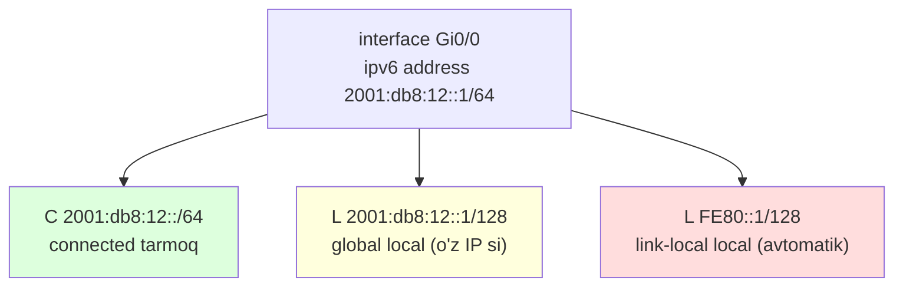
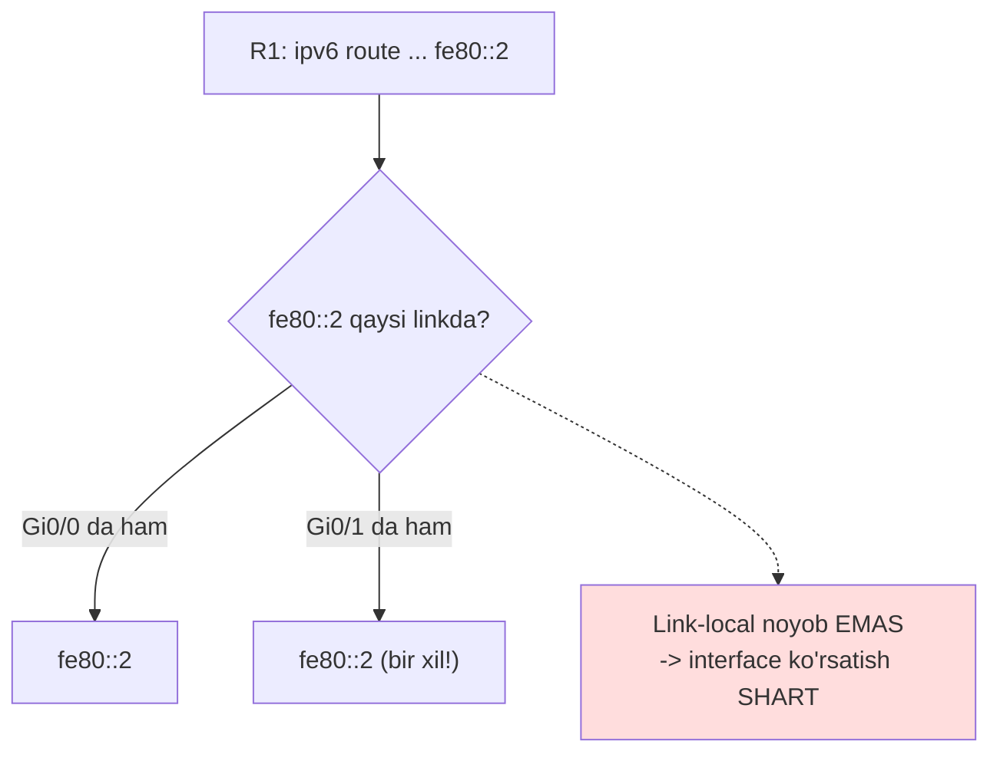
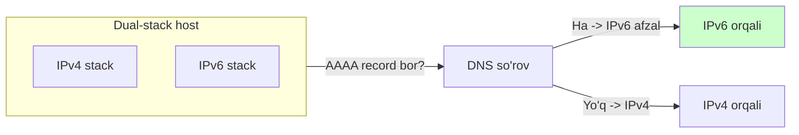

# IPv6 routing va dual-stack

## Muammo: IPv4 tugab bormoqda, lekin routing bilishmi?

IPv4 manzillar tugadi -- bu haqda 02-modulda gaplashildi. Dunyo IPv6 ga o'tmoqda:
WebSearch dan (2025), IPv6 trafigi ba'zi o'lchovlar bo'yicha 50% dan oshdi;
Google ga IPv6 trafik ~43%, AQSh ~50%, Fransiya 80%, Germaniya 75%, Hindiston 74%.

Yaxshi xabar: **routing g'oyasi bir xil**. Router destination IPv6 ga qaraydi,
routing table dan eng mos prefix ni topadi, next-hop ga yuboradi. Longest prefix
match, AD, metric -- hammasi IPv4 dagidek ishlaydi.

Yomon xabar: bir necha muhim **farq** bor va ular ko'p xato keltirib chiqaradi --
`ipv6 unicast-routing` ni unutish, link-local next-hop, `::/0` (IPv4 da
`0.0.0.0/0` emas). Bu darsda shu farqlarga e'tibor qaratamiz.

## Analogiya: yangi telefon raqami tizimi

IPv6 ni tasavvur qil -- shahar telefon raqamlarini 7 xonadan 15 xonaga
o'zgartirdi (chunki eski raqamlar tugadi). Qo'ng'iroq qilish qoidasi **bir xil**:
raqamni terasan, stansiya ulaydi. Lekin:

- Raqamlar uzunroq, boshqacha yoziladi.
- Har telefonda avtomatik "ichki uy raqami" (link-local) paydo bo'ladi -- faqat
  bir bino ichida ishlaydi.
- O'tish davrida ko'p telefon **ikki raqamga** ega -- eski va yangi (dual-stack).

> Farqi shundaki: eski (IPv4) va yangi (IPv6) tizim **bir vaqtda** ishlaydi.
> Ko'pchilik telefon ikkalasiga ham javob beradi -- bu **dual-stack**. Bu eng
> tavsiya etilgan o'tish usuli (2025).

## Sodda ta'rif

> **IPv6 routing** -- IPv4 dagidek: destination IPv6 ga qarab, longest prefix
> match bilan eng mos route tanlab, next-hop ga forward qilish. **Dual-stack** --
> qurilma IPv4 va IPv6 ni bir vaqtda, nativ ravishda ishlatishi.

Asosiy farqlar jadvali:

| | IPv4 | IPv6 |
| --- | --- | --- |
| Default route | `0.0.0.0/0` | `::/0` |
| Host route | `/32` | `/128` |
| ARP | bor | yo'q (o'rniga NDP) |
| Link-local | kam ishlatiladi | juda muhim (`FE80::/10`) |
| Routing yoqish | avtomatik | `ipv6 unicast-routing` kerak |

## Birinchi qadam: routing ni yoqish

IPv4 da router avtomatik forward qiladi. IPv6 da esa **alohida yoqish kerak**:

```cisco
R1(config)# ipv6 unicast-routing
```

Bu buyruq bo'lmasa, router IPv6 interfeyslariga ega bo'lishi mumkin, lekin IPv6
paketlarni **forward qilmaydi** -- shunchaki host bo'lib qoladi.

> **Eng ko'p uchraydigan IPv6 xatosi:** `ipv6 unicast-routing` ni unutish. Hamma
> narsa to'g'ri ko'rinadi, interfeyslar up, IP lar bor -- lekin paketlar o'tmaydi.

## Interface va routing table

```cisco
R1(config)# interface GigabitEthernet0/0
R1(config-if)# ipv6 address 2001:db8:12::1/64
R1(config-if)# no shutdown
```

Diqqat: global unicast IP bilan birga **avtomatik link-local** manzil ham paydo
bo'ladi (`FE80::/10` diapazonida). `show ipv6 route`:

```cisco
R1# show ipv6 route
C   2001:DB8:12::/64 [0/0]
     via GigabitEthernet0/0, directly connected
L   2001:DB8:12::1/128 [0/0]
     via GigabitEthernet0/0, receive
L   FE80::1/128 [0/0]
     via GigabitEthernet0/0, receive
S   2001:DB8:20::/64 [1/0]
     via FE80::2, GigabitEthernet0/0
```

Kodlar tanish: `C` (connected), `L` (local `/128`), `S` (static), `O` (OSPFv3).
E'tibor ber: `L` route lar `/128` (IPv4 dagi `/32` ekvivalenti).

Bir interfeysga IPv6 manzil bergani bilan router uchta route yaratadi -- bu IPv4
dan farq (u yerda ikkita: C va L):



Uchinchi route -- **link-local** (`FE80::`) -- avtomatik paydo bo'ladi va IPv6
ning o'ziga xosligi; keyingi bo'limda uning next-hop dagi rolini ko'ramiz.

## IPv6 static route -- uch usul

### 1. Global next-hop bilan

```cisco
R1(config)# ipv6 route 2001:db8:20::/64 2001:db8:12::2
```

Oddiy, IPv4 dagidek.

### 2. Exit interface bilan

```cisco
R1(config)# ipv6 route 2001:db8:20::/64 GigabitEthernet0/0
```

### 3. Link-local next-hop bilan (interface MAJBURIY)

```cisco
R1(config)# ipv6 route 2001:db8:20::/64 GigabitEthernet0/0 fe80::2
```

Nega link-local da interface **shart**? Chunki link-local manzil faqat **bitta
link ichida** noyob -- turli interfeyslarda bir xil `fe80::2` bo'lishi mumkin.
Router qaysi linkdan chiqishni bilishi kerak.



## IPv6 default route

Default route -- `::/0` (IPv4 da `0.0.0.0/0` edi, IPv6 da EMAS):

```cisco
R1(config)# ipv6 route ::/0 2001:db8:12::2
```

Link-local next-hop bilan:

```cisco
R1(config)# ipv6 route ::/0 GigabitEthernet0/0 fe80::2
```

> **Klassik xato:** IPv6 default route ni `0.0.0.0/0` deb yozish. To'g'risi
> `::/0`. IPv4 sintaksisini IPv6 ga ko'chirma.

## Floating IPv6 static va longest prefix match

IPv4 dagi hamma tushunchalar ishlaydi. Floating static (yuqori AD li backup):

```cisco
R1(config)# ipv6 route 2001:db8:30::/64 2001:db8:99::2 200
```

Longest prefix match ham xuddi shunday:

```text
2001:db8::/32        via ISP        (eng umumiy)
2001:db8:10::/48     via R2         (aniqroq)
2001:db8:10:5::/64   via R3         (eng aniq)
```

- `2001:db8:10:5::100` -> `/64` (eng aniq mos).
- `2001:db8:10:9::100` -> `/48` (`/64` ga mos kelmaydi).

## Dual-stack -- ikki tizim birga

Dual-stack -- eng tavsiya etilgan o'tish usuli (WebSearch, 2025): har qurilma,
link, ilova IPv4 va IPv6 ni **bir vaqtda** ishlatadi. Tunnel yo'q, tarjima yo'q --
har protokol nativ ravishda uchidan uchiga route qilinadi.



Muhim: dual-stack da **IPv6 default afzal** (ataylab -- IPv6 ni rag'batlantirish
va NAT overhead siz tezroq). Host DNS da AAAA record (IPv6) topsa, IPv6 ni
tanlaydi; bo'lmasa IPv4 ga qaytadi.

**Best practice (2025):** "Inside Out" usuli -- avval tarmoq yadrosini
dual-stack qil, routing va tajriba yig'ilgach, chekka access switch/AP larni
IPv6 ga o't. Prefix rejasini oldindan tuz, AAAA record e'lon qil, firewall va
monitoring ikki protokolni ham qamrasin.

## Notional machine: nega /64 muhim

IPv6 LAN prefix i deyarli har doim **/64**. Nega aynan shu? Chunki IPv6 ning
**SLAAC** (StateLess Address AutoConfiguration) mexanizmi host manzilining
oxirgi 64 bitini o'zi yasaydi (interface ID). Agar prefix `/64` dan uzun bo'lsa
(masalan `/80`), host uchun yetarli bit qolmaydi -- **SLAAC ishlamaydi**.

```text
2001:db8:12:0000 : xxxx:xxxx:xxxx:xxxx
|<---- /64 prefix ---->|<-- host o'zi yasaydi (64 bit) -->|
```

Shuning uchun IPv6 LAN da `/64` dan boshqa uzunlik ishlatma -- avtomatik
konfiguratsiya buziladi.

## Worked example: dual-stack routing

```cisco
! --- IPv6 routing yoqamiz ---
R1(config)# ipv6 unicast-routing

! --- Interface: dual-stack (IPv4 + IPv6) ---
R1(config)# interface GigabitEthernet0/0
R1(config-if)# ip address 192.168.12.1 255.255.255.0
R1(config-if)# ipv6 address 2001:db8:12::1/64
R1(config-if)# no shutdown

! --- Ikki protokolga alohida route ---
R1(config)# ip route 192.168.20.0 255.255.255.0 192.168.12.2
R1(config)# ipv6 route 2001:db8:20::/64 2001:db8:12::2
```

Har protokol o'z routing table ini yuritadi. Tekshirish:

```cisco
show ip route              # IPv4 table
show ipv6 route            # IPv6 table
show ipv6 interface brief
show ipv6 neighbors        # NDP (ARP o'rniga)
ping ipv6 2001:db8:20::10
traceroute ipv6 2001:db8:20::10
```

## Troubleshooting tartibi

```cisco
show ipv6 interface brief          # interfeys up + IPv6 bormi
show ipv6 route 2001:db8:20::10    # destination ga route bormi
show ipv6 neighbors                # link-local next-hop hal bo'lganmi
ping ipv6 <next-hop>               # next-hop reachable mi
```

Tartib:

1. `ipv6 unicast-routing` yoqilganmi?
2. Interfeys up/up va IPv6 manzil bormi?
3. Destination prefix routing table da bormi?
4. Next-hop reachable mi? (link-local bo'lsa interface to'g'rimi?)
5. Teskari route bormi?

## Predict savoli

R1 da IPv6 sozlangan, interfeyslar up, manzillar bor. Lekin R1 dagi bir tarmoqdan
boshqasiga IPv6 paketlar o'tmayapti. IPv4 esa ishlaydi.

> Eng ehtimolli sabab nima?

<details>
<summary>Javobni ko'rish</summary>

**`ipv6 unicast-routing` yoqilmagan**. Bu -- eng ko'p uchraydigan IPv6 xatosi.
Bu buyruqsiz router IPv6 interfeyslariga ega bo'ladi, o'zi IPv6 da gaplasha
oladi, lekin IPv6 paketlarni bir interfeysdan boshqasiga **forward qilmaydi** --
router emas, host bo'lib qoladi.

IPv4 ishlaydi, chunki IPv4 forwarding avtomatik yoqilgan. Yechim:
`R1(config)# ipv6 unicast-routing`.

</details>

## Ko'p uchraydigan xatolar

⚠️ **"IPv6 da ham forwarding avtomatik"** -- Yo'q. `ipv6 unicast-routing` ni
qo'lda yoqish kerak.

⚠️ **"IPv6 default route = 0.0.0.0/0"** -- Yo'q. To'g'risi `::/0`.

⚠️ **"Link-local next-hop uchun interface kerak emas"** -- Yo'q. Link-local
noyob emas -- interface **majburiy**.

⚠️ **"IPv6 da ARP bor"** -- Yo'q. IPv6 ARP o'rniga **NDP** (Neighbor Discovery
Protocol) ishlatadi. `show ipv6 neighbors`.

⚠️ **"LAN prefix ni /80 qilsam bo'ladi"** -- Yo'q. IPv6 LAN da `/64` kerak,
aks holda SLAAC ishlamaydi.

⚠️ **"Dual-stack da IPv4 afzal"** -- Odatda yo'q. Default da **IPv6 afzal** (AAAA
record bo'lsa), keyin IPv4 ga qaytadi.

## Xulosa

- IPv6 routing g'oyasi IPv4 bilan bir xil: longest prefix match, AD, metric.
- IPv6 forwarding uchun `ipv6 unicast-routing` ni **qo'lda yoqish** kerak.
- Default route `::/0`, host route `/128` (IPv4: `0.0.0.0/0`, `/32`).
- Link-local next-hop uchun exit interface **majburiy** (noyob emas).
- IPv6 ARP o'rniga NDP; `show ipv6 neighbors`.
- LAN prefix `/64` -- SLAAC uchun shart.
- Dual-stack -- IPv4+IPv6 birga, tavsiya etilgan o'tish usuli, IPv6 default afzal.

## 🧠 Eslab qol

- Avval `ipv6 unicast-routing` -- busiz forward yo'q.
- Default route = `::/0`, host = `/128`.
- Link-local next-hop -> interface majburiy.
- IPv6 = NDP (ARP emas), `show ipv6 neighbors`.
- LAN prefix har doim `/64` (SLAAC uchun).

## ✅ O'z-o'zini tekshir (retrieval practice)

**1. IPv6 interfeyslar up, manzillar bor, lekin paketlar routerdan o'tmayapti. IPv4 ishlaydi. Nega?**

<details>
<summary>Javob</summary>

`ipv6 unicast-routing` yoqilmagan. IPv6 forwarding avtomatik emas -- uni qo'lda
yoqish kerak. IPv4 avtomatik yoqilgani uchun ishlaydi. Bu -- eng ko'p uchraydigan
IPv6 xatosi.

</details>

**2. Nega link-local next-hop (`fe80::2`) bilan static route da exit interface majburiy, global next-hop da esa ixtiyoriy?**

<details>
<summary>Javob</summary>

Link-local manzil faqat bitta link ichida noyob -- turli interfeyslarda bir xil
`fe80::2` bo'lishi mumkin. Router qaysi linkdan chiqishni bilishi uchun interface
kerak. Global manzil butun Internetda noyob, shuning uchun uni izlash uchun
interface shart emas (recursive lookup topadi).

</details>

**3. IPv6 LAN prefix ni `/80` qilsang nima buziladi?**

<details>
<summary>Javob</summary>

SLAAC (avtomatik manzil sozlash) buziladi. SLAAC host manzilining oxirgi 64 bitini
o'zi yasaydi; `/80` prefix da host uchun faqat 48 bit qoladi -- yetarli emas.
IPv6 LAN da `/64` kerak.

</details>

**4. Dual-stack host da `example.com` ga ulanish. AAAA (IPv6) va A (IPv4) record ikkalasi bor. Qaysi ishlatiladi?**

<details>
<summary>Javob</summary>

Default da **IPv6** (AAAA record). Dual-stack da IPv6 ataylab afzal ko'riladi --
IPv6 ni rag'batlantirish va NAT overhead siz tezroq ishlash uchun. IPv6 muvaffaqiyatsiz
bo'lsa, host IPv4 (A record) ga qaytadi (Happy Eyeballs mexanizmi).

</details>

## 🛠 Amaliyot

**1. Oson (Modify).** Yuqoridagi IPv6 static route ni default route ga aylantir:

```cisco
R1(config)# ipv6 route 2001:db8:20::/64 2001:db8:12::2
```

Buni `::/0` (hamma noma'lum tarmoq) ga o'zgartir va `show ipv6 route` da
o'zgarishni ko'r. Diqqat: `0.0.0.0/0` emas!

**2. O'rta (faded example).** Link-local next-hop li route ni to'ldir:

```cisco
! 2001:db8:99::/64 ga fe80::5 orqali (Gi0/1 dan chiqadi)
R1(config)# ipv6 route 2001:db8:99::/64 ___ ___    // TODO
```

<details>
<summary>Hint</summary>

Link-local next-hop uchun **avval interface, keyin link-local manzil**. To'g'ri
javob: `ipv6 route 2001:db8:99::/64 GigabitEthernet0/1 fe80::5`.

</details>

**3. Qiyin (Make).** Packet Tracer da 2 router dual-stack qil: har interfeysda
IPv4 va IPv6 manzil. Har tarmoq uchun IPv4 va IPv6 static route yoz. `ping` va
`ping ipv6` bilan ikkovini tekshir. `ipv6 unicast-routing` ni ataylab o'chirib,
IPv6 ning to'xtaganini, IPv4 ning ishlayotganini kuzat.

## 🔁 Takrorlash

- **Bog'liq oldingi mavzular:** [02-static-routing.md](02-static-routing.md)
  (static route g'oyasi), [01-routing-table-va-longest-prefix.md](01-routing-table-va-longest-prefix.md)
  (longest prefix match). IPv6 addressing va NDP asoslari 02-modulda o'rganilgan.
- **Modul yakuni:** [README.md](README.md) -- butun routing modulini takrorlash.
- **Takrorlash jadvali:** ertaga -> 3 kundan keyin -> 1 haftadan keyin
  "IPv6 vs IPv4 routing farqlari" (5 ta) ni xotiradan sana.
- **Feynman testi:** "IPv6 routing IPv4 dan nimasi bilan farq qiladi?" -- yangi
  telefon raqami tizimi analogiyasi bilan 3 jumlada tushuntir.

## 📚 Manbalar

- [IPv6 in 2025 -- Transitioning to IPv6 -- Cisco Blogs](https://blogs.cisco.com/industries/ipv6-in-2025-transitioning-to-ipv6)
- [How to Understand Dual-Stack IPv4/IPv6 Deployment -- OneUptime](https://oneuptime.com/blog/post/2026-03-20-dual-stack-deployment-overview/view)
- [The State of IPv6 Adoption in 2025 -- DNS Made Easy](https://dnsmadeeasy.com/resources/the-state-of-ipv6-adoption-in-2025-progress-pitfalls-and-pathways-forward)
- RFC 4861 (NDP), RFC 4862 (SLAAC)
