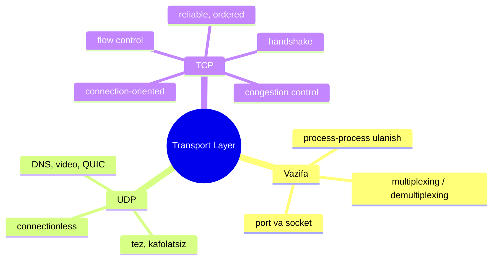
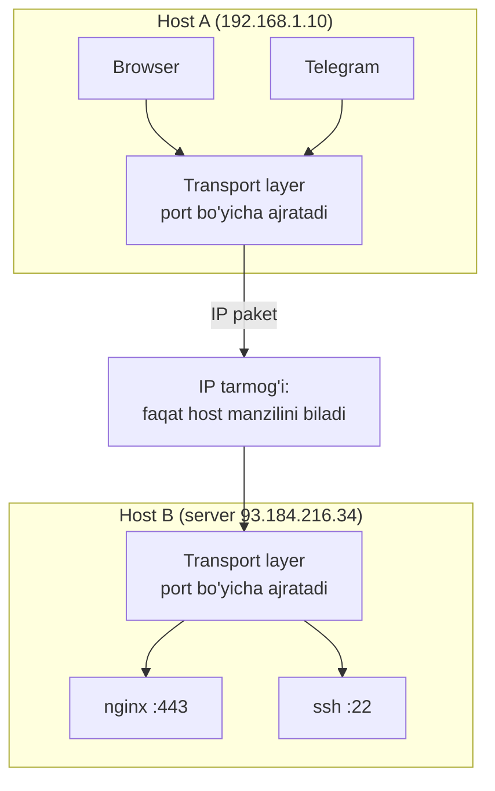
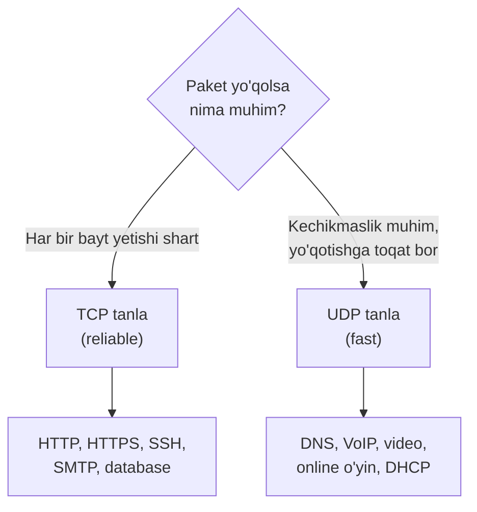

# 01. Transport Layer vazifasi

## Muammo: IP yetkazadi, lekin qayerga?

Tasavvur qil: brauzering YouTube video oqadi, ayni paytda Telegram xabar keladi,
fon rejimda esa tizim yangilanish yuklaydi. Bularning **hammasi bitta IP address**
va **bitta tarmoq kabeli** orqali kompyuteringga kelayapti.

Endi savol: kelgan paketni operatsion tizim qaysi dasturga berishi kerak? IP faqat
"bu paket **192.168.1.10** kompyuteriga" deb biladi, lekin **kompyuter ichidagi qaysi
dastur** kutayotganini bilmaydi. Bu bo'shliqni **transport layer** to'ldiradi.

> IP paketni to'g'ri **kompyuterga** yetkazadi. Transport layer esa uni to'g'ri
> **dasturga (process'ga)** yetkazadi.

Butun modul xaritasi (mavzular bir-birining ustiga quriladi):



## Analogiya: pochta va katta bino

IP protokolini shahar pochta xizmatiga o'xshat:

- **IP address** = binoning ko'cha manzili (masalan, "Amir Temur ko'chasi, 12-uy").
  Pochtachi xatni shu **binoga** yetkazadi.
- **Port raqami** = bino ichidagi **kvartira raqami**. Xat binoga yetdi, lekin
  aynan qaysi kvartiraga? Buni port hal qiladi.
- **Transport layer** = binoning kirish eshigidagi **konsyerj**, u kelgan xatlarni
  kvartira raqamiga qarab to'g'ri eshikka tarqatadi.

Analogiya chegarasi: pochtachi xatni **kafolat bilan** yetkazmaydi (yo'qolishi mumkin) —
bu aynan IP ga o'xshaydi. Transport layer'ning **TCP** varianti esa "xat yetib bordimi?"
deb tasdiq so'raydi va yetmasa qayta yuboradi. Oddiy pochta bunday qilmaydi.

## Sodda ta'rif

**Transport layer** (transport qatlami) — turli kompyuterlarda ishlayotgan
**process'lar** (dasturlar) o'rtasida **logical connection** (mantiqiy ulanish)
o'rnatadigan qatlam. U application layer va network layer o'rtasida joylashadi.

Bu yerda ikkita muhim atama bor:

- **Logical connection** — go'yo ikki dastur to'g'ridan-to'g'ri sim bilan
  bog'langandek tuyuladi, aslida esa ularning oralig'ida o'nlab router va turli
  kanallar bor.
- **Segment** — transport layer application ma'lumotini bo'laklarga bo'lib, har
  biriga o'z header'ini qo'shadi; shu bo'lak **segment** deb ataladi (TCP'da).

## Ikki xil logical connection farqi

Nima uchun network layer host'larni ulasa ham, ustiga yana transport layer kerak?
Chunki ular **turli darajadagi** ulanishni ta'minlaydi:

| Qatlam | Kimni kim bilan ulaydi | PDU nomi |
|---|---|---|
| **Network layer (IP)** | host ↔ host (kompyuter ↔ kompyuter) | packet / datagram |
| **Transport layer** | process ↔ process (dastur ↔ dastur) | segment / datagram |



Diagrammada ko'rinib turibdi: IP tarmog'i faqat **HostA → HostB** ni biladi.
Lekin HostA ichida Browser ham, Telegram ham bor; HostB ichida nginx ham, ssh ham bor.
Aynan qaysi dastur bilan qaysi dastur gaplashishini **transport layer** hal qiladi.

## Notional machine: kod ortida nima bo'ladi

`net.Dial("tcp", "example.com:443")` deb yozganingda kompyuter ichida nima bo'ladi?

- Operatsion tizim yadrosi (kernel) **socket** yaratadi — bu ma'lumot kirib-chiqadigan
  "eshik".
- Kernel senga bo'sh bir **ephemeral port** (masalan, 54321) beradi — bu sening
  "qaytish manziling".
- Kelgan har bir segment header'ida **destination port** bor; kernel shu raqamga
  qarab segmentni to'g'ri socket'ga (demak, to'g'ri dasturga) soladi.

Ya'ni "logical connection" — bu haqiqiy sim emas, bu kernel xotirasidagi bir jadval
yozuvidir. Shu yozuv `(protokol, src IP, src port, dst IP, dst port)` ni saqlaydi.

## Nima uchun bitta emas, IKKITA transport protokoli?

Chunki dasturlarning ehtiyoji **har xil**. Ba'zilari "har bir bayt aniq yetsin"
deydi (bank tranzaksiyasi), ba'zilari esa "kechikma, bitta kadr yo'qolsa mayli"
deydi (jonli video). Bitta protokol ikkalasini ham yaxshi bajara olmaydi.

Shuning uchun ikkita asosiy protokol bor:

| | **TCP** | **UDP** |
|---|---|---|
| Ulanish | connection-oriented (handshake bor) | connectionless (handshake yo'q) |
| Ishonchlilik | reliable (ACK, qayta uzatish) | unreliable (fire-and-forget) |
| Tartib | segmentlar tartibda yetadi | tartib kafolati yo'q |
| Tezlik | sekinroq (overhead bor) | tez (overhead minimal) |
| Header | 20-60 bayt | 8 bayt |
| Misol | HTTP, SSH, DB, email | DNS, video, o'yin, VoIP |

Asosiy tanlov shu bitta savolga borib taqaladi: **paket yo'qolsa, uni kutasanmi
yoki kutmasdan davom etasanmi?** TCP kutadi, UDP kutmaydi.



## Transport layer network'siz ham nima bera oladi?

Qiziq jihat: transport layer **network layer bermagan** xizmatni ham qura oladi.
IP ishonchsiz (paket yo'qolishi mumkin), lekin TCP uning ustida **ishonchli** kanal
yaratadi — xuddi yomon telefon aloqasida "eshityapsanmi? ha, davom et" deb
takrorlagandek. Bu **end-to-end tamoyili**: ishonchlilikni tarmoq o'rtasida emas,
aynan ikki uchida (end system) qurish kerak.

Lekin transport layer imkoniyati **network layer bilan cheklangan** ham: masalan,
IP kafolatli o'tkazuvchanlik (bandwidth) bermasa, TCP uni sehr bilan yarata olmaydi.

## Worked example: bitta IP, ko'p dastur

Terminalda `ss` (socket statistics) buyrug'i bilan bitta kompyuterdagi turli
process'lar bitta IP ostida turli portlarda ishlashini ko'rish mumkin:

```bash
$ ss -tunlp
Netid  State   Local Address:Port   Process
tcp    LISTEN  0.0.0.0:22           users:(("sshd",pid=812))
tcp    LISTEN  0.0.0.0:443          users:(("nginx",pid=5678))
udp    UNCONN  0.0.0.0:53           users:(("systemd-resolved"))
```

Bu chiqishni o'qishni o'rgan:

- **22 (TCP)** — sshd (masofaviy kirish), ishonchlilik shart, shuning uchun TCP.
- **443 (TCP)** — nginx (HTTPS web server), TCP.
- **53 (UDP)** — DNS resolver, kichik so'rov-javob, tezlik uchun UDP.

Uch xil dastur, bitta IP, lekin har biri o'z porti orqali ajraladi. Transport
layer aynan shu ajratishni bajaradi.

## Ko'p uchraydigan xatolar

**Xato 1: "Transport layer paketni marshrutlaydi (route qiladi)."**
Yo'q. Marshrutlash — network layer (IP) va router'lar vazifasi. Router'lar
segment ichiga **umuman qaramaydi**, ular faqat IP header'ni o'qiydi. Transport
layer faqat ikki uchida (client va server) ishlaydi.

**Xato 2: "TCP UDP'dan har doim yaxshiroq, chunki ishonchli."**
Yo'q. Jonli video yoki o'yinda kechikkan paket **foydasiz** — uni qayta yuborish
faqat kechikishni oshiradi. Bu holatda UDP yaxshiroq. "Yaxshi" degani — vazifaga
mos, degani.

**Xato 3: "Port — bu fizik narsa."**
Yo'q. Port — bu shunchaki 16 bitli raqam (0-65535), header ichidagi maydon.
Fizik razyom emas, mantiqiy identifikator.

## Xulosa

- Transport layer **application** va **network** qatlamlari o'rtasida joylashadi.
- Network layer **host ↔ host**, transport layer **process ↔ process** ulanishini beradi.
- U application ma'lumotini **segment**larga bo'lib, header qo'shadi.
- Ikkita asosiy protokol: **TCP** (reliable) va **UDP** (fast) — dasturning ehtiyojiga qarab tanlanadi.
- Router'lar segment ichiga qaramaydi — transport faqat uchlarda (end-to-end) ishlaydi.
- Transport layer IP bermagan xizmatlarni (reliability, security) qura oladi.
- Zamonaviy **QUIC** protokoli UDP ustiga TCP funksiyalarini qurib, uchinchi variant bo'ldi.

## 🧠 Eslab qol

- IP paketni **binoga**, port uni **kvartiraga** yetkazadi.
- Network layer = host↔host, transport layer = process↔process.
- TCP = "kut va tekshir", UDP = "yubor va unut".
- Router'lar transport segmentiga **qaramaydi**.
- Tanlov: paket yo'qolsa kutasanmi (TCP) yoki yo'qmi (UDP).

## ✅ O'z-o'zini tekshir

**1.** Nima uchun network layer host'larni ulasa ham, ustiga transport layer kerak?

<details>
<summary>Javob</summary>

Network layer faqat **kompyuter ↔ kompyuter** ulanishini biladi, lekin bitta
kompyuterda ko'p dastur bir vaqtda ishlaydi. Transport layer **port** yordamida
kelgan ma'lumotni aynan **qaysi dasturga** berishni hal qiladi — ya'ni ulanishni
process darajasiga "kengaytiradi".
</details>

**2.** Router segment ichidagi TCP header'ni o'qiydimi? Nega?

<details>
<summary>Javob</summary>

Yo'q. Router faqat **network layer (IP)** darajasida ishlaydi va faqat IP header'ni
o'qiydi (qayerga yo'naltirish uchun). Transport layer — **end-to-end**, ya'ni faqat
manba va qabul qiluvchi host'larda ishlaydi. Shuning uchun TCP holatini (state)
faqat ikki uchdagi kompyuter saqlaydi, oradagi router'lar emas.
</details>

**3.** Jonli video qo'ng'iroq uchun TCP yoki UDP? Nega?

<details>
<summary>Javob</summary>

UDP. Videoda kechikkan kadr **foydasiz** — uni qayta yuborsang, faqat kechikish
(latency) oshadi va suhbat uzilib-uzilib eshitiladi. Bir-ikki kadr yo'qolsa,
ko'z sezmaydi. Shuning uchun "yubor va unut" yondashuvi mos.
</details>

**4.** Bitta kompyuterda bir vaqtda 100 ta dastur tarmoq bilan ishlashi mumkinmi,
agar IP address bitta bo'lsa?

<details>
<summary>Javob</summary>

Ha. IP address bitta bo'lsa ham, har bir dastur **turli port** ishlatadi.
Transport layer kelgan segmentni destination port bo'yicha to'g'ri dasturga
tarqatadi (demultiplexing). Bitta IP + 65536 ta port = ko'plab parallel dastur.
</details>

## 🛠 Amaliyot

**1. Oson (Modify).** `ss -tunlp` buyrug'ini ishga tushir va o'z kompyuteringda
qaysi dastur qaysi portda ishlayotganini top. Har birining TCP yoki UDP ekanini
belgila va nega shunday ekanini ayt.

**2. O'rta (faded example).** Quyidagi jadvalni to'ldir:

```
Dastur            | Protokol | Sabab
------------------|----------|------------------------------------
Bank ilovasi      | TCP      | // TODO: nega?
Netflix video     | ____     | // TODO: to'ldir
DNS so'rovi        | ____     | // TODO: to'ldir
Fayl yuklash (SCP)| ____     | // TODO: to'ldir
```

<details>
<summary>Yordam</summary>

Bank — har bayt aniq yetsin (TCP). Netflix — oqim, kichik yo'qotishga toqat (aslida
zamonaviy streaming ko'pincha TCP/HTTP ustida, lekin jonli translyatsiya UDP/RTP).
DNS — kichik, tez (UDP). SCP — fayl butun yetsin (TCP).
</details>

**3. Qiyin (Make).** Bir do'stingga transport layer nima uchun kerakligini,
"pochta va bino" analogiyasidan foydalanmasdan, o'z so'zlaring bilan 4 jumlada tushuntir.

## 🔁 Takrorlash

- **Keyingi darslar:** [`02-multiplexing-demultiplexing.md`](02-multiplexing-demultiplexing.md),
  [`03-udp.md`](03-udp.md), [`04-tcp.md`](04-tcp.md).
- **Takrorlash jadvali:** bu darsni **ertaga**, **3 kundan keyin** va **1 haftadan keyin**
  "O'z-o'zini tekshir" savollariga qaytib kel.
- **Feynman testi:** "IP va transport layer farqini, kod so'zlarini ishlatmasdan,
  bir do'stingga 3 jumlada tushuntira olasanmi?"

## 📚 Manbalar

- Kurose & Ross, *Computer Networking: A Top-Down Approach*, 3-bob (Transport Layer)
- RFC 9293 — Transmission Control Protocol: https://datatracker.ietf.org/doc/html/rfc9293
- RFC 768 — User Datagram Protocol: https://datatracker.ietf.org/doc/html/rfc768
- TCP vs UDP fundamentals: https://paiml.com/blog/2025-02-26-tcp-vs-udp-fundamentals/
- Transport Layer Protocols (2025): https://www.pynetlabs.com/transport-layer-protocols/
- HAProxy — TCP vs UDP vs QUIC: https://www.haproxy.com/blog/choosing-the-right-transport-protocol-tcp-vs-udp-vs-quic
