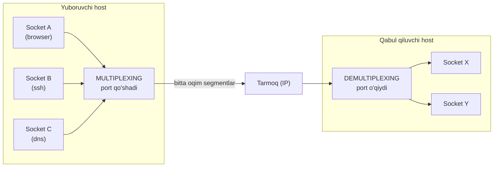
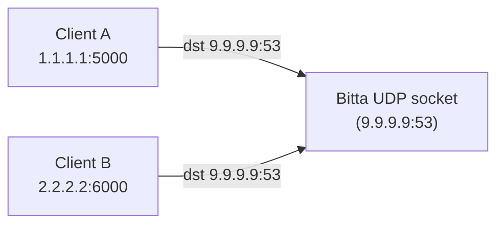
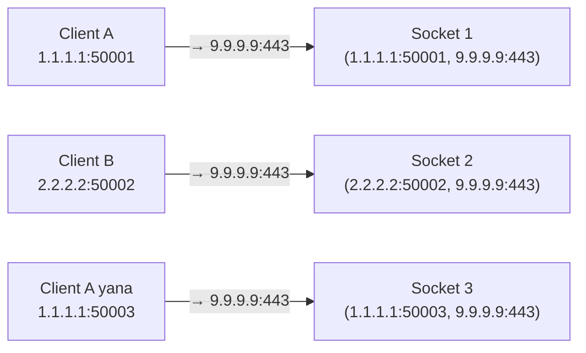

# 02. Multiplexing va Demultiplexing

## Muammo: bir eshik, ko'p mehmon

O'tgan darsda ko'rdik: bitta IP address ostida o'nlab dastur ishlaydi. Endi aniq
muammo: tarmoqdan **bitta oqim** segment kelayapti, lekin ular **turli
dasturlarga** tegishli. Operatsion tizim qaysi segmentni qaysi dasturga berishni
qanday biladi?

Va teskarisi: kompyuteringda 5 ta dastur bir vaqtda ma'lumot yubormoqchi. Ularning
hammasi bitta tarmoq kartasi orqali chiqadi. Bularni bitta oqimga qanday
"aralashtirib" yuborish va qabul tarafda qanday "ajratib" olish kerak?

> Ko'p dasturning ma'lumotini bitta oqimga yig'ish — **multiplexing**.
> Bitta oqimdan kelgan ma'lumotni to'g'ri dasturga tarqatish — **demultiplexing**.

## Analogiya: katta ofisdagi konsyerj

Katta biznes-markazni tasavvur qil:

- **Chiqishda (multiplexing):** har xil ofislar (dasturlar) xat yozadi. Konsyerj
  hammasini yig'ib, har biriga **"kimdan / kimga"** yozuvi (port raqamlari) qo'yib,
  bitta pochta qopiga soladi va jo'natadi.
- **Kelishda (demultiplexing):** kelgan qopdan xatlarni oladi, har birining
  **"kimga"** yozuviga (destination port) qarab to'g'ri ofisga tarqatadi.

Konsyerj xatni **ochib o'qimaydi** — u faqat konvertdagi manzilga qaraydi. Xuddi
shunday, transport layer ham segment **ichidagi** ma'lumotga qaramaydi, faqat
header'dagi port raqamlariga qaraydi.

## Sodda ta'rif

- **Multiplexing** (ko'plab manbani birlashtirish) — turli socket'lardan kelgan
  ma'lumotni yig'ib, har biriga port bilan header qo'shib, network layer'ga uzatish.
- **Demultiplexing** (ajratish) — network'dan kelgan segmentni header'idagi port
  bo'yicha to'g'ri **socket**'ga yo'naltirish.
- **Socket** — dastur va tarmoq o'rtasidagi "eshik"; har birining o'z identifikatori bor.



## Port raqamlari

Har bir transport segment header'ida ikkita maxsus maydon bor:

- **Source port** (16 bit, 0-65535) — kimdan.
- **Destination port** (16 bit, 0-65535) — kimga.

Port diapazonlari (IANA taqsimoti):

| Diapazon | Nomi | Misol |
|---|---|---|
| 0-1023 | Well-known ports | 22=SSH, 25=SMTP, 53=DNS, 80=HTTP, 443=HTTPS |
| 1024-49151 | Registered ports | 3306=MySQL, 5432=PostgreSQL, 6379=Redis |
| 49152-65535 | Dynamic / Ephemeral | client'lar vaqtinchalik ishlatadi |

**Ephemeral port** (vaqtinchalik port) — client ulanganda kernel unga avtomatik
beradigan bo'sh port (Linux'da odatda 32768-60999). Bu client'ning "qaytish manzili".

## UDP demultiplexing: 2 ta parametr

UDP socket faqat **2 ta** qiymat bilan aniqlanadi:

- **Destination IP address**
- **Destination port**

Bu shuni anglatadiki, agar **ikki xil** manbadan (turli source IP/port) kelgan
segmentlar **bir xil** destination IP va port'ga ega bo'lsa, ular **bitta socket'ga**
tushadi. UDP source'ni ajratmaydi.



Nima uchun UDP'da ham **source port** kerak? U "return address" (qaytish manzili)
vazifasini bajaradi: server javob yuborishda source va destination portlarni
almashtiradi, shunda javob to'g'ri client'ga qaytadi.

## TCP demultiplexing: 4 ta parametr (4-tuple)

TCP socket esa **4 ta** qiymat (4-tuple) bilan aniqlanadi:

- Source IP address
- Source port
- Destination IP address
- Destination port

```
TCP connection = (src IP, src port, dst IP, dst port)
```

Bu **muhim farq**: TCP'da turli source'dan kelgan segmentlar **turli socket'larga**
tushadi — hatto destination port bir xil bo'lsa ham. Aynan shuning uchun bitta web
server **443-port'da minglab** client'ga bir vaqtda xizmat qila oladi.



E'tibor ber: Client A **ikki marta** ulandi (50001 va 50003) — bu ikki **alohida**
socket, chunki source port farq qiladi. Demak, bitta client ham bir server bilan
ko'p parallel ulanish ocha oladi.

## Notional machine: kernel jadval yuritadi

Kernel ichida bir **ulanishlar jadvali** (connection table) bor. Har bir kelgan
TCP segment uchun kernel:

1. Segmentdan `(src IP, src port, dst IP, dst port)` 4-tuple ni o'qiydi.
2. Bu 4-tuple bo'yicha jadvaldan mos socket'ni (aslida TCB — TCP Control Block) topadi.
3. Ma'lumotni shu socket'ning buffer'iga soladi; dastur `read()` bilan o'qiydi.

Ephemeral port'lar cheklangan (masalan, ~28000 ta). Agar client juda ko'p ulanish
ochsa, port tugab qolishi mumkin — "Cannot assign requested address" xatosi.
Lekin bir xil ephemeral port **turli destination** uchun qayta ishlatilishi mumkin,
chunki uniquelikni **butun 4-tuple** belgilaydi, faqat client port emas.

## Worked example: bir server, ko'p ulanish

`ss` bilan bitta nginx server 443-port'da bir nechta ulanishga xizmat qilayotganini
ko'rish mumkin:

```bash
$ ss -tan '( dport = :443 or sport = :443 )'
State   Recv-Q  Send-Q   Local Address:Port      Peer Address:Port
ESTAB   0       0        10.0.0.5:443            203.0.113.7:51514
ESTAB   0       0        10.0.0.5:443            203.0.113.7:51520
ESTAB   0       0        10.0.0.5:443            198.51.100.2:44001
LISTEN  0       128      0.0.0.0:443             0.0.0.0:*
```

Tahlil:

- Oxirgi qator — **LISTEN** socket (welcoming socket), yangi ulanishni kutadi.
- Yuqoridagi 3 qator — o'rnatilgan **ESTABLISHED** ulanishlar.
- Local Address hamma joyda `10.0.0.5:443` bir xil — lekin Peer (client) turli.
- Birinchi ikki qatorda **bir xil client** (203.0.113.7) lekin **turli port**
  (51514, 51520) — bu ikki alohida socket.

Demak, uch ulanish, uch alohida socket — chunki 4-tuple har birida farqli.

## Worked example: Python socket

```python
# --- 1-qadam: UDP socket yaratamiz (2-tuple bilan ishlaydi) ---
import socket
s = socket.socket(socket.AF_INET, socket.SOCK_DGRAM)
s.bind(('', 19157))   # o'zimiz portni belgilaymiz
# Agar bind qilmasak, kernel avtomatik ephemeral port beradi (1024-65535)

# --- 2-qadam: kelgan datagramni o'qiymiz ---
data, addr = s.recvfrom(1024)   # addr = (source_ip, source_port)
print(f"'{data.decode()}' keldi, kimdan: {addr}")

# --- 3-qadam: javobni source manzilga qaytaramiz ---
s.sendto(b"qabul qildim", addr)   # source/dest port avtomatik almashadi
```

Chiqish (client `salom` yuborsa):

```
'salom' keldi, kimdan: ('192.168.1.20', 40122)
```

E'tibor ber: `addr` ichida client'ning **source port**i bor — aynan shu "return
address" bo'lib xizmat qiladi.

## 🤔 O'ylab ko'r

Server 443-port'da ishlaydi. Bir xil client (bir xil IP) sizning serveringizga
**10 ta parallel** HTTP ulanish ochdi. Serverda nechta socket hosil bo'ladi?

<details>
<summary>Javobni ko'rish</summary>

**10 ta alohida socket.** Client IP va server port (443) bir xil bo'lsa ham, har bir
ulanishda client **turli ephemeral port** ishlatadi. Demak, 4-tuple har birida farq
qiladi: `(clientIP, 50001, serverIP, 443)`, `(clientIP, 50002, serverIP, 443)`, ...
Har bir unikal 4-tuple = alohida socket. Shu sabab brauzerlar sahifani tez yuklash
uchun bir saytga bir nechta parallel ulanish ochadi.
</details>

## Ko'p uchraydigan xatolar

**Xato 1: "Bir port'da faqat bitta ulanish bo'ladi."**
Yo'q. Server bitta LISTEN port'da (443) minglab ulanishga xizmat qiladi, chunki har
ulanish 4-tuple bo'yicha unikal. Faqat **destination port** bir xil.

**Xato 2: "UDP va TCP demultiplexing bir xil."**
Yo'q. UDP — **2-tuple** (dst IP + dst port), TCP — **4-tuple**. Shu sabab UDP'da
turli manbadan kelgan datagramlar bitta socket'ga tushadi, TCP'da esa ajraladi.

**Xato 3: "Source port keraksiz, faqat destination muhim."**
Yo'q. Source port bo'lmasa, server javobni qayerga qaytarishni bilmaydi. U —
"qaytish manzili".

## Xulosa

- **Multiplexing** — ko'p socket ma'lumotini bitta oqimga yig'ish (yuborishda).
- **Demultiplexing** — kelgan segmentni port bo'yicha to'g'ri socket'ga tarqatish.
- Port — 16 bitli raqam; well-known (0-1023), registered, ephemeral diapazonlari bor.
- **UDP socket = 2-tuple** (dst IP + dst port).
- **TCP socket = 4-tuple** (src IP, src port, dst IP, dst port).
- Shuning uchun bitta server bitta port'da minglab TCP ulanishga xizmat qiladi.
- Source port — javob qaytarish uchun "return address".

## 🧠 Eslab qol

- Multiplexing = yig'ish, demultiplexing = tarqatish.
- UDP demux — 2-tuple, TCP demux — 4-tuple.
- Bitta 443 port = minglab ulanish (4-tuple unikal).
- Ephemeral port = client'ning vaqtinchalik qaytish manzili.

## ✅ O'z-o'zini tekshir

**1.** UDP socket nechta parametr bilan aniqlanadi, TCP socket-chi? Bu farq nimaga olib keladi?

<details>
<summary>Javob</summary>

UDP — **2 ta** (dst IP, dst port). TCP — **4 ta** (src IP, src port, dst IP, dst port).
Natija: UDP'da turli manbadan kelgan datagramlar **bitta socket**'ga tushadi; TCP'da
esa har xil manba **turli socket**'ga ajraladi. Shuning uchun TCP server bitta port'da
ko'p client'ni alohida-alohida boshqara oladi.
</details>

**2.** Bir web server 443-port'da bir vaqtda 5000 ta client'ga qanday xizmat qiladi,
axir port bitta-ku?

<details>
<summary>Javob</summary>

Har bir ulanish **4-tuple** bo'yicha unikal aniqlanadi. Server port (443) va server IP
bir xil bo'lsa ham, har client turli `(src IP, src port)` bilan keladi. Demak 5000 ta
farqli 4-tuple = 5000 ta alohida socket. Kernel kelgan segmentni 4-tuple bo'yicha
to'g'ri socket'ga demultiplex qiladi.
</details>

**3.** Nima uchun source port kerak?

<details>
<summary>Javob</summary>

U "return address" — server javob yuborganda source va destination portlarni
almashtiradi, shunda javob to'g'ri client process'ga qaytadi. Source port bo'lmasa,
server javobni qayerga jo'natishni bilmaydi.
</details>

**4.** Client bir serverga 3 ta parallel ulanish ochdi. Nima bir xil, nima farq qiladi?

<details>
<summary>Javob</summary>

Bir xil: client IP, server IP, server port. Farqli: **client ephemeral port**
(masalan, 50001, 50002, 50003). Shu farq tufayli 3 ta alohida 4-tuple, ya'ni 3 ta
alohida socket hosil bo'ladi.
</details>

## 🛠 Amaliyot

**1. Oson (Modify).** Yuqoridagi Python UDP misolida `bind(('', 19157))` portini
o'zgartirib, `ss -unlp` bilan yangi portni tekshir.

**2. O'rta (faded example).** TCP echo server skeleton'ini to'ldir:

```python
import socket
srv = socket.socket(socket.AF_INET, socket.SOCK_STREAM)
srv.bind(('', 8080))
srv.listen()
while True:
    conn, addr = srv.accept()   # yangi connection socket qaytaradi
    # TODO: conn qanday 4-tuple bilan aniqlanishini o'ylab, addr ni chop et
    data = conn.recv(1024)
    # TODO: kelgan data ni yana o'sha conn ga qaytar (echo)
    conn.close()
```

<details>
<summary>Yordam</summary>

`print(addr)` — client (src IP, src port) ni beradi; server tomoni esa
`srv.getsockname()`. To'liq 4-tuple = shu ikkisi. Echo uchun: `conn.sendall(data)`.
</details>

**3. Qiyin (Make).** `ss -tan` chiqishidan bitta ESTABLISHED ulanishni tanla va
uning to'liq 4-tuple sini yozib, nega bu 4-tuple butun tarmoqda unikal ekanini tushuntir.

## 🔁 Takrorlash

- **Oldingi dars:** [`01-transport-layer-vazifasi.md`](01-transport-layer-vazifasi.md) —
  transport layer nima uchun kerak.
- **Keyingi darslar:** [`03-udp.md`](03-udp.md), [`04-tcp.md`](04-tcp.md).
- **Takrorlash jadvali:** ertaga → 3 kundan keyin → 1 haftadan keyin savollarga qayt.
- **Feynman testi:** "Nega bitta 443 port minglab ulanishga yetadi?" — do'stingga 3 jumlada tushuntir.

## 📚 Manbalar

- Kurose & Ross, *Computer Networking*, 3.2-bo'lim (Multiplexing/Demultiplexing)
- TCP 4-tuple deep dive: https://medium.com/@adityaagrawal399/how-multiple-simultaneous-tcp-connections-work-a-deep-dive-into-the-tcp-4-tuple-packet-routing-66a96153b0ae
- Running out of TCP ports (ephemeral port limits): https://ahmed-n-abdeltwab.github.io/blog/2025/09/04/running-out-of-tcp-ports.html
- RFC 9293 — Transmission Control Protocol: https://datatracker.ietf.org/doc/html/rfc9293
