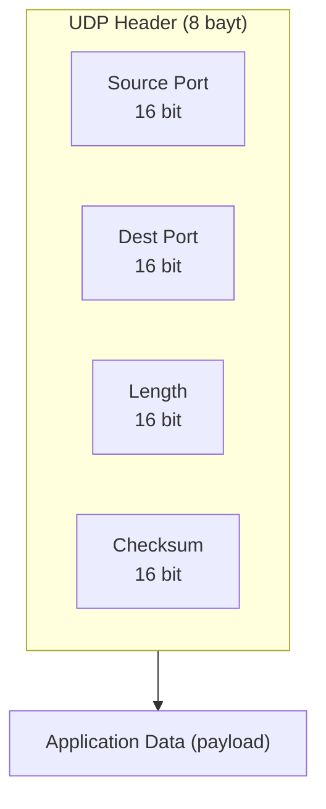
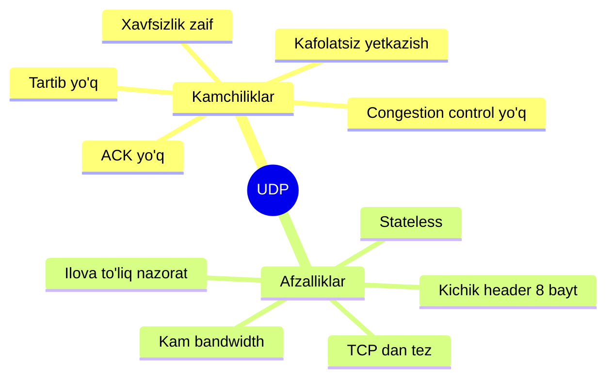
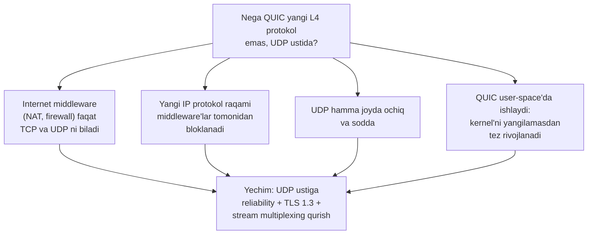

# 03. UDP — User Datagram Protocol

## Muammo: ba'zida "kafolat" ortiqcha yuk

O'yin serverida o'ynayapsan. Har 20 millisekundda serverga "men bu yerda turibman"
degan kichik xabar yuboriladi. Faraz qil, bitta xabar yo'lda yo'qoldi. Uni **qayta
yuborishning ma'nosi bormi**? Yo'q — 20 ms o'tib yangi, aniqroq pozitsiya keladi.
Eski, kechikkan pozitsiyani qayta yuborish faqat kechikish (latency) qo'shadi.

Xuddi shunday, DNS so'rovi kichik: "google.com IP si nima?". Buning uchun ulanish
o'rnatib (handshake), tasdiq kutib, keyin uzish — bu **ortiqcha ovora**. Bitta
so'rov, bitta javob, tamom.

> Ba'zi dasturlarga TCP'ning barcha kafolatlari kerak emas — ularga **tezlik** va
> **soddalik** muhimroq. Aynan shu ehtiyoj uchun **UDP** yaratilgan.

## Analogiya: otkritka tashlash

TCP'ni telefon qo'ng'irog'iga o'xshatsak (avval "alo", javob kutish, gaplashish,
"xayr"), UDP — **pochta qutisiga otkritka tashlash**:

- Konvert yopishtirmaysan, ulanish o'rnatmaysan — shunchaki manzil yozib tashlaysan.
- "Yetib bordimi?" deb hech kim tasdiq bermaydi.
- Bir nechta otkritka tashlasang, qaysi biri avval yetishi noma'lum, ba'zisi yo'qolishi ham mumkin.
- Buning evaziga — **tez va arzon**.

Analogiya chegarasi: otkritka mazmuni buzilib qolsa, oddiy pochta buni sezmaydi.
UDP esa **checksum** orqali buzilishni **sezadi** (lekin tuzatmaydi — buzilganini
odatda tashlab yuboradi).

## Sodda ta'rif

**UDP** (User Datagram Protocol) — eng sodda transport protokoli. U IP ustiga faqat
ikki narsani qo'shadi: **port raqamlari** (multiplexing uchun) va **checksum** (xato
aniqlash uchun). Boshqa hech narsa — handshake yo'q, ACK yo'q, qayta uzatish yo'q.

Muhim atamalar:

- **Connectionless** (ulanishsiz) — ma'lumot yuborishdan oldin ulanish o'rnatilmaydi.
- **Stateless** (holatsiz) — server har bir client haqida holat saqlamaydi;
  server o'chib yonsa ham, UDP client buni sezmaydi.
- **Datagram** — UDP PDU'si shunday ataladi (segment emas).

## UDP header — atigi 8 bayt



To'rt maydon, har biri 16 bit:

| Maydon | Vazifasi |
|---|---|
| **Source Port** | kimdan (qaytish manzili) |
| **Destination Port** | kimga (qaysi process) |
| **Length** | butun datagram uzunligi (header + data) baytlarda |
| **Checksum** | xato aniqlash |

Taqqoslash uchun: TCP header **20-60 bayt**, UDP esa **8 bayt**. Bu farq har paketda
overhead'ni kamaytiradi — DNS, o'yin kabi kichik-tez trafik uchun juda muhim.

## UDP kamchiliklari va afzalliklari



**Kamchiliklar:** yetkazish kafolatlanmaydi, tasdiq (ACK) yo'q, tartib saqlanmaydi,
tarmoq yuklanishi hisobga olinmaydi (congestion control yo'q), va aloqa ushlab
turilmagani uchun so'rov qayerdan kelganini aniqlash qiyin (xavfsizlik muammosi —
shuning uchun ko'p firewall UDP'ni boshlang'ich holatda bloklaydi).

**Afzalliklar:** kichik paket, kam bandwidth, TCP'dan tez (chunki qayta uzatish va
sekinlashish yo'q), stateless (server xotira sarflamaydi), va **ilova to'liq nazoratga
ega** — TCP congestion control uni sekinlashtirmaydi.

## UDP Checksum: buzilishni qanday sezadi

Checksum — segmentdagi bitlar uzatishda buzilganmi yo'qmi degan savolga javob beradi.

**Yuboruvchida:**
1. Segment 16 bitli so'zlarga bo'linadi.
2. Barcha so'zlar qo'shiladi (o'zaro tashish — carry — orqaga qaytariladi).
3. Yig'indining **1-to'ldiruvchisi** (one's complement, ya'ni 0 va 1 almashtiriladi) olinadi.
4. Natija checksum maydoniga yoziladi.

**Qabul qiluvchida:**
1. Barcha so'zlar (data + checksum) qo'shiladi.
2. Natija `1111111111111111` bo'lsa — xato yo'q.
3. Biror bit 0 bo'lsa — xato bor, datagram odatda tashlab yuboriladi.

Misol (3 ta 16 bitli so'z):

```
So'z 1:  0110011001100000
So'z 2:  0101010101010101
So'z 3:  1000111100001100
-----------------------------
Yig'indi: 0100101011000010
1-to'ldir: 1011010100111101  <- checksum
```

Nima uchun bu UDP darajasida kerak, axir link layer ham xato tekshiradi-ku? Chunki:
- Hamma link protokoli xato tekshirmaydi.
- Router **xotirasida saqlashda** ham xato yuzaga kelishi mumkin (link tekshiruvidan keyin).
- **End-to-end tamoyili:** yakuniy tekshiruv uchida (end system'da) bo'lishi kerak.

> Muhim: UDP xatoni **aniqlaydi, lekin tuzatmaydi**. IPv4'da checksum ixtiyoriy
> (lekin amalda deyarli har doim hisoblanadi), IPv6'da esa **majburiy**.

## Qachon UDP tanlanadi?

| Ilova | Port | Nega UDP |
|---|---|---|
| **DNS** | 53 | Kichik so'rov-javob, handshake overhead'i shart emas |
| **DHCP** | 67/68 | Client hali IP olmagan — TCP ulanish qura olmaydi |
| **NTP** | 123 | Vaqt sinxronizatsiyasi, kichik xabar |
| **VoIP / video qo'ng'iroq** | turli | Kechikkan paket foydasiz, retransmission zarar |
| **Online o'yin** | turli | Yangi pozitsiya eski yo'qolganini almashtiradi |
| **QUIC / HTTP/3** | 443 | UDP ustiga o'z reliability'sini quradi |

Umumiy qoida: **kechikish (latency) yo'qotishdan (loss) muhimroq** bo'lsa, UDP.

## Zamonaviy holat: QUIC nima uchun UDP ustida?

Bu eng qiziq hozirgi tendensiya. **QUIC** (HTTP/3 ning asosi, 2026 holatida global
trafikning **~35%**) — Google boshlagan zamonaviy protokol. U TCP'ning ko'p
funksiyalarini (ishonchli yetkazish, tartib, congestion control, encryption) beradi,
lekin **UDP ustida** quriladi. Nega yangi protokol yaratmasdan aynan UDP tanlandi?



QUIC'ning UDP ustidagi qo'shimchalari:
- **Built-in TLS 1.3** — encryption transport bilan birga, alohida handshake yo'q.
- **Stream multiplexing** — bir ulanish ichida ko'p oqim; bittasida paket yo'qolsa,
  boshqalari to'xtamaydi (HTTP/2 dagi head-of-line blocking muammosi hal bo'ladi).
- **Connection migration** — Wi-Fi'dan 4G'ga o'tsang ham ulanish saqlanadi (Connection ID orqali).
- **0-RTT** — qaytib kelgan client darhol ma'lumot yubora oladi.

Ya'ni UDP "sodda va tez" bo'lgani uchun aynan u zamonaviy innovatsiya uchun **bo'sh
maydon** bo'lib chiqdi.

## Worked example: Go'da UDP server

```go
// --- 1-qadam: UDP address'ni tayyorlaymiz ---
addr, _ := net.ResolveUDPAddr("udp", ":9000")

// --- 2-qadam: UDP socket ochamiz (ListenPacket — connectionless) ---
conn, _ := net.ListenUDP("udp", addr)
defer conn.Close()

// --- 3-qadam: kelgan datagramni o'qiymiz (kimdan kelganini ham olamiz) ---
buf := make([]byte, 1024)
n, clientAddr, _ := conn.ReadFromUDP(buf)
fmt.Printf("'%s' keldi, kimdan: %s\n", buf[:n], clientAddr)

// --- 4-qadam: javobni o'sha manzilga qaytaramiz ---
conn.WriteToUDP([]byte("qabul qildim"), clientAddr)
```

Chiqish (client `salom` yuborsa):

```
'salom' keldi, kimdan: 192.168.1.20:40122
```

E'tibor ber: `Accept()` yo'q, handshake yo'q. Kernel darhol `ReadFromUDP` ga kelgan
datagramni beradi. Har datagram mustaqil — client haqida holat saqlanmaydi (stateless).

## 🤔 O'ylab ko'r

Yuqoridagi UDP serverga client 3 ta datagram yuboradi: `A`, `B`, `C`. Server tomonda
ular albatta `A`, `B`, `C` tartibida keladimi? Va uchalasi ham albatta yetadimi?

<details>
<summary>Javobni ko'rish</summary>

**Yo'q, ikkalasiga ham kafolat yo'q.** UDP tartibni saqlamaydi — `C` `A` dan oldin
kelishi mumkin (turli marshrut orqali ketsa). Va yetkazish kafolatlanmaydi — masalan
`B` yo'lda yo'qolib, faqat `A` va `C` yetishi mumkin. UDP hech qanday tartiblash yoki
qayta uzatish qilmaydi. Agar tartib/kafolat kerak bo'lsa, uni **ilova darajasida**
o'zing qurishing kerak (yoki TCP/QUIC ishlatasan).
</details>

## Ko'p uchraydigan xatolar

**Xato 1: "UDP checksum yo'q, umuman xato tekshirmaydi."**
Yo'q. UDP'da checksum **bor** va u xatoni aniqlaydi. Faqat u xatoni **tuzatmaydi**
(qayta uzatmaydi) — buzilgan datagramni tashlab yuboradi.

**Xato 2: "UDP har doim TCP'dan tez, demak har doim yaxshi."**
Yo'q. Katta fayl yuborishda TCP sliding window bilan ko'p tezroq bo'lishi mumkin.
UDP ustida reliability qursang, u odatda TCP'chalik optimal chiqmaydi. "Tez" faqat
kichik-latency-sezgir holatlarda foyda beradi.

**Xato 3: "UDP connectionless, demak port kerak emas."**
Yo'q. Connectionless bo'lsa ham, port kerak — multiplexing/demultiplexing uchun.
Handshake yo'q, lekin destination port hali ham segmentni to'g'ri process'ga yo'naltiradi.

**Xato 4: "QUIC — bu shunchaki UDP."**
Yo'q. QUIC UDP'ni **transport** sifatida ishlatadi, lekin uning ustiga TCP-darajasidagi
reliability, tartib, congestion control va TLS 1.3 quradi. UDP unga faqat "quvur".

## Xulosa

- UDP — eng sodda transport protokoli: IP ustiga faqat **port + checksum** qo'shadi.
- **Connectionless** va **stateless**: handshake yo'q, ACK yo'q, holat saqlanmaydi.
- Header — atigi **8 bayt** (TCP 20-60 bayt).
- Checksum xatoni **aniqlaydi, lekin tuzatmaydi**.
- UDP tanlanadi: DNS, DHCP, NTP, VoIP, o'yin, streaming — **latency muhim** joyda.
- Kafolat yo'q: tartib va yetkazish ta'minlanmaydi.
- **QUIC (HTTP/3)** UDP ustiga zamonaviy reliability qurib, ~35% global trafikni egallaydi.

## 🧠 Eslab qol

- UDP = otkritka: yubor va unut.
- Header 8 bayt, port + length + checksum.
- Checksum aniqlaydi, tuzatmaydi.
- Latency > loss bo'lsa — UDP.
- QUIC UDP ustida quriladi (middleware faqat TCP/UDP biladi).

## ✅ O'z-o'zini tekshir

**1.** UDP checksum xatoni topsa, u bilan nima qiladi?

<details>
<summary>Javob</summary>

Hech narsani **tuzatmaydi**. UDP xatoni faqat **aniqlaydi**. Ko'p implementatsiya
buzilgan datagramni shunchaki **tashlab yuboradi**; ba'zilari ilovaga ogohlantirish
bilan uzatadi. Qayta uzatish (retransmission) UDP'da umuman yo'q.
</details>

**2.** Nima uchun QUIC yangi transport protokoli yaratmasdan, aynan UDP ustida quriladi?

<details>
<summary>Javob</summary>

Chunki Internet middleware'lari (NAT, firewall) faqat **TCP va UDP** ni tushunadi.
Yangi IP protokol raqamli paketlar ko'p joyda **bloklanadi**. UDP hamma joyda ochiq
va sodda, shuning uchun QUIC UDP'ni "quvur" sifatida ishlatib, ustiga o'z reliability,
tartib, congestion control va TLS 1.3 sini quradi. Qo'shimcha: QUIC user-space'da
ishlagani uchun kernel yangilamasdan tez rivojlanadi.
</details>

**3.** DHCP nega TCP emas, UDP ishlatadi?

<details>
<summary>Javob</summary>

Chunki DHCP client **hali IP address olmagan** — u IP olish uchun DHCP so'raydi.
TCP ulanish o'rnatish uchun esa manba IP kerak. IP hali yo'q ekan, TCP handshake
qilib bo'lmaydi. UDP (va broadcast) esa IP'siz ham ishlaydi.
</details>

**4.** Bir xil datagramlar (A, B, C) UDP orqali yuborilsa, tartibi va yetishi
kafolatlanadimi?

<details>
<summary>Javob</summary>

Yo'q. Tartib kafolatlanmaydi (C, A dan oldin kelishi mumkin) va yetkazish ham
kafolatlanmaydi (B yo'qolishi mumkin). UDP tartiblash va qayta uzatish qilmaydi —
bu ishlarni ilova o'zi bajarishi kerak (yoki TCP/QUIC ishlatiladi).
</details>

## 🛠 Amaliyot

**1. Oson (Modify).** Yuqoridagi Go UDP serverida `:9000` portini boshqasiga
o'zgartir va `nc -u localhost <port>` bilan xabar yuborib test qil.

**2. O'rta (faded example).** Go'da oddiy UDP **client** yoz:

```go
conn, _ := net.Dial("udp", "localhost:9000")
defer conn.Close()
// TODO: conn.Write bilan "salom" yubor
// TODO: buf yaratib, conn.Read bilan javobni o'qi va chop et
```

<details>
<summary>Yordam</summary>

`conn.Write([]byte("salom"))` yuboradi. Javob uchun: `buf := make([]byte, 1024);
n, _ := conn.Read(buf); fmt.Println(string(buf[:n]))`. Bu yerda `net.Dial("udp", ...)`
handshake qilmaydi — faqat destination'ni bog'laydi.
</details>

**3. Qiyin (Make).** Noldan bir UDP "ping-pong" yoz: client 5 ta xabar yuboradi,
server har biriga javob qaytaradi. Xabarlardan biri yo'qolsa (masalan, `tc` bilan
loss qo'shsang), nima bo'lishini kuzat — client kutib qolib qoladimi?

## 🔁 Takrorlash

- **Oldingi darslar:** [`01-transport-layer-vazifasi.md`](01-transport-layer-vazifasi.md),
  [`02-multiplexing-demultiplexing.md`](02-multiplexing-demultiplexing.md).
- **Keyingi dars:** [`04-tcp.md`](04-tcp.md) — UDP'ning aksi: to'liq ishonchli protokol.
- **Takrorlash jadvali:** ertaga → 3 kundan keyin → 1 haftadan keyin savollarga qayt.
- **Feynman testi:** "UDP nima uchun DNS va o'yin uchun mos, lekin bank uchun emas?" —
  3 jumlada tushuntir.

## 📚 Manbalar

- Kurose & Ross, *Computer Networking*, 3.3-bo'lim (UDP)
- RFC 768 — User Datagram Protocol: https://datatracker.ietf.org/doc/html/rfc768
- RFC 9000 — QUIC: https://datatracker.ietf.org/doc/html/rfc9000
- HTTP/3 35% adoption: https://dev.to/linou518/http3-is-at-35-adoption-you-cant-call-quic-a-future-technology-anymore-2ghm
- UDP use cases va QUIC: https://www.cavliwireless.com/blog/not-mini/understanding-udp-protocol-applications-and-security
- HAProxy — TCP vs UDP vs QUIC: https://www.haproxy.com/blog/choosing-the-right-transport-protocol-tcp-vs-udp-vs-quic
