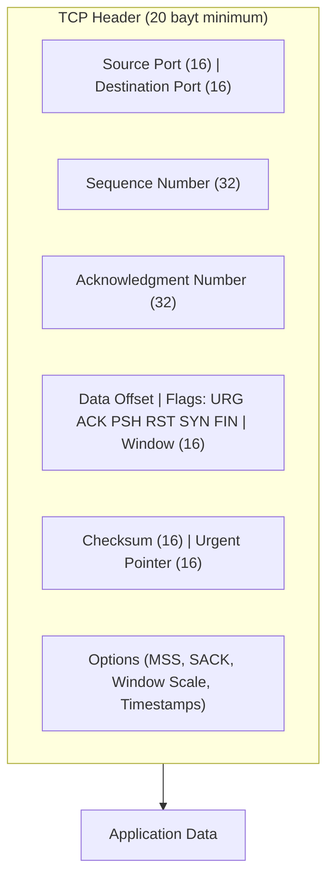
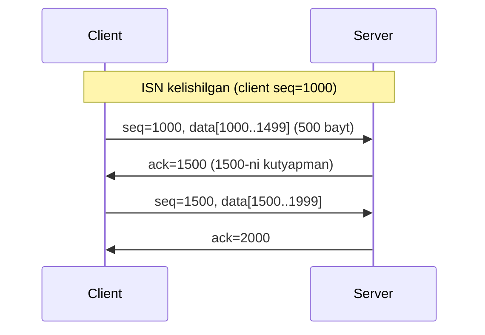
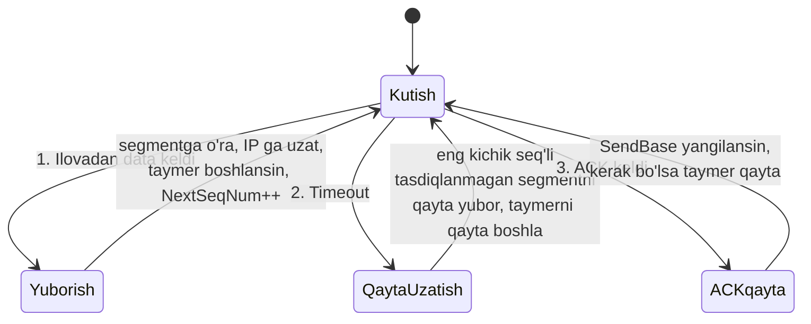
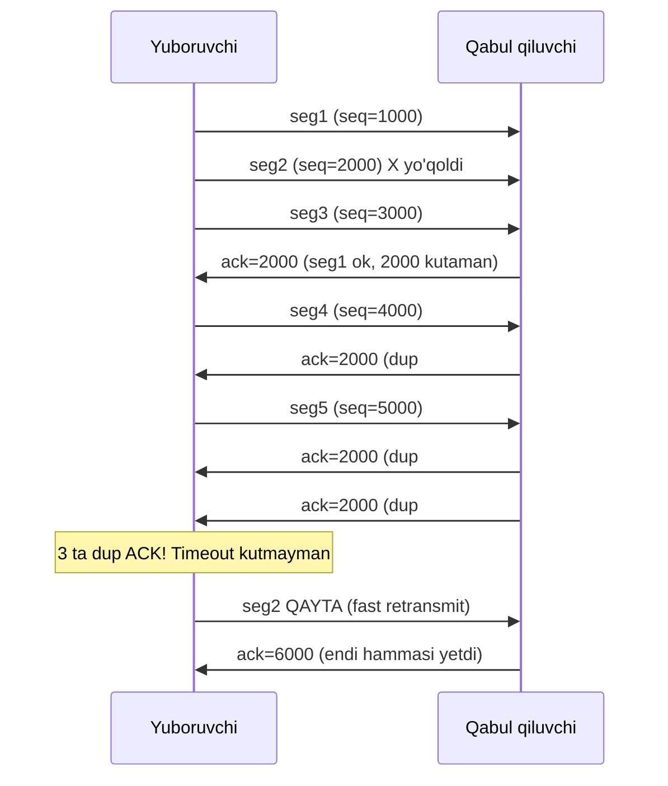
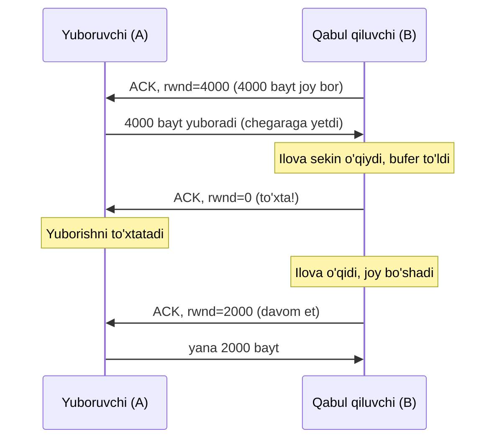

# 04. TCP — Transmission Control Protocol

## Muammo: ishonchsiz pochta ustida ishonchli aloqa

Oldingi darsda UDP'ni ko'rdik — sodda, tez, lekin **kafolatsiz**. Endi aksini
tasavvur qil: bank tranzaksiyasini yuborayapsan. Bu yerda **bitta bayt** ham yo'qolsa,
adashsa yoki takrorlansa jiddiy muammo. Sen "1000 dollar o'tkaz" deb yuborsang, u
"100 dollar" bo'lib yetsa yoki ikki marta bajarilsa falokat.

Lekin muammo shundaki, TCP ham UDP ham **bir xil ishonchsiz IP** ustida ishlaydi.
IP "maksimal harakat" (best-effort) protokoli: paketni yo'qotishi, tartibini
buzishi, buzib yuborishi mumkin. Router buferlari to'lib ketsa, paket shunchaki
tashlanadi.

> Savol: ishonchsiz IP ustida qanday qilib **ishonchli** kanal qurish mumkin?
> TCP aynan shu muammoni hal qiladi.

## Analogiya: raqamlangan xatlar va "yetdimi?" so'rovi

TCP'ni shunday tasavvur qil. Sen do'stingga uzun maktubni bo'lib-bo'lib yuborasan:

- Har konvertga **raqam** qo'yasan (1, 2, 3...) — do'sting tartibda o'qishi uchun (sequence number).
- Har konvert yetganda do'sting: "3-gacha oldim, endi 4-ni kutyapman" deb **javob**
  yozadi (acknowledgment).
- Agar sen yuborgan konvertga belgilangan vaqtda javob kelmasa, uni **qayta yuborasan** (retransmission).
- Gaplashishdan oldin telefonda "aloqa bormi? ha!" deb **kelishib olasan** (handshake).

Analogiya chegarasi: haqiqiy pochtada raqamni **xatlarga** qo'yasan; TCP esa raqamni
**baytlarga** qo'yadi (xatlarga emas). Bu muhim farqni pastda ko'ramiz.

## Sodda ta'rif

**TCP** (Transmission Control Protocol) — **connection-oriented, reliable,
byte-stream** transport protokoli:

- **Connection-oriented** — ma'lumot yuborishdan oldin **3-way handshake** bilan ulanish o'rnatadi.
- **Reliable** — yo'qolgan segmentni qayta yuboradi, tartibni saqlaydi, duplicate'ni o'chiradi.
- **Byte-stream** — application'ga uzluksiz bayt oqimi ko'rinishida yetkazadi
  (segment chegaralarini ko'rsatmaydi).

TCP ikkita asosiy kafolat beradi:
1. **Reliable delivery** (ishonchli yetkazish) — hech narsa yo'qolmaydi.
2. **Ordered delivery** (tartibli yetkazish) — jo'natilgan tartibda yetadi.

## TCP afzallik va kamchiliklari

| TCP afzalliklari | TCP kamchiliklari |
|---|---|
| Acknowledgment (tasdiq) | Kattaroq paketlar (header 20-60 bayt) |
| Guaranteed delivery (kafolat) | Ko'proq bandwidth |
| Connection-based (holat saqlaydi) | UDP'dan sekinroq |
| Congestion control | Handshake latency (birinchi ulanishda) |
| Ordered packets (tartib) | Stateful — server o'chsa, qayta ulanish kerak |

Nima uchun paketlar kattalashadi? Sen yuborgan ma'lumotlar turli marshrut orqali
boradi — ba'zisi Xitoy orqali, ba'zisi Yevropa orqali, va turli vaqtda yetadi.
Server ularni **saralashi** va yetmaganini **qayta so'rashi** kerak. Buning uchun
har segmentga qo'shimcha ma'lumot (sequence, ACK, flag) qo'shiladi — natijada paket
kattalashadi va ko'proq bandwidth ishlatadi.

## TCP connection nima (va nima emas)

TCP "mantiqiy ulanish" deyiladi, chunki ma'lumot almashishdan oldin ikki process
"qo'l siqishib" (handshake) parametrlarni kelishadi va ikkala tomon ham TCP holat
o'zgaruvchilarini boshlang'ich qiymatga keltiradi.

Muhim: TCP connection —

- **kanal kommutatsiya** (TDM/FDM) ulanishi **emas** — hech qanday fizik kanal ajratilmaydi;
- **virtual kanal** ham **emas** — ulanish holati faqat **ikkita oxirgi tizimda**
  (client va server) saqlanadi, oradagi router'larda emas;
- **full-duplex** — A→B va B→A bir vaqtda ma'lumot uzatishi mumkin;
- **point-to-point** — har doim bitta yuboruvchi va bitta qabul qiluvchi orasida
  (multicast yo'q).

TCP connection **4 ta qiymat** bilan unikal aniqlanadi (o'tgan darsdan):
`(src IP, src port, dst IP, dst port)`. MAC address ishlatilmaydi — u link layer'ga
tegishli, TCP esa transport layer'da ishlaydi.

## TCP header



Asosiy maydonlar:

| Maydon | Vazifasi |
|---|---|
| **Sequence Number** (32 bit) | Bu segmentdagi **birinchi bayt**ning oqimdagi raqami |
| **Acknowledgment Number** (32 bit) | Qabul qiluvchi **keyin kutayotgan** bayt raqami |
| **Window** (16 bit) | Qabul qiluvchi yana qancha bayt qabul qila oladi (flow control) |
| **Data Offset** (4 bit) | Header uzunligi (32-bitli so'zlarda) |
| **Flags** (6 bit) | Boshqaruv bayroqlari |
| **Checksum** (16 bit) | Xato aniqlash |

TCP flag'lari:

- **SYN** — synchronize, ulanish boshlash.
- **ACK** — acknowledgment maydoni ishlatilyapti.
- **FIN** — finish, ulanishni yopish.
- **RST** — reset, ulanishni darhol uzish.
- **PSH** — push, buferni darhol application'ga uzatish.
- **URG** — urgent pointer ishlatilyapti (deyarli qo'llanmaydi).

## Sequence va Acknowledgment raqamlari (bayt asosida)

Bu TCP'ning eng muhim va ko'p yanglishtiradigan qismi. Eslab qol:

> TCP sequence raqami **segmentlarni emas, BAYTLARNI** sanaydi.

Ma'nosi: TCP oqimni tuzilmagan, lekin tartibli **bayt oqimi** deb ko'radi.
Segmentning sequence raqami — o'sha segmentdagi **birinchi baytning** oqimdagi raqami.

Misol: Client ISN (boshlang'ich raqam) = 1000, va 500 baytlik segment yuboradi:
- Segment seq = 1000 (birinchi bayt).
- Segment 1000-1499 baytlarni tashiydi.
- Server javobda `ack = 1500` yuboradi — "1499-gacha hammasini oldim, endi
  **1500**-ni kutyapman".



Acknowledgment **kumulyativ**: `ack=2000` degani "2000-gacha **hamma** bayt yetdi".
TCP full-duplex bo'lgani uchun, A→B ma'lumot yuborayotganda B→A ham yuborishi mumkin,
va ACK ma'lumot bilan birga ketishi mumkin (**piggybacking**).

## RTT baholash va timeout

Yo'qolgan segmentni aniqlash uchun TCP **timeout** ishlatadi. Lekin timeout qancha
bo'lishi kerak? Juda qisqa bo'lsa keraksiz qayta uzatish; juda uzun bo'lsa
yo'qotishga sekin javob. TCP buni **RTT** (Round-Trip Time — segment jo'natishdan
tasdiq kelguncha o'tgan vaqt) asosida **adaptiv** hisoblaydi.

```
EstimatedRTT = (1 - a) * EstimatedRTT + a * SampleRTT              (a = 0.125)
DevRTT       = (1 - b) * DevRTT + b * |SampleRTT - EstimatedRTT|   (b = 0.25)
TimeoutInterval = EstimatedRTT + 4 * DevRTT
```

- **SampleRTT** — bitta segmentning o'lchangan RTT'si (faqat birinchi marta
  uzatilgan segment uchun; qayta uzatilgan uchun o'lchanmaydi).
- **EstimatedRTT** — vaznli o'rtacha (oxirgi o'lchovlar og'irroq).
- **DevRTT** — o'zgaruvchanlik (variance).
- Timeout — o'rtacha + 4 marta og'ish, ya'ni "xavfsizlik zaxirasi" bilan.

## TCP reliability mexanizmlari

TCP yuboruvchisining **uch asosiy hodisasi** bor:



1. **Ilovadan ma'lumot kelganda** — segmentga o'raydi, IP'ga uzatadi, taymer
   ishlamayotgan bo'lsa boshlaydi, `NextSeqNum` ni yangilaydi.
2. **Timeout bo'lganda** — eng kichik sequence'li tasdiqlanmagan segmentni qayta
   uzatadi va taymerni qayta boshlaydi.
3. **ACK kelganda** — agar ACK > `SendBase` bo'lsa, `SendBase` ni yangilaydi
   (oldinga siljitadi); hali tasdiqlanmagan segment qolgan bo'lsa taymerni qayta boshlaydi.

Ikki muhim o'zgaruvchi:
- **SendBase** — eng erta tasdiqlanmagan baytning raqami.
- **NextSeqNum** — keyingi uzatiladigan baytning raqami.

### Qiziq stsenariylar

**Stsenariy 1 — segment yetdi, lekin ACK yo'qoldi.** Segment muvaffaqiyatli yetdi,
biroq ACK yo'lda yo'qoldi. Timeout o'tib, yuboruvchi segmentni **qayta uzatadi**.
Qabul qiluvchi takroriy segmentni **rad etadi** (allaqachon bor).

**Stsenariy 2 — ikki segment, birinchi ACK yo'qoldi.** Ikkinchi segment ACK'si
kumulyativ bo'lgani uchun birinchisini ham qamrab oladi. Shuning uchun birinchi
segment **qayta uzatilmaydi**.

### Interval ikki barobarlash

Har timeout'da TCP timeout intervalini **ikki barobar** oshiradi. Bu oddiy
congestion boshqaruvi: tarmoq band bo'lsa, TCP asta-sekin bosim kamaytiradi.

```
1-timeout: 0.75s -> 2-timeout: 1.5s -> 3-timeout: 3.0s
```

### Fast Retransmit (tezlashtirilgan qayta uzatish)

Timeout kutish sekin. Agar yuboruvchi bir xil segment uchun **3 ta takroriy ACK**
(triple duplicate ACK) olsa, bu keyingi segment yo'qolganini bildiradi — TCP
timeout kutmasdan **darhol** qayta uzatadi.



**Takroriy ACK nima?** Kutilganidan katta sequence'li segment kelganda (tartibsiz),
qabul qiluvchi eski ACK'ni **takroran** yuboradi — "hali men kutayotgan segment
kelmadi" degani.

### Zamonaviy qo'shimcha: SACK

Klassik TCP ACK'si **kumulyativ** — faqat "shu raqamgacha hammasini oldim" deydi.
Lekin agar 2-segment yo'qolib, 3, 4, 5 yetgan bo'lsa, kumulyativ ACK buni ayta
olmaydi. **SACK** (Selective Acknowledgment, RFC 2018) buni hal qiladi: qabul
qiluvchi "1-gacha tartibda oldim, lekin 3 va 4 ni ham oldim" deb aniq aytadi.
Yuboruvchi shunda faqat **haqiqatan yo'qolganini** (2-ni) qayta yuboradi, hammasini
emas — bu zamonaviy TCP unumdorligining muhim qismi. Bugungi Linux, Windows, macOS
hammasida SACK yoqilgan.

## TCP: GBN yoki SR?

TCP — **gibrid** protokol:

| GBN'ga o'xshaydi | SR'ga o'xshaydi |
|---|---|
| Kumulyativ ACK ishlatadi | Tartibsiz segmentlarni **buferlaydi** |
| SendBase, NextSeqNum saqlaydi | Faqat yo'qolganini qayta yuboradi (hammasini emas) |
| | SACK opsiyasi bor |

## Flow Control: qabul qiluvchini bo'kdirib yubormaslik

Endi boshqa muammo. Yuboruvchi **juda tez** yuborsa, qabul qiluvchining **buferi**
to'lib ketishi mumkin — chunki qabul qiluvchi ilova ma'lumotni buferdan sekin
o'qiyotgan bo'lishi mumkin. Yechim: **flow control** (oqim boshqaruvi).

> Flow control — yuboruvchi tezligini **qabul qiluvchi o'qish tezligiga** moslash.
> (Bu congestion control'dan farqli — u tarmoq holatiga moslaydi.)

TCP buni **receive window** (rwnd) orqali qiladi. Qabul qiluvchi header'dagi
**Window** maydonida "menda hozir shuncha bo'sh joy bor" deb aytadi. Yuboruvchi
tasdiqlanmagan ma'lumot miqdorini shu chegaradan oshirmaydi:

```
rwnd = RcvBuffer - (LastByteRcvd - LastByteRead)
LastByteSent - LastByteAcked <= rwnd
```



**Nozik muammo (deadlock xavfi):** agar `rwnd=0` kelsa va keyin B'da yuboradigan
boshqa ma'lumot bo'lmasa, A hech qachon "bufer bo'shadi" xabarini olmaydi va **abadiy
bloklanadi**. Yechim: TCP `rwnd=0` bo'lganda A'ni vaqti-vaqti bilan **1 baytlik**
zond (probe) segment yuborishga majbur qiladi — B uni tasdiqlaganda yangi (noldan
katta) rwnd qiymatini qaytaradi.

Eslatma: **UDP flow control'ga ega emas** — UDP socket buferi to'lsa, keyingi
datagramlar shunchaki yo'qoladi.

## Notional machine: kernel bufferlar

`conn.Write([]byte("..."))` chaqirganingda ma'lumot darhol simga chiqmaydi. U avval
kernel'ning **send buffer**iga tushadi. Kernel:
- Ma'lumotni MSS'ga (Maximum Segment Size, odatda 1460 bayt) bo'lib segmentlaydi;
- Har segmentga seq, ACK, flag, checksum qo'shadi;
- Tasdiqlanmagan segmentlarni bufferda **saqlaydi** (qayta uzatish uchun);
- ACK kelganda ularni bufferdan tozalaydi va SendBase'ni siljitadi.

Qabul tarafda ma'lumot **receive buffer**da to'planadi; `conn.Read()` uni shu
buferdan o'qiydi. rwnd — aynan shu receive buffer'dagi bo'sh joy.

## Worked example: tcpdump'da TCP oqimi

```
$ sudo tcpdump -tttt -n -i any port 443
10:23:45.123 IP 192.168.1.5.54321 > 142.250.74.110.443: Flags [S], seq 1234567890, win 64240
10:23:45.145 IP 142.250.74.110.443 > 192.168.1.5.54321: Flags [S.], seq 9876543210, ack 1234567891, win 65535
10:23:45.146 IP 192.168.1.5.54321 > 142.250.74.110.443: Flags [.], ack 1, win 502
10:23:45.147 IP 192.168.1.5.54321 > 142.250.74.110.443: Flags [P.], seq 1:518, ack 1, length 517
10:23:45.170 IP 142.250.74.110.443 > 192.168.1.5.54321: Flags [.], ack 518, win 65535
```

O'qish:
- `[S]` — SYN, seq boshlang'ich raqam (handshake, keyingi darsda batafsil).
- `[S.]` — SYN-ACK (`.` = ACK), server `ack=client_seq+1` qaytaradi.
- `[.]` — sof ACK (data yo'q).
- `[P.]` — PSH+ACK, `length 517` — bu allaqachon application data (masalan, TLS Client Hello).
- Oxirgi qatorda server `ack=518` — "517 baytni oldim" (kumulyativ ACK).

## 🤔 O'ylab ko'r

Yuboruvchi 4 ta segment yubordi (seq 1000, 2000, 3000, 4000, har biri 1000 bayt).
2000-segment yo'lda **yo'qoldi**, qolganlari yetdi. SACK **yoqilmagan** bo'lsa,
qabul qiluvchi qanday ACK yuboradi va yuboruvchi nima qayta uzatadi?

<details>
<summary>Javobni ko'rish</summary>

SACK'siz kumulyativ ACK ishlaydi. 1000-segment yetganda `ack=2000`. Keyin 3000 va
4000 tartibsiz keladi (2000 yo'q), qabul qiluvchi **har birida yana `ack=2000`**
yuboradi — bu **takroriy ACK**lar. Yuboruvchi 3 ta takroriy ACK yig'ilganda **fast
retransmit** bilan faqat **2000-segmentni** qayta uzatadi. SACK bo'lganda esa qabul
qiluvchi "3000 va 4000 ni ham oldim" deb aytardi, shunda ortiqcha noaniqlik bo'lmaydi.
</details>

## Ko'p uchraydigan xatolar

**Xato 1: "Sequence raqami segmentlarni sanaydi."**
Yo'q. TCP sequence raqami **baytlarni** sanaydi. 1000-segment 500 bayt tashisa,
keyingi segment seq = 1500 (500 emas).

**Xato 2: "ACK=2000 degani 2000-segment yetdi."**
Yo'q. `ack=2000` degani "**2000-baytgacha hammasi** yetdi, endi 2000-baytni
kutyapman" — kumulyativ va bayt asosida.

**Xato 3: "Flow control va congestion control bir xil."**
Yo'q. **Flow control** — qabul qiluvchini himoya qiladi (uning buferi to'lmasin).
**Congestion control** — tarmoqni himoya qiladi (router'lar bo'kmasin). Ikkalasi ham
yuboruvchini sekinlashtiradi, lekin maqsad boshqa. (Congestion control keyingi darsda.)

**Xato 4: "TCP ma'lumot chegaralarini saqlaydi."**
Yo'q. TCP **byte-stream** — u `Write("AB")` va `Write("CD")` ni bitta `Read` da
`"ABCD"` qilib berishi mumkin. Xabar chegaralarini ilova o'zi qo'yishi kerak
(masalan, uzunlik prefiksi yoki delimiter bilan).

## Xulosa

- TCP — **connection-oriented, reliable, byte-stream** protokoli, ishonchsiz IP ustida ishlaydi.
- Ikki kafolat: **reliable delivery** va **ordered delivery**.
- Connection **4-tuple** bilan aniqlanadi, holat faqat ikki uchda saqlanadi (full-duplex, point-to-point).
- **Sequence raqami baytlarni sanaydi**; ACK **kumulyativ** ("shu baytgacha hammasi yetdi").
- Timeout **RTT** asosida adaptiv hisoblanadi (EstimatedRTT + 4*DevRTT).
- Yo'qotishni aniqlash: **timeout** yoki **3 ta takroriy ACK** (fast retransmit).
- **SACK** — faqat yo'qolganini qayta yuborish uchun zamonaviy mexanizm.
- **Flow control** (rwnd) qabul qiluvchi buferini to'lib ketishdan himoya qiladi.

## 🧠 Eslab qol

- TCP = raqamlangan xatlar + "yetdimi?" so'rovi.
- Sequence = **bayt** raqami, ACK = kumulyativ.
- 3 ta dup ACK = fast retransmit (timeout kutmaydi).
- Flow control = qabul qiluvchini himoya (rwnd), congestion control = tarmoqni himoya.
- TCP byte-stream: xabar chegarasini o'zing qo'y.

## ✅ O'z-o'zini tekshir

**1.** TCP sequence raqami nimani sanaydi — segmentlarnimi yoki baytlarnimi? Misol bilan tushuntir.

<details>
<summary>Javob</summary>

**Baytlarni.** Segmentning seq raqami — undagi birinchi baytning oqimdagi raqami.
Masalan, seq=1000 bo'lgan 500 baytlik segment 1000-1499 baytlarni tashiydi, keyingi
segment seq=1500 bo'ladi. Shu sabab qabul qiluvchi `ack=1500` yuboradi — "1500-baytni
kutyapman".
</details>

**2.** Yuboruvchi 3 ta takroriy ACK olsa, u nima qiladi va nega timeout kutmaydi?

<details>
<summary>Javob</summary>

3 ta takroriy ACK — keyingi (kutilgan) segment yo'qolganining kuchli belgisi.
Yuboruvchi **fast retransmit** qiladi: timeout tugashini kutmasdan o'sha yo'qolgan
segmentni **darhol** qayta uzatadi. Timeout kutish sekin bo'lardi (RTT'dan bir necha
barobar); takroriy ACK esa yo'qotishni ~1 RTT ichida aniqlashga imkon beradi.
</details>

**3.** Flow control va congestion control farqi nimada?

<details>
<summary>Javob</summary>

**Flow control** — **qabul qiluvchi**ni himoya qiladi: uning receive buferi to'lib
ketmasin. `rwnd` (receive window) orqali boshqariladi. **Congestion control** —
**tarmoq**ni himoya qiladi: oradagi router buferlari to'lib ketmasin. `cwnd`
(congestion window) orqali boshqariladi. Ikkalasi ham yuboruvchini sekinlashtiradi,
lekin biri qabul qiluvchi, ikkinchisi tarmoq holatiga qaraydi.
</details>

**4.** Nima uchun `ack=2000` bitta ACK ko'p segmentni tasdiqlashi mumkin?

<details>
<summary>Javob</summary>

Chunki TCP ACK **kumulyativ**. `ack=2000` "2000-baytgacha **hamma narsa** yetdi"
degani. Agar 1000 va 1500-seq'li ikki segment yetgan bo'lsa, bitta `ack=2000` ikkalasini
ham tasdiqlaydi. Shu sabab birinchi segment ACK'si yo'qolsa ham, keyingi segmentning
ACK'si uni ham qamrab oladi va qayta uzatish shart bo'lmaydi.
</details>

## 🛠 Amaliyot

**1. Oson (Modify).** `sudo tcpdump -n -i any port 443` ishga tushir va brauzerda bir
sayt och. Chiqishda `[S]`, `[S.]`, `[.]`, `[P.]` flaglarini top va har birini izohla.

**2. O'rta (faded example).** Go'da oddiy TCP echo server skeleton'ini to'ldir:

```go
ln, _ := net.Listen("tcp", ":8080")
for {
    conn, _ := ln.Accept()   // handshake tugagan ulanishni oladi
    go func(c net.Conn) {
        buf := make([]byte, 1024)
        // TODO: c.Read bilan kelgan baytlarni o'qi
        // TODO: o'sha baytlarni c.Write bilan qaytar (echo)
        // TODO: c.Close bilan ulanishni yop
    }(conn)
}
```

<details>
<summary>Yordam</summary>

`n, _ := c.Read(buf)` kelgan baytlar sonini beradi. `c.Write(buf[:n])` ularni
qaytaradi. `Read` byte-stream bo'lgani uchun bir chaqiruvda qancha bayt kelishini
kafolatlab bo'lmaydi — sikl ichida o'qish kerak bo'lishi mumkin.
</details>

**3. Qiyin (Make).** `netstat -s` yoki `ss -s` chiqishidan retransmission statistikasini
top. Katta fayl yuklab, `nstat -a | grep -i retrans` bilan qayta uzatishlar sonini
kuzat va nega paydo bo'layotganini tushuntir.

## 🔁 Takrorlash

- **Oldingi darslar:** [`02-multiplexing-demultiplexing.md`](02-multiplexing-demultiplexing.md),
  [`03-udp.md`](03-udp.md).
- **Keyingi darslar:** [`05-tcp-handshake-va-connection.md`](05-tcp-handshake-va-connection.md),
  [`06-flow-va-congestion-control.md`](06-flow-va-congestion-control.md).
- **Takrorlash jadvali:** ertaga → 3 kundan keyin → 1 haftadan keyin savollarga qayt.
- **Feynman testi:** "TCP ishonchsiz IP ustida qanday qilib ishonchli aloqa quradi?" —
  kod so'zlarisiz 3 jumlada tushuntir.

## 📚 Manbalar

- Kurose & Ross, *Computer Networking*, 3.5-bo'lim (Connection-Oriented Transport: TCP)
- RFC 9293 — Transmission Control Protocol: https://datatracker.ietf.org/doc/html/rfc9293
- RFC 2018 — TCP Selective Acknowledgment Options: https://datatracker.ietf.org/doc/html/rfc2018
- RFC 3517 — SACK-based Loss Recovery: https://datatracker.ietf.org/doc/html/rfc3517
- TCP fast recovery va fast retransmit: https://oneuptime.com/blog/post/2026-03-20-tcp-fast-recovery-fast-retransmit/view
- SACK (GeeksforGeeks): https://www.geeksforgeeks.org/computer-networks/selective-acknowledgments-sack-in-tcp/
