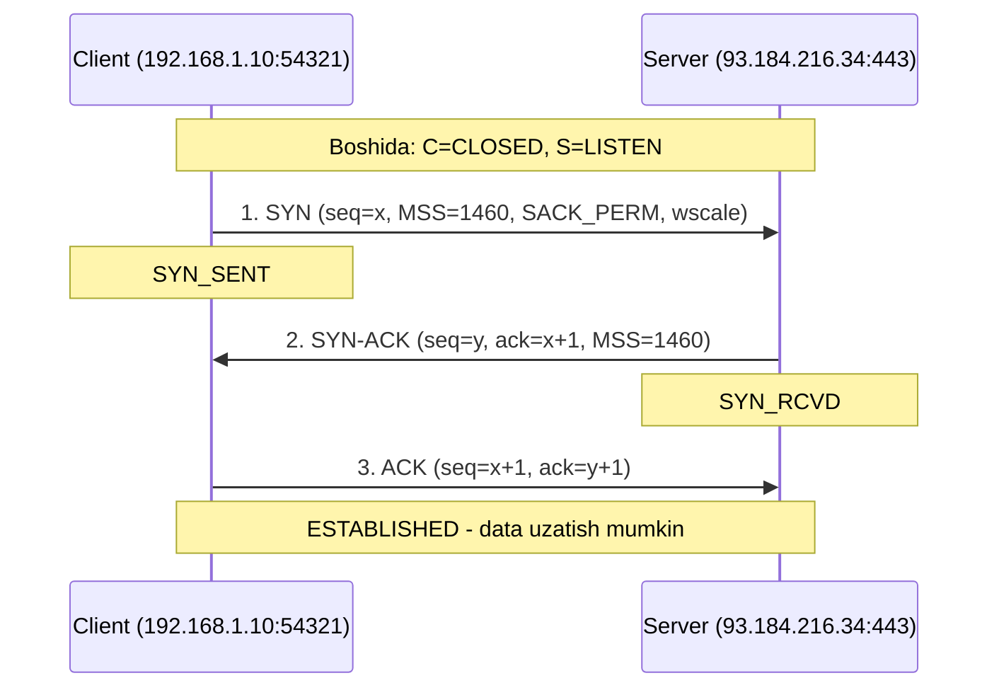
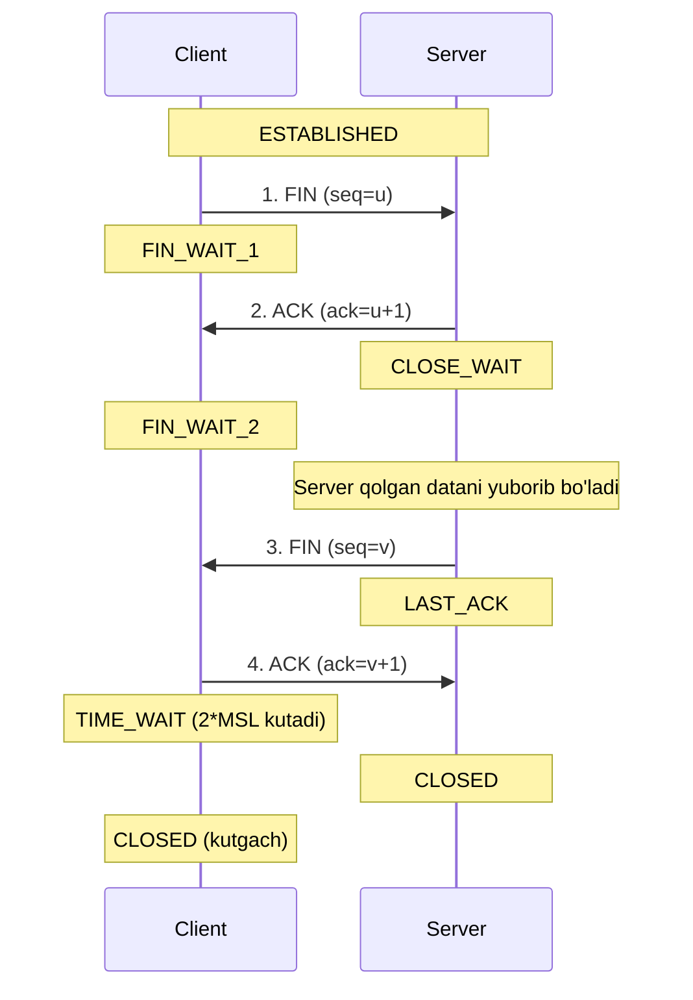
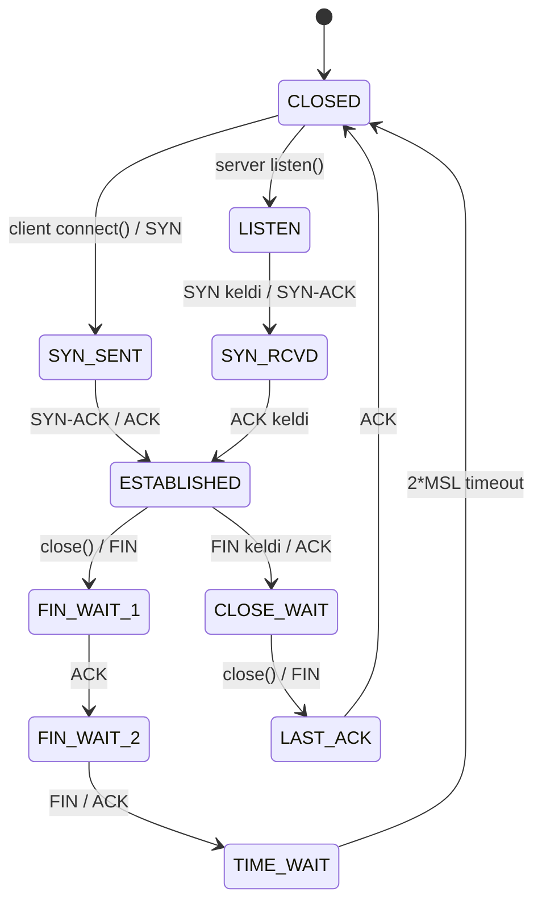
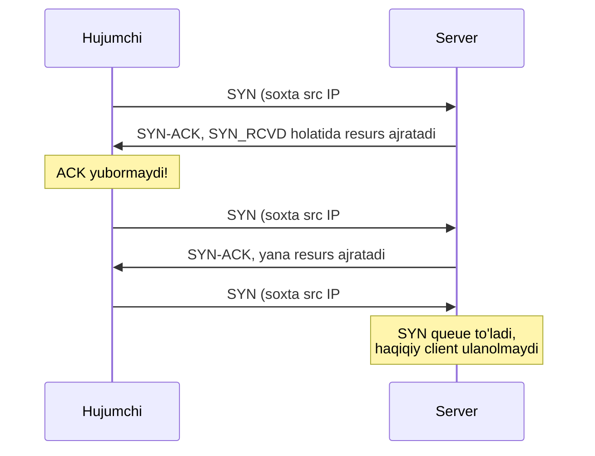

# 05. TCP Handshake va Connection boshqaruvi

## Muammo: gaplashishdan oldin "aloqa bormi?"

Ikki notanish odam telefonda gaplashmoqchi. Biri darhol gapira boshlasa nima bo'ladi?
Balki narigi tomon eshitmayapti, balki liniya band, balki umuman kimdir ko'tarmagan.
Shuning uchun avval "alo, eshityapsanmi?" deb tekshiriladi.

TCP ham xuddi shunday. Ma'lumot yuborishdan oldin ikki tomon **bir-birining
mavjudligini** tasdiqlashi va **sequence raqamlarini** kelishishi kerak. Bu jarayon
bo'lmasa, client server tayyor emasligini bilmasdan ma'lumot to'kib yuboradi va
hammasi yo'qoladi.

> Handshake — TCP ishonchli aloqasining **poydevori**. Har HTTP so'rov, har SSH
> session, har database connection aynan shu 3 ta paketdan boshlanadi.

## Analogiya: rasmiy tanishuv

Three-way handshake — bu ikki odamning rasmiy tanishuvi:

1. **A → B:** "Salom, men A. Suhbatni 287-raqamdan boshlayman." (**SYN**, seq=287)
2. **B → A:** "Salom A, 287-ni eshitdim (288-ni kutaman). Men B, o'zim 512-raqamdan
   boshlayman." (**SYN-ACK**, seq=512, ack=288)
3. **A → B:** "512-ni eshitdim (513-ni kutaman). Boshladik!" (**ACK**, ack=513)

Uchta xabardan keyin ikkalasi ham bir-birini **eshitayotganini** va qaysi raqamdan
boshlanishini biladi. Endi ishonchli suhbat mumkin.

Analogiya chegarasi: haqiqiy tanishuvda raqamni o'zing tanlaysan; TCP'da esa raqam
(**ISN** — Initial Sequence Number) **tasodifiy** tanlanadi, xavfsizlik uchun (pastda
ko'ramiz).

## Sodda ta'rif

**Three-way handshake** — TCP ulanishini o'rnatuvchi 3 bosqichli protokol: **SYN →
SYN-ACK → ACK**. Maqsadi:

1. Ikki tomon bir-birining mavjudligini tasdiqlaydi.
2. Sequence raqamlar (ISN) sinxronlanadi.
3. Parametrlar (MSS, window scale, SACK support) kelishiladi.

## Three-way handshake — bosqichma-bosqich



**1-qadam — Client SYN yuboradi.** Client `SYN` flag bilan paket jo'natadi. Ichida
uning **ISN** (tasodifiy 32-bitli son, masalan `x`) bor. Application data yo'q.
Client `SYN_SENT` holatiga o'tadi.

**2-qadam — Server SYN-ACK qaytaradi.** Server SYN'ni oladi, bufer va o'zgaruvchilar
ajratadi, o'z ISN'ini (`y`) tanlaydi va `SYN+ACK` yuboradi: `ack = x+1` ("sening
seq'ingni oldim, keyingisini kutyapman"). Server `SYN_RCVD` holatiga o'tadi.

**3-qadam — Client ACK yuboradi.** Client `ack = y+1` bilan javob beradi. SYN endi 0
(ulanish o'rnatildi). Bu paketda **application data ham bo'lishi mumkin**
(piggybacking). Ikkala tomon ham `ESTABLISHED`.

### Nima uchun aynan 3 ta paket?

- **2 ta yetmaydi:** faqat SYN va SYN-ACK bo'lsa, server client'ning javobini
  (client server seq'ini oldimi?) bilmaydi.
- **4 ta keraksiz:** server'ning ACK va SYN'ini bitta paketga birlashtirish mumkin
  (SYN-ACK). Shuning uchun 3 ta yetarli va optimal.

## ISN nima uchun tasodifiy?

ISN oddiy 1, 2, 3... bo'lsa, hujumchi keyingi raqamni **taxmin qilib**, soxta paket
inject qila oladi — bu **TCP sequence prediction attack**. Mashhur Mitnick hujumi
(1994) aynan shu zaiflikdan foydalangan. Shuning uchun RFC 6528 ISN'ni kriptografik
tarzda hisoblashni tavsiya qiladi:

```
ISN = M + F(localip, localport, remoteip, remoteport, secret_key)
```

- `M` — har 4 mikrosekundda oshadigan taymer.
- `F` — kriptografik hash (masalan, MD5-ga o'xshash).
- `secret_key` — serverning maxfiy kaliti.

Natijada ISN oldindan taxmin qilib bo'lmaydigan son bo'ladi.

## Connection teardown (4-way termination)

TCP **full-duplex** — har ikki yo'nalish **alohida** yopiladi. Shuning uchun uzish
uchun 4 ta paket kerak.



1. Client `FIN` yuboradi ("men ko'proq yubormayman").
2. Server `ACK` qaytaradi (lekin hali o'z datasini yuborishi mumkin).
3. Server ishini tugatib, o'z `FIN`ini yuboradi.
4. Client yakuniy `ACK` yuboradi va `TIME_WAIT` ga o'tadi.

## TCP holatlar (state) diagrammasi

Butun umr sikli bir state machine:



## TIME_WAIT — nega u kerak?

Ulanishni **aktiv yopgan** tomon (odatda client) `TIME_WAIT` holatiga o'tadi va
`2 * MSL` (Maximum Segment Lifetime) kutadi. Linux'da MSL = 30s, demak TIME_WAIT =
odatda 60s. Nega shuncha kutish kerak?

1. **Eski paketlar yo'qolsin:** tarmoqda kechikib qolgan eski segmentlar yangi
   (bir xil 4-tuple'li) ulanishga aralashmasin.
2. **Ishonchli yopilish:** oxirgi ACK yo'qolib, server FIN'ni qayta yuborsa, client
   javob bera olsin. TIME_WAIT tugagan bo'lsa, javob bera olmasdi.

> TIME_WAIT — bezovta qiluvchi emas, balki **himoya** mexanizmi. Uni ko'r-ko'rona
> o'chirish xavfli.

### Production muammosi: TIME_WAIT yig'ilishi

Yuqori trafik yuklamasida (masalan load balancer yoki mikroservis ko'p qisqa ulanish
ochsa) minglab `TIME_WAIT` ulanishlar yig'ilib, **ephemeral port tugab qolishi**
mumkin — "Cannot assign requested address" xatosi. Zamonaviy best practice (2025-2026):

- **Birinchi navbatda — connection pooling va HTTP keep-alive.** Ildiz sabab ko'p
  qisqa ulanish; ularni qayta ishlatish (reuse) muammoni yo'qotadi.
- **`net.ipv4.tcp_tw_reuse=1`** — client tomonda TIME_WAIT portlarini tezroq qayta
  ishlatish. Zamonaviy tarmoqlarda (TCP timestamps yoqilgan) xavfsiz. **Faqat client
  tomon uchun** — server fiksatsiya port'da tinglaydi, unga kamdan-kam kerak.
- **Ephemeral port diapazonini kengaytirish:** `ip_local_port_range="1024 65535"`.
- **`tcp_tw_recycle` DAN QOCHING** — u NAT bilan buziladi va Linux 4.12 da olib
  tashlangan.

Muhim tamoyil: system tuning "shiftni ko'taradi", lekin ildiz sababni ilova
darajasida (connection reuse) tuzatish kerak.

## Half-open connection

Bir tomon (masalan server) qulasa yoki tarmoq uzilsa, ikkinchi tomon buni bilmay
qolishi mumkin — ulanish "half-open" (yarim ochiq) bo'lib qoladi. Bir tomon
ulanish borligiga ishonadi, ikkinchisi esa yo'q.

Bu holat qanday yuzaga keladi? Faraz qil, client SYN yuboradi, server SYN-ACK
qaytaradi, lekin client (yoki hujumchi) yakuniy ACK yubormaydi. Server esa `SYN_RCVD`
holatida qolib, ACK'ni kutadi va resurs (xotira) egallab turadi.

Half-open ulanishlarni aniqlash uchun **TCP keep-alive** (`SO_KEEPALIVE`) ishlatiladi:
Linux default'da 2 soat idle'dan keyin 9 ta probe har 75 soniyada yuboriladi; javob
kelmasa, ulanish o'lik deb topiladi.

## SYN Flood hujumi

Half-open holatning ataylab suiiste'mol qilinishi — **SYN flood** hujumi.



Hujumchi minglab `SYN` yuboradi, lekin **hech qachon yakuniy ACK yubormaydi**
(ko'pincha soxta source IP bilan). Server har biri uchun `SYN_RCVD` holatida resurs
(SYN queue slot, xotira) ajratadi. Queue to'lganda **haqiqiy** client'lar ulana
olmaydi — bu Denial of Service.

### Himoya: SYN Cookies

Yechim — **SYN cookies** (Daniel J. Bernstein, 1996). G'oya: server SYN kelganda
**hech qanday holat saqlamaydi**. Buning o'rniga ISN'ni cookie sifatida hisoblaydi:

```
ISN = HASH(src_ip, src_port, dst_ip, dst_port, secret) | timestamp | MSS
```

Client haqiqiy bo'lsa, yakuniy ACK'da `ack = ISN + 1` qaytaradi. Server cookie'ni
qayta hisoblab tekshiradi — mos bo'lsa, ulanishni o'rnatadi. Soxta client ACK
qaytarmagani uchun (yoki noto'g'ri IP'ga ketgani uchun) hech qanday resurs
sarflanmaydi.

Zamonaviy holat (2025-2026): barcha zamonaviy OS'lar (Linux, Windows) SYN cookies'ni
**default** qo'llab-quvvatlaydi. Linux'da `net.ipv4.tcp_syncookies=1` odatda yoqilgan
— faqat SYN queue chegaraga yetganda ishga tushadi (muvozanatli yondashuv: normal
vaqtda standart handshake, hujum vaqtida cookies). Qo'shimcha himoya: rate limiting,
backlog queue'ni kattalashtirish, va bulutli DDoS himoya xizmatlari.

## Port scanning (nmap)

Handshake mexanizmi port skanerlashda ham ishlatiladi. Client SYN yuborib, javobga
qarab port holatini aniqlaydi:

| Server javobi | Port holati |
|---|---|
| **SYN-ACK** | Port **ochiq** (biror xizmat tinglayapti) |
| **RST** | Port **yopiq** (xizmat yo'q, lekin host javob beradi) |
| **Javob yo'q** | **Firewall** bloklagan (paket tashlanadi) |

## Worked example: handshake'ni tcpdump'da ko'rish

```
$ sudo tcpdump -i any -nn 'tcp port 443 and (tcp-syn|tcp-fin) != 0'
12:34:56.789 IP 192.168.1.10.54321 > 93.184.216.34.443: Flags [S], seq 1234567890, win 64240,
    options [mss 1460,sackOK,TS,nop,wscale 7], length 0
12:34:56.812 IP 93.184.216.34.443 > 192.168.1.10.54321: Flags [S.], seq 9876543210,
    ack 1234567891, win 65535, options [mss 1460,sackOK,wscale 7], length 0
12:34:56.812 IP 192.168.1.10.54321 > 93.184.216.34.443: Flags [.], ack 9876543211, length 0
```

Tahlil:
- 1-qator — SYN (`[S]`), seq=1234567890.
- 2-qator — SYN-ACK (`[S.]`), `ack=1234567891` (= client ISN + 1).
- 3-qator — ACK (`[.]`), `ack=9876543211` (= server ISN + 1).
- RTT ~23ms (12.789 → 12.812).

## Worked example: holatlarni ss bilan kuzatish

```bash
$ ss -tan
State      Recv-Q  Send-Q  Local Address:Port   Peer Address:Port
LISTEN     0       128     0.0.0.0:443          0.0.0.0:*
ESTAB      0       0       10.0.0.5:443         203.0.113.7:51514
TIME-WAIT  0       0       10.0.0.5:38402       142.250.74.110:443
SYN-RECV   0       0       10.0.0.5:443         198.51.100.9:60001

# TIME_WAIT ulanishlar sonini sanash
$ ss -tan state time-wait | wc -l
```

`SYN-RECV` ko'p bo'lsa — SYN flood belgisi bo'lishi mumkin. `TIME-WAIT` ko'p bo'lsa
— qisqa ulanishlar ko'p (connection pooling kerak).

## 🤔 O'ylab ko'r

Client SYN yubordi, server SYN-ACK qaytardi, lekin client yakuniy ACK'ni **yubormadi**
(masalan, dastur o'chib qoldi). Server qanday holatda qoladi va bu bir necha ming
marta takrorlansa nima bo'ladi?

<details>
<summary>Javobni ko'rish</summary>

Server `SYN_RCVD` holatida qoladi va ACK'ni kutadi — bu **half-open** ulanish. Har
biri uchun server SYN queue'da slot va xotira egallaydi. Bir marta bo'lsa zararsiz.
Lekin bir necha ming marta takrorlansa — bu **SYN flood** hujumi: queue to'ladi,
haqiqiy client'lar ulana olmaydi. Himoya: **SYN cookies** (server holat saqlamaydi,
ISN'ni cookie sifatida hisoblaydi) va rate limiting.
</details>

## Ko'p uchraydigan xatolar

**Xato 1: "TIME_WAIT — bu bug, uni o'chirish kerak."**
Yo'q. TIME_WAIT eski adashgan paketlar yangi ulanishga aralashmasligi va oxirgi ACK
yo'qolsa qayta javob berish uchun kerak. Uni ko'r-ko'rona o'chirmaslik kerak; muammo
bo'lsa, avval connection pooling bilan hal qil.

**Xato 2: "CLOSE_WAIT o'z-o'zidan yo'qoladi."**
Yo'q. `CLOSE_WAIT` ko'p bo'lishi — bu odatda **dastur bug'i**: ilova `close()`
chaqirmagan (masalan Go'da `defer conn.Close()` unutilgan). Kernel o'zi tuzatmaydi.

**Xato 3: "ISN har doim 0 dan boshlanadi."**
Yo'q. ISN **tasodifiy** tanlanadi — sequence prediction hujumini oldini olish uchun.

**Xato 4: "SYN cookies har doim ishlaydi va TIME_WAIT'ni almashtiradi."**
Yo'q. SYN cookies faqat **SYN flood**ga qarshi va odatda queue to'lganda ishga
tushadi; u TIME_WAIT bilan bog'liq emas. Ular ikki alohida mexanizm.

## Xulosa

- **Three-way handshake** (SYN → SYN-ACK → ACK) ulanishni o'rnatadi va ISN'larni sinxronlaydi.
- 3 ta paket optimal: 2 ta yetmaydi, 4 ta keraksiz.
- **ISN tasodifiy** — sequence prediction hujumidan himoya (RFC 6528).
- Uzish — **4-way** (FIN/ACK har yo'nalishda alohida), chunki TCP full-duplex.
- **TIME_WAIT** (2*MSL) — eski paketlar va yo'qolgan ACK'dan himoya.
- **Half-open** — bir tomon ulanishni bilmay qolishi; keep-alive bilan aniqlanadi.
- **SYN flood** — half-open'ni suiiste'mol; himoya **SYN cookies** + rate limiting.

## 🧠 Eslab qol

- Handshake = rasmiy tanishuv: SYN, SYN-ACK, ACK.
- ISN tasodifiy (xavfsizlik uchun).
- Uzish 4 paket (full-duplex).
- TIME_WAIT = 2*MSL, himoya mexanizmi.
- SYN flood => SYN cookies (holat saqlamaslik).

## ✅ O'z-o'zini tekshir

**1.** Nima uchun handshake aynan 3 ta paketdan iborat, 2 yoki 4 emas?

<details>
<summary>Javob</summary>

2 ta yetmaydi: server client'ning "seni eshitdim" javobini olmaydi, ya'ni ikki
tomonlama sinxronizatsiya to'liq bo'lmaydi. 4 ta keraksiz: server o'zining ACK
(client SYN'ini tasdiqlash) va SYN (o'z ISN'ini e'lon qilish) ni **bitta** SYN-ACK
paketiga birlashtira oladi. Shuning uchun 3 ta optimal.
</details>

**2.** TIME_WAIT nima uchun kerak va uni o'chirish nega xavfli?

<details>
<summary>Javob</summary>

Ikki sabab: (1) tarmoqda kechikkan **eski segmentlar** yangi (bir xil 4-tuple'li)
ulanishga aralashmasligi; (2) oxirgi ACK yo'qolsa va qarshi tomon FIN'ni qayta
yuborsa, javob bera olish. O'chirsang, eski adashgan paket yangi ulanishga tushib,
ma'lumot buzilishi mumkin. Avval connection pooling bilan qisqa ulanishlar sonini kamaytir.
</details>

**3.** SYN flood hujumi qanday ishlaydi va SYN cookies uni qanday to'xtatadi?

<details>
<summary>Javob</summary>

Hujumchi minglab SYN yuboradi, lekin yakuniy ACK yubormaydi. Server har biri uchun
`SYN_RCVD` holatida resurs (queue slot, xotira) ajratib, queue to'ladi — haqiqiy
client ulana olmaydi. **SYN cookies**: server SYN kelganda holat **saqlamaydi**,
ISN'ni `(4-tuple + secret)` hash'idan hisoblaydi. Client haqiqiy bo'lsa, ACK'da
`ISN+1` qaytaradi; server cookie'ni qayta hisoblab tekshiradi. Soxta client ACK
qaytarmagani uchun resurs sarflanmaydi.
</details>

**4.** `ss -tan` chiqishida juda ko'p `CLOSE_WAIT` ko'rsang, muammo qayerda?

<details>
<summary>Javob</summary>

Odatda **ilova kodida**: dastur `close()` chaqirmagan. `CLOSE_WAIT` — qarshi tomon
FIN yuborgan, lekin sening iloVang hali ulanishni yopmagan holat. Kernel o'zi
tuzatmaydi — kodda ulanishni yopishni (masalan Go'da `defer conn.Close()`) qo'shish kerak.
</details>

## 🛠 Amaliyot

**1. Oson (Modify).** `sudo tcpdump -i any -nn 'tcp[tcpflags] & (tcp-syn) != 0'`
ishga tushir va brauzerda sayt och. SYN va SYN-ACK paketlarini top, ISN raqamlarni yoz.

**2. O'rta (faded example).** SYN cookie tekshiruvining soddalashtirilgan Go skeletoni:

```go
func genSYNCookie(srcIP, dstIP string, srcPort, dstPort int) uint32 {
    // TODO: (srcIP+dstIP+portlar+secret) dan hash hisobla va qaytar
}
func verifySYNCookie(ackNum uint32, srcIP, dstIP string, srcPort, dstPort int) bool {
    expected := genSYNCookie(srcIP, dstIP, srcPort, dstPort)
    // TODO: ackNum == expected+1 ekanini tekshir
}
```

<details>
<summary>Yordam</summary>

Hash uchun `hash/fnv` yoki `crypto/sha256` ishlat: barcha parametrlarni string qilib
qo'shib, hash qiymatining `uint32` qismini qaytar. Verify'da `return ackNum == expected+1`.
Bu server SYN'da yuborgan `ISN` ga client `+1` qo'shib qaytarishini tekshiradi.
</details>

**3. Qiyin (Make).** `ss -tan state time-wait | wc -l` bilan TIME_WAIT sonini o'lcha.
Keyin `ab` yoki `curl` bilan bir serverga ko'p qisqa ulanish och va sonning
o'zgarishini kuzat. Nega ko'payadi va connection pooling bu sonni qanday kamaytiradi — tushuntir.

## 🔁 Takrorlash

- **Oldingi dars:** [`04-tcp.md`](04-tcp.md) — TCP asoslari, sequence/ACK.
- **Keyingi dars:** [`06-flow-va-congestion-control.md`](06-flow-va-congestion-control.md).
- **Takrorlash jadvali:** ertaga → 3 kundan keyin → 1 haftadan keyin savollarga qayt.
- **Feynman testi:** "Nega handshake kerak va TIME_WAIT nima uchun mavjud?" —
  do'stingga 3 jumlada tushuntir.

## 📚 Manbalar

- Kurose & Ross, *Computer Networking*, 3.5.6-bo'lim (TCP Connection Management)
- RFC 9293 — Transmission Control Protocol: https://datatracker.ietf.org/doc/html/rfc9293
- RFC 6528 — Defending against Sequence Number Attacks: https://datatracker.ietf.org/doc/html/rfc6528
- SYN flood va SYN cookies (2026): https://www.indusface.com/blog/what-is-syn-synchronize-attack-how-the-attack-works-and-how-to-prevent-the-syn-attack/
- AWS DDoS Best Practices — SYN flood: https://docs.aws.amazon.com/whitepapers/latest/aws-best-practices-ddos-resiliency/syn-flood-attacks.html
- TIME_WAIT tuning va tcp_tw_reuse: https://oneuptime.com/blog/post/2026-03-20-fix-tcp-time-wait-connections/view
- TCP port exhaustion (2025): https://www.michal-drozd.com/en/blog/tcp-time-wait-port-exhaustion/
