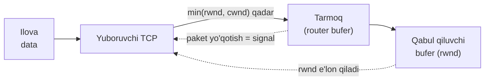
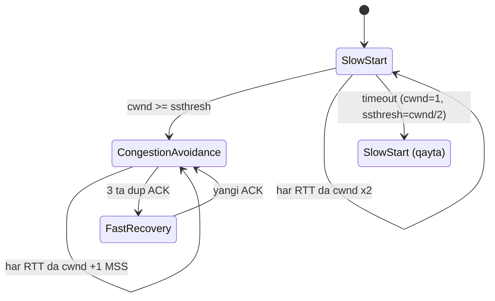
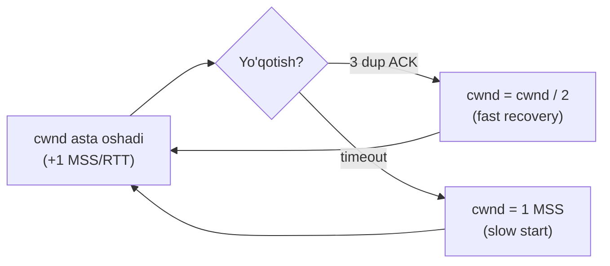

# 06. Flow Control va Congestion Control

## Muammo: ikki xil "haddan tashqari"

TCP'da ma'lumot yuborishda ikkita alohida "tiqilinch" xavfi bor:

1. **Qabul qiluvchi bo'kib qolishi:** yuboruvchi juda tez yuborsa, qabul qiluvchining
   **buferi** to'lib ketadi va ilova o'qib ulgurmaydi.
2. **Tarmoq bo'kib qolishi:** ko'p yuboruvchi bir vaqtda ma'lumot to'ksa, oradagi
   **router buferlari** to'lib, paketlar tashlanadi.

Bu ikki muammo har xil joyda (bir uchda va o'rtada) va har xil yechim talab qiladi.
Aksariyat yangi o'rganuvchilar ularni chalkashtiradi.

> **Flow control** — qabul qiluvchini himoya qiladi. **Congestion control** — tarmoqni
> himoya qiladi. Ikkalasi ham yuboruvchini sekinlashtiradi, lekin sabab boshqa.

## Analogiya: quvur va idish

Tasavvur qil, sen shlang (quvur) bilan idishga suv quyayapsan:

- **Flow control** = **idish hajmi**. Idish kichik bo'lsa, sekin quyasan — toshib
  ketmasin. Idish egasi (qabul qiluvchi) "hali shuncha joyim bor" deb aytadi.
- **Congestion control** = **quvurning o'zi**. Quvur ingichka yoki tiqilib qolgan
  bo'lsa, kuchli bosim bersang quvur yoriladi (paket yo'qoladi). Shuning uchun bosimni
  quvur ko'tara oladigan darajaga moslaysan.

Ikkalasi ham "sekin quy" deydi, lekin biri **idish uchun**, ikkinchisi **quvur uchun**.

## Ikki oyna: rwnd va cwnd

TCP ikkita oyna (window) yuritadi:

| Oyna | To'liq nomi | Kim belgilaydi | Nimani himoya qiladi |
|---|---|---|---|
| **rwnd** | receive window | qabul qiluvchi (header'da) | qabul qiluvchi buferi |
| **cwnd** | congestion window | yuboruvchi (o'zi hisoblaydi) | tarmoq |

Har lahzada yuboruvchi qancha tasdiqlanmagan ma'lumot yubora olishi:

```
Effektiv oyna = min(rwnd, cwnd)
```

Ya'ni TCP **ikkisidan kichigini** tanlaydi — ham qabul qiluvchini, ham tarmoqni
avaylaydi.



## Flow Control (qisqa takror)

O'tgan darsda ko'rdik: qabul qiluvchi `rwnd = RcvBuffer - (LastByteRcvd - LastByteRead)`
qiymatini header'da e'lon qiladi. Yuboruvchi `LastByteSent - LastByteAcked <= rwnd`
shartini saqlaydi. `rwnd=0` bo'lsa yuboruvchi to'xtaydi, lekin vaqti-vaqti bilan
1-baytlik zond yuborib, bufer bo'shaganini biladi. **Bu qabul qiluvchi bilan bog'liq.**

Endi asosiy yangi mavzu — **congestion control** — tarmoq bilan bog'liq.

## Congestion Control: nima uchun kerak?

Tarmoqda paket yo'qotishning asosiy sababi — **router buferlarining to'lib ketishi**.
Agar ko'p yuboruvchi cheklovsiz ma'lumot to'ksa, router queue'lari toshadi, paketlar
tashlanadi, hamma qayta yuboradi va yana ko'proq bosim — bu **congestion collapse**
(tiqilinch qulashi). 1980-yillarda internet aynan shu sababdan sekinlashib qolgandi.

TCP yechimi: har bir yuboruvchi **o'zini** cheklaydi. Tarmoqdan aniq signal
(paket yo'qotish) kelganda tezlikni kamaytiradi, hammasi yaxshi bo'lganda esa asta
oshiradi.

## Congestion control uch fazasi



### 1. Slow Start (sekin boshlash)

- `cwnd` **1 MSS** dan boshlanadi.
- Har tasdiqlangan segment uchun cwnd **1 MSS** ga oshadi.
- Natijada har **RTT** da cwnd **ikki barobar** — bu **eksponensial** o'sish
  (1 → 2 → 4 → 8 → ...).
- `ssthresh` (slow start threshold) ga yetganda to'xtaydi.

"Sekin" nomi yanglishtirmasin — u eksponensial tez o'sadi. "Sekin" degani **kichik
qiymatdan** (1 MSS) boshlanadi, degani.

### 2. Congestion Avoidance (tiqilinshdan qochish)

- `ssthresh` dan keyin ehtiyotkorlik boshlanadi.
- cwnd har RTT da faqat **1 MSS** ga oshadi — **chiziqli** (linear) o'sish.
- Tarmoq chegarasiga yaqinlashganda sekin qadam qo'yiladi.

### 3. Fast Recovery (tez tiklanish)

- **3 ta takroriy ACK** kelganda ishga tushadi.
- cwnd **yarimga** qisqaradi va Fast Recovery holatiga o'tadi.
- Har qo'shimcha takroriy ACK uchun cwnd 1 MSS ga oshadi; yangi ACK kelganda
  congestion avoidance'ga qaytadi.

## AIMD: TCP'ning yuragi

TCP congestion control **AIMD** (Additive Increase, Multiplicative Decrease)
tamoyiliga asoslanadi:

- **Additive Increase** — hammasi yaxshi bo'lsa, cwnd'ni **chiziqli** (+1 MSS/RTT) oshirish.
- **Multiplicative Decrease** — yo'qotish bo'lsa, cwnd'ni **yarmiga** qisqartirish.

Natija — mashhur **"arra tishlari" (sawtooth)** grafigi: asta ko'tarilib, keyin keskin
tushib, yana ko'tariladi.



E'tibor ber: **timeout** (jiddiyroq signal) — cwnd'ni 1 MSS'ga tushiradi;
**3 dup ACK** (yumshoqroq signal, chunki keyingi segmentlar hali yetyapti) — faqat
yarmiga tushiradi. TCP signal og'irligiga qarab har xil reaksiya qiladi.

## Yuklanishni qanday aniqlaydi?

TCP tarmoq yuklanishini **ikki** yo'l bilan sezadi:

1. **Timeout** — segment uchun ACK belgilangan vaqtda kelmasa (jiddiy yo'qotish).
2. **3 ta takroriy ACK** — bir xil ACK uch marta ketma-ket kelsa (yumshoqroq belgi).

Klassik TCP (Reno, CUBIC) uchun **paket yo'qotish = tarmoq band** degan taxmin
ishlaydi. Lekin bu taxmin har doim to'g'ri emas — pastda ko'ramiz.

## Fair share (adil taqsimlash)

K ta TCP ulanishi R o'tkazuvchanlikli kanalni bo'lishsa, AIMD tufayli har biri
taxminan **R/K** tezlikka intiladi. Mexanizm: ikki ulanish birga o'sadi (chiziqli),
umumiy tezlik R'dan oshganda paket yo'qoladi, ikkalasi ham yarimga tushadi — vaqt
o'tib teng nuqtaga yaqinlashadi.

Lekin amaliyotda adolat buziladi:
- **UDP** congestion control'siz — u sekinlashmay, TCP trafikni siqib chiqaradi.
- **Parallel TCP ulanishlar** — bir ilova 10 ta ulanish ochsa, kanaldan
  nomutanosib katta ulush oladi (brauzerlar shundan foydalanadi).

## Zamonaviy holat: CUBIC vs BBR (2025-2026)

Bu eng qiziq amaliy qism. Klassik loss-based algoritmlar zamonaviy yuqori tezlikli,
uzoq-RTT tarmoqlar uchun samarasiz — juda katta cwnd kerak va bitta yo'qotish
tezlikni keskin tushiradi.

| | **CUBIC** | **BBR** |
|---|---|---|
| Kim | Linux'da uzoq yillar default | Google (2016), BBRv3 zamonaviy |
| Signal | **paket yo'qotish** (loss-based) | **bandwidth + RTT** (model-based) |
| Yondashuv | yo'qotishda yarimga tushadi | yo'qotishga haddan tashqari reaksiya qilmaydi |
| Yaxshi joyi | past-BDP, barqaror kanallar, adolat | yuqori-RTT, yo'qotishli kanallar |
| Zaif joyi | uzoq-RTT/lossy'da unumsiz | chuqur-bufer/turli-RTT'da adolat buzilishi |

**CUBIC** — cwnd'ni kubik (cubic) funksiya bilan o'stiradi; 2026 boshida ham
ko'p Linux tizimida **default**. **BBR** esa boshqacha — u paket yo'qotishga emas,
kanalning **haqiqiy bandwidth va RTT modeliga** qaraydi. Shuning uchun yo'qotishli
kanalda (masalan 100ms RTT, 1% loss) BBR CUBIC'dan bir necha barobar tezroq bo'ladi.

Zamonaviy tadqiqotlar (2025-2026): BBRv3 yuqori-BDP (bandwidth-delay product),
sayoz-buferli internet yo'llarida CUBIC'dan **~30% gacha** ko'p throughput bera oladi,
past kutish (queuing delay) bilan. Lekin:

- BBR **video konferensiya, o'yin, streaming** kabi latency-sezgir, bandwidth-och
  ilovalar uchun afzal.
- CUBIC esa **adolat muhim** bo'lgan, past-BDP yoki o'zgaruvchan kanallarda barqarorroq.

Shu sabab BBR "yangi default" bo'lishi **ilova ehtiyojiga bog'liq** — universal
g'olib emas. Qo'shimcha eslatma: **QUIC** ham congestion control'ni user-space'da
qiladi, ko'pincha BBR'dan foydalanadi.

## Zamonaviy muammolar

Yuqori tezlikli kanallarda (masalan 10 Gbit/s) an'anaviy TCP samarasiz:

- Juda katta cwnd qiymatlari kerak.
- Yo'qotish ehtimoli haddan past bo'lishi kerak (~2×10⁻¹⁰).
- Aynan shuning uchun CUBIC, BBR, TCP Vegas kabi yangi algoritmlar paydo bo'ldi.

## Boshqa yechimlar

Adolat va real-time ehtiyojlar uchun qo'shimcha protokollar:

- **DCCP** — UDP'ga o'xshash, lekin congestion control bilan.
- **SCTP** — ko'p-oqimli (multi-stream) ishonchli protokol.
- **TFRC** — TCP'ga do'stona tezlik nazorati (real-time media uchun).

## Worked example: congestion control'ni sozlash

```bash
# Joriy algoritmni ko'rish
$ sysctl net.ipv4.tcp_congestion_control
net.ipv4.tcp_congestion_control = cubic

# Mavjud algoritmlar
$ sysctl net.ipv4.tcp_available_congestion_control
net.ipv4.tcp_available_congestion_control = reno cubic bbr

# BBR ga o'tkazish
$ sudo sysctl -w net.ipv4.tcp_congestion_control=bbr

# Retransmission (qayta uzatish) statistikasi - yo'qotish belgisi
$ nstat -a | grep -i retrans
$ ss -ti    # har ulanish uchun cwnd, rtt, retrans ko'rsatadi
```

`ss -ti` chiqishida bitta ulanish uchun:

```
ESTAB 0 0 10.0.0.5:443 203.0.113.7:51514
    cubic wscale:7,7 rto:204 rtt:3.2/1.5 cwnd:42 ssthresh:30 ...
```

Bu yerda `cwnd:42` — hozirgi congestion window (42 MSS), `ssthresh:30` — slow start
chegarasi, `rtt:3.2` — o'lchangan RTT. Bu qiymatlar real vaqtda o'zgarib turadi.

## 🤔 O'ylab ko'r

Ikkita signal keldi: (a) bitta segmentda **timeout**; (b) boshqa ulanishda **3 ta
takroriy ACK**. Har biriga TCP cwnd'ni qanday o'zgartiradi va nega farqli?

<details>
<summary>Javobni ko'rish</summary>

**Timeout** — jiddiyroq signal (ACK umuman kelmadi, ehtimol qattiq tiqilinch). TCP
cwnd'ni **1 MSS**'ga tushiradi va slow start'dan qayta boshlaydi. **3 ta takroriy
ACK** — yumshoqroq signal: keyingi segmentlar hali yetib turibdi, demak tarmoq to'liq
qulagan emas. TCP cwnd'ni faqat **yarmiga** tushiradi (fast recovery). Farq: signal
og'irligiga mos reaksiya — TCP tarmoq holati haqidagi ma'lumotni signal turidan oladi.
</details>

## Ko'p uchraydigan xatolar

**Xato 1: "Flow control va congestion control bir xil."**
Yo'q. Flow control — **qabul qiluvchi** buferi uchun (rwnd). Congestion control —
**tarmoq** uchun (cwnd). Effektiv oyna = min(rwnd, cwnd).

**Xato 2: "Slow start sekin o'sadi."**
Yo'q. Slow start **eksponensial** o'sadi (har RTT da x2). "Sekin" degani kichik
qiymatdan (1 MSS) boshlanadi, degani.

**Xato 3: "Paket yo'qotish har doim tarmoq band ekanini bildiradi."**
Yo'q. Bu loss-based algoritmlar (CUBIC) taxmini. Wi-Fi yoki uzoq-RTT kanalda paket
tasodifiy yo'qolishi mumkin, tiqilinsiz. BBR aynan shuning uchun yo'qotishga emas,
bandwidth/RTT modeliga qaraydi.

**Xato 4: "UDP ham TCP kabi adolat bilan tezlikni pasaytiradi."**
Yo'q. UDP'da congestion control **yo'q** — u sekinlashmaydi va TCP trafikni siqib
chiqarishi mumkin.

## Xulosa

- **Flow control** — qabul qiluvchi buferi (rwnd); **congestion control** — tarmoq (cwnd).
- Effektiv oyna = **min(rwnd, cwnd)**.
- Congestion control 3 faza: **slow start** (eksponensial), **congestion avoidance**
  (chiziqli), **fast recovery**.
- **AIMD**: yaxshi bo'lsa +1 MSS/RTT, yo'qotishda yarimga — "arra tishlari" grafigi.
- Yuklanish signali: **timeout** (cwnd=1) yoki **3 dup ACK** (cwnd/2).
- **CUBIC** — loss-based, ko'p tizimda default; **BBR** — model-based, uzoq-RTT/lossy'da tezroq.
- BBR "default" bo'lishi ilova ehtiyojiga bog'liq — universal g'olib yo'q.

## 🧠 Eslab qol

- Flow = qabul qiluvchi (rwnd), congestion = tarmoq (cwnd).
- Effektiv oyna = min(rwnd, cwnd).
- Slow start eksponensial, avoidance chiziqli.
- AIMD => sawtooth grafigi.
- CUBIC loss-based, BBR model-based (RTT+bandwidth).

## ✅ O'z-o'zini tekshir

**1.** Flow control va congestion control farqi nimada? Bittasi yo'q bo'lsa nima buziladi?

<details>
<summary>Javob</summary>

**Flow control** qabul qiluvchi buferini himoya qiladi (rwnd) — yo'q bo'lsa, tez
yuboruvchi sekin qabul qiluvchi buferini to'ldirib, paketlar tashlanadi. **Congestion
control** tarmoqni himoya qiladi (cwnd) — yo'q bo'lsa, ko'p yuboruvchi router buferini
to'ldirib, congestion collapse yuz beradi. TCP ikkisini birga ishlatadi:
oyna = min(rwnd, cwnd).
</details>

**2.** Slow start "sekin" deb ataladi, lekin qanday o'sadi?

<details>
<summary>Javob</summary>

**Eksponensial** — har RTT da cwnd ikki barobar (1 → 2 → 4 → 8 MSS). "Sekin" nomi
faqat **boshlang'ich qiymat kichik** (1 MSS) ekanini bildiradi, o'sish sur'ati emas.
Bu ssthresh'ga yetganda to'xtab, chiziqli congestion avoidance'ga o'tadi.
</details>

**3.** Nima uchun timeout cwnd'ni 1 MSS'ga, 3 dup ACK esa faqat yarmiga tushiradi?

<details>
<summary>Javob</summary>

Signal og'irligi farqli. **Timeout** — hech qanday ACK kelmadi, ehtimol qattiq
tiqilinch yoki uzilish, shuning uchun eng ehtiyotkor javob: cwnd=1, slow start.
**3 dup ACK** — keyingi segmentlar hali yetib turibdi (qabul qiluvchi ACK yuboryapti),
demak tarmoq to'liq qulamagan, faqat bitta segment yo'qolgan — yumshoqroq javob:
cwnd yarmiga (fast recovery).
</details>

**4.** BBR CUBIC'dan qachon aniq afzal, va CUBIC qachon yaxshiroq?

<details>
<summary>Javob</summary>

**BBR** — yuqori-RTT va yo'qotishli (lossy) kanallarda afzal, chunki u yo'qotishga
haddan reaksiya qilmaydi, balki bandwidth/RTT modeliga qaraydi (masalan 100ms RTT,
1% loss'da bir necha barobar tezroq). **CUBIC** — adolat muhim, past-BDP yoki
o'zgaruvchan kanallarda barqarorroq, chunki uning konservativ xatti-harakati boshqa
oqimlar bilan tengroq bo'lishadi. Universal g'olib yo'q — ilova ehtiyojiga qarab tanlanadi.
</details>

## 🛠 Amaliyot

**1. Oson (Modify).** `sysctl net.ipv4.tcp_congestion_control` bilan joriy algoritmni
ko'r, `tcp_available_congestion_control` bilan mavjudlarini ko'r. `bbr` bor-yo'qligini tekshir.

**2. O'rta (faded example).** AIMD mantiqini soddalashtirilgan Go funksiyasi bilan model qil:

```go
type CC struct{ cwnd, ssthresh int }

func (c *CC) onACK() {
    if c.cwnd < c.ssthresh {
        // TODO: slow start - cwnd ni qanday oshirasan?
    } else {
        // TODO: congestion avoidance - chiziqli oshirish (~ +1 per RTT)
    }
}
func (c *CC) onTripleDupACK() {
    // TODO: ssthresh = cwnd/2, cwnd = ssthresh (fast recovery)
}
func (c *CC) onTimeout() {
    // TODO: ssthresh = cwnd/2, cwnd = 1 (slow start)
}
```

<details>
<summary>Yordam</summary>

Slow start'da har ACK'da `c.cwnd++` (RTT da ~x2 beradi). Congestion avoidance'da
`c.cwnd += 1` ni har RTT'da bir marta qilish uchun `c.cwnd += 1/c.cwnd` yaqinlashtirish
ishlatiladi. `onTripleDupACK`: `c.ssthresh = c.cwnd/2; c.cwnd = c.ssthresh`. `onTimeout`:
`c.ssthresh = c.cwnd/2; c.cwnd = 1`.
</details>

**3. Qiyin (Make).** `ss -ti` bilan aktiv ulanishning `cwnd`, `rtt`, `retrans`
qiymatlarini bir necha soniya davomida kuzat (katta fayl yuklab). cwnd o'zgarishini
kuzatib, "arra tishlari" ni real hayotda ko'rishga harakat qil va nimani ko'rganingni yoz.

## 🔁 Takrorlash

- **Oldingi darslar:** [`04-tcp.md`](04-tcp.md) (flow control kirish),
  [`05-tcp-handshake-va-connection.md`](05-tcp-handshake-va-connection.md).
- **Modul boshi:** [`README.md`](README.md).
- **Takrorlash jadvali:** ertaga → 3 kundan keyin → 1 haftadan keyin savollarga qayt.
- **Feynman testi:** "Flow control va congestion control farqini, va nega TCP
  ularni birga ishlatishini do'stingga 3 jumlada tushuntira olasanmi?"

## 📚 Manbalar

- Kurose & Ross, *Computer Networking*, 3.6-3.7-bo'lim (Congestion Control)
- RFC 5681 — TCP Congestion Control: https://datatracker.ietf.org/doc/html/rfc5681
- BBR vs CUBIC (2025 tadqiqot): https://arxiv.org/html/2510.22461v1
- TCP congestion control algoritmlari (Reno, CUBIC, BBR): https://oneuptime.com/blog/post/2026-03-20-tcp-congestion-control-algorithms/view
- Google Cloud — BBR: https://cloud.google.com/blog/products/networking/tcp-bbr-congestion-control-comes-to-gcp-your-internet-just-got-faster
- BBRv3 va VPS optimizatsiyasi (2026): https://www.vps1111.com/en/bbr-vps-acceleration-guide-2026-en.html
