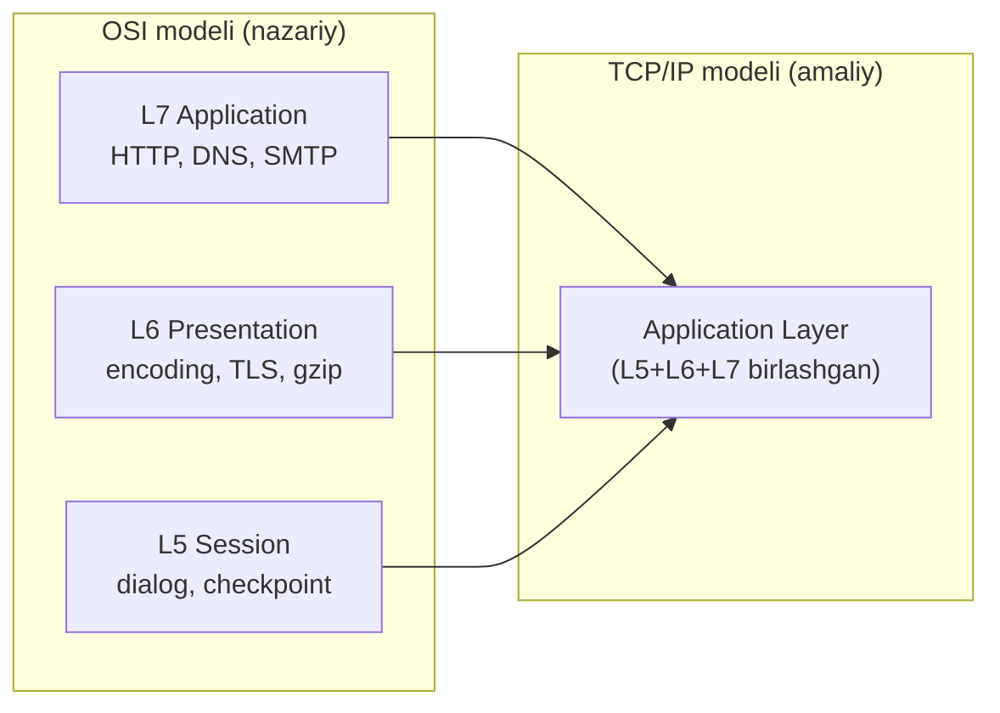
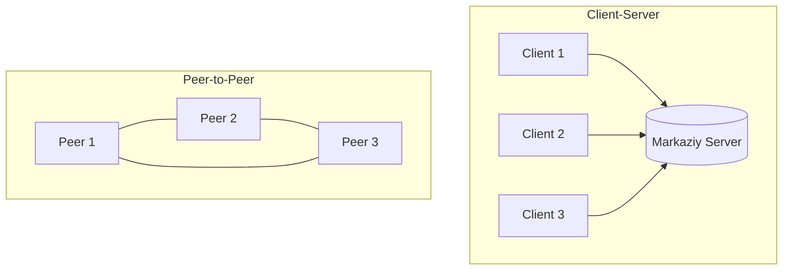
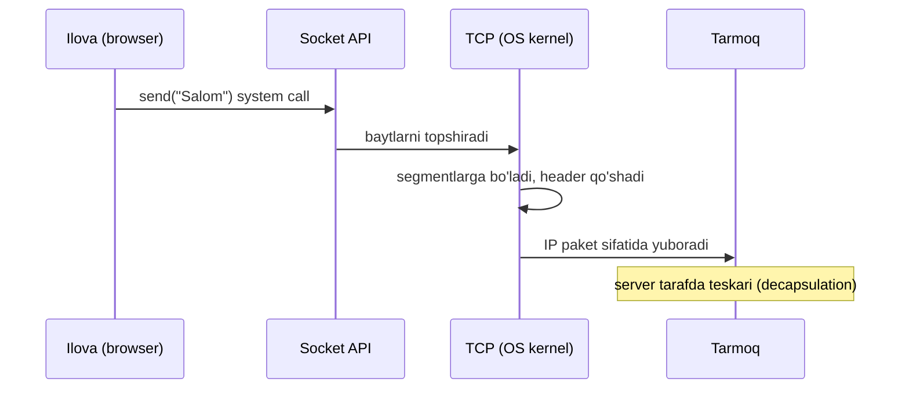

# 01. Application Layer va Socketlar

## Muammo: internet foydalanuvchi uchun nima qiladi?

Oldingi modullarda biz IP paketni bir hostdan boshqasiga yetkazishni, TCP ning
ishonchli oqim berishini ko'rdik. Lekin foydalanuvchi TCP segment yoki IP paket
haqida o'ylamaydi. U shunchaki `google.com` ni ochadi, xat yuboradi, faylni
yuklaydi.

Savol tug'iladi: paket yetib bordi, keyin nima? Qaysi dastur uni oladi? Xabar
qanday formatda bo'lishi kerak? Kim birinchi gapiradi — client yoki server?
Aynan shu savollarga **application layer** javob beradi.

> **Oltin qoida:** Transport layer ma'lumotni *qayerga* yetkazishni hal qiladi,
> application layer esa *nima* yuborilishi va *qanday* muloqot qilinishini hal qiladi.

## Analogiya: pochta xizmati va xat mazmuni

Tasavvur qil, xat yozyapsan:

- **Physical/Data Link** — pochta mashinasi va yo'llar (fizik tashish).
- **Network (IP)** — konvertdagi manzil, xatni to'g'ri shaharga yo'naltiradi.
- **Transport (TCP/UDP)** — buyurtma xat: yetib borganini tasdiqlash, tartibni saqlash.
- **Application** — xatning **ichidagi matn** va uni yozish qoidalari (salomlashuv,
  til, imzo). Xat mazmunini faqat sen va qabul qiluvchi tushunadi, pochtachi emas.

Application layer — bu xatning tili va odob-qoidasi. HTTP, DNS, SMTP — bularning
har biri "qanday gaplashish" ning o'z tilidir.

## Sodda ta'rif

**Application layer** — tarmoq stekining eng yuqori qatlami bo'lib, dasturlar
(browser, mail client, SSH) o'zaro qanday **message** (xabar) almashishini
belgilaydi: xabar sintaksisi, ma'nosi va kim qachon yuborishi.

**Socket** (rozetka/eshik) — dastur bilan tarmoq o'rtasidagi dasturiy interfeys;
protokol emas, balki OS beradigan "eshik" orqali dastur ma'lumot yozadi va o'qiydi.

## Diagramma: OSI 5-6-7 va TCP/IP application layer

Nazariy OSI modelida yuqori uch qatlam alohida, amaliy TCP/IP modelida esa ular
bitta **Application layer** ga birlashgan.



TCP/IP RFC 1122 shu birlashtirishni rasmiylashtirgan: amalda HTTP bir vaqtning
o'zida application semantikasi (L7), TLS encoding (L6) va cookie/session (L5) ni
o'z ichida hal qiladi.

## Uchta qatlamning vazifalari (qisqacha)

| Qatlam | Vazifasi | Misol |
|--------|----------|-------|
| **Session (L5)** | Muloqotni ochish, checkpoint qo'yish, uzilganda tiklash | SSH channel, TLS session resumption, cookie |
| **Presentation (L6)** | Encoding, serialization, compression, encryption | UTF-8, JSON/Protobuf, gzip, TLS |
| **Application (L7)** | Foydalanuvchi xizmatlari, message formati | HTTP, DNS, SMTP, FTP |

### Session — muloqotni boshqaruvchi

Session layer ikki dastur o'rtasida **mantiqiy suhbat** ochadi. Muhim tushuncha:
bitta session ichida bir nechta TCP connection bo'lishi mumkin (FTP: control +
data), yoki bitta TCP ichida bir nechta session (SSH channel multiplexing).

Amaliyotda HTTP o'zi **stateless** (holatsiz) — har request mustaqil. Login
holatini saqlash uchun **cookie** ishlatiladi: bu session funksiyasini bajaradi,
lekin texnik jihatdan HTTP header (keyingi darslarda batafsil).

### Presentation — tarjimon

Turli tizimlar (Linux/Windows, ARM/x86) baytlar ma'nosini bir xil tushunishi
kerak. Presentation layer **encoding** (UTF-8), **serialization** (JSON/Protobuf),
**compression** (gzip) va **encryption** (TLS) bilan shug'ullanadi. Masalan,
tarmoqqa yuborilgan har bir ko'p baytli son **network byte order** (big-endian)
da bo'lishi kerak.

## Ikki arxitektura: Client-Server va Peer-to-Peer

Application ilovalari asosan ikki xil qurilishga ega.



| Xususiyat | Client-Server | Peer-to-Peer (P2P) |
|-----------|---------------|--------------------|
| Rol | Server xizmat beradi, client so'raydi | Har peer ham client, ham server |
| Markaz | Bor (server) | Yo'q (markazlashmagan) |
| Scalability | Server yuki N bilan chiziqli oshadi | Ko'p peer = ko'p bandwidth (self-scalable) |
| Fault tolerance | Server o'chsa — hammasi to'xtaydi | Bitta peer o'chsa — davom etadi |
| Misol | HTTP, DNS, email | BitTorrent, blockchain |

2026 holati: zamonaviy microservices arxitekturasi ichki muloqot uchun **gRPC**,
tashqi client uchun **WebSocket yoki HTTP/3** ishlatadi — bularning barchasi
client-server modelida. P2P esa file sharing (BitTorrent) va blockchain da
hukmron. Katta tizimlar ko'pincha ikkalasini aralashtiradi.

## Diagramma: socket — dastur va tarmoq o'rtasidagi eshik

Socket dasturni transport layer ga ulaydi. Client tomonda socket — client
process va TCP connection o'rtasidagi eshik; server tomonda — server process va
TCP o'rtasidagi eshik.



Muhim: socket — bu **file descriptor** (fayl tavsiflovchi) kabi OS resursi. OS
har socket uchun bufer ajratadi, port tayinlaydi va IP stack bilan bog'laydi.

## Worked example 1 — socket "eshigini" ochish (notional machine)

Quyidagi Python kodi socketda aslida nima sodir bo'lishini ko'rsatadi. Go bilan
real socket dasturlash 10-modulda batafsil bo'ladi; bu yerda faqat tushuncha.

```python
import socket

# --- 1-qadam: OS dan socket (eshik) so'raymiz ---
sock = socket.socket(socket.AF_INET, socket.SOCK_STREAM)
# AF_INET = IPv4, SOCK_STREAM = TCP. OS file descriptor qaytaradi (masalan: 5)

# --- 2-qadam: serverga ulanamiz (TCP handshake shu yerda) ---
sock.connect(("example.com", 80))

# --- 3-qadam: application message (HTTP request) yozamiz ---
sock.send(b"GET / HTTP/1.1\r\nHost: example.com\r\nConnection: close\r\n\r\n")

# --- 4-qadam: javobni o'qiymiz ---
data = sock.recv(4096)
print(data.decode()[:100])
sock.close()
```

Chiqish (output):
```
HTTP/1.1 200 OK
Content-Type: text/html
Content-Length: 1256
...
```

Notional machine (ichkarida nima bo'ladi): `send()` chaqirilganda baytlar darhol
tarmoqqa ketmaydi — avval OS ning **socket buferiga** ko'chiriladi, keyin TCP uni
segmentlarga bo'lib, o'z vaqtida yuboradi. Dastur `send()` dan qaytadi, lekin
paket hali yo'lda bo'lishi mumkin.

## Worked example 2 — hostdagi socketlarni ko'rish

Har bir ochiq connection — bu socket. Ularni `ss` (yoki eski `netstat`) bilan
ko'ramiz.

```bash
# Barcha ochiq TCP socketlar (holati bilan)
ss -tnp

# Faqat "tinglayotgan" (listening) socketlar — server portlari
ss -tlnp
```

Chiqish:
```
State    Local Address:Port   Peer Address:Port   Process
LISTEN   0.0.0.0:22           0.0.0.0:*           sshd
LISTEN   127.0.0.1:5432       0.0.0.0:*           postgres
ESTAB    192.168.1.10:54210   142.250.74.110:443 firefox
```

Bu yerda har qator — bitta socket. `LISTEN` — server kutmoqda, `ESTAB` —
o'rnatilgan connection. Socket to'rt qiymat bilan aniqlanadi: **src IP : src port
+ dst IP : dst port** (4-tuple).

> 🤔 **O'ylab ko'r:** Nega bitta server porti (masalan 443) ustida minglab
> client bir vaqtda ulanolishi mumkin, ular chalkashib ketmaydi?

<details>
<summary>💡 Javobni ko'rish</summary>

Chunki socketni faqat port emas, **to'liq 4-tuple** aniqlaydi: (src IP, src port,
dst IP, dst port). Har bir client boshqa src IP yoki src port bilan keladi, shu
sabab server ularni farqlaydi. Masalan `A:5001 -> S:443` va `B:6002 -> S:443` —
bular ikki xil socket, garchi server porti bir xil bo'lsa ham. Bu jarayon
**demultiplexing** deb ataladi (transport layer moduli).
</details>

## Ko'p uchraydigan xatolar

⚠️ **"Socket — bu protokol"** — noto'g'ri. Socket protokol emas, balki dastur va
transport layer o'rtasidagi **interfeys** (API). U ostidagi protokol TCP yoki UDP
bo'lishi mumkin.

⚠️ **"Session layer = TCP connection"** — noto'g'ri. TCP connection transport
layerda (bitta 4-tuple). Session — mantiqiy suhbat, u bitta yoki bir nechta TCP
connection ni o'z ichiga olishi mumkin.

⚠️ **"send() qilsam ma'lumot darhol yetib boradi"** — noto'g'ri. `send()` faqat
OS buferiga yozadi. Haqiqiy yuborish va yetkazish TCP zimmasida; hatto `send()`
muvaffaqiyatli qaytsa ham, paket yo'qolishi mumkin.

⚠️ **"P2P har doim client-serverdan yaxshi"** — noto'g'ri. P2P scalability va fault
tolerance beradi, lekin xavfsizlik, tartib va boshqaruv client-serverda osonroq.
Har biri o'z joyida.

## Xulosa

- Application layer *nima* yuborilishi va *qanday* muloqot qilinishini belgilaydi;
  transport layer esa *qayerga* yetkazishni.
- OSI ning L5 (session), L6 (presentation), L7 (application) qatlamlari TCP/IP da
  bitta **Application layer** ga birlashgan.
- Session — muloqot boshqaruvi, presentation — encoding/encryption, application —
  foydalanuvchi xizmatlari.
- **Socket** — dastur va tarmoq o'rtasidagi eshik (interfeys), protokol emas; OS
  resursi, file descriptor kabi ishlaydi.
- Ikki asosiy arxitektura: **client-server** (markazlashgan) va **P2P**
  (markazlashmagan, self-scalable).
- Socketni to'liq **4-tuple** (src/dst IP + port) aniqlaydi — shu sabab bir port
  ustida minglab client ulanadi.

## 🧠 Eslab qol

- Socket = eshik (interfeys), protokol emas.
- Application layer = message formati + muloqot qoidalari.
- TCP/IP da L5+L6+L7 = bitta Application layer.
- Client-server = markaz bor; P2P = markaz yo'q, self-scalable.
- Socketni 4-tuple aniqlaydi, faqat port emas.

## ✅ O'z-o'zini tekshir (retrieval practice)

**1. Nega HTTP stateless bo'lsa-yu, saytlar login holatini "eslay" oladi?**

<details>
<summary>Javob</summary>

HTTP o'zi holatni saqlamaydi, lekin **cookie** mexanizmi buni yechadi: server
`Set-Cookie` bilan ID beradi, client har request da `Cookie` header bilan qaytaradi.
Bu session funksiyasi (L5 ekvivalenti), lekin amalda application layerda HTTP header
sifatida amalga oshiriladi.
</details>

**2. P2P N ta foydalanuvchi qo'shilganda nega client-serverdan yaxshiroq masshtablanadi?**

<details>
<summary>Javob</summary>

Client-serverda har yangi client server yukini oshiradi (chiziqli). P2P da har
yangi peer *ham* yuklab oladi, *ham* tarqatadi — ya'ni bandwidth resursini olib
kirodi. Shu sabab ko'proq peer = ko'proq umumiy tezlik (self-scalable).
</details>

**3. Ikki client bir server portiga (443) ulanganda ular nega chalkashmaydi?**

<details>
<summary>Javob</summary>

Har connection to'liq 4-tuple bilan aniqlanadi: (src IP, src port, dst IP, dst
port). Ikki client turli src IP yoki src port bilan keladi, shu sabab server
ularni ikki alohida socket sifatida farqlaydi (demultiplexing).
</details>

**4. `sock.send()` qaytdi — bu ma'lumot yetib bordi degani emasmi?**

<details>
<summary>Javob</summary>

Yo'q. `send()` faqat ma'lumotni OS socket buferiga ko'chirdi. Haqiqiy yuborish va
yetkazish TCP ning ishi va bu keyinroq, asinxron sodir bo'ladi. Yetkazishni faqat
ACK yoki application-level tasdiq kafolatlaydi.
</details>

## 🛠 Amaliyot

1. **Oson (Modify):** Yuqoridagi `ss -tlnp` ni o'z mashinangda ishga tushir.
   Qaysi portlarda dasturlar tinglayapti? `22`, `80`, `443` bormi? Har portni
   qaysi process ishlatayotganini yoz.

2. **O'rta (faded example):** Quyidagi Python skeletini to'ldir — DNS emas, IP
   bilan HTTP so'rov yuboradigan socket klienti:
   ```python
   import socket
   sock = socket.socket(socket.AF_INET, socket.SOCK_STREAM)
   # TODO: sock ni "93.184.216.34", 80 ga ulang
   # TODO: "HEAD / HTTP/1.1\r\nHost: example.com\r\nConnection: close\r\n\r\n" yuboring
   # TODO: 1024 bayt o'qing va chop eting
   sock.close()
   ```
   <details><summary>Hint</summary>

   `connect((ip, port))`, `send(b"...")`, `recv(1024)`. Byte string uchun `b"..."`
   ishlating va `\r\n` bilan qatorlarni tugating.
   </details>

3. **Qiyin (Make):** `ss -s` (statistics) yordamida hostingdagi umumiy TCP
   socketlar sonini top. Keyin browserda 5 ta yangi tab och va farqni kuzat.
   Qaysi holatdagi (ESTAB, TIME-WAIT) socketlar ko'paydi? Nega TIME-WAIT paydo
   bo'ladi?
   <details><summary>Hint</summary>

   TIME-WAIT — connection yopilgandan keyin ham socket bir muddat (odatda 2*MSL)
   saqlanadi, kechikkan paketlar chalkashmasligi uchun. Bu transport layer xatti-harakati.
   </details>

## 🔁 Takrorlash

Bog'liq oldingi mavzular (kontekst):
- Transport layer — socket ostidagi TCP/UDP, multiplexing/demultiplexing.
- Network layer (IP) — socket 4-tuple dagi IP manzillar.

Bu moduldagi keyingi darslar bu poydevorga tayanadi:
- [02-dns.md](02-dns.md) — birinchi application protokol: nom -> IP.
- [03-http.md](03-http.md) — eng ko'p ishlatiladigan application protokol.

Takrorlash jadvali:
- **Ertaga:** "O'z-o'zini tekshir" 1 va 3 savoliga qaytib javob ber.
- **3 kundan keyin:** Socket 4-tuple va client-server vs P2P jadvalini xotiradan chiz.
- **1 haftadan keyin:** Butun stekni (application -> transport -> network) bir misolda tushuntir.

Feynman testi: "Socket nima?" degan savolga do'stingga kod ishlatmasdan, 3
jumlada tushuntirib ber. "Eshik" analogiyasidan boshla.

## 📚 Manbalar

- Kurose & Ross, "Computer Networking: A Top-Down Approach", Bob 2 (Application Layer)
- [RFC 1122 — Requirements for Internet Hosts](https://datatracker.ietf.org/doc/html/rfc1122)
- [Client-Server vs Peer-to-Peer (Resilio)](https://www.resilio.com/blog/whats-the-difference-between-peer-to-peer-and-client-server)
- [Modern HTTP Stack in 2026: HTTP/3, gRPC, WebSockets](https://hemaks.org/posts/modern-http-stack-in-2026-http3-grpc-websockets-and-when-to-use-what/)
- [Cloudflare — OSI Model](https://www.cloudflare.com/learning/ddos/glossary/open-systems-interconnection-model-osi/)
