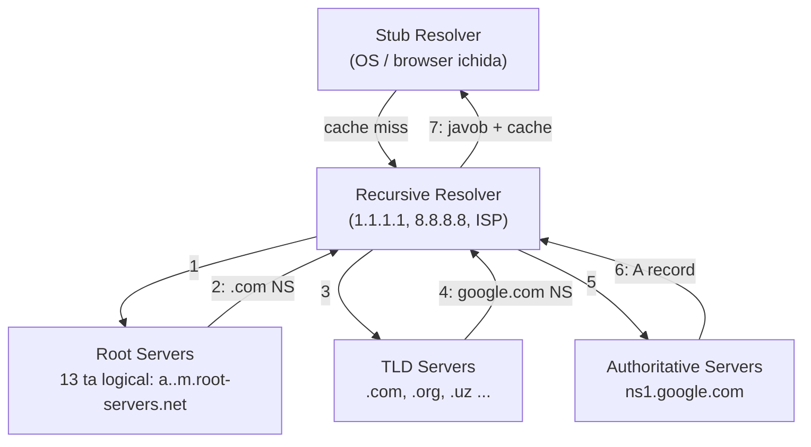
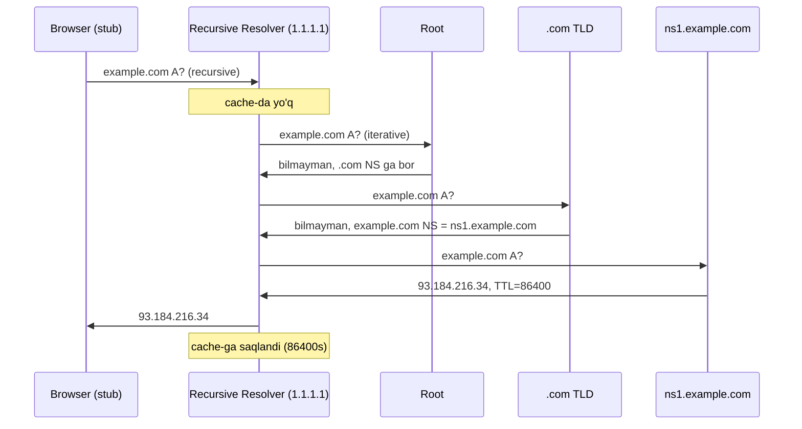
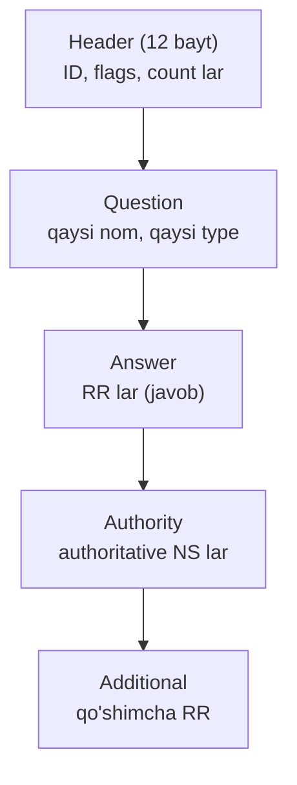
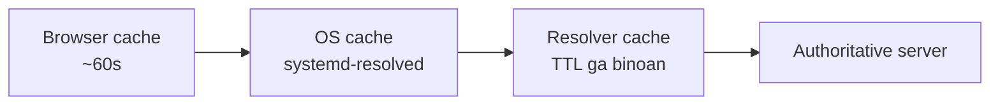

# 02. DNS — Internetning telefon kitobi

## Muammo: raqamlarni kim eslay oladi?

Oldingi darsda socket `("example.com", 80)` ga ulandi. Lekin tarmoq `example.com`
ni bilmaydi — u faqat IP manzillar bilan ishlaydi (`93.184.216.34`). Kimdir bu
nomni raqamga aylantirishi kerak.

Tasavvur qil, har sayt uchun IP ni yodlab yurishing kerak edi: Google
`142.250.74.110`, YouTube `142.250.72.238`... Bu imkonsiz. Bundan tashqari,
serverlar IP sini o'zgartirsa, hamma yodlaganini qayta o'rganishi kerak edi.

> **Oltin qoida:** DNS (Domain Name System) — inson uchun qulay nomlarni (google.com)
> kompyuter uchun qulay IP manzillarga tarjima qiluvchi taqsimlangan katalog xizmati.

## Analogiya: telefon kitobi va so'rov zanjiri

DNS — bu telefon kitobi. Ismni bilasan (`google.com`), raqamini (IP) topmoqchisan.
Lekin bitta ulkan kitob yo'q — u **ierarxik** ravishda bo'lingan:

- Sen ma'lumot byurosiga qo'ng'iroq qilasan (**resolver**).
- Byuro bilmasa, "bosh katalog" ga murojaat qiladi (**root server**).
- Bosh katalog aytadi: ".com bo'limiga qo'ng'iroq qil" (**TLD server**).
- .com bo'limi aytadi: "google.com ni faqat ularning o'z registraturasi biladi"
  (**authoritative server**).
- Registratura nihoyat raqamni beradi.

Farqi: bu zanjir bir soniyaning ulushida ishlaydi va javob **keshlanadi** (bir
marta so'ralgach, keyingi safar tez).

## Sodda ta'rif

**DNS** — hostname (masalan `www.google.com`) ni IP manzilga (masalan
`142.250.74.110`) aylantiruvchi, butun dunyo bo'ylab tarqalgan ierarxik server
tizimi. Asosan **UDP port 53** ustida ishlaydi (kichik, tez so'rovlar uchun).

## Diagramma: DNS ierarxiyasi



To'rt daraja server:
1. **Root DNS** — eng yuqori (13 ta logical, aslida anycast bilan 1000+ fizik).
2. **TLD (Top-Level Domain)** — `.com`, `.org`, `.uz` uchun mas'ul.
3. **Authoritative** — aniq domen (google.com) uchun rasmiy javob beruvchi.
4. **Recursive resolver** — hammasini sen uchun so'rab, javobni yig'ib beruvchi.

## Recursive vs Iterative — ikki so'rov turi

Bu ikkovini chalkashtirmaslik muhim.

| Tur | Kim so'raydi | Ma'nosi |
|-----|--------------|---------|
| **Recursive** | Stub -> Resolver | "Menga TO'LIQ javob ber, hammasini o'zing top" |
| **Iterative** | Resolver -> Root/TLD/Auth | "Sen bilgan eng yaxshi qadamni ayt, qolganini o'zim so'rayman" |

Ya'ni browser resolverdan **recursive** so'raydi (bitta to'liq javob kutadi),
resolver esa zanjir bo'ylab **iterative** so'raydi (har qadamda keyingi manzil).



## Resource Record turlari (RR)

Har DNS yozuvi 4 maydon: **(Name, Type, Value, TTL)**. Eng muhim turlar:

| Type | Vazifasi | Misol |
|------|----------|-------|
| **A** | IPv4 manzil | `example.com -> 93.184.216.34` |
| **AAAA** | IPv6 manzil | `example.com -> 2606:2800:220:1::1` |
| **CNAME** | Alias (boshqa nomga ishora) | `www.example.com -> example.com` |
| **MX** | Mail server | `example.com -> mail.example.com (prio 10)` |
| **NS** | Name server | `example.com -> ns1.example.com` |
| **TXT** | Matn (SPF, DKIM, tekshiruv) | `v=spf1 include:_spf.google.com ~all` |
| **SOA** | Zone info (serial, refresh) | authoritative zone boshi |
| **PTR** | Reverse DNS (IP -> nom) | `34.216.184.93.in-addr.arpa -> example.com` |
| **CAA** | Qaysi CA cert bera oladi | `CAA 0 issue "letsencrypt.org"` |

## Diagramma: DNS message formati

DNS xabar 5 bo'limdan iborat. Header 12 bayt.



Header dagi muhim flaglar:
- **QR** — 0=query, 1=response.
- **RD** — Recursion Desired (client recursive so'rayapti).
- **RA** — Recursion Available (server recursive qila oladi).
- **TC** — Truncated (UDP ga sig'madi, TCP ga o'ting).
- **RCODE** — javob kodi: 0=NOERROR, 2=SERVFAIL, 3=NXDOMAIN.

## Caching va TTL — DNS ning tezlik siri

Har so'rovni root'dan boshlash sekin bo'lardi. Shu sabab har javob **keshlanadi**.
Har RR **TTL** (Time To Live) ga ega — necha soniya keshda saqlash kerakligini
aytadi.



TTL strategiyasi:
- **Yuqori (24s+):** kam o'zgaradigan, static record.
- **Past (5 min):** load balancer, failover uchun.
- **Juda past (60s):** server ko'chirish (migration) vaqtida.

⚠️ Cache muammosi: server IP o'zgarsa ham, eski IP TTL tugaguncha keshda qoladi.
Shu sabab migration'dan **oldin** TTL ni pastga tushirish kerak.

## Worked example 1 — `dig` bilan so'rov

`dig` (Domain Information Groper) — DNS so'rovlarini yuboradigan asosiy vosita.

```bash
dig example.com
```

Chiqish (qisqartirilgan):
```
;; ->>HEADER<<- opcode: QUERY, status: NOERROR, id: 13420
;; flags: qr rd ra; QUERY: 1, ANSWER: 1

;; QUESTION SECTION:
;example.com.            IN   A

;; ANSWER SECTION:
example.com.     76547   IN   A   93.184.216.34

;; Query time: 12 msec
;; SERVER: 1.1.1.1#53(1.1.1.1)
```

Bu yerda `76547` — TTL (keshda qolgan soniya), `93.184.216.34` — A record,
`SERVER: 1.1.1.1` — javob bergan resolver.

## Worked example 2 — `dig +trace` bilan to'liq zanjir

`+trace` root'dan boshlab har qadamni ko'rsatadi (kesh ishlatmaydi):

```bash
dig +trace example.com
```

Chiqish (qisqartirilgan):
```
.            512000  IN  NS  a.root-servers.net.   # root
com.         172800  IN  NS  a.gtld-servers.net.   # .com TLD
;; received from 198.41.0.4#53(a.root-servers.net)

example.com. 172800  IN  NS  a.iana-servers.net.   # authoritative
;; received from 192.5.6.30#53(a.gtld-servers.net)

example.com. 86400   IN  A   93.184.216.34         # yakuniy javob
;; received from 199.43.135.53#53(a.iana-servers.net)
```

E'tibor ber: uchta "sakrash" — root, TLD, authoritative — va har biri keyingi
manzilni ko'rsatdi (iterative). Boshqa foydali variantlar:

```bash
dig @8.8.8.8 example.com AAAA   # Google resolver, IPv6
dig @9.9.9.9 example.com MX     # Quad9, mail server
dig -x 93.184.216.34            # reverse (IP -> nom)
dig +short example.com          # faqat javob
```

> 🤔 **O'ylab ko'r:** `dig example.com` 12 msec oldi. Aynan shu so'rovni darhol
> qayta ishlatsang, vaqt qancha bo'ladi va nega?

<details>
<summary>💡 Javobni ko'rish</summary>

Deyarli 0-1 msec bo'ladi. Chunki birinchi so'rov javobi resolver (va OS) keshiga
TTL bo'yicha saqlangan. Ikkinchi so'rov root/TLD/authoritative zanjiriga bormaydi
— javob to'g'ridan-to'g'ri keshdan keladi. TTL tugagach yana to'liq so'rov ketadi.
</details>

## DNS Privacy — DoH, DoT, DoQ (2026 holati)

An'anaviy DNS port 53 da **ochiq (plaintext)** yuboriladi. ISP, Wi-Fi egasi,
hujumchi — hammasi qaysi saytga kirayotganingizni ko'radi. Buni shifrlangan DNS
protokollari hal qiladi.

| Protokol | Port | Transport | Ko'rinish |
|----------|------|-----------|-----------|
| **DNS** (an'anaviy) | 53 | UDP/TCP | Plaintext, hamma ko'radi |
| **DoT** (over TLS) | 853 | TCP+TLS | Shifrlangan, lekin port 853 ko'rinadi |
| **DoH** (over HTTPS) | 443 | TCP+TLS+HTTP | HTTPS bilan aralashadi, eng yashirin |
| **DoQ** (over QUIC) | 853 | UDP+QUIC | Shifrlangan, no head-of-line blocking |
| **DoH3** (DoH over HTTP/3) | 443 | UDP+QUIC | Eng zamonaviy, DoH+DoQ afzalligi |

2026 yangiliklari (WebSearch): Mozilla ma'lumotiga ko'ra AQSH Firefox
foydalanuvchilarining **85% dan ortig'i** DoH ishlatadi. APNIC 2026 tadqiqoti
dunyoda **931+ faol DoH resolver** aniqladi (avvalgidan 4 barobar ko'p). DoQ va
DoH3 tezlik bo'yicha shifrlanmagan DNS bilan deyarli tenglashdi. Quad9, NextDNS,
AdGuard DoQ ni qo'llaydi; Cloudflare va Google esa hali production DoQ bermaydi.

```bash
# DoH testi (Cloudflare JSON API)
curl -H 'accept: application/dns-json' \
     'https://1.1.1.1/dns-query?name=example.com&type=A'
```
Chiqish:
```json
{"Status":0,"Answer":[{"name":"example.com","type":1,"TTL":76547,
 "data":"93.184.216.34"}]}
```

## Xavfsizlik muammolari

- **DNS cache poisoning** — hujumchi soxta javob inject qiladi (Kaminsky attack,
  2008). Himoya: random source port + transaction ID, DNSSEC, DoT/DoH.
- **DNS hijacking / MITM** — so'rovni ushlab, soxta IP berish.
- **DDoS amplification** — kichik so'rovga katta javob, spoofed IP bilan qurbon
  serverga yo'naltiriladi.
- **DNSSEC** — har javobga kriptografik imzo (RRSIG) qo'shadi, chain of trust
  root'dan boshlanadi. Lekin sekin tarqalgan (5-10% domen); o'rniga DoT/DoH ustun keldi.

## Ko'p uchraydigan xatolar

⚠️ **"DNS TCP ishlatmaydi"** — noto'g'ri. Asosan UDP/53, lekin javob katta bo'lsa
(DNSSEC, zone transfer) yoki TC flag ko'tarilsa — TCP/53 ishlatiladi.

⚠️ **"Recursive va iterative bir xil narsa"** — noto'g'ri. Recursive = "hammasini
o'zing top" (stub -> resolver). Iterative = "keyingi qadamni ayt" (resolver ->
serverlar).

⚠️ **"TTL=0 eng tez"** — noto'g'ri. TTL=0 keshlashni o'chiradi, ya'ni har so'rov
to'liq zanjir bilan boradi — sekinroq va serverga katta yuk.

⚠️ **"DNS o'zgartirsam darhol hamma ko'radi"** — noto'g'ri. Eski record TTL
tugaguncha keshlarda qoladi. Shuning uchun migration'dan oldin TTL ni pasaytir.

## Xulosa

- DNS hostname ni IP ga aylantiradi; asosan UDP/53 ustida ishlaydi.
- Ierarxiya: root -> TLD -> authoritative; resolver bularni birlashtiradi.
- Recursive (stub->resolver, to'liq javob) va iterative (resolver->serverlar,
  qadamma-qadam) so'rovlarini farqla.
- RR turlari: A, AAAA, CNAME, MX, NS, TXT, PTR, CAA — har biri o'z vazifasi.
- Caching + TTL — DNS ning tezlik siri; migration'dan oldin TTL pasaytiriladi.
- 2026: DoH/DoT/DoQ shifrlangan DNS keng tarqaldi; Firefox DoH 85%+.

## 🧠 Eslab qol

- DNS = nom -> IP tarjimon, UDP/53.
- Zanjir: root -> TLD -> authoritative.
- Recursive = "hammasini top", iterative = "keyingi qadam".
- TTL = keshda saqlash muddati; o'zgarishdan oldin pasaytir.
- DoH (443), DoT (853), DoQ (QUIC/853) — shifrlangan DNS.

## ✅ O'z-o'zini tekshir (retrieval practice)

**1. Nima uchun DNS UDP ni afzal ko'radi, TCP emas?**

<details>
<summary>Javob</summary>

DNS so'rov/javob kichik (odatda <512 bayt) va tez bo'lishi kerak. UDP da bitta
query + bitta response = 2 paket. TCP handshake qo'shimcha 3 paket va latency
qo'shadi. Lekin javob katta bo'lsa (DNSSEC, zone transfer) yoki TC flag ko'tarilsa
— TCP/53 ishlatiladi.
</details>

**2. Server IP sini o'zgartirding, lekin ko'p foydalanuvchi hali eski IP ga
kiryapti. Nega va qanday oldini olardin?**

<details>
<summary>Javob</summary>

Eski A record resolver va OS keshlarida **TTL tugaguncha** qolgan. Oldini olish:
o'zgartirishdan bir necha kun oldin TTL ni pastga (masalan 300s) tushirish, keyin
IP ni almashtirish — shunda keshlar tez yangilanadi.
</details>

**3. `dig` javobida `flags: qr rd ra` nimani anglatadi?**

<details>
<summary>Javob</summary>

`qr` — bu response (query emas). `rd` — Recursion Desired (client recursive
so'radi). `ra` — Recursion Available (server recursive qila oladi). Bu javob
recursive resolverdan kelganini bildiradi.
</details>

**4. DoH port 443 ni, DoT esa 853 ni ishlatadi. Qaysi biri "yashirinroq" va nega?**

<details>
<summary>Javob</summary>

DoH yashirinroq. Chunki u port 443 da oddiy HTTPS trafik bilan aralashadi — ISP
uni oddiy web trafikidan ajrata olmaydi. DoT esa alohida port 853 ni ishlatadi,
shuning uchun "bu DNS trafik" ekanligi ko'rinadi (mazmuni shifrlangan bo'lsa ham).
</details>

## 🛠 Amaliyot

1. **Oson (Modify):** `dig google.com` ni ishga tushir, TTL ni yoz. Bir daqiqa
   kutib qayta ishga tushir — TTL kamayganini kuzat. Nega kamaydi?
   <details><summary>Hint</summary>

   Resolver keshdagi record uchun TTL ni "sanab pasaytiradi" — necha soniya
   o'tgan bo'lsa, shuncha kam qoladi. 0 ga yetganda qayta so'raydi.
   </details>

2. **O'rta (faded example):** Quyidagi buyruqlarni to'ldir — Gmail mail
   serverlarini va domenning TXT (SPF) yozuvini top:
   ```bash
   dig gmail.com ____     # TODO: mail server record type
   dig google.com ____    # TODO: SPF/DKIM uchun record type
   dig +trace ____        # TODO: to'liq zanjirni ko'rish uchun domen
   ```
   <details><summary>Hint</summary>

   Mail server uchun `MX`, matn yozuvlari uchun `TXT`. `+trace` istalgan domenda ishlaydi.
   </details>

3. **Qiyin (Make):** `dig @1.1.1.1 example.com` va `dig @8.8.8.8 example.com` ni
   solishtir. Javob bir xilmi? Endi `dig +dnssec example.com` bilan DNSSEC
   imzosini so'ra. `RRSIG` record keldimi? DNSSEC yoqilgan domen top.
   <details><summary>Hint</summary>

   `cloudflare.com` DNSSEC yoqilgan. `+dnssec` flagi `RRSIG` yozuvlarini
   qaytaradi. Ikki resolver bir xil javob bermasa — bu potentsial poisoning belgisi.
   </details>

## 🔁 Takrorlash

Bog'liq oldingi mavzular:
- [01-application-layer-va-socketlar.md](01-application-layer-va-socketlar.md) —
  socket ulanishdan oldin DNS ishlaydi.
- Transport layer — DNS UDP/TCP ustida.

Keyingi bog'liq darslar:
- [03-http.md](03-http.md) — DNS'dan keyin HTTP so'rov ketadi.
- [05-https-tls.md](05-https-tls.md) — DoT/DoH aynan TLS ustida ishlaydi.

Takrorlash jadvali:
- **Ertaga:** DNS ierarxiya diagrammasini xotiradan chiz.
- **3 kundan keyin:** Recursive vs iterative farqini bir do'stingga tushuntir.
- **1 haftadan keyin:** "O'z-o'zini tekshir" 1 va 2 savoliga qayt.

Feynman testi: "Nega DNS kerak?" savoliga telefon kitobi analogiyasidan boshlab
3 jumlada javob ber.

## 📚 Manbalar

- [RFC 1034/1035 — DNS](https://datatracker.ietf.org/doc/html/rfc1035)
- [RFC 8484 — DNS over HTTPS](https://datatracker.ietf.org/doc/html/rfc8484)
- [RFC 9250 — DNS over QUIC](https://datatracker.ietf.org/doc/html/rfc9250)
- [DNS Encryption in 2026 (packet.guru)](https://packet.guru/blog/DNS-Encryption-in-2026)
- [DNS Privacy: DoH, DoT, and DoQ (2026)](https://dasroot.net/posts/2026/03/dns-privacy-doh-dot-dns-over-quic/)
- [DoH3, DoQ and DoT (captaindns)](https://www.captaindns.com/en/blog/doh3-doq-dot-2025-latest)
- [Cloudflare 1.1.1.1](https://1.1.1.1/)
- Kurose & Ross, "Computer Networking", Bob 2.5 (DNS)
