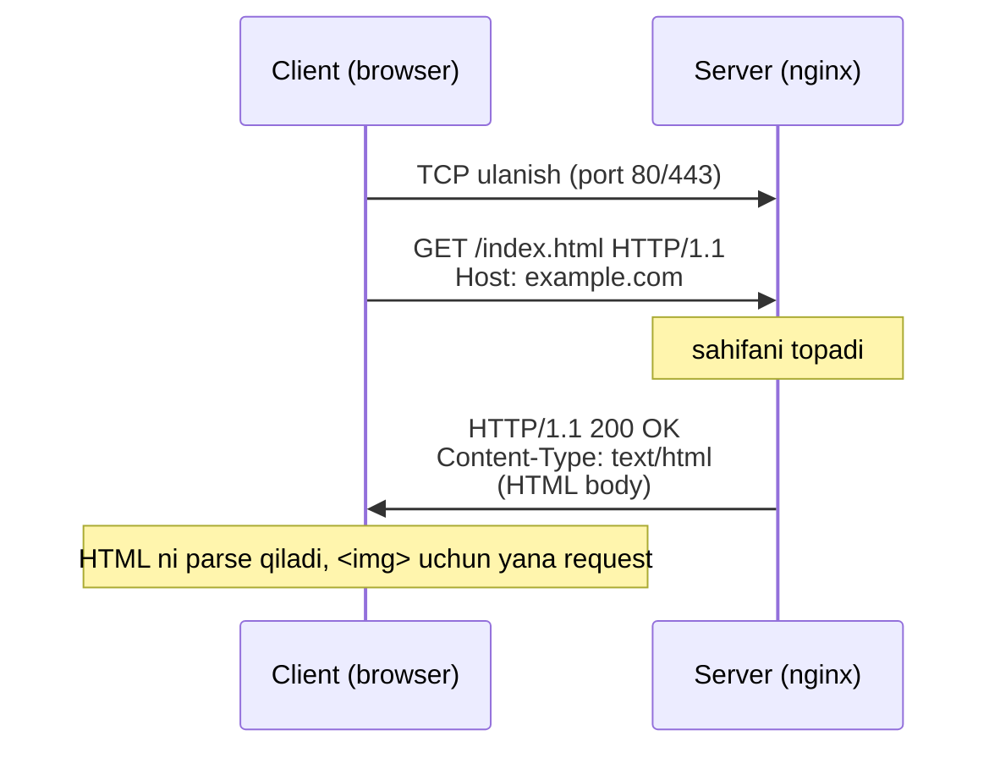
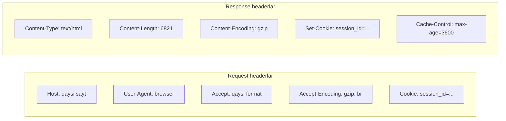
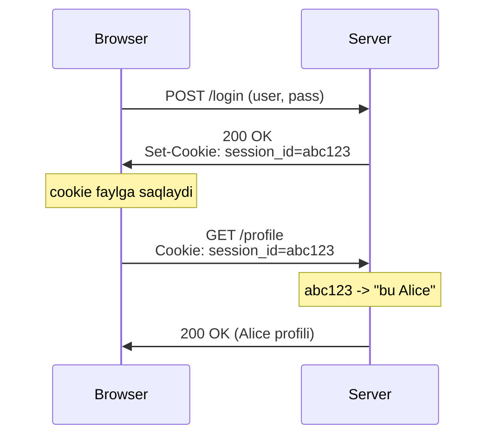

# 03. HTTP — Web ning tili

## Muammo: browser va server qanday "gaplashadi"?

DNS `google.com` ni IP ga aylantirdi, socket serverga ulandi. Endi browser
serverdan HTML sahifani so'rashi kerak. Lekin qanday? "Menga bosh sahifani ber"
degan so'zni server tushunmaydi.

Kerak bir **umumiy til** — aniq qoidalar bilan: so'rov qanday yoziladi, javob
qanday keladi, xatolar qanday bildiriladi. Aynan shu til — **HTTP**.

> **Oltin qoida:** HTTP (HyperText Transfer Protocol) — client (browser) va server
> o'rtasida qanday xabar almashinishini, xabar tuzilishini va tartibini belgilaydigan
> application layer protokoli. U TCP ustida ishlaydi va stateless (holatsiz).

## Analogiya: restoranda ofitsiant bilan buyurtma

HTTP — restoran buyurtmasiga o'xshaydi:

- Sen (**client**) ofitsiantga (server) aniq gapirasan: "Bitta lag'mon"
  (**GET /lagmon**).
- Ofitsiant javob qaytaradi: "Mana buyurtmangiz" (**200 OK** + taom), yoki
  "Bu taom tugadi" (**404 Not Found**), yoki "Oshxonada muammo" (**500**).
- Har buyurtma **mustaqil** — ofitsiant kim ekanligingni eslamaydi (**stateless**).
- Seni eslashi uchun qo'lingga chek beriladi (**cookie**), keyingi safar shuni
  ko'rsatasan.

Farqi: HTTP da "buyurtma" va "javob" qat'iy formatga ega — har qatorda nima
turishini protokol belgilaydi.

## Sodda ta'rif

**HTTP** — request/response modeli asosida ishlaydigan, matnli (HTTP/1.1 gacha)
protokol. Client **request message** yuboradi, server **response message**
qaytaradi. Har ikkovi ham qat'iy strukturaga ega.

## Diagramma: request/response oqimi



## Request message strukturasi

Har request uch qismdan iborat: **request line** + **headerlar** + (ixtiyoriy) **body**.

```
GET /somedir/page.html HTTP/1.1      <- request line: metod + URI + versiya
Host: www.example.com                <- headerlar
User-Agent: Mozilla/5.0
Accept-Language: uz
Connection: keep-alive
                                     <- bo'sh qator (header tugadi)
(body — POST/PUT uchun)
```

Request line uch bo'lak: **metod** (GET), **URI** (/somedir/page.html), **versiya**
(HTTP/1.1). Header lar `Nom: qiymat` ko'rinishida.

## HTTP metodlari

| Metod | Vazifasi | Idempotent? |
|-------|----------|-------------|
| **GET** | Resource olish (eng ko'p) | Ha |
| **POST** | Ma'lumot yuborish (forma, yangi yozuv) | Yo'q |
| **PUT** | Resource ni to'liq yangilash/yaratish | Ha |
| **PATCH** | Resource ni qisman yangilash | Yo'q |
| **DELETE** | Resource o'chirish | Ha |
| **HEAD** | Faqat headerlarni olish (body siz) | Ha |
| **OPTIONS** | Qaysi metodlar mumkinligini so'rash | Ha |

**Idempotent** (bir xil natija) degani: bir so'rovni ko'p marta yuborsang ham
natija bir xil bo'ladi. GET, PUT, DELETE idempotent; POST esa yo'q (ikki marta
POST = ikkita yozuv).

## Response message va status kodlar

```
HTTP/1.1 200 OK                              <- status line
Date: Tue, 09 Aug 2011 15:44:04 GMT          <- headerlar
Server: Apache/2.2.3
Content-Length: 6821
Content-Type: text/html
                                             <- bo'sh qator
(HTML body...)
```

Status kodlar 5 sinfga bo'linadi:

| Sinf | Ma'nosi | Misollar |
|------|---------|----------|
| **1xx** | Informational | 100 Continue, 103 Early Hints |
| **2xx** | Muvaffaqiyat | 200 OK, 201 Created, 204 No Content |
| **3xx** | Redirect | 301 Moved Permanently, 304 Not Modified |
| **4xx** | Client xatosi | 400 Bad Request, 401, 403, 404 Not Found |
| **5xx** | Server xatosi | 500 Internal Error, 502 Bad Gateway, 503 |

Eng muhimlari:
- **200 OK** — hammasi joyida, body bor.
- **301** — resource doimiy ko'chirilgan (yangi URL `Location` da).
- **304 Not Modified** — o'zgarmagan, keshdagi nusxani ishlat.
- **404** — topilmadi.
- **500** — serverda xatolik.

## Diagramma: muhim headerlar



**Host** header muhim: bitta IP da ko'p sayt bo'lishi mumkin (virtual hosting),
`Host` qaysi saytligini aytadi.

## Persistent vs non-persistent connection

HTTP/1.0 da har resource uchun yangi TCP connection ochilardi. Bu qimmat.

| Xususiyat | Non-persistent (HTTP/1.0) | Persistent (HTTP/1.1) |
|-----------|---------------------------|------------------------|
| TCP connection | Har obyekt uchun yangi | Bitta ulanish ko'p obyektga |
| Overhead | Har obyektga 2 RTT | Bir marta ulanadi |
| 11 obyektli sahifa | 11 ta TCP connection | 1 ta TCP connection |
| Default | close | keep-alive |

HTTP/1.1 da **persistent connection** (`Connection: keep-alive`) default. Bitta
TCP ustida ko'p request ketma-ket yuboriladi — har birida yangi handshake shart emas.

## Cookie — holatni saqlash

HTTP stateless — server oldingi requestni eslamaydi. Lekin login, savat kabi
holatlar kerak. Yechim: **cookie**.



Cookie 4 komponent: server javobidagi `Set-Cookie`, client so'rovidagi `Cookie`,
browserdagi cookie-fayl, serverdagi ma'lumotlar bazasi.

### Cookie xavfsizligi (2026 best practice)

WebSearch bo'yicha zamonaviy cookie atributlari:

| Atribut | Vazifasi |
|---------|----------|
| **HttpOnly** | JavaScript cookie ni o'qiy olmaydi (XSS'dan himoya) |
| **Secure** | Cookie faqat HTTPS ustida yuboriladi |
| **SameSite=Lax** | Ko'p ilova uchun optimal; cross-site POST/AJAX'da yuborilmaydi (CSRF himoyasi) |
| **SameSite=Strict** | Hech qachon cross-site yuborilmaydi (banking uchun) |
| **Partitioned (CHIPS)** | Har top-level sayt uchun alohida cookie idishi; `Secure` + `SameSite=None` talab qiladi |

Zamonaviy misol:
```
Set-Cookie: session_id=abc123; HttpOnly; Secure; SameSite=Lax; Max-Age=3600
```

2026 da third-party cookie cheklovlari kuchaydi — **CHIPS** (Cookies Having
Independent Partitioned State) har saytga izolyatsiyalangan cookie idishi beradi.

## Worked example 1 — `curl -v` bilan HTTP ni ko'rish

```bash
curl -v https://example.com
```

Chiqish (`>` yuborilgan, `<` qabul qilingan):
```
> GET / HTTP/2
> Host: example.com
> User-Agent: curl/8.5.0
> Accept: */*
>
< HTTP/2 200
< content-type: text/html; charset=UTF-8
< content-length: 1256
< date: Mon, 05 May 2026 10:23:45 GMT
< server: nginx/1.25
<
<!doctype html><html>...
```

Foydali variantlar:
```bash
curl -I https://example.com        # faqat headerlar (HEAD)
curl -H "Accept-Encoding: gzip" -I https://example.com  # compression tekshirish
curl -c cookies.txt https://example.com/login -d "user=a&pass=b"  # cookie saqlash
curl -b cookies.txt https://example.com/profile          # cookie yuborish
```

> 🤔 **O'ylab ko'r:** `curl -I` (HEAD) va `curl` (GET) o'rtasida qanday farq bor?
> Nega debug uchun HEAD foydali?

<details>
<summary>💡 Javobni ko'rish</summary>

`HEAD` faqat **headerlarni** qaytaradi, **body siz**. GET esa headerlar + body.
HEAD debug uchun foydali: resource mavjudligini, o'lchamini (`Content-Length`),
turini (`Content-Type`), keshlanishini bilish uchun butun katta faylni yuklab
olish shart emas. Masalan 2 GB video mavjudligini HEAD bilan bir necha bayt
almashib tekshirasan.
</details>

## Worked example 2 — 304 Not Modified va keshlash

Conditional request bandwidth tejaydi. Client keshdagi nusxa hali amal
qilishini so'raydi:

```bash
# Birinchi so'rov — ETag oladi
curl -I https://example.com/style.css
# < ETag: "abc123"
# < Cache-Control: max-age=3600

# Ikkinchi so'rov — "shu ETag hali to'g'rimi?"
curl -I -H 'If-None-Match: "abc123"' https://example.com/style.css
# < HTTP/1.1 304 Not Modified   <- body yuborilmadi, keshni ishlat
```

Server fayl o'zgarmagan bo'lsa **304** qaytaradi (body siz) — client keshdagi
nusxani ishlatadi. Bu takroriy yuklab olishni tejaydi.

## Ko'p uchraydigan xatolar

⚠️ **"HTTP va HTTPS boshqa protokol"** — noto'g'ri. Ikkalasi ham HTTP. HTTPS =
HTTP + TLS. Port 80 (HTTP) o'rniga 443 (HTTPS). Mazmun bir xil, faqat shifrlangan.

⚠️ **"GET body yubora oladi"** — texnik jihatdan mumkin, lekin amalda **yaramaydi**:
ko'p server/proxy GET body ni e'tiborsiz qoldiradi. Ma'lumot yuborish uchun POST/PUT.

⚠️ **"301 va 302 bir xil"** — noto'g'ri. 301 = **doimiy** ko'chirish (browser
eslaydi, keyin to'g'ridan-to'g'ri yangi URL ga boradi). 302/307 = **vaqtinchalik**.

⚠️ **"Cookie xavfsiz saqlash joyi"** — noto'g'ri. Cookie client tomonda saqlanadi
va o'zgartirilishi mumkin. `HttpOnly`, `Secure`, `SameSite` siz cookie XSS/CSRF ga
zaif. Maxfiy ma'lumotni cookie ga to'g'ridan-to'g'ri yozma.

⚠️ **"Persistent connection = bir request"** — teskarisi. Persistent (keep-alive)
aynan bitta TCP ustida **ko'p** request yuborishga imkon beradi.

## Xulosa

- HTTP — client/server o'rtasidagi request/response protokoli, TCP ustida, stateless.
- Request = metod + URI + versiya + headerlar + body; response = status kod +
  headerlar + body.
- Metodlar: GET (olish), POST (yuborish), PUT/PATCH (yangilash), DELETE (o'chirish).
- Status kodlar: 2xx OK, 3xx redirect, 4xx client xatosi, 5xx server xatosi.
- Persistent connection (keep-alive) bitta TCP ustida ko'p request beradi.
- Cookie holatni saqlaydi; 2026 da `HttpOnly + Secure + SameSite` majburiy best practice.

## 🧠 Eslab qol

- HTTP = request/response, stateless, TCP ustida.
- HTTPS = HTTP + TLS (port 443).
- 2xx=OK, 3xx=redirect, 4xx=sen xato, 5xx=server xato.
- Cookie = holatni saqlash (Set-Cookie -> Cookie).
- Xavfsiz cookie: HttpOnly + Secure + SameSite.

## ✅ O'z-o'zini tekshir (retrieval practice)

**1. Server 500 emas, 404 qaytardi — muammo qayerda?**

<details>
<summary>Javob</summary>

4xx = **client** tarafidagi muammo. 404 = so'ralgan resource topilmadi (noto'g'ri
URL, o'chirilgan sahifa). 5xx bo'lsa server ichida xatolik bo'lardi. 404 da server
ishlayapti, lekin so'ralgan narsa yo'q.
</details>

**2. Nega POST idempotent emas, GET esa idempotent?**

<details>
<summary>Javob</summary>

GET faqat o'qiydi — bir so'rovni 10 marta yuborsang ham server holati o'zgarmaydi.
POST esa yaratadi/o'zgartiradi — 10 marta POST = 10 ta yangi yozuv. Shu sabab
browser POST ni qayta yuborishdan oldin ogohlantiradi.
</details>

**3. 11 ta rasmli sahifada HTTP/1.0 va HTTP/1.1 nechta TCP connection ochadi?**

<details>
<summary>Javob</summary>

HTTP/1.0 (non-persistent): har obyekt uchun alohida — 11+ TCP connection (yoki
browser limiti bilan parallel). HTTP/1.1 (persistent/keep-alive): bitta TCP
connection ustida hammasini ketma-ket — 1 ta (asosiy). Bu handshake overhead ni
kamaytiradi.
</details>

**4. `Set-Cookie: id=abc; SameSite=Strict` va `SameSite=Lax` farqi nima?**

<details>
<summary>Javob</summary>

`Strict` — cookie hech qachon cross-site so'rovda yuborilmaydi (hatto boshqa
saytdan link bosib kelinganda ham). `Lax` — top-level GET navigatsiyada
(link bosish) yuboriladi, lekin cross-site POST/AJAX/embedded'da yo'q. Strict
banking uchun, Lax ko'p ilova uchun optimal.
</details>

## 🛠 Amaliyot

1. **Oson (Modify):** `curl -I https://github.com` ni ishga tushir. Qaysi status
   kod keldi? `Server`, `Content-Type` headerlarini yoz. `Set-Cookie` bormi va
   qaysi atributlar bilan?

2. **O'rta (faded example):** Quyidagi curl buyruqlarini to'ldir — cookie saqlab,
   keyin uni yuboradigan sessiya simulyatsiyasi:
   ```bash
   curl ____ cookies.txt https://httpbin.org/cookies/set?token=xyz  # TODO: cookie saqlash flagi
   curl ____ cookies.txt https://httpbin.org/cookies                # TODO: cookie yuborish flagi
   ```
   <details><summary>Hint</summary>

   `-c` (cookie jar'ga yozish), `-b` (cookie jar'dan yuborish). httpbin.org test
   uchun qulay.
   </details>

3. **Qiyin (Make):** `curl -w "%{http_code} %{time_total}s\n" -o /dev/null -s URL`
   yordamida 3 xil saytga so'rov yubor va status + vaqtni solishtir. Keyin
   `If-None-Match` bilan 304 olishga harakat qil (avval ETag ni ol).
   <details><summary>Hint</summary>

   Avval `curl -I` bilan ETag ni ol, keyin `-H 'If-None-Match: "<etag>"'` yubor.
   Server o'zgarmagan bo'lsa 304 qaytaradi.
   </details>

## 🔁 Takrorlash

Bog'liq oldingi mavzular:
- [01-application-layer-va-socketlar.md](01-application-layer-va-socketlar.md) —
  HTTP socket ustida ishlaydi.
- [02-dns.md](02-dns.md) — HTTP request oldidan DNS nomni IP ga aylantiradi.

Keyingi bog'liq darslar:
- [04-http-evolution.md](04-http-evolution.md) — HTTP/1.1 -> HTTP/2 -> HTTP/3.
- [05-https-tls.md](05-https-tls.md) — HTTPS ning "S" i.

Takrorlash jadvali:
- **Ertaga:** Status kod sinflarini (1xx-5xx) xotiradan yoz.
- **3 kundan keyin:** Cookie oqimi diagrammasini qayta chiz.
- **1 haftadan keyin:** "O'z-o'zini tekshir" 2 va 4 savoliga qayt.

Feynman testi: HTTP request/response ni restoran buyurtmasi analogiyasi bilan 3
jumlada tushuntir.

## 📚 Manbalar

- [RFC 9110 — HTTP Semantics](https://datatracker.ietf.org/doc/html/rfc9110)
- [RFC 9112 — HTTP/1.1](https://datatracker.ietf.org/doc/html/rfc9112)
- [MDN — HTTP overview](https://developer.mozilla.org/en-US/docs/Web/HTTP/Overview)
- [Cookie Security Best Practices (barrion.io)](https://barrion.io/blog/cookie-security-best-practices)
- [Cookie attributes — Privacy Sandbox (Google)](https://privacysandbox.google.com/cookies/basics/cookie-attributes)
- [CHIPS — privacycg](https://github.com/privacycg/CHIPS/blob/main/README.md)
- Kurose & Ross, "Computer Networking", Bob 2.2 (HTTP)
