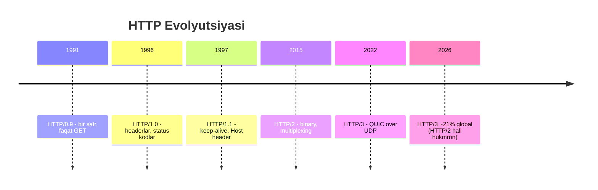
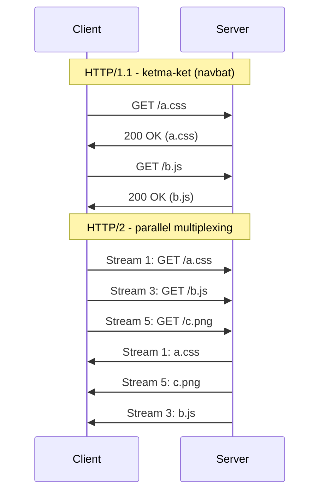
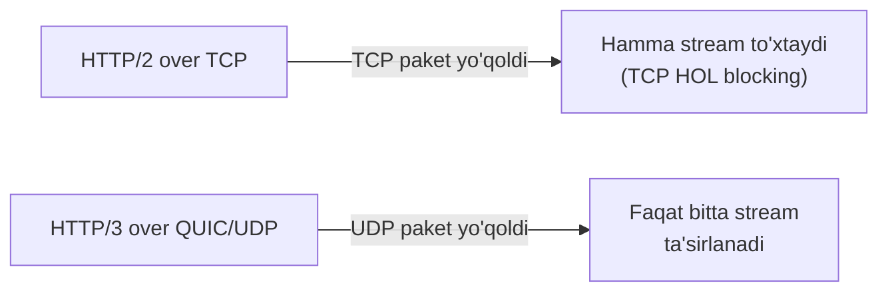

# 04. HTTP Evolyutsiyasi — HTTP/0.9 dan HTTP/3 gacha

## Muammo: nega bitta HTTP yetmadi?

Oldingi darsda HTTP/1.1 ni ko'rdik. U 20 yildan ortiq internetning asosi bo'ldi.
Lekin web o'sdi: bitta sahifa endi 100+ kichik fayl (CSS, JS, rasm, shrift) dan
iborat. HTTP/1.1 ularni yuklashda **sekin** — chunki bir connection ustida ular
navbat kutadi.

Bundan tashqari mobil tarmoqlar paydo bo'ldi: paket yo'qolishi tez-tez, Wi-Fi'dan
4G ga o'tish connection ni uzadi. Har yangi muammoga javoban HTTP yangi versiya
chiqardi.

> **Oltin qoida:** Har HTTP versiyasi o'z davrining eng katta muammosini yechdi:
> 1.1 = qayta ulanish overhead'i, 2 = parallel yuklash, 3 = transport-level HOL blocking.

## Analogiya: bitta yo'lak, bir nechta yo'lak, alohida quvurlar

- **HTTP/1.1** — bitta tor yo'lak. Odamlar (requestlar) navbat bilan yuradi. Old
  odam sekin bo'lsa, hamma kutadi (**head-of-line blocking**).
- **HTTP/2** — bitta keng yo'lak, ko'p yurish qatori. Ko'pchilik parallel yuradi.
  Lekin yo'lakda tirbandlik (TCP paket yo'qolishi) bo'lsa, hamma qator to'xtaydi.
- **HTTP/3** — har odam uchun **alohida quvur** (QUIC stream). Bir quvurda tiqilinch
  bo'lsa, boshqalari bemalol oqadi.

## Diagramma: HTTP versiyalari tarixi



## Har versiya nima qo'shdi

**HTTP/0.9 (1991):** Faqat `GET /index.html`. Status kod yo'q, header yo'q. Bir
satr so'rov, HTML javob, connection yopiladi.

**HTTP/1.0 (1996):** Headerlar, status kodlar (200, 404, 500), `Content-Type`.
Lekin har request uchun yangi TCP connection.

**HTTP/1.1 (1997):** `Keep-Alive` (persistent), `Host` header (virtual hosting),
chunked transfer, keshlash direktivalari. Internetning uzoq muddatli asosi.

**HTTP/2 (2015):** Google SPDY asosida. Binary protokol, multiplexing (bitta TCP
ustida ko'p stream), server push, HPACK header compression.

**HTTP/3 (2022):** TCP o'rniga **QUIC** (UDP ustida). Transport-level HOL blocking
yo'q, connection migration, 0-RTT handshake.

## Asosiy farq: HTTP/2 multiplexing

HTTP/1.1 da requestlar ketma-ket. HTTP/2 da bitta TCP ustida ko'p **stream**
parallel:



E'tibor ber: HTTP/2 da javoblar **tartibsiz** kelishi mumkin (5 dan oldin 3
tugamasa ham) — har stream mustaqil.

## Head-of-line blocking — asosiy tushuncha

HTTP/2 **application-level** HOL blocking ni yechdi. Lekin muammo qoldi: HTTP/2
hali TCP ustida. TCP da bitta paket yo'qolsa, TCP uni qayta yuborguncha **hamma
stream to'xtaydi** (TCP HOL blocking). QUIC buni yechdi.



## Taqqoslash jadvali

| Versiya | Yangi connection RTT | Multiplexing | HOL blocking | Header compression |
|---------|----------------------|--------------|--------------|---------------------|
| HTTP/1.0 | 1 RTT + request | Yo'q | TCP + App | Yo'q |
| HTTP/1.1 | 1 RTT (keep-alive) | Yo'q (pipelining buggy) | TCP + App | Yo'q |
| HTTP/2 | 2-3 RTT (TCP+TLS) | Ha (bitta TCP) | TCP level | HPACK |
| HTTP/3 | 1 RTT (QUIC+TLS) yoki 0-RTT | Ha (QUIC stream) | Yo'q | QPACK |

## Nega QUIC UDP ustida?

Savol: HTTP/3 nega ishonchsiz UDP ni tanladi? Chunki:

- **TCP OS kernel ichida** — uni o'zgartirish har OS update kutadi (yillar).
- **UDP minimal** — QUIC user-space da (dastur ichida) ishlaydi, har ilova yangi
  versiyani darhol ishlata oladi.
- QUIC ishonchlilik, tartib, oqim boshqaruvini **o'zi** ta'minlaydi (TCP kabi),
  lekin stream'lar mustaqil.
- **Connection migration:** Wi-Fi'dan 4G ga o'tganda connection uzilmaydi (QUIC
  connection ID bilan aniqlanadi, IP+port bilan emas).

## Worked example — qaysi versiya ishlayotganini bilish

```bash
# HTTP/1.1 majburlash
curl -v --http1.1 https://example.com 2>&1 | grep "< HTTP"
# < HTTP/1.1 200 OK

# HTTP/2
curl -v --http2 https://www.google.com 2>&1 | grep -E "ALPN|< HTTP"
# * ALPN: server accepted h2
# < HTTP/2 200

# HTTP/3 (curl QUIC support kerak)
curl -v --http3 https://cloudflare-quic.com 2>&1 | grep -E "HTTP/3|alt-svc"
# < HTTP/3 200
# < alt-svc: h3=":443"; ma=86400
```

HTTP/2 da **pseudo-header** lar bor (`:authority`, `:scheme`, `:path`, `:method`)
— oddiy header emas, protokol darajasidagi maydonlar.

Browser HTTP/3 ni qanday topadi? Server `Alt-Svc: h3=":443"` header yuboradi —
browser keyingi so'rovni HTTP/3 da urinadi. Yoki DNS HTTPS record (RFC 9460) orqali.

> 🤔 **O'ylab ko'r:** Sekin, ishonchli tarmoqda (kam paket yo'qolishi) HTTP/3
> HTTP/2 dan sezilarli tezroqmi? Nega?

<details>
<summary>💡 Javobni ko'rish</summary>

Yo'q, sezilarli emas. HTTP/3 ning asosiy afzalligi — **paket yo'qolganda** stream
mustaqilligi. Agar tarmoq barqaror va paket yo'qolmasa, TCP HOL blocking deyarli
yuz bermaydi, shu sabab farq kichik. Hatto yuqori tezlikda (500 Mbps+) QUIC CPU
overhead tufayli HTTP/2 dan sekinroq bo'lishi mumkin. HTTP/3 mobil/lossy
tarmoqlarda yorqin ustunlik beradi. Shu sabab tez tarmoqli davlatlarda adoption
past, sekin tarmoqli davlatlarda (Meksika, Braziliya, Hindiston) yuqori.
</details>

## 2026 holati (WebSearch)

Statistika qiziqarli va biroz kutilmagan:

- **HTTP/3:** Cloudflare Radar aprel 2026 da ~**21%** trafik ko'rsatadi — va bu
  biroz **pasaygan** (2025 oktyabrda ba'zi manbalar 35% degan edi).
- **HTTP/2:** hali **hukmron** — ~50-51% ga ko'tarildi (HTTP/3 hisobiga).
- **HTTP/1.x:** ~27% atrofida.
- **Regional farq:** median tezligi 500 Mbps'dan past davlatlarda (Meksika,
  Braziliya, Hindiston) HTTP/3 ~29-30% — global 21% ga qarshi.

Xulosa: HTTP/3 "kelajak texnologiyasi" emas, hozir keng ishlatiladi, lekin uning
foydasi tarmoq sifatiga bog'liq. Tez tarmoqlarda HTTP/2 hali raqobatbardosh.

## Xavfsizlik nuqtasi

HTTP/2 va HTTP/3 amalda **faqat TLS** ustida (browserlar cleartext'ni
qo'llamaydi). Muhim hujumlar:

- **HTTP/2 Rapid Reset (CVE-2023-44487):** hujumchi ko'p stream ochib, darhol
  RST_STREAM yuboradi — server resursini tugatadi. 2023 da eng katta DDoS: 398M req/s.
- **QUIC amplification:** UDP bo'lgani uchun spoofed IP bilan amplification mumkin
  (lekin QUIC `Retry` paket va manzil tekshiruvi bilan himoyalangan).

## Ko'p uchraydigan xatolar

⚠️ **"HTTP/2 har doim HTTP/1.1 dan tezroq"** — noto'g'ri. Barqaror tez tarmoqda
farq kichik. Ko'p kichik resurs yuklashda HTTP/2 sezilarli tezroq.

⚠️ **"HTTP/1.1 pipelining muammoni yechdi"** — noto'g'ri. Pipelining nazariy jihatdan
parallel bo'lishi kerak edi, lekin HOL blocking, buggy proxy'lar tufayli amalda
ishlamadi va o'chirildi. Faqat HTTP/2 multiplexing haqiqiy parallel berdi.

⚠️ **"HTTP/3 har joyda ishlaydi"** — noto'g'ri. UDP port 443 ko'p korporativ
firewall'da bloklangan; bunday holda HTTP/3 HTTP/2 ga fall back qiladi.

⚠️ **"HTTP/2 server push zamonaviy"** — noto'g'ri. Amalda kam ishlatildi, Chrome
2022 da o'chirdi. O'rniga `103 Early Hints` ishlatiladi.

## Xulosa

- HTTP/0.9 -> 1.0 -> 1.1 -> 2 -> 3: har biri o'z davrining muammosini yechdi.
- HTTP/1.1: keep-alive va Host header (virtual hosting).
- HTTP/2: binary, multiplexing (bitta TCP ustida parallel stream), HPACK.
- HTTP/3: QUIC (UDP ustida), transport-level HOL blocking yo'q, connection migration.
- QUIC UDP ni tanladi, chunki user-space da tez rivojlanadi.
- 2026: HTTP/2 hali hukmron (~50%), HTTP/3 ~21% (sekin tarmoqlarda yuqoriroq).

## 🧠 Eslab qol

- HTTP/1.1 = keep-alive + Host header.
- HTTP/2 = multiplexing (parallel stream, bitta TCP).
- HTTP/3 = QUIC over UDP, no HOL blocking.
- QUIC user-space da => tez evolyutsiya.
- HTTP/3 foydasi lossy/mobil tarmoqda yorqin.

## ✅ O'z-o'zini tekshir (retrieval practice)

**1. HTTP/2 multiplexing ni bergan, lekin qanday HOL blocking qoldi?**

<details>
<summary>Javob</summary>

**TCP-level** HOL blocking. HTTP/2 application darajasidagi navbatni yechdi, lekin
hali TCP ustida ishlaydi. TCP da bitta paket yo'qolsa, TCP uni qayta yuborguncha
barcha stream to'xtaydi (chunki TCP bitta tartibli oqim sifatida ko'radi). QUIC
har stream'ga alohida sequence berib buni yechdi.
</details>

**2. Nega HTTP/3 ishonchsiz UDP ni tanladi, ishonchli TCP emas?**

<details>
<summary>Javob</summary>

TCP OS kernel ichida — o'zgartirish yillar oladi (har OS update kutadi). UDP
minimal, QUIC user-space da ishlaydi va ishonchlilikni o'zi ta'minlaydi. Shu sabab
QUIC/HTTP3 tez rivojlanadi va har ilova yangi versiyani darhol ishlata oladi.
Bonus: connection migration (IP o'zgarsa uzilmaydi).
</details>

**3. Browser HTTP/3 mavjudligini qanday biladi?**

<details>
<summary>Javob</summary>

Server `Alt-Svc: h3=":443"; ma=86400` response header yuboradi — browser keyingi
ulanishni HTTP/3 da urinadi (ma = necha soniya eslash kerak). Yoki DNS HTTPS
record (RFC 9460) orqali oldindan biladi.
</details>

**4. Tez, barqaror tarmoqda HTTP/2 va HTTP/3 dan qaysi biri afzalroq bo'lishi mumkin?**

<details>
<summary>Javob</summary>

HTTP/2 ustunlik qilishi mumkin. HTTP/3 ning afzalligi paket yo'qolishida ko'rinadi;
barqaror tarmoqda TCP HOL blocking deyarli yo'q. Yuqori tezlikda (500 Mbps+) QUIC
ning CPU overhead'i uni sekinlashtirishi mumkin. Shu sabab 2026 da tez tarmoqli
davlatlarda HTTP/3 adoption past.
</details>

## 🛠 Amaliyot

1. **Oson (Modify):** `curl -sI https://www.google.com | grep -i alt-svc` ni
   ishga tushir. `h3` bormi? Bu server HTTP/3 ni qo'llashini bildiradi. Yana 3
   saytda sina.

2. **O'rta (faded example):** Quyidagi buyruqlarni to'ldir — bir saytga uch xil
   versiyada so'rov yuborib, ishlatilgan protokolni ko'rish:
   ```bash
   curl -so /dev/null -w "%{http_version}\n" ____ https://cloudflare.com  # TODO: --http1.1
   curl -so /dev/null -w "%{http_version}\n" ____ https://cloudflare.com  # TODO: --http2
   curl -so /dev/null -w "%{http_version}\n" ____ https://cloudflare.com  # TODO: --http3
   ```
   <details><summary>Hint</summary>

   `--http1.1`, `--http2`, `--http3`. `%{http_version}` ishlatilgan versiyani chop
   etadi. `--http3` uchun curl QUIC bilan qurilgan bo'lishi kerak.
   </details>

3. **Qiyin (Make):** `openssl s_client -connect example.com:443 -alpn h2,http/1.1`
   bilan ALPN negotiation'ni ko'r. Server qaysi protokolni tanladi? Keyin
   `-alpn h3` bilan sinab, farqni tushuntir.
   <details><summary>Hint</summary>

   ALPN (Application-Layer Protocol Negotiation) — TLS handshake ichida qaysi HTTP
   versiya ishlatilishini kelishadi. `h2` = HTTP/2, `http/1.1` = HTTP/1.1. h3
   TLS-over-TCP da emas, QUIC da negotiatsiya qilinadi.
   </details>

## 🔁 Takrorlash

Bog'liq oldingi mavzular:
- [03-http.md](03-http.md) — HTTP asoslari (request/response, headerlar).
- [02-dns.md](02-dns.md) — DNS HTTPS record HTTP/3 ni e'lon qiladi.

Keyingi bog'liq darslar:
- [05-https-tls.md](05-https-tls.md) — HTTP/2 va /3 TLS ustida ishlaydi.

Takrorlash jadvali:
- **Ertaga:** Taqqoslash jadvalini (versiya vs xususiyat) xotiradan yoz.
- **3 kundan keyin:** TCP HOL vs QUIC diagrammasini qayta chiz.
- **1 haftadan keyin:** "O'z-o'zini tekshir" 1 va 2 savoliga qayt.

Feynman testi: HTTP/1.1, /2, /3 farqini "yo'lak" analogiyasi bilan 3 jumlada tushuntir.

## 📚 Manbalar

- [RFC 9114 — HTTP/3](https://datatracker.ietf.org/doc/html/rfc9114)
- [RFC 9000 — QUIC Transport](https://datatracker.ietf.org/doc/html/rfc9000)
- [W3Techs — HTTP/3 usage, July 2026](https://w3techs.com/technologies/details/ce-http3)
- [HTTP protocol adoption in 2026 (technologychecker)](https://technologychecker.io/blog/http-protocol-adoption)
- [Cloudflare — HTTP/3 usage one year on](https://blog.cloudflare.com/http3-usage-one-year-on/)
- [Internet Society Pulse — Why HTTP/3 is eating the world](https://pulse.internetsociety.org/blog/why-http-3-is-eating-the-world)
- Kurose & Ross, "Computer Networking", Bob 2
