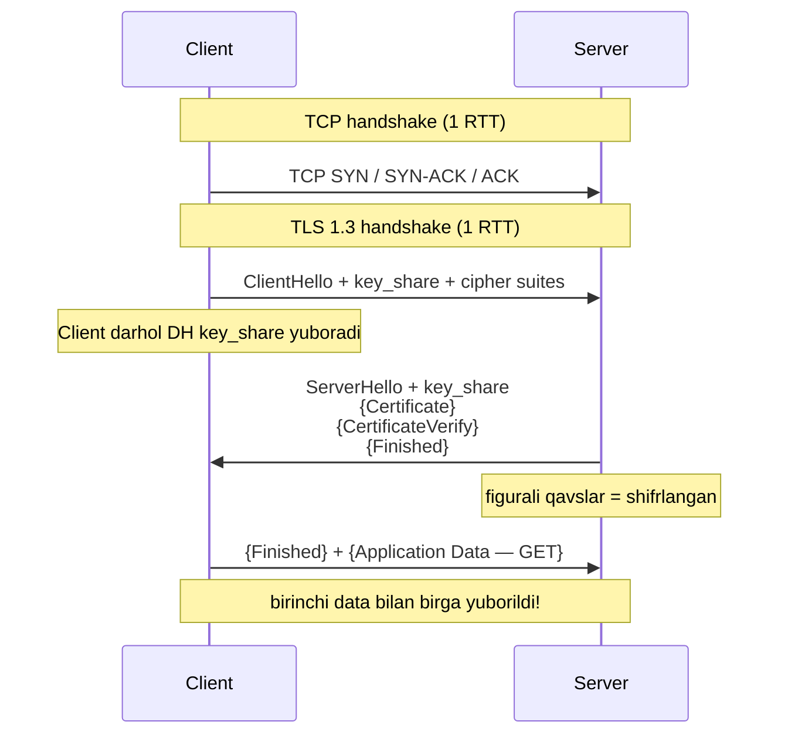
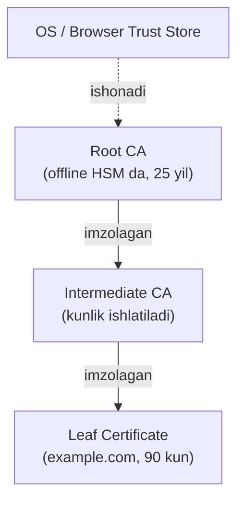
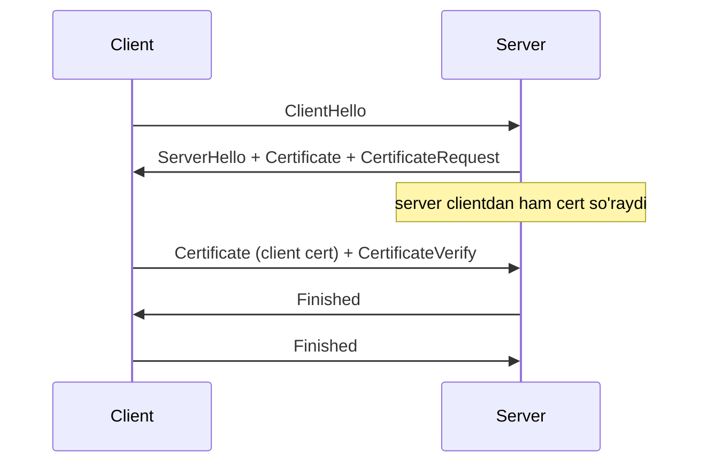

# 05. HTTPS va TLS — shifrlangan aloqa

## Muammo: xatingni yo'lda kim o'qiydi?

HTTP oddiy matn. Ya'ni `curl -v http://bank.com` da parol, cookie — hammasi
**ochiq** yuboriladi. Wi-Fi'dagi hujumchi, ISP, oradagi router — hammasi buni
o'qiy oladi.

Uch xavf bor:
1. **Eavesdropping** (tinglash) — kimdir trafikni ko'radi.
2. **Tampering** (buzish) — kimdir ma'lumotni yo'lda o'zgartiradi.
3. **Impersonation** (soxtalashtirish) — soxta server o'zini bank deb ko'rsatadi.

Aynan shu uchta muammoni **TLS** hal qiladi. HTTPS = HTTP + TLS.

> **Oltin qoida:** TLS uch narsani beradi — **confidentiality** (shifrlash),
> **integrity** (buzilmaganini tekshirish), **authentication** (server haqiqiyligini
> sertifikat bilan tasdiqlash).

## Analogiya: muhrlangan diplomatik paket

Elchixona xat yuboryapti:

- Xat **shifrlangan** — faqat qabul qiluvchi ochadi (**confidentiality**).
- Xatga **muhr** bosilgan — buzilsa muhr sinadi (**integrity**).
- Muhrni ishonchli **notarius tasdiqlagan** — bu haqiqatan o'sha elchixona
  (**authentication**, sertifikat = notarius tasdig'i).

Notariuslar zanjiri bor: mahalliy notarius -> viloyat -> davlat. Sen faqat davlatga
ishonasan, qolgani zanjir orqali tasdiqlanadi (**CA chain**).

## Sodda ta'rif

**TLS** (Transport Layer Security) — TCP ustida ishlaydigan, ma'lumotni shifrlash,
buzilmaganini tekshirish va serverni autentifikatsiya qilish protokoli. Internet
trafikning **95%+** TLS bilan himoyalangan.

## Diagramma: TLS 1.3 handshake

TLS 1.3 handshake atigi **1 RTT** (TLS 1.2 da 2 RTT edi):



TLS 1.3 da tezlik siri: client **darhol** o'z DH `key_share` ni yuboradi, shu
sabab keraksiz round-trip yo'q.

## TLS 1.2 vs 1.3 — nima yaxshilandi

| Xususiyat | TLS 1.2 | TLS 1.3 |
|-----------|---------|---------|
| Handshake | 2 RTT | 1 RTT (yoki 0-RTT resumption) |
| Cipher suite soni | Ko'p (ba'zilari zaif) | Faqat 5 ta kuchli |
| Zaif algoritmlar | RC4, DES, RSA key exchange bor | Butunlay olib tashlangan |
| Forward secrecy | Ixtiyoriy | Majburiy (ephemeral DH) |
| Compression | Bor (CRIME hujumi) | Olib tashlangan |

**Forward secrecy** muhim: har session yangi vaqtinchalik (ephemeral) kalit
ishlatadi. Hatto kelajakda server private key o'g'irlansa ham, eski sessiyalarni
ochib bo'lmaydi.

## 0-RTT — tez, lekin ehtiyot bilan

Agar client server bilan oldin gaplashgan bo'lsa, **PSK** (Pre-Shared Key) orqali
0-RTT mumkin — birinchi paket bilan ma'lumot yuboriladi.

⚠️ **0-RTT replay xavfi:** 0-RTT data forward secrecy'ga ega emas va hujumchi uni
**qayta yuborishi** mumkin. Shu sabab faqat **idempotent** so'rovlar (GET) uchun
xavfsiz, POST/DELETE uchun yo'q.

## Diagramma: sertifikat zanjiri (CA chain)

Server sertifikati o'z-o'zicha ishonchli emas — u ishonchli **Root CA** gacha
zanjir orqali bog'lanishi kerak.



Nega zanjir? **Root CA** eng qimmatli kalit — offline saqlanadi. **Intermediate**
kunlik ishlatiladi; kompromet bo'lsa faqat shu zanjir ishdan chiqadi. **Leaf** —
sayt sertifikati (bugungi kunda odatda 90 kun, Let's Encrypt).

## Sertifikat ichida nima bor

X.509 sertifikat asosiy maydonlari:

| Maydon | Ma'nosi |
|--------|---------|
| **Subject (CN)** | Sertifikat kimga tegishli (example.com) |
| **Issuer** | Kim imzolagan (Intermediate CA) |
| **Validity** | Not Before / Not After (amal muddati) |
| **Public Key** | Serverning ochiq kaliti |
| **SAN** | Subject Alternative Name — barcha domenlar |
| **Signature** | CA ning imzosi |

**SAN** bugun CN o'rniga ishlatiladi: bitta sertifikat `example.com` va
`www.example.com` va boshqalar uchun ishlashi mumkin.

## Cipher suite — nomni o'qish

`TLS_AES_256_GCM_SHA384` nima?

| Qism | Ma'nosi |
|------|---------|
| `TLS_` | Protokol prefiksi |
| `AES_256` | Symmetric shifrlash — AES, 256-bit kalit |
| `GCM` | Authenticated mode (Galois/Counter Mode) |
| `SHA384` | Hash funksiya (kalit hosil qilish uchun) |

TLS 1.3 da atigi 5 ta cipher qoldi. `TLS_CHACHA20_POLY1305_SHA256` — AES hardware
bo'lmagan mobil qurilmalar uchun.

## Worked example — `openssl s_client` bilan sertifikatni ko'rish

```bash
openssl s_client -connect example.com:443 -servername example.com -tls1_3
```

Chiqish (qisqartirilgan):
```
depth=2 C=US, O=DigiCert Inc, CN=DigiCert Global Root CA
verify return:1
depth=1 C=US, O=DigiCert Inc, CN=DigiCert SHA2 Secure Server CA
verify return:1
depth=0 CN=www.example.org
verify return:1
---
Certificate chain
 0 s:CN=www.example.org
   i:CN=DigiCert SHA2 Secure Server CA
 1 s:CN=DigiCert SHA2 Secure Server CA
   i:CN=DigiCert Global Root CA
---
New, TLSv1.3, Cipher is TLS_AES_256_GCM_SHA384
Verify return code: 0 (ok)
```

`depth=0` — leaf (sayt), `depth=1` — intermediate, `depth=2` — root. `verify
return:1` har darajada zanjir to'g'ri ekanligini bildiradi. `Verify return code:
0 (ok)` — hammasi joyida.

Qo'shimcha tekshiruvlar:
```bash
# Sertifikat amal muddati
echo | openssl s_client -connect example.com:443 2>/dev/null | \
  openssl x509 -noout -dates

# Cipher suite'larni skanerlash
nmap --script ssl-enum-ciphers -p 443 example.com
```

> 🤔 **O'ylab ko'r:** `curl` da `-k` (yoki Go da `InsecureSkipVerify: true`) nima
> qiladi va nega production'da xavfli?

<details>
<summary>💡 Javobni ko'rish</summary>

`-k` sertifikat tekshiruvini **o'chiradi** — client sertifikat zanjirini, amal
muddatini, hostname mosligini tekshirmaydi. Bu **authentication** ni yo'q qiladi:
hujumchi soxta sertifikat bilan MITM qila oladi va client sezmaydi. Shifrlash
bo'lsa ham, kim bilan gaplashayotganingni bilmaysan. Faqat local test uchun; hech
qachon production'da ishlatma.
</details>

## mTLS — ikki tomonlama autentifikatsiya

Standart TLS da faqat **client server ni** tekshiradi. mTLS (Mutual TLS) da
**ikkala tomon** ham sertifikat taqdim etadi:



Qayerda: **service mesh** (Istio, Linkerd) mikroservislar orasida, banking B2B
API, IoT (har qurilma o'z sertifikati), Zero Trust arxitektura.

## Post-Quantum TLS (2026 holati)

Kvant kompyuterlar kelajakda hozirgi shifrlashni buzishi mumkin. Shu sabab
**post-quantum** kriptografiya joriy etilmoqda (WebSearch):

- **X25519MLKEM768** — hybrid kalit almashinuvi: klassik X25519 (elliptik egri
  chiziq) + post-quantum ML-KEM-768 birlashtirilgan.
- **Chrome** 124 (aprel 2024) dan default yoqdi; 2026 boshida Cloudflare
  telemetriyasiga ko'ra global TLS 1.3 handshake'larining **30%+** shu guruhni
  ishlatadi.
- **Firefox** 132 dan qo'shdi. OpenSSL 3.5, NGINX, HAProxy production'da qo'llaydi.

Nega hybrid? Klassik qism bugun himoya beradi, PQ qism kelajakdagi kvant hujumdan.
"Harvest now, decrypt later" (bugun yig', kelajakda och) hujumiga qarshi.

## Qo'shimcha himoyalar

- **HSTS** (`Strict-Transport-Security` header) — browserga "shu domen uchun har
  doim HTTPS ishlat" deydi. HSTS preload list browserga oldindan o'rnatilgan.
- **OCSP Stapling** — sertifikat bekor qilinmaganini server o'zi tekshirib,
  javobni qo'shib yuboradi (latency tejaydi).
- **ECH** (Encrypted Client Hello) — SNI (qaysi domenga kirayotganing) ni
  shifrlaydi; 2026 da Chrome/Firefox yoqilgan.

## Ko'p uchraydigan xatolar

⚠️ **"TLS va SSL bir xil"** — texnik jihatdan farq bor. SSL eskirgan (2.0/3.0
o'ldi), TLS yangi nomi. Og'zaki "SSL certificate" ko'p ishlatiladi, lekin aslida TLS.

⚠️ **"Shifrlash = xavfsizlik"** — noto'g'ri. Shifrlash faqat *confidentiality*.
Serverning haqiqiyligini **sertifikat** (authentication) tekshiradi. `-k` bilan
shifrlash bor, lekin MITM ochiq.

⚠️ **"Self-signed sertifikat xavfsiz"** — internal test uchun ha, public uchun
yo'q. Browser ishonmaydi (chain root'ga bormaydi). Yechim: Let's Encrypt (bepul).

⚠️ **"0-RTT har doim xavfsiz"** — noto'g'ri. 0-RTT replay qilinishi mumkin. Faqat
idempotent (GET) uchun, POST/DELETE uchun emas.

⚠️ **"Wildcard `*.example.com` hamma subdomenga ishlaydi"** — faqat 1 daraja.
`*.example.com` `a.b.example.com` uchun ishlamaydi.

## Xulosa

- TLS uch narsa beradi: confidentiality, integrity, authentication.
- HTTPS = HTTP + TLS (port 443).
- TLS 1.3 = 1 RTT handshake, faqat kuchli cipher, majburiy forward secrecy.
- Sertifikat zanjir orqali (leaf -> intermediate -> root) trust store'ga bog'lanadi.
- mTLS = ikki tomonlama auth (service mesh, banking, IoT).
- 2026: post-quantum X25519MLKEM768 Chrome/Firefox'da default (30%+ handshake).

## 🧠 Eslab qol

- TLS = confidentiality + integrity + authentication.
- HTTPS = HTTP + TLS, port 443.
- TLS 1.3 = 1 RTT, forward secrecy majburiy.
- Sertifikat zanjiri: leaf -> intermediate -> root.
- `-k` / InsecureSkipVerify = authentication'ni o'chiradi (xavfli).

## ✅ O'z-o'zini tekshir (retrieval practice)

**1. Trafik shifrlangan, lekin sertifikat tekshirilmagan bo'lsa, qanday hujum
mumkin?**

<details>
<summary>Javob</summary>

**MITM (Man-in-the-Middle)**. Shifrlash faqat *confidentiality* beradi. Sertifikat
tekshiruvsiz hujumchi o'zini server deb ko'rsatib, o'z sertifikati bilan client'ga
ulanadi, so'ng haqiqiy serverga qayta ulanadi — o'rtada hamma narsani ochib
o'qiydi. Authentication (sertifikat) shu uchun kerak.
</details>

**2. TLS 1.3 handshake nima uchun TLS 1.2 dan bir RTT tez?**

<details>
<summary>Javob</summary>

TLS 1.3 da client **birinchi** xabarda (ClientHello) darhol o'z DH `key_share` ni
yuboradi. Server javobida o'z key_share + sertifikat + Finished ni beradi. Shu
sabab qo'shimcha round-trip kerak emas — 1 RTT. TLS 1.2 da key exchange alohida
round-trip talab qilardi (2 RTT).
</details>

**3. Nega Root CA offline HSM da saqlanadi, kunlik ishlatilmaydi?**

<details>
<summary>Javob</summary>

Root CA eng qimmatli kalit — u barcha ishonchning asosi. Agar u kompromet bo'lsa,
uning imzolagan hamma sertifikat ishonchini yo'qotadi (butun dunyo). Shu sabab u
offline (internetga ulanmagan) HSM da saqlanadi va faqat intermediate imzolash
uchun kamdan-kam ishlatiladi. Kunlik ish intermediate CA zimmasida — u kompromet
bo'lsa faqat shu zanjir almashtiriladi.
</details>

**4. 0-RTT nima uchun POST uchun xavfli, GET uchun esa OK?**

<details>
<summary>Javob</summary>

0-RTT data replay qilinishi mumkin — hujumchi uni ushlab, qayta yuboradi. GET
idempotent: 10 marta yuborilsa ham server holati o'zgarmaydi, zarar yo'q. POST/DELETE
esa har takrorda yangi ta'sir (ikki marta xarid, ikki marta o'chirish) — replay
xavfli. Shu sabab 0-RTT faqat idempotent so'rovlarga.
</details>

## 🛠 Amaliyot

1. **Oson (Modify):** `echo | openssl s_client -connect github.com:443
   2>/dev/null | openssl x509 -noout -dates -subject` ni ishga tushir.
   Sertifikat qachon tugaydi? Kimga tegishli (subject)?

2. **O'rta (faded example):** Quyidagi buyruqni to'ldir — TLS versiyasi va cipher
   suite'ni ko'rish:
   ```bash
   openssl s_client -connect example.com:443 ____ 2>/dev/null | grep -E "Cipher|TLSv"  # TODO: TLS 1.3 majburlash flagi
   nmap ____ -p 443 example.com   # TODO: cipher enumeratsiya scripti
   ```
   <details><summary>Hint</summary>

   TLS 1.3 uchun `-tls1_3`. nmap uchun `--script ssl-enum-ciphers`.
   </details>

3. **Qiyin (Make):** SSL Labs (`https://www.ssllabs.com/ssltest/`) da sevimli
   saytingni test qil. U qaysi baho (A, B, F) berdi? Qaysi zaifliklar
   (eski TLS 1.0/1.1, zaif cipher) topildi? Post-quantum guruh (X25519MLKEM768)
   qo'llabmi? `openssl s_client` chiqishida `key_share` guruhini top.
   <details><summary>Hint</summary>

   Chrome DevTools -> Security tab da ham TLS versiyasi va cipher ko'rinadi.
   Post-quantum guruh handshake'da `X25519MLKEM768` sifatida ko'rinadi (yangi
   OpenSSL versiyasi kerak).
   </details>

## 🔁 Takrorlash

Bog'liq oldingi mavzular:
- [03-http.md](03-http.md) — HTTPS = HTTP + TLS.
- [04-http-evolution.md](04-http-evolution.md) — HTTP/2 va /3 TLS ustida.
- [02-dns.md](02-dns.md) — DoT/DoH aynan TLS ustida ishlaydi.

Keyingi bog'liq darslar:
- [06-smtp-va-email.md](06-smtp-va-email.md) — SMTPS, IMAPS ham TLS ustida.

Takrorlash jadvali:
- **Ertaga:** TLS 1.3 handshake diagrammasini xotiradan chiz.
- **3 kundan keyin:** CA chain va nega Root offline saqlanishini tushuntir.
- **1 haftadan keyin:** "O'z-o'zini tekshir" 1 va 3 savoliga qayt.

Feynman testi: TLS ni "muhrlangan diplomatik paket" analogiyasi bilan 3 jumlada
tushuntir — uch kafolatni (shifr, muhr, notarius) aytib ber.

## 📚 Manbalar

- [RFC 8446 — TLS 1.3](https://datatracker.ietf.org/doc/html/rfc8446)
- [RFC 9849 — TLS Encrypted Client Hello (2026)](https://datatracker.ietf.org/doc/html/rfc9849)
- [Post-Quantum TLS 1.3 in Production (systemshardening)](https://www.systemshardening.com/articles/network/tls-post-quantum-hybrid-deployment/)
- [PQC Support in Web Browsers (Encryption Consulting)](https://www.encryptionconsulting.com/pqc-support-in-web-browsers/)
- [Cloudflare — What happens in a TLS handshake?](https://www.cloudflare.com/learning/ssl/what-happens-in-a-tls-handshake/)
- [The Illustrated TLS 1.3 Connection](https://tls13.xargs.org/)
- [SSL Labs — SSL Server Test](https://www.ssllabs.com/ssltest/)
- Kurose & Ross, "Computer Networking", Bob 8 (Network Security)
