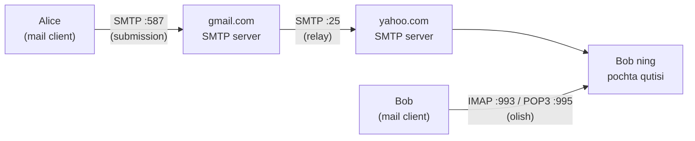
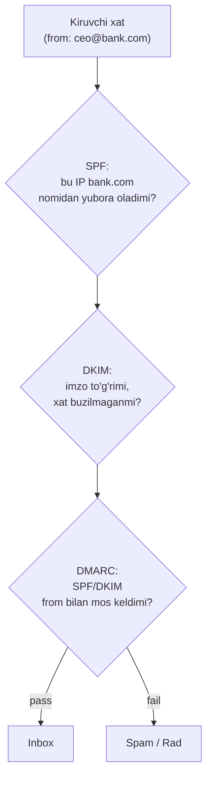

# 06. SMTP va Email — elektron pochta oqimi

## Muammo: xat qanday qilib boshqa serverga yetadi?

`alice@gmail.com` `bob@yahoo.com` ga xat yubordi. Ular ikki xil kompaniya, ikki
xil server. Alice ning xati qanday qilib Yahoo serveriga yetadi? Bob uni qachon,
qanday o'qiydi?

Bundan tashqari: har kuni milliardlab spam xat yuboriladi. Yuboruvchi soxta bo'lsa
(kimdir o'zini bankingiz deb ko'rsatsa) — qanday aniqlaymiz? Bu ikki savolga email
protokollari javob beradi.

> **Oltin qoida:** SMTP xatni **yuboradi** (push), POP3/IMAP xatni **oladi** (pull).
> SMTP faqat serverlar orasida ishlaydi; foydalanuvchi xatni IMAP/POP3 bilan o'qiydi.

## Analogiya: pochta bo'limi va uydagi pochta qutisi

- **SMTP** — pochtachi. U xatni bir bo'limdan boshqasiga **olib boradi** (push).
  Pochtachi xatni yetkazadi va ketadi.
- **Pochta qutisi** — mail server dagi Bob ning yashigi. Xat shu yerda kutadi.
- **POP3/IMAP** — Bob qutisini ochib xatni **oladi** (pull). POP3 = "olib ket va
  qutini bo'shat", IMAP = "qutida qoldirib, faqat o'qib qol".

Farqi: SMTP xohlagan vaqt xatni itaradi (push), lekin Bob xatni o'zi kelib olishi
kerak (pull) — chunki uning kompyuteri doim yoqilmagan.

## Sodda ta'rif

**SMTP** (Simple Mail Transfer Protocol) — xatni yuboruvchi mail serveridan
qabul qiluvchi mail serveriga uzatadigan **push** protokoli. TCP ustida, 1982
yildan beri (HTTP'dan eski).

## Diagramma: email to'liq oqimi



Uch bosqich:
1. Alice xatni o'z serveriga topshiradi (**SMTP submission**, port 587).
2. Gmail serveri Yahoo serveriga yetkazadi (**SMTP relay**, port 25).
3. Bob o'z serveridagi qutidan oladi (**IMAP/POP3**).

## SMTP komandalar — protokol suhbati

SMTP oddiy matnli komandalar bilan ishlaydi (HTTP'ga o'xshab):

| Komanda | Vazifasi |
|---------|----------|
| `HELO` / `EHLO` | Salomlashish (EHLO — kengaytirilgan) |
| `MAIL FROM:` | Yuboruvchi manzili |
| `RCPT TO:` | Qabul qiluvchi manzili |
| `DATA` | Xabar tanasi (`.` bilan tugaydi) |
| `QUIT` | Ulanishni yopish |

## Worked example 1 — qo'lda SMTP suhbati

`telnet` yoki `nc` bilan SMTP serveriga to'g'ridan-to'g'ri gaplashish mumkin:

```bash
nc smtp.example.com 25
```

Suhbat (`>` yuborilgan, `<` server javobi):
```
< 220 smtp.example.com ESMTP ready
> EHLO test.com
< 250-smtp.example.com
< 250 STARTTLS
> MAIL FROM:<alice@test.com>
< 250 OK
> RCPT TO:<bob@example.com>
< 250 OK
> DATA
< 354 Start mail input; end with <CRLF>.<CRLF>
> Subject: Salom
> 
> Bu test xat.
> .
< 250 OK: queued as 12345
> QUIT
< 221 Bye
```

E'tibor ber: SMTP javoblari FTP kabi 3 raqamli kod (220, 250, 354) bilan. Xabar
tanasi bitta `.` (nuqta) bilan tugaydi.

## POP3 vs IMAP — xatni olish

| Xususiyat | POP3 (port 110/995) | IMAP (port 143/993) |
|-----------|---------------------|---------------------|
| Model | Yuklab ol va o'chir | Serverda saqla va boshqar |
| State | Stateless | Stateful (sessiya holati) |
| Ko'p qurilma | Yomon (xat bir joyda) | Yaxshi (hamma joyda sinxron) |
| Qisman yuklash | Yo'q | Ha (faqat sarlavha) |
| Zamonaviy | Kam | Ustun |

Bugungi kunda deyarli hamma **IMAP** ishlatadi — telefon, laptop, brauzer
hammasida xat bir xil ko'rinadi. POP3 eski, xatni bir qurilmaga yuklab, serverdan
o'chiradi.

Veb-pochta (Gmail brauzerda) — bu **HTTP/HTTPS** orqali; lekin serverlar orasida
hali ham SMTP ishlaydi.

## Email autentifikatsiyasi: SPF, DKIM, DMARC (2026 majburiy)

SMTP dizayni 1982 yildan — u yuboruvchini **tekshirmaydi**. Ya'ni har kim
`MAIL FROM:<ceo@yourbank.com>` yozib, soxta xat yuborishi mumkin. Buni uchta
mexanizm hal qiladi:



| Mexanizm | Nima tekshiradi | Qanday |
|----------|-----------------|--------|
| **SPF** | Qaysi IP domen nomidan yubora oladi | DNS TXT record da ruxsat etilgan IP ro'yxati |
| **DKIM** | Xat buzilmaganini, haqiqiy yuboruvchini | Digital imzo (DNS'da public key) |
| **DMARC** | SPF/DKIM natijasini from bilan moslash | DNS policy: pass=inbox, fail=rad |

2026 holati (WebSearch): Google va Yahoo 2024 fevraldan **bulk sender** (kuniga
5000+ xat) uchun SPF + DKIM + DMARC ni **majburiy** qildi. 2025 noyabrdan to'liq
kuchga kirdi — mos kelmagan xatlar rad etiladi. Qo'shimcha talablar:
- **One-click unsubscribe** (bir bosishda obunani bekor qilish).
- Shikoyat darajasi **0.1% dan past** bo'lishi kerak.
- DKIM minimal **1024-bit** kalit.

## Worked example 2 — SPF va DMARC ni tekshirish

Bu yozuvlar DNS TXT record da (2-darsni eslang):

```bash
# SPF record
dig google.com TXT +short | grep spf
# "v=spf1 include:_spf.google.com ~all"

# DMARC record (_dmarc subdomeni)
dig _dmarc.google.com TXT +short
# "v=DMARC1; p=reject; rua=mailto:..."

# DKIM (selector kerak, masalan "default" yoki "google")
dig google._domainkey.example.com TXT +short
```

`p=reject` — DMARC policy: mos kelmagan xatni **rad et**. `p=quarantine` = spam'ga,
`p=none` = faqat kuzat.

> 🤔 **O'ylab ko'r:** Nega faqat SPF yetarli emas, DKIM ham kerak? SPF forward
> qilinganda (xat boshqa serverdan uzatilganda) nima bo'ladi?

<details>
<summary>💡 Javobni ko'rish</summary>

SPF **yuboruvchi IP** ni tekshiradi. Xat forward qilinganda (masalan mailing list
yoki `.forward`) yuboruvchi IP o'zgaradi — SPF **buziladi**, garchi xat haqiqiy
bo'lsa ham. DKIM esa **imzo** — u xat mazmuniga bog'langan, IP ga emas. Forward
qilinganda ham DKIM imzo saqlanadi. Shu sabab DMARC ikkalasidan **kamida bittasi**
pass bo'lsa yetadi (alignment bilan). Bu robustlik uchun ikkovi ham kerak.
</details>

## Ko'p uchraydigan xatolar

⚠️ **"SMTP xatni ham yuboradi, ham oladi"** — noto'g'ri. SMTP faqat **yuboradi**
(push). Foydalanuvchi xatni olish uchun POP3/IMAP ishlatadi.

⚠️ **"Port 25 xat yuborish uchun"** — qisman. Port 25 = server-to-server **relay**.
Foydalanuvchi client xatni **587** (submission, TLS bilan) yoki 465 orqali topshiradi.
Ko'p ISP port 25 ni bloklaydi (spam oldini olish).

⚠️ **"MAIL FROM ni ishonish mumkin"** — noto'g'ri. SMTP uni tekshirmaydi; soxta
bo'lishi mumkin. Aynan shuning uchun SPF/DKIM/DMARC kerak.

⚠️ **"SPF yetarli"** — noto'g'ri. SPF forward'da buziladi va from headerni to'liq
himoya qilmaydi. DKIM (imzo) + DMARC (alignment) birga kerak.

⚠️ **"IMAP va POP3 bir xil"** — noto'g'ri. IMAP serverda saqlaydi (ko'p qurilma
sinxron), POP3 yuklab olib o'chiradi (bir qurilma).

## Xulosa

- Email: SMTP yuboradi (push), POP3/IMAP oladi (pull).
- Oqim: client -> SMTP submission (587) -> SMTP relay (25) -> qutiga -> IMAP/POP3.
- SMTP komandalar: HELO/EHLO, MAIL FROM, RCPT TO, DATA, QUIT.
- IMAP serverda saqlaydi (ko'p qurilma), POP3 yuklab olib o'chiradi.
- SMTP yuboruvchini tekshirmaydi — SPF (IP), DKIM (imzo), DMARC (alignment) kerak.
- 2026: Google/Yahoo bulk sender uchun SPF+DKIM+DMARC majburiy.

## 🧠 Eslab qol

- SMTP = yuborish (push), IMAP/POP3 = olish (pull).
- Port 587 = submission, 25 = relay.
- IMAP = serverda saqla, POP3 = yuklab o'chir.
- SPF = IP, DKIM = imzo, DMARC = alignment.
- Bulk sender 2026: uch mexanizm majburiy.

## ✅ O'z-o'zini tekshir (retrieval practice)

**1. Nega foydalanuvchi xatni SMTP bilan o'qiy olmaydi, IMAP kerak?**

<details>
<summary>Javob</summary>

SMTP **push** protokoli — xatni serverga itaradi. Lekin foydalanuvchi kompyuteri
doim yoqilmagan, shu sabab server xatni to'g'ridan-to'g'ri unga itara olmaydi.
Xat mail server qutisida saqlanadi, foydalanuvchi esa xohlagan vaqt IMAP/POP3
(pull) bilan o'zi kelib oladi.
</details>

**2. Alice xatini forward qildingiz, SPF fail bo'ldi, lekin xat haqiqiy. Nega va
DMARC nima qiladi?**

<details>
<summary>Javob</summary>

Forward qilinganda yuboruvchi IP o'zgaradi (sizning serveringiz), shu sabab SPF
buziladi. Lekin DKIM imzo xat mazmuniga bog'langan, IP ga emas — u saqlanadi.
DMARC "SPF **yoki** DKIM'dan kamida bittasi pass va from bilan alignment bo'lsa
yetadi" deydi, shu sabab DKIM pass bo'lsa xat o'tadi.
</details>

**3. IMAP va POP3 dan qaysi biri uch qurilmadan foydalanuvchi uchun to'g'ri?**

<details>
<summary>Javob</summary>

IMAP. U xatni serverda saqlaydi va holatni (o'qilgan/o'qilmagan, papkalar) barcha
qurilmalarda sinxronlaydi. POP3 xatni bir qurilmaga yuklab, serverdan o'chiradi —
boshqa qurilmada xat ko'rinmaydi.
</details>

**4. `p=reject` va `p=none` DMARC policy farqi nima?**

<details>
<summary>Javob</summary>

`p=reject` — DMARC tekshiruvidan o'tmagan (soxta) xatni serverga **rad ettiradi**
(yetkazilmaydi). `p=none` — faqat kuzatuv rejimi: xat baribir yetkaziladi, lekin
egasiga hisobot (rua) yuboriladi. `p=none` odatda joriy etishning boshlang'ich
bosqichi, `p=reject` — to'liq himoya.
</details>

## 🛠 Amaliyot

1. **Oson (Modify):** `dig gmail.com MX +short` bilan Gmail mail serverlarini top.
   Nechta bor va priority (raqam) qanday tartibda? Kichik raqam nimani anglatadi?
   <details><summary>Hint</summary>

   Kichik priority = yuqori ustuvorlik (avval shunga urinadi). Bir nechta MX —
   redundancy uchun.
   </details>

2. **O'rta (faded example):** Quyidagi buyruqlarni to'ldir — domenning email
   himoyasini audit qilish:
   ```bash
   dig ____ TXT +short | grep spf        # TODO: SPF uchun domen
   dig _dmarc.____ TXT +short            # TODO: DMARC uchun domen
   ```
   <details><summary>Hint</summary>

   SPF asosiy domenda (`example.com TXT`), DMARC esa `_dmarc.example.com` subdomenida.
   </details>

3. **Qiyin (Make):** Uch mashhur domen (google.com, github.com, bitta o'zbek sayti)
   ning SPF, DMARC, MX yozuvlarini solishtir. Qaysi biri `p=reject` policy'ga ega?
   Qaysi biri email himoyasi kuchsizroq (`p=none` yoki DMARC yo'q)?
   <details><summary>Hint</summary>

   DMARC yo'q yoki `p=none` bo'lsa — domen spoofing'ga zaifroq. Katta kompaniyalar
   odatda `p=reject` yoki `p=quarantine` ishlatadi.
   </details>

## 🔁 Takrorlash

Bog'liq oldingi mavzular:
- [02-dns.md](02-dns.md) — SPF/DKIM/DMARC va MX aynan DNS TXT/MX record'da.
- [05-https-tls.md](05-https-tls.md) — SMTPS/IMAPS TLS ustida (STARTTLS).

Keyingi bog'liq darslar:
- [07-ftp-sftp.md](07-ftp-sftp.md) — FTP ham SMTP kabi 3 raqamli javob kodlaridan
  foydalanadi.

Takrorlash jadvali:
- **Ertaga:** Email oqimi diagrammasini (SMTP -> qutida -> IMAP) xotiradan chiz.
- **3 kundan keyin:** SPF/DKIM/DMARC uchtasining farqini tushuntir.
- **1 haftadan keyin:** "O'z-o'zini tekshir" 2 savoliga qayt.

Feynman testi: Email oqimini "pochtachi + pochta qutisi" analogiyasi bilan 3
jumlada tushuntir — nega push va pull ikkovi kerak.

## 📚 Manbalar

- [RFC 5321 — SMTP](https://datatracker.ietf.org/doc/html/rfc5321)
- [RFC 9051 — IMAP](https://datatracker.ietf.org/doc/html/rfc9051)
- [Google & Yahoo Email Authentication Requirements 2026 (PowerDMARC)](https://powerdmarc.com/google-and-yahoo-email-authentication-requirements/)
- [2026 bulk email sender requirements checklist (Red Sift)](https://redsift.com/guides/bulk-email-sender-requirements)
- [New email sender requirements for DMARC, SPF, DKIM (Valimail)](https://www.valimail.com/blog/new-email-sender-requirements-for-dmarc-spf-and-dkim-at-google-and-yahoo/)
- Kurose & Ross, "Computer Networking", Bob 2.3 (Electronic Mail)
