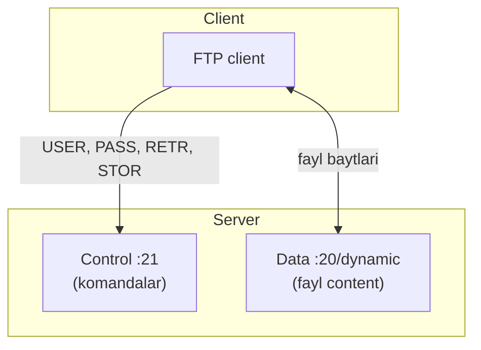
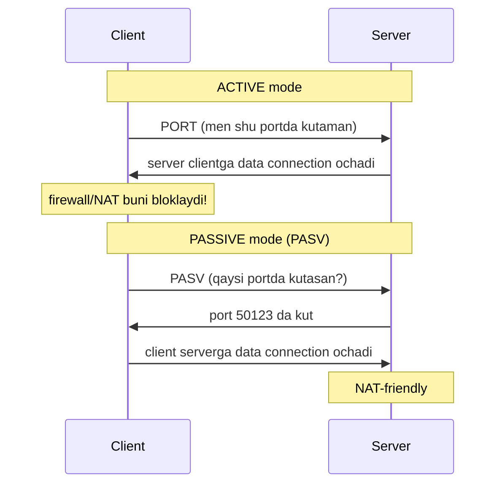
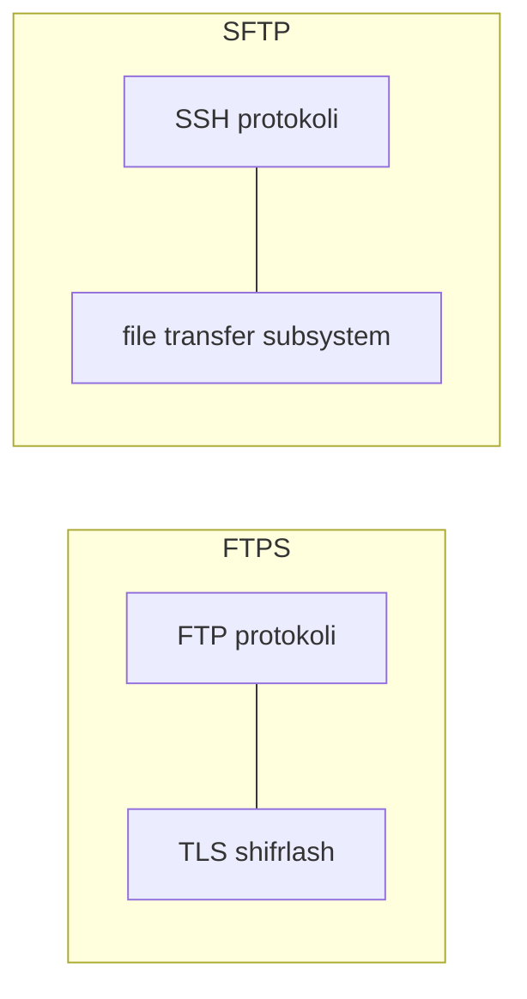

# 07. FTP, FTPS va SFTP — fayl uzatish

## Muammo: katta faylni qanday uzatamiz?

HTTP web sahifalar uchun yaxshi. Lekin server orasida katta fayllarni (backup,
media, log arxivi) muntazam uzatish kerak bo'lsa-chi? 1990-larda buning uchun
maxsus protokol yaratildi — **FTP** (File Transfer Protocol).

Lekin FTP eski va zaif: parol va fayl **ochiq matnda** yuboriladi. Zamonaviy
dunyoda bu qabul qilib bo'lmaydi. Shu sabab **FTPS** va **SFTP** paydo bo'ldi —
va ular bir-biriga o'xshash nomga qaramay, butunlay **boshqa** protokollar.

> **Oltin qoida:** FTP shifrlanmagan (eskirgan). FTPS = FTP + TLS. SFTP = SSH ustidagi
> fayl uzatish (FTP bilan hech qanday aloqasi yo'q, faqat nomi o'xshash).

## Analogiya: ombor va ikki telefon liniyasi

FTP omborga o'xshaydi, lekin **ikki alohida liniya** bilan ishlaydi:

- **Boshqaruv liniyasi** (control) — dispetcher bilan gaplashasan: "menga 5-qutini
  ber" (komanda). Bu liniya seans davomida ochiq turadi.
- **Yuk liniyasi** (data) — haqiqiy yuk (fayl) shu alohida liniyada keladi.

Bu ikki liniya ajratilgani (out-of-band) FTP ning o'ziga xosligi. HTTP da esa
komanda va ma'lumot bitta liniyada (in-band).

## Sodda ta'rif

**FTP** — fayllarni uzatish uchun **ikki TCP connection** ishlatadigan stateful
protokol: control (port 21) va data (port 20 yoki dinamik). Autentifikatsiya va
fayl content ochiq matnda uzatiladi.

## Diagramma: FTP ikki connection



- **Control connection** (port 21): butun seans ochiq, komandalar (`USER`, `PASS`,
  `RETR`, `STOR`) va javoblar. ASCII matn.
- **Data connection** (port 20 yoki dinamik): har fayl uchun yangi, fayl uzatilgach
  yopiladi (non-persistent).

## Active vs Passive mode — NAT muammosi

FTP ning eng chalkash qismi: data connection ni **kim ochadi**?



| Mode | Data connection ni kim ochadi | Muammo |
|------|-------------------------------|--------|
| **Active** | Server -> client | Client firewall/NAT bloklaydi |
| **Passive (PASV)** | Client -> server | NAT-friendly, zamonaviy standart |

Zamonaviy amaliyotda deyarli har doim **passive mode** ishlatiladi.

## FTP komandalar va javob kodlari

| Komanda | Vazifasi |
|---------|----------|
| `USER` / `PASS` | Autentifikatsiya |
| `LIST` | Katalog ro'yxati |
| `RETR filename` | Faylni yuklab olish (retrieve) |
| `STOR filename` | Faylni yuklash (store) |
| `CWD` / `PWD` | Katalog o'zgartirish / joriy katalog |

Javob kodlari (SMTP kabi 3 raqamli):
```
1xx - ijobiy dastlabki    (125 - uzatish boshlanmoqda)
2xx - ijobiy yakuniy       (226 - uzatish tugadi)
3xx - ijobiy oraliq        (331 - parol kerak)
4xx - vaqtinchalik salbiy  (425 - data connection ochilmadi)
5xx - doimiy salbiy        (530 - login xato)
```

## FTP vs HTTP

| Xususiyat | FTP | HTTP |
|-----------|-----|------|
| Connection soni | 2 (control + data) | 1 |
| Boshqaruv ma'lumoti | Out-of-band | In-band |
| State | Stateful | Stateless |
| Port | 21 (control) | 80 |

FTP **stateful**: server sizning autentifikatsiyangizni, joriy katalogingizni,
sessiya parametrlaringizni eslab qoladi. Bu serverga yuk yaratadi.

## FTPS vs SFTP — muhim farq

Bu ikki protokol nomi o'xshash, lekin **butunlay boshqa** (WebSearch):

| Xususiyat | FTPS | SFTP |
|-----------|------|------|
| Asosi | FTP + TLS ustida | SSH ning fayl subsistemasi |
| FTP bilan aloqa | Bor (FTP + shifr) | Yo'q (umuman FTP emas) |
| Port | Ko'p port (control + data) | Bitta port (22) |
| Autentifikatsiya | X.509 sertifikat (HTTPS kabi) | SSH parol yoki kalit |
| Firewall/NAT | Murakkab (ko'p port) | Oson (bitta port) |
| CI/CD avtomatlashtirish | Qiyinroq | Oson (SSH key) |

Muhim: **FTPS client SFTP serverga ulanolmaydi** va aksincha — ular mos kelmaydi.



## 2026 best practice (WebSearch)

- **FTP** — production'da amalda **eskirgan**. Parol/fayl ochiq matnda; zamonaviy
  security tekshiruvlari va regulyatsiyalarni (PCI-DSS, HIPAA) o'tolmaydi. Sezgir
  ma'lumot uchun ishlatma.
- **SFTP** — yangi deployment uchun **deyarli har doim to'g'ri tanlov**: hamma
  narsani shifrlaydi, bitta port (22) orqali firewall'dan o'tadi, SSH key bilan
  CI/CD avtomatlashtirishga qulay.
- **FTPS** — hali kerak bo'lgan joylar bor (eski partner tizimlar, X.509 talab
  qilinganda), lekin yangi loyihada SFTP default bo'lishi kerak.

## Worked example — SFTP bilan fayl uzatish

SFTP SSH ustida ishlaydi, shu sabab `ssh` bilgan hamma narsa ishlaydi (kalit,
port 22):

```bash
# SFTP sessiya ochish
sftp user@server.example.com

# Sessiya ichida:
sftp> pwd                    # server dagi joriy katalog
sftp> ls                     # ro'yxat
sftp> put backup.tar.gz      # yuklash (upload)
sftp> get report.pdf         # yuklab olish (download)
sftp> bye
```

Yoki bitta komanda bilan (skript uchun):
```bash
# SSH key bilan avtomatik yuklash
scp -i ~/.ssh/id_ed25519 backup.tar.gz user@server:/backups/

# rsync — o'zgarganini uzatadi (SSH ustida)
rsync -avz -e ssh ./data/ user@server:/remote/data/
```

Solishtirish uchun oddiy FTP (shifrlanmagan, ishlatma):
```bash
# curl bilan FTP (parol ochiq!)
curl -u user:pass ftp://server.example.com/file.txt -o file.txt
# FTPS (TLS bilan) — xavfsizroq
curl --ftp-ssl -u user:pass ftp://server.example.com/file.txt -o file.txt
```

> 🤔 **O'ylab ko'r:** FTP ikki port ishlatadi, SFTP bitta. Bu nima uchun firewall
> sozlashda katta farq qiladi?

<details>
<summary>💡 Javobni ko'rish</summary>

FTP da control (21) va data (20 yoki dinamik) alohida. Passive mode'da server
tasodifiy yuqori portda data connection kutadi — firewall bu portlar diapazonini
ochishi kerak, aks holda uzatish uzilib qoladi. Bu murakkab va xavfli (ko'p ochiq
port). SFTP esa **hamma narsani bitta port 22** orqali o'tkazadi (komanda ham,
data ham SSH connection ichida). Firewall'da faqat bitta port ochiladi — sodda va
xavfsiz. Shu sabab SFTP zamonaviy tanlov.
</details>

## Ko'p uchraydigan xatolar

⚠️ **"SFTP = FTP + S (Secure)"** — noto'g'ri. SFTP FTP emas, u SSH ning fayl
subsistemasi. FTP + shifr = **FTPS** (boshqa narsa). Nomi chalkashtiradi.

⚠️ **"FTPS va SFTP mos keladi"** — noto'g'ri. Ular butunlay boshqa protokol; FTPS
client SFTP serverga ulanolmaydi.

⚠️ **"Active mode zamonaviy"** — noto'g'ri. Active mode'da server client'ga ulanadi,
bu NAT/firewall bilan buziladi. Passive mode zamonaviy standart.

⚠️ **"FTP hali xavfsiz agar VPN ichida bo'lsa"** — VPN yordam beradi, lekin FTP
o'zi shifrlamaydi. Yangi loyihada SFTP ishlatish har doim to'g'ri.

## Xulosa

- FTP ikki TCP connection: control (21, komandalar) + data (fayl content).
- Active mode (server->client, NAT muammosi) va passive mode (client->server,
  NAT-friendly).
- FTP stateful; parol/fayl ochiq matnda — eskirgan.
- FTPS = FTP + TLS; SFTP = SSH ustidagi fayl uzatish (FTP emas!).
- 2026: yangi loyiha uchun SFTP default — bitta port, SSH key, hamma narsa shifrlangan.

## 🧠 Eslab qol

- FTP = ikki connection (control 21 + data).
- Passive mode = NAT-friendly (client data ochadi).
- FTPS = FTP + TLS.
- SFTP = SSH ustida, FTP emas, bitta port 22.
- Yangi loyiha => SFTP.

## ✅ O'z-o'zini tekshir (retrieval practice)

**1. FTPS va SFTP nomi o'xshash — asosiy texnik farqi nima?**

<details>
<summary>Javob</summary>

FTPS = FTP protokoli + TLS shifrlash (FTP bilan bir xil arxitektura, ikki port,
X.509 sertifikat). SFTP = SSH protokolining fayl uzatish subsistemasi — FTP bilan
hech qanday aloqasi yo'q, bitta port (22), SSH autentifikatsiya. Ular mos kelmaydi.
</details>

**2. Nega FTP active mode korporativ tarmoqda ko'pincha ishlamaydi?**

<details>
<summary>Javob</summary>

Active mode'da **server** client'ga data connection ochadi. Lekin client odatda
NAT/firewall orqasida — tashqaridan kelayotgan ulanish bloklanadi. Shu sabab data
uzatish uzilib qoladi. Passive mode buni yechadi: client serverga ulanadi (chiquvchi
ulanish, NAT ruxsat beradi).
</details>

**3. Nega SFTP firewall sozlashda FTP'dan sodda?**

<details>
<summary>Javob</summary>

SFTP hamma narsani (komanda + data) bitta SSH connection ichida, bitta port 22
orqali o'tkazadi. FTP esa control (21) + data (dinamik yuqori portlar) alohida —
firewall'da bir nechta port yoki port diapazoni ochilishi kerak. SFTP'da faqat
bitta port ochiladi.
</details>

**4. Nima uchun oddiy FTP zamonaviy compliance (PCI-DSS) ni o'tolmaydi?**

<details>
<summary>Javob</summary>

FTP autentifikatsiya (parol) va fayl content ni **ochiq matnda** uzatadi — kimdir
tarmoqni tinglasa hammasini o'qiydi. PCI-DSS, HIPAA kabi standartlar sezgir
ma'lumotni tranzitda shifrlashni talab qiladi. Shu sabab SFTP yoki FTPS kerak.
</details>

## 🛠 Amaliyot

1. **Oson (Modify):** Agar SSH kirish huquqingiz bo'lgan server bo'lsa,
   `sftp user@server` bilan ulanib `ls`, `pwd` ni bajaring. Yo'q bo'lsa,
   `sftp -oPort=22 localhost` bilan o'z mashinangda sinang (SSH yoqilgan bo'lsa).

2. **O'rta (faded example):** Quyidagi buyruqlarni to'ldir — faylni xavfsiz uzatish:
   ```bash
   scp ____ ~/.ssh/id_ed25519 backup.tar.gz user@server:/backups/  # TODO: SSH key flagi
   rsync ____ -e ssh ./data/ user@server:/remote/                  # TODO: archive+verbose+compress flaglari
   ```
   <details><summary>Hint</summary>

   scp uchun `-i` (identity/key). rsync uchun `-avz` (archive, verbose, compress).
   </details>

3. **Qiyin (Make):** Ikki fayl uzatish usulini vaqt bo'yicha solishtir: `scp` va
   `rsync`. Bir xil papkani ikki marta uzat. Ikkinchi marta `rsync` nega tezroq?
   `curl ftp://...` va `curl --ftp-ssl ...` farqini tcpdump bilan ko'r — qaysida
   parol ochiq ko'rinadi?
   <details><summary>Hint</summary>

   rsync faqat **o'zgargan** qismlarni uzatadi (delta), shu sabab ikkinchi marta
   tez. `sudo tcpdump -A -i any port 21` da oddiy FTP da `PASS ...` ochiq ko'rinadi,
   FTPS da ko'rinmaydi (shifrlangan).
   </details>

## 🔁 Takrorlash

Bog'liq oldingi mavzular:
- [05-https-tls.md](05-https-tls.md) — FTPS aynan TLS ustida.
- [06-smtp-va-email.md](06-smtp-va-email.md) — FTP ham SMTP kabi 3 raqamli javob kodlar.
- [01-application-layer-va-socketlar.md](01-application-layer-va-socketlar.md) —
  FTP session (control+data) session layer misoli.

Takrorlash jadvali:
- **Ertaga:** FTP ikki connection diagrammasini xotiradan chiz.
- **3 kundan keyin:** FTPS vs SFTP jadvalini qayta yoz.
- **1 haftadan keyin:** "O'z-o'zini tekshir" 1 va 3 savoliga qayt.

Feynman testi: FTP, FTPS, SFTP farqini "ombor + ikki liniya" analogiyasi bilan 3
jumlada tushuntir.

## 📚 Manbalar

- [RFC 959 — FTP](https://datatracker.ietf.org/doc/html/rfc959)
- [FTP vs FTPS vs SFTP (Files.com/ExaVault)](https://www.exavault.com/blog/difference-between-ftp-ftps-and-sftp)
- [SFTP, FTPS, or Something Better? (2026, DEV)](https://dev.to/lovestaco/sftp-ftps-or-something-better-choosing-the-right-file-transfer-approach-for-2026-d8i)
- [Is FTPS Still Relevant in 2026? (sftptogo)](https://sftptogo.com/blog/is-ftps-still-relevant/)
- Kurose & Ross, "Computer Networking", Bob 2 (FTP)
