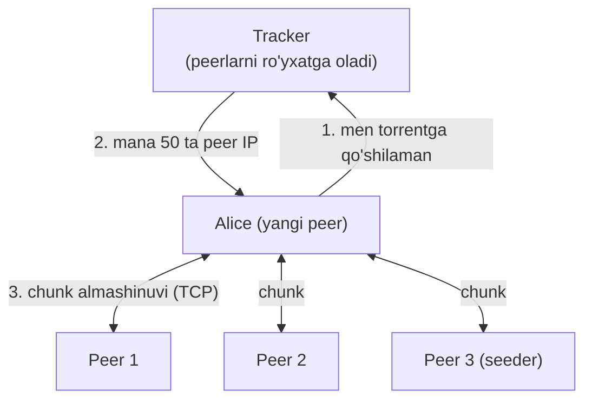
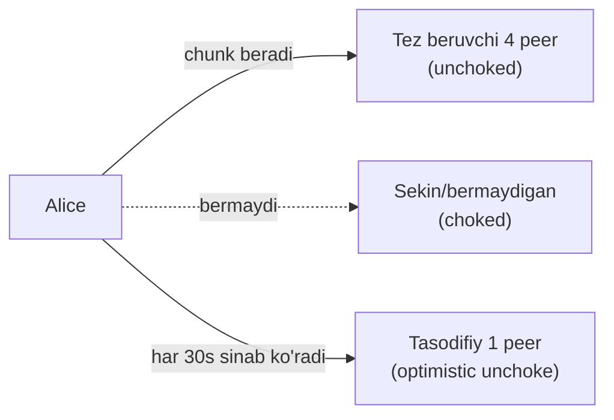
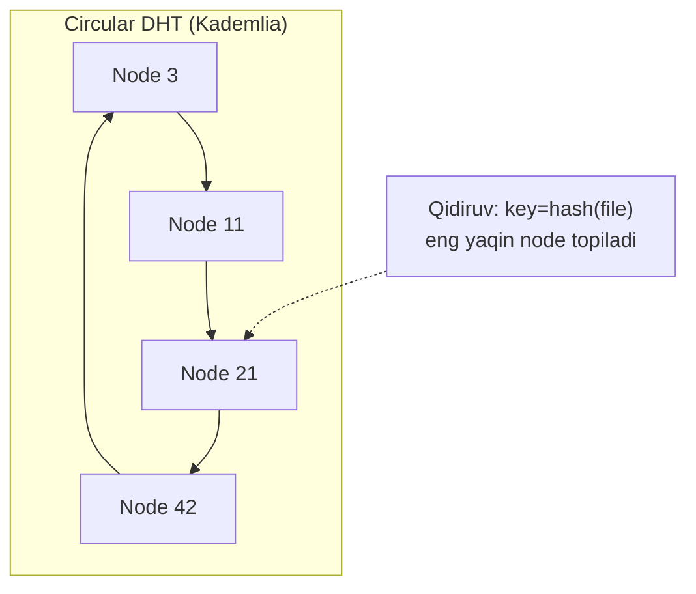

# 08. P2P va BitTorrent — markazsiz fayl almashinuvi

## Muammo: 1 million odam bitta faylni yuklab olsa?

Yangi Linux distributivi chiqdi (5 GB), 1 million odam bir vaqtda yuklamoqchi.
Client-server modelida markaziy server hammaga yuborishi kerak. Server yuki
foydalanuvchilar soni bilan **chiziqli** oshadi — 1 million client = server
o'ladi yoki juda sekin.

Savol: nima bo'lardi, agar har bir yuklab oluvchi *ayni paytda* boshqalarga ham
tarqatsa? Ko'proq odam qo'shilsa, tizim **tezroq** bo'lardi. Aynan shu g'oya —
**Peer-to-Peer** (P2P) va uning eng mashhur amali **BitTorrent**.

> **Oltin qoida:** Client-serverda ko'proq foydalanuvchi = ko'proq server yuki
> (sekinlashadi). P2P da ko'proq peer = ko'proq bandwidth (tezlashadi, self-scalable).

## Analogiya: kitobni nusxalash zanjiri

Tasavvur qil, bir kitobni 100 kishi o'qimoqchi:

- **Client-server:** faqat kutubxonachi (server) nusxalaydi. 100 kishi navbatda
  kutadi. Kutubxonachi charchaydi.
- **P2P:** kim bir bobni nusxalab olsa, **darhol** boshqalarga o'sha bobni beradi.
  Har kim ham oluvchi, ham beruvchi. 100 kishi bir-biridan boblarni almashadi —
  hech kim uzoq kutmaydi. Ko'proq odam = ko'proq nusxalovchi qo'l.

Farqi: hech kimda to'liq kitob bo'lmasa ham, hamma birgalikda to'liq kitobga ega.

## Sodda ta'rif

**P2P** (Peer-to-Peer) — har bir tugun (peer) ham client, ham server bo'ladigan,
markazsiz arxitektura. **BitTorrent** — faylni kichik **chunk** (bo'lak) larga
bo'lib, peer'lar orasida almashtiradigan P2P protokoli.

## Client-server vs P2P — tezlik matematikasi

| Model | Tarqatish vaqti | N o'sganda |
|-------|-----------------|------------|
| Client-server | `max{F/us, NF/us}` | Cheksiz oshadi |
| P2P | `max{F/us, F/dmin, NF/(us+Σui)}` | Doimiy qoladi |

Bu yerda F = fayl hajmi, us = server upload tezligi, ui = peer i upload tezligi,
N = peerlar soni. Muhim nuqta: P2P da maxrajda `Σui` (barcha peerlar upload
tezligi yig'indisi) bor — N o'sganda maxraj ham o'sadi, shu sabab vaqt cheksiz
oshmaydi. Bu **self-scalability**.

## Diagramma: torrent ekotizimi



Asosiy tushunchalar:
- **Torrent** — bir faylni tarqatayotgan barcha peerlar to'plami.
- **Tracker** — peerlarni kuzatuvchi tugun; yangi peerga tasodifiy ~50 ta peer IP
  beradi.
- **Chunk/segment** — fayl bo'lagi (odatda ~256 KB).
- **Seeder** — to'liq faylga ega peer (faqat tarqatadi).
- **Leecher** — hali to'liq olmagan peer (oladi va tarqatadi).

## Ikki muhim algoritm

BitTorrent ikkita aqlli algoritm ishlatadi:

**1. Rarest first (eng kam uchraydigan birinchi):** Alice eng kam tarqalgan
chunk'ni birinchi so'raydi. Nega? Chunki nodir chunk yo'qolib ketmasligi va butun
torrent bo'ylab teng tarqalishi uchun.

**2. Tit-for-tat (qarshi javob):** Alice unga eng tez ma'lumot berayotgan 4 ta
peerga javob (chunk) beradi. Bu **freerider** (faqat oluvchi, hech nima
bermaydigan) larga qarshi kurashadi.



- **Choking/unchoking:** 4 ta eng yaxshi peer "unchoked" (chunk oladi), qolganlari
  "choked".
- **Optimistic unchoking:** har 30 soniyada tasodifiy peer sinaladi — yangi yaxshi
  hamkorlarni topish uchun.

## Diagramma: DHT — trackersiz peer topish

Tracker markaziy nuqta — u o'chsa torrent ishlamaydi. **DHT** (Distributed Hash
Table) buni yechadi: peerlarning o'zi tracker rolini o'ynaydi.



DHT printsipi:
- Har peer va har key `[0, 2^n-1]` oralig'ida identifier oladi (hash orqali).
- Key-value juftlik eng yaqin identifierli peerda saqlanadi.
- Peerlar halqa (ring) shaklida; har biri predecessor va successor'ni biladi.
- **Shortcut links** bilan qidiruv `O(log N)` gacha tezlashadi (aks holda N/2).

2026 holati (WebSearch): BitTorrent DHT **Kademlia** asosida, UDP ustida ishlaydi
(BEP 5). **Magnet link** (BEP 9) `.torrent` faylsiz, faqat hash bilan yuklab
olishga imkon beradi — metadata ham peerlardan olinadi. **WebTorrent** brauzerda
ishlaydi, lekin brauzerda UDP socket yo'q, shu sabab DHT o'rniga WebRTC tracker va
PEX (Peer Exchange) ishlatadi.

## Worked example — magnet link va torrent

Zamonaviy torrent `.torrent` fayl o'rniga **magnet link** ishlatadi:

```
magnet:?xt=urn:btih:c12fe1c06bba254a9dc9f519b335aa7c1367a88a&dn=ubuntu.iso&tr=udp://tracker.example.com:1337
```

Qismlari:
- `xt=urn:btih:...` — faylning **infohash** (SHA-1, faylni unikal aniqlaydi).
- `dn=` — display name (fayl nomi).
- `tr=` — tracker manzili (ixtiyoriy; DHT bilan trackersiz ham ishlaydi).

CLI misol (aria2 bilan):
```bash
# Magnet link orqali yuklab olish
aria2c "magnet:?xt=urn:btih:c12fe1c06bba254a9dc9f519b335aa7c1367a88a"

# .torrent fayl bilan
aria2c ubuntu-24.04.iso.torrent

# Faqat DHT (tracker'siz)
aria2c --enable-dht=true --bt-enable-lpd=true ubuntu.torrent
```

> 🤔 **O'ylab ko'r:** Nega BitTorrent "rarest first" (eng kam uchraydigan chunk'ni
> birinchi) so'raydi, "eng oson topiladiganini" emas?

<details>
<summary>💡 Javobni ko'rish</summary>

Agar hamma eng oson (ko'p tarqalgan) chunk'ni olsa, nodir chunk bitta-yagona
seeder'da qolib ketadi. U peer chiqib ketsa (churn), o'sha chunk **yo'qoladi** va
hech kim to'liq faylni ololmaydi. "Rarest first" nodir chunk'ni tez ko'paytiradi —
u ko'p peerga tarqalib, torrent barqaror va teng bo'ladi. Bu tizim sog'lig'i uchun.
</details>

## P2P afzallik va kamchiliklari

| Afzallik | Kamchilik |
|----------|-----------|
| Scalability (ko'p peer = tez) | Xavfsizlik boshqaruvi qiyin |
| Fault tolerance (markaz yo'q) | Peer churn (kirib-chiqish) |
| Load distribution | Freerider muammosi |
| Cost efficiency (server tejaydi) | Content nazorati yo'q (huquqiy) |

Qo'llanilishi: Linux distributiv tarqatish, dasturiy ta'minot yangilanishlari
(Windows Update ba'zi qismlarda P2P), blockchain, video streaming (PPLive), IPFS.

## Ko'p uchraydigan xatolar

⚠️ **"P2P = noqonuniy"** — noto'g'ri. P2P — bu arxitektura. BitTorrent qonuniy
(Ubuntu ISO, o'yin yangilanishlari) va noqonuniy maqsadda ishlatilishi mumkin;
protokol o'zi neytral.

⚠️ **"Tracker bo'lmasa torrent ishlamaydi"** — noto'g'ri. DHT + magnet link
trackersiz ishlaydi — peerlarning o'zi tracker rolini bajaradi.

⚠️ **"Seeder = server"** — qisman. Seeder to'liq faylga ega peer, lekin u boshqa
peerlar bilan teng — markaziy server emas. Ko'p seeder = ko'p manba.

⚠️ **"Ko'p peer = sekinroq"** — teskarisi. Client-serverdan farqli, P2P da ko'p
peer ko'proq upload bandwidth qo'shadi (self-scalable).

## Xulosa

- P2P: har peer ham client, ham server; markaz yo'q, self-scalable.
- Client-server yuki N bilan chiziqli oshadi; P2P vaqti N o'sganda doimiy qoladi.
- BitTorrent faylni chunk'larga bo'ladi; tracker peerlarni topishga yordam beradi.
- Rarest first (nodir chunk avval) + tit-for-tat (freerider'ga qarshi).
- DHT (Kademlia) + magnet link trackersiz, markazsiz peer topishni beradi.
- Afzallik: scalability, fault tolerance; kamchilik: xavfsizlik, churn, freerider.

## 🧠 Eslab qol

- P2P = har peer ham oluvchi, ham beruvchi.
- Ko'p peer = tez (self-scalable).
- Chunk = fayl bo'lagi (~256 KB).
- Rarest first + tit-for-tat = ikki asosiy algoritm.
- DHT + magnet = trackersiz ishlaydi.

## ✅ O'z-o'zini tekshir (retrieval practice)

**1. Nega P2P da 1 million foydalanuvchi client-serverdan tezroq yuklab oladi?**

<details>
<summary>Javob</summary>

Client-serverda har yangi client server upload yukini oshiradi — vaqt chiziqli
o'sadi. P2P da har yangi peer o'z upload bandwidth'ini olib keladi: u ham oladi,
ham tarqatadi. Vaqt formulasidagi maxrajda barcha peerlar upload tezligi yig'indisi
(Σui) bor — N o'sganda maxraj ham o'sadi, shu sabab vaqt cheksiz oshmaydi
(self-scalable).
</details>

**2. Tit-for-tat algoritmi qanday muammoni yechadi?**

<details>
<summary>Javob</summary>

**Freerider** muammosini — faqat yuklab oluvchi, lekin hech nima bermaydigan
peerlarni. Tit-for-tat'da Alice faqat unga tez chunk berayotgan peerlarga javoban
chunk beradi. Hech nima bermaydigan peer "choked" bo'ladi (chunk olmaydi). Bu
adolatli almashinuvni rag'batlantiradi.
</details>

**3. DHT trackerni qanday almashtiradi?**

<details>
<summary>Javob</summary>

DHT (Distributed Hash Table, Kademlia) da peerlarning o'zi tracker rolini o'ynaydi.
Har peer va key hash orqali identifier oladi; key-value (fayl hash -> peer ro'yxati)
eng yaqin identifierli peerda saqlanadi. Yangi peer DHT'da qidirib boshqa peerlarni
topadi — markaziy tracker kerak emas. Shortcut links bilan qidiruv O(log N).
</details>

**4. Nima uchun "rarest first" torrent barqarorligini oshiradi?**

<details>
<summary>Javob</summary>

Nodir (kam tarqalgan) chunk'lar tez ko'paytiriladi — ular ko'p peerga tarqaladi.
Aks holda nodir chunk bitta seeder'da qolib, u chiqib ketsa yo'qolar edi va hech
kim to'liq faylni ololmasdi. Rarest first har chunk'ni teng tarqatib, torrent'ni
churn'ga chidamli qiladi.
</details>

## 🛠 Amaliyot

1. **Oson (Modify):** Ubuntu yoki boshqa Linux distributivining rasmiy torrent/magnet
   linkini top (masalan `ubuntu.com/download` -> torrent). Magnet link'dagi
   `xt=urn:btih:` (infohash) va `dn=` qismlarini ajratib yoz.

2. **O'rta (faded example):** Quyidagi aria2 buyruqlarini to'ldir — DHT bilan
   trackersiz yuklab olish:
   ```bash
   aria2c ____ "magnet:?xt=urn:btih:..."   # TODO: DHT ni yoqish flagi
   aria2c --max-upload-limit=____ file.torrent  # TODO: seed bo'lish uchun upload berish
   ```
   <details><summary>Hint</summary>

   `--enable-dht=true` DHT ni yoqadi. Upload limit (masalan `1M`) qo'ysang, sen
   ham seeder bo'lasan (boshqalarga tarqatasan).
   </details>

3. **Qiyin (Make):** Client-server va P2P tarqatish vaqtini qog'ozda hisobla.
   F=1 GB, us=10 MB/s (server), har peer ui=2 MB/s, dmin=5 MB/s. N=10 va N=1000
   uchun ikki modeldagi vaqtni solishtir. Qaysi N'da P2P client-serverdan
   afzalroq bo'ladi?
   <details><summary>Hint</summary>

   Client-server: `max{F/us, N*F/us}`. P2P: `max{F/us, F/dmin, N*F/(us+N*ui)}`.
   N katta bo'lganda client-server NF/us bilan portlaydi, P2P esa F/dmin ga yaqinlashadi.
   </details>

## 🔁 Takrorlash

Bog'liq oldingi mavzular:
- [01-application-layer-va-socketlar.md](01-application-layer-va-socketlar.md) —
  client-server vs P2P arxitektura kirish.
- [02-dns.md](02-dns.md) — DHT ham hash asosidagi taqsimlangan qidiruv (DNS ga
  konseptual o'xshash).

Takrorlash jadvali:
- **Ertaga:** Torrent ekotizimi diagrammasini (tracker, peer, seeder) xotiradan chiz.
- **3 kundan keyin:** Rarest first va tit-for-tat farqini tushuntir.
- **1 haftadan keyin:** "O'z-o'zini tekshir" 1 va 3 savoliga qayt.

Feynman testi: P2P ni "kitobni nusxalash zanjiri" analogiyasi bilan 3 jumlada
tushuntir — nega ko'proq odam tezroq degani.

## 📚 Manbalar

- [BEP 5 — DHT Protocol](https://www.bittorrent.org/beps/bep_0005.html)
- [BEP 9 — Magnet URIs / metadata](https://www.bittorrent.org/beps/bep_0009.html)
- [bittorrent-dht (WebTorrent, GitHub)](https://github.com/webtorrent/bittorrent-dht)
- [WebTorrent — BEP support](https://mintlify.wiki/webtorrent/webtorrent/advanced/bep-support)
- Kurose & Ross, "Computer Networking", Bob 2.5 (P2P Applications)
