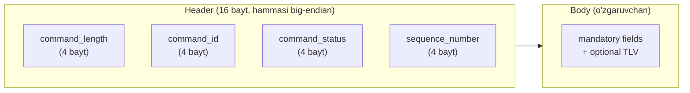
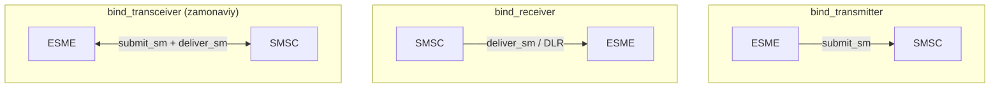
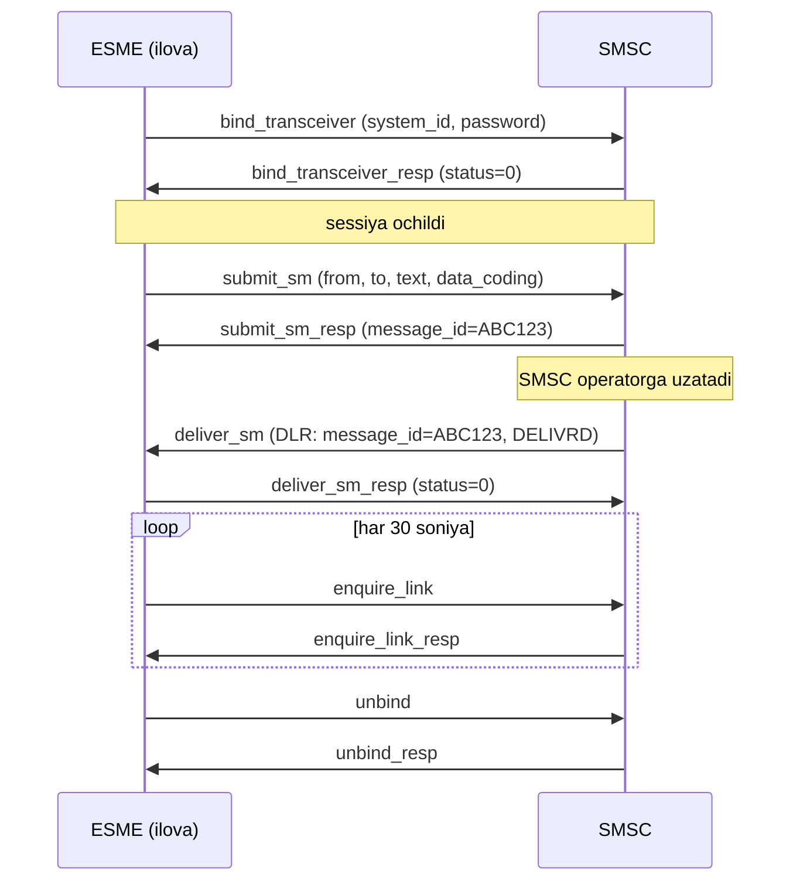
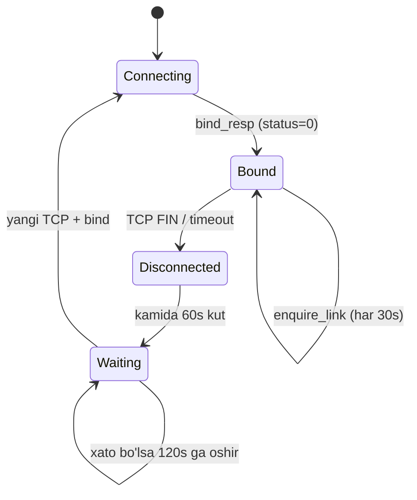
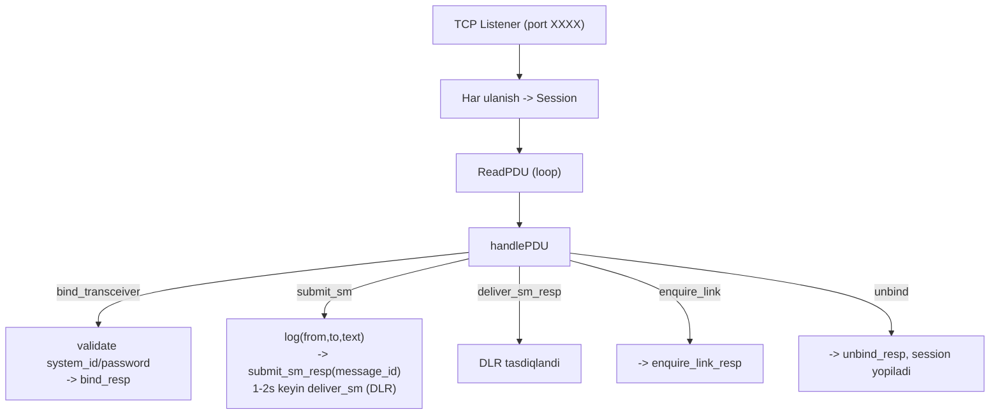

# 09. SMPP — SMS uzatish protokoli

## Muammo: ilova qanday qilib SMS yuboradi?

Sen banking ilovasi yozyapsan. Foydalanuvchi ro'yxatdan o'tganda unga SMS kod
yuborilishi kerak. Lekin ilovang mobil operator emas — u to'g'ridan-to'g'ri
telefonlarga SMS jo'nata olmaydi.

Kerak bir "ko'prik": ilova bilan operator SMS markazi (**SMSC**) o'rtasida.
Ilova SMSC ga "shu raqamga shu matnni yubor" deb aytadi, SMSC uni operator
tarmog'iga uzatadi. Bu ko'prikning tili — **SMPP**.

> **Oltin qoida:** SMPP — ilova (ESME) va SMS markazi (SMSC) o'rtasida qisqa
> xabar (SMS) uzatish uchun ochiq standart protokol. TCP ustida ishlaydi, PDU'lar
> binary formatda.

## Analogiya: pochta bo'limi bilan shartnoma

SMSC — bu pochta bo'limi. Sen (ilova) mijozsan:

- Avval ro'yxatdan o'tasan — hisob ochasan (**bind**): "Men Alisher, parolim
  shu". Pochta seni tanidi.
- Keyin xatni topshirasan (**submit_sm**): "Bu raqamga bu matnni yubor".
- Pochta chek beradi (**submit_sm_resp** + message_id).
- Xat yetkazilgach, pochta senga xabar beradi (**deliver_sm** — DLR, delivery report).
- Har 30 soniyada "hali tirikmisan?" deb tekshirasan (**enquire_link**).

Farqi: bu "shartnoma" doimiy TCP ulanish orqali ishlaydi va aniq qoidalarga
(keepalive, reconnect) bo'ysunadi.

## Sodda ta'rif va atamalar

**SMPP** (Short Message Peer-to-Peer) — SMS uzatish protokoli. Asosiy atamalar:

| Atama | Ma'nosi |
|-------|---------|
| **SMSC** | Short Message Service Center — operator SMS markazi |
| **ESME** | External Short Message Entity — tashqi ilova (sizning kodingiz) |
| **PDU** | Protocol Data Unit — protokol paketi (binary) |
| **system_id** | ESME hisob (akkaunt) identifikatori |
| **bind** | Sessiyani ochish/autentifikatsiya |
| **DLR** | Delivery Report — yetkazish hisoboti |

Amalda ishlatiladigan versiya — **SMPP 3.4** (eng mashhur). WebSearch: 2023
so'rovda respondentlarning **54%** SMPP 3.4 ni ishlatadi, atigi 8% SMPP 5.0 ni.
SMPP 5.0 cell broadcast va smart flow control qo'shadi, lekin kam tarqalgan.

## Diagramma: PDU strukturasi

Har SMPP PDU ikki qism: **header (16 bayt)** + **body**.



| Maydon | Vazifasi |
|--------|----------|
| `command_length` | Butun PDU uzunligi (header + body) |
| `command_id` | Qaysi operatsiya (submit_sm, bind_transceiver...) |
| `command_status` | Xato kodi (0 = ESME_ROK, muvaffaqiyat) |
| `sequence_number` | Request/response ni moslash uchun (HTTP'dagi ID kabi) |

Muhim notional machine detali: barcha ko'p baytli maydonlar **network byte order**
(big-endian) da. `sequence_number` request bilan response'ni bog'laydi —
asinxron rejimda ko'p PDU bir vaqtda yo'lda bo'lganda qaysi javob qaysi so'rovga
tegishli ekanligini shu aniqlaydi.

## Bind rejimlari: Transmitter, Receiver, Transceiver

Sessiya ochilganda ESME uch xil rolda ulanishi mumkin:

| Bind turi | Yo'nalish | Vazifasi |
|-----------|-----------|----------|
| **bind_transmitter** | ESME -> SMSC | Faqat yuborish (submit_sm) |
| **bind_receiver** | SMSC -> ESME | Faqat qabul qilish (deliver_sm, DLR) |
| **bind_transceiver** | Ikki tomonlama | Yuborish + qabul (bitta ulanishda) |



**bind_transceiver** SMPP 3.4 da qo'shildi va bugun eng ko'p ishlatiladi — bitta
TCP ulanishda ham yuborasan, ham DLR/inbound olasan. Transmitter+Receiver alohida
ikki ulanish talab qiladi.

## Diagramma: to'liq SMS oqimi



Bosqichlar:
1. **bind** — sessiya ochish, autentifikatsiya (system_id + password).
2. **submit_sm** — SMS topshirish; javob `message_id` bilan.
3. **deliver_sm** — SMSC dan DLR (yetkazildi/yetkazilmadi) yoki inbound SMS.
4. **enquire_link** — keepalive (har 30 soniya).
5. **unbind** — sessiyani chiroyli yopish.

## Muhim operatsion qoidalar (amaliy TZ)

Real integratsiyada SMSC operatorlari qat'iy qoidalar qo'yadi (manba TZ'dan
tarjima):

1. **Protokol:** SMPP 3.4.
2. **Sessiya:** default bitta sessiya; qo'shimchasi kelishuv bo'yicha.
3. **Bind turi:** Transmitter, Receiver yoki Transceiver.
4. **enquire_link:** trafik bor-yo'qligidan qat'i nazar **har 30 soniyada** yubor.
5. **FIN javobi:** SMSC tomondan FIN flagi bilan TCP uzilsa, client FIN (FIN, ACK)
   javob berishi shart; boshqa javob taqiqlanadi.
6. **Reconnect:** SMPP/TCP uzilsa, kamida **60 soniya** kut, keyin yangi TCP
   sessiya ochib bind yubor. Muvaffaqiyatsiz bo'lsa kutishni **120 soniya**ga oshir.
7. **Concatenated (uzun) SMS:** agar bir nechta system_id ishlatilsa, uzun
   xabarning barcha qismlari **bitta system_id** orqali yuborilishi kerak.
8. **data_coding:** lotin uchun `data_coding=0`, kirill uchun `data_coding=8`.

## data_coding — kodlash sxemasi

SMS bitta paketda cheklangan belgiga ega — kodlashga bog'liq:

| data_coding | Kodlash | Bir SMS'da belgi | Concatenated'da |
|-------------|---------|------------------|------------------|
| **0** | GSM 7-bit (lotin) | 160 | 153 |
| **8** | UCS-2 / UTF-16 (kirill, emoji) | 70 | 67 |

Notional machine: `data_coding=8` (UCS-2) da har belgi 2 bayt egallaydi, shu sabab
bir SMS'ga atigi 70 belgi sig'adi. Matn uzunroq bo'lsa, **concatenated SMS** — bir
nechta bo'lakka bo'linadi (UDH header bilan), har bo'lak 67 belgi. Shu sabab
kirill/emoji SMS lotin'dan qimmatroq.

## enquire_link va reconnect — nega muhim



`enquire_link` — bu SMPP ning "puls" i. TCP ulanish **ochiq ko'rinishi** mumkin,
lekin aslida o'lik bo'lsa (NAT timeout, tarmoq uzilishi), faqat davriy ping buni
aniqlaydi. Javob kelmasa — ulanish o'lik, reconnect kerak. Bu keepalive bo'lmasa,
sen "ulanganman" deb o'ylab, hech qanday SMS yubormay o'tirasan.

## Worked example — bind va submit_sm qiymatlari

Real SMPP PDU'lari binary, lekin mantiqiy qiymatlar shunday ko'rinadi:

```text
--- bind_transceiver (ESME -> SMSC) ---
command_id       = 0x00000009   (bind_transceiver)
command_status   = 0x00000000
sequence_number  = 1
system_id        = "alisher_app"
password         = "secret123"
system_type      = "SMPP"
interface_version = 0x34         (SMPP 3.4)

--- bind_transceiver_resp (SMSC -> ESME) ---
command_id       = 0x80000009   (resp = 0x8000_0000 | request_id)
command_status   = 0x00000000   (ESME_ROK — muvaffaqiyat)
sequence_number  = 1
```

E'tibor ber: **response command_id** = request command_id | `0x80000000`. Ya'ni
`bind_transceiver` = `0x09`, `bind_transceiver_resp` = `0x80000009`.

```text
--- submit_sm (SMS yuborish) ---
command_id       = 0x00000004
sequence_number  = 2
source_addr      = "3700"          (jo'natuvchi - qisqa raqam yoki nom)
dest_addr        = "998901234567"  (qabul qiluvchi)
data_coding      = 8               (kirill uchun)
short_message    = "Salom, kodingiz: 5521"

--- submit_sm_resp ---
command_status   = 0x00000000
message_id       = "d41d8cd98f00"  (DLR ni shu ID bilan kuzatasan)
```

> 🤔 **O'ylab ko'r:** Nima bo'ladi, agar enquire_link yubormasang, lekin TCP
> ulanish "ochiq" ko'rinsa? Nega SMS yuborishing muvaffaqiyatsiz bo'lishi mumkin?

<details>
<summary>💡 Javobni ko'rish</summary>

TCP ulanish operatsion tizim darajasida "ESTABLISHED" ko'rinishi mumkin, lekin
oradagi NAT/firewall uni timeout bo'yicha jimgina yopgan bo'lishi mumkin (idle
connection). enquire_link'siz sen buni bilmaysan. `submit_sm` yuborsang, u
"qora tuynuk"ka ketadi — javob kelmaydi yoki TCP RST qaytadi. Shu sabab har 30
soniyalik enquire_link o'lik ulanishni erta aniqlab, reconnect (60s kutib) qilishga
imkon beradi. Bu ishonchlilikning kaliti.
</details>

## Error kodlar (command_status)

`command_status` = 0 muvaffaqiyat (ESME_ROK). Nolga teng bo'lmasa — xato. Muhim
kodlar (manbadagi to'liq jadvaldan):

| Hex | Nomi | Ma'nosi |
|-----|------|---------|
| 0x00000000 | ESME_ROK | Muvaffaqiyat |
| 0x00000005 | ESME_RALYBND | Allaqachon bog'langan |
| 0x00000006 | ESME_RINVPASWD | Noto'g'ri parol |
| 0x00000007 | ESME_RINVSYSID | Noto'g'ri system_id |
| 0x0000000A | ESME_RMSGQFUL | Xabar navbati to'la |
| 0x00000045 | ESME_RSUBMITFAIL | submit_sm bajarilmadi |
| 0x00000048 | ESME_RINVSRCADR | Noto'g'ri source_addr |
| 0x00000049 | ESME_RINVDSTADR | Noto'g'ri dest_addr |
| 0x00000053 | ESME_RINVDCS | Noto'g'ri data_coding sxemasi |
| 0x000000C0 | ESME_RDELIVERYFAILURE | Yetkazish amalga oshmadi |
| 0x000000C1 | ESME_RUNKNOWNERR | Noma'lum xato |

Xatolar 4 kategoriya: asosiy protokol (0x00-0x0B), xabar qayta ishlash (0x33-0x58),
TLV (0x60-0x64), yetkazish/broadcast (0xC0-0xD4).

## SMSC arxitekturasi (simulyator mantig'i)

SMSC (yoki uni simulyatsiya qiluvchi server) mantig'i:



Bosqichlar:
1. **TCP listener** portda kutadi; har yangi ulanish uchun `Session` ochiladi.
2. **bind_transceiver** — system_id, password, addr_ton, addr_npi validatsiya;
   `bind_transceiver_resp` qaytariladi.
3. **submit_sm** — log'ga yoziladi (from, to, text); `submit_sm_resp` message_id
   bilan; 1-2 soniyadan keyin `deliver_sm` (DLR) yuboriladi.
4. **deliver_sm** — client `deliver_sm_resp` bilan javob beradi.
5. **enquire_link** va **unbind** qo'llab-quvvatlanadi.

## Ko'p uchraydigan xatolar

⚠️ **"enquire_link ixtiyoriy"** — noto'g'ri. Usiz o'lik ulanish aniqlanmaydi va SMS
yo'qoladi. Har 30 soniya majburiy.

⚠️ **"data_coding=0 hamma matnga yaraydi"** — noto'g'ri. `data_coding=0` faqat
lotin (GSM 7-bit). Kirill/emoji uchun `data_coding=8` (UCS-2) kerak, aks holda
matn buziladi.

⚠️ **"uzilishdan keyin darhol qayta ulanaman"** — noto'g'ri. TZ kamida 60 soniya
kutishni, xatoda 120 ga oshirishni talab qiladi (SMSC'ni bombardimon qilmaslik uchun).

⚠️ **"uzun SMS'ni istalgan akkauntdan yuborsam bo'ladi"** — noto'g'ri. Concatenated
SMS'ning barcha qismlari **bitta system_id** orqali ketishi kerak, aks holda
qismlar birlashmaydi.

⚠️ **"submit_sm_resp = SMS yetkazildi"** — noto'g'ri. `submit_sm_resp` faqat SMSC
xabarni **qabul qildi** deganini bildiradi (message_id bilan). Haqiqiy yetkazish
keyinroq **deliver_sm** (DLR) orqali tasdiqlanadi.

## Xulosa

- SMPP — ESME (ilova) va SMSC (SMS markazi) o'rtasida SMS uzatish protokoli, TCP ustida.
- PDU = header (16 bayt: command_length, command_id, command_status, sequence_number)
  + body; binary, big-endian.
- Bind rejimlari: transmitter (yuborish), receiver (qabul), transceiver (ikkovi).
- Oqim: bind -> submit_sm -> submit_sm_resp -> deliver_sm (DLR) -> unbind.
- enquire_link har 30s (keepalive); uzilishda 60s (xatoda 120s) kutib reconnect.
- data_coding=0 lotin (160 belgi), data_coding=8 kirill/emoji (70 belgi).

## 🧠 Eslab qol

- SMPP: ESME <-> SMSC, TCP, binary PDU.
- Header 16 bayt: length, command_id, status, sequence.
- Transceiver = yuborish + qabul (bitta ulanish).
- enquire_link har 30s = puls.
- data_coding: 0=lotin, 8=kirill.

## ✅ O'z-o'zini tekshir (retrieval practice)

**1. `submit_sm_resp` keldi, status=0. SMS foydalanuvchiga yetkazildimi?**

<details>
<summary>Javob</summary>

Yo'q, hali emas. `submit_sm_resp` (status=0) faqat SMSC xabarni **qabul qildi**
va message_id berdi. Haqiqiy yetkazish keyinroq **deliver_sm** (DLR) orqali
keladi — u DELIVRD (yetkazildi), UNDELIV (yetkazilmadi) kabi holatni beradi. Shu
message_id bilan kuzatasan.
</details>

**2. Kirill matnli SMS'da nega faqat 70 belgi sig'adi, lotin'da 160?**

<details>
<summary>Javob</summary>

Kirill/emoji uchun `data_coding=8` (UCS-2/UTF-16) ishlatiladi — har belgi 2 bayt.
SMS payload 140 bayt, shuning uchun 140/2 = 70 belgi. Lotin uchun `data_coding=0`
(GSM 7-bit) — har belgi 7 bit, shuning uchun ~160 belgi sig'adi. Kirill SMS
qimmatroq (ko'proq bo'lak).
</details>

**3. TCP ulanish "ESTABLISHED" ko'rinadi, lekin SMS yuborilmayapti. enquire_link
qanday yordam beradi?**

<details>
<summary>Javob</summary>

Oradagi NAT/firewall idle ulanishni jimgina yopgan bo'lishi mumkin — OS hali
"ESTABLISHED" ko'rsatadi, lekin ulanish o'lik. enquire_link (har 30s) javob
kelmasa buni aniqlaydi. So'ng TZ bo'yicha kamida 60 soniya kutib, yangi TCP sessiya
va bind bilan reconnect qilinadi. Keepalive'siz o'lik ulanish uzoq aniqlanmay qoladi.
</details>

**4. Response PDU'ning command_id request'dan qanday farq qiladi?**

<details>
<summary>Javob</summary>

Response command_id = request command_id `| 0x80000000` (eng yuqori bit yoqiladi).
Masalan `submit_sm` = `0x00000004`, `submit_sm_resp` = `0x80000004`. Shu bilan
PDU request'mi yoki response'mi ekanligini command_id'dan darhol bilasan; qaysi
request'ga tegishli ekanligini esa `sequence_number` aniqlaydi.
</details>

## 🛠 Amaliyot

1. **Oson (Modify):** Quyidagi matnlarni data_coding bo'yicha tasnifla va nechta
   SMS bo'lakka bo'linishini hisobla: (a) "Your code is 1234" (lotin, 18 belgi),
   (b) "Salom, kod 5521" ni kirill harflar bilan (masalan 16 belgi). Qaysi
   data_coding va nechta bo'lak?
   <details><summary>Hint</summary>

   Lotin < 160 => 1 bo'lak, data_coding=0. Kirill < 70 => 1 bo'lak, data_coding=8.
   80 belgili kirill matn => 2 bo'lak (har biri 67).
   </details>

2. **O'rta (faded example):** Quyidagi SMPP session state mantiqini to'ldir
   (pseudo-code):
   ```
   ulanish uzildi:
       kut(____)                    # TODO: TZ bo'yicha minimal soniya
       yangi_tcp_ulanish()
       yubor(bind_transceiver)
       agar bind_muvaffaqiyatsiz:
           kut(____)                # TODO: xatoda oshirilgan soniya
   har ____ soniyada:               # TODO: enquire_link davri
       yubor(enquire_link)
   ```
   <details><summary>Hint</summary>

   Reconnect kutish minimal 60s, xatoda 120s. enquire_link har 30s.
   </details>

3. **Qiyin (Make):** SMPP simulyator uchun handlePDU mantig'ini loyihalang: qaysi
   command_id kelganda qanday javob (resp) qaytadi? bind_transceiver, submit_sm,
   enquire_link, unbind uchun javob PDU'larini va command_status qiymatlarini yoz.
   submit_sm dan keyin deliver_sm (DLR) qachon va qanday yuboriladi?
   <details><summary>Hint</summary>

   Har request'ga `command_id | 0x80000000` resp. submit_sm -> submit_sm_resp
   (message_id bilan), keyin 1-2s dan so'ng SMSC deliver_sm (DLR) yuboradi, client
   deliver_sm_resp bilan javob beradi. Noto'g'ri parol -> ESME_RINVPASWD (0x06).
   </details>

## 🔁 Takrorlash

Bog'liq oldingi mavzular:
- [01-application-layer-va-socketlar.md](01-application-layer-va-socketlar.md) —
  SMPP TCP socket ustida ishlaydi; session/keepalive tushunchasi.
- [06-smtp-va-email.md](06-smtp-va-email.md) — SMTP kabi SMPP ham doimiy TCP
  sessiya va bosqichli komandalar bilan ishlaydi.

Takrorlash jadvali:
- **Ertaga:** SMS oqimi diagrammasini (bind -> submit_sm -> deliver_sm) xotiradan chiz.
- **3 kundan keyin:** Bind uch rejimini va data_coding jadvalini qayta yoz.
- **1 haftadan keyin:** "O'z-o'zini tekshir" 1 va 3 savoliga qayt.

Feynman testi: SMPP oqimini "pochta bo'limi bilan shartnoma" analogiyasi bilan 3
jumlada tushuntir — bind, submit, DLR va enquire_link ni aytib ber.

## 📚 Manbalar

- [SMPP v3.4 Specification (smpp.org)](https://smpp.org/SMPP_v3_4_Issue1_2.pdf)
- [SMPP v5.0 Specification (smpp.org)](https://smpp.org/SMPP_v5.pdf)
- [Short Message Peer-to-Peer — Wikipedia](https://en.wikipedia.org/wiki/Short_Message_Peer-to-Peer)
- [SMPP protocol version comparison (Ozeki)](https://ozeki-sms-gateway.com/p_6393-smpp-protocol-version-comparison.html)
- [SMPP specifications (Infobip Docs)](https://www.infobip.com/docs/essentials/api-essentials/smpp-specification)
