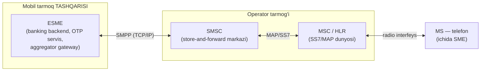
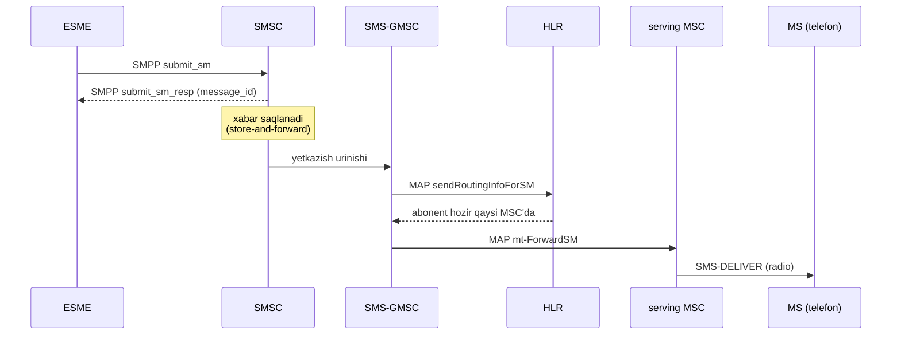
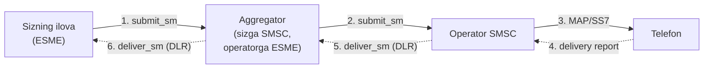

# 1-bob. SMS ekotizimi va SMPP'ning o'rni

> **Bu bobda:** SMS yuborilganda qaysi komponentlar qatnashadi, SMPP ular orasida qayerda turadi, nega aynan v3.4 versiyasini o'rganamiz — va loyihamizning birinchi Go kodi: `pdu` package'ining poydevori.

SMPP'ni implement qilishdan oldin bitta savolga aniq javob berishimiz kerak: **bu protokol aslida qaysi muammoni hal qiladi?** Ko'p dasturchi SMPP'ni "SMS yuborish API'si" deb biladi va shu yerda birinchi noto'g'ri tasavvur boshlanadi. SMPP telefon bilan gaplashmaydi, radio to'lqin bilan ishi yo'q, hatto xabarni yetkazishga ham kafolat bermaydi. U juda tor va aniq vazifani bajaradi: **SMS infratuzilmasining ikki qatnashchisi orasida xabar almashish uchun binary til**. Qaysi ikki qatnashchi ekanini tushunish — butun kitobning fundamenti.

## 1.1 Uch aktyor: SME, ESME, SMSC

SMPP v3.4 spec (Issue 1.2, 1999) terminologiyasida uchta asosiy rol bor (v3.4 §1.1, §1.3 Glossary):

| Termin | Ochilishi | Kim bu? |
|---|---|---|
| **SME** | Short Message Entity | Xabar yubora oladigan yoki qabul qila oladigan HAR QANDAY entity. Telefon ichidagi SMS ilovasi ham SME, server ham SME |
| **ESME** | External Short Message Entity | Mobil tarmoq **TASHQARISIDAGI** SME: banking backend, OTP servisi, aggregator gateway, WAP proxy, email gateway... Bizning Go dasturimiz — ESME |
| **SMSC** | Short Message Service Centre | Operator tarmog'idagi xabar markazi: xabarlarni qabul qiladi, saqlaydi (store), abonentga yetkazishga urinadi (forward). Spec buni umumiyroq "Message Centre (MC)" deb ham ataydi |

Kalit so'z — ESME'dagi **"External"**. Telefon ichidagi SMS klienti SME, lekin ESME emas: u mobil tarmoqning ichida yashaydi va SMSC bilan radio + SS7 orqali gaplashadi. ESME esa tarmoqdan tashqarida turadi va SMSC bilan oddiy **TCP/IP** orqali gaplashadi (v3.4 §1.1; spec'da X.25 varianti ham bor, lekin u tarixiy qoldiq va bugun amalda o'lik — boshqa eslamaymiz). SMPP — aynan shu ESME ↔ SMSC oralig'ining protokoli:



Rasmga qarab SMPP'ning qiymatini bitta gapda aytish mumkin: **SMPP ESME'ni SS7/MAP murakkabligidan to'liq izolyatsiya qiladi**. SS7 — telekom operatorlarining yopiq, litsenziyalangan, juda murakkab signalizatsiya dunyosi. SMPP tufayli oddiy backend dasturchi shu dunyoga kirmasdan, TCP socket ochib SMS yubora oladi.

Yana bir muhim spec fakti: SMPP application layer protokol va **transport funksiyasini bermaydi** — "SMPP is an application layer protocol and is not intended to offer transport functionality" (v3.4 §2.4). Ishonchli yetkazish, paketlar tartibi, qayta uzatish — hammasi TCP zimmasida. SMPP TCP'ni "ishonchli quvur" deb qabul qiladi. Bu 2-bobda framing yozayotganimizda muhim bo'ladi: TCP quvur ishonchli, lekin **xabar chegaralarini bilmaydi** — bu muammoni SMPP'ning o'zi (ya'ni biz) hal qiladi.

## 1.2 Xabar telefongacha qanday yetadi: MO va MT

SMPP faqat ESME ↔ SMSC oralig'ini qoplashini bilamiz. Lekin to'liq rasm uchun SMSC'dan narigi tomonda nima bo'lishini yuzaki bo'lsa ham bilish kerak — ayniqsa delivery receipt'lar (9-bob) qayerdan kelishini tushunish uchun. GSM dunyosida ikki yo'nalish farqlanadi:

- **MT (Mobile Terminated)** — xabar telefonga **boradi**. ESME yuborgan SMS — MT xabar.
- **MO (Mobile Originated)** — xabar telefondan **chiqadi**. Abonent short code'ga yuborgan "STOP" — MO xabar.

MT yo'li (bizning submit_sm'imiz bosib o'tadigan yo'l):



Bu diagrammadagi ikki narsaga e'tibor bering. Birinchisi: `submit_sm_resp` xabar **SMSC tomonidan qabul qilinganini** bildiradi, xolos — telefon hali xabarni ko'rgani yo'q, HLR so'rovi hali boshlanmagan ham bo'lishi mumkin. "SMS yetkazildi"ni faqat delivery receipt aytadi (9-bob). Bu — SMPP bilan ishlashdagi eng ko'p uchraydigan tushunmovchilik. Ikkinchisi: HLR (Home Location Register) abonent qaysi MSC hududida ekanini biladi; abonent offline bo'lsa SMSC xabarni saqlab, keyinroq qayta urinadi — shuning uchun bu model **store-and-forward** deb ataladi (v3.4 §2.10.1).

MO yo'li qisqaroq — telefondan chiqqan xabar serving MSC orqali `MAP mo-ForwardSM` bilan SMSC'ga keladi, SMSC esa uni tegishli ESME'ga SMPP `deliver_sm` PDU'si bilan uzatadi. Demak `deliver_sm` ikki xil yukni tashiydi: abonentdan kelgan MO xabar yoki SMSC yaratgan delivery receipt — ikkalasini ajratishni 5-bobda `esm_class` field'i orqali o'rganamiz.

MAP (`mo-ForwardSM`, `sendRoutingInfoForSM`, `mt-ForwardSM`) — SS7 dunyosining protokoli, biz uni implement qilmaymiz; bu nomlarni bilish delivery zanjirini o'qiy olish uchun kifoya (normativ manba: 3GPP TS 23.040).

## 1.3 Aggregator'lar: zanjirdagi ko'rinmas bo'g'in

Amalda "SMPP provider"ga ulanaman deganingizda, deyarli har doim operatorga emas, **aggregator'ga** ulanasiz. Aggregator — ko'p operator SMSC'lariga ulangan oraliq kompaniya. SMPP nuqtai nazaridan u ikki yuzli:

- mijozlariga (sizga) nisbatan **SMSC rolini** o'ynaydi — server, siz unga bind qilasiz;
- operatorga nisbatan **ESME rolini** o'ynaydi — client, u operatorga bind qiladi.



Xabar zanjir bo'ylab yuqoriga `submit_sm`'lar bilan, delivery receipt (DLR) esa pastga `deliver_sm`'lar bilan oqadi. Har bir hop — alohida SMPP session, alohida `message_id` fazosi, alohida quirk to'plami. Shu sababli DLR bilan bog'liq muammolar (kechikish, format og'ishlari, hex/decimal message_id chalkashligi — 9-bob) ko'pincha protokolning emas, zanjirning kasalligi.

> **⚠ Amaliyotda.** DLR formati spec'ning normativ qismi emas — v3.4 Appendix B'da faqat "typical example" sifatida berilgan. Zanjirdagi har bir hop uni o'zicha yozishi mumkin. Aggregator orqali ishlaganda DLR latency ham har xil: operator zanjirning o'z hop'ida qancha ushlab turganini siz ko'rmaysiz. Shuning uchun production gateway'da "DLR kelmadi" bilan "SMS yetmadi" ni hech qachon tenglashtirib bo'lmaydi.

## 1.4 Uch message mode: store-and-forward, datagram, transaction

v3.4 §2.10 uchta xabar almashish rejimini ta'riflaydi. Hozircha tanishuv darajasida bilamiz (batafsil 5- va 10-boblarda):

| Mode | Mohiyati | Qanday so'raladi |
|---|---|---|
| **Store and Forward** | Klassik SMS: SMSC xabarni diskka yozadi, yetkazilguncha yoki validity period tugaguncha saqlaydi. Yakuniy natijani bilish uchun ESME delivery receipt so'rashi kerak | Default; submit_sm va data_sm |
| **Datagram** | UDP uslubi: SMSC saqlamaydi, DLR yo'q, scheduled delivery amal qilmaydi. "Yubordim — unutdim" | esm_class orqali; asosan data_sm |
| **Transaction** | Sinxron rejim: response PDU ichida yetkazish natijasi qaytadi. Faqat data_sm qo'llaydi — submit_sm bu rejimni QO'LLAMAYDI (v3.4 §4.4) | data_sm |

Kitob davomida asosiy e'tibor store-and-forward'da bo'ladi — real SMS traffic'ining mutlaq ko'pchiligi shu rejimda yuradi.

## 1.5 Versiyalar tarixi: nega aynan v3.4?

SMPP'ni 1990-yillarning boshida Irlandiyaning Aldiscon kompaniyasi yaratgan (keyinchalik Logica tarkibiga kirgan; bu tarixiy fakt — Wikipedia ma'lumoti, birlamchi hujjat bilan tasdiqlanmagan). Keyin spec SMPP Developers Forum (keyinroq SMS Forum) qo'liga o'tgan. Forum 2007-yilda tarqalgan — spec'lar hozir smpp.org'da arxiv sifatida turadi. Versiyalar evolyutsiyasi:

| Versiya | Yil | Muhim yangiliklari | Bugungi holati |
|---|---|---|---|
| **v3.3** | 1997 | Birinchi keng tarqalgan ochiq versiya. TLV yo'q, transceiver yo'q — TX va RX uchun ikkita alohida TCP connection shart | Legacy; ayrim eski SMSC'larda hali uchraydi |
| **v3.4** | 1999 (Issue 1.2: 12-okt-1999) | `bind_transceiver` (bitta connection'da ikki tomonlama traffic), optional **TLV** parameter'lar, `data_sm`, `message_payload`, GSM'dan tashqari IS-95/ANSI-136/iDEN qo'llovi | **De-fakto sanoat standarti** |
| **v5.0** | 2003 | broadcast_sm oilasi, congestion_state TLV, 7 state'li session modeli, yangi error kodlar | Bozor qabul qilmagan |

Raqamlar bilan (bular spec fakti emas, **industriya so'rovi** — Ozeki 2023, metodikasi noma'lum, taxminiy deb qaraymiz): respondentlarning ~54% v3.4 ishlatadi, v5.0 esa atigi ~8%. Yirik aggregator'lar pozitsiyasi yanada qat'iy: masalan Infobip SMPP interfeysi **faqat v3.4** qo'llaydi — v3.3 ham, v5.0 ham yo'q.

Nega v3.4 g'olib chiqdi?

1. **Transceiver resurs tejaydi.** v3.3'da yuborish va qabul qilish uchun ikkita connection kerak edi; v3.4 `bind_transceiver` bilan bitta connection'da ikkalasini beradi (v3.4 §2.2).
2. **TLV kengayuvchanlik berdi.** Optional Tag-Length-Value parameter'lar (v3.4 §3.2.4) tufayli vendor'lar protokolni buzmasdan o'z extension'larini qo'shadigan bo'ldi; forward/backward compatibility qoidalari (§3.3–3.4) eski client'larni himoya qiladi.
3. **v5.0 real muammo hal qilmadi.** 2003-yilga kelib infratuzilma allaqachon v3.4'da ishlab turardi; v5.0 taklif qilgan yaxshilanishlar migratsiya narxini oqlamadi.
4. **27 yil o'zgarmagan spec.** 1999'dan beri bitta ham yangi Issue chiqmagani uzoq muddatli barqaror target berdi: bir marta to'g'ri implement qilsangiz — abadiy ishlaydi.

Bitta muhim errata detali: **Issue 1.1'da `bind_transceiver` PDU'sida `interface_version` field'i YO'Q edi** — u Issue 1.2'da majburiy field sifatida qo'shilgan (spec Errata varag'i, o'zgarish SMPP V3.4-05Oct99-01). Juda eski implementatsiya bilan integratsiyada bind_transceiver body'si 1 oktetga farq qilishi mumkin — 4-bobda bind codec yozganda buni eslaymiz.

Shu sababli bu kitob **v3.4 Issue 1.2'ni** implement qiladi; haqiqat manbamiz — original ingliz spec ([resources/SMPP_v3_4_Issue1_2.pdf](../resources/SMPP_v3_4_Issue1_2.pdf)). v5.0 farqlariga 16-bobda qisqa qaytamiz.

## 1.6 Muqobillar bilan qisqa taqqos

SMPP yagona ESME ↔ SMSC protokoli emas. Tarixiy raqobatchilar va zamonaviy muqobil:

| Protokol | Kelib chiqishi | Formati | Bugungi o'rni |
|---|---|---|---|
| **SMPP v3.4** | Aldiscon / SMPP Dev Forum | Binary, TLV bilan kengayadi | De-fakto standart; yangi integratsiyalarning asosiy tanlovi |
| **UCP/EMI** | CMG (Niderlandiya) | Text-based frame'lar | CMG SMSC'lari merosi; ayrim Yevropa operatorlarida saqlangan |
| **CIMD2** | Nokia | Text-based, `parameter:value` | Nokia SMSC'lariga xos; kamayib bormoqda |
| **HTTP/REST API** | Zamonaviy aggregator'lar | JSON/HTTP | Sodda, firewall-friendly; kichik hajmlar uchun qulay |

UCP/EMI va CIMD2 ham TCP ustida ishlaydi va deyarli xuddi shu imkoniyatlarni beradi — farq protokol dizayni va ekotizimda (qaysi vendor SMSC'si). Yangi loyihalar deyarli har doim SMPP yoki HTTP tanlaydi.

HTTP bilan taqqoslash amaliy jihatdan qiziqroq: HTTP API'da har xabar (yoki batch) alohida request/response sikli + TLS handshake + HTTP header overhead. SMPP'da esa bitta doimiy TCP session ichida kichik binary PDU'lar oqadi, javobni kutmasdan ketma-ket yuborish mumkin (async rejim, 12-bob) va DLR'lar xuddi shu session orqali real-time keladi — webhook infratuzilmasi kerak emas. Yuqori throughput talab qilinganda (soniyasiga yuzlab-minglab SMS) SMPP shu sababli standart tanlov bo'lib qoladi.

## 1.7 "Peer-to-peer" nomi haqida ogohlantirish

Protokol nomidagi "Peer-to-Peer" bugungi qulog'imizga BitTorrent'ga o'xshash decentralizatsiyani eslatadi — bu chalg'ituvchi. SMPP amalda **qat'iy client-server**: connection'ni HAR DOIM ESME ochadi, bind qiladi, SMSC esa kutadi (yagona ekzotik istisno — outbind, 4-bob). "Peer" so'zi faqat shuni bildiradi: session bound holatga o'tgach, **request PDU'larni ikkala tomon ham yubora oladi** — ESME submit_sm yuboradi, SMSC esa o'z tashabbusi bilan deliver_sm yoki enquire_link yuboradi. Ya'ni tenglik connection darajasida emas, xabar almashish darajasida.

> **⚠ Amaliyotda.** SMPP — **clear-text binary** protokol: `system_id`, `password` (max 8 belgi!) va barcha xabar matnlari tarmoqda shifrsiz oqadi — spec'da TLS umuman yo'q (1999-yil!). Production'da bu SMPP-over-TLS yoki VPN bilan yopiladi, ko'p operatorlar esa qo'shimcha IP whitelisting talab qiladi. 16-bobda TLS dialer yozamiz; hozircha shuni eslab qoling: internetdan to'g'ridan-to'g'ri, himoyasiz SMPP session — OTP kodlaringizni ochiq efirga uzatish degani.

## 1.8 Kod: loyiha skeleti va birinchi package

Nazariya yetarli — kitobning qolgan qismini ta'minlaydigan Go loyihasini boshlaymiz. Uslubimiz Thorsten Ball'ning "Writing an Interpreter in Go" kitobidagidek: har bob o'z kod bo'lagini qo'shadi, har bo'lak testlar bilan mustahkamlanadi va keyingi boblar shu poydevor ustiga quriladi.

Loyiha `code/` papkasida mustaqil Go module bo'ladi:

```
code/
├── go.mod          # module smpp
├── pdu/            # PDU turlari va codec'lar (2-bobdan boshlab to'ladi)
├── tlv/            # optional parameter'lar (3-bob)
├── coding/         # text encoding'lar (7–8-boblar)
├── dlr/            # delivery receipt parser (9-bob)
├── session/        # session engine (4, 12-boblar)
├── client/         # ESME client API (13-bob)
├── smsc/           # mock SMSC server (14-bob)
└── examples/       # ishga tushiriladigan demo'lar
```

`go.mod` minimal:

```
module smpp

go 1.22
```

### command_id: protokolning "lug'ati"

Birinchi kod bo'lagi sifatida nimani yozamiz? Hali PDU o'qiy olmaymiz (framing 2-bobda), lekin protokolning eng fundamental lug'atini — **PDU turlari ro'yxatini** — hozirdanoq kodga tushira olamiz. v3.4 §5.1.2.1 Table 5-1 protokoldagi barcha 15 operatsiyani va ularning `command_id` qiymatlarini beradi. Bu jadval kitob davomida yuzlab marta ishlatiladi.

Table 5-1'da uchta g'alati detal bor, kod yozishdan oldin ularni ko'rib qo'yaylik:

1. **Response = request + bit 31.** Har response'ning `command_id`'si mos request'nikidan faqat eng yuqori bit (0x80000000) bilan farq qiladi: `submit_sm` = 0x00000004, `submit_sm_resp` = 0x80000004. Demak "bu response'mi?" degan savol — bitta bit tekshiruvi, "bu request'ning javobi qaysi?" — bitta OR amali (v3.4 §3.2).
2. **Ikki PDU'ning javobi yo'q:** `outbind` (0x0000000B — javobi ESME yuboradigan bind_receiver) va `alert_notification` (0x00000102) (v3.4 §2.8, §4.1.7.1, §4.12.1).
3. **generic_nack faqat response ko'rinishida mavjud** — 0x80000000, request varianti yo'q (v3.4 §4.3.1). Raqamiga qarang: bu "request qiymati 0 bo'lgan PDU'ning response'i" — protokol dizaynining nozik hazili.

Raqamlar ketma-ketligiga ham e'tibor bering: 0x01–0x09 zich, keyin 0x0B (outbind), keyin sakrab 0x15 (enquire_link), 0x21 (submit_multi), 0x102, 0x103. Oradagi qiymatlar Reserved — masalan 0x0A v3.3'dagi query_last_msgs'ning o'rni edi. 0x00010200–0x000102FF diapazoni SMSC vendor'larga ajratilgan (Table 5-1).

Ball uslubida — avval testni yozamiz, ya'ni koddan nimani kutishimizni e'lon qilamiz. Uch xossani qotirmoqchimiz: (1) har konstanta Table 5-1'dagi aynan o'sha raqam; (2) `Resp()` request'dan to'g'ri response yasaydi va nomi ham `_resp` suffiksli bo'ladi; (3) notanish id'lar String()'da hex bilan ko'rinadi. `code/pdu/command_test.go`'dan bir parcha:

```go
func TestRespRoundTrip(t *testing.T) {
	for _, p := range requestPairs {
		t.Run(p.reqName, func(t *testing.T) {
			if got := p.req.Resp(); got != p.resp {
				t.Errorf("%s.Resp() = 0x%08X, kutilgan 0x%08X", p.reqName, uint32(got), uint32(p.resp))
			}
			if p.req.IsResponse() {
				t.Errorf("%s request bo'lishi kerak, IsResponse()=true qaytdi", p.reqName)
			}
			if !p.resp.IsResponse() {
				t.Errorf("%s response bo'lishi kerak, IsResponse()=false qaytdi", p.respName)
			}
			// Resp() nomi ham "_resp" suffiksli rasmiy nom bilan mos kelishi kerak.
			if got := p.req.Resp().String(); got != p.respName {
				t.Errorf("%s.Resp().String() = %q, kutilgan %q", p.reqName, got, p.respName)
			}
		})
	}
}
```

Endi implementatsiya — `code/pdu/command.go`. Named type + konstantalar + uch method:

```go
// CommandID — PDU header'idagi command_id field'i (v3.4 §5.1.2).
// Request PDU'lar 0x00000000–0x000001FF diapazonida yotadi; response PDU'da
// bit 31 o'rnatiladi, ya'ni diapazon 0x80000000–0x800001FF bo'ladi (v3.4 §3.2).
type CommandID uint32

// v3.4 Table 5-1 (§5.1.2.1) bo'yicha command_id qiymatlari.
// outbind va alert_notification'ning response'i yo'q (v3.4 §2.8, §4.1.7.1, §4.12.1);
// generic_nack faqat response ko'rinishida mavjud (v3.4 §4.3.1).
const (
	CmdGenericNack         CommandID = 0x80000000
	CmdBindReceiver        CommandID = 0x00000001
	CmdBindReceiverResp    CommandID = 0x80000001
	CmdBindTransmitter     CommandID = 0x00000002
	CmdBindTransmitterResp CommandID = 0x80000002
	CmdQuerySM             CommandID = 0x00000003
	CmdQuerySMResp         CommandID = 0x80000003
	CmdSubmitSM            CommandID = 0x00000004
	CmdSubmitSMResp        CommandID = 0x80000004
	CmdDeliverSM           CommandID = 0x00000005
	CmdDeliverSMResp       CommandID = 0x80000005
	CmdUnbind              CommandID = 0x00000006
	CmdUnbindResp          CommandID = 0x80000006
	CmdReplaceSM           CommandID = 0x00000007
	CmdReplaceSMResp       CommandID = 0x80000007
	CmdCancelSM            CommandID = 0x00000008
	CmdCancelSMResp        CommandID = 0x80000008
	CmdBindTransceiver     CommandID = 0x00000009
	CmdBindTransceiverResp CommandID = 0x80000009
	CmdOutbind             CommandID = 0x0000000B
	CmdEnquireLink         CommandID = 0x00000015
	CmdEnquireLinkResp     CommandID = 0x80000015
	CmdSubmitMulti         CommandID = 0x00000021
	CmdSubmitMultiResp     CommandID = 0x80000021
	CmdAlertNotification   CommandID = 0x00000102
	CmdDataSM              CommandID = 0x00000103
	CmdDataSMResp          CommandID = 0x80000103
)

// respBit — command_id'ning 31-biti: response PDU belgisi (v3.4 §5.1.2).
const respBit CommandID = 0x80000000

// IsResponse id response PDU ekanini bildiradi (bit 31 o'rnatilgan bo'lsa true).
func (id CommandID) IsResponse() bool { return id&respBit != 0 }

// Resp request command_id'ga mos response command_id'ni qaytaradi
// (bit 31 o'rnatiladi). Javobi bo'lmagan PDU'lar (CmdOutbind, CmdAlertNotification)
// uchun chaqirish ma'nosiz — Table 5-1'da bunday resp qiymatlar Reserved.
func (id CommandID) Resp() CommandID { return id | respBit }
```

Nomlashdagi `Cmd` prefiksi — oldindan ko'rilgan qaror: keyingi boblarda `SubmitSM`, `DeliverSM`, `Outbind` nomlari to'liq PDU STRUCT'lariga kerak bo'ladi (masalan 4-bobdagi `Outbind` struct'i, 5-bobdagi `SubmitSM` codec'i). Konstanta bilan struct bir nom fazosida to'qnashmasligi uchun konstantalar `Cmd`, struct'lar toza nom oladi.

`String()` esa log'lar uchun — protokoldagi rasmiy nomni qaytaradi, notanish qiymatni yashirmasdan hex bilan ko'rsatadi:

```go
// String Table 5-1'dagi rasmiy nomni qaytaradi; notanish id uchun hex ko'rinish.
// Notanish id'lar log'da aynan spec'dagi raqam bilan ko'rinishi debugging'da muhim.
func (id CommandID) String() string {
	if name, ok := commandNames[id]; ok {
		return name
	}
	return fmt.Sprintf("unknown(0x%08X)", uint32(id))
}
```

(`commandNames` — 28 ta rasmiy nomli oddiy `map[CommandID]string`; to'liq matn repo'da.) Nega named type, oddiy `uint32` emas? Chunki 2-bobda header decode qilganda kompilyator `CommandID` bilan `sequence_number`'ni chalkashtirib yuborishimizga yo'l qo'ymaydi — binary protokolda hamma narsa "shunchaki son" bo'lgani uchun type system'dan oladigan har bir himoya qimmat.

Tekshiramiz:

```
$ cd code && go vet ./... && go test ./... -race
ok      smpp/pdu
```

Barcha testlar o'tdi. Bu kichik package endi kitob oxirigacha xizmat qiladi: 2-bobda header decoder unga tayanadi, 10-bobda PDU dispatcher shu konstantalar ustida switch quradi, 14-bobda mock SMSC notanish id'larga generic_nack qaytarayotganda `IsResponse()` ishlatadi.

## Xulosa

Bu bobda SMPP'ning chegaralarini chizdik: u ESME (mobil tarmoq tashqarisidagi dastur) bilan SMSC (operator/aggregator xabar markazi) orasidagi TCP ustidagi binary protokol; SS7/MAP dunyosi undan narigi tomonda qoladi. Aggregator'lar zanjirida har hop ham SMSC, ham ESME rolini o'ynashini, submit_sm_resp "yetkazildi" degani EMASligini, va nega 27 yildan beri v3.4 hukmronlik qilayotganini ko'rdik. Kodda esa protokol lug'atining poydevori — `pdu.CommandID` yotibdi.

**Takrorlash savollari** (javoblar matnda bor — o'zingizni tekshiring):

1. Telefon ichidagi SMS ilovasi SME'mi, ESME'mi? Farqni nima belgilaydi?
2. submit_sm_resp muvaffaqiyatli (status=0) qaytdi. Xabar hozir qayerda va abonent uni ko'rdimi?
3. MT xabar yo'lida HLR qanday savolga javob beradi va bu so'rovni qaysi komponent yuboradi?
4. Aggregator nega bir vaqtning o'zida ham SMSC, ham ESME?
5. v3.4'ning v3.3'dan uchta asosiy farqi nima edi va ulardan qaysi biri protokolni "kengayuvchan" qildi?

**Mashqlar:** [exercises/01-sms-ekotizimi.md](../exercises/01-sms-ekotizimi.md) — SMS yo'lini komponent-komponent chizish, SMPP vs HTTP tezlik tahlili va 0x80000005 sirini ochish.

---

**Keyingi bob:** [2-bob. PDU anatomiyasi](02-pdu-anatomiyasi.md) — 16 baytlik header, big-endian, C-Octet String'lar va TCP stream'dan to'g'ri frame o'qish. Birinchi haqiqiy hex dump'lar shu yerda.

## Manbalar

- [SMPP v3.4 spec, Issue 1.2](../resources/SMPP_v3_4_Issue1_2.pdf) — §1.1 (overview), §1.3 (glossary), §2.4 (transport), §2.8, §2.10 (message mode'lar), §5.1.2.1 Table 5-1
- Tashqi: smpp.org (spec arxivi), Ozeki versiya so'rovi (54%/8% — taxminiy), Infobip SMPP hujjatlari (faqat v3.4), Wikipedia "Short Message Service technical realisation (GSM)" (MO/MT MAP oqimi), 3GPP TS 23.040 — to'liq izohlangan ro'yxat: [resources/links.md](../resources/links.md)
