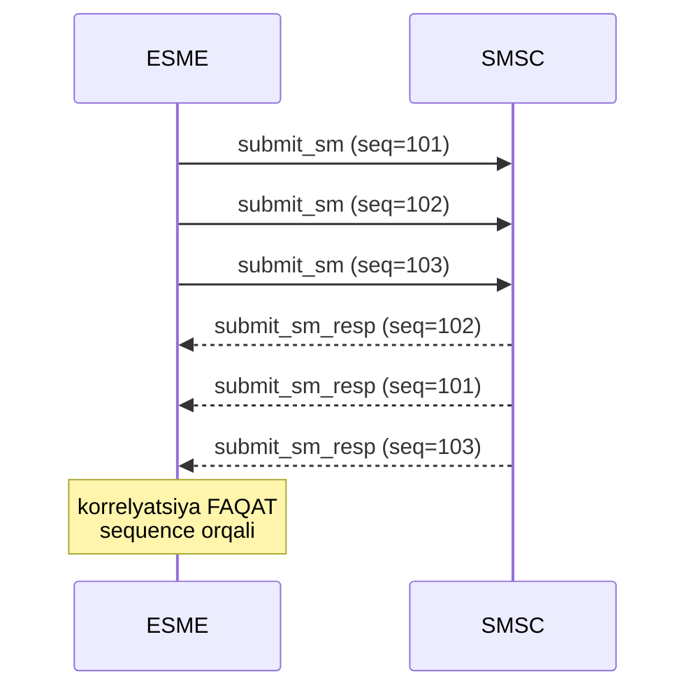
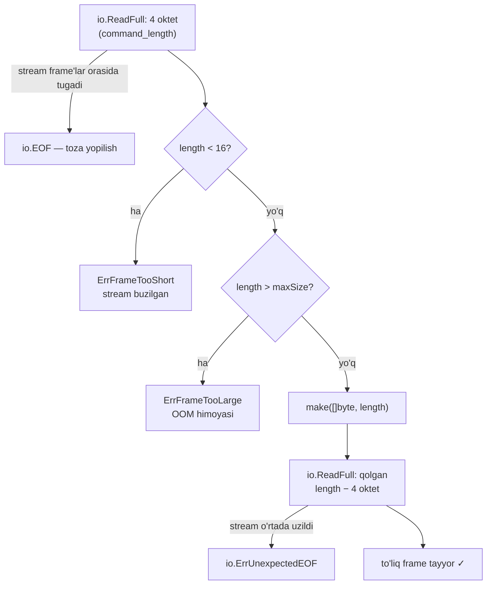

# 2-bob. PDU anatomiyasi: header, data type'lar, framing

> **Bu bobda:** 16 oktetlik PDU header'i, big-endian qoidasi, spec'ning uch data type'i, rasmiy hex misolni byte-ma-byte o'qish — va TCP stream'dan PDU'larni xatosiz kesib oladigan `ReadFrame`. Bob oxirida siz istalgan SMPP hex dump'ni qo'lda o'qiy oladigan bo'lasiz.

1-bobda SMPP'ning qayerda turishini ko'rdik. Endi mikroskopni olamiz: simda aynan qanday baytlar yuradi? SMPP — binary protokol, va binary protokolda taxminga o'rin yo'q: har bayt o'z o'rnida bo'lishi shart. Yaxshi yangilik shuki, SMPP'ning binary formati juda sodda va qat'iy — bitta 16 oktetlik header, uchta data type, bitta framing qoidasi. Shu bobda uchalasini ham to'liq egallaymiz. Bu poydevor bo'lib xizmat qiladi: keyingi boblardagi barcha PDU codec'lar shu yerdagi helper'lar ustiga quriladi.

Ikkita terminni aniqlashtirib olaylik. **PDU** (Protocol Data Unit) — SMPP'ning "xabar birligi": har request PDU, har response PDU; bitta SMS yuborish = bitta submit_sm PDU + bitta submit_sm_resp PDU. **Oktet** — spec'ning "bayt" o'rnidagi so'zi: aynan 8 bit. Telekom standartlari (SMPP, GSM spec'lari, RFC'lar) "byte" so'zidan qochadi, chunki tarixan ba'zi mashinalarda byte 8 bit bo'lmagan; bugungi kunda oktet = bayt deb bemalol o'qiyverasiz, biz ham matnda spec'ka ergashib "oktet" deymiz.

## 2.1 Header: har PDU'ning birinchi 16 okteti

Har SMPP PDU majburiy 16 oktetlik header bilan boshlanadi, undan keyin ixtiyoriy body keladi (v3.4 §3.2). Header — to'rtta 4-oktetlik unsigned Integer, boshqa hech narsa emas:

| # | Field | Oktetlar | Ma'nosi |
|---|---|---|---|
| 1 | `command_length` | 4 | **Butun PDU** uzunligi oktetlarda — header + body, va shu field'ning O'ZI ham kiradi (v3.4 §5.1.1) |
| 2 | `command_id` | 4 | PDU turi — 1-bobda yozgan Table 5-1 qiymatlarimiz (v3.4 §5.1.2) |
| 3 | `command_status` | 4 | Faqat response'da ma'noli: 0 = muvaffaqiyat, boshqasi = xato kodi. **Request'da NULL (0) bo'lishi SHART** (v3.4 §5.1.3) |
| 4 | `sequence_number` | 4 | Request ↔ response korrelyatsiyasi (v3.4 §5.1.4) — 2.5-bo'limda batafsil |

Uchta detal shu jadvalning o'zida ko'p bug'ning oldini oladi:

**command_length o'zini ham sanaydi.** Body'siz PDU (masalan enquire_link) uchun command_length = 16, chunki header'ning o'zi 16 oktet. Body uzunligi = command_length − 16. Ehtiyot bo'ling: spec'ning §3.2 jadvalida body hajmi "Command Length value - 4" deb yozilgan joy bor — u yerda 4 **oktet** emas, 4 **field** (ya'ni header'ning 4 ta field'i) nazarda tutilgan. Oktetlarda hamisha −16.

**command_status request'da doim 0.** "Request'da baribir e'tibor berilmaydi-ku" deb chiqindi qiymat qoldirish xato: spec NULL talab qiladi va ayrim qattiqqo'l server'lar nolsiz request'ni rad etadi. Bizning encoder'lar buni struktura darajasida kafolatlaydi.

**command_id diapazonlari.** Request'lar 0x00000000–0x000001FF, response'lar 0x80000000–0x800001FF (v3.4 §3.2); 0x00010200–0x000102FF (va ularning 0x8001... juftlari) SMSC vendor'larga ajratilgan (Table 5-1). Qolgan hamma narsa Reserved — notanish command_id kelsa javob generic_nack bo'ladi (§3.3; 11-bobda).

### Header-only PDU'lar: eng kichik SMPP xabari

Body ixtiyoriy ekanini aytdik — bir qancha PDU'lar FAQAT header'dan iborat (v3.4 §3.2): enquire_link va enquire_link_resp (§4.11), unbind va unbind_resp (§4.2), generic_nack (§4.3), shuningdek cancel_sm_resp va replace_sm_resp. Bunday PDU'da command_length doim 16. Mana to'liq, real enquire_link (bu baytlar bizning `frame_test.go`'da golden konstanta sifatida turadi):

```
00 00 00 10 00 00 00 15 00 00 00 00 00 00 00 02
```

O'qing: length=0x10 (16 — faqat header), id=0x15 (enquire_link), status=0 (request), sequence=2. Tamom — SMPP'ning "heartbeat"i shu 16 oktet. Uni endi lug'atsiz o'qiy olayotgan bo'lsangiz, bob o'z vazifasini bajaryapti.

## 2.2 Big-endian: tartib masalasi

v3.4 §3.1 qat'iy aytadi: barcha Integer'lar **MSB-first, ya'ni big-endian (network byte order)** uzatiladi. 0x0000002F soni simda `00 00 00 2F` bo'lib ketadi — katta razryad oldinda.

Muammo shundaki, x86 va ARM protsessorlar xotirada **little-endian** ishlaydi. Go'da `uint32`'ni to'g'ridan-to'g'ri xotira ko'rinishida yuborishning iloji ham yo'q (va bu yaxshi!), lekin C tajribasi bor dasturchining "struct'ni cast qilib yuboraman" instinkti SMPP'da klassik falokat: command_length 0x2F o'rniga `2F 00 00 00` = 0x2F000000 = 788 million bo'lib ketadi.

Simptomini bilib qo'ying — debugging'da qimmatga tushadi: little-endian bug'li client ulanadi-yu, **birinchi PDU'dayoq** server ulanishni uzadi yoki javobsiz qotadi. Chunki server "788 MB'lik PDU kelyapti" deb o'ylab, yo darhol rad etadi, yo hech qachon kelmaydigan baytlarni kutib o'tiradi. Teskari yo'nalishda ham xuddi shunday: little-endian o'qigan parser to'g'ri PDU'ning length'ini gigant son deb ko'radi.

Go'da bunga qarshi ikki qonuniy qurol bor: `encoding/binary` package'ining `binary.BigEndian` implementatsiyasi yoki qo'lda shift'lar. Biz kodda shift'larni tanladik (`byte(v >> 24)`, `uint32(b[0])<<24 | ...`) — dependency'siz, platformadan mustaqil va har bayt qayerga borayotgani ko'z oldida. Qaysi birini tanlashingizdan qat'i nazar, qoida bitta: baytlar tartibi haqidagi qaror kodda BITTA joyda yashasin — bizda bu `putUint32`/`getUint32` juftligi, boshqa hech qayerda baytlarga qo'l tegmaydi.

## 2.3 Uch data type

Header'dan tashqaridagi hamma narsa — body — uch data type'dan quriladi (v3.4 §3.1):

| Type | Ta'rifi | Qayerda uchraydi |
|---|---|---|
| **Integer** | Unsigned, belgilangan oktet soni (1/2/4), big-endian. NULL qiymat = hamma oktet 0 | header field'lari, esm_class, data_coding... |
| **C-Octet String** | ASCII belgilar + majburiy NULL (0x00) terminator. Bo'sh string = **yagona 0x00 okteti** | system_id, password, manzillar, message_id |
| **Octet String** | Xom baytlar, terminatorsiz; uzunligi TASHQARIDAN keladi (yonidagi length field yoki TLV Length) | short_message (sm_length bilan), TLV value'lar |

"NULL qiymat" tushunchasi har type'da o'zicha ifodalanadi va bu farqni bilish shart: Integer'da NULL = barcha oktetlar 0 (§3.1 note ii — masalan request'dagi command_status), C-Octet String'da NULL = yagona 0x00 terminator okteti (bo'sh string), "1 or 17" vaqt field'ida esa NULL = o'sha yagona 0x00 varianti. Ya'ni "field'ni bo'sh qoldirish" hech qachon "field'ni yozmaslik" degani EMAS — mandatory field'lar HAR DOIM simda hozir bo'ladi, faqat NULL ko'rinishda. Field'ni butunlay tashlab ketish faqat optional TLV'larga xos (3-bob).

C-Octet String'ning ikki maxsus varianti bor: **Decimal** (faqat '0'–'9' belgilar + NULL) va **Hex** (faqat '0'–'F' + NULL) — message_id va vaqt field'lari shularga tayanadi (Table 3-1). Muhim tushuncha: bu variantlarda ham raqam **ASCII MATN sifatida** yuriladi, binary son sifatida emas. message_id "12345" simda `31 32 33 34 35 00` bo'lib ketadi (6 oktet), 4-oktetlik 0x3039 emas. Shu sabab message_id'ni hech qachon songa aylantirib saqlamang — u opaque string (§5.2.23); "raqamga o'xshagan" id'ni int'ga parse qilish 9-bobdagi hex/decimal korrelyatsiya balosining eshigini ochadi. Va vaqt field'lari uchun spec'da "Fixed 1 or 17" degan yozuv uchraydi: bunday field yo bitta 0x00 okteti (qiymat yo'q), yo aynan 17 oktet (16 belgi + NULL) — oraliq variant yo'q. Bu format 5-bobda (schedule_delivery_time) ishga tushadi, mashqlarda esa hoziroq encoder yozib ko'rasiz.

> **⚠ OGOHLANTIRISH — spec'dagi "Max N" NULL'ni O'Z ICHIGA OLADI.** v3.4 §3.1 note iii: "an 8-character C-Octet String is encoded in 9 octets when the NULL terminator is included". Ya'ni `password: C-Octet String, Max 9` degani — **maksimal 8 belgi** + terminator. `system_id Max 16` = maksimal 15 belgi. Bu qoidani "max 16 belgi sig'adi" deb o'qish — decode xatolarining eng keng tarqalgan manbalaridan biri: 16 belgili system_id yozsangiz, terminator 17-oktetga surilib, keyingi field'lar hammasi bir oktetga siljiydi va butun body "qiyshayib" o'qiladi. Bizning `writeCString`/`readCString` max parametrni aynan spec ma'nosida (NULL bilan) qabul qiladi.

Yana bir nozik nuqta: C-Octet String **ichida** 0x00 bo'lishi mumkin emas — 0x00 aynan terminator. Encoder'imiz buni tekshiradi, chunki ichki NULL bilan yozilgan string keyingi barcha field'larni siljitib, butun PDU'ni buzadi.

## 2.4 Rasmiy hex misol: byte-ma-byte

v3.4 §3.2.2 decode qoidasini bitta rasmiy misol bilan beradi — bind_transmitter PDU, jami 47 (0x2F) oktet. Bu bizning birinchi "haqiqiy" hex dump'imiz; uni to'liq, oktetma-oktet o'qib chiqamiz. Sim orqali kelgan baytlar:

```
00 00 00 2F 00 00 00 02 00 00 00 00 00 00 00 01
53 4D 50 50 33 54 45 53 54 00 73 65 63 72 65 74
30 38 00 53 55 42 4D 49 54 31 00 00 01 01 00
```

Izohlangan ko'rinishi (bind_transmitter body tartibi — v3.4 §4.1.1 Table 4-1; body field'larining ma'nosini 4-bobda chuqur o'rganamiz, hozir bizga baytlar mexanikasi muhim):

| Offset | Baytlar | Field | O'qilishi |
|---|---|---|---|
| 0–3 | `00 00 00 2F` | command_length | 47 oktet — butun PDU, shu 4 baytni ham qo'shib |
| 4–7 | `00 00 00 02` | command_id | 0x00000002 = bind_transmitter; bit 31 = 0 → request |
| 8–11 | `00 00 00 00` | command_status | request → majburiy NULL |
| 12–15 | `00 00 00 01` | sequence_number | 1 — sessiyadagi birinchi PDU |
| 16–25 | `53 4D 50 50 33 54 45 53 54 00` | system_id | ASCII "SMPP3TEST" + NULL terminator (10 oktet) |
| 26–34 | `73 65 63 72 65 74 30 38 00` | password | "secret08" + NULL (9 oktet — Max 9'ning aynan chegarasi!) |
| 35–42 | `53 55 42 4D 49 54 31 00` | system_type | "SUBMIT1" + NULL |
| 43 | `00` | interface_version | 0x00?! — quyidagi izohga qarang |
| 44 | `01` | addr_ton | 1 = International |
| 45 | `01` | addr_npi | 1 = ISDN (E.164) |
| 46 | `00` | address_range | bo'sh C-Octet String = yagona NULL okteti |

Tekshirib ko'ring: 16 (header) + 10 + 9 + 8 + 4 = 47 ✓. Har C-Octet String o'z NULL'i bilan tugayapti, oxirgi field esa bo'sh string bo'lgani uchun bitta 0x00'ning o'zi.

Bu jadvalda bitta g'alati narsa bor: **interface_version = 0x00**. Spec'ning §5.2.4'i "v3.4 uchun 0x34" deydi, lekin spec'ning O'Z rasmiy misolida 0x00 turibdi (original ingliz PDF'da ham aynan shunday — tekshirdik). Bu ziddiyatdan ikki saboq: (1) hattoki spec'ning o'zi ham o'ziga zid kelishi mumkin — implementatsiya "haqiqat manbai"ni tanlashda normativ matnga (§5.2.4) ergashadi, misolga emas; (2) parser esa liberal bo'lishi kerak: 0x00 kelsa "v3.3 yoki undan eski" deb talqin qilinadi (§5.2.4 bo'yicha 0x00–0x33 shu ma'noni beradi). Biz golden testimizda misolni AYNAN spec'dagidek saqlaymiz — g'alatiligi bilan birga.

Decode qoidasining o'zi (v3.4 §3.2.2) juda sodda: **avval 4 oktet o'qi (command_length), keyin qolgan (length − 4) oktetni o'qi.** Shu ikki qadam — SMPP framing'ining butun mohiyati. Lekin "qolganini o'qi"ni TCP ustida TO'G'RI bajarish alohida bo'lim talab qiladi.

## 2.5 sequence_number: kim, qachon, qaysi raqam

Async protokolda (javobni kutmasdan yangi request yuborish mumkin — §2.5–2.7) javoblarni request'larga bog'laydigan yagona ip — sequence_number. Qoidalari (v3.4 §5.1.4, §3.2.1, Table 4-1 footnote):

- Ruxsat etilgan diapazon: **0x00000001 – 0x7FFFFFFF**. Bit 31 ishlatilmaydi — u command_id'da response belgisi, sequence'da esa shunchaki taqiqlangan hudud.
- Response mos request'ning sequence_number'ini **AYNAN qaytarishi shart** ("must be preserved"). Bu korrelyatsiyaning butun asosi.
- Monotonik o'sish — faqat **tavsiya** ("it is recommended"), qat'iy talab emas. Amalda hamma implementatsiya 1'dan boshlab +1 qiladi.
- Har connection o'z sequence fazosiga ega — reconnect'dan keyin 1'dan qayta boshlash normal.

**Spec aytmagan narsa:** 0x7FFFFFFF'ga yetganda nima bo'ladi? Spec faqat diapazonni beradi — wraparound qoidasi YO'Q. Sanoat konventsiyasi (masalan cloudhopper-smpp kutubxonasining `SequenceNumber` klassi, biz manba kodidan tasdiqladik): **0x7FFFFFFF'dan keyin 1'ga qaytiladi** (0'ga emas!). Soniyasiga 1000 PDU'da bu chegaraga ~25 kunda yetasiz — ya'ni bu "hech qachon bo'lmaydigan" holat emas, uzoq yashaydigan production session'da real voqea. Sequencer'ni 12-bobda yozamiz; hozircha qoidani bilib qo'yamiz: `if next > 0x7FFFFFFF { next = 1 }`.

Yana bitta chekka holat: generic_nack'ning sequence'i. Agar kelgan PDU shu qadar buzilgan bo'lsaki, sequence_number'ini ham o'qib bo'lmasa — generic_nack'da 0 (NULL) yuboriladi (§4.3.1). Bu diapazon qoidasi (min 1) bilan ochiq ziddiyat, lekin spec'ning o'zi shunday deydi va amaliyot buni qabul qilgan (v5.0 buni rasman tan olgan). Implementatsiyamiz ham shunga amal qiladi: qabul qilishda 0'ni "korrelyatsiya yo'q" deb tushunadi.

sequence_number'ning kuchi async almashinuvda ochiladi. SMPP ikki rejimni ruxsat etadi (v3.4 §2.5–2.7): **sync** — request yuborib, javob kelguncha kutish; **async** — javobni kutmasdan navbatdagi request'larni yuboraverish. Async'da simda bir vaqtning o'zida bir nechta "javobsiz" (outstanding) request yuradi va javoblar kelgan tartibda emas, SMSC'ga qulay tartibda qaytishi mumkin — spec javoblarni tartibda qaytarishni "should" deydi, lekin har ikki tomon **out-of-order javobni qayta ishlay olishi shart** (§2.5.2):



Outstanding request'lar soniga spec bitta guideline beradi: istalgan paytda 10 tadan oshmasin (§2.5.2 Note — tavsiya, majburiy emas; real limitni SMSC belgilaydi). Sanoat bu tushunchani "window" deb ataydi — qiziq fakt: **"window" so'zi spec'da umuman uchramaydi**, bu butunlay industriya termini. Throughput matematikasi (nega window=1 sekin, window=N tez) va pending window implementatsiyasi — 12-bobning yuragi; bu bobdan olib ketadigan narsamiz: korrelyatsiya faqat sequence orqali, tartibga umid yo'q.

## 2.6 TCP framing: stream'dan PDU kesib olish

Endi bobning eng muhim amaliy qismi. 1-bobda aytdik: SMPP TCP'ni "ishonchli quvur" deb biladi (§2.4). Lekin TCP — **stream** protokol: u baytlarni tartibli va yo'qotishsiz yetkazadi, ammo **xabar chegarasi degan tushunchaga ega emas**. Siz 47 oktetlik PDU yuborsangiz, qabul qiluvchining `Read()` chaqiruvi shularning har birini olishi mumkin:

- bitta chaqiruvda barcha 47 oktet (ko'pincha shunday bo'ladi — va shu "ko'pincha" dasturchini aldaydi);
- avval 20 oktet, keyin 27;
- 1 oktetdan 47 marta;
- yoki 47 + keyingi PDU'ning yarmi — BITTA chaqiruvda.

`conn.Read(buf)` "buf to'lguncha o'qiydi" degan kafolat BERMAYDI — u "kamida 1 bayt kelguncha" kutadi, xolos. Shu sababli `n, _ := conn.Read(buf); pdu := buf[:n]` ko'rinishidagi kod testda (localhost, kichik PDU, bo'sh tarmoq) yillab ishlab, production'da (WAN, katta PDU, to'la buffer'lar) sirli ravishda buziladi. Bu — binary protokol implementatsiyalaridagi 1-raqamli bug.

To'g'ri yechim — `io.ReadFull`: u buffer TO'LIQ to'lguncha qayta-qayta Read chaqiradi, stream o'rtada tugasa `io.ErrUnexpectedEOF` qaytaradi. SMPP'ning length-prefix framing'i bilan birga bu shunday algoritm beradi:



Ikki validatsiya nima uchun allocation'dan OLDIN turibdi:

- **length < 16** — header ham sig'maydigan PDU bo'lishi mumkin emas. Bunday qiymat kelsa, katta ehtimol stream allaqachon "siljigan" (avvalgi frame noto'g'ri kesilgan) va bundan keyin kelgan hamma narsa axlat. Spec bo'yicha buzilgan header'ga generic_nack qaytariladi (§2.8, §4.3) — lekin framing buzilganda eng xavfsiz strategiya reconnect (11-bobda).
- **length > maxSize** — himoya validatsiyasi. `make([]byte, length)`'ni tekshiruvsiz chaqirish — kelgan 4 baytga ishonib 2 GB ajratish degani: bitta buzuq (yoki g'arazli) PDU bilan process'ni OOM'ga yuborish mumkin. Real kutubxonalar shunga o'xshash limit qo'yadi (masalan node-smpp'da default 16 KB); biz maxSize'ni chaqiruvchiga beramiz — message_payload TLV nazariy 64 KB'gacha borishi mumkinligini eslab (§3.2.3), keyingi boblarda default sifatida 64 KB + zaxira ishlatamiz.

Framing'ning YOZISH tomoni o'qishdan soddaroq ko'rinadi, lekin o'z qoidasiga ega: **bitta PDU — bitta yaxlit Write bo'lishi kerak.** PDU'ni bo'lak-bo'lak yozish TCP darajasida "xato" emas (stream baribir yaxlit yetadi), lekin BIR socket'ga BIR NECHTA goroutine yozayotgan bo'lsa, bo'laklar aralashib ketadi — A PDU'ning yarmi, B PDU'ning boshi, yana A'ning davomi... va qarshi tomon uchun stream butunlay buziladi. Shu sabab encoder'larimiz avval butun PDU'ni `bytes.Buffer`'ga yig'adi, keyin BITTA `Write` chaqiriladi; ko'p goroutine'li yozish esa 12-bobda writer goroutine/mutex bilan tartibga solinadi. Hozircha eslab qoling: o'qishda "hech narsa bitta Read'da kelmaydi" deb, yozishda "hamma narsa bitta Write'da ketsin" deb ishlaymiz.

O'z dump'laringizni mustaqil tekshirishning eng qulay yo'li — 15-bobda batafsil ko'radigan Wireshark: uning SMPP dissector'i PDU'larni field'ma-field ochib beradi (TCP reassembly yoqilgan bo'lsa framing'ni ham to'g'ri yig'adi). Kitob davomida esa tekshiruvchi rolini golden testlar o'ynaydi: matndagi HAR hex dump repo'dagi testda konstanta bo'lib turadi — "kitobda bir baytlar, kodda boshqa" holati bo'lishi mumkin emas.

## 2.7 Kod: types, header, frame

Endi hammasi kodga tushadi. Bu bobda `pdu` package'iga uch fayl qo'shamiz: `types.go` (data type helper'lari), `header.go` (Header codec), `frame.go` (ReadFrame). Ball uslubida — avval test.

### Golden test: spec misoli baytma-bayt qotiriladi

2.4-bo'limdagi rasmiy hex dump testimizga to'g'ridan-to'g'ri kiradi — bu "golden test" pattern'i: ma'lum-to'g'ri baytlar konstanta sifatida saqlanadi va codec har doim aynan shu baytlarni berishi/o'qishi tekshiriladi. `code/pdu/header_test.go`'dan:

```go
// specBindTransmitterHex — v3.4 §3.2.2'dagi RASMIY bind_transmitter misoli,
// 47 (0x2F) oktet. Diqqat: spec'ning o'z misolida interface_version=0x00
// (§5.2.4 "v3.4 uchun 0x34" qoidasiga zid — spec'ning ichki g'alatiligi).
const specBindTransmitterHex = `
00 00 00 2F 00 00 00 02 00 00 00 00 00 00 00 01
53 4D 50 50 33 54 45 53 54 00
73 65 63 72 65 74 30 38 00
53 55 42 4D 49 54 31 00
00 01 01 00`

func TestSpecExampleHeader(t *testing.T) {
	frame := mustHex(t, specBindTransmitterHex)
	if len(frame) != 47 {
		t.Fatalf("spec misoli %d oktet bo'ldi, 47 bo'lishi kerak", len(frame))
	}

	h, err := DecodeHeader(frame)
	if err != nil {
		t.Fatalf("DecodeHeader xatosi: %v", err)
	}
	want := Header{Length: 0x2F, ID: CmdBindTransmitter, Status: 0, Sequence: 1}
	if h != want {
		t.Errorf("DecodeHeader = %+v, kutilgan %+v", h, want)
	}

	// Encode qaytib aynan spec'dagi 16 oktetni berishi kerak.
	enc := EncodeHeader(h)
	if !bytes.Equal(enc[:], frame[:HeaderSize]) {
		t.Errorf("EncodeHeader = % X, kutilgan % X", enc[:], frame[:HeaderSize])
	}
}
```

Testda body ham to'liq parse qilinadi (`TestSpecExampleBody` — repo'da): `readCString` bilan uchta string, `readUint8` bilan uch oktet, oxirida bo'sh address_range — va "body'da ortiqcha bayt qolmadi" tekshiruvi. Aynan shu test 2.4-jadvalimiz to'g'riligining dasturiy isboti: kitobdagi har hex dump shunday testga bog'lanadi (bu — butun kitob uslubi).

### types.go: uch type uchun helper'lar

Implementatsiyaning qiziq qismlari (`code/pdu/types.go`; to'liq fayl repo'da):

```go
// writeCString s'ni NULL terminator bilan yozadi. max — spec'dagi field o'lchami
// (NULL terminator'ni O'Z ICHIGA olgan holda, §3.1 note iii). Ichki 0x00 baytga
// ruxsat yo'q — u terminator bilan aralashib butun PDU'ni buzadi.
func writeCString(b *bytes.Buffer, s string, max int, field string) error {
	if len(s)+1 > max {
		return fmt.Errorf("pdu: %s uzunligi %d oktet, max %d (NULL bilan)", field, len(s)+1, max)
	}
	for i := 0; i < len(s); i++ {
		if s[i] == 0x00 {
			return fmt.Errorf("pdu: %s ichida NULL bayt (indeks %d)", field, i)
		}
	}
	b.WriteString(s)
	b.WriteByte(0x00)
	return nil
}

// readCString NULL terminator'gacha o'qiydi (terminator iste'mol qilinadi,
// natijaga kirmaydi). max — spec'dagi field o'lchami (NULL bilan); shu
// chegaragacha terminator topilmasa ErrNoTerminator qaytadi.
func readCString(r *bytes.Reader, max int, field string) (string, error) {
	var sb []byte
	for i := 0; i < max; i++ {
		c, err := r.ReadByte()
		if err != nil {
			return "", fmt.Errorf("pdu: %s field'ini o'qishda stream tugadi", field)
		}
		if c == 0x00 {
			return string(sb), nil
		}
		sb = append(sb, c)
	}
	return "", fmt.Errorf("%w: %s (max %d oktet)", ErrNoTerminator, field, max)
}
```

Ikki dizayn qarori izohga loyiq. Birinchisi: har funksiya `field` nomini oladi — binary protokolda "parse xatosi" degan yalang'och xabar foydasiz, "password field'ini o'qishda stream tugadi" esa darhol yo'l ko'rsatadi. Ikkinchisi: `readCString` max chegarasidan tashqariga CHIQMAYDI — terminatorsiz (buzilgan) string kelganda u qo'shni field'larning baytlarini "yeb yubormasdan" aniq xato qaytaradi. Integer helper'lar (`writeUint8/16/32`, `readUint8/16/32`) — oddiy shift'lar, big-endian, har biri xuddi shunday field nomli xato bilan.

### header.go: Header codec

```go
// Header — 16 oktetlik PDU header'i: to'rtta 4-oktetlik big-endian Integer
// (v3.4 §3.2, Table 3-2).
type Header struct {
	Length   uint32    // command_length: BUTUN PDU, shu field'ning o'zi ham kiradi (§5.1.1)
	ID       CommandID // command_id: PDU turi (§5.1.2)
	Status   uint32    // command_status: faqat response'da ma'noli; request'da 0 SHART (§5.1.3)
	Sequence uint32    // sequence_number: request↔response korrelyatsiyasi (§5.1.4)
}

// EncodeHeader header'ni 16 oktetlik big-endian ko'rinishga o'tkazadi.
func EncodeHeader(h Header) [HeaderSize]byte {
	var b [HeaderSize]byte
	putUint32(b[0:4], h.Length)
	putUint32(b[4:8], uint32(h.ID))
	putUint32(b[8:12], h.Status)
	putUint32(b[12:16], h.Sequence)
	return b
}
```

`ID` field'i 1-bobdagi `CommandID` type'ida — mana named type'ning birinchi foydasi: `h.ID.String()` log'da darhol "bind_transmitter" deb ko'rinadi, `h.Status`'ni `h.Sequence` bilan adashtirib yuborish esa endi kod review'da ko'zga tashlanadigan xato. `DecodeHeader` len tekshiruvi bilan teskari ishni qiladi; length'ning MAZMUNIY validatsiyasi esa ataylab bu yerda emas — framing qatlamida:

### frame.go: ReadFrame

```go
// ReadFrame r'dan bitta to'liq PDU frame o'qib qaytaradi (header bilan birga,
// ya'ni natija uzunligi = command_length). maxSize — qabul qilinadigan eng
// katta PDU (odatda bir necha KB; message_payload max 64K ekanini yodda tuting).
//
// Xato semantikasi: frame'lar ORASIDA toza uzilgan stream io.EOF qaytaradi;
// frame O'RTASIDA uzilgani io.ErrUnexpectedEOF.
func ReadFrame(r io.Reader, maxSize uint32) ([]byte, error) {
	var lenBuf [4]byte
	if _, err := io.ReadFull(r, lenBuf[:]); err != nil {
		if errors.Is(err, io.ErrUnexpectedEOF) {
			// length field'ining o'zi ham to'liq kelmagan.
			return nil, fmt.Errorf("pdu: command_length o'qishda stream uzildi: %w", err)
		}
		return nil, err
	}
	length := getUint32(lenBuf[:])
	if length < HeaderSize {
		return nil, fmt.Errorf("%w: command_length=%d, kamida %d bo'lishi kerak", ErrFrameTooShort, length, HeaderSize)
	}
	if length > maxSize {
		return nil, fmt.Errorf("%w: command_length=%d, max %d", ErrFrameTooLarge, length, maxSize)
	}
	frame := make([]byte, length)
	copy(frame, lenBuf[:])
	if _, err := io.ReadFull(r, frame[4:]); err != nil {
		if errors.Is(err, io.EOF) {
			err = io.ErrUnexpectedEOF
		}
		return nil, fmt.Errorf("pdu: frame body o'qishda stream uzildi (%d oktetdan %d kutilgan edi): %w", 4, length, err)
	}
	return frame, nil
}
```

E'tibor bering: qaytariladigan frame **header'ni ham o'z ichiga oladi** (length baytlari `copy` bilan boshiga qo'yiladi) — shunda `DecodeHeader(frame)` to'g'ridan-to'g'ri ishlaydi va keyingi boblardagi PDU decoder'lar frame'ni boshidan oxirigacha yaxlit ko'radi. Ikkinchi `io.ReadFull`'dagi EOF → ErrUnexpectedEOF almashtirish ham muhim nozik nuqta: body'ning birinchi baytidayoq stream tugasa `io.ReadFull` yalang'och `io.EOF` qaytaradi, lekin biz uchun bu "toza yopilish" emas — frame va'da qilingan edi, kelmadi.

Xato semantikasi (io.EOF vs io.ErrUnexpectedEOF farqi) shunchaki estetika emas: 12-bobda session reader loop'i aynan shu farqqa qarab "peer sessiyani odatiy yopdi" (log: info) bilan "ulanish PDU o'rtasida uzildi" (log: error, ehtimol reconnect)ni ajratadi.

### Framing testlari

Eng muhim test — "1 PDU ≠ 1 TCP segment" simulyatsiyasi. Go'ning `testing/iotest` package'ida buning uchun tayyor qurol bor: `iotest.OneByteReader` har Read'da ATIGI BITTA bayt beradi — eng yomon tarmoq stsenariysi (`code/pdu/frame_test.go`):

```go
func TestReadFrameByteByByte(t *testing.T) {
	// "1 PDU = 1 TCP segment" degan faraz yo'q: stream'ni ataylab
	// bir baytdan tomizamiz — framing baribir to'g'ri ishlashi kerak.
	bind := mustHex(t, specBindTransmitterHex)
	enq := mustHex(t, enquireLinkHex)
	stream := iotest.OneByteReader(bytes.NewReader(append(append([]byte{}, bind...), enq...)))

	first, err := ReadFrame(stream, testMaxSize)
	if err != nil {
		t.Fatalf("birinchi frame: %v", err)
	}
	if !bytes.Equal(first, bind) {
		t.Errorf("birinchi frame bind_transmitter emas: % X", first)
	}
	second, err := ReadFrame(stream, testMaxSize)
	if err != nil {
		t.Fatalf("ikkinchi frame: %v", err)
	}
	if !bytes.Equal(second, enq) {
		t.Errorf("ikkinchi frame enquire_link emas: % X", second)
	}
}
```

Bunda ikkita PDU ketma-ket yopishtirilgan (bind_transmitter + enquire_link) va bir baytdan tomiziladi — ReadFrame ikkalasini ham aniq chegarasida kesib oladi. Qolgan testlar chekka holatlarni yopadi: length=0x0C → ErrFrameTooShort; length=0x7FFFFFFF → ErrFrameTooLarge (2 GB allocation YO'Q); header o'rtasida uzilgan stream; body o'rtasida uzilgan stream; bo'sh stream → toza io.EOF. Sodda `conn.Read` yondashuvida bunday testlarning yarmi o'tmasdi.

```
$ cd code && go vet ./... && go test ./... -race
ok      smpp/pdu
```

> **⚠ Amaliyotda.** Framing bug'lari production'da o'zini QASDDAN yashiradi: localhost testda TCP segment deyarli hamisha PDU bilan bir chegarada keladi, WAN'da esa MTU, congestion va Nagle tufayli chegara "siljiydi". Simptomlar: vaqti-vaqti bilan "invalid command_id" xatolari (stream siljigan — length o'rnidan boshqa joydan o'qilyapti), sirli generic_nack'lar, "faqat load'da" buziladigan integratsiya. Agar SMPP log'laringizda mantiqsiz command_id'lar (masalan 0x53554244 — bu "SUBD" degan ASCII!) ko'rsangiz — bu deyarli aniq framing siljishi: parser matn baytlarini header deb o'qiyapti. Davo bitta: length-prefix + io.ReadFull + har xatoda sessiyani tashlab qayta ulanish.

## Xulosa

PDU anatomiyasi endi qo'limizda: 16 oktetlik header (to'rt big-endian Integer), uch data type (Integer / C-Octet String / Octet String), "Max N NULL bilan" qoidasi, sequence_number diapazoni va konventsion wraparound'i, hamda TCP stream'dan frame kesishning yagona to'g'ri usuli — length-prefix + `io.ReadFull` + ikki tomonlama validatsiya. Spec'ning rasmiy hex misoli endi golden test bo'lib repo'da yashaydi. Shu bobdan keyin siz Wireshark'siz ham hex dump o'qiy olasiz — mashqlarda buni isbotlaysiz.

**Takrorlash savollari** (javoblar matnda bor — o'zingizni tekshiring):

1. command_length = 16 bo'lgan PDU'ning body'si necha oktet? Bunday PDU'lar bormi?
2. `system_id: C-Octet String, Max 16` field'iga eng ko'pi bilan necha BELGI yozish mumkin va nega?
3. `conn.Read(buf)` bilan `io.ReadFull(conn, buf)` orasidagi farq nima va u qachon namoyon bo'ladi?
4. ReadFrame'da maxSize tekshiruvi make()'dan keyin tursa nima xavf tug'iladi?
5. Response PDU'da sequence_number qayerdan olinadi? O'zgartirsa nima buziladi?
6. Log'da io.EOF va io.ErrUnexpectedEOF ko'rsangiz — har biri nimani anglatadi?

**Mashqlar:** [exercises/02-pdu-anatomiyasi.md](../exercises/02-pdu-anatomiyasi.md) — aralash stream'ni qo'lda decode qilish, buzilgan PDU'ni topish va "1 or 17" encoder.

---

**Oldingi bob:** [1-bob. SMS ekotizimi va SMPP'ning o'rni](01-sms-ekotizimi.md) · **Keyingi bob:** [3-bob. TLV](03-tlv.md) — optional parameter'lar formati, Table 5-7 va forward compatibility.

## Manbalar

- [SMPP v3.4 spec, Issue 1.2](../resources/SMPP_v3_4_Issue1_2.pdf) — §3.1 (data type'lar), §3.2 (PDU layout, rasmiy hex misol), §5.1 (header field'lari), §2.8, §4.3 (generic_nack)
- Tashqi: Manuel Fedele "Socket Messaging with Golang" (length-prefix framing pattern), cloudhopper-smpp `SequenceNumber.java` (wraparound 0x7FFFFFFF→1 — manba kodidan tasdiqlangan), node-smpp issue'lari (16 KB max PDU limiti amaliyotda) — izohlangan ro'yxat: [resources/links.md](../resources/links.md)
