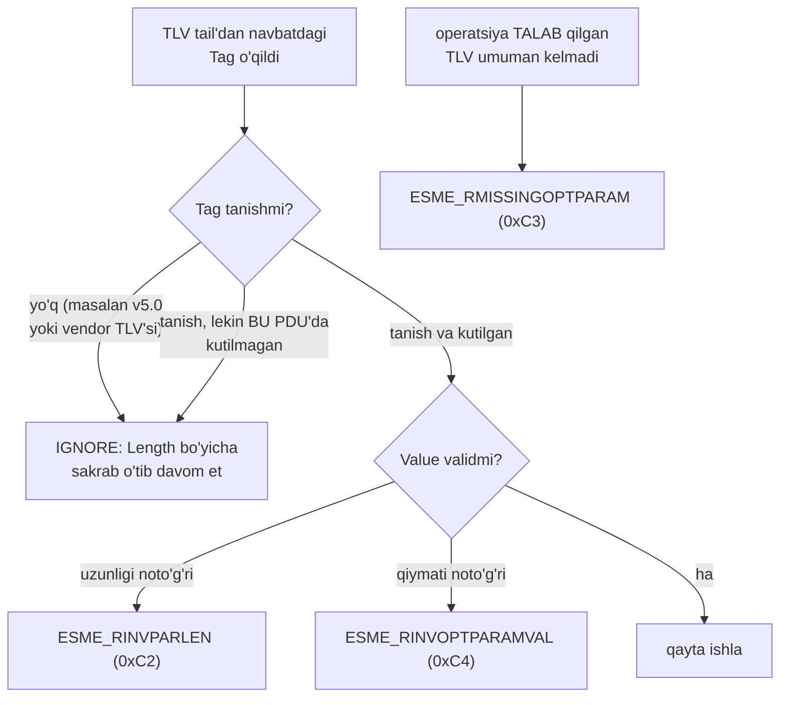

# 3-bob. Optional parameter'lar: TLV

> **Bu bobda:** SMPP kengayuvchanligining asosi — Tag-Length-Value mexanizmi: format, to'liq tag jadvali, forward/backward compatibility qoidalari va `tlv` package. Bobdan keyin istalgan PDU'ning "dumini" o'qiy olasiz va notanish tag'ga to'g'ri munosabatda bo'lasiz.

2-bobda PDU'ning skeletini ko'rdik: header + mandatory field'lar. Lekin 1999-yilda protokol mualliflari oldida klassik dilemma turgan edi: mandatory field'lar qat'iy tartibda va HAR DOIM simda bo'ladi — demak yangi field qo'shish eski implementatsiyalarni sindiradi. Vendorlar esa har biri o'z qo'shimchasini xohlaydi. v3.4'ning javobi — **optional parameter'lar**: PDU'ning mandatory qismidan keyin, har biri o'z identifikatori va uzunligi bilan yuradigan, xohlagancha qo'shsa bo'ladigan bloklar. Aynan shu mexanizm v3.4'ni 27 yil yashatdi: message_payload, sar_* segmentlash, DLR'ning message_state'i — hammasi TLV (3.4'da kiritilgan barcha "yangi" imkoniyatlar shu eshikdan kirgan).

## 3.1 Format: Tag, Length, Value

TLV strukturasi uch qismdan iborat (v3.4 §3.2.4.1, Table 3-4):

| Qism | Hajmi | Ma'nosi |
|---|---|---|
| **Tag** | 2 oktet, Integer (big-endian) | Parameter identifikatori (Table 5-7) |
| **Length** | 2 oktet, Integer | **FAQAT Value uzunligi** — Tag va Length'ning o'zi KIRMAYDI |
| **Value** | Length oktet | Ma'lumot; formati tag'ga bog'liq (Integer / C-Octet String / struktura) |

Joylashuv qoidalari (§3.2.4): TLV'lar **har doim PDU oxirida**, mandatory field'lardan keyin turadi; o'zaro tartibi esa **erkin** — spec hech qanday tartib talab qilmaydi. Demak decoder mandatory qismni o'qib bo'lgach, frame oxirigacha qolgan hamma baytni "TLV tail" deb qabul qiladi va ketma-ket parse qiladi.

E'tibor bering: "PDU'da TLV bormi va tail qancha" degan savolga alohida hisoblagich yo'q — javob 2-bobdagi framing'dan chiqadi. `command_length` butun PDU'ni aytadi, mandatory qism qancha yegani parse jarayonida ma'lum bo'ladi; ayirmasi — TLV tail. Tail bo'sh bo'lsa (aksariyat oddiy PDU'larda shunday) — TLV yo'q, bu mutlaqo normal holat. Shu bog'liqlikning teskari tomoni ham bor: agar mandatory qism parse'ida bitta bayt siljisangiz (masalan 2-bobdagi NULL terminator xatosi), "TLV tail" deb butunlay noto'g'ri baytlarni o'qiy boshlaysiz — TLV parse xatolari ko'pincha TLV'ning emas, undan OLDINGI qismning aybi.

> **⚠ OGOHLANTIRISH — Length "jami" EMAS.** TLV bilan ishlashdagi klassik xato: Length'ni Tag+Length+Value yig'indisi (ya'ni value+4) deb hisoblash yoki o'qish. Bunday encoder yozgan tomon har TLV'da 4 ta ortiqcha bayt "va'da qiladi", decoder esa keyingi TLV'ning Tag'ini value'ning davomi deb yeb yuboradi — natijada butun tail siljiydi va ko'pincha "TLV tail o'rtasida uzilgan" ko'rinishdagi xato chiqadi. Length = faqat Value oktetlari. Nuqta.

Bitta real misolni baytma-bayt o'qiymiz. Bu — tipik DLR deliver_sm'ining TLV tail'i (DLR konteksti 9-bobda; hozir bizga baytlar muhim), bizning golden testda aynan shu baytlar turibdi:

```
00 1E 00 07 37 46 33 41 39 42 00
04 27 00 01 02
04 23 00 03 03 00 00
```

| Baytlar | Qism | O'qilishi |
|---|---|---|
| `00 1E` | Tag | 0x001E = receipted_message_id |
| `00 07` | Length | value 7 oktet |
| `37 46 33 41 39 42 00` | Value | C-Octet String "7F3A9B" + NULL (2-bobdagi submit_sm_resp'dan tanish id!) |
| `04 27` | Tag | 0x0427 = message_state |
| `00 01` | Length | value 1 oktet |
| `02` | Value | 2 = DELIVERED (§5.2.28) |
| `04 23` | Tag | 0x0423 = network_error_code |
| `00 03` | Length | value 3 oktet |
| `03 00 00` | Value | struktura: network type 3 (GSM) + kod 0x0000 |

Uchta TLV, uch xil value formati: C-Octet String, 1-oktetlik Integer va 3-oktetlik ichki struktura. Tag'ni bilmasangiz value'ni TALQIN qila olmaysiz (baytlari o'qiladi, ma'nosi yo'q) — lekin uzunligini Length aytib turgani uchun USTIDAN SAKRAB o'ta olasiz. Shu kichik detal — butun forward compatibility'ning kaliti (3.4-bo'lim).

## 3.2 Tag fazosi: Table 5-7

Tag'lar 2 oktet, demak 65536 ta mumkin qiymat. v3.4 ularni bloklarga bo'ladi (§5.3.2):

| Diapazon | Kimniki |
|---|---|
| 0x0001–0x00FF, 0x0200–0x05FF, 0x1200–0x13FF | SMPP-defined (Table 5-7) |
| **0x1400–0x3FFF** | **SMSC vendor-specific** — operatorlar o'z TLV'lari uchun |
| qolganlari | Reserved |

v3.4 Table 5-7'dagi barcha SMPP-defined tag'lar (texnologiya ustuni — TLV qaysi tarmoq turi uchun kiritilgani; Generic = hammasiga):

| TLV | Tag | Texnologiya |
|---|---|---|
| dest_addr_subunit | 0x0005 | GSM |
| dest_network_type | 0x0006 | Generic |
| dest_bearer_type | 0x0007 | Generic |
| dest_telematics_id | 0x0008 | GSM |
| source_addr_subunit | 0x000D | GSM |
| source_network_type | 0x000E | Generic |
| source_bearer_type | 0x000F | Generic |
| source_telematics_id | 0x0010 | GSM |
| qos_time_to_live | 0x0017 | Generic |
| payload_type | 0x0019 | Generic |
| additional_status_info_text | 0x001D | Generic |
| receipted_message_id | 0x001E | Generic |
| ms_msg_wait_facilities | 0x0030 | GSM |
| privacy_indicator | 0x0201 | CDMA/TDMA |
| source_subaddress | 0x0202 | CDMA/TDMA |
| dest_subaddress | 0x0203 | CDMA/TDMA |
| user_message_reference | 0x0204 | Generic |
| user_response_code | 0x0205 | CDMA/TDMA |
| source_port | 0x020A | Generic |
| destination_port | 0x020B | Generic |
| sar_msg_ref_num | 0x020C | Generic |
| language_indicator | 0x020D | CDMA/TDMA |
| sar_total_segments | 0x020E | Generic |
| sar_segment_seqnum | 0x020F | Generic |
| sc_interface_version | 0x0210 | Generic |
| callback_num_pres_ind | 0x0302 | TDMA |
| callback_num_atag | 0x0303 | TDMA |
| number_of_messages | 0x0304 | CDMA |
| callback_num | 0x0381 | GSM/CDMA/TDMA |
| dpf_result | 0x0420 | Generic |
| set_dpf | 0x0421 | Generic |
| ms_availability_status | 0x0422 | Generic |
| network_error_code | 0x0423 | Generic |
| message_payload | 0x0424 | Generic |
| delivery_failure_reason | 0x0425 | Generic |
| more_messages_to_send | 0x0426 | GSM |
| message_state | 0x0427 | Generic |
| ussd_service_op | 0x0501 | GSM (USSD) |
| display_time | 0x1201 | CDMA/TDMA |
| sms_signal | 0x1203 | TDMA |
| ms_validity | 0x1204 | CDMA/TDMA |
| alert_on_message_delivery | 0x130C | CDMA |
| its_reply_type | 0x1380 | CDMA |
| its_session_info | 0x1383 | CDMA |

44 ta tag — lekin qo'rqmang: amalda muntazam uchraydigani o'ntacha (message_payload, sar_* uchligi, receipted_message_id, message_state, network_error_code, sc_interface_version, user_message_reference, source/destination_port), qolganlari CDMA/TDMA merosxo'rligi. Har TLV'ning value formati va PDU'lardagi o'rni kerak bo'lganda §5.3.2'dan qaraladi; tez-tez ishlatiladiganlarini tegishli boblarda chuqur o'rganamiz (sar_* — 8-bob, DLR uchligi — 9-bob).

Uchta TLV alohida e'tiborga loyiq — value formatlari "oddiy son yoki string" qolipiga tushmaydi:

- **alert_on_message_delivery (0x130C)** — value uzunligi **0**. Bu TLV "qiymat" tashimaydi: uning BORLIGINING o'zi signal ("xabar yetkazilganda MS'ni alert qil"). Simda 4 bayt: `13 0C 00 00`. Codec zero-length'ni to'g'ri qabul qilishi shart — bu chekka holatga alohida test yozamiz.
- **network_error_code (0x0423)** — value 3 oktetlik ICHKI STRUKTURA: 1 oktet network type (1=ANSI-136, 2=IS-95, 3=GSM) + 2 oktet tarmoq xato kodi (§5.3.2.31). "TLV value doim yaxlit primitiv" degan faraz shu yerda sinadi.
- **qos_time_to_live (0x0017)** — value 4 oktetlik Integer: xabarning yashash muddati sekundlarda (§5.3.2.9). Vaqt field'i, lekin 7-bobdagi 17-belgili matn formatida emas — TLV'lar o'z formatini o'zi tanlaydi.

Va yana bir nozik qoida: **bitta tag PDU'da takrorlanishi mumkin**. callback_num "a number of instances may be included" (§4.4.1 izohi; callback_num_atag ham unga mos ravishda) — demak TLV to'plamini `map[Tag]Value` qilib saqlash ma'lumot yo'qotadi. Bizning codec slice ishlatadi — simdagi tartib va takrorlar saqlanadi.

## 3.3 Forward compatibility: notanish narsaga to'g'ri munosabat

TLV mexanizmining asl kuchi — §3.3'dagi qoidalar to'plami. Ular "kelajakdan kelgan PDU" bilan nima qilishni belgilaydi:



So'z bilan (v3.4 §3.3):

1. **Notanish tag → jim ignore.** Xato EMAS, log'da warning ham shart emas — Length bo'yicha sakrab o'tib, qolganini parse qilishda davom etiladi. Aynan shu qoida tufayli v3.4 client v5.0 server bilan ishlayveradi: v5.0'ning yangi TLV'lari (masalan congestion_state) e'tiborsiz qoladi, xolos.
2. **Tanish, lekin shu operatsiyada kutilmagan tag → ignore.** Masalan deliver_sm ichida kelib qolgan sc_interface_version.
3. **Reserved qiymat → default bor bo'lsa default, bo'lmasa ignore.**
4. Xatolar faqat REAL muammoda: kutilgan TLV yo'q → **ESME_RMISSINGOPTPARAM (0xC3)**; value uzunligi noto'g'ri → **ESME_RINVPARLEN (0xC2)**; qiymati noto'g'ri → **ESME_RINVOPTPARAMVAL (0xC4)**; TLV tail'ning o'zi buzilgan (truncated) → **ESME_RINVOPTPARSTREAM (0xC0)**; bu operatsiyada TLV'ga umuman ruxsat yo'q → **ESME_ROPTPARNOTALLWD (0xC1)**.

"Ignore" so'zini codec darajasida to'g'ri talqin qilish muhim: **ignore ≠ yo'qotish**. Bizning `Decode` notanish tag'ni ham to'plamda saqlaydi — TALQIN qilmaydi, lekin baytlarini asrab qo'yadi. Bu uch sababga ko'ra to'g'ri: proxy/gateway stsenariysida PDU'ni o'zgartirmasdan uzatish kerak bo'ladi; debugging'da "SMSC nima yubordi" degan savolga to'liq javob kerak; va vendor TLV'lari (keyingi xatboshi) aynan "notanish" bo'lib keladi — ularni caller o'zi taniydi.

**Vendor TLV'lar** — 0x1400–0x3FFF bloki. Operator hujjatida "bizga 0x1401'da billing kodi yuboring" kabi talab uchrasa, bu shu blok. Vendor TLV design qilishda o'ziga xos savol: value formatini nima qilish? Javob mashqlarda — hozircha qoida: vendor TLV ham xuddi shu Tag-Length-Value qolipida yuradi, "maxsus framing" o'ylab topilmaydi.

## 3.4 Backward compatibility: v3.3 dunyosi bilan yashash

Teskari yo'nalish — §3.4: v3.4 entity eski v3.3 partner bilan qanday ishlaydi. TLV v3.3'da YO'Q, shuning uchun qoidalar TLV atrofida aylanadi:

- SMSC ESME versiyasini bind'dagi `interface_version` field'idan biladi: qiymat < 0x34 bo'lsa — **bu client'ga TLV yuborilmaydi** (u tail'ni parse qila olmaydi — v3.3 parser uchun TLV baytlari "PDU oxiridagi tushunarsiz axlat").
- ESME esa SMSC versiyasini bind resp'dagi **sc_interface_version TLV'sidan** biladi (0x0210, value 1 oktet: 0x34). Nozik nuqta: **bu TLV kelmasa, ESME "SMSC TLV'ni qo'llamaydi" deb hisoblashi kerak** — ya'ni "javobda TLV yo'qligi"ning o'zi ma'lumot.
- v3.3 bilan ishlashda message_id **8 oktetdan oshmaydi** (v3.4'ning max 65'iga qarama-qarshi) — eski client bilan integratsiyada id bufferlarini shu chegara bilan tekshirish kerak.

Amalda bugun v3.3 partner kamdan-kam uchraydi, lekin bu qoidalar bizga 4-bobda kerak: bind_resp parser'i sc_interface_version'ni o'qiydi va session "TLV mumkinmi" flagini saqlaydi.

## 3.5 Kod: `tlv` package

Milestone: mustaqil `code/tlv/` package — Tag konstantalar, Encode/Decode, tipli helper'lar. PDU codec'lariga (4-bobdan boshlab) tayyor tail-parser bo'lib xizmat qiladi.

Har doimgidek testdan boshlaymiz — 3.1'dagi golden tail aynan shu baytlar bilan qotiriladi (`code/tlv/tlv_test.go`):

```go
// goldenDLRTailHex — tipik DLR deliver_sm'ning TLV tail'i (9-bobda to'liq
// kontekstda ko'ramiz): receipted_message_id "7F3A9B" + message_state=2
// (DELIVERED) + network_error_code GSM/0.
const goldenDLRTailHex = `
00 1E 00 07 37 46 33 41 39 42 00
04 27 00 01 02
04 23 00 03 03 00 00`

func TestEncodeGoldenTail(t *testing.T) {
	var b bytes.Buffer
	err := Encode(&b, []TLV{
		CString(ReceiptedMessageID, "7F3A9B"),
		U8(MessageState, 2),
		{Tag: NetworkErrorCode, Value: []byte{0x03, 0x00, 0x00}},
	})
	if err != nil {
		t.Fatalf("Encode xatosi: %v", err)
	}
	want := mustHex(t, goldenDLRTailHex)
	if !bytes.Equal(b.Bytes(), want) {
		t.Errorf("Encode = % X,\nkutilgan % X", b.Bytes(), want)
	}
}
```

Yadro tiplar va Decode (`code/tlv/tlv.go`):

```go
// TLV — bitta optional parameter. Value nil yoki bo'sh bo'lishi mumkin
// (zero-length TLV — masalan alert_on_message_delivery, §5.3.2.41).
type TLV struct {
	Tag   Tag
	Value []byte
}

// Decode PDU'ning TLV tail'ini (mandatory qismdan keyingi BARCHA baytlar)
// parse qiladi. Notanish tag'lar ham SAQLANADI (forward compatibility, §3.3):
// tashlab yuborish caller ixtiyorida, codec ma'lumot yo'qotmaydi.
func Decode(data []byte) ([]TLV, error) {
	var tlvs []TLV
	for off := 0; off < len(data); {
		if len(data)-off < 4 {
			return nil, fmt.Errorf("%w: %d oktet qoldi, Tag+Length uchun 4 kerak", ErrTruncated, len(data)-off)
		}
		tag := Tag(uint16(data[off])<<8 | uint16(data[off+1]))
		length := int(uint16(data[off+2])<<8 | uint16(data[off+3]))
		off += 4
		if len(data)-off < length {
			return nil, fmt.Errorf("%w: %s Length=%d, qolgan baytlar %d", ErrTruncated, tag, length, len(data)-off)
		}
		// Value nusxalanadi: frame buffer'i qayta ishlatilsa TLV yashab qolsin.
		value := make([]byte, length)
		copy(value, data[off:off+length])
		off += length
		tlvs = append(tlvs, TLV{Tag: tag, Value: value})
	}
	return tlvs, nil
}
```

Ikki tekshiruv — ikki xil "truncated" holat: Tag+Length'ning o'zi chala kelgani va Length va'da qilgan value'ning yetmay qolgani. Ikkisi ham `ErrTruncated`'ga o'raladi (protokol javobi darajasida bu ESME_RINVOPTPARSTREAM bo'ladi — 11-bobda ulanadi). E'tibor bering: `length` ni tekshirmasdan `data[off:off+length]` qilsak, buzuq Length bilan slice panic olardik — 2-bobdagi "kelgan songa ishonma" printsipi shu yerda ham.

Value talqini — tipli helper'lar (`code/tlv/values.go`). Eng qizig'i C-Octet String helper'i, chunki bu yerda spec bilan amaliyot ajralib turadi:

```go
// CStringValue C-Octet String value (masalan receipted_message_id, §5.3.2.12).
// Tolerant o'qish: spec NULL terminator talab qiladi, lekin ayrim SMSC'lar
// TLV value'da terminatorsiz yuboradi — bor bo'lsa olib tashlanadi, yo'q
// bo'lsa ham xato emas. Ichki NULL esa har doim xato.
func (t TLV) CStringValue() (string, error) {
	v := t.Value
	if i := bytes.IndexByte(v, 0x00); i >= 0 {
		if i != len(v)-1 {
			return "", fmt.Errorf("tlv: %s value ichida NULL bayt (indeks %d)", t.Tag, i)
		}
		v = v[:i]
	}
	return string(v), nil
}
```

Nega tolerant? Mandatory field'dagi C-Octet String'da NULL YO'QLIGI halokat edi (2-bob) — terminatorsiz keyingi field qayerdan boshlanishini bilib bo'lmaydi. TLV'da esa chegarani Length allaqachon aytib turibdi — NULL bu yerda ma'lumot tashimaydi, faqat rasm-rusum. Shu sabab uni yo'qligini xato qilish real SMSC'lar bilan ishlashni buzadi, bor joyda esa olib tashlanadi. Postel printsipi ("be liberal in what you accept") — lekin ANIQ chegara bilan: ichki NULL baribir rad etiladi, chunki u "ikkita qiymat yopishib qolgan"ning belgisi.

Encode tomonda simmetrik konstruktorlar bor: `U8/U16/U32` (big-endian Integer'lar), `CString` (NULL bilan — spec shakli), `Empty` (zero-length) — golden testda ko'rdingiz. `Find(tlvs, tag)` esa birinchi mosini qaytaradi; takrorlanadigan tag'lar uchun to'plam to'g'ridan-to'g'ri aylanib chiqiladi (test: `TestFindAndDuplicates` — ikkita callback_num saqlanib qolishini qotiradi).

```
$ cd code && go vet ./... && go test ./... -race
ok      smpp/pdu
ok      smpp/tlv
```

> **⚠ Amaliyotda.** Forward compatibility qoidasini hamma ham o'qimagan. Kannel (mashhur ochiq SMS gateway) mailing-list'ida klassik case bor: SMSC deliver_sm ichida sc_interface_version (0x0210) yuborgan — 2-qoida bo'yicha bu shunchaki ignore qilinishi kerak, lekin Kannel versiyasi buni `ERROR: SMPP: Unknown TLV(0x0210,0x0001,34)` deb log'ga qichqirgan (yaxshiyamki PDU'ni rad etmasdan). Ikki saboq: (1) o'z kodingizda notanish/kutilmagan TLV — hech qachon error-level hodisa emas; (2) qarshi tomonning log'idagi bunday xabarlar sizning PDU'ingiz buzuqligini ANGLATMAYDI. Va aksincha ehtiyot bo'ling: ayrim qattiq server'lar kutilmagan TLV'ga ESME_ROPTPARNOTALLWD (0xC1) qaytaradi — spec ruxsat bergan xulq emas, lekin uchraydi; bunday operator bilan "minimal TLV" rejimida ishlanadi.

## Xulosa

TLV — SMPP'ning kengayish tili: 2 oktet Tag + 2 oktet Length (faqat value!) + Value, hammasi PDU dumida, tartib erkin, takror mumkin. Notanish narsa — xato emas, ignore; xato — faqat kutilgan TLV yo'qligi yoki buzuq value. Vendor'lar 0x1400–0x3FFF blokida o'ynaydi. Kodimizda endi to'liq tail-codec bor: keyingi bobda bind PDU'larini yozganimizda ular tail'ini shu package chaynaydi, sc_interface_version esa session'ning "TLV mumkinmi" qarorini beradi.

**Takrorlash savollari** (javoblar matnda bor — o'zingizni tekshiring):

1. `04 24 00 05 ...` bilan boshlangan TLV'ning value'si necha oktet va bu qaysi parameter?
2. Notanish tag bilan tanish-lekin-kutilmagan tag'ga munosabatda qanday farq bor?
3. Nega TLV to'plamini map'da saqlash xato? Qaysi tag bilan misol keltiring.
4. sc_interface_version bind resp'da kelmasa ESME qanday xulosa chiqarishi kerak?
5. TLV ichidagi C-Octet String'da NULL yo'qligi nega halokat emas, mandatory field'da esa halokat?
6. ESME_RINVPARLEN bilan ESME_RINVOPTPARSTREAM qaysi vaziyatlarda qaytadi?

**Mashqlar:** [exercises/03-tlv.md](../exercises/03-tlv.md) — uch TLV'li tail'ni qo'lda parse qilish (biri notanish), message_payload va sm_length=0 qoidasi, vendor TLV design.

---

**Oldingi bob:** [2-bob. PDU anatomiyasi](02-pdu-anatomiyasi.md) · **Keyingi bob:** 4-bob. Bind va session lifecycle (`04-bind-session.md`) — birinchi to'liq PDU codec'lar, state machine va timer'lar.

## Manbalar

- [SMPP v3.4 spec, Issue 1.2](../resources/SMPP_v3_4_Issue1_2.pdf) — §3.2.4 (TLV format), §3.3–3.4 (forward/backward compatibility), §5.3 (Table 5-7 va har TLV ta'rifi)
- Tashqi: NowSMS "SMPP TLV" (Length semantikasi amaliy tomondan), Kannel mailing-list "Unknown TLV(0x0210...)" case'i, Wireshark packet-smpp.c dissector (alert_on_message_delivery zero-length talqini) — izohlangan ro'yxat: [resources/links.md](../resources/links.md)
