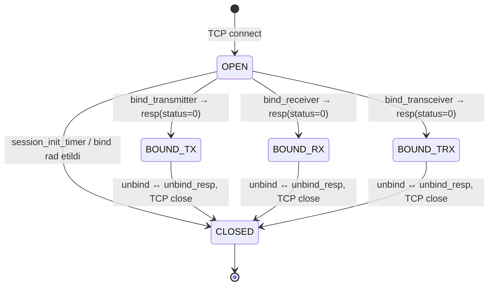
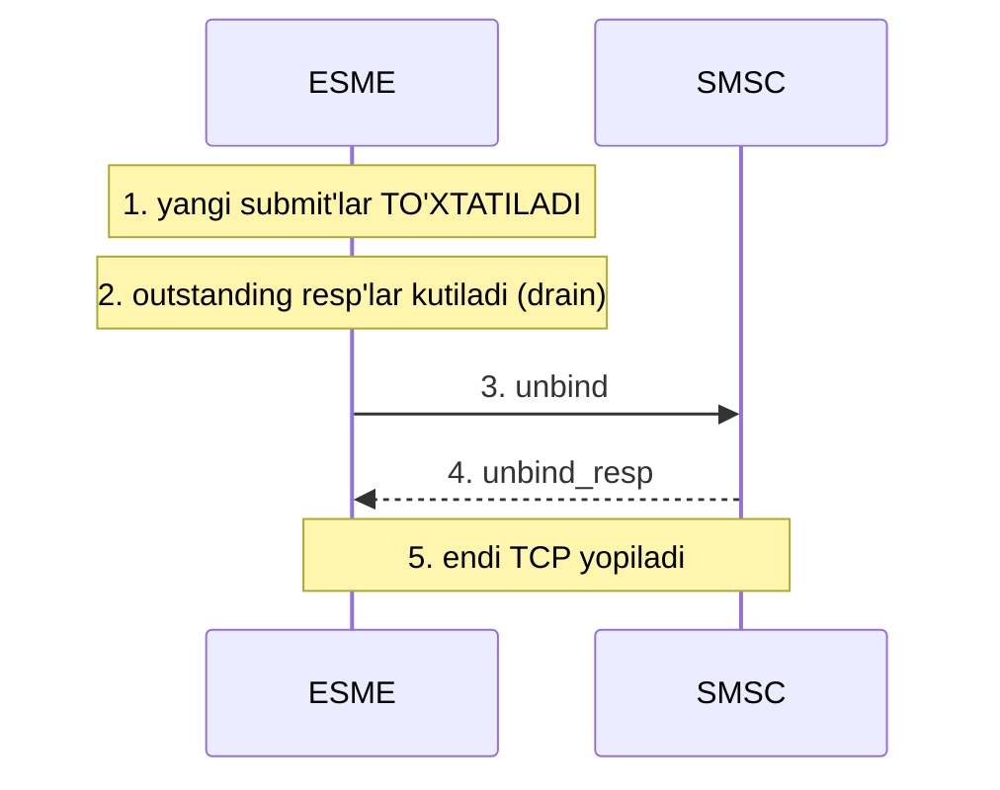
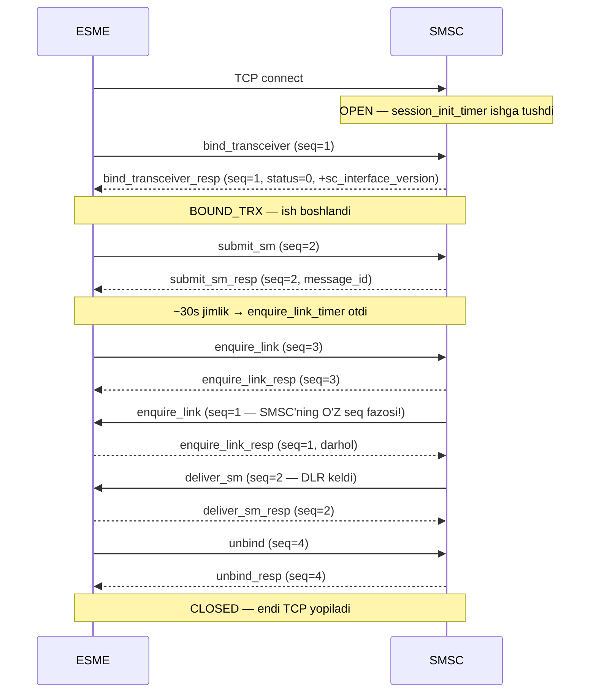

# 4-bob. Bind va session lifecycle

> **Bu bobda:** sessiyaning to'liq hayoti — TCP connect'dan unbind'gacha: uch xil bind, 5 holatli state machine, to'rt timer va ular atrofidagi barcha noziklar. Kodda birinchi TO'LIQ PDU codec'lar (bind oilasi), state jadvali va javob qaytaradigan minimal test-server paydo bo'ladi.

Oldingi ikki bobda "gapirish qoidalarini" o'rgandik: frame'lar, header'lar, TLV'lar. Endi birinchi haqiqiy SUHBATga o'tamiz. SMPP'da suhbat har doim bir xil boshlanadi: ESME TCP connection ochadi va **bind** qiladi — protokol darajasidagi login. Bind muvaffaqiyatli bo'lgunicha hech qanday submit_sm, deliver_sm yoki boshqa ish PDU'si yurmaydi. Va suhbat (yaxshi kunda) bir xil tugaydi: **unbind** — xayrlashuv, undan keyingina TCP yopiladi. Bu ikki nuqta orasida sessiya yashaydi: holatlar almashadi, timer'lar hisoblaydi, enquire_link'lar yuradi. Shu hayot siklini bilmasdan yozilgan client production'da eng ko'p uchraydigan ikki kasallikka chalinadi: "sessiya sababsiz uzilyapti" va "ulanyapmiz-u, hech narsa yubora olmayapmiz".

## 4.1 Transport: TCP va port haqida bir og'iz

SMPP session ESME tomonidan TCP connection ochish bilan boshlanadi (v3.4 §2.2). Port haqida esa bilib qo'yishga arziydigan qiziq fakt bor: IANA SMPP uchun **2775/TCP** portini ro'yxatga olgan, LEKIN **v3.4 spec'da port raqami UMUMAN tilga olinmagan** — §2.4 faqat "TCP/IP or X.25" deydi, xolos. Portning yozma tasdig'i faqat v5.0'da paydo bo'lgan (v5.0 §2.2: "IANA has standardised port 2775... However ports may vary across MC vendors and operators"). Amalda ham shunday: operator sizga 2775 emas, o'zi tanlagan ixtiyoriy portni beradi (ko'pincha bir nechta — har bind turi yoki mijoz uchun alohida). Xulosa: kodda port — doim konfiguratsiya, hech qachon konstanta emas.

## 4.2 Bind: uch turdagi login

Bind — SMSC'ga "men kimman va nima qilmoqchiman" deyish (v3.4 §4.1). "Nima qilmoqchiman"iga qarab uch PDU bor:

| PDU | Sessiya turi | Nima mumkin |
|---|---|---|
| `bind_transmitter` (TX) | faqat yuborish | submit_sm, query_sm, cancel_sm, replace_sm |
| `bind_receiver` (RX) | faqat qabul qilish | deliver_sm (MO xabarlar + DLR'lar) qabul qilish |
| `bind_transceiver` (TRX) | ikkalasi ham | to'liq to'plam bitta connection'da |

TX+RX juftligi tarixiy meros: v3.3'da TRX yo'q edi, yuborish va qabul qilish uchun **ikkita alohida TCP connection** ochib, har birida alohida bind qilinardi. v3.4'ning bind_transceiver'i buni bitta connection'ga jamladi — bugungi integratsiyalarning mutlaq ko'pchiligi TRX ishlatadi (1-bobda aytilgan Issue 1.2 errata'sini eslang: interface_version field'i bind_transceiver'ga aynan Issue 1.2'da qo'shilgan). Muhim fallback qoidasi (§4.1): SMSC transceiver'ni qo'llamasa, bind_transceiver'ga **"Invalid Command ID"** (ESME_RINVCMDID, 0x03) qaytaradi — client bunga TX/RX juftligiga qaytish bilan javob berishi kerak (va aksincha: faqat TRX biladigan server TX/RX'ni rad etishi mumkin).

Bugun TX+RX juftligini ataylab tanlashning ham o'z o'rinlari bor: ayrim operatorlar shartnomada aynan shu rejimni talab qiladi; ba'zi gateway'lar submit oqimi bilan DLR oqimini alohida connection'larga ajratib, biri ikkinchisining backpressure'idan ta'sirlanmasligini xohlaydi. Narxi — ikki barobar boshqaruv yuki: ikkita sessiya, ikkita enquire_link sikli, ikkita reconnect siyosati, va eng muhimi — ikkalasini ALOHIDA monitoring qilish majburiyati (4.9-bo'limdagi tuzoqqa qarang). Bizning client (13-bob) ikkala rejimni ham qo'llaydi, lekin default TRX bo'ladi.

interface_version field'i haqida ham kelishib olaylik, chunki u 3-bobdagi backward compatibility bilan bevosita bog'lanadi. Client sifatida biz HAR DOIM 0x34 yuboramiz. Server sifatida esa (14-bob) kelgan qiymatga qaraymiz: 0x34 — to'liq v3.4 muloqot; **0x00–0x33 — client v3.3 yoki undan eski** (§5.2.4), demak unga TLV yuborib BO'LMAYDI (§3.4) va message_id'lar 8 oktetdan oshmasligi kerak. E'tibor bering: 2-bobdagi spec misolida interface_version=0x00 edi — o'sha misoldagi client'ni server "v3.3" deb qabul qilishi kerak bo'lardi. Teskari yo'nalishdagi versiya ma'lumoti esa resp'dagi sc_interface_version TLV'da keladi — quyida.

Uchala bind PDU'ning body'si **bir xil 7 field** (§4.1.1/4.1.3/4.1.5, Table 4-1/4-3/4-5):

| # | Field | Type / max (NULL bilan) | Semantikasi |
|---|---|---|---|
| 1 | `system_id` | C-Octet String, 16 | ESME login'i; operator beradi (§5.2.1) |
| 2 | `password` | C-Octet String, 9 | Parol — ha, **maksimal 8 belgi** (§5.2.2); SMSC ruxsat bersa NULL |
| 3 | `system_type` | C-Octet String, 13 | ESME kategoriyasi ("VMS", "OTA"); ko'p SMSC talab qilmaydi → bo'sh (§5.2.3) |
| 4 | `interface_version` | Integer, 1 | ESME qo'llagan versiya: **0x34** = v3.4; 0x00–0x33 = v3.3 yoki eski (§5.2.4) |
| 5 | `addr_ton` | Integer, 1 | ESME manzillari uchun Type of Number; noma'lum → 0 (§5.2.5) |
| 6 | `addr_npi` | Integer, 1 | Numbering Plan Indicator; noma'lum → 0 (§5.2.6) |
| 7 | `address_range` | C-Octet String, 41 | RX/TRX sessiya xizmat qiladigan manzillar to'plami — **UNIX regex** notatsiyasida (§5.2.7, Appendix A) |

address_range — spec'ning eng ekzotik burchagi: `^9989` (prefiks), `[13579]$` (oxirgi raqam toq) kabi UNIX regular expression'lar nazarda tutilgan (Appendix A). TON/NPI ta'riflari bilan 6-bobda chuqur tanishamiz — bind kontekstida ikkalasi deyarli hamisha 0 ketadi.

> **⚠ Amaliyotda.** address_range deyarli har doim bo'sh (NULL) yuboriladi va ko'p SMSC'lar uni routing uchun umuman ishlatmaydi; ba'zilari esa kutilmagan qiymatga bind'ni rad etadi. Qoida: operator hujjatida aniq talab bo'lmasa — NULL qoldiring. Va password'ning 8 belgilik limiti haqida: bu 1999-yil merosi, "kuchli parol" bu yerda bo'lmaydi — himoya qatlamlari boshqa yerda (IP whitelist, TLS, VPN — 16-bob).

### bind_*_resp: javob va uning nozikliklari

Muvaffaqiyatli javob body'sida bitta mandatory field — SMSC'ning o'z `system_id`'si — va bitta ixtiyoriy TLV — `sc_interface_version` (0x0210, SMSC'ning versiyasi) bor (§4.1.2/4.1.4/4.1.6). 3-bobdan eslang: bu TLV'ning YO'QLIGI ham ma'lumot — kelmasa "SMSC TLV qo'llamaydi" deb hisoblanadi (§3.4) va sessiyada TLV ishlatilmaydi.

Eng muhim parser qoidasi (§4.1.2 Note): **command_status ≠ 0 bo'lsa, resp'da body UMUMAN qaytarilmaydi** — faqat 16 oktetlik header keladi. "Xato bo'ldi, lekin system_id'ni baribir o'qiy" degan kod xatoli resp'da stream'dan mavjud bo'lmagan baytlarni qidirib adashadi. Bizning `DecodeBindResp` status'ni tekshirib, nolga teng bo'lmasa body'ga umuman tegmaydi.

## 4.3 Golden hex: bind_transceiver va uning javobi

Qo'lda bitta to'liq bind yig'amiz — bu baytlar golden testda qotirilgan. Client: system_id "uzsms", password "s3cr3t", qolgani minimal. Simga ketadigan 34 (0x22) oktet:

```
00 00 00 22 00 00 00 09 00 00 00 00 00 00 00 01
75 7A 73 6D 73 00 73 33 63 72 33 74 00 00 34 00
00 00
```

| Offset | Baytlar | Field | O'qilishi |
|---|---|---|---|
| 0–3 | `00 00 00 22` | command_length | 34 oktet |
| 4–7 | `00 00 00 09` | command_id | bind_transceiver |
| 8–11 | `00 00 00 00` | command_status | request → 0 |
| 12–15 | `00 00 00 01` | sequence_number | 1 — sessiyaning birinchi PDU'si |
| 16–21 | `75 7A 73 6D 73 00` | system_id | "uzsms" + NULL |
| 22–28 | `73 33 63 72 33 74 00` | password | "s3cr3t" + NULL — ochiq matnda! |
| 29 | `00` | system_type | bo'sh |
| 30 | `34` | interface_version | 0x34 = v3.4 |
| 31 | `00` | addr_ton | Unknown |
| 32 | `00` | addr_npi | Unknown |
| 33 | `00` | address_range | bo'sh |

SMSC'ning muvaffaqiyatli javobi — 30 (0x1E) oktet, 3-bob bilimlarimiz to'liq ishga tushadi:

```
00 00 00 1E 80 00 00 09 00 00 00 00 00 00 00 01
54 45 53 54 53 4D 53 43 00 02 10 00 01 34
```

| Offset | Baytlar | Field | O'qilishi |
|---|---|---|---|
| 0–15 | `... 80 00 00 09 ... 00 00 00 01` | header | bind_transceiver_resp, status=0 (ESME_ROK), seq=1 — request'niki aynan |
| 16–24 | `54 45 53 54 53 4D 53 43 00` | system_id | "TESTSMSC" + NULL |
| 25–29 | `02 10 00 01 34` | TLV | sc_interface_version = 0x34: "men ham v3.4'man, TLV mumkin" |

Shu javob kelgan ondan sessiya **BOUND_TRX** holatida — ish boshlanadi.

Dump'dagi 22–28-oktetlarga yana bir qarang: parol simda ochiq ASCII bo'lib turibdi — tcpdump ushlagan har kim o'qiy oladi (1-bobdagi ogohlantirishning "mana isboti"). Shu sababli real integratsiyada bind credential'lari yolg'iz himoya EMAS: operator odatda birinchi navbatda "qaysi IP'lardan ulanasiz?" deb so'raydi va faqat whitelist'dagi manzillardan kelgan TCP'ni qabul qiladi — noto'g'ri IP'dan urinish ko'pincha bind xatosigacha ham yetmaydi, connection'ning o'zi ochilmaydi (yoki ochilib darhol uziladi). Debugging'da buni bilish vaqt tejaydi: "TCP connect bo'lyapti-yu bind RBINDFAIL qaytaryapti" bilan "connect'ning o'zi timeout" — ikki BOSHQA muammo, ikkinchisida parolni tekshirib o'tirish befoyda. Transport darajasidagi haqiqiy himoya (TLS) 16-bobda.

## 4.4 Session state machine: 5 holat

v3.4 §2.2 sessiyaga **aynan 5 nomlangan holat** beradi:



- **OPEN** — TCP ulangan, bind hali yo'q. Bu holatda faqat bind oilasi (va outbind) yuradi.
- **BOUND_TX / BOUND_RX / BOUND_TRX** — ishchi holatlar; qaysi PDU joizligi quyidagi jadvalda.
- **CLOSED** — unbind qilingan va ulanish uzilgan.

⚠ Muhim tarixiy aniqlik: library'larda (jsmpp va boshqalar) 7 holatli enum'lar uchraydi — **UNBOUND** va **OUTBOUND** bilan. Bular **v5.0 tushunchalari** (v5.0 §2.3); v3.4'da bunday holatlar YO'Q. v3.4 hujjatiga tayanib ishlayotganda 5 holat yetarli va to'g'ri — bizning `session.State` shunday.

Har PDU qaysi holatlarda yurishini Table 2-1 (§2.3) beradi. Asosiy qatorlar:

| PDU | OPEN | BOUND_TX | BOUND_RX | BOUND_TRX |
|---|---|---|---|---|
| bind_* / outbind | ✓ | — | — | — |
| submit_sm, submit_multi | — | ✓ | — | ✓ |
| deliver_sm, alert_notification | — | — | ✓ | ✓ |
| data_sm | — | ✓ | ✓ | ✓ |
| query_sm, cancel_sm | — | ✓ | — | ✓ |
| **replace_sm** | — | **✓ FAQAT** | — | **—** |
| unbind, enquire_link, generic_nack | — | ✓ | ✓ | ✓ |

Ikkita qiziq nozik: **replace_sm faqat BOUND_TX'da** — TRX'da ham yo'q (Table 2-1'ning kam biladigan qatori; nega bunday ekani spec'da izohlanmagan — 10-bobda qaytamiz); **data_sm esa yagona message PDU'si** — uchala bound holatda, ikkala yo'nalishda ham yuradi. Server tomoni bu jadvalni ENFORCE qiladi: BOUND_RX sessiyadan submit_sm kelsa javob **ESME_RINVBNDSTS** (0x04, "Incorrect BIND Status for given command") bo'ladi — buni 14-bobda mock SMSC'ga o'rgatamiz, jadvalning o'zi esa hozir `session.CanSend`'ga tushadi.

State machine'ga bog'liq yana bitta amaliy savol: OPEN holatda bind yuborildi, resp hali kelmadi — bu oraliqda client nima qila oladi? Formal javob: hech narsa (Table 2-1: OPEN'da faqat bind oilasi). Ya'ni bind — **sinxron to'siq**: to'g'ri client bind_resp status=0 kelmagunicha birorta submit navbatga qo'ymaydi. Sabab shunchaki qoida emas: resp'gacha siz sessiya QAYSI holatga o'tishini ham bilmaysiz (SMSC TRX o'rniga xato qaytarishi mumkin), sc_interface_version'ni ham olmagansiz (TLV ishlatish mumkinmi noma'lum). Bizning client (13-bob) `Bind(ctx, mode)` metodini resp kelgunicha bloklaydi — bu SMPP'dagi kam sonli "sinxron bo'lishi shart" nuqtalardan biri.

Bir system_id bilan NECHTA sessiya ochish mumkin degan savol ham shu yerga tegishli. Spec cheklamaydi — bu operator siyosati: ko'p SMSC'lar har login'ga "max N bind" limiti qo'yadi (ko'pincha N=1..5). Limitdan oshgan urinish **ESME_RALYBND** (0x05) bilan qaytadi. Bu ikki vaziyatda uchraydi: (1) throughput uchun ataylab parallel sessiyalar ochayotganda — operator bilan limitni kelishmasdan qilingan bo'lsa; (2) ancha xavfliroq varianti — client reconnect qildi-yu, ESKI sessiya server tomonda hali o'lik deb topilmagan (TCP half-open yoki inactivity timer hali otmagan): yangi bind RALYBND yeydi, client yana uriladi, va server eski sessiyani tozalagunicha bir necha daqiqa "hech kim ayblamaydigan" xato davom etadi. Davosi — reconnect'dan oldin imkon qadar toza unbind qilish va RALYBND'ga ham backoff bilan javob berish.

## 4.5 Outbind: teskari qo'ng'iroq

Bitta ekzotik holat: SMSC'da ESME uchun xabarlar to'planib qolgan, lekin ESME hozir receiver session ochmagan. SMSC nima qiladi? **Outbind** (§2.2.1, §4.1.7): SMSC'ning O'ZI ESME'ga TCP connection ochadi va `outbind` PDU yuboradi (body: system_id + password — bu safar parol SMSC'ni ESME'ga tanitadi, teskari autentifikatsiya). ESME rozi bo'lsa javoban **bind_receiver** yuboradi va sessiya oddiy RX sessiyaga aylanadi; rozi bo'lmasa — hech qanday javob PDU'si YO'Q, shunchaki TCP'ni uzadi. outbind'ning *_resp'i mavjud emas (1-bobdagi "javobsiz ikki PDU"ning biri).

Amalda outbind juda kam ishlatiladi — doimiy TRX session bor joyda kerak emas, ko'p zamonaviy stack'lar uni umuman implement qilmaydi. Kam ishlatilishining yana bir sababi tarmoq geometriyasida: outbind ESME'ning PUBLIC, ochiq turgan TCP portini talab qiladi — SMSC unga ulana olishi kerak. Bugungi ESME'lar deyarli hamisha NAT/firewall ortidagi client'lar, "menga tashqaridan operator ulanadi" degan model esa alohida tarmoq kelishuvi va xavfsizlik teshigi degani. Shunga qaramay biz codec'ini yozamiz (protokolni TO'LIQ bilish uchun) — session engine'da esa faqat qabul tomonini qo'llaymiz. Mashqlarda outbind oqimini o'zingiz diagramma qilasiz.

## 4.6 Unbind: xayrlashuvning to'g'ri tartibi

Unbind — "logoff" (§4.2). Ikki qoida: **har ikki tomon ham** boshlashi mumkin (SMSC ham restart oldidan unbind yuboradi!) va ikkala PDU ham header-only. To'g'ri ketma-ketlik:



Eng ko'p buziladigan joyi — 2- va 5-qadamlar. Drain'siz unbind yuborilsa, javobini kutayotgan submit_sm'laringiz havoda qoladi (SMSC ularga javob berishi ham, bermasligi ham mumkin — endi siz "ketyapman" degansiz). unbind_resp'ni kutmasdan TCP'ni uzish esa qarshi tomonda "g'ayritabiiy uzilish" sifatida ko'rinadi va ayrim SMSC'larda hisobingizga minus yozadi. To'liq graceful shutdown 12-bobda `Session.Close`'ga kodlanadi; skelet-serverimiz esa hozirdanoq to'g'ri tartibni ko'rsatadi: unbind_resp yozILADI, KEYIN connection yopiladi.

Teskari stsenariyni ham unutmang: unbind SIZGA ham kelishi mumkin — SMSC restart, texnik ishlar yoki siyosat o'zgarishi oldidan o'z client'lariga unbind yuboradi. Client'ning to'g'ri javobi: darhol unbind_resp qaytarish (bahslashish yo'q — bu request emas, xabar), yangi submit'larni to'xtatish va TCP yopilishini kutish, so'ng odatiy backoff bilan qayta ulanish. "SMSC'dan unbind keldi" ni xato deb log'lash — keng tarqalgan chalkashlik: bu xato emas, protokolning normal xayrlashuvi.

## 4.7 enquire_link: yurak urishi

TCP'ning yoqimsiz xususiyati: uzilgan kabel haqida hech kim sizga xabar bermaydi — connection shunchaki jim bo'lib qoladi (half-open holat). SMPP'ning davosi — **enquire_link** (§4.11): header-only "tirikmisan?" so'rovi, javobi enquire_link_resp. Qoidalari:

- **Ikkala tomon ham yuboradi** — client ham, server ham o'z intervalida.
- **Javob majburiy va DARHOL** — kelgan enquire_link'ka enquire_link_resp qaytarish sessiyaning tiriklik sharti. Kechiksa yoki kelmasa, qarshi tomon sessiyani o'lik deb topib uzadi.
- Spec'ning qiziq jumlasi: enquire_link'ka javob sifatida **har qanday valid PDU ham** tiriklik belgisi bo'la oladi — real traffic o'zi heartbeat. Amaliy xulosa: jonli traffic paytida enquire_link shart emas, u JIMLIK davri uchun.

"O'limni aniqlash" mexanikasi ikki timer'ning hamkorligi: enquire_link_timer so'rov YUBORISHNI hal qiladi, response_timer esa javob KELMAGANINI. To'liq zanjir: 30s jimlik → enquire_link ketdi → response_timer ishga tushdi (masalan 10s) → javob yo'q → endi sessiya rasman shubhali: eng to'g'ri harakat TCP'ni uzib, backoff bilan qayta ulanish. Aynan shu zanjir half-open connection'larni (kabel uzilgan, NAT yozuvi o'lgan, peer panic bo'lgan — TCP esa jim) ushlaydigan YAGONA L7 mexanizm: TCP'ning o'z keepalive'i boshqa qatlamda ishlaydi va odatda juda kech otadi (bu taqqoslashga 12-bobda qaytamiz).

> **⚠ Amaliyotda.** Integratsiyalardagi 1-raqamli xato: kutubxona enquire_link YUBORISHNI avtomatlashtiradi-yu, server yuborgan enquire_link'ka JAVOB berishni unutadi (yoki javob berish read-loop'ning band bo'lgani uchun kechikadi — 12-bobda tahlil qilinadigan production kaskadi). Natija: 30–60 soniya jimlikdan keyin SMSC sessiyani uzadi va log'da "sababsiz disconnect" ko'rinadi. Bizning arxitekturada enquire_link_resp read path'ning o'zida, navbatsiz qaytariladi (12-bob); skelet-server hozircha shu xulqni namoyish qiladi.

## 4.8 Timer'lar: to'rt soat mexanizmi

Session hayotini to'rtta konfiguratsiyalanadigan timer boshqaradi (§2.9, §7.2 Table 7-2):

| Timer | Kimda aktiv | Muddati o'tganda (spec matni) |
|---|---|---|
| `session_init_timer` | SMSC'da bo'lishi SHART | TCP ulangach bind kelmasa — "The network connection should be terminated" |
| `enquire_link_timer` | ikkala tomonda | operatsiyalar orasidagi jimlik oshsa — enquire_link yuboriladi |
| `inactivity_timer` | ikkala tomonda | umuman tranzaksiyasiz maksimal davr o'tsa — "The SMPP session should be dropped" |
| `response_timer` | ikkala tomonda | request'ga javob kelmasa — request "yetib bormagan" hisoblanadi, operatsiyaga mos chora |

> **⚠ OGOHLANTIRISH — spec'da QIYMATLAR YO'Q.** v3.4 §7.2 ochiq aytadi: "Definition of the various timer values is outside the scope of this SMPP Protocol Specification" va "All timers should be configurable". Internetda yuradigan "SMPP default 30 sekund" degan gaplar — spec fakti EMAS, vendor konventsiyalari. Implementatsiyada to'rttala timer ham config'dan olinishi shart.

Spec qiymat bermasa, amalda nima ishlatiladi? Industriya konventsiyalari (vendor hujjatlaridan — SparkPost, Inetlab va boshqalar): enquire_link interval 30–60s (ko'p operatorlar aynan shu diapazonni talab qiladi), inactivity 2–5 minut, response 10–60s. Va foydali munosabat qoidasi: **response_timer < enquire_link_timer < inactivity_timer** — javob kutish eng qisqa, heartbeat undan uzun, "sessiyani o'ldirish" eng uzun. Bir real operator TZ'sidan misol (bu BIR operatorning shartnoma talabi, spec emas): enquire_link har 30 soniyada, javobsiz qolsa 60 soniyadan keyin reconnect, ikkinchi urinish 120 soniyadan keyin.

session_init_timer alohida e'tiborga loyiq: u **server tomonning himoyasi** — TCP ochib, bind yubormasdan o'tirgan (ehtimol zararli) client'lar resurs band qilmasligi uchun. Mock SMSC'miz 14-bobda shu timer bilan to'ldiriladi.

> **⚠ Amaliyotda — enquire_link inactivity'ni har doim ham "to'ydirmaydi".** Mantiqan enquire_link ham traffic, demak inactivity_timer'ni reset qilishi kerak-ku? Ayrim implementatsiyalar (masalan Inetlab server hujjatida ochiq yozilgan) faqat "haqiqiy" operatsiyalarni (submit/deliver) activity deb hisoblaydi — faqat heartbeat bilan tirik turgan sessiya baribir inactivity bo'yicha uziladi. Bu server uchun mantiqiy siyosat ham: "30 daqiqadan beri bitta ham xabar yubormagan client nega joy band qilib turibdi?" Integratsiyada buni oldindan bilib bo'lmaydi — shartnoma/hujjatdan aniqlashtiring; client kodida esa "uzoq jimlikdan keyin sessiya uzilishi normal stsenariy" deb qabul qilib, xotirjam reconnect qiling.

### Sessiya hayoti — yaxlit misol

Bobning hamma qismini bitta vaqt chizig'iga teramiz. Tipik qisqa sessiya (enquire_link intervali 30s deb olingan — konventsiya, spec emas):



Diagrammadan uchta kuzatuv: **(1)** har tomon O'Z sequence hisobini yuritadi — SMSC'ning seq=1'i bizning seq=1 bilan hech qanday aloqada emas (2-bob mashqidagi savol endi rasmda); **(2)** enquire_link IKKI tomondan yuradi va har biriga javob majburiy; **(3)** DLR (deliver_sm) so'ralmagan paytda, SMSC tashabbusi bilan keladi — client'ning read loop'i har doim tayyor turishi kerak (bu 12-bobning markaziy dizayn talabi).

## 4.9 Bind xatolari va rebind-loop tuzog'i

Bind rad etilishi mumkin — resp'dagi tipik status'lar: **ESME_RINVSYSID** (0x0F — system_id noto'g'ri), **ESME_RINVPASWD** (0x0E — parol noto'g'ri), **ESME_RALYBND** (0x05 — bu login allaqachon bound, limit oshdi), **ESME_RBINDFAIL** (0x0D — umumiy bind xatosi: IP whitelist'da yo'qlik, hisob o'chirilgan...). To'liq tasnif 11-bobda; hozir bitta jangovar qoida:

> **⚠ Amaliyotda — rebind loop.** Bind rad etildi → client DARHOL qayta urinadi → yana rad → yana urinish... Sekundiga o'nlab bind urinishi SMSC tomonidan flood/hujum deb baholanadi va IP darajasida ban bilan tugashi mumkin — endi TO'G'RI credential bilan ham ulana olmaysiz. Qoida: bind xatosiga ham xuddi network xatosiga qaralganday **exponential backoff** qo'llanadi (1s → 2s → 4s → ... max); RINVSYSID/RINVPASWD kabi "permanent" xatolarda esa avtomatik qayta urinishning o'zi shubhali — bu config xatosi, odam aralashuvi kerak. TX+RX juftligida ishlagandagi qo'shimcha tuzoq: transmitter tirik, receiver o'lik bo'lsa, submit'lar ketaveradi-yu DLR'lar jimgina yo'qoladi — ikkala sessiya ham ALOHIDA monitoring qilinishi shart (TRX'ning yana bir afzalligi).

Buzilgan header'li PDU'ga generic_nack qaytarilishini 2-bobdan bilamiz; bind bosqichidagi versiyasi ham bor — OPEN holatda kelgan notanish command_id'ga skelet-serverimiz generic_nack (ESME_RINVCMDID) qaytaradi. generic_nack semantikasining to'liq tahlili — 11-bobda.

## 4.10 Kod: bind codec, state jadvali va birinchi server

Milestone to'rt qismli: `pdu/bind.go` (bind oilasi + outbind), `pdu/simple.go` (header-only PDU'lar), `session/state.go` (5 holat + Table 2-1) va `smsc/testserver.go` (javob qaytaradigan skelet).

### Bind codec

4.3-bo'limdagi hex — testda (`code/pdu/bind_test.go`):

```go
// goldenBindTRXHex — qo'lda yig'ilgan bind_transceiver (34 = 0x22 oktet):
// system_id "uzsms", password "s3cr3t", system_type bo'sh,
// interface_version 0x34, addr_ton/npi 0, address_range bo'sh, seq=1.
const goldenBindTRXHex = `
00 00 00 22 00 00 00 09 00 00 00 00 00 00 00 01
75 7A 73 6D 73 00
73 33 63 72 33 74 00
00
34 00 00
00`
```

Struct — uchala bind uchun BITTA, farq faqat `Mode`'da (`code/pdu/bind.go`):

```go
// Bind — bind_transmitter/bind_receiver/bind_transceiver'ning umumiy tanasi:
// uchala PDU'ning body'si bir xil 7 field (v3.4 §4.1, Table 4-1/4-3/4-5),
// faqat command_id farq qiladi — u Mode'da.
type Bind struct {
	Mode             CommandID // CmdBindTransmitter, CmdBindReceiver yoki CmdBindTransceiver
	SystemID         string    // ESME identifikatori (§5.2.1)
	Password         string    // autentifikatsiya; bo'sh bo'lishi mumkin (§5.2.2)
	SystemType       string    // ESME kategoriyasi ("VMS"...); odatda bo'sh (§5.2.3)
	InterfaceVersion uint8     // ESME qo'llagan SMPP versiyasi (§5.2.4)
	AddrTON          uint8     // §5.2.5; noma'lum bo'lsa 0
	AddrNPI          uint8     // §5.2.6; noma'lum bo'lsa 0
	AddressRange     string    // UNIX regex, RX/TRX routing uchun; odatda bo'sh (§5.2.7)
}
```

`Encode` 2-bob helper'lari bilan body yig'adi (writeCString'lar max'larni NULL bilan tekshiradi — 16 belgilik system_id kompilyatsiyadan emas, aniq xato bilan qaytadi), so'ng `encodePDU` universal yig'uvchisi header qo'shadi:

```go
// encodePDU header + body'ni yaxlit wire frame'ga yig'adi. Barcha PDU
// encoder'lari shu yo'ldan o'tadi — command_length hisoblash bitta joyda.
func encodePDU(id CommandID, status, seq uint32, body []byte) []byte {
	h := EncodeHeader(Header{
		Length:   uint32(HeaderSize + len(body)),
		ID:       id,
		Status:   status,
		Sequence: seq,
	})
	frame := make([]byte, 0, HeaderSize+len(body))
	frame = append(frame, h[:]...)
	frame = append(frame, body...)
	return frame
}
```

`BindResp`'ning eng muhim joyi — §4.1.2 Note'ning ikkala yo'nalishda kodlanishi:

```go
// Encode to'liq wire frame yasaydi. Status != 0 bo'lsa faqat header ketadi.
func (br BindResp) Encode(seq uint32) ([]byte, error) {
	if !isBindResp(br.Mode) {
		return nil, fmt.Errorf("pdu: %s bind response emas", br.Mode)
	}
	if br.Status != 0 {
		return encodePDU(br.Mode, br.Status, seq, nil), nil
	}
	// ... muvaffaqiyatda: system_id + (bor bo'lsa) sc_interface_version TLV
```

va decode tomonda `if h.Status != 0 { return br, h, nil }` — xatoli resp'da body'ga urinish ham yo'q. TLV tail esa 3-bob package'i bilan o'qiladi: `tlv.Decode(rest)` + `tlv.Find(tlvs, tlv.ScInterfaceVersion)`; topilsa `HasSCVersion=true`. Testlar orasida alohida `TestBindRespWithoutTLV` bor — "TLV'siz javob = TLV qo'llamaydigan SMSC" holati unutilmasligi uchun.

### State jadvali kodda

`session` package'i ochildi (`code/session/state.go`). 5 holat — oddiy enum, Table 2-1 esa bitmask jadvali:

```go
// allowedStates — v3.4 Table 2-1 (§2.3): har PDU qaysi session state'da
// yuborilishi mumkin. Yo'nalish (ESME'danmi, SMSC'danmi) bu jadvalga kirmaydi —
// uni server tomon alohida tekshiradi (14-bob): masalan submit_sm faqat
// ESME'dan keladi, lekin state jihatdan BOUND_TX/TRX talab qilinadi.
var allowedStates = map[pdu.CommandID]stateMask{
	pdu.CmdBindTransmitter: inOpen,
	// ...
	pdu.CmdSubmitSM:        inTX | inTRX,
	pdu.CmdDeliverSM:       inRX | inTRX,
	pdu.CmdDataSM:          anyBound, // yagona message PDU'si: uchala bound state'da ham
	pdu.CmdReplaceSM:       inTX,     // Table 2-1: FAQAT BOUND_TX — TRX'da YO'Q!
	pdu.CmdEnquireLink:     anyBound,
	// ...
}

// CanSend id'ni s state'da yuborish Table 2-1 bo'yicha joizligini aytadi.
// Notanish command_id uchun har doim false.
func CanSend(id pdu.CommandID, s State) bool {
	return allowedStates[id]&s.mask() != 0
}
```

Testi — jadvalning o'zi qayta yozilgan table-driven ro'yxat: har PDU uchun ruxsatli holatlar sanaladi va QOLGAN BARCHA holatlarda `false` ekani tekshiriladi (`TestCanSendTable`). Bunday "ikki tomonlama" tekshiruvsiz jadval testi yarim ishlaydi: yangi qator qo'shishda ortiqcha ruxsat berib qo'yish sezilmay qoladi.

### Birinchi server

`smsc/testserver.go` — 30 qatorli protokol suhbatdoshi: accept qiladi, frame o'qiydi, to'rt narsani biladi:

```go
// respond kelgan PDU header'iga qarab javob frame tuzadi.
func (s *TestServer) respond(h pdu.Header) (resp []byte, closeAfter bool) {
	switch h.ID {
	case pdu.CmdBindTransmitter, pdu.CmdBindReceiver, pdu.CmdBindTransceiver:
		br := pdu.BindResp{
			Mode:         h.ID.Resp(),
			SystemID:     s.SystemID,
			SCVersion:    pdu.InterfaceVersion34,
			HasSCVersion: true,
		}
		out, err := br.Encode(h.Sequence)
		if err != nil {
			return nil, true
		}
		return out, false
	case pdu.CmdEnquireLink:
		return pdu.EncodeEnquireLinkResp(h.Sequence), false
	case pdu.CmdUnbind:
		// unbind_resp'dan KEYIN yopiladi — §4.2 tartibi.
		return pdu.EncodeUnbindResp(0, h.Sequence), true
	default:
		// Skelet tanimagan har qanday PDU → generic_nack (§3.3, §4.3).
		return pdu.EncodeGenericNack(esmeRInvCmdID, h.Sequence), false
	}
}
```

E'tibor bering: `h.ID.Resp()` — 1-bobdagi bitta OR amali endi real serverda ishlayapti; har javobda `h.Sequence` aynan qaytariladi (2-bob qoidasi); unbind'da `closeAfter=true` — resp YOZILADI, keyin yopiladi. Integration testlar real TCP orqali yuradi (`net.Dial` → bind → resp tekshiruvi; unbind → resp → keyingi o'qish io.EOF).

Serverning concurrency skeleti ham e'tiborga loyiq, chunki 14-bob shu ustiga quriladi. `StartTestServer` listener ochib accept-loop goroutine'ini ishga tushiradi; har qabul qilingan connection O'Z goroutine'ida sinxron "o'qi → javob yoz" sikli bilan yashaydi. `sync.WaitGroup` hamma handler'ni hisobda tutadi — `Close()` avval listener'ni yopadi (accept-loop chiqadi), keyin `wg.Wait()` bilan barcha connection'lar tugashini kutadi: testlar tugaganda "orqada qolgan goroutine" degan chiqindi bo'lmaydi (`-race` va goroutine leak'ka qarshi gigiena). Sinxron sikl skelet uchun to'g'ri tanlov — javoblar kichik, ketma-ketlik deterministik; lekin real serverga yetmaydigan joyi ham ko'rinib turibdi: server O'Z TASHABBUSI bilan hech narsa yubora olmaydi (deliver_sm push qilish uchun yozish yo'li read-loop'dan ajralishi kerak) — bu aynan 12-bobdagi reader/writer arxitekturasining server tomondagi aksi bo'ladi. Auth yo'q, state enforcement yo'q, timer yo'q — bularning bari 14-bobning ishi; lekin shu skelet bilan 13-bobgacha client'ni sinab boramiz.

```
$ cd code && go vet ./... && go test ./... -race
ok      smpp/pdu
ok      smpp/session
ok      smpp/smsc
ok      smpp/tlv
```

To'rt package — protokolning "salomlashuv qatlami" to'liq testlangan.

## Xulosa

Sessiya hayoti endi to'liq ko'z oldimizda: TCP connect (port — konfiguratsiya!) → OPEN → bind (uch tur; body 7 field; parol max 8 belgi; resp'da status≠0 bo'lsa body yo'q) → BOUND_* (Table 2-1 nima mumkinligini aytadi; replace_sm faqat TX'da) → ish → unbind ↔ unbind_resp → TCP close → CLOSED. Yo'l-yo'lakay to'rt timer ishlaydi (spec qiymat bermaydi — hammasi config), enquire_link jimlikda yurak urishini ta'minlaydi, bind xatolariga backoff bilan javob beriladi. Kodda bind oilasining to'liq codec'i, Table 2-1 va javob qaytaradigan birinchi server bor — keyingi bobda nihoyat protokolning yuragiga o'tamiz: submit_sm va deliver_sm.

**Takrorlash savollari** (javoblar matnda bor — o'zingizni tekshiring):

1. bind_transceiver'ga ESME_RINVCMDID keldi. Bu nimani anglatadi va client nima qilishi kerak?
2. Nega parol maksimal 8 belgi va bu xavfsizlikka ta'sirini qanday yumshatiladi?
3. bind resp'da sc_interface_version TLV kelmadi. Sessiya davomida nimadan tiyilasiz?
4. v3.4'da nechta session holati bor? UNBOUND holati qayerdan kelib qolgan?
5. To'rt timer'ning qaysi biri FAQAT server tomonda majburiy va nimadan himoya qiladi?
6. Graceful shutdown'ning 5 qadamini tartib bilan ayting. 2-qadam tashlab ketilsa nima bo'ladi?
7. Rebind loop nima uchun oddiy "xato + retry"dan xavfliroq?

**Mashqlar:** [exercises/04-bind-session.md](../exercises/04-bind-session.md) — buzuq bind hex'ini tashxislash, BOUND_RX'dagi submit_sm stsenariysi (kod bilan) va outbind sekvensini chizish.

---

**Oldingi bob:** [3-bob. TLV](03-tlv.md) · **Keyingi bob:** [5-bob. submit_sm va deliver_sm](05-submit-deliver.md) — 17 mandatory field, esm_class bitlari va birinchi haqiqiy SMS baytlari.

## Manbalar

- [SMPP v3.4 spec, Issue 1.2](../resources/SMPP_v3_4_Issue1_2.pdf) — §2.2 (session, state'lar), §2.3 (Table 2-1), §2.9/§7.2 (timer'lar), §4.1 (bind oilasi), §4.1.7 (outbind), §4.2 (unbind), §4.11 (enquire_link), §5.2.1–5.2.7 (bind field'lari), Appendix A (address_range regex)
- [SMPP v5.0 spec](../resources/SMPP_v5.pdf) — §2.2 (2775 port yozma tasdig'i), §2.3 (7 holatli model — farq uchun)
- Tashqi: Inetlab "Keepalive/EnquireLink" (inactivity vs enquire_link semantikasi), SparkPost timer best-practices (response < enquire_link < inactivity), smpp.org error-kodlar ro'yxati (RINVCMDID fallback, RALYBND) — izohlangan ro'yxat: [resources/links.md](../resources/links.md)
