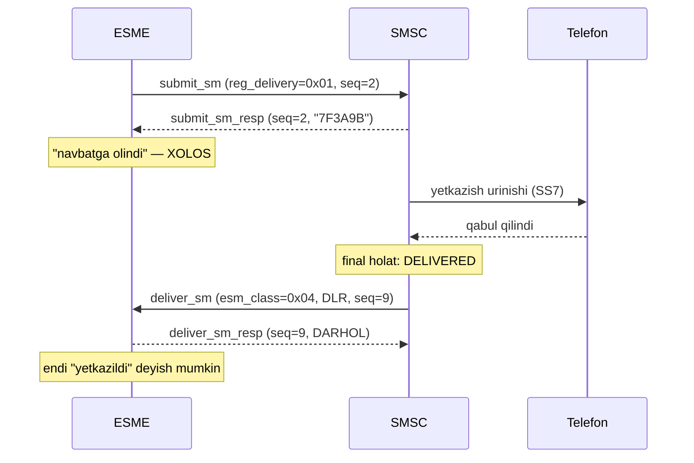

# 5-bob. submit_sm va deliver_sm: xabar oqimining yuragi

> **Bu bobda:** protokolning ikki markaziy PDU'si field-ma-field, bit-ma-bit: submit_sm'ning 17 mandatory field'i, esm_class va registered_delivery baytlarining ikkala yo'nalishdagi anatomiyasi, SMPP vaqt formati — va birinchi haqiqiy SMS baytlari golden testlarda. Bu bob kitobning markazi: qolgan hamma narsa yo shu ikki PDU'ga tayyorgarlik edi, yo ularning atrofidagi infratuzilma bo'ladi.

Sessiya bound. Endi asosiy ish: xabar yuborish va qabul qilish. SMS traffic'ining mutlaq ko'pchiligi ikki PDU orqali oqadi: **submit_sm** (ESME → SMSC: "shu raqamga shu matnni yetkaz") va **deliver_sm** (SMSC → ESME: MO xabar yoki delivery receipt). Bu ikkisini bilgan odam SMPP'ning 80 foizini biladi — va aynan shu ikkisida protokolning eng ko'p tuzoqlari yashiringan: bit-field'lar, "1 or 17" vaqtlar, opaque message_id'lar va bitta baytga yashiringan uch xil ma'no.

## 5.1 submit_sm: 17 mandatory field

submit_sm body'si — qat'iy tartibdagi 17 mandatory field (v3.4 §4.4.1, Table 4-10), ulardan keyin ixtiyoriy TLV tail. To'liq jadval (o'lchamlar NULL bilan):

| # | Field | Hajmi | Qisqa semantika |
|---|---|---|---|
| 1 | `service_type` | C-Octet, max 6 | SMS xizmat turi; bo'sh = SMSC default. Standart qiymatlar (§5.2.11): "CMT", "CPT", "VMN", "VMA", "WAP", "USSD" |
| 2 | `source_addr_ton` | 1 | Yuboruvchi TON (§5.2.5) |
| 3 | `source_addr_npi` | 1 | Yuboruvchi NPI (§5.2.6) |
| 4 | `source_addr` | C-Octet, max 21 | Yuboruvchi manzil; bo'sh bo'lishi mumkin (§5.2.8) |
| 5 | `dest_addr_ton` | 1 | Qabul qiluvchi TON |
| 6 | `dest_addr_npi` | 1 | Qabul qiluvchi NPI |
| 7 | `destination_addr` | C-Octet, max 21 | Qabul qiluvchi raqam — MT xabarning manzili (§5.2.9) |
| 8 | `esm_class` | 1 | Bit to'plami: mode + type + GSM flag'lar (5.2-bo'lim) |
| 9 | `protocol_id` | 1 | GSM'da TS 23.040 TP-PID; deyarli hamisha 0 (§5.2.13) |
| 10 | `priority_flag` | 1 | 0–3; talqini tarmoqqa bog'liq (§5.2.14) |
| 11 | `schedule_delivery_time` | 1 yoki 17 | Kechiktirilgan yuborish; bo'sh = darhol (§5.2.15) |
| 12 | `validity_period` | 1 yoki 17 | Xabarning yashash muddati; bo'sh = SMSC default (§5.2.16) |
| 13 | `registered_delivery` | 1 | DLR/ack so'rovi bitlari (5.3-bo'lim) |
| 14 | `replace_if_present_flag` | 1 | 0/1; oldingi xabarni almashtirish (§5.2.18) |
| 15 | `data_coding` | 1 | Matn encoding'i (7-bobda to'liq) (§5.2.19) |
| 16 | `sm_default_msg_id` | 1 | SMSC'dagi "canned" xabar indeksi: 1–254; 0 = ishlatilmaydi (§5.2.20) |
| 17 | `sm_length` + `short_message` | 1 + 0–254 | Matn baytlari; sm_length 0–254, **255 taqiqlangan** (§5.2.21–5.2.22) |

Bir nechta field alohida izohga loyiq:

**service_type** — dastlab qarashda foydasiz bo'sh string, lekin ikki yashirin xususiyati bor: SMSC billing/routing'da ishlatishi mumkin va **implicit replace** trigger'i bo'la oladi (§5.2.11): masalan VMA (Voice Mail Alerting) turida SMSC har abonentga faqat BITTA notification saqlaydi — yangi kelgani eskisini o'zi almashtiradi. Standart qiymatlarning ochilishi: CMT = Cellular Messaging (oddiy SMS), CPT = Cellular Paging, VMN = Voice Mail Notification, VMA = Voice Mail Alerting, WAP = Wireless Application Protocol, USSD. Bulardan tashqari operator o'z qiymatlarini ham belgilashi mumkin — lekin faqat kelishuv bo'yicha; kelishilmagan service_type'ga ESME_RINVSERTYP (0x15) kutish mumkin. Oddiy traffic'da bo'sh qoldiriladi.

**protocol_id** — GSM dunyosida TS 23.040'ning TP-PID field'iga to'g'ridan-to'g'ri map bo'ladi (§5.2.13); TDMA/CDMA MT xabarlarida umuman e'tiborga olinmaydi. 0'dan farqli qiymatlari ekzotik, lekin bilishga arziydi: TP-PID orqali "telematic interworking" (SMS→faks, SMS→email kabi eski xizmatlar), SIM data download va "replace short message type 1–7" mexanizmlari ishlagan. Bugungi amaliyotda 0x00 yuboriladi; ba'zi operator TZ'lari maxsus xizmatlar uchun aniq qiymat talab qilsa, hujjatida yozadi.

**schedule_delivery_time** — kechiktirilgan yuborish: SMSC xabarni saqlab, ko'rsatilgan vaqtda yetkazishni BOSHLAYDI. Marketing kampaniyalarida jozibali ko'rinadi ("ertaga 9:00 da chiqsin"), lekin ehtiyot bo'ling: bu store-and-forward'ning "sof SMSC" xususiyati — ko'p aggregator'lar uni QO'LLAMAYDI (qabul qilib ignore qiladi yoki xato qaytaradi), chunki ularning o'z queue'lari bor. Kechiktirishni odatda application darajasida qilish ishonchliroq. sm_default_msg_id ham shunga o'xshash taqdirli: SMSC'da oldindan saqlangan 1–254 raqamli "canned" (tayyor) xabarlardan birini yuborish mexanizmi — spec'da bor, real hayotda deyarli o'lik (operator SMSC'sida kim sizga xabar "saqlab qo'yadi"?); 0 = ishlatilmayapti.

**priority_flag** — 0–3, lekin ma'nosi tarmoqqa qarab farq qiladi (§5.2.14, Table 5-5): GSM'da 0 = non-priority, 1–3 = priority (farqi yo'q — hammasi "urgent"); ANSI-136'da Bulk/Normal/Urgent/Very Urgent; IS-95'da Normal/Interactive/Urgent/Emergency. Amaliy xulosa: oddiy MT traffic uchun 0 qoldiring — priority ko'p operatorlarda yo ignore, yo alohida shartnoma.

**replace_if_present_flag** (§5.2.18) — 1 qilib yuborilsa, SMSC shu **source + destination + service_type** uchligi mos kelgan avvalgi yetkazilmagan xabarni yangisi bilan almashtiradi. Mos xabar topilmasa — xato EMAS, oddiy yangi xabar sifatida qabul qilinadi. Bu 10-bobdagi replace_sm'dan tub farqi: replace_sm topilmasa XATO qaytaradi. OTP stsenariysida foydali: eski kod hali telefonga yetmagan bo'lsa, yangisi uni almashtiradi — abonent ikki kod olib chalkashmaydi.

**sm_length va short_message** — matn baytlari (encoding 7-bobda). Ikki qat'iy qoida: sm_length 254 dan oshmaydi (255 taqiqlangan — §5.2.21) va short_message bilan message_payload TLV **hech qachon birga emas** (§3.2.3; 3-bob mashqida yozgan validatsiyamiz endi codec ichida yashaydi). Yodda tuting: 254 — SMPP field limiti, havo interfeysi limiti esa 140 oktet (§3.2.3 note) — SMSC ortiqchasini kesishi yoki rad etishi mumkin; to'g'ri yo'l 8-bobdagi segmentlash.

> **⚠ Amaliyotda — source_addr bo'sh.** source'ni butunlay bo'sh yuborish mumkin (TON=0, NPI=0, addr="") — bunda SMSC hisobingizga bog'langan default sender'ni qo'yadi (§5.2.8 "If not known, set to NULL"). Ko'p aggregator'larda bu norma: sender baribir server tomonda shartnomaga qarab almashtiriladi (alphanumeric sender ro'yxatdan o'tgan bo'lishi kerak — 6-bob). Shuning uchun "yuborgan sender'im yetib bormadi" — ko'pincha bug emas, operator siyosati.

## 5.2 esm_class: bitta baytda uch qavat ma'no

esm_class — protokolning eng zich bayti (§5.2.12). Uch bit-guruh:

```
bit:    7   6   5   4   3   2   1   0
      [ GSM flag ][ Message Type ][Mode]
```

**ESME → SMSC yo'nalishida** (submit_sm, submit_multi, data_sm):

| Guruh | Bitlar | Qiymatlar |
|---|---|---|
| Messaging Mode | 1–0 | 00 = SMSC default (odatda store-and-forward); 01 = Datagram; 10 = Forward (Transaction); 11 = majburan Store-and-Forward |
| Message Type | 5–2 | 0000 = oddiy xabar; 0010 = ESME Delivery Ack; 0100 = ESME Manual/User Ack |
| GSM features | 7–6 | 01 = **UDHI** (short_message UDH bilan boshlanadi — 8-bob); 10 = Reply Path; 11 = ikkalasi |

Mode bitlari 1-bobdagi uch message mode'ni tanlaydi — bitta MUHIM istisno bilan: **submit_sm transaction mode'ni QO'LLAMAYDI** (§4.4 ochiq aytadi) — transaction faqat data_sm'ning imtiyozi (10-bob). Mode=00 qoldirsangiz klassik store-and-forward olasiz — traffic'ning 99 foizi shu.

Datagram mode (01) esa submit_sm'da RASMAN mumkin (§2.10.2 uni "tezkor port qilish uchun" submit_sm'ga ham ruxsat etadi), lekin nimadan voz kechayotganingizni aniq biling: SMSC xabarni SAQLAMAYDI, qayta urinish yo'q, registered_delivery ma'nosini yo'qotadi (DLR bo'lmaydi), scheduled delivery ishlamaydi. Foydasi — SMSC resurslarini tejash va minimal latency; qo'llanish sohasi — yo'qolsa achinarli bo'lmagan, juda katta hajmli notification oqimlari. Amaliy ogohlantirish: ko'p kommersial SMSC'lar mode bitlarini umuman e'tiborsiz qoldirib, hammasini store-and-forward qilib yuboradi — datagram "so'raganingiz" sizga kafolat emas. Mode=11 (majburan store-and-forward) esa "SMSC default'i datagram bo'lgan ekzotik holatda men baribir saqlashni xohlayman" degani — deyarli uchramaydi.

**SMSC → ESME yo'nalishida** (deliver_sm, data_sm) xuddi shu bayt BOSHQACHA o'qiladi:

| Guruh | Bitlar | Qiymatlar |
|---|---|---|
| Mode | 1–0 | **e'tiborga olinmaydi** |
| Message Type | 5–2 | 0000 = MO xabar; **0001 = SMSC Delivery Receipt (DLR!)**; 0010 = SME Delivery Ack; 0100 = SME Manual/User Ack; 0110 = Conversation Abort (Korean CDMA); 1000 = Intermediate Delivery Notification |
| GSM features | 7–6 | submit'dagi bilan bir xil (UDHI, Reply Path) |

Ikkala yo'nalishda ham uchraydigan qolgan tushunchalarni ochib qo'yaylik. **Reply Path** (bit 7) — GSM'ning "javob yo'li" xususiyati: yuboruvchi "menga javob xuddi shu SMSC orqali qaytsin" deb so'raydi; roaming va operatorlararo stsenariylarda kafolatsiz, zamonaviy traffic'da deyarli ishlatilmaydi — bilib qo'yish kifoya. **SME ack'lar** (submit yo'nalishida 0010/0100, deliver yo'nalishida ham bor) — DLR bilan adashtirilmasin: SMSC Delivery Receipt "telefonGA yetdi"ni aytadi, **SME Delivery Ack esa nomiga qaramay "foydalanuvchi xabarni O'QIDI"** degan application-darajali tasdiq (§2.11), Manual/User Ack — foydalanuvchining javob harakati (masalan interaktiv menyu tanlovi). Bular maxsus interaktiv xizmatlar dunyosi; oddiy A2P (application-to-person) traffic'da uchramaydi, lekin esm_class'da ko'rsangiz endi tanisiz.

Mana kelgan deliver_sm MO xabarmi yoki DLR'mi degan savolning javobi: **bit 5–2'ni ajratib qarash**. Va shu yerda sanoatdagi eng keng tarqalgan bug yotadi:

> **⚠ OGOHLANTIRISH — esm_class'ni butun bayt sifatida solishtirmang.** "DLR bo'lsa esm_class == 0x04" degan kod UDHI flag qo'shilib kelgan DLR'da (0x44 — masalan uzun xabar qismiga berilgan receipt) jimgina ishlamay qoladi: 0x44 != 0x04, DLR "MO xabar" deb qayta ishlanadi, korrelyatsiya buziladi. To'g'ri usul faqat bitta: `(esm_class >> 2) & 0x0F == 0x01`. Bizning `EsmClass.IsDeliveryReceipt()` aynan shunday ishlaydi va testda 0x44 case alohida qotirilgan.

Kod tomonda bu bo'lim `pdu/esm.go`'ga tushdi — `EsmClass` named type + mask/shift helper'lar:

```go
// MessageType bit 5-2'ni ajratadi. DIQQAT: aynan shu shift+mask to'g'ri usul;
// esm_class'ni butun bayt sifatida 0x04 bilan solishtirish UDHI (0x40)
// qo'shilib kelganda (0x44) DLR'ni o'tkazib yuboradi.
func (e EsmClass) MessageType() MessageType { return MessageType((e >> 2) & 0x0F) }

// IsDeliveryReceipt — deliver_sm DLR'mi (bit 5-2 == 0001).
func (e EsmClass) IsDeliveryReceipt() bool { return e.MessageType() == TypeDeliveryReceipt }
```

## 5.3 registered_delivery: DLR buyurtma qilish bayti

DLR o'z-o'zidan kelmaydi — uni submit_sm'ning registered_delivery baytida so'raysiz (§5.2.17):

```
bit:    7   6   5   4   3   2   1   0
      [ rezerv ] [IN][ SME ack ][ DLR ]
```

| Guruh | Bitlar | Qiymatlar |
|---|---|---|
| SMSC Delivery Receipt | 1–0 | 00 = so'ralmagan (default); 01 = final holatda DLR (muvaffaqiyat HAM, xato HAM); 10 = faqat XATO final holatida DLR; 11 = reserved |
| SME acknowledgement | 3–2 | 00 = yo'q; 01 = SME Delivery Ack; 10 = SME Manual/User Ack; 11 = ikkalasi |
| Intermediate Notification | 4 | 1 = oraliq statuslar ham so'raladi (SMSC qo'llasa) |

Eng tipik qiymat — **0x01**: "xabarning yakuniy taqdirini ayt". 0x02 esa trafikni tejaydigan variant: hammasi joyida bo'lsa jim, muammo bo'lsa DLR keladi.

> **⚠ SPEC ERRATUM — bit 4 yoki bit 5?** v3.4 §5.2.17'ning O'ZIDA ziddiyat bor: Intermediate Notification bo'limining sarlavha matni "bit 5" deydi, lekin jadvaldagi bit-pattern `xxx1xxxx` — bu **bit 4 (0x10)**. Qaysi biri to'g'ri? v5.0 xuddi shu patternni "bit 4" deb ataydi va real implementatsiyalar 0x10 ishlatadi — cloudhopper-smpp kutubxonasida buning tarixi ham bor: konstanta xato 0x20 qilib yozilgan, issue #54'da tuzatilgan. Bizning `Intermediate = 0x10` va bu testda qotirilgan. E'tibor bering, chalkashlikning ildizi chuqurroq: registered_delivery'da SO'RASH biti — 0x10 (bit 4), lekin kelgan intermediate notification'ning esm_class'idagi BELGISI — bit 5–2 = 1000 (0x20). Ikki boshqa bayt, ikki boshqa bit — adashtirish oson.

`pdu/esm.go`'dagi aksi:

```go
const (
	DLRNone        RegisteredDelivery = 0x00
	DLRFinal       RegisteredDelivery = 0x01 // muvaffaqiyat YOKI xato yakunida DLR
	DLRFailureOnly RegisteredDelivery = 0x02
	SMEDeliveryAck RegisteredDelivery = 0x04
	SMEManualAck   RegisteredDelivery = 0x08
	Intermediate   RegisteredDelivery = 0x10 // bit 4 — erratum izohi yuqorida
)
```

## 5.4 Vaqt formati: YYMMDDhhmmsstnnp

schedule_delivery_time va validity_period — "1 or 17" field'lar (2-bob): yo bitta NULL, yo 16 belgi + NULL. 16 belgining tuzilishi (§7.1.1): `YYMMDDhhmmsstnnp`, bunda `t` — sekundning o'ndan biri, `nn` — UTC'dan farq **chorak soatlarda** (00–48; Toshkent UTC+5 = 20 chorak), `p` — format belgisi:

- **`+` / `-` — absolute** (§7.1.1.1): aniq sana-vaqt + zona. Misol: `260717123045320+` = 2026-07-17 12:30:45.3, UTC+5 (20 chorak soat oldinda).
- **`R` — relative** (§7.1.1.2): SMSC'ning JORIY vaqtidan boshlab davr; t va nn e'tiborga olinmaydi ('0'/'00' yoziladi). Spec'ning o'z misoli: `020610233429000R` = hozirdan 2 yil 6 oy 10 kun 23:34:29 keyin. Amaliy klassika — bir kunlik validity: `000001000000000R`.

Uch nozik nuqta:

1. **Ikki xonali yil — Y2K merosi.** Appendix C sliding window beradi: 38–99 → 19xx, 00–37 → 20xx. 2038-yildan boshlab bu oyna yangi ma'noda "sinadi" (38 yana 1938'ga qaytadi) — spec buni ham ko'ra bilib, oynani konfiguratsiyalanadigan qilishni tavsiya qilgan.
2. **12 belgili variant.** SMSC javoblarida (masalan query_sm_resp'ning final_date'i) zona'siz `YYMMDDhhmmss` — SMSC lokal vaqti — uchraydi (§7.1.1 Note). Parser buni ham qabul qilishi kerak (bizniki qiladi, `HasOffset=false` bilan belgilaydi).
3. **Relative limitlar — operator siyosati.** Spec relative davrga limit qo'ymaydi (misolida 2 yil bor!), lekin §7.1.1.2 Note operator limitini tan oladi: oshgan validity'ni SMSC rad etishi (ESME_RINVEXPIRY, 0x62) **yoki jimgina o'z max'iga qisqartirishi** mumkin. Ikkinchisi xavfliroq: xato yo'q, lekin "7 kun yashaydi" deb yuborgan xabaringiz 24 soatda o'lmoqda — buni faqat DLR'lardagi EXPIRED oqimidan sezasiz. Ba'zi kutubxona hujjatlaridagi "relative max 30 kun" ham spec emas, konventsiya.

Ikkala vaqt field'ining o'zaro munosabati ham aniq bo'lsin: schedule_delivery_time "QACHON BOSHLASH", validity_period "QACHONGACHA URINISH". Ikkalasi mustaqil: 09:00 ga schedule qilingan, 24 soat validity'li xabar 09:00 dan ertasi 09:00 gacha yashaydi. validity < schedule bo'lib qolsa (xabar boshlanmasidan eskirsa) — mantiqsizlik; SMSC bunga ESME_RINVEXPIRY yoki RINVSCHED (0x61) qaytarishi kutiladi, lekin tekshirmaydiganlari ham bor — client tomonda validatsiya qilish arzonroq.

Kodda bu `pdu/time.go`: `EncodeAbsolute(t, loc)` (zona chorakka karrali ekanini tekshiradi), `EncodeRelative(d)` (Duration'ni kun/soat/minut/sekundga yoyadi; 100+ kun uchun `EncodeRelativeValue` bilan oy/yil komponentlari), `ParseTime(s)` (16 va 12 belgili variantlar, sliding window bilan). Spec misoli `020610233429000R` golden testda round-trip qilinadi.

## 5.5 Golden hex: submit_sm va uning javobi

Birinchi haqiqiy SMS'imizni yig'amiz: "Bank" (alphanumeric sender) 998901234567 raqamiga "Salom" yubormoqda, DLR so'ralgan. 54 (0x36) oktet:

```
00 00 00 36 00 00 00 04 00 00 00 00 00 00 00 02
00 05 00 42 61 6E 6B 00 01 01 39 39 38 39 30 31
32 33 34 35 36 37 00 00 00 00 00 00 01 00 00 00
05 53 61 6C 6F 6D
```

| Offset | Baytlar | Field | O'qilishi |
|---|---|---|---|
| 0–15 | `00 00 00 36` `00 00 00 04` `00 00 00 00` `00 00 00 02` | header | submit_sm, 54 oktet, status=0, seq=2 |
| 16 | `00` | service_type | bo'sh — SMSC default |
| 17–18 | `05 00` | source ton/npi | 5/0 = Alphanumeric (6-bob) |
| 19–23 | `42 61 6E 6B 00` | source_addr | "Bank" + NULL |
| 24–25 | `01 01` | dest ton/npi | 1/1 = International / E.164 |
| 26–38 | `39 39 ... 37 00` | destination_addr | "998901234567" + NULL |
| 39 | `00` | esm_class | default mode, oddiy xabar, flag'siz |
| 40 | `00` | protocol_id | GSM default |
| 41 | `00` | priority_flag | non-priority |
| 42 | `00` | schedule_delivery_time | bo'sh = darhol |
| 43 | `00` | validity_period | bo'sh = SMSC default |
| 44 | `01` | registered_delivery | **DLR so'raldi** (final holatda) |
| 45 | `00` | replace_if_present_flag | yo'q |
| 46 | `00` | data_coding | SMSC default alphabet (7-bobdagi katta savol!) |
| 47 | `00` | sm_default_msg_id | ishlatilmaydi |
| 48 | `05` | sm_length | 5 oktet |
| 49–53 | `53 61 6C 6F 6D` | short_message | ASCII "Salom" |

SMSC javobi — 2-bob mashqidan tanish baytlar (seq endi 2):

```
00 00 00 17 80 00 00 04 00 00 00 00 00 00 00 02
37 46 33 41 39 42 00
```

submit_sm_resp body = bitta `message_id` (C-Octet, max 65) — bizda "7F3A9B". Ikki temir qoida:

1. **message_id — OPAQUE** (§5.2.23): formati SMSC'ga bog'liq (hex ko'rinishli, decimal, UUID — har xil chiqadi). Uni songa aylantirmang, uzunligiga taxmin qilmang — faqat string sifatida saqlab, keyin query/cancel/replace va DLR korrelyatsiyasida handle sifatida ishlating. "Raqamga o'xshab turibdi-ku" degan yo'l 9-bobdagi hex/decimal balosiga olib boradi.
2. **status ≠ 0 → body YO'Q** — bind'dagi qoidaning aynan o'zi (§4.4.2). RTHROTTLED kelganda message_id qidirgan parser buziladi. Codec'imizda ikkala tomon ham qotirilgan (`TestSubmitSMRespErrorNoBody`).

Va eng muhim KONTSEPTUAL qoida — buni bitta gap qilib devorga osing: **submit_sm_resp status=0 "SMS yetkazildi" degani EMAS.** U faqat "SMSC xabarni NAVBATGA OLDI" degani. Telefon o'chiq bo'lishi, raqam mavjud bo'lmasligi, xabar validity tugab EXPIRED bo'lishi mumkin — bularning bari keyin, DLR orqali keladi. submit muvaffaqiyati bilan yetkazish muvaffaqiyatini adashtirish — SMS integratsiyalaridagi 1-raqamli mantiqiy xato (mashqlarda bunga alohida savol bor).

> **⚠ Amaliyotda — resp kelmasa nima bo'ladi?** Teskari holatni ham o'ylang: submit_sm yubordingiz, resp KELMADI (response_timer otdi yoki sessiya uzildi). Xabar yetib bordimi? **Bilib bo'lmaydi**: SMSC uni olgan-u resp yo'lda yo'qolgan bo'lishi ham (xabar ketadi!), umuman olmagan bo'lishi ham mumkin. Qayta yuborsangiz — abonentga IKKITA OTP kelish xavfi (at-least-once); yubormasangiz — umuman bormasligi mumkin (at-most-once). SMPP'da bu dilemmani protokol hal qilib bermaydi — 12-bobda reconnect strategiyasida ongli tanlov qilamiz. Hozircha qoida: pul/OTP kabi kritik xabarlarda duplicate'dan qochish uchun resp'siz qolgan submit'ni ko'r-ko'rona retry qilmang — DLR yoki query orqali taqdirini aniqlashga harakat qiling.



Diagramma orasidagi vaqtlarga e'tibor bering: submit_sm → resp odatda millisekundlar (SMSC'ning lokal qabul qilishi), resp → DLR esa sekundlardan SOATLARGACHA cho'zilishi mumkin (telefon o'chiq bo'lsa SMSC validity tugagunicha qayta urinadi). Shu asimmetriya ikki arxitektura qarorini majburlaydi: (1) submit oqimi async bo'lishi kerak — har xabarda DLR kutib o'tirib bo'lmaydi; 2-bobda ko'rgan sequence-korrelyatsiyali window aynan shuning uchun (12-bobda quramiz); (2) DLR'ni qabul qilish alohida, DOIMIY tayyor oqim — u submit'lardan mustaqil yashaydi.

Xabarning SMSC ichidagi hayot yo'li §5.2.28'ning message_state qiymatlari bilan tasvirlanadi (DLR TLV'sida va query_sm javobida shu raqamlar keladi): ENROUTE (1) — hali yo'lda, yagona no-final "tirik" holat; undan xabar beshta final holatning biriga o'tadi: **DELIVERED** (2) — yetdi; **EXPIRED** (3) — validity tugadi, yetmadi; **DELETED** (4) — SMSC/operator o'chirdi (masalan cancel_sm bilan); **UNDELIVERABLE** (5) — yetkazib BO'LMAYDI (raqam yo'q, bloklangan); **REJECTED** (8) — SMSC qabul qilib keyin rad etdi. ACCEPTED (6) esa oraliq-g'alati holat: "operator nomidan qo'lda qabul qilindi" — amalda ba'zi SMSC'lar uni "telefonga emas, lekin qabul markaziga topshirildi" ma'nosida yuboradi (9-bobda ACCEPTD bilan nima qilishni ko'ramiz). UNKNOWN (7) — SMSC ham bilmaydi. Bu raqamlar bilan Appendix B'dagi 7 belgilik stat matnlari birga yuradi: 2↔DELIVRD, 3↔EXPIRED, 5↔UNDELIV va hokazo.

## 5.6 deliver_sm: bitta format, ikki yuk

deliver_sm — submit_sm'ning **aynan o'zi**, format jihatdan (§4.6.1: "The deliver_sm PDU has the same format as the submit_sm PDU"). Farqlar semantikada:

- **Yo'nalish teskari:** SMSC → ESME; Table 2-1 bo'yicha faqat BOUND_RX/TRX'da.
- **Ishlatilmaydigan field'lar NULL bo'lishi SHART** (§4.6.1): schedule_delivery_time, validity_period, replace_if_present_flag, sm_default_msg_id — bular MT tushunchalari, kelayotgan xabarda ma'nosi yo'q. Bizning `DeliverSM.Encode` buni tekshiradi (mock SMSC spec buzmasin), decoder esa ataylab tolerant — spec buzgan real SMSC'dan kelganini ham o'qiy oladi.
- **Yuk turi esm_class'da:** bit 5–2 = 0000 bo'lsa bu abonentdan kelgan **MO xabar** (short_message = abonent yozgan matn); 0001 bo'lsa — **DLR** (short_message = receipt matni). Bitta PDU turi, ikki butunlay boshqa biznes-oqim — dispatch faqat `IsDeliveryReceipt()` orqali.
- **DLR'da manzillar ALMASHGAN:** DLR'ning source'i — original xabarning DESTINATION'i, dest'i — original SOURCE (§2.11). Mantiqiy: receipt "abonentdan sizga qaytib kelayotgan xabar".

To'liq DLR namunasi — 175 (0xAF) oktet, golden testdagi baytlar. Header + body'ning muhim qismlari izohi:

```
00 00 00 AF 00 00 00 05 00 00 00 00 00 00 00 09   <- deliver_sm, seq=9
00                                                  <- service_type: bo'sh
01 01 39 39 38 39 30 31 32 33 34 35 36 37 00       <- source: 1/1 "998901234567" (ALMASHGAN!)
05 00 42 61 6E 6B 00                                <- dest: 5/0 "Bank" (ALMASHGAN!)
04 00 00                                            <- esm_class=0x04 (DLR!), protocol, priority
00 00                                               <- schedule/validity: NULL (§4.6.1)
00 00 00 00                                         <- reg_dlv, replace, dc, sm_default: NULL
67                                                  <- sm_length = 103
69 64 3A 37 46 33 41 39 42 20 ...                   <- "id:7F3A9B sub:001 dlvrd:001
                                                        submit date:2607171205
                                                        done date:2607171206
                                                        stat:DELIVRD err:000 text:Salom"
00 1E 00 07 37 46 33 41 39 42 00                    <- TLV: receipted_message_id "7F3A9B"
04 27 00 01 02                                      <- TLV: message_state = 2 (DELIVERED)
04 23 00 03 03 00 00                                <- TLV: network_error_code GSM/0
```

short_message ichida — Appendix B uslubidagi receipt matni. `id:7F3A9B` bizning submit_sm_resp'dagi message_id bilan mos — korrelyatsiya kaliti shu. Lekin e'tibor bering: bu matn formati **normativ EMAS** — spec'ning o'zi "SMSC vendor specific... typical example" deydi. Ishonchli manba — TLV'lar. DLR bilan bog'liq uch TLV'ning formatlari:

| TLV | Tag | Value | Spec talabi |
|---|---|---|---|
| `receipted_message_id` | 0x001E | C-Octet String, max 65 — original xabar message_id'si | DLR va Intermediate'da "SHART" |
| `message_state` | 0x0427 | 1 oktet Integer: 1=ENROUTE, 2=DELIVERED, 3=EXPIRED, 4=DELETED, 5=UNDELIVERABLE, 6=ACCEPTED, 7=UNKNOWN, 8=REJECTED (§5.2.28) | DLR va Intermediate'da "SHART" |
| `network_error_code` | 0x0423 | 3 oktet struktura: network type + 2 oktet kod (3-bob) | ixtiyoriy — xato tafsiloti |

"SHART" so'zini qo'shtirnoqqa oldik, chunki bu spec'ning talabi-yu, amaliyotning emas: ko'p real SMSC'lar TLV'siz, faqat matnli DLR yuboradi. Shu ziddiyat 9-bobning asosiy mavzusi: **TLV bor bo'lsa — TLV haqiqat manbai, bo'lmasa — tolerant matn parser.** 3-bobdagi golden TLV tail'imiz aynan shu DLR'niki ekanini payqagandirsiz — kitob baytlari bir-biriga ulanib boryapti.

Matn formatining o'zini ham o'qiy olish kerak (9-bobda parser yozamiz, hozir lug'ati) — Appendix B'ning "tipik misoli" field-ma-field:

| Field | Namunadagi qiymat | Ma'nosi |
|---|---|---|
| `id:` | 7F3A9B | Original xabar message_id'si (Appendix B "Decimal" deydi — resp'dagi hex bilan mos kelmasligi 9-bob dramasining boshlanishi) |
| `sub:` | 001 | Nechta qismga yuborilgani (submitted) — leading zero bilan 3 raqam |
| `dlvrd:` | 001 | Nechta qism yetkazilgani |
| `submit date:` | 2607171205 | Qabul qilingan vaqt, YYMMDDhhmm (sekundli variantlar ham uchraydi) |
| `done date:` | 2607171206 | Final holatga yetgan vaqt |
| `stat:` | DELIVRD | 7 belgilik holat: DELIVRD, EXPIRED, DELETED, UNDELIV, ACCEPTD, UNKNOWN, REJECTD (Table B-2; ENROUTE final emas — ro'yxatda yo'q) |
| `err:` | 000 | Tarmoq/SMSC xato kodi — **operator-specific**, universal jadvali YO'Q; submit_sm_resp'dagi command_status bilan BOSHQA fazoda yashaydi |
| `text:` | Salom | Original matnning birinchi 20 belgisi — faqat ma'lumot uchun, ba'zi SMSC'lar umuman yubormaydi |

### MO xabar: deliver_sm'ning ikkinchi yuzi

esm_class bit 5–2 = 0000 bo'lgan deliver_sm — abonentdan kelgan **MO xabar**: short_message = abonent terganning o'zi, source = abonent raqami, dest = sizning short code yoki raqamingiz. Tipik stsenariylar: "STOP" / "UNSUB" javoblari (ko'p mamlakatlarda majburiy opt-out mexanizmi), ovoz berish/konkurs kampaniyalari, ikki tomonlama chat xizmatlari. MO xabarda DLR'dagi kabi maxsus struktura YO'Q — bu shunchaki xom matn; data_coding field'iga qarab decode qilinadi (7-bob) va e'tibor bering: abonent telefoni yuborgan encoding sizning nazoratingizda emas — UCS2 kirill, GSM7, milliy belgilar — hammasiga tayyor turish kerak. user_message_reference TLV'si MO oqimida ham uchraydi: SME ack stsenariylarida original xabarga ishora qiladi (§4.6.1). Va yana bir amaliy fakt: MO xabar olish uchun operator bilan alohida "MO route" kelishilgan bo'lishi kerak — bind qilganingiz bilan short code'ga kelgan xabarlar avtomatik sizga oqmaydi, routing operator tomonda sozlanadi (4-bobdagi address_range emas — account konfiguratsiyasi hal qiladi).

**deliver_sm_resp** — protokoldagi eng g'alati resp: body'sida message_id field'i BOR, lekin "unused, set to NULL" (§4.6.2) — ya'ni doim bitta 0x00 okteti. Bizning `DeliverSMResp` struct'ida MessageID field'i umuman yo'q — tashilmaydigan qiymatga API'da joy bermaymiz; decode esa header-only variantga ham toqatli (ayrim stack'lar NULL oktetni ham tashlab yuboradi).

deliver_sm_resp'ning command_status'i esa ESME'ning SMSC'ga gapira oladigan kam sonli "fikri": status=0 — "oldim, javobgarlik menda"; xato statuslar ichida uchta maxsus kod bor (§5.1.3): **ESME_RX_T_APPN (0x64)** — "vaqtinchalik muammo, keyinroq QAYTA URINIB ko'r", **ESME_RX_P_APPN (0x65)** — "doimiy muammo, qayta urinma", **ESME_RX_R_APPN (0x66)** — "rad etaman". SMSC bularga qarab retry siyosatini belgilaydi (qo'llasa!). Masalan bazangiz yotib qolgan daqiqalarda kelgan MO xabarlarga 0x64 qaytarish — xabarni yo'qotmasdan "keyin olib kelasan" deyishning protokoldagi usuli. Tafsilotlar 11-bobda; hozircha bilingki, deliver_sm'ga xato qaytarish ham DIZAYN qarori, shunchaki "error" emas.

> **⚠ Amaliyotda — deliver_sm_resp'ni DARHOL qaytaring.** deliver_sm kelganda uni bazaga yozish, DLR'ni korrelyatsiya qilish, webhook otish — hammasi keyinroq, boshqa goroutine'da. Resp esa read path'ning o'zida, sinxron ketsin. Sababi: ko'p SMSC'lar javobsiz deliver_sm'ni retry qiladi (duplicate!) yoki javob kutish oynasi to'lganda sessiyani uzadi. 12-bobda tahlil qilinadigan real production gateway'da aynan shu xato kaskadga aylangan: qayta ishlash navbati to'lib, resp'lar kechikkan, SMSC esa "o'lik client" deb hisoblab uzavergan. Qoida: **ack sync, processing async** — 12-bobda arxitekturaga aylanadi.

## 5.7 Kod: SMFields, esm, time

Milestone'ning eng qiziq dizayn qarori — "bir format, ikki PDU"ni kodda aks ettirish. 17 field ikki struct'da takrorlanmaydi: umumiy `SMFields` bor, SubmitSM va DeliverSM uni embed qiladi (`code/pdu/submit_sm.go`):

```go
// SMFields — submit_sm va deliver_sm'ning UMUMIY body'si: format bir xil
// (§4.6.1: "The deliver_sm PDU has the same format as the submit_sm PDU"),
// farq faqat semantikada. Bitta codec — ikki PDU.
type SMFields struct {
	ServiceType          string
	Source               Address
	Dest                 Address
	EsmClass             EsmClass
	ProtocolID           uint8
	PriorityFlag         uint8
	ScheduleDeliveryTime string // "" yoki 16 belgi (§7.1.1)
	ValidityPeriod       string
	RegisteredDelivery   RegisteredDelivery
	ReplaceIfPresent     uint8
	DataCoding           uint8
	SMDefaultMsgID       uint8
	ShortMessage         []byte
	TLVs                 []tlv.TLV
}
```

E'tibor bering: esm_class va registered_delivery — yalang'och uint8 emas, 5.2/5.3-bo'limlardagi named type'lar; manzillar — `Address` struct'i (TON+NPI+Addr; konstruktorlari 6-bobda); vaqtlar — string ("1 or 17" mexanikasi codec'da, format validatsiyasi time.go'da). Encode tomonda ikkita himoya validatsiyasi turibdi:

```go
	if len(m.ShortMessage) > maxShortMsg {
		return nil, fmt.Errorf("pdu: short_message %d oktet, max %d — uzun matn uchun message_payload TLV (§3.2.3)", len(m.ShortMessage), maxShortMsg)
	}
	if _, ok := tlv.Find(m.TLVs, tlv.MessagePayload); ok && len(m.ShortMessage) > 0 {
		return nil, fmt.Errorf("pdu: short_message va message_payload birga taqiqlangan (§3.2.3)")
	}
```

Decode tomonda esa 2-bob printsipi davom etadi — kelgan songa ishonch yo'q:

```go
	smLen, err := readUint8(r, "sm_length")
	if err != nil {
		return m, err
	}
	if int(smLen) > r.Len() {
		return m, fmt.Errorf("pdu: sm_length=%d, lekin frame'da %d oktet qoldi", smLen, r.Len())
	}
```

sm_length'dan keyin qolgan HAMMA bayt — TLV tail, 3-bob `tlv.Decode`'iga ketadi. Shu bilan zanjir yopildi: frame (2-bob) → header (2-bob) → mandatory body (shu bob) → TLV tail (3-bob).

`DeliverSM.Encode` esa §4.6.1'ning "NULL SHART" ro'yxatini enforce qiladi:

```go
	if d.ScheduleDeliveryTime != "" || d.ValidityPeriod != "" {
		return nil, fmt.Errorf("pdu: deliver_sm'da schedule/validity NULL bo'lishi shart (§4.6.1)")
	}
```

Vaqt moduli (`code/pdu/time.go`) parse natijasini ikki tabiatli `TimeValue`'da qaytaradi — absolute'da tayyor `time.Time`, relative'da esa ATAYLAB komponentlar (Duration emas!):

```go
// TimeValue — parse qilingan SMPP vaqt qiymati.
type TimeValue struct {
	Relative bool

	// Absolute holat uchun (Relative=false):
	At        time.Time
	HasOffset bool // false = 12-belgili variant (zona noma'lum, At UTC deb qurilgan)

	// Relative holat uchun (Relative=true) — davr komponentlari.
	// time.Duration EMAS: oy/yil kalendarga bog'liq, aniq davr SMSC vaqtida hal bo'ladi.
	Years, Months, Days, Hours, Minutes, Seconds int
}
```

Nega Duration emas? "2 oy" necha soat? Javob QAYSI OYLIGIGA bog'liq — va uni bizning mashina emas, SMSC o'z joriy vaqtida hal qiladi (§7.1.1.2 "relative period from current SMSC time"). Relative qiymatni sekundga aylantirib saqlagan kutubxona semantikani yo'qotadi. Absolute encode esa zonaning chorak-soatga karraliligini tekshiradi — dunyoda UTC+5:45 (Nepal) kabi zonalar borligini eslasak, bu tekshiruv nazariy emas: 45 minut = 3 chorak, karrali, o'tadi; lekin tarixiy +5:37 kabi g'aroyib offsetli timestamp adashib kelsa, jim buzilish o'rniga aniq xato olasiz.

Testlar bobning hamma da'vosini baytlargacha qotiradi: `TestSubmitSMEncodeGolden`/`TestSubmitSMDecodeGolden` (5.5-hex), `TestDeliverSMDLRGolden` (5.6-hex, TLV'largacha), `TestEsmClassBits` (9 kombinatsiya, 0x44 tuzog'i bilan), `TestIntermediateIsBit4` (erratum), `TestParseSpecRelativeExample` (spec'ning `020610233429000R'i), absolute round-trip Toshkent zonasi bilan, va validatsiya case'lari. Golden test uslubiga bitta misol — DLR hex'ining ikki tomonlama tekshiruvi:

```go
	frame, err := in.Encode(9)
	if err != nil {
		t.Fatalf("Encode xatosi: %v", err)
	}
	want := mustHex(t, goldenDeliverDLRHex)
	if !bytes.Equal(frame, want) {
		t.Fatalf("Encode = % X,\nkutilgan % X", frame, want)
	}

	out, h, err := DecodeDeliverSM(frame)
```

Encode aynan kitobdagi baytlarni berishi + o'sha baytlardan decode aynan struct'ni qaytarishi — bitta testda ikkala yo'nalish. Matn bilan kod orasida tafovutga JOY YO'Q.

```
$ cd code && go vet ./... && go test ./... -race
ok      smpp/pdu
ok      smpp/session
ok      smpp/smsc
ok      smpp/tlv
```

## Amaliy yig'ma: tipik submit_sm'ni to'ldirish tartibi

Bob materialini bitta amaliy retseptga jamlaymiz — oddiy A2P notification yuborishda har field uchun qaror algoritmi:

1. **service_type** — bo'sh, operator boshqacha talab qilmagunicha.
2. **source** — operator bergan sender (alphanumeric bo'lsa TON=5/NPI=0); ishonchingiz komil bo'lmasa bo'sh qoldiring, SMSC default qo'yadi.
3. **dest** — TON=1/NPI=1, `+`siz to'liq xalqaro raqam (6-bobda nega aynan shunday).
4. **esm_class** — 0x00; UDH ishlatsangiz (8-bob) `.WithUDHI()`.
5. **protocol_id, priority_flag** — 0 va 0.
6. **schedule_delivery_time** — bo'sh (application darajasida kechiktiring).
7. **validity_period** — yo bo'sh (SMSC default), yo aniq relative (masalan OTP uchun `000000003000000R` — 30 minut: eskirgan kod baribir keraksiz); operator limitini hujjatdan tekshiring.
8. **registered_delivery** — DLR kerakmi? Kerak bo'lsa 0x01 (deyarli hamisha kerak — monitoring DLR'siz ko'r).
9. **replace_if_present_flag** — 0; OTP-almashtirish strategiyasida ongli ravishda 1.
10. **data_coding + short_message** — 7-bobning ishi: matnga qarab GSM7/UCS2 tanlash va baytlash; hozircha ASCII → dc=0.
11. **sm_default_msg_id** — 0. Har doim.
12. **TLV'lar** — kerak bo'lganda: uzun matnda message_payload YOKI 8-bob segmentlash; o'z ref'ingiz uchun user_message_reference.

O'n ikki qadamning har biri ortida spec paragrafi va (ko'pincha) bitta klassik bug tarixi turibdi — endi ikkalasini ham bilasiz.

## Xulosa

Protokolning yuragi endi kodda: submit_sm'ning 17 field'i (har birining "nega"si bilan), esm_class'ning uch qavatli bayti (va uni faqat shift+mask bilan o'qish qoidasi), registered_delivery (spec'ning o'z erratum'i bilan — bit 4!), YYMMDDhhmmsstnnp vaqtlari, opaque message_id, "resp ≠ yetkazildi" haqiqati va deliver_sm'ning ikki yuzi (MO vs DLR, almashgan manzillar). SMFields dizayni bilan bitta codec ikki PDU'ga xizmat qiladi. Keyingi ikki bob shu poydevorning ikki katta savoliga javob beradi: manzillar aslida qanday tanlanadi (6-bob) va matn baytlari qanday kodlanadi (7-bob).

**Takrorlash savollari** (javoblar matnda bor — o'zingizni tekshiring):

1. submit_sm_resp status=0 keldi. Xabar hozir qayerda va "yetkazildi" deyish uchun yana nima kerak?
2. esm_class=0x44 li deliver_sm keldi. Bu nima va nega `== 0x04` tekshiruvi uni o'tkazib yuboradi?
3. registered_delivery=0x02 nimani so'raydi va qachon foydali?
4. Intermediate notification'ni SO'RASH biti qaysi baytda va qaysi bit? Kelgan intermediate'ning BELGISI-chi?
5. `000001000000000R` nimani anglatadi? Xuddi shu muddatni absolute formatda yozishning kamchiligi nima?
6. deliver_sm'da qaysi field'lar NULL bo'lishi shart va nega?
7. replace_if_present_flag=1 bilan replace_sm'ning farqi nima (mos xabar topilmaganda)?

**Mashqlar:** [exercises/05-submit-deliver.md](../exercises/05-submit-deliver.md) — buzuq submit_sm'da uch xatoni topish, registered_delivery=0x11 tahlili va "SMS yetkazildimi?" savoli.

---

**Oldingi bob:** [4-bob. Bind va session lifecycle](04-bind-session.md) · **Keyingi bob:** [6-bob. Addressing](06-addressing.md) — TON/NPI jadvallari, alphanumeric sender cheklovlari va real kombinatsiyalar.

## Manbalar

- [SMPP v3.4 spec, Issue 1.2](../resources/SMPP_v3_4_Issue1_2.pdf) — §4.4 (submit_sm), §4.6 (deliver_sm), §5.2.11–5.2.23 (field ta'riflari), §7.1.1 (vaqt formati), §2.11 (message type'lar), Appendix B (DLR matni), Appendix C (Y2K)
- Tashqi: cloudhopper-smpp issue #54 (bit 4/5 erratum'ining implementatsiya tarixi), smpp.org delivery-receipt sahifasi, Inetlab delivery_receipt hujjati (esm_class orqali DLR/MO ajratish), Ozeki validity_period misollari — izohlangan ro'yxat: [resources/links.md](../resources/links.md)
